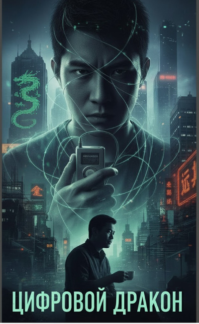

# Цифровой Дракон

## Аннотация

Они называют его "Сяолун" — Маленький Дракон. Гений, взломавший американскую корпорацию в пятнадцать лет просто ради искусства. Он думал, что он охотник, пока не попал в ловушку "Садовника" — его собственного куратора из спецслужб. Ему дали выбор без выбора: сгнить в тюрьме или стать оружием государства. Теперь он не человек, а Объект 73B9. Его талант — оружие, квартира на 45-м этаже — позолоченная клетка, а его работа — выполнять приказы. Атаковать врагов. Уничтожать идеалистов. Замедлять разработку жизненно важных вакцин.

Годы спустя, сломленный и выгоревший, Лю Вэй решает нанести ответный удар. Он тайно собирает архив, способный уничтожить его хозяев. Он думает, что борется за свободу, но чем глубже он копает, тем страшнее правда. Что, если его бунт — лишь ход в чужой, более крупной игре? Что, если его "побег" — это просто передача актива от одной спецслужбы к другой? В мире, где каждый — марионетка, дракону остаётся лишь один выбор. Сжечь шахматную доску дотла.

## Обложка

