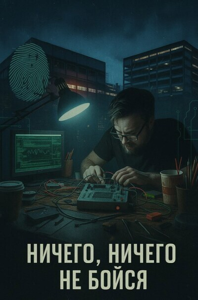

# Ничего, ничего не бойся

## Аннотация

Загнанный в угол хакер Женя думал, что взлом криптокошелька — это просто способ отдать долги. Он ошибся. Вместо денег он получил билет в один конец — в рабство к людям, для которых человеческая жизнь лишь строка в отчёте. Теперь его навыки — это его клетка, а каждый новый заказ погружает его глубже во мрак шантажа и убийств. Когда под ударом оказывается единственный близкий ему человек, у него остаётся лишь один выход: перестать быть инструментом и самому стать оружием. Но чтобы уничтожить систему, ему придётся стать страшнее её создателей.

## Обложка

### Глава 1

Глава 1

Скрежет металла по бетону — и старый мир замолчал. Женя толкнул тяжёлую створку гаражных ворот, впуская внутрь полосу стылого октябрьского сумрака, и тут же задвинул её обратно. Засов лёг в проушины с глухим, окончательным стуком. Он остался один. Здесь, в его логове, арендованном за немыслимые деньги боксе в глубине бирюлёвской промзоны, внешний мир переставал существовать. Он превращался в далёкий низкочастотный фон, в вибрацию, которую можно было игнорировать.

Воздух внутри был плотным, почти осязаемым. Единственным источником света была настольная лампа с тяжёлым основанием, её светодиоды били холодным, безжалостным лучом, выхватывая из темноты пятачок рабочего стола. Всё остальное тонуло в глубоких, маслянистых тенях: стеллажи с пластиковыми контейнерами, разобранные корпуса ноутбуков на полу, мотки проводов, похожие на гнёзда каких-то механических птиц.

Женя опустился на скрипнувший стул. Спина заныла тупой, привычной болью. Он бросил взгляд на часы в углу монитора. 23:50. Пятнадцатое октября. Он сидел здесь почти восемнадцать часов, прерываясь лишь на то, чтобы сходить до автомата с едой за батончиком, который на вкус напоминал прессованные опилки. Перед ним, под объективом старого советского микроскопа МБС-10, покоилась вскрытая плата аппаратного криптокошелька. Крошечный чёрный квадрат микроконтроллера STM32 был похож на застывшего жука. От его ножек к плате тянулись тончайшие, почти невидимые проводки — щупальца, которыми Женя пытался проникнуть внутрь кремниевого мозга.

Он повернулся к другому монитору. На чёрном фоне терминала светились зелёные строки его Python-скрипта. Это был его собственный, выстраданный инструмент, интерфейс к небольшой плате ChipWhisperer-Lite, его глитчеру. Оружие, бьющее не свинцом, а короткими, выверенными импульсами сбоя питания. Идея была проста и элегантна в своей грубости: в тот самый момент, когда процессор проверяет подлинность прошивки, нужно ударить по питанию. На несколько наносекунд уронить напряжение, заставить его ошибиться, пропустить проверку и позволить выполнить любой код. Например, код для полного дампа памяти.

Женя провёл костяшками пальцев по воспалённым глазам. Сотни попыток. Сотни неудач. Он уже перебрал все очевидные параметры. Ширину импульса, сдвиг относительно тактового сигнала, напряжение. Железка сопротивлялась. Она была сделана хорошо, с умом. Слишком с умом для того, чтобы это было «простым заказом», как расписывал Игорь.

Он поправил в коде ещё одну строчку. glitch․offset = 4820. Сдвиг на 4820 тактов. Ещё одна гипотеза, основанная на едва заметной аномалии, которую он разглядел на осциллографе час назад. Он нажал Enter. Щелчок клавиши прозвучал сухо и оглушительно. Плата глитчера тихо пискнула. Женя не дышал, приковав взгляд к осциллографу, где замерла жёлтая линия тактового сигнала и синяя — напряжения. Он ощущал, как мелкая вибрация от блока питания старого компьютера передаётся через стол в его застывшие на клавиатуре пальцы. Позвоночник пробило ледяным статическим разрядом. Ну же. Давай, тварь. Ошибись. Всего один раз. Точно так же он себя чувствовал в шестнадцать, ломая школьный сервер ради тройки по химии — та же смесь липкого страха и всепоглощающего азарта. Только тогда на кону стоял вызов родителей. Сейчас — жизнь.

Линия напряжения на осциллографе дрогнула, но осталась ровной. В окне терминала посыпались красные строки ошибок.

*[FAIL] Target did not glitch.*

Женя с глухим стуком опустил голову на стол. Холодный ламинат неприятно прилип ко лбу. Он закрыл глаза. В голове, на пределе слышимости, зазвучали слова. Не его слова. Чужие. Строчка из песни, въевшаяся в подкорку, как вирус. *«…ничего, ничего не бойся, ни огня, ни звенящую тень…»* Мантра. Успокоительное для бедных. Он повторял её про себя последние месяцы, с тех пор как его гениальный план по арбитражу крипты превратился в долговую яму с очень конкретными, нетерпеливыми кредиторами. Мантра не работала. Он прислушался к тишине за воротами. Каждый шорох заставлял мышцы спины каменеть. Телефон на столе лежал беззвучным хищником, и Женя боялся даже посмотреть на его тёмный экран. Он поднял голову. Проблема не в софте. Проблема в обвязке. В этих копеечных резисторах и конденсаторах вокруг чипа. Они сглаживали его импульс, гасили атаку. Ему нужны были компоненты с минимальным допуском. Прецизионные. А это означало только одно. Поездку в ад. Поездку в Митино.

Уведомление в Signal'е вырвало его из тяжёлой, вязкой дрёмы прямо за столом. Резкий, двукратный писк, специально настроенный на одного человека. На Игоря. Женя поморщился, словно от зубной боли, и разблокировал телефон. 11:00. 16 октября. Сообщение было предсказуемым до тошноты.

*«Ну че там, старый? Есть движение?»*

Женя смотрел на экран, чувствуя, как внутри закипает глухое раздражение. Он ненавидел эту манеру общения. Фальшивую свойскость, за которой всегда скрывалось только одно — требование. Он набрал ответ: «Работаю».

Через секунду телефон зазвонил. Игорь. Он не любил переписываться, ему нужно было слышать голос, давить, манипулировать. Женя сбросил вызов и написал: «Не могу говорить. Руки в флюсе». Ложь, конечно. Но само слово «контроль» приятно осело в мыслях, на секунду перекрыв привкус паники.

Игорь тут же переключился на голосовые.

— Братан, я понимаю, ты там колдуешь, все дела, — зазвучал из динамика быстрый, немного гнусавый голос Игоря. — Но ты пойми, клиент уже на нервяке. Там история такая… очень деликатная. Человек переживает за свои активы. Спрашивает меня каждые два часа. Что я ему должен говорить?

Женя слушал, и ему хотелось раздавить телефон. Он знал, что нет никакого «нервного клиента». Есть только Игорь, который хочет поскорее получить свой процент. И есть он, Женя, зажатый между технической проблемой и вполне реальной угрозой от тех, кому он должен.

Он записал ответное голосовое, стараясь, чтобы голос звучал ровно и устало.

— Есть нюанс. С защитой. Нужно кое-что докупить. Это займёт время.

Ответ Игоря прилетел мгновенно. Паузы в его речи были рассчитаны с точностью аптекаря.

— Старый… какой «нюанс»? Какой «докупить»? Мы же договаривались на три дня. Три дня уже прошли. Ты же понимаешь… чисто по-человечески… те ребята, которым ты торчишь, они ждать не любят. Они слов типа «нюанс» не понимают. Этот куш нам обоим нужен, братан. Очень нужен. Так что давай, поднажми там. Я в тебя верю.

Угроза, замаскированная под дружескую заботу. Фирменный стиль Игоря. Женя выключил телефон и швырнул его на диван. «Верю я в тебя». От этих слов в груди на миг возникло фантомное ощущение перегретого процессора — предвестника критической ошибки. Он знал, что это значит. Это значит, что Игорь уже рассказал тем ребятам, что у Жени появился крупный заказ. И теперь они ждут не только старый долг, но и долю с нового. Ловушка захлопнулась ещё плотнее.

Митинский радиорынок 17 октября встретил его серой моросью и запахом прелой пыли. Это место не менялось годами. Лабиринт из стеклянных павильонов под крышей гигантского ангара, где время застыло где-то в середине нулевых. Воздух был спёртым, пахло горячим пластиком, дешёвой едой из фудкорта и сотнями немытых тел. Вокруг двигалась плотная, бормочущая толпа: пенсионеры, искавшие детали для починки старого телевизора, студенты-радиолюбители, хмурые мужики в спецовках, скупавшие оптом кабели, и такие, как он — тени, ищущие специфический товар для неспецифических целей.

Женя двигался сквозь этот хаос, как ледокол. Он не видел лиц, не слышал обрывков разговоров. Его мозг работал в режиме сканера, отсекая всё лишнее, ведя его к одной-единственной цели — павильону номер триста двенадцать, затерянному в самой дальней и тёмной аллее. Там сидел Дед. У Деда не было имени, и никто не знал, откуда он берёт свой товар. Но у него всегда было то, что нужно. Настоящее. Не китайский новодел, перемаркированный в подвале.

Павильон был крошечной конурой, заваленной катушками с компонентами, коробками с разъёмами и старым измерительным оборудованием. За прилавком, склонившись над платой под огромной линзой с подсветкой, сидел худой старик в засаленной жилетке.

— Здорово, Дед, — бросил Женя, кладя на прилавок список.

Дед не поднял головы. Он молча взял бумажку, поднёс к лупе. Его губы беззвучно шевелились, проговаривая маркировки.

— Нужны SMD. Нули. Допуск — один процент. И вот эти, на ноль-один микрофарад, танталовые. Не китай, — добавил Женя, зная, что это ключевое.

Дед наконец оторвался от пайки. Он посмотрел на Женю поверх очков. Его глаза были блёклыми, как выцветшая фотография, но взгляд — острым и цепким. Он молча повернулся к стеллажам и начал вытаскивать маленькие бобины.

Женя ждал. Он ненавидел это место, но уважал его правила. Лишних слов тут не произносили. Только товар и деньги. Дед высыпал на антистатический коврик несколько лент с крошечными, как песчинки, резисторами и конденсаторами.

Женя достал из кармана куртки портативный LCR-метр, похожий на старый калькулятор. Он аккуратно отцепил один резистор, зажал его щупами. На экране высветилось значение. Идеально. Он проверил ещё несколько. Всё в пределах допуска. Это был его профессиональный протокол, въевшийся в плоть и кровь. Не доверяй никому. Проверяй всё. Даже если доверяешь источнику.

— Сколько?

— Пять, — буркнул Дед.

Пять тысяч за горсть радиодеталей, себестоимость которых была в сто раз меньше. Цена за качество и надёжность. Женя отсчитал мятые купюры. Расплачиваясь, он поймал себя на мысли. Вот эти крошечные кусочки керамики, металла и диэлектрика были честнее и надёжнее девяноста девяти процентов людей, которых он знал. Они либо работали в строгом соответствии со своей спецификацией, либо нет. Без лжи, недомолвок и предательства. Он ссыпал компоненты в маленький пластиковый пакетик и, не прощаясь, вышел из павильона, обратно в гудящую, пахнущую обманом толпу.

На обратном пути, уже у своей промзоны, он почувствовал, что силы его покидают. Голова гудела от недосыпа, а в желудке было пусто. Он зашёл в безымянную кофейню, зажатую между шиномонтажом и офисом по выдаче микрозаймов. Место было на удивление приличным: чисто, пахло не жжёным, а нормальным кофе, за стойкой стояла сонная бариста. Он взял большой капучино и уже собирался юркнуть за самый дальний столик, но, поворачиваясь от стойки, зацепился за чью-то сумку и качнулся вперёд.

Пластиковый стакан в его руке накренился, и горячая, липкая жидкость плеснулась наружу, расплываясь тёмным пятном на рукаве светлого пальто девушки.

— Отлично, блядь, просто отлично, — вырвалось у неё.

Женя замер, ожидая скандала. Но крика не последовало. Девушка — лет двадцати восьми, с уставшими, но ясными глазами и смешной родинкой над губой — посмотрела сначала на своё пальто, потом на него. Взяла салфетку, попыталась затереть пятно, но от этого оно стало только больше. Она зло махнула рукой.

— Да похуй уже.

Её реакция была настолько приземлённой и настоящей, что Женя растерялся.

— Я… простите. Очень… блин, я не хотел. Давайте я заплачу за химчистку, — пробормотал он, чувствуя себя полным идиотом.

— Забей, — она отмахнулась. — Всё равно день был паршивый и без этого пятна.

— Я Алина, — сказала она, не отрываясь от своего занятия.

— Женя.

Завязался короткий, неловкий, но на удивление простой разговор. Оказалось, она работает администратором в одном из офисов в этом же здании. «Перекладываю бумажки с места на место. Очень захватывающе». Он соврал, что чинит сложное оборудование в сервисе неподалёку. Это было даже не совсем враньё. Он впервые за много дней говорил с человеком, который от него ничего не требовал, не угрожал и не пытался им манипулировать. Она была… нормальной. Из того мира, где самой большой проблемой было пятно от кофе на пальто.

Она посмотрела на часы.

— Ладно, мне пора. Бумажки сами себя не переложат. Спасибо за кофе… в некотором роде.

Она ушла, оставив Женю стоять посреди кофейни. Он чувствовал себя так, словно его на несколько минут вытащили из мутной воды на свежий воздух. Этот короткий, случайный контакт с нормальной жизнью лишь острее подчеркнул, в какой глубокой, безнадёжной заднице он находится.

Прошли ещё два дня. Они слились в один бесконечный цикл из кофе, кода и запаха канифоли. Сон стал роскошью, которую он не мог себе позволить.

Двадцатое октября, 04:15. Мастерская. Тишина стала плотной, как диэлектрик, готовый вот-вот пробиться разрядом. Новые компоненты были на месте. Он припаял их под микроскопом. Руки мелко дрожали от усталости и кофеина, и ему пришлось прижать запястья к столу, чтобы зафиксировать паяльник. Каждое движение требовало чудовищной концентрации. Он действовал на чистом упрямстве, на последнем резерве нервной системы, игнорируя бунтующий организм.

Он запустил цикл перебора. На мониторе побежали строки лога. Плата ChipWhisperer-Lite методично щёлкала реле, отправляя один импульс за другим. [FAIL] Target did not glitch. Час сменял час. Он менял параметры в коде, сдвигая окно атаки на пикосекунды, варьируя длительность импульса, увеличивая количество повторов. glitch․repeat = 251. scope․adc․samples = 200. Запуск. Щелчок. Провал. Он чувствовал себя шахтёром, долбящим кайлом каменную стену в полной темноте, в надежде услышать другой звук.

Он уже потерял счёт времени и выпитым кружкам остывшего кофе, когда из-за скачка напряжения в сети на мгновение моргнул свет. Компьютер недовольно пискнул, но удержался от перезагрузки. А вот осциллограф сбился.

— Сука, — выдохнул Женя, запуская калибровку заново. Глаза горели, превратившись в два красных угля. Он действовал на автомате. И вот тогда, на четыреста семьдесят третьей попытке этого конкретного цикла, синяя линия напряжения на осциллографе дрогнула. Едва заметный провал, именно там, где он должен был быть. Длительностью в несколько наносекунд. Он почувствовал, как на мгновение прервался тактовый сигнал его собственного тела. Он перевёл взгляд на окно терминала. Красные строки ошибок прекратились. Курсор замер, а потом появилась новая строка. Белая на чёрном.

*[SUCCESS] Target glitched. Starting memory dump...*

Женя не закричал. Он не подпрыгнул на стуле. Он медленно откинулся на спинку, которая протестующе скрипнула. Он смотрел, как по экрану бегут ровные столбцы хекс-кода. 0x0000 0010 0020... Дамп памяти. Полный. Нефильтрованный. Он сделал это. Он вскрыл этот чёрный ящик. Это не было похоже на эйфорию. Скорее на глубокое, холодное, почти жестокое удовлетворение мастера, решившего невыполнимую задачу. Он победил. Он заставил этот кусок кремния и текстолита подчиниться его воле. В этот момент он забыл про долги, про Игоря, про страх. Был только он и взломанное железо. И этого было достаточно. Он выделил из потока данных нужный сегмент, декодировал его. На экране появились двадцать четыре английских слова. Seed-фраза. Ключ ко всему.

Двадцать первого октября, в час дня, они встретились на фудкорте торгового центра «Колумбус» на Пражской. Шумное, безликое, стерильное место, которое Женя ненавидел всей душой. Запах пережаренного масла, гомон сотен голосов, крики детей — всё это било по истерзанным нервам. Он сидел за липким столиком, поставив перед собой нетронутый стакан колы.

Игорь появился из ниоткуда, как всегда. Весёлый, суетливый, с подносом, на котором громоздился бургер и гора картошки фри.

— Старый, здорóво! Ну ты монстр! — он плюхнулся на стул напротив.

Женя молча подвинул по столу самую обычную, дешёвую USB-флешку. На ней не было ничего, кроме одного текстового файла. Результат почти недели бессонной работы, сотен провалов и одного триумфа. Его opus magnum.

Игорь схватил флешку и сунул в карман джинсов, даже не взглянув на неё. Словно это была не отмычка к чужой финансовой жизни, а чек из супермаркета.

— Красава! Я в тебе не сомневался! — он откусил огромный кусок бургера, говоря с набитым ртом. — Я знал, что ты его расколешь.

Женя смотрел на него и чувствовал, как внутри поднимается волна отвращения. Вся его титаническая работа, весь риск, всё его мастерство были для Игоря просто товаром, который можно быстро и выгодно продать.

— Деньги, — сказал Женя одно слово. Голос прозвучал хрипло и чужеродно.

— А, да, деньги! — Игорь проглотил и жадно запил колой. — Смотри, какая история… там у клиента очень хитрая проводка, через три банка, короче, для безопасности. Завтра к вечеру у тебя всё будет на карте. Железно. Я лично проконтролирую.

Он подмигнул, хлопнул Женю по плечу и вскочил.

— Всё, братан, мне лететь надо. Клиент ждёт. Ты — лучший!

И он растворился в толпе так же быстро, как и появился, оставив Женю одного. С его остывающей колой, запахом жира и тяжёлым, липким предчувствием, что его только что очень красиво и буднично кинули.

Вечер двадцать второго октября был тихим. Слишком тихим. Женя сидел в своей мастерской, тупо глядя в экран телефона. Он обновлял баланс в банковском приложении каждые пять минут. Пусто. Игорь не отвечал. Сообщения в Signal висели с одной галочкой — доставлено, но не прочитано. Предчувствие кристаллизовалось в холодную, злую уверенность: его отработали и выбросили. В голове крутилась одна мысль: что теперь говорить тем ребятам? Что денег нет и не будет? Это был смертный приговор.

В 21:30 в дверь постучали.

Этот стук не был похож ни на какой другой. Не неуверенное царапанье соседа, не торопливый стук курьера. Три коротких, твёрдых, уверенных удара. Словно стучали не костяшками пальцев, а кастетом.

Женя замер. К нему сюда никто и никогда не приходил. Это было его логово, его убежище. Адрес знал только Игорь. И…

Он медленно подошёл к двери. Сердце колотилось где-то в горле. Он посмотрел в глазок, но тот был залеплен жвачкой снаружи. Телефон в кармане коротко звякнул. Сообщение от неизвестного номера. «Открывай, Женя. Не глупи». Это был конец. Он медленно, как во сне, повернул засов.

На пороге стояли двое. Один терялся на фоне обшарпанной стены, второй, наоборот, впечатывался в память. Мужчина лет пятидесяти, коротко стриженный, с сединой на висках. Но дело было в его глазах. Абсолютно пустых. Бесцветных. Как у рыбы. В них не было ни злости, ни интереса, ни угрозы. В них не было ничего. От мужчины едва уловимо пахло оружейным маслом и холодом.

Они не сказали ни слова. «Седой» просто сделал лёгкий, едва заметный кивок головой в сторону выхода. В этом простом жесте была такая абсолютная, несокрушимая уверенность в подчинении, что у Жени перехватило дыхание. Он понял две вещи. Первая — сопротивляться не просто бесполезно, а смертельно опасно. Вторая — его проблемы только что вышли на совершенно новый уровень. Он молча шагнул за порог.

Его не везли в багажнике и не надевали мешок на голову. Всё было буднично и оттого ещё более жутко. Они сели в чёрный, безликий седан и поехали по ночной Москве. Женя сидел на заднем сиденье между двумя молчаливыми мужчинами. Он смотрел на проплывающие мимо огни и пытался заставить свой мозг работать, но в голове был только белый шум.

Машина остановилась у длинного, мрачного здания бывшего НИИ, от бетонных стен которого даже сквозь стекло веяло холодом и запустением. Такие здания раскиданы по всей Москве — умирающие динозавры, в чьих телах, как паразиты, гнездятся сотни мелких фирм. Его провели по гулким, пустым коридорам с полом из стёртой мраморной крошки. Пахло пылью и забвением. Они остановились у неприметной двери без таблички. «Седой» открыл её и пропустил Женю внутрь. За дверью мир треснул.

Это был не обшарпанный кабинет, а офис, словно сошедший со страниц журнала о дизайне. Идеально белый, стерильный. Минималистичная мебель из тёмного дерева и металла. Ни одной лишней детали, ни одной бумажки. Воздух был прохладным и пах чем-то неуловимо дорогим — смесью кожи и какого-то сложного парфюма. Контраст с его захламлённой мастерской, с вонючим Митинским рынком, с этими гулкими коридорами был оглушительным.

За огромным пустым столом сидел мужчина. Лет сорока пяти, в идеально белой рубашке без галстука. У него было спокойное, умное, почти профессорское лицо. Он выглядел не как бандит, а как топ-менеджер IT-корпорации или успешный венчурный инвестор.

— Евгений. Присаживайтесь, — сказал он тихо и вежливо. Голос был ровным, безэмоциональным. «Седой» и второй мужчина молча встали у стены за спиной Жени.

Женя сел на предложенный стул. Ноги его не держали.

— Чай, кофе? — предложил мужчина.

Женя отрицательно качнул головой.

— Меня зовут Павел. Можете считать меня вашим новым… куратором, — мужчина позволил себе едва заметную улыбку. — Прежде всего, хочу вас поблагодарить. Работа с кошельком была выполнена безупречно. Мы впечатлены.

Женя молчал. Он не понимал, что происходит.

— Кошелёк, с которым вы работали, — продолжил Павел тем же ровным тоном, — был, разумеется, пустым. Это была проверка ваших компетенций. Тестовое задание, если хотите. Вы его прошли. Более чем успешно.

Павел сделал паузу, давая словам впитаться. Женя почувствовал, как ледяная струйка пота потекла по его спине. Тестовое задание. Кошелёк был пуст. Вся его работа, весь риск — всё было фарсом.

— Теперь, — сказал Павел, переводя взгляд на экран ноутбука, стоявшего сбоку, — давайте обсудим условия вашего трудоустройства. Наш общий знакомый Игорь, к сожалению, неверно проинформировал вас о стоимости входа в нашу организацию. Это бывает. Он человек увлекающийся. Так вот, его комиссия, плюс расходы на вашу проверку, плюс стоимость компонентов, которые вы приобретали… — он снова сделал паузу, глядя на цифры на экране. — Итого, ваш текущий долг перед нами составляет три миллиона рублей. Считайте это… инвестицией в вашу будущую карьеру.

Женя открыл рот, чтобы что-то сказать. Возразить. Закричать. Но из горла не вырвалось ни звука. Он смотрел в спокойные, деловые глаза Павла, чувствовал за спиной ледяное дыхание «Седого» и понимал. Всё понимал. Это не был заказ. Это была вербовка. Его не кинули на деньги. Всё было гораздо хуже. Его купили. Вместе с его навыками, его будущим и его долгом, который только что вырос в десять раз. Он больше не был фрилансером, пытающимся выжить. Он стал собственностью. Активом. И на его лице, в холодном свете дизайнерской лампы, отразилось полное, сокрушительное, безмолвное осознание этого факта. Ловушка захлопнулась.

### Глава 2

Глава 2

Ночь не принесла забвения — лишь низкочастотный гул трансформаторной будки за окном и вязкое, как мазут, осознание реальности. Женя не спал. Он проваливался в короткие, липкие полузабытья, сидя прямо на рабочем стуле, и каждый раз его выбрасывало обратно в тускло освещённую мастерскую, в эхо чужих голосов в его собственном черепе. Разговор с Павлом прокручивался снова и снова, стираясь до бессмысленных обрывков фраз: «…ценный актив…», «…услуги по трудоустройству…», «…три миллиона…». Последняя цифра пульсировала в висках, глухая и неумолимая, как метроном, отсчитывающий его долг.

Он подошёл к двери, дёрнул ручку. Открыто. Какая разница. Его тюрьма теперь перемещалась вместе с ним. Его навыки, его гордость, его единственное, в чём он был уверен — всё это превратилось в звенья цепи, которую он сам себе и выковал.

К утру, когда серый, промозглый свет двадцать третьего октября начал проявлять разводы грязи на оконном стекле, от Жени-фрилансера не осталось ничего. Шок испарился, оставив после себя лишь выжженную пустоту. Страх никуда не делся, он просто осел на дно, превратился в холодный, тяжёлый ил, и теперь любое движение поднимало муть. Он больше не думал, как сбежать. Он думал, как выжить до вечера.

Резкая, дребезжащая вибрация на столешнице заставила его дёрнуться. Звук был чужой, мерзкий. Не его смартфон. Он медленно поднял голову. На краю стола, рядом с мотком припоя, лежал дешёвый кнопочный телефон, чёрный пластиковый обмылок. Седой оставил его вчера — просто положил, как кладут поводок рядом с собачьей миской.

Он смотрел на вибрирующий аппарат с ненавистью. Не средство связи. Ошейник. Он протянул руку, чувствуя, как не слушаются пальцы. Пластик, лёгкий и неприятно-шершавый, завибрировал в ладони, вызывая тошноту. Экран светился ядовито-синим, буквы были кривыми и пиксельными. От корпуса исходил едкий, химический запах массового производства где-то в Гуандуне. Во рту появился привкус озона, как от близкого короткого замыкания. Вспомнился первый мобильник, который ему купили родители. Тоже кнопочный. Тогда он казался ключом к свободе. Сейчас этот — ключ от его камеры.

Это был не входящий звонок. Это был текст в защищённом мессенджере с единственным контактом без имени. Никаких приветствий. Никаких знаков препинания, кроме точек. Сухой, как кость, приказ.

*Партия изделий у входа. Модификация прошивки. Снять ограничения геопозиционирования. Срок 26․10 18 00.*

Женя медленно опустил телефон. «Изделия». Канцелярский язык смерти. Он не ответил. Знал, что это и не требуется. Молча поднялся, чувствуя, как затекли ноги. Подошёл к входной двери, и потянул ручку на себя. Дверь открылась беззвучно.

На пыльном бетонном полу коридора стояла большая картонная коробка, перетянутая жёлтым скотчем. Он ухватился за края, крякнув от напряжения, и втащил её внутрь. Дверь за ним захлопнулась. Щелчок замка прозвучал как точка.

Борьба закончилась. Началась работа.

Следующие трое суток превратились в один длинный сеанс самозабвения. Нужно было работать, чтобы не думать. Чтобы услужливый мозг перестал подсовывать картины будущего.

Внутри коробки, уложенные в пенопластовые лотки, лежали двадцать одинаковых квадрокоптеров. Потребительский ширпотреб. Женя аккуратно разобрал первый. Его взгляд сразу зацепился за полётный контроллер. STM32F4. Старый знакомый. Он поднёс плату под микроскоп, выискивая сервисные контакты. Пять крошечных медных пятачков. JTAG-интерфейс. Его входной билет в мозг устройства.

Он закрепил плату в держателе и припаял к контактам тонкие проводки. Вся его жизнь, все годы, потраченные на изучение схемотехники, на оттачивание навыков, — всё это привело его сюда, в эту грязную комнату, где он по приказу невидимых хозяев ковыряет копеечные дроны.

Он подключил программатор к ноутбуку. Экран заливал его лицо холодным белым светом, подчёркивая круги под глазами. Воздух в комнате был спёртым, пах канифолью, пылью и его собственным несвежим потом.

*openocd -f interface/stlink-v2․cfg -f target/stm32f4x․cfg*

На чёрном экране побежали строки лога. Связь с ядром установлена. Он запустил отладчик GDB. Теперь он был внутри. Он сделал полный дамп прошивки. Правило номер один: всегда делай бэкап. Это заняло около двадцати минут. Двадцать минут он просто сидел и смотрел на медленно ползущую полосу прогресса, слушая тиканье часов в своей голове. Три миллиона. Минус шестьсот тысяч, если он сделает эту работу. Два миллиона четыреста тысяч.

Затем началась самая нудная часть. Реверс-инжиниринг. Час за часом он продирался сквозь тысячи строк ассемблерного кода, пытаясь найти логику, отвечающую за геолокацию. Производитель заложил программные ограничения: дрон не должен был взлетать в определённых зонах. Его задача была найти эти проверки и вырезать их.

Несколько часов работы ушли впустую. Прошивка была написана хитрее, чем он ожидал, с антиотладочными трюками. Глухая ярость грозила сжечь предохранители в мозгу. Он сжал кулаки так, что побелели костяшки, и заставил себя сделать десять медленных вдохов. Паника — это DDoS-атака на собственный мозг. Нельзя.

Он сменил тактику. Отследить, кто и когда обращается к GPS-модулю. Он нашёл в документации адреса регистров порта UART, к которому был подключён приёмник, и поставил точку останова на чтение. Сработало. Через полчаса программа остановилась именно там, где нужно. Он оказался в середине неизвестной функции, которая получала координаты. Картина начала проясняться. Вот она. Проверка.

Вырезать её было бы грубо. Женя решил поступить изящнее. Он напишет короткий GDB-скрипт, который будет ждать, пока программа дойдёт до нужного места. Прямо перед проверкой он на лету изменит несколько байт в оперативной памяти, подменив реальные координаты на «безопасные» — например, на точку в чистом поле где-нибудь под Рязанью. Проверка пройдёт успешно, а после неё скрипт вернёт всё как было. Чистая работа. Невидимый патч, существующий лишь доли секунды.

Он потратил ещё час на написание и отладку. Наконец, всё было готово. Моторы дрона, подключённые к лабораторному блоку питания, на мгновение дёрнулись и затихли. Сработало.

Он откинулся на спинку стула. Призрак былой гордости за хорошо сделанную работу на мгновение коснулся его. Но тут же растаял, оставив горький привкус. Он создал элегантное, красивое решение. Изящный эксплойт. И всё это для того, чтобы какая-то мразь могла беспрепятственно возить через границу наркотики или оружие. Он открыл глаза и посмотрел на оставшиеся в коробке девятнадцать дронов. Впереди ещё очень много работы.

К вечеру двадцать пятого октября Женя чувствовал себя выжатым. Четыре стены давили. Ему нужно было доказательство, что мир за пределами его стен всё ещё существует. И память, против воли, подсунула единственное место, где это доказательство можно было найти.

Он не надеялся её встретить. Это было бы слишком похоже на кино. Он просто хотел выпить кофе, который не он сам заварил. Кофейня встретила его теплом и запахом выпечки. Он встал в короткую очередь. И тут он её увидел.

Алина сидела за столиком у окна, читая книгу. На мгновение Женя застыл. Одна его часть хотела немедленно развернуться и уйти, не втягивать этот единственный светлый образ в свою грязь. Но другая, изголодавшаяся по простому человеческому теплу, уже сделала шаг в её сторону. Она подняла глаза и улыбнулась. Эта простая, искренняя улыбка ударила по нему сильнее, чем любой приказ Павла. Он подошёл к её столику, чувствуя себя неуклюжим. От усталости на секунду повело, и ему пришлось опереться о спинку соседнего стула.

— О, привет! Снова здесь? — её голос был тёплым. — Решил сделать перерыв?

— Привет. Да… типа того, — выдавил он, стараясь, чтобы голос не дрожал. — Завал небольшой.

— Работа кипит, значит? А что чинишь, если не секрет? Всё время такой… сосредоточенный, как будто бомбу разминируешь.

Она засмеялась. Его плечи сами собой расслабились. Он лихорадочно искал ответ. Ложь. Только ложь. Стена, которую он должен был выстроить между ней и собой. Он сел на стул напротив. От её волос исходил едва уловимый запах чего-то цветочного, который резко контрастировал с въевшимся в его одежду запахом пайки.

— Медицинское оборудование, — слова полились сами. — Томографы… платы управления. Сложное всё. Ответственность большая.

— Ух ты. Серьёзно, — в её глазах промелькнул неподдельный интерес. — Наверное, очень интересно. Жизни спасаете, можно сказать.

— Не то слово, — криво усмехнулся он. Эта фраза обожгла совесть.

Разговор продлился ещё минут пятнадцать. Она рассказывала про свою работу, про смешной случай с курьером. Он больше слушал, вставляя односложные фразы. Он впитывал её нормальность. Каждое её слово было для него глотком чистого, но отравленного воздуха. Отравленного его собственной ложью. Когда он уходил, он не обернулся. Он только что погрелся у чужого огня, зная, что от него самого несёт гарью. И от этого чувствовал себя ещё более грязным, чем раньше.

Вечером двадцать шестого октября, когда Женя заканчивал паковать последний дрон, его личный смартфон ожил. На экране высветилось имя: «Игорь». Женя замер. Этот человек продал его. Сдал в рабство. И теперь он звонит. Он сбросил вызов. Через десять секунд телефон зазвонил снова. Снова сбросил. На третий раз он понял, что это бесполезно, и ответил.

— Старый, здорóво! — голос Игоря в трубке был таким же бодрым. От этой фальшивой дружелюбности у Жени свело скулы. — Не отвечаешь, занят, поди? Слышал, ты там… пристроился. Как оно?

Женя молчал.

— Ты чего молчишь-то? Обиделся, что ли? — в голосе Игоря проскользнули смешки. — Брось, братан, это бизнес. Я тебе, можно сказать, работу нашёл. Стабильную.

— Что тебе нужно, Игорь? — голос Жени прозвучал глухо и хрипло.

Пауза на том конце провода длилась всего секунду.

— Да так, просто узнать, как дела, — тон Игоря стал чуть серьёзнее. — И совет дать. Чисто по-человечески. Ты это, молодец, конечно, работаешь. Но ты там по кофейням особо не шляйся. Павел не любит, когда его „активы“ отвлекаются. Особенно на девочек-администраторов. У него везде глаза. И уши. Понимаешь, о чём я?

Теперь всё встало на свои места. Это был контрольный выстрел. Ему отрезали все пути к отступлению. Игорь был не просто вербовщиком. Он был ещё одним надсмотрщиком. Мысль о том, что за ним следят, до этого бывшая лишь фоновым шумом, вдруг стала физически ощутимой. Они слушают его личный телефон. Возможно, в мастерской жучки. Он один. Полностью один. В прозрачной клетке.

— Понял, — коротко ответил Женя.

— Вот и молоде-е-ец, — голос Игоря снова стал елейным. — Ладно, не буду отвлекать. Работай.

Короткие гудки.

Двадцать шестого октября, за час до назначенного срока, он заклеил коробку. В половину шестого он уже был по адресу, который прислали на кнопочный телефон. Промзона на окраине города. Он нашёл нужный склад. Постучал. Лязгнул засов, и в проёме появился Седой. Молча кивнул, пропуская Женю внутрь.

Внутри было холодно и гулко. Под высоким потолком горела одна тусклая лампа. Воздух пах сыростью и застарелой металлической пылью. Женя поставил тяжёлую коробку с дронами на бетонный пол. Седой подошёл, срезал скотч, вынул один дрон, осмотрел его и так же молча положил обратно. Кивнул. Развернулся и пошёл к выходу.

— А… деньги? — вырвалось у Жени прежде, чем он успел подумать.

Седой остановился, не оборачиваясь.

— Жди, — бросил он через плечо и вышел. Железная дверь за ним захлопнулась.

Женя остался один. Прошло десять минут. Пятнадцать. Холод пробирал до костей. Начинала нарастать паника. Его кинули. Снова. В кармане завибрировал кнопочный телефон.

*Принято. Качество удовлетворительное. Твой долг 2 400 000 руб.*

Женя смотрел на экран. Он перечитал сообщение три раза. Двадцать дронов. Трое суток ювелирной работы. И за всё это ему не заплатили ни копейки. Ему «простили» шестьсот тысяч из трёх миллионов выдуманных рублей. Он понял. Денег не будет. Никогда. Он не отрабатывал долг. Он просто работал бесплатно. И это никогда не кончится. Позвоночник пронзил холод системного сбоя. Осознание пришло без эмоций, как диагноз. Он раб. И это навсегда.

Он всё ещё тупо смотрел на экран, когда телефон снова завибрировал. Новое сообщение.

*Объект Решетников Сергей Игнатьевич. Замначальника департамента. Автомобили Genesis, Land Cruiser. Задача разработать и подготовить устройство для скрытого перехвата данных контакты файлы звонки с личного телефона Объекта при подключении к мультимедиа системе по Bluetooth. Срок на подготовку 48 часов.*

Женя медленно поднял голову. Предыдущая работа была разминкой. Просто безликие «изделия». А теперь появилось имя. Конкретный человек. Это был уже не серый импорт. Это был шантаж. Слежка. Это была грязь, в которую его окунали с головой. И апатия на его лице медленно сменилась чем-то новым — холодным, сосредоточенным ужасом человека, который понял, что только что сделал первый шаг в следующий, ещё более глубокий круг ада.

### Глава 3

Глава 3

Время потеряло привычные ориентиры, рассыпалось на неравные отрезки, отмеченные не часами, а доставкой еды в безликих бумажных пакетах и сменой дня и ночи за грязным окном. Женя выучил распорядок промзоны по звукам: утренний грохот мусоровоза, дневной визг циркулярной пилы из соседнего ангара, вечерний скрип ржавых ворот. И ночное, вязкое безмолвие, нарушаемое лишь монотонным гудением трансформатора в блоке питания.

Он спал на старом диване, пропахшем пылью и машинным маслом, урывками по три-четыре часа. Просыпался от малейшего шороха, сердце билось о рёбра частым, паническим кодом, и он долго лежал, вслушиваясь в темноту. Апатия первых дней сменилась чем-то иным — функциональным, выхолощенным цинизмом. Он больше не прокручивал в голове планы побега. Он принял правила игры. Он был в клетке, и единственное, что он мог контролировать — это порядок внутри неё.

Он разобрал и пересортировал все свои компоненты. Разложил по ячейкам резисторы, отделив углеродные от металлоплёночных. Систематизировал микроконтроллеры по архитектуре: ARM, AVR, ESP. Протёр от пыли каждый инструмент. Эта методичная, бессмысленная работа успокаивала, создавала иллюзию контроля посреди хаоса его рухнувшей жизни. Он похудел. Острая линия скул проступила на лице, под глазами залегли глубокие тени. Движения стали экономными, резкими, как щелчок реле. Он больше не был жертвой в состоянии шока. Он был заключённым, выучившим тюремный распорядок.

Он почти не пользовался своим смартфоном, боясь, что любой контакт будет отслежен. Только раз в два дня коротко писал матери, что всё в порядке. Каждое слово в этих сообщениях было ложью, и от этого на языке оставался привкус старой монеты. Он заставил себя перестать думать об Алине. Она была из того, другого мира, которого для него больше не существовало. Любая мысль о ней была подобна прикосновению к оголённому проводу — короткая вспышка боли, после которой темнота казалась ещё гуще.

Кнопочная Nokia лежала на углу рабочего стола. Почти две недели она молчала, и это молчание было страшнее любых угроз. И когда утром девятого ноября телефон коротко завибрировал, Женя не вздрогнул. Он просто протянул руку и нажал на зелёную кнопку. Он был готов.

Звонок был без номера. Голос Игоря, подчёркнуто бодрый, прозвучал в трубке чужеродно, как рекламный джингл на похоронах.

— Жень, привет! Как жизнь молодая? Слушай, есть работа. На твой личный ноут сейчас упадёт архивчик, пароль — дата твоего рождения, только год наоборот. Разберёшься. Всё, будь на связи.

Короткие гудки. Женя медленно положил телефон. Он — функция.

Ноутбук пискнул, извещая о новом файле. Архив весил чуть больше гигабайта. Палец замер над тачпадом. Холод, знакомый с детства, поднялся изнутри — точно так же, как когда отец заставлял его лезть в тёмный, сырой погреб за картошкой. Тот же иррациональный, липкий страх перед неизвестностью. «Просто открой, — приказал он себе. — Это просто данные. Нули и единицы. Ты — просто отвёртка. Отвёртка же не виновата, если ей проломят череп, верно?»

Двойной щелчок. Он ввёл цифры. Архив распаковался в папку с длинным, бессмысленным названием. Внутри — подробнейший OSINT-отчёт. Объект: Решетников Сергей Игнатьевич, 48 лет. И дальше — вся его жизнь, вывернутая наизнанку.

*«ADDRESSES». Адрес прописки в панельке у метро «Беляево». Адрес фактического проживания. Адрес загородного дома.*

*«VEHICLES». Сканы ПТС на служебный Genesis и личный Land Cruiser жены.*

*«ROUTINE». Таблица с распорядком дня. 8:15 — отвозит дочь в школу. 19:30 — покидает офис.*

*«FAMILY». Подпапка с данными на жену и дочь.*

Женя открыл её, и на него хлынуло чужое, украденное счастье.

Десятки фотографий из социальных сетей. Вот Решетников, лысеющий, с уставшей улыбкой, обнимает жену на фоне моря. Вот они втроём, с дочкой-подростком, у мангала. Девочка, лет шестнадцати, с брекетами на зубах, корчит рожицу в камеру. Обычные люди. Живые.

Женю затошнило. Он резко ударил по тачпаду, закрывая окно. Вскочил, прошёлся по комнате, от стены до стены. Пять шагов туда, пять обратно. Это не безликий криптокошелёк. Это — люди. И он сейчас, своими руками, будет ломать их жизнь.

Он вернулся к ноутбуку. Рука сама потянулась к колонкам. Щелчок. Из динамиков ударил индустриальный скрежет Einstürzende Neubauten. Женя выкрутил громкость на максимум. Этот звуковой шторм был его щитом. Под этот аккомпанемент он открыл папку «COMPROMAT». Сканы документов о незадекларированной недвижимости. Данные биллинга о звонках любовнице. Скрины мутных переписок. Он вчитывался, заставляя себя видеть в Решетникове не отца семейства, а коррумпированного чиновника. Не человека, а цель. Набор уязвимостей. Вибрация от музыки подняла в воздух пыль. Она медленно танцевала в косом луче света, оседая на экран. Прямо на лица людей, чью судьбу он теперь держал в руках.

Ночь с десятого на одиннадцатое ноября. Мастерская залита холодным светом светодиодной лампы. Работа была его наркотиком, способом сбежать в мир, где всё подчинялось законам физики и логики.

На столе перед ним лежал дешёвый китайский OBD-II сканер. Он зажал корпус в тисках и взял в руки бормашину. Инструмент ожил с пронзительным визгом. Запахло палёным пластиком. Он аккуратно, миллиметр за миллиметром, вырезал внутренности корпуса, стараясь не повредить защёлки.

Когда полая оболочка была готова, он приступил к самому тонкому этапу. Сердцем устройства должен был стать Raspberry Pi Zero. К нему — Bluetooth-модуль с модифицированной прошивкой, способный эксплуатировать уязвимость BlueBorne. Женя склонился над микроскопом. Зажал в пинцете эмалированный провод толщиной с человеческий волос. В другой руке — паяльник с игловидным жалом. Затаив дыхание, он поднёс жало к контактной площадке. Секунда. Капелька припоя сверкнула и застыла. Один контакт готов. Осталось ещё семь.

Тепло от паяльника коснулось щеки. В нос ударил резкий, кисловатый запах флюса. Под микроскопом он видел, как флюс кипит, оставляя блестящую лужицу припоя. Глаза слезились от напряжения. Пальцы на мгновение дрогнули, и капля припоя легла чуть левее. «Блядь». Он счистил её оплёткой и снова сосредоточился. «Главное — не перегреть, — твердил он себе. — Дыши ровно. Это просто медь, олово и кремний». Полная концентрация вытеснила тревогу.

Через час монтаж был завершён. Женя уложил платы внутрь синего корпуса, залил их термоклеем и щёлкнул крышкой. Снаружи — обычный сканер. Внутри — троянский конь.

Он подключил устройство к ноутбуку. Чёрный экран терминала осветил его уставшее лицо. Побежали строки загрузки кастомной сборки Kali Linux. Женя запустил скрипт. На его тестовом смартфоне тут же появилось уведомление: «Устройство Audi MMI запрашивает сопряжение». Он нажал «Принять». На экране ноутбука появилась новая строка:

*[+] Connection established. Service SDP exploited.*

*[+] BNEP session opened. Gaining control...*

*[+] Shell access granted. Welcome to the machine.*

Успех. Он получил полный удалённый доступ к своему телефону. Профессиональная гордость вспыхнула и тут же погасла под волной омерзения. Он создал идеальное оружие для вторжения в чужую жизнь.

Его взгляд упал на личный смартфон. Пропущенный звонок от Алины, ещё вчерашний. А что он ей скажет? «Извини, был занят, паял жучок для бандитов»? Он набрал сообщение:

*«Привет. Прости, завал на работе. Очень сложное оборудование. Как буду свободнее, наберу».*

Ложь стала такой же привычной, как дыхание.

На следующий день, около двух, кнопочный телефон снова ожил. Сообщение: *«14:30. Ворота».*

В двадцать пять минут третьего Женя уже стоял у выезда из промзоны. Ноябрьский ветер был колючим и злым. Низкое серое небо давило на грязные крыши ангаров. Пахло сыростью, соляркой и безнадёжностью. В кармане лежал завёрнутый в антистатический пакет его «сканер».

Ровно в 14:30 из-за поворота выехал чёрный Land Cruiser. Машина подкатила к воротам, не заглушая двигатель. Тонированное заднее стекло поползло вниз. Внутри сидел Седой. Он не поздоровался. Просто посмотрел на Женю и протянул руку ладонью вверх.

В этом жесте было всё: приказ, пренебрежение, полное отрицание в Жене человека. Он был функцией. Женя подошёл к машине, достал пакет и вложил его в протянутую руку. Пальцы Седого были холодными и твёрдыми.

Седой молча кивнул. Стекло поползло вверх, отражая серое небо и ссутулившуюся фигуру Жени. Внедорожник плавно тронулся с места, обдав его веером грязной воды из лужи. Механизм был запущен.

Ожидание растянулось на сутки. Наконец, вечером двенадцатого ноября, на экране вспыхнуло уведомление.

*[+] Device online. Target Bluetooth detected.*

Женя подскочил к столу. Сердце заколотилось. Он запустил основной эксплойт. Несколько секунд, и на экране появилась уже знакомая строка:

*Shell access granted.*

Он внутри. Он получил доступ к телефону чиновника. Он видел всю его файловую систему. Пальцы замерли над клавиатурой. Он не хотел быть читателем. Он — архиватор.

Он запустил скрипт. Программа начала методично копировать всё содержимое телефона в зашифрованный архив на удалённом сервере.

*[+] Archiving complete. 5․7 GB copied.*

Женя отправил ссылку на скачивание на номер, указанный Игорем. Всё. Его часть работы была закончена. Он тяжело опустился на диван.

Надежда, что всё закончится быстро, умерла через три часа. Кнопочный телефон завибрировал. Сообщение от Павла. Женя открыл его, и воздух вышел из лёгких одним свистящим комком.

*«Объект упёрся. Говорит, компромат — подделка, платить не будет. У него серьёзная крыша. Готовься к плану Б».*

План Б. Это звучало как приговор. Провал шантажа означал эскалацию.

На следующий день, в полдень, телефон зазвонил. Номер Павла.

— Да, — сказал Женя.

— Евгений, — голос Павла был спокоен, деловит. — Наш клиент оказался крепким орешком. Придётся усилить аргументы. У него есть сын от первого брака. Кирилл, двадцать лет. Студент. Наш курьер встретится с парнем завтра вечером и передаст ему небольшой пакет с веществами. В этот момент его примут наши партнёры в штатском. Для папы это будет убедительно.

Женя молчал, чувствуя, как внутри будто провернулся заклинивший механизм.

— Твоя задача, Евгений, — продолжил Павел, — обеспечить техническое сопровождение. Утром тебе доставят компоненты. Соберёшь IMSI-перехватчик. Наш человек подойдёт к объекту в университете и обеспечит сигнал. Твоя задач — поймать его телефон и запустить эксплоит. Нам нужны будут его координаты в реальном времени. У нашего курьера будет дешёвый смартфон. Ты обеспечишь удалённое наблюдение через его камеру. Нам нужно видеоподтверждение. Всё ясно?

— Павел Игоревич, — выдавил Женя, — это же… это уже не по моей части. Я технарь, я не…

— Ты не закончишь эту фразу, Евгений, — голос Павла стал плоским и твёрдым. — Твоя часть — это то, что я сказал. Или мы начинаем списывать твой долг по-другому.

Снова пауза. Длинная, звенящая.

— Например, с твоей новой знакомой. Алина Вересова, верно? У неё очень милые фото в сети. Не хотелось бы, чтобы с ней случайно что-то случилось на тёмной улице. Работает она допоздна, я знаю.

Всё вокруг исчезло. Остался только плоский, деловитый голос Павла в ухе и гул крови в висках. Алина. Они знали. Он сам, идиот, нарисовал на её спине мишень.

— Ты меня понял? — в голосе Павла не было вопроса.

Женя закрыл глаза. Перед ним встало её лицо. Её улыбка. И он понял, что у него нет выбора.

— Принято.

— Вот и хорошо, — сказал Павел и повесил трубку.

Женя так и сидел с телефоном в руке. Он только что согласился стать соучастником в подставе, в сломанной жизни двадцатилетнего парня. И сделал это, чтобы спасти девушку, которой врал с первой минуты. Что-то оборвалось в груди, заставив его согнуться и беззвучно хватать ртом воздух.

Вечер четырнадцатого ноября был тёмным и сырым. Женя сидел перед ноутбуком, вглядываясь в два окна. В левом — карта города с медленно ползущей красной точкой. Кирилл Решетников. В правом — чёрный прямоугольник с надписью «Waiting for connection...». Телефон курьера. Сявы.

В 19:42 правое окно ожило. Появилось дёрганое, смазанное изображение из нагрудного кармана. В кадре — кусок грязного асфальта, мыски стоптанных ботинок. Звук был ужасным: треск, порывы ветра, хриплое дыхание Сявы. Женя был там, в этом кармане.

Красная точка на карте замерла у входа в сквер. Через минуту в объективе камеры показались джинсы и кроссовки. Цель.

— Э, парень, — донёсся из динамиков сиплый голос Сявы.

В кадре появился Кирилл. Обычный студент в дешёвой куртке. Он вытащил один наушник.

— Чего?

— Тебе тут… просили передать.

— Ты кто такой? Отойди, — парень инстинктивно сделал шаг назад.

Сява шагнул вперёд и попытался сунуть свёрток в карман куртки парня.

— Да ты бери, тебе говорят!

Но Кирилл резко оттолкнул Сяву.

— Ты что творишь, нарик?! Пошёл на хер!

Свёрток выпал. Началась короткая, нелепая потасовка. Камера моталась из стороны в сторону. Экран превратился в калейдоскоп из смазанных пятен. Из динамиков неслись крики, мат, звуки ударов.

И вдруг, на долю секунды, хаос замер. В кадре мелькнула рука Сявы. В ней что-то тускло блеснуло. Лезвие. Короткое лезвие дешёвого складного ножа.

Раздался короткий, влажный вскрик. Парень исчез из кадра. Камера качнулась, показывая убегающие ноги Сявы, а потом упала объективом вверх, пока на линзу не хлынуло что-то тёмное.

Экран почернел.

*CONNECTION LOST.*

Звуки пропали. Мир оглох. Женя сидел, не двигаясь, и смотрел на чёрный экран. Кровь. Он навёл на человека убийцу. Он — соучастник.

Оцепенение прервал резкий звонок кнопочного телефона.

— Да.

Голос Павла. Такой же спокойный.

— Наш курьер — идиот. Перестарался. Стирай всё. Живо.

Гудки.

Женя посмотрел на свои руки. Они тряслись. Он сжал их в кулаки, с такой силой, что ногти впились в ладони. Боль отрезвила.

Он заставил себя работать. Пальцы, всё ещё подрагивая, забегали по клавишам. Техническая рутина. Подключиться к VPN-серверу.

*ssh root@temp-vpn-server*

Пароль. Enter.

*./wipe_logs․sh*

Скрипт отработал за три секунды. Логи были затёрты нулями.

*[DONE]*

Другой терминал. Он подключился к GSM-шлюзу, через который поддерживал связь с устройством, и отправил серию низкоуровневых команд, инициирующих протокол экстренной очистки. Через несколько секунд устройство перестало отвечать

*[OK]*

Удаление почтового ящика. Удаление аккаунта на хостинге. Он действовал как робот. Каждый стёртый лог был ещё одним узлом на петле, которая затягивалась на его шее. Он спасал свою шкуру, привязывая себя к Павлу уже не долгом, а кровью.

Когда последняя команда была выполнена, он откинулся на спинку стула. Цифровых следов не осталось. Он сидел в полной тишине, нарушаемой только шелестом кулера его ноутбука. Экран погас. В тёмной поверхности он увидел своё отражение. Бледное, измождённое лицо с огромными, пустыми глазами. Он не узнавал этого человека.

В голове, как заевшая пластинка, зазвучали строки из песни. Голос Шклярского, глухой и отстранённый:

*…И утром кровью своей умойся…*

*…И ничего, ничего не бойся…*

Раньше эти слова казались ему романтической метафорой. Сейчас он понял их буквальный, леденящий смысл. Он умылся. И бояться было уже поздно.

### Глава 4

Глава 4

Три недели спрессовались в один длинный, серый выдох. Время потеряло привычные деления, превратившись в вязкую массу из запаха канифоли, мерцания экранов и глухого стука крови в висках. Шок, заморозивший Женю в ту ночь, когда он стирал чужую кровь с цифровых носителей, постепенно оттаял. Он не принёс облегчения — лишь холодную, липкую паранойю. Она пропитала стены мастерской, осела тонким слоем пыли на платах.

Это осознание не сломало его, а выжгло изнутри всё лишнее: надежду, страх, остатки брезгливости. Цинизм, раньше бывший защитной оболочкой, стал его скелетом.

Он почти не выходил. Еду оставляли у порога в безликих бумажных пакетах. Сон превратился в короткие, тревожные провалы в темноту, из которых выдёргивал любой резкий звук. Он просыпался с гулким стуком сердца в ушах, и перед глазами стояла одна и та же картинка — смазанные красные пиксели на записи с телефона Сявы, расползающиеся в абстрактное пятно.

Он больше не ждал, что его отпустят. В таких системах не было выхода. Единственный путь лежал не наружу, а дальше, в самую сердцевину мрака. И эти три недели он не просто ждал. Он готовился. Одержимо, методично, он превращал свою клетку в крепость, пытаясь вернуть иллюзию контроля над единственным, что у него осталось — цифровым пространством.

Вибрация кнопочного телефона на столе была резкой, неприятной, как укус насекомого. Женя вздрогнул. На примитивном экране высветилось СМС от безымянного номера, который система Павла использовала для отчётов о переводах.

Он протянул руку к телефону. Яркий белый свет ударил по уставшим глазам. В воздухе висел густой, смолистый запах флюса. Он слышал только низкочастотный рокот вытяжки и собственное дыхание, ставшее вдруг прерывистым.

Плата за кровь. Мысль пришла без злости, просто как констатация факта. Позвоночник пробило ледяным разрядом, знакомым предвестником катастрофы. От цифр на экране во рту появился отчётливый привкус дезинфекции, как в больничном коридоре. На экране высветилась сумма: 250 000. Но Женя не видел цифр. Пиксели, формировавшие их, на мгновение слились в его сознании в то самое расплывчатое красное пятно с видеозаписи. Кровь на асфальте. Он моргнул, и наваждение исчезло, но тошнота осталась.

Он отшвырнул телефон на стол, будто тот был раскалённым. Деньги, его первоначальная цель, теперь вызывали только физическое отвращение. Это были не деньги, а ошейник, отлитый из презрения. Он вскочил, опрокинув стул. В груди теснило, воздуха не хватало. Ему нужно было двигаться, подчиняясь почти животному инстинкту — смыть с себя грязь.

Он натянул толстовку, накинул капюшон и выскользнул из промзоны. Каждый прохожий казался наблюдателем, каждая машина — постом наружки. Он нырнул в метро, растворяясь в толпе. Сорок минут в грохоте поезда — и он вынырнул в стерильный мир торгового центра. Не глядя на витрины, прошёл в магазин электроники, выбрал самый дешёвый и безликий ноутбук и заплатил наличными. Отказался от пакета, сунул коробку под мышку и тем же путём вернулся в свою нору.

Там, в мастерской, начался параноидальный обряд. Первым делом, он разобрал корпус. Аккуратно отсоединил шлейф веб-камеры и выпаял чип микрофона, оставив на плате лишь обугленные точки контактов. Физическое устранение угрозы.

Затем он вставил флешку. Ему было мало просто защищённой системы. Он открыл терминал. Команда dd if=/dev/urandom of=/dev/sda заполнила весь жёсткий диск случайным шумом. Этого было бы достаточно для большинства. Но не для него. Он запустил утилиту shred для многопроходной перезаписи диска. Процесс занял остаток дня и почти всю ночь, но для него это было необходимой медитацией, ритуалом изгнания.

Наконец, на идеально чистый диск он установил Qubes OS — систему, построенную на принципах тотальной изоляции. Каждый аспект его будущей цифровой жизни был разложен по отдельным, не связанным друг с другом виртуальным машинам. Он создал лабиринт, цифровую матрёшку, где ядро было защищено десятком слоёв паранойи.

Он сидел перед экраном с идеально настроенной, стерильной системой. Он вернул себе контроль. Но когда он откинулся на спинку стула, экран погас, и в его чёрной, глянцевой поверхности отразилось лицо. Небритое, с глубокими тенями под глазами, с мёртвым, пустым взглядом. Лицо загнанного зверя, который построил себе очень надёжную клетку. Изнутри.

Звонок кнопочного телефона прозвучал на следующий день, в 13:05. Он уже научился различать его короткую, злую, требовательную вибрацию.

— Павел Игоревич ждёт через час, — голос Седого был ровным, как озвучка юридического документа, сгенерированная нейросетью. Короткие гудки.

Час спустя он сидел в том же стерильном офисе. Пространство давило своей идеальностью. Воздух пах чем-то медицинским, и от этого запаха сводило зубы. Всё здесь было создано для того, чтобы подчеркнуть: ты — грязь, микроб, попавший в операционную.

Павел вошёл бесшумно, сел в кресло и несколько секунд молча смотрел на Женю. Его взгляд был тяжёлым, изучающим, как у патологоанатома перед вскрытием.

Всю дорогу Женя повторял про себя одну фразу, вбивая её в мозг: «Я больше не буду». Он сглотнул, чувствуя, как пересохло во рту, и заставил себя заговорить. Голос прозвучал хрипло.

— Я больше не буду на вас работать.

Тишина в кабинете стала почти осязаемой. Сердце забилось частым, рваным ритмом. Он вцепился пальцами в джинсы, чтобы они не дрожали.

— Я отработал то, что был должен, — продолжил он. — С лихвой. Я хочу, чтобы вы меня отпустили.

Павел не улыбнулся. Он медленно выдвинул ящик стола и достал несколько листов бумаги.

— Интересная точка зрения, Евгений, — его голос был тихим и спокойным, как у лектора. — Давай рассмотрим твою ситуацию с юридической, а не с эмоциональной стороны.

Он взял верхний лист.

— Вот отчёт о несанкционированном доступе к защищённому аппаратному устройству. Статья двести семьдесят вторая Уголовного Кодекса. До двух лет.

Он перевернул страницу.

— А вот это уже интереснее. Модификация программного обеспечения двадцати летательных аппаратов. Содействие контрабанде. Статья двести двадцать шесть точка один. От трёх до семи. Уже теплее.

Женя молчал. Холод расползался по его телу, парализуя конечности.

Павел перевернул ещё один лист.

— Но главный ваш актив, Евгений, это, конечно, вот это. — Он постучал ногтем по бумаге. — Организация слежки за государственным служащим. И, что важнее, то, что было потом. Покушение на убийство, совершённое группой лиц по предварительному сговору. Это часть третья статьи тридцатой и пункты «ж», «з» части второй статьи сто пятой. От восьми до двадцати лет. Или пожизненное. Ты, Евгений, обеспечивал техническое сопровождение. Ты был соучастником. И, в отличие от какого-то торчка, которого так и не нашли, твоё участие полностью задокументировано.

Он пододвинул листы к Жене. Распечатки логов VPN-сервера, через который Женя подключался к телефону Сявы. С его IP-адресом. С временными метками. Его цифровая подпись под приговором. Он понял. VPN-сервер с самого начала был ловушкой. Его скрипт отработал в пустоту, все логи в реальном времени дублировались на другой сервер.

— Ты ведь умный парень, Евгений, — продолжил Павел всё тем же тоном. — Ты должен понимать, что такие улики не пропадают. Они хранятся. И единственный человек, который может их… потерять, — это я. А теперь скажи мне, ты всё ещё считаешь, что что-то там «отработал»?

Женя смотрел на распечатки. Он сам затянул на своей шее петлю. А Павел просто держал в руках табуретку. Он молча встал. Ноги были ватными. Он развернулся и, не глядя на Павла, пошёл к двери.

— Рад, что мы пришли к взаимопониманию, — донеслось ему в спину.

Выйдя из офисного центра, Женя шёл, не разбирая дороги. Внутри была выжженная пустота. Ему до физической боли нужно было увидеть нормального человека. Он достал свой личный смартфон, нашёл её номер. Алина. И нажал на вызов.

Полчаса спустя они сидели в кофейне у метро. Алина пришла первой. В светлом пальто она выглядела здесь как экзотический цветок в придорожной канаве. Когда Женя вошёл, она улыбнулась, но улыбка тут же погасла.

— Женя, господи… Что с тобой? — спросила она.

— Всё нормально, — соврал он.

— Не ври мне. Я же вижу. У тебя проблемы?

И его прорвало. Слова полились сбивчивым потоком.

— Алин, я… там всё не так. Не ремонтник я. Понимаешь? Это… это были долги. Большие. Я думал, быстро сделаю одну работу, и всё. А оно закрутилось, и те люди… они не отпускают просто так.

— Женя… кто «они»? — в её голосе появилась тревога. — Это… бандиты?

Он поднял на неё взгляд. В её глазах был не сочувствие, а страх. Она смотрела на него, как на дикого, непредсказуемого зверя.

— Хуже, — выдохнул он. — Тебе нужно держаться от меня подальше. Правда. Забудь мой номер. Так будет… безопаснее. Для тебя.

Алина молчала. Она смотрела на него долгим, внимательным взглядом, и он видел, как в её глазах исчезает теплота, уступая место осторожности. Она медленно откинулась на спинку стула, физически увеличивая расстояние между ними.

— Я… я поняла, — сказала она наконец. Голос был ровным, но напряжённым.

— Прости.

— Мне нужно идти. — Она встала, взяла сумку. Не посмотрела на него. — Мне нужно подумать.

Дверь звякнула колокольчиком и захлопнулась. Женя остался один. Он только что сам, своими руками, сжёг последний мост, который связывал его с миром живых.

За сутки пустота внутри стала абсолютной.

Вечером зазвонил его личный смартфон. «Игорь». В груди на миг стало пусто. Он ответил.

— Старый, здорóво! — голос Игоря был до тошноты бодрым. — Живой там?

— Чего тебе? — хрипло спросил Женя.

— Слушай, до меня тут слухи дошли… — Игорь понизил голос. — Что у тебя там проблемы. Что этот Паша совсем озверел. Это правда?

Женя молчал.

— Молчание — знак согласия, да? — хмыкнул Игорь. — Смотри, я всё знаю. Про Решетникова, про его сынка. Знаю, что всё пошло по одному месту и что тебя крайним пытаются сделать. Паша не остановится. Сегодня ты ему нужен, а завтра он тебя спишет как ненужного свидетеля. Короче. Есть серьёзные люди. Конкуренты Паши. Они готовы очень хорошо заплатить за такого специалиста, как ты. Обеспечат крышу, новые документы, вывезут из страны.

Последовала театральная пауза.

— Что им нужно? — выдавил из себя Женя.

— Всего лишь информация, — радостно сообщил Игорь. — У Паши скоро намечается одна крупная операция. Что-то связанное с IT-инфраструктурой одной компании. Просто сольёшь нам все детали. И всё. Ты свободен и богат. Ну что скажешь?

Женя сбросил вызов и швырнул телефон на диван. Предложение было слишком идеальным, чтобы быть правдой. Его паранойя кричала, что это ловушка.

Он понял. Ему не предлагают сбежать. Ему предлагают заменить одну клетку на другую. Игорь не спаситель. Он провокатор. Страх и апатия испарились. Осталась только холодная, звенящая ярость. И азарт. Он больше не будет пешкой. Он взломает эту игру.

Ночь превратилась в марафон по цифровым задворкам. Женя работал на своём новом, стерильном ноутбуке, в изолированной виртуальной машине, подключённой к сети через цепочку из VPN и Tor.

Начальная точка была слабой — старый счёт-фактуру от Игоря. Команда exiftool invoice_114․docx. В метаданных, в поле «Автор», стоял никнейм: lemur_77. Он начал «пробивать» этот ник. Старые, заброшенные аккаунты на хакерских форумах. Мелкая сошка. Тупик.

Он зашёл с другой стороны. Игорь Лемешев. В гигантском дампе базы данных крупного интернет-магазина он нашёл строку: Игорь Лемешев, номер телефона, и старый e-mail на Mail․ru. В логине этого e-mail был тот самый ник: lemur_77. Связь подтвердилась. Он прогнал адрес через сервисы проверки утечек и нашёл его в дампе данных одного из сервисов доставки еды. Эта почта была привязана к другому, более свежему никнейму: I_Lem.

Поиск по I_Lem дал результат. Упоминание на одном закрытом форуме, посвящённом «недружественным поглощениям». Кэш Google помнил всё. Женя открыл сохранённую копию одной из веток форума.

Он читал — и воздух в лёгких будто превратился в ледяную крошку. Пользователь I_Lem обсуждал с другими участниками логистический бизнес Павла. Он описывал его слабые места. Он писал о «токсичном активе», который Павел недавно приобрёл — о «железячнике», которого можно использовать для атаки на инфраструктуру конкурентов. Он писал о себе.

А потом он нашёл диалог I_Lem с другим пользователем. Они обсуждали план. Спровоцировать Павла на агрессивные действия. Заставить его атаковать их «клиента», используя «железячника». А когда атака начнётся, сдать Павла силовикам вместе со всеми потрохами, а его бизнес — забрать себе.

Женя откинулся на спинку стула. В ушах звенело. Картина сложилась. Игорь — провокатор. Наживка. Его, Женю, использовали как таран, которым собирались проломить ворота, чтобы потом сжечь вместе с остальным мусором. Его вели на убой.

* * *

Седой сидел за рулём старой «Тойоты», припаркованной через дорогу от типовой девятиэтажки. Рядом с ним на пассажирском сиденье сидел молодой парень, которого он про себя называл «Бычок». На телефон Седого пришло сообщение от Павла. «Объект говорил с Лемешевым. Актив скомпрометирован. Предупреждение проигнорировано. Активируй рычаг».

— Пора, — сказал он Бычку.

Алина шла от магазина, неся пакет с продуктами. Она не заметила, как спереди ей перегородил дорогу высокий парень.

— Девушка, не подскажете… — начал Бычок.

Она вытащила один наушник. И в этот момент Седой подошёл сзади.

Всё заняло семь секунд.

Одна его рука зажала ей рот. Вторая, со шприцем-тюбиком, резко вонзилась ей в бедро через ткань пальто. Алина дёрнулась от укола и попыталась закричать, но хватка была железной. Через несколько секунд ноги стали ватными, в глазах потемнело, тело её обмякло. Они подхватили её под руки и быстро, без суеты, потащили к машине. Дверь захлопнулась.

* * *

Тишину в мастерской нарушал только треск остывающего паяльника. Женя сидел перед монитором, на котором всё ещё был открыт форум с сообщениями Игоря. Он был опустошён.

Резкая вибрация кнопочного телефона на столе заставила его вздрогнуть. На экране горела иконка входящего MMS. Внутри всё оборвалось, оставив звенящую пустоту. Он открыл сообщение.

Фотография. Алина. Она сидела на металлическом стуле. Руки связаны за спиной. Рот заклеен широким серым скотчем. Глаза, широко раскрытые, были полны ужаса. Мозг Жени, цепляясь за детали, чтобы не сойти с ума, зафиксировал фон: облупившаяся зелёная краска на стене, кусок ржавой водопроводной трубы.

Телефон снова завибрировал. Новое сообщение. От Павла.

*«Твой актив стал слишком рискованным. Докажи его ценность».*

Женя смотрел на буквы, не сразу понимая смысл. Актив. Он назвал его активом.

Третья вибрация. Третье сообщение.

*«Сделай то, что просит твой новый друг. Мы посмотрим».*

И в этот момент до него дошло. Весь ужас замысла. Он предупреждал. Он не послушал. Теперь Павел перешёл от слов к делу. Его звонок Игорю. Они знали. Они всё это время знали. И позволили этому случиться. Это не просто шантаж. Это была проверка. Чудовищная, дьявольская проверка на лояльность. Ему приказывали совершить предательство, зная, что это предательство. Ему приказывали залезть в петлю, которую для него приготовили другие, просто чтобы доказать, что его поводок достаточно крепок.

Он сидел в полной тишине, освещённый только светом экрана, на котором было лицо Алины. Его рука, державшая телефон, начала мелко, неконтролируемо дрожать. Он был в ловушке. И каждый следующий шаг вёл к катастрофе. Для всех.

### Глава 5

Глава 5

Двенадцать часов. Двенадцать часов назад он был рабом. Теперь он был оружием, нацеленным в самого себя.

Время не текло — оно застыло вязкой, холодной каплей перегретого припоя. Женя сидел на продавленном стуле в центре своей мастерской, единственной вселенной, которая у него осталась. На мониторе ноутбука светилась фотография. Алина. Снимок из какой-то социальной сети, сделанный, наверное, прошлым летом. Она щурилась от солнца, в волосах запутался блик, уголки губ приподняты в улыбке, которая ничего не требовала и ничего не обещала. Живая. Настоящая. Рядом, на заваленном обрезками проводов и конденсаторами столе, лежал кнопочный телефон. Его экран не гас. На нём была другая Алина. Снимок, сделанный в полумраке, вероятно, подвала или багажника. Зернистый, низкого разрешения. Лицо бледное, глаза широко раскрыты от ужаса, смазанного и искажённого дешёвой матрицей камеры. Рот заклеен серым скотчем.

Контраст между двумя изображениями не выжал слёз. Не скрутил живот от гнева. Вместо этого по телу разлился холод, как от укола анестетика. Плечи свело, каждый мускул напрягся до звона, превращая тело в чужой, неподатливый механизм. Дыхание стало ровным и неглубоким. Лишние мысли — о страхе, о сомнениях, о совести — схлынули, будто их и не было. Осталась только схема.

Низкий, едва различимый вой вентиляторов в блоках питания всегда был фоном его жизни, успокаивающим шёпотом машины. Теперь в этом монотонном гуле слышался скрежет отказа. Женя медленно перевёл взгляд с одного лица на другое. С живого на то, что могло стать мёртвым из-за него. Он не думал о том, как её спасти. Он думал о том, как уничтожить причину. Как сжечь до основания мир, в котором фотография живого человека могла так легко превратиться в фотографию заложника.

*«Ничего, ничего не бойся, ни огня, ни звенящую тень…»*

Строки из песни, его мантра, всплыли в сознании. Но теперь это был не шёпот самоуспокоения. Это был приказ. Прямой, как инструкция в ассемблере. Страх был роскошью, параличом. А ему нужно было двигаться, думать, действовать. Он понял с абсолютной, ужасающей ясностью: чтобы вытащить её из их мира, ему нужно было стать страшнее этого мира. Не умнее, не хитрее. Именно страшнее.

Он протянул руку не к клавиатуре, а к простому листу бумаги, вырванному из блокнота. Взял шариковую ручку. Пальцы, привыкшие к тончайшей работе с микросхемами, держали её крепко, без единой дрожи. На бумаге он начал рисовать схему. Не электрическую. Схему взрыва. Простые прямоугольники. В одном он написал: «Игорь». В другом: «Павел». От «Игорь» шла стрелка к блоку «Доступ / Имплант». От «Павел» — стрелка к «Охрана / Геолокация». И от обоих этих блоков жирные, надавленные до разрыва бумаги стрелки сходились в центре, в одном-единственном слове, обведённом в неровный круг: «ХАОС».

Это был не план побега, а проект управляемого сноса. Он не искал дверь. Он закладывал взрывчатку под несущие стены. Он смотрел на эту примитивную схему несколько минут. В этих грубых линиях и наспех написанных словах спрессовалось всё, что вело его: ужас за Алину, ненависть к её мучителям, презрение к самому себе. Всё это переплавилось в холодный алгоритм. Потом он аккуратно свернул лист вчетверо. Положил его в старую металлическую пепельницу, полную серых окурков. Щёлкнула зажигалка. Оранжевый язык пламени коснулся края бумаги. Она нехотя задымилась, потом вспыхнула. Женя не отводил глаз, наблюдая, как чёрные края пожирают белое поле, как буквы его плана сворачиваются и исчезают. Едкий, горький запах горелой бумаги на мгновение перебил привычный запах канифоли и пыли. Так пахли сожжённые мосты, прошлое, обращённое в пепел. Когда остался только серый, невесомый пепел, он поднялся. Оцепенение прошло. Внутри остался только холод обесточенной схемы. Время снова пошло.

Следующий день он провёл в ритуальной подготовке. Он не спал. Еда — батончик мюсли, запитый холодной водой из-под крана. Он не отвечал на сообщения, которые изредка вибрировали на кнопочном телефоне. Он знал, что это Павел проверяет поводок. Пусть. Инструмент, который слишком долго считали неодушевлённым, готовился вонзиться в руку хозяина.

Ровно в 12:30 следующего дня, 19 ноября, он взял в руки свой личный смартфон. Тот самый, что стал уликой, маячком, по которому его вели. Теперь он станет инструментом. Перед тем, как набрать номер Игоря, Женя проделал странную вещь. Он несколько раз глубоко вдохнул и выдохнул, а потом пробежал на месте, прямо в мастерской, пока сердце не заколотилось в рёбрах, а дыхание не сбилось. Он вспомнил липкий, животный ужас из первого разговора с Павлом, вкус желчи во рту после того, как Сява ударил ножом сына чиновника. Он не просто собирался играть страх. Он вызывал его физиологический отпечаток в своём теле. Голос не должен был лгать.

Он нажал на вызов. Гудки. Длинные, тягучие. Наконец, на том конце ответили.

– Да, – голос Игоря был настороженным.

– Игорь… это Женя, – выдавил он. Дыхание было прерывистым, как он и хотел.

– Женя? А, Старый. Чего тебе? Я тут слегка занят.

Женя прикрыл глаза, представляя себе Игоря. Тот наверняка сидит в каком-нибудь хипстерском кафе, лениво помешивая свой раф, на лице — маска превосходства.

– Игорь, у меня пиздец, – прохрипел Женя, вкладывая в голос всю отрепетированную панику. – Полный. Павел… он всё знает. Про наш разговор. Про всё.

На том конце повисла пауза. Женя слышал, как где-то на фоне у Игоря играет какая-то ненавязчивая музыка.

– Так, спокойно, – тон Игоря сменился. Исчезла вальяжность, появилась деловитая сосредоточенность. – Что значит «всё знает»? Конкретнее.

– Он мне вчера звонил. Он… он знает, что ты мне предлагал. Сказал, что я крыса. Что он меня в асфальт закатает, если я… – Женя намеренно оборвал фразу, громко сглотнув. – Мне кажется, за мной уже едут. Меня сейчас закроют. Навсегда.

– Так, стоп, без истерики, – Игорь явно пытался оценить ситуацию. Он не мог понять, ловушка это или реальная паника. Женя сделал ставку на его эго. Игорь считал себя кукловодом. Куклы не могут лгать так убедительно. – Никто за тобой не едет. Если бы хотели закатать, уже бы закатали. Он тебя пугает.

– Да какое пугает! – почти взвизгнул Женя. – У него люди… они… неважно. Игорь, мне нужен выход. Прямо сейчас. Тот, о котором ты говорил. Я согласен. Я всё сделаю. Только вытащи меня отсюда.

– Вот это уже другой разговор, – в голосе Игоря проскользнуло удовлетворение. Он попался. – Я же тебе говорил, Старый, с нами надёжнее. Паша — он вчерашний день, динозавр.

– Мне похуй, какой он день! – рявкнул Женя, добавляя в голос истерические нотки. – Что делать надо? Скажи, я сделаю.

– Успокойся для начала. Задача та же. Нужно положить их инфраструктуру. Полностью. Чтобы они очухались только через неделю, когда от конторы останется одно название.

– Хорошо. Я сделаю. Но… – Женя сделал паузу, набирая в грудь воздуха. Это был ключевой момент. – Но мне нужна гарантия.

– Какая ещё гарантия? Лучшая гарантия — это деньги, которые ты получишь, и билет куда-нибудь в тёплые края.

– Нет! – отрезал Женя. – Я не верю ни тебе, ни твоим людям. После того, как вы меня кинули с кошельком…

– Это были дела Паши… – начал было Игорь.

– Мне плевать! – перебил Женя. Он чувствовал, как по спине стекает уже не воображаемый, а настоящий, холодный пот. – Я сделаю, но на моих условиях. Мне нужен прямой доступ к их главному серверу. SSH. С рут-правами. Без всяких посредников и логов. Чтобы я мог залить всё напрямую и сам же подчистить за собой. Я не доверяю твоим хакерам, они меня сольют первому же менту.

На том конце снова воцарилась тишина. На этот раз дольше. Он слышал только стук крови в ушах. Секунды застывали, не желая сменяться. Он запросил ключ от замка. Это было нагло, рискованно. Это звучало как паранойя загнанного в угол специалиста, который доверяет только своему коду. Именно на это и был расчёт.

– Прямой доступ… – протянул Игорь. Он явно взвешивал риски. – Это серьёзно, Старый. Ты понимаешь, что если ты там накосячишь…

– Я не накосячу! – в голосе Жени прозвучала оскорблённая гордость технаря. – В этом я уверен. А вот в людях — нет. Либо так, либо ищите другого. Но тогда я расскажу Павлу всё. Про тебя, про твоих клиентов. Мне уже терять нечего.

Это был блеф. Но блеф, подкреплённый правдоподобным отчаянием. Женя ждал, вцепившись в телефон так, что пальцы побелели.

– Ладно, – наконец сказал Игорь. В его голосе слышалось раздражение, смешанное с презрением к этому истеричному «паяльнику». – Хрен с тобой. Ты его получишь. Считай это жестом доброй воли. Данные доступа — IP, порт, ключ — скину в течение суток в зашифрованном сообщении. Будь наготове. И не делай глупостей.

– Я жду, – коротко бросил Женя и нажал отбой.

Он опустил телефон. Маска ужаса стекла с его лица, оставив после себя холодное, неподвижное выражение. Он не чувствовал триумфа. Он чувствовал, как последняя дверь за ним захлопнулась. Он только что добровольно шагнул в самое пекло. Но теперь у него в руках был детонатор.

IP-адрес, который ему дадут, — это, скорее всего, внешний Linux-шлюз, точка входа. Но вся ценная информация — бухгалтерия, клиентские базы, почта руководства — наверняка крутится внутри, в корпоративной сети на Windows. Просто сжечь шлюз было бы бессмысленно и глупо. Нужно было пробить эту внешнюю оболочку и ударить в самое сердце — в Windows-инфраструктуру.

Следующие сорок часов превратились в один длинный, лихорадочный спринт. Сон стал абстракцией, а топливом служили кофеин и адреналин. Мастерская из тюрьмы превратилась в лабораторию по созданию оружия массового поражения. Женя работал на своём новом, «стерильном» ноутбуке, который до этого казался ему параноидальной игрушкой. Теперь это был единственный инструмент, которому он доверял.

Он проектировал имплант, цифрового змея, который должен был не просто укусить, а отравить всю систему. Работа разделилась на две части. Первая, видимая, была рутиной. Он писал основной модуль — шифровальщик — на языке Go. Это было быстро и эффективно. Он не стал изобретать велосипед, а взял готовую, проверенную криптографическую библиотеку для шифрования AES-256. На экране мелькали знакомые строки кода, циклы, обрабатывающие файлы, функции генерации ключей. Эта часть работы была для Игоря и его людей. Она должна была выглядеть как обычный ransomware-вымогатель. Он даже добавил в код создание файла README․txt с издевательским сообщением о выкупе. Пусть думают, что дело в деньгах.

Но настоящая работа кипела глубже. Вторая, скрытая функция — модуль утечки и хаоса. Его он писал на C, языке, близком к железу, языке абсолютного контроля. Это была ювелирная работа, требующая предельной концентрации. На экране сменяли друг друга фрагменты кода, похожие на заклинания: CreateProcess, VirtualAllocEx, WriteProcessMemory. Он не просто писал программу. Он создавал вирус, который должен был внедриться в память одного из системных процессов Windows, lsass․exe, чтобы обойти все антивирусные проверки и системы обнаружения вторжений. Он бормотал себе под нос, комментируя каждую строчку: // найти PID процесса..., // инжектить шелл-код..., // обойти EDR хуки через прямой системный вызов... Архитектура Windows не была для него совсем чужой - когда-то он писал и кастомные драйверы. Принципы оставались теми же, что и при взломе прошивок: найти точку входа, внедрить свой код и замести следы. Просто вместо регистров контроллера — вызовы системных API. Другой синтаксис, та же суть.

Он не писал код с нуля — на это ушли бы недели. Он вскрывал свои старые "консервы": готовый модуль шифровальщика, который он когда-то написал для исследования, и универсальный инжектор. Следующие сорок часов ушли на то, чтобы связать их воедино, адаптировать под новую цель и стереть все цифровые "отпечатки пальцев".

В какой-то момент, уже под утро второго дня, он зашёл в тупик. Его код раз за разом вызывал сбой в тестовой виртуальной среде. Процесс, в который он пытался внедриться, падал, оставляя в системном журнале отчёт об ошибке. Он бился над этой проблемой несколько часов. Глаза покраснели и болели от напряжения. Комната наполнилась запахом дешёвого энергетика и отчаяния. Он в ярости ударил кулаком по столу. Инструменты на верстаке подпрыгнули и звякнули. Неужели всё зря? Неужели он споткнётся на этой последней, самой важной миле?

Он встал, прошёлся по крохотному пространству мастерской. Взгляд упал на осциллограф. На его экране застыла зелёная линия — кардиограмма мёртвого чипа. И тут пришло решение. Простое, грубое, лишённое изящества. Он слишком увлёкся идеей остаться невидимым. Но зачем? После того, как бомба взорвётся, скрытность потеряет всякий смысл. Он вернулся к ноутбуку и стёр несколько сотен строк сложного кода, отвечавшего за стелс-инъекцию. Вместо этого он написал более простой, но «шумный» загрузчик, который создавал новый системный сервис. Да, это оставит следы. Но к тому моменту, когда их найдут, искать уже будет некому.

Под утро 20 ноября он скомпилировал финальную версию. Файл payload․exe. Двести пятьдесят шесть килобайт сжатого хаоса. Он посмотрел на иконку файла на рабочем столе. Маленький, неприметный значок. Цифровой эквивалент чемоданчика с красной кнопкой. Он опустил взгляд на свои руки. Пальцы мелко дрожали, а в затылке тупой, тяжёлой волной нарастала усталость. Он создал монстра. Осталось только спустить его с цепи.

Пока компилировался код, Женя не сидел без дела. Он готовил второй фронт. Ещё несколько недель назад, во время работы над дронами, он получил доступ к некоторым внутренним документам Павла. Справочники, счета на закупку корпоративных смартфонов — десяток одинаковых, дешёвых аппаратов одной модели. Среди документов был список личных номеров его ближайших подчинённых, включая двух постоянных охранников, которые сейчас, скорее всего, и держали Алину. Он ждал момента, чтобы использовать эти номера. Момент настал.

Он сел за свой старый компьютер. В одной из зашифрованных папок у него хранились «консервы» — эксплойты нулевого дня, уязвимости в популярных устройствах, которые он находил сам или покупал на теневых форумах. Это был его неприкосновенный запас, его пенсия. Каждый такой эксплойт стоил десятки, а то и сотни тысяч долларов. И сейчас он собирался сжечь один из самых ценных.

Он выбрал уязвимость в прошивке сотового модема, который использовался в определённой модели телефонов — той самой, что была у охранников. Это был болезненный компромисс, как если бы он отрезал себе палец, чтобы выбраться из капкана. Но Алина стоила дороже. Он модифицировал код эксплойта, добавив в него небольшую полезную нагрузку. Затем, используя анонимный SMS-шлюз, он отправил на номера охранников специально сформированное сервисное сообщение. Оно выглядело как обычное обновление от оператора. Но внутри был его код.

Владельцы телефонов ничего не заметили. Но на его удалённом сервере, спрятанном за несколькими слоями прокси, в лог-файле появились две новые строчки. Эксплойт сработал. Он не давал полного контроля над устройствами — это было слишком рискованно и могло быть обнаружено. Он давал нечто более ценное: доступ к сырым данным о геолокации. Телефон, даже не используя GPS, постоянно общается с базовыми станциями сотовой сети. Эксплойт перехватывал идентификаторы этих станций (Cell ID) и раз в пять минут отправлял их на сервер Жени.

Это были просто строки цифр, бессмысленные для непосвящённого. Но для Жени это была карта. Он на скорую руку написал скрипт на Python, который брал эти идентификаторы, сверял их с публичными базами данных расположения сотовых вышек и выводил на примитивную карту Москвы примерные координаты. На чёрном экране его ноутбука появились две маленькие, зелёные, мигающие точки. Его глаза в темноте. Они ещё хаотично двигались по городу, выполняя какие-то поручения. Но Женя знал: когда начнётся хаос, все они поедут на базу. И он будет видеть, куда именно.

*21 ноября, 13:45.*

Воздух в комнате безымянного хостела на Каширке был тяжёлым от запаха старого курева. На коленях у Жени лежал ноутбук, подключённый к публичной Wi-Fi сети через цепочку из VPN и Tor. Он собирался подключиться к внешнему Linux-шлюзу, который ему сдал Игорь. Оттуда нужно было пробиться во внутреннюю сеть Windows.

Палец замер над кнопкой Enter. Где-то там, в этом городе, в подвале сидела Алина. Где-то там сидел Павел. Где-то там пил свой смузи Игорь. Он одним движением собирался обрушить все их маленькие миры. На мгновение ему стало жаль безымянного системного администратора. Потом это прошло.

Он выдохнул. И нажал.

На чёрном экране побежали строки. Он подключился к Linux-шлюзу и, используя avml, сделал полный дамп оперативной памяти. В холодном массиве данных он нашёл то, на что надеялся: в памяти ещё хранились учётные данные недавнего подключения к внутреннему файловому серверу Windows — логин и пароль в открытом виде.

Он загрузил на шлюз свой payload․exe и утилиту PsExec, после чего сформировал финальную команду:

*./psexec․py administrator:'Pas$word123_x'@10․1․1․5 -c /tmp/payload․exe*

Эта команда, используя найденные учётные данные, подключалась к внутреннему Windows-серверу, копировала на него payload․exe и запускала его с правами администратора.

*[+] Service thugsrv installed*

*[+] Service thugsrv started*

*[+] Service thugsrv removed*

*Process started with PID 4112.*

*Connection to 10․1․1․5 closed.*

Первые пятнадцать минут ничего не происходило. Женя сидел, уставившись в экраны. На одном был открыт лог его сервера. На другом — карта. На третьем — тот самый теневой форум. Тишина давила. А что, если он ошибся?

И тут началось.

Сначала на мониторе с логами сервера. Его имплант начал свою работу. Шифровальщик методично, файл за файлом, пожирал данные.

*INFO: Encrypting \\FS01\Shares\Accounting\2024_report․xlsx... OK*

*INFO: Encrypting C:\Users\P․Volkov\Documents\internal\clients․db... OK*

*INFO: Encrypting \\BACKUPSRV\Daily\full_backup_nov․tar․gz... OK*

Одновременно с этим сработал второй модуль. На сервер Жени потоком пошли данные. Сжатые архивы с бухгалтерией, перепиской, базами данных. Его скрипт начал автоматически выкладывать их на форум. Появился пост, который он написал заранее: «Данные ОПГ 'Логистик-П' (Павел) и их конкурентов 'СеверТранс'. Внутри — чёрная бухгалтерия, схемы обнала. Отдельный привет 'двурушнику' Игорю Лемешеву (его контакты, фото, переписка с обеими сторонами прилагается). Веселитесь».

На форуме, который обычно жил своей неспешной жизнью, взорвалась бомба. Женя смотрел, как под его постом появляются первые комментарии.

*«OMG, это правда?»*

*«Качаю. Если фейк — бан автору.»*

*«Пиздец. Там вся бухгалтерия Паши.»*

*«Лемешева на ножи! Сука двуличная!»*

Он представил, как сейчас разрываются телефоны. Как Павел, увидев, что его финансовые тайны вывалены на всеобщее обозрение, приходит в холодную ярость. Как его конкуренты понимают, что их данные тоже утекли и что их подставили. И как Игорь Лемешев, звезда подпольных переговоров, осознаёт, что он стал целью номер один для обеих сторон. Он не просто стравил их. Он показал всем, что король — голый, а его соперники — такие же. И что посредник, которому все доверяли, — предатель.

Он переключился на карту. И увидел то, чего ждал. Две зелёные точки, которые до этого вяло перемещались по разным районам, замерли на мгновение, а потом резко изменили курс и с большой скоростью устремились в одну область на юго-востоке Москвы. В Капотню. Они ехали на базу. Собирались либо прятать концы в воду, либо эвакуироваться. План работал. У него было окно. Может быть, час. Может быть, меньше.

Промзона в Капотне встретила его ноябрьской сыростью и запахом мазута. Женя пробирался вдоль бетонного забора, увенчанного ржавой колючей проволокой. Он был одет во всё тёмное, неприметное. В рюкзаке за спиной лежал не ноутбук, а моток провода, мощный фонарь и нож. Не для боя. Чтобы резать верёвки.

Карта привела его к цели: приземистому складу из грязного силикатного кирпича, похожему на гнилой зуб в ряду таких же промышленных коробок. У ворот стояли две машины, ещё одна, с работающим двигателем, нервно разворачивалась. Он слышал приглушённые, яростные крики изнутри. Его враги были заняты. Они рвали друг другу глотки, пытаясь понять, кто кого предал, и спасая то, что ещё можно было спасти.

Женя обошёл здание сзади. Он нашёл то, что искал: старый, вросший в стену металлический щиток пожарной сигнализации. Петли проржавели. Он поддел дверцу отвёрткой. Она поддалась с громким скрежетом. Внутри была примитивная плата, покрытая слоем пыли, и путаница проводов. Он не стал разбираться в схеме. Он просто достал кусок провода, зачистил концы ножом и замкнул два самых толстых контакта на клеммной колодке.

Секундная задержка. И потом оглушительно, на всю промзону, взвыла сирена. Громкий, прерывистый вой, от которого, казалось, вибрировали зубы. Внутри склада крики сменились панической суматохой. Кто-то заорал: «Менты! Тревога! Валим отсюда!».

Используя эту панику как прикрытие, Женя рванул к боковой, заваленной мусором двери. Она была не заперта. Он проскользнул внутрь. Длинный, тускло освещённый коридор. Он бежал, распахивая каждую дверь. Пусто. Ещё одна. Канцелярия, разбросанные бумаги. Третья. Он распахнул её.

В маленькой комнате без окон, привязанная к металлическому стулу, сидела Алина. Рот заклеен скотчем. Глаза, полные ужаса, смотрели на него. На мгновение он застыл. Она была здесь. Живая.

Он бросился к ней. Нож полоснул по скотчу, по верёвкам на запястьях, на лодыжках. Она попыталась встать, но ноги не держали. Она рухнула бы на пол, если бы он не подхватил её. Она что-то мычала, нечленораздельно, пытаясь говорить, но язык не слушался.

– Тихо, тихо, я здесь, – прошептал он, хотя слова застревали в горле.

Он взвалил её на плечо. Тело Алины била мелкая, неудержимая дрожь, передаваясь ему. Он навалился на заднюю дверь, ведущую на пустырь. Она поддалась с визгом ржавого металла — замок держался на одном честном слове. У главного входа слышался визг шин уезжающих машин. Они бежали через заваленный строительным мусором двор, спотыкаясь в темноте, прочь от воющей сирены, прочь от этого ада.

Поезд «Москва — Ростов-на-Дону» медленно тянулся на юг, унося их прочь. Плацкартный вагон. Три часа ночи, 22 ноября. Женя и Алина сидели на нижней боковой полке. Он купил билеты за наличные у проводницы, переплатив втридорога.

Алина была укутана в его куртку. Она смотрела в тёмное окно, в котором отражалось её бледное лицо и тусклые лампы вагона. Она не плакала. Она просто молчала с того самого момента, как он вытащил её из того подвала. Вся её реакция на мир свелась к этой оглушительной, тяжёлой тишине.

Женя протянул ей пластиковую бутылку с водой. Она взяла её. Их пальцы на мгновение соприкоснулись. Её рука была ледяной. Это был их первый физический контакт после спасения. Не объятие. Не прикосновение. Просто передача предмета.

За окном проносились редкие огни станций, тёмные, заснеженные поля. Монотонный стук колёс был единственным звуком в спящем вагоне. Пахло сырым бельём, углём и чужими жизнями. Женя смотрел на её профиль, на спутанные волосы, на напряжённую линию плеч. Он спас её тело. Но что стало с ней? Что стало с ними?

Она медленно повернула голову и посмотрела на него. Прямо в глаза. В её взгляде не было ни благодарности, ни облегчения, ни любви, ни даже ненависти. Только отчуждение и немой вопрос, на который у него не было ответа: «Кто ты теперь?».

И Женя понял, что у него нет ответа.

Десятое декабря. Прошло почти три недели. Дешёвая съёмная квартира на окраине Таганрога. За окном — низкое серое небо и вид на соседнюю панельную девятиэтажку. Они имитировали нормальную жизнь. Ходили в магазин. Готовили еду. Спали в одной кровати, не прикасаясь друг к другу. Они почти не разговаривали. Их общение состояло из коротких бытовых фраз: «Передай соль», «Чай будешь?».

Женя стоял в ванной перед старым, треснувшим зеркалом. Трещина ползла через его отражение, разделяя лицо на две части. Из комнаты доносилось ровное, спокойное дыхание спящей Алины. На раковине стояли две зубные щётки — синяя и розовая. Отчаянная, жалкая попытка построить что-то нормальное на выжженной земле.

Он смотрел на себя. На него из зеркала смотрел незнакомый мужчина. Тридцать два года. Глаза, как объективы выключенных камер — просто куски тёмного стекла, ничего не отражающие и ничего не записывающие. На висках пробилась седина, которой не было два месяца назад. Он пытался найти в этом лице хоть что-то от прежнего Жени — циничного, но живого технаря. Не нашёл. Тот, прежний, был жертвой или инструментом. Этот — выжил. И цена этой победы сейчас смотрела на него из зеркала.

Он открыл кран. Шум воды заполнил маленькую ванную. Он наклонился ближе к зеркалу, к своему расколотому отражению, и тихо, одними губами, прошептал:

– Ничего… ничего не бойся.

Но слова звучали иначе. Это больше не была мантра. Не была попытка успокоить себя.

Это была констатация факта. Внутри него выгорело всё, что могло чувствовать страх. Он был свободен. Он выжил. Он был на самом дне.

