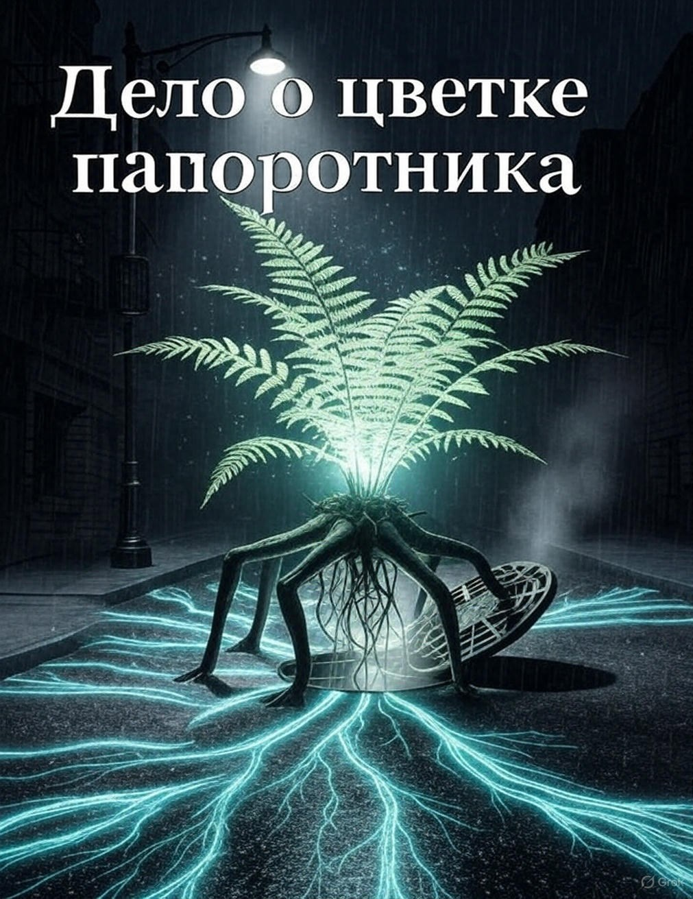

# Дело о цветке папоротника

## Аннотация

Станислав Сычёв, бывший звёздный криминалист-ботаник, думал, что достиг дна, расследуя кражи сосисок с участием котов-клептоманов. Он жестоко ошибался. Когда в его пропахший отчаянием офис врывается одержимая учёная Ярина с делом о похищении… генетически модифицированного папоротника, Стас понимает: у дна есть подвал, а в подвале — отдельный котёл для циников, решивших, что видели всё. Простая, на первый взгляд, халтура превращается в безумное погружение в тайную жизнь города, где главный свидетель — водопровод, а основной мотив — сквозняк.
Погоня за растением-беглецом заводит героев в самую глубь коммунальных сетей, где под асфальтом пробуждается нечто немыслимое — разумный сверхорганизм, нервная система всего мегаполиса. Пока Стас и Ярина пытаются понять, как вести переговоры с говорящим мхом и лечить депрессию у фикусов, в игру вступает безжалостный учёный, готовый уничтожить это чудо ради личных амбиций.

## Обложка

