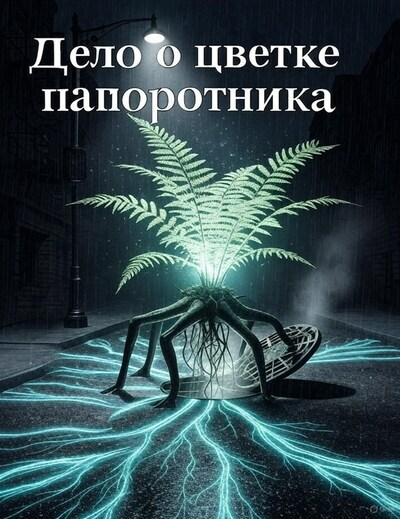

# Дело о цветке папоротника

## Аннотация

Станислав Сычёв, бывший звёздный криминалист-ботаник, думал, что достиг дна, расследуя кражи сосисок с участием котов-клептоманов. Он жестоко ошибался. Когда в его пропахший отчаянием офис врывается одержимая учёная Ярина с делом о похищении… генетически модифицированного папоротника, Стас понимает: у дна есть подвал, а в подвале — отдельный котёл для циников, решивших, что видели всё. Простая, на первый взгляд, халтура превращается в безумное погружение в тайную жизнь города, где главный свидетель — водопровод, а основной мотив — сквозняк.
Погоня за растением-беглецом заводит героев в самую глубь коммунальных сетей, где под асфальтом пробуждается нечто немыслимое — разумный сверхорганизм, нервная система всего мегаполиса. Пока Стас и Ярина пытаются понять, как вести переговоры с говорящим мхом и лечить депрессию у фикусов, в игру вступает безжалостный учёный, готовый уничтожить это чудо ради личных амбиций.

## Обложка

### Глава 1

Глава 1

Стас Сычёв с абсолютно непроницаемым лицом выложил на стол три предмета. Первый — аккуратный гипсовый слепок кошачьей лапы, настолько детальный, что можно было рассмотреть царапину на одной из подушечек. Второй — распечатка с графика, испещрённого пиками и спадами, с лаконичной подписью от руки: «Жировой профиль: сосиска „Молочная“ ГОСТ Р 52196-2011». Третий — крошечный USB-накопитель чёрного цвета.

Его клиент, Олег Игоревич, мужчина лет сорока с лицом, на котором вселенская скорбь боролась с лёгким несварением желудка, нервно сглотнул. Он сидел на краешке стула в маленьком офисе Стаса, который тот гордо именовал «Экологический консалтинг „Био-Сфера“». На деле это была комната в старом коворкинге, пропахшая кофе, отчаянием и средством для мытья пола «Лесная свежесть».

— Это… это всё? — прошептал Олег Игоревич.

Стас, не говоря ни слова, вставил флешку в свой старенький, но надёжный ноутбук. Пришлось потратить час, чтобы убедить пенсионерку из квартиры напротив, что её коту угрожает лазерный луч из ЦРУ, и только его специальная мышь-антишпион, направленная в окно, спасёт питомца. На экране появилось чёрно-белое, зернистое изображение. Камера смотрела на форточку клиента. Тридцать секунд ничего не происходило. Олег Игоревич уже начал ёрзать.

А потом в кадре мелькнула тень. Огромная, пушистая лапа с выпущенными когтями подцепила шпингалет. Форточка подалась. В проём просунулась усатая морда мейн-куна с выражением хирурга, приступающего к сложной операции. Кот действовал без суеты, с пугающей методичностью. Он зацепился задними лапами за карниз, выгнулся и, извернувшись с грацией, которой позавидовал бы цирковой акробат, проник в кухню.

Через мгновение он появился обратно, сжимая в зубах целую гирлянду сосисок. Тряхнув гирляндой, как свежепойманной крысой, он скрылся в темноте.

Олег Игоревич смотрел на экран и несколько раз моргнул, пытаясь прогнать влагу, но тщетно.

— Маркиз… — выдохнул он. — Я же ему… я же ему корм «премиум-класса»… с тунцом и креветками.

Стас, не изменившись в лице, захлопнул крышку. Внутренний протокол был завершён. Объект: Олег Игоревич, 42 года, менеджер среднего звена. Состояние: эмоционально подавлен, близок к экзистенциальному кризису. Гипотеза: подозревал промышленный шпионаж, использующий его кота для кражи ценных рецептур сосисок (которые он разрабатывал на дому как хобби). Реальность: кот — клептоман с тонким чутьём на ГОСТы.

— Ваш кот, Маркиз, не был завербован конкурирующей фирмой «Мясной Дар», — сухо заключил Стас, извлекая флешку. — Он просто вор. Талантливый, не спорю, но вор. Прошу оплатить мои услуги в полном объёме. Пять тысяч.

Он указал на скромную табличку на столе: «Консультация — 5000 р. Анализ пыльцы — от 10000 р. Определение отцовства у фикусов — по договорённости».

Клиент, бормоча что-то про «предательство пушистой сволочи» и «позор на мои седины», отсчитал мятые купюры. Он был так раздавлен, что даже не попытался торговаться. Стас, не изменившись в лице, смахнул деньги в ящик своего стола. Когда за Олегом Игоревичем закрылась дверь, единственным звуком в офисе осталось тихое гудение вентиляции.

Стас откинулся на спинку скрипучего кресла. Взгляд сам собой нашёл единственное, что приносило радость в этой каморке, — полку с кактусами.

Ариокарпус, похожий на потрескавшийся серый камень. Астрофитум «голова медузы» с его змеящимися стеблями. И старый, упрямый лофофор, который все почему-то называли «пейотлем», хотя галлюцинаций от него не было никаких.

Он вздохнул. Вот оно, дно. Станислав Сычёв, бывший ведущий специалист отдела криминалистической ботаники, гений анализа микрочастиц и спор, человек, который мог по пыльце на ботинке определить, в каком лесу побывал подозреваемый, теперь ловит котов-сосисочников.

Он думал, что достиг дна — оптимист. Он ещё не знал, что у дна есть подвал, а там — отдельный котёл для бывших гениев криминалистической ботаники.

Дверь распахнулась без стука, с такой силой, что ударилась о стену, и замок жалобно лязгнул. На пороге стояло явление, которое Стас мысленно классифицировал как «энтропийный шторм, антропоморфный, одна штука».

Девушка лет тридцати, растрёпанная, с пучком на голове, из которого в разные стороны торчали волосы, карандаш и, кажется, сушёный листик. Поверх футболки с надписью «Mycelium is the new Wi-Fi» был накинут старый лабораторный халат, заляпанный чем-то, напоминающим то ли почвенный субстрат, то ли вчерашний кофе. Но главным были глаза — огромные, горящие фанатичным энтузиазмом.

Она начала говорить ещё с порога, стремительно сокращая дистанцию.

— Вы Сычёв? Станислав? Мне вас рекомендовали! Сказали, вы лучший. То есть, не просто лучший, а… специалист по нестандартной флоре! У меня пропал… его похитили! Это не просто растение, поймите, это критически важно для всей моей работы, он был единственным рабочим прототипом, понимаете? Единственным!

Она остановилась в метре от его стола, тяжело дыша. Воздух вокруг неё пах смесью влажной земли, фитохимии и медицинского спирта.

Стас молчал. Его мозг уже включил аналитический режим. Объект: неизвестная женщина, предположительно научный сотрудник. Состояние: крайняя степень ажитации. Речевая активность: 120 слов в минуту с пиковыми значениями до 150. Гипотеза: либо гений, либо городская сумасшедшая. Требуется дальнейшее наблюдение, но желательно с безопасного расстояния.

— Вы не понимаете, — продолжила она, не дождавшись ответа и начав ходить по крошечному офису, как тигр в клетке. — Он был откалиброван на считывание микоризных флуктуаций! Это как… как сейсмограф, только для грибницы! Если мы его не найдём, мы упустим… СТОП! А вы вообще понимаете, что такое микоризные флуктуации?

Она остановилась и уставилась на него с требовательным видом.

— В общих чертах, — процедил Стас. — Симбиотическая ассоциация мицелия гриба с корнями высших растений. Вас интересует эктотрофный или эндотрофный тип?

Девушка замерла с открытым ртом. Её энтузиазм на мгновение сменился изумлением.

— Ого… — выдохнула она. — А мне сказали, вы просто частный детектив.

— Я эколог-консультант, — поправил Стас, указывая на табличку. — Детективная деятельность — побочный профиль. Так что у вас пропало? Фиалка, что ли, сбежала из горшка?

Он сказал это с максимальным сарказмом, на который был способен, надеясь, что она обидится и уйдёт. Но эффект был обратным. Её глаза снова загорелись.

— Почти! То есть, не фиалка, а генетически модифицированный асплениум, но вы… вы так близки к истине! Как вы догадались?

Стас мысленно застонал. Кажется, эта битва проиграна. Ладно, если вселенная подкидывает тебе лимоны — сделай лимонад. Или, в его случае, возьми с клиента побольше денег и купи на них редкий астрофитум.

— Хорошо, — он перешёл на деловой тон. — Я выслушаю вашу историю. Но давайте сразу определимся с условиями. Моё время стоит дорого. Очень. Двадцать тысяч рублей. Аванс — половина. И, пожалуйста, без терминов. Говорите так, будто объясняете пятилетнему ребёнку. Который, к тому же, немного туповат.

Он был уверен, что завышенная цена её отпугнёт. Нормальный человек покрутил бы пальцем у виска и пошёл искать кого-то подешевле.

Но эта девушка не была нормальной. Она, ни слова не говоря, стащила с плеча потрёпанный рюкзак, порылась в нём и извлекла толстую пачку пятитысячных купюр, перетянутых аптечной резинкой. Она отсчитала четыре и положила их на стол. Деньги были слегка влажными и пахли всё той же землёй.

— Вот, — сказала она. — Десять аванс и десять сверху, за срочность. Только найдите его. Его зовут Фердинанд.

Деньги лежали на столе. Его внутренний циник боролся с внутренним коллекционером кактусов. Коллекционер победил нокаутом в первом раунде. Он уже представлял себе шикарный экземпляр Ariocarpus kotschoubeyanus, плоский, почти вросший в землю, идеальной фрактальной формы.

— Хорошо, — сказал он, аккуратно забирая купюры. — Рассказывайте про вашего… Фердинанда. С самого начала. И помедленнее.

Его карьера только что пробила новое дно. Но, по крайней мере, это дно было хорошо и, кажется, авансом, оплачено.

* * *

Такси, от которого несло ароматизатором «ёлочка» и безнадёгой, высадило их у проходной старого, обшарпанного здания НИИ. Территория напоминала декорации к фильму о заброшенном мире: потрескавшийся асфальт, из которого пробивались одуванчики, ржавые гаражи и величественное, но унылое здание из серого кирпича.

— Сюда, — Ярина, а именно так звали клиентку, уверенно повела его к боковому входу и вверх по гулкой лестнице.

Они поднялись на самый верхний этаж, прошли по длинному коридору, пахнущему пылью и забытыми научными открытиями, и вышли на крышу. Здесь, среди гудронных заплат и антенн, высилась большая стеклянная теплица. Оранжерея Ярины.

Стас вошёл внутрь, и его накрыла волна влажного, тёплого воздуха. Это был хаос. Гибрид лаборатории и тропических джунглей. Вдоль стен громоздились стеллажи с колбами, пробирками и работающим оборудованием, экраны которого светились зелёными графиками. А между всем этим буйствовала растительность: гигантские папоротники свисали с потолка, орхидеи цеплялись за провода, а в углу что-то хищно щёлкнуло, захлопнув ловушку венериной мухоловки.

Запах здесь был густой: пахло прелой землёй, как в лесу после дождя, химическими реагентами и чем-то ещё, незнакомым, слегка металлическим. Стас с профессиональным интересом отметил несколько редких видов платицериумов, мысленно критикуя слишком высокую влажность для их содержания.

— Вот, — Ярина подтолкнула его к столу с ноутбуком. — Место преступления.

На столе стоял опрокинутый керамический горшок. Вокруг него была рассыпана земля. Рядом — маленькая камера на штативе, направленная точно на это место.

— Смотрите. Я включаю запись каждую ночь, для контроля. Сначала думала, это помехи. Или крысы… но крысы не такие. Они… они не такие методичные.

Она кликнула мышкой. Стас наклонился к экрану, сохраняя на лице маску профессионального скепсиса. Он уже приготовил лекцию о том, как сквозняк или вибрация от проезжающего трамвая могут вызвать странные эффекты на записи.

На экране — тот самый горшок, стоящий ровно. В нём росло невзрачное, ничем не примечательное растение, похожее на маленький зелёный фонтанчик. Тайм-код в углу экрана равнодушно отсчитывал секунды. Стас уже начал терять терпение.

И тут горшок дёрнулся. Слегка, едва заметно.

Стас прищурился. Потом из дренажных отверстий на дне, как тонкие, скрюченные пальцы, показались корни. Они были тёмными, блестящими, больше похожими на проволоку, чем на часть растения. Корни упёрлись в поверхность стола, напружинились.

Раздался тихий скрежет, и всё растение целиком, вместе с корневым комом, начало медленно выползать из горшка, как улитка из раковины. Горшок накренился и с глухим стуком упал на бок, рассыпав остатки земли. Освободившееся существо — пучок зелёных листьев на паутине извивающихся корней — на мгновение замерло. Затем, обретя уверенность, оно быстро засеменило по столу на своих корневых ножках, оставляя влажный след. Двигалось оно с жутковатой, целенаправленной скоростью.

Конечной точкой его маршрута была старая вентиляционная решётка в стене. Перед ней беглец на мгновение замер. Он чуть развернулся, будто оглядываясь в объектив камеры на прощание. А потом юркнул в тёмное отверстие решётки. Экран показывал лишь опрокинутый горшок, рассыпанную землю и влажный след на столе.

Ярина с замиранием сердца смотрела на Стаса, ожидая реакции.

Он молчал, но ледяное спокойствие, которое он культивировал годами, дало трещину. Что-то щёлкнуло внутри черепной коробки, перегорев, как старый предохранитель, и вся его упорядоченная картина мира — с котами-воришками и смирными растениями в горшках — накрылась медным тазом.

Он молча ткнул пальцем в экран.

— Ещё раз, — хрипло произнёс он.

Ярина отмотала запись. Он посмотрел второй раз. Потом третий, попросив увеличить изображение на моменте, где корни выползают из горшка. Его лицо из цинично-скучающего стало абсолютно непроницаемым, как у игрока в покер с очень плохими картами.

Он медленно выпрямился, оглядел оранжерею, пустой горшок на столе, вентиляционную решётку. Потёр переносицу. Глубоко вздохнул, выдохнул.

— Инструменты, — сказал он только одно слово.

В этот момент дело о сбежавшем цветке перестало быть халтурой. Оно стало личным.

Стас вернулся к машине за своим рабочим кейсом. Внутри, в ложементах из бархата, лежал нехитрый, но проверенный годами набор: фотоаппарат, пинцеты разного калибра, стерильные пакеты для улик, лупа, фонарик и одноразовые перчатки.

Вернувшись в оранжерею, он преобразился. Сутулый, уставший консультант исчез. На его месте появился методичный, сосредоточенный криминалист. Он натянул перчатки с таким видом, будто приступает к вскрытию.

— Так, — сказал он, обращаясь скорее к себе, чем к Ярине. — Начнём с периметра.

Он медленно обошёл стол, фотографируя всё под разными углами: опрокинутый горшок, рассыпанную землю, влажный след, вентиляционную решётку. Ярина наблюдала за ним, переводя взгляд с него на свои приборы и обратно.

— Оконные рамы целы, замки не взломаны, — констатировал Стас. — Значит, никто посторонний сюда не входил. Были у вас в последнее время конфликты с коллегами? Может, кто-то завидовал вашим… э-э-э… успехам?

Ярина посмотрела на него как на идиота.

— Да при чём тут коллеги! — всплеснула она руками. — Это же очевидная направленная хемотаксическая реакция! Он уловил сигнальные пептиды и пошёл на источник! Его повело, понимаете? Как собаку по следу! Только его обоняние — это хеморецепторы на ризоидах!

Стас на мгновение замер, склонившись над столом. В его внутреннем протоколе напротив пункта «контакт с клиентом» появилась пометка: «требуется повышенная доза кофеина и терпения. Возможно, коньяка».

Вслух же произнёс:

— Ясно. Значит, версию с завистливым доцентом пока откладываем.

Он опустился на колени и посветил фонариком на пол под столом. Пыль, земля, пара сухих листьев. И… вот оно. Несколько капель полупрозрачной, маслянистой слизи. Он аккуратно приблизился, почти коснувшись носом пола. Запаха почти не было.

Он достал пинцет и стерильный контейнер размером с напёрсток.

— Что это? — спросил он.

— Где? — Ярина тут же подскочила к нему, едва не наступив на его руку.

— Осторожно! — рявкнул Стас. — Вещдок затопчете.

Он аккуратно собрал образец слизи. Ярина, заглянув ему через плечо, восторженно прошептала:

— Экзополисахариды! Конечно! Он оставил нам сообщение! Это как… как след из хлебных крошек! Нужно срочно делать хроматографию, вдруг там есть информационные РНК!

Стас медленно поднялся, убирая контейнер в карман. Он чувствовал, что ещё одна такая тирада, и его мозг просто отключится в целях самосохранения. Нужно было перевести разговор на понятный ему язык.

— Что это за вид? — спросил он, кивнув на пустой горшок. — Pteridophyta? Какой-то редкий папоротник?

Вопрос подействовал. Ярина на секунду перестала фонтанировать идеями. Её лицо стало серьёзным, сосредоточенным. Безумный энтузиаст исчез, на его месте появился учёный.

— Генетически модифицированный Asplenium nidus, папоротник-гнездо. Я встроила ему гены биолюминесцентного гриба Mycena chlorophos для отслеживания метаболизма и несколько синтетических последовательностей для усиления чувствительности корневой системы к геомагнитным полям и химическим градиентам. Он был… идеален.

Стас кивнул. Он не понял и половины, но уловил главное. Перед ним стоял не просто сумасшедший фанатик. Она была блестящим учёным. Возможно, сумасшедшим, но блестящим. И впервые за этот день он почувствовал укол чего-то давно забытого. Не любопытства, нет. До этого было ещё далеко. Но профессионального уважения.

Его взгляд остановился на вентиляционной решётке.

— Значит, полез в трубы. Что ж. Будем копать. В переносном смысле.

Пока Ярина, вдохновлённая, рылась в своих записях, у Стаса в кармане завибрировал телефон. Он достал его. На экране высветилось: «Тётя Валя НЕ БРАТЬ».

Это была хозяйка его съёмной однушки. Стас вздохнул и нажал на зелёную кнопку.

— Станислав, это вы? — раздался в трубке громоподобный, возмущённый голос тёти Вали.

— Я, Валентина Петровна, добрый день.

— Какой он добрый?! Я не знаю, что вы там у себя делаете, но у меня по радио… вы знаете, что у меня по радио?!

Стас потёр висок. Он знал, что у тёти Вали из всей техники работал только старый приёмник на кухне, который ловил одну-единственную станцию.

— Что у вас по радио, Валентина Петровна?

— А по радио у меня какой-то картавый мужик без остановки читает стихи про мухоморы! Целый час! Про их споры, про их ножки, про их духовную сущность! У меня голова от этого пухнет! Я требую, чтобы вы немедленно прекратили свои эксперименты!

— Валентина Петровна, я не имею отношения к вашему радио, — миролюбиво сказал он. — Возможно, это новая передача…

— Передача?! — взвизгнула трубка. — Чтобы меня током убило, да?! Я всё знаю! Я в управу жаловаться буду!

Он слушал её ещё минуту, пока она не выдохлась и не бросила трубку.

Стас убрал телефон в карман. Раздражение бурлило внутри. Старые дома, сумасшедшие хозяйки, коты-воришки, а теперь ещё и ходячие растения. Иногда ему казалось, что весь мир сговорился, чтобы свести его с ума.

Вернувшись в свой унылый офис, Стас почувствовал себя немного лучше. Здесь был его порядок, его запахи, его полка с молчаливыми и предсказуемыми кактусами. Ярина приехала вместе с ним, притащив свой ноутбук и кипу распечаток. Она тут же заняла единственный свободный стул и погрузилась в изучение схем городских коммуникаций, бормоча под нос что-то про «оптимальные температурные градиенты».

Стас проигнорировал её. Он достал из дальнего ящика стола свой главный козырь — портативный спектрометр, небольшой прибор, похожий на строительный фен, который он когда-то выкупил за копейки со списанного оборудования НИИ. Он подключил его к ноутбуку.

— Так, посмотрим, что ты нам расскажешь, — пробормотал он, доставая контейнер со слизью.

Он аккуратно поместил образец под линзу анализатора. Нажал кнопку. Прибор тихо загудел. На экране ноутбука, в окне специальной программы, начали медленно прорисовываться пики графика элементного состава.

Стас смотрел на экран, и его брови медленно ползли вверх. Он остановил анализ, недоверчиво покачал головой и перезагрузил программу. Может, сбой калибровки. Он запустил процесс снова.

Результат был тот же. Абсолютно идентичный.

Он несколько секунд молча смотрел на разноцветные столбцы, потом пробормотал вслух, перечисляя основные компоненты:

— Полиальфаолефины… комплексные эфиры… ингибиторы коррозии… силикагелевые загустители… Что за чёрт?

Он открыл в браузере поисковик и вбил несколько ключевых терминов. Через минуту он уже читал техническую спецификацию.

— Состав почти идентичен… смазке для подшипников и уплотнителей в промышленных насосных системах. Конкретно — марке «Гидрол-7». Используется в городском водоканале.

Это было странно, но объяснимо. Вентиляция могла быть связана с техническими помещениями, где обслуживали трубы. Но что-то не давало ему покоя. Один пик на графике был… аномальным.

— А это что? — голос Ярины раздался у него над ухом. Она оторвалась от своих карт и теперь с любопытством заглядывала в его монитор. — Вот этот столбец. Он какой-то… слишком высокий. Не вписывается в общую картину.

Стас увеличил указанный участок графика. Программа выдала название элемента. Он уставился на слово, не веря своим глазам.

— Хлорофилл, — тихо сказал он. — Высокая концентрация.

Тишина. Гудение компьютера казалось оглушительным. Машинное масло и хлорофилл. Смазка для труб и основной пигмент фотосинтеза. Два мира, которые не должны были пересекаться. Но они пересеклись. В одной маленькой капле слизи на полу оранжереи.

Ярина вдруг резко выпрямилась. Её глаза вспыхнули. Будто в её голове только что успешно завершился холодный ядерный синтез в лабораторных условиях.

— Я знаю! — почти крикнула она, заставив Стаса вздрогнуть. — Я всё поняла! Это же очевидно!

— Что очевидно? — устало спросил он.

— Он не просто сбежал! Он не прячется! Он путешествует! «Гидрол-7» — это смазка, верно? Она в трубах! А хлорофилл — это он! Его ткани! Он ушёл в артерии! В кровеносную систему города!

Стас медленно закрыл крышку ноутбука. Он посмотрел на четыре пятитысячные купюры, лежащие на краю стола. Потом перевёл взгляд на Ярину, которая уже снова уткнулась в свои карты, яростно черкая на них карандашом предполагаемый маршрут беглеца.

Он посмотрел на четыре пятитысячные купюры, затем мысленно открыл каталог редких кактусов.

Определённо. Нужно было просить больше. Гораздо больше.

### Глава 2

Глава 2

Стас смотрел на Ярину, а та, судя по всему, уже видела светлое будущее, пролегающее через городскую канализацию. Её маниакальный энтузиазм казался аномалией похлеще самоходного папоротника в этом крошечном офисе, пропитанном запахом кислого кофе и профессионального выгорания. Она не ходила — она вибрировала, нарезая круги вокруг единственного фикуса Стаса, который от такого внимания, кажется, решил ускорить процесс увядания.

— Ты только представь! — её голос вибрировал от возбуждения. — Это же не просто побег. Это миграция! Фердинанд не заблудился, он следует по заранее проложенному маршруту. Водопровод, теплосеть, старые газовые трубы, возможно, даже оптоволоконные коллекторы — это всё единая транспортная и нервная система!

Стас молча массировал виски. В голове гудело. Ещё час назад его главной проблемой был соседский кот, ворующий сосиски с подоконника. Теперь на повестке дня стоял заговор городского масштаба с участием сантехники и генетически модифицированного растения. Он бросил взгляд на распечатку со спектрометра. «Гидрол-7» и хлорофилл. Два слова, которые пустили тонкую трещину в его уютном, циничном мире.

— Это глобальная мицелиальная сеть, Стас! — Ярина резко остановилась и ткнула пальцем в схему метро, висевшую у него на стене. — Грибница под городом — это естественный интернет, который существовал за миллионы лет до нашего. А трубы, кабели, вся эта инфраструктура — для неё это просто… усилители сигнала! Фердинанд, мой бедный мальчик, он как первый пользователь, который подключился к этой сети и теперь получает какой-то неведомый нам пакет данных!

Голова поднялась медленно. Взгляд у него был, как у человека, который пытается в уме разделить четырёхзначное число на семнадцать.

— Погоди, — произнёс он наконец, тщательно подбирая слова. — Давай по порядку. Ты хочешь сказать, что твой… Фердинанд… уполз по трубам, потому что под городом грибы устроили себе подпольный вай-фай?

— Не вай-фай! — всплеснула руками Ярина так, что фикус окончательно сник. — Это… это гораздо элегантнее! Это живая, самоорганизующаяся симбиотическая система, понимаешь? Она всегда была здесь, в спящем режиме. Но что-то или кто-то её разбудил. Такой сложный организм не мог активироваться сам по себе. Это как запустить термоядерный реактор ударом кувалды. Кто-то должен был дать первоначальный импульс.

В её глазах мелькнула тень, но это был не страх. Это был азарт охотника, напавшего на след невиданного зверя.

— Есть у меня одна догадка, — продолжила она, понизив голос до заговорщического шёпота. — В узких кругах биологов и околонаучных фриков уже пару лет ходят слухи. Про ребят, которые называют себя… «ГрибоВуд».

Стас моргнул.

— Грибо… что?

— ГрибоВуд, — повторила она. — Андеграундное сообщество биохакеров. Считают себя пионерами в области мико-технологий. Пытаются скрестить мицелий с кремниевыми чипами, учат плесень обрабатывать данные, вот это всё. Большинство учёных считает их безобидными идиотами, но…

— Но если твой папоротник путешествует по грибному интернету, то эти ребята — первые подозреваемые в роли системных администраторов, — закончил за неё Стас. Его мозг, привыкший цепляться за любую конкретику, с облегчением ухватился за эту версию. Хакеры. Это было уже что-то. Не абстрактная говорящая канализация, а вполне конкретные люди, которых можно найти и допросить.

— Именно! — просияла Ярина. — Они как… как скрипт-кидди, которые нашли уязвимость в операционной системе планеты и теперь пытаются её взломать, не понимая последствий!

— И теперь что? — Стас устало откинулся на спинку скрипучего кресла. — Учат борщевик майнить биткоины?

— Возможно! — абсолютно серьёзно ответила Ярина. — Мы не можем этого исключать! Их нужно найти. Срочно.

Стас посмотрел на неё, потом на сиротливый чек аванса на двадцать тысяч, лежавший на краю стола. Сумма, ещё утром казавшаяся лёгкой добычей, теперь выглядела как жалкая подачка за билет в дурдом. Он глубоко вздохнул, выдыхая остатки своего здравомыслия.

— Ладно, — сказал он. — Грибные эльфы так грибные эльфы. Будем искать ваших хакеров.

Звонить Петровичу было всё равно что беспокоить медведя в середине зимней спячки. Сначала долгие, тяжёлые гудки, потом ворчливое кряхтение в трубке и наконец фирменное, пропитанное вселенской усталостью: «Лыков слушает».

— Петрович, это Сыч, — сказал Стас, глядя в окно на серую акварель двора-колодца.

В трубке повисла пауза, наполненная шорохом перекладываемых бумаг и тихим скрипом стула. Сергей Петрович Лыков, бывший коллега Стаса из экспертного отдела, а ныне — узник бумажных гор в одном из бесчисленных кабинетов МВД, не любил сюрпризов. А звонок от Стаса всегда был сюрпризом.

— Сычёв… — протянул он наконец. В голосе слышалось недоверие, смешанное с плохо скрытым любопытством. — Живой ещё, поганка? Я думал, ты уже где-нибудь на даче тюльпаны редкие опыляешь.

— Почти угадал. Петрович, нужна помощь. Неофициально, как всегда.

В трубке повисла пауза. Стас ждал. Он представил, как Петрович на том конце снимает очки, трёт уставшие глаза. Он был хорошим криминалистом, одним из лучших, но система перемолола и его, оставив лишь привычку к ритуальному ворчанию.

— Опять ты со своей ботаникой, Стас? — вздохнул Петрович. — Помнится, в прошлый раз твой мох чуть всё управление на уши не поставил. Мне до сих пор припоминают.

Желудок скрутило в тугой узел. «Дело о мхе». Его личная Голгофа. Тот самый случай, когда его блестящую дедукцию похоронили под сукном ради спокойствия какого-то олигарха.

— Это другое, — ровно сказал он. — Коммерческий заказ. Есть информация о группе… энтузиастов. Называют себя «ГрибоВуд».

В трубке раздался смешок.

— А, эти… — протянул Петрович. — Попадались. Месяца три назад жалоба на них была. Пытались запитать гирлянду от картошки в промышленных масштабах в подвале жилого дома. Весь подъезд без света оставили. Шумные, но безобидные. Студенты в основном. Зачем они тебе?

— Есть версия, что они могли… вмешаться в работу городских коммуникаций, — Стас старался, чтобы это звучало как можно более буднично.

— Вмешаться? — хмыкнул Петрович. — Они в электрощитке без схемы разобраться не могут. Ладно. Сегодня у них какая-то сходка. Слёт грибоводов. В парке «Заречье». Там старое бомбоубежище есть, заброшенное. Вход со стороны оврага. Они там тусуются. Только, Сычёв…

— Что?

— Не вляпайся опять. У меня из-за тебя отчётов и так по горло.

Гудки. Стас убрал телефон. Так. План есть. Это обнадёживало.

Подготовка к операции наглядно демонстрировала, почему они с Яриной были существами с разных планет.

Стас у себя дома, в маленькой съёмной квартире, где комнатные кактусы занимали больше места, чем человеческие вещи, готовился три минуты. Он проверил заряд в старом, но надёжном светодиодном фонаре — увесистом, металлическом, которым в случае чего можно было и отбиться. Сунул в карман джинсов швейцарский нож. Наполнил доверху литровый термос крепчайшим чёрным чаем с тремя ложками сахара и толстым кружком лимона. Всё. К вылазке в логово грибных хакеров готов.

В это же время в своей лаборатории на крыше НИИ Ярина проводила ритуал, сравнимый по масштабу со сборами к экспедиции на Марс. На огромном лабораторном столе была выстроена пирамида из приборов.

— Так, портативный хроматограф — есть, — бормотала она себе под нос, укладывая в здоровенный тактический рюкзак прибор, похожий на футуристический бластер. — Анализатор мико-полей… обязательно. Вдруг они создали локальную аномалию. Нужно зафиксировать всплески.

Прибор, напоминающий металлоискатель с тремя антеннами и россыпью датчиков, тоже отправился в рюкзак.

— Набор для сбора проб. Пробирки, пинцеты, стерильные пакеты. Лопатка. Скальпель…

Она на секунду задумалась.

— Нет, скальпель, пожалуй, лишнее. Наверное.

Когда они встретились у входа в парк «Заречье», вечер густел, переходя в осенние сумерки. Стас стоял под старым клёном, прихлёбывая чай из крышки термоса. Ярина подошла, сгибаясь под весом своего рюкзака, из которого торчали какие-то антенны.

Стас молча окинул её взглядом с ног до головы.

— Ты на Эверест собралась? — не удержался он.

— Я собралась собирать данные, — пыхтя, ответила Ярина. — В отличие от некоторых, я подхожу к делу с научной точки зрения. А ты что взял?

— Фонарик. И термос, — Стас сделал ещё один глоток. — Фонарик — чтобы видеть. Термос — чтобы согреться. Логично.

— А если там редкий образец биолюминесцентной плесени? Чем ты будешь делать спектральный анализ? Термосом? — в её голосе прозвучало искреннее возмущение учёного.

— Я его сфотографирую на телефон. А потом выпью чаю и подумаю, что с этим делать, — спокойно парировал Стас. — Пойми, наша задача сейчас — разведка. Не привлекать внимания. А ты выглядишь как охотник за привидениями на полставки.

Ярина надулась, но спорить не стала. Она поправила лямки своего монструозного рюкзака, и они молча двинулись вглубь темнеющего парка, к оврагу. Один был вооружён до зубов наукой, другой — всего лишь здравым смыслом и термосом с горячим чаем.

Вход в бомбоубежище был именно таким, каким его описывают в дешёвых ужастиках. Массивная железная дверь, утопленная в бетонный склон оврага. Краска облупилась, обнажив ржавые язвы. Навесной замок, казалось, врос в петли и стал с ними одним целым.

— Ну вот, — с удовлетворением сказала Ярина. — Закрыто. Теперь нам точно нужен твой мультитул, чтобы…

Стас не ответил. Он подошёл к двери, взялся за замок и с некоторым усилием просто снял его с петли. Дужка была давно и аккуратно перепилена.

— Они его для вида вешают, — пояснил он, откладывая бесполезный кусок металла в сторону. — Пошли.

Он толкнул тяжёлую дверь. Та со скрежетом, от которого заныли зубы, поддалась, выдохнув в лицо сложный букет запахов: сырой бетон, затхлая вода, ржавый металл и что-то совершенно неуместное — тёплый дух печёного теста и томатного соуса.

— Чувствуешь? — прошептала Ярина, включая налобный фонарик.

— Ага, — кивнул Стас. — Пицца. С грибами, похоже.

Вместо зловещей тишины из глубины бетонного чрева доносились приглушённые ритмичные удары техно-музыки и обрывки чьих-то весёлых голосов. Стас включил свой фонарь, и его мощный луч выхватил из темноты длинную лестницу, уходящую вниз. Ступени были покрыты скользкой влагой, по стенам змеились пучки проводов. Они начали спускаться, и с каждым шагом музыка становилась громче, а запах пиццы — отчётливее.

Они ожидали увидеть что угодно: подпольную лабораторию, похожую на логово киберпанков, ряды гудящих серверов, людей в защитных костюмах. Реальность оказалась одновременно и проще, и абсурднее.

Последняя ступенька — и они оказались в огромном, гулком зале с низким потолком. Вдоль стен стояли старые нары и ящики с противогазами. А в центре, на расстеленных туристических ковриках, расположилась компания из десяти-двенадцати человек. Студенты. В растянутых свитерах, с ноутбуками на коленях. На стене старый проектор показывал пульсирующие психоделические узоры, сгенерированные, видимо, той самой музыкой, что глухо била из колонок. Посреди всего этого на большом ящике стояло несколько коробок из-под пиццы.

— Это… это «ГрибоВуд»? — разочарованно прошептала Ярина, выключая свой фонарь.

Стас молча кивнул, прислоняясь к холодной стене и закрывая лицо рукой. Вся его детективная настороженность, весь адреналин, вся готовность к столкновению с таинственными и опасными противниками — всё это улетучилось, сменившись одной всепоглощающей эмоцией. Вселенской усталостью.

В центре компании, размахивая руками, вещал тощий парень в очках с толстыми линзами — судя по всему, их лидер.

— Пацаны, вы просто зацените! — говорил он с энтузиазмом пророка. — Это прорыв! Мы наконец-то стабилизировали интерфейс! Если модулировать аудиосигнал через афлатоксины, выделяемые Aspergillus flavus, то плесень будет флуоресцировать в такт басу! Прикиньте, мы сможем подключить грибницу к Спотифаю! Это будет первая в мире органическая цветомузыка!

Его слушатели одобрительно загудели. Один из них, с дредами и в футболке с надписью «DEFRAGMENT MY BRAIN», поднял кусок пиццы: «За науку, Корень!»

— За науку! — хором ответили остальные.

Стас медленно сполз по стене. Он нашёл своих зловещих кибер-террористов. Они пытались устроить дискотеку для плесени. Хотелось сесть прямо на грязный бетонный пол, открыть термос и тихо напиться чаем до беспамятства.

Ярина же, наоборот, проявила неожиданный интерес. Она подошла ближе, с любопытством разглядывая их кустарную установку: ноутбук, соединённый проводами с каким-то самодельным блоком, от которого тянулся электрод, воткнутый в чашку Петри с бурым налётом.

— У них же ничего не получится, — прошептала она Стасу с видом эксперта, оценивающего работу дилетанта. — Полевая транзисторная структура абсолютно нестабильна. И они не учитывают уровень pH субстрата. Всё коротнёт.

Словно в подтверждение её слов, Макс «Корень» с решительным видом сел за ноутбук.

— А теперь — момент истины! Запускаю протокол «Мико-Дэнс»! Сейчас эта малышка зажжёт!

Он с пафосом нажал на клавишу Enter.

Секунда тишины. На экране ноутбука на мгновение выскочило окно какой-то ошибки, но тут же исчезло. Музыка продолжала глухо бухать. Плесень в чашке Петри не проявляла ни малейшего желания танцевать. Проектор на стене всё так же лениво переливался узорами.

— Хм, — протянул Корень, постукивая по клавишам. — Наверное, задержка сигнала. Сейчас…

Студенты разочарованно вздохнули. И в этой паузе возник гул.

Это был не звук из колонок. Это был гул низкий, нутряной, идущий, казалось, отовсюду сразу — от пола, от стен, от потолка. Он не столько слышался, сколько ощущался всем телом, пробирая до костей.

— Что это? — спросил кто-то из студентов, оглядываясь.

Стас посмотрел не на плесень и не на ноутбук. Его взгляд был прикован к старой, покрытой ржавчиной водопроводной трубе, идущей под потолком. Она мелко вибрировала, стряхивая с себя хлопья древней краски.

Гул резко, на одной ноте, усилился, превращаясь в утробное, скрежещущее урчание, от которого задрожал бетонный пол. Ноутбуки на ящиках заискрили. Одинокая лампочка под потолком несколько раз яростно мигнула и с сухим треском лопнула, погружая зал в полумрак, разрываемый лишь светом проектора и мониторов.

— Эй, Корень, вырубай! — испуганно крикнул парень с дредами.

— Я не могу! — голос у Корня дрогнул. — Оно не слушается!

С потолка на раскалённую электронику начали падать тяжёлые, холодные капли. Запахло мокрой ржавчиной и чем-то ещё, едким, похожим на горелый пластик. Музыка захлебнулась и смолкла. В наступившей тишине гул стал почти невыносимым.

И тут труба не выдержала.

С оглушительным треском, похожим на выстрел, толстая металлическая труба под потолком лопнула. Не просто треснула — её разорвало, вывернув края наружу. В помещение хлестнул фонтан ледяной, вонючей технической воды, пахнущей тиной и безысходностью.

Началась паника.

Студенты с воплями бросились к выходу, шлёпая по стремительно прибывающей воде, бросая свои дорогие ноутбуки и оборудование. Проектор, залитый водой, вспыхнул и с шипением погас. Зал погрузился в темноту, нарушаемую лишь мечущимися лучами фонариков на телефонах.

Вода уже была по щиколотку. Стас схватил Ярину за руку, таща её к лестнице. Но она упиралась. В хаосе и темноте, под рёв воды, она не бежала. Она стояла, направив на мечущуюся по залу воду свой анализатор мико-полей. Экран прибора горел безумным калейдоскопом графиков и цифр.

— Это не они! — закричала она, перекрывая шум. В свете экрана её глаза дико, восторженно блестели. — Это ответ! Оно отвечает!

В суматохе, когда последний из перепуганных биохакеров пронёсся мимо них к спасительной лестнице, Стас сделал шаг в сторону и мёртвой хваткой вцепился в рукав мокрого свитера Макса «Корня».

— Эй, пусти! — взвизгнул тот, пытаясь вырваться.

— Поговорим, — голос Стаса был абсолютно спокоен. И от этого спокойствия на фоне ревущей воды и всеобщего хаоса парню стало по-настоящему страшно.

Они укрылись в небольшом боковом коридоре, куда вода ещё не добралась. Стас прижал Корня к влажной, холодной стене. Ярина стояла рядом, скрестив руки на груди, и смотрела на лидера «ГрибоВуда» как энтомолог на особо интересное насекомое.

— Что вы сделали? — спросил Стас так же тихо.

— Ничего! — затрясся Макс. Его лицо в слабом свете фонаря было белым, как мел. — Мы… мы просто сигнал послали! Слабый, блин, модулированный! Мы думали, это просто… ну, фоновые помехи!

— Какие помехи? — вклинилась Ярина.

— Мы их пару месяцев назад засекли, — выпалил он, желая лишь одного — чтобы эти двое от него отвязались. — Странные энергетические всплески по всему городу. Низкочастотные. Нестабильные. Мы карту составили. Думали, это какая-то побочка от сотовых вышек или ещё что. Просто… тыкали палочкой, пытались понять, что это. Мы ничего не контролируем, клянусь!

— Карту, — повторила Ярина, и в её голосе появилась сталь. — Где карта? Отдай нам все ваши данные.

Макс судорожно полез в карман своих мокрых джинсов. Он был готов отдать им что угодно — ноутбук, почку, душу — лишь бы выбраться из этого проклятого подвала и никогда больше не видеть ни эту одержимую женщину, ни этого пугающе спокойного мужика. Он протянул Ярине флешку.

— Там всё! Все наши замеры, карта зон, где фонило! Только отстаньте, ладно? Мы ничего не скажем, будто нас тут и не было!

Стас разжал хватку.

— Иди.

Корень пулей метнулся к выходу, и через мгновение его торопливый топот затих вверху.

— Ну что ж, — сказала Ярина, сжимая в кулаке флешку, словно это был драгоценный камень. — Не совсем безрезультатно.

— Ага, — мрачно отозвался Стас, глядя на прибывающую воду. — Мы нашли идиотов, которые пнули спящего медведя, и теперь у нас есть карта его берлоги. Пошли отсюда, пока нас не смыло.

Когда они выбрались на поверхность, ночь уже полностью вступила в свои права. После рёва воды и грохота внизу тишина парка оглушала. Прохладный, влажный воздух пах прелой листвой и дождём. Стас сделал глубокий вдох, пытаясь успокоить колотящееся сердце.

Первым он заметил фонари. Они не просто горели. Они жили. Все до единого фонаря в парке, насколько хватало глаз, медленно, в едином, гипнотическом ритме затухали, почти полностью погружая аллеи во мрак, а затем так же плавно разгорались вновь. Это было похоже на гигантское, спокойное дыхание. Вверх-вдох, вниз-выдох. Ритм был неспешным, умиротворяющим и абсолютно противоестественным.

— Ты… ты это видишь? — прошептала Ярина, задрав голову.

Стас не ответил. Он смотрел на это безмолвное световое шоу, и вдоль его позвоночника будто провели ледяным пальцем.

А потом Ярина ахнула и шагнула к ближайшей скамейке.

— Стас, смотри…

Он перевёл взгляд ниже. И забыл про фонари.

Все поверхности в парке — деревянные скамейки, чугунные урны, даже детские качели на площадке в отдалении — всё было покрыто толстым, бархатистым слоем изумрудно-зелёного мха. Но это был не просто мох. Он рос не хаотично. Он складывался в невероятно сложные, идеально симметричные узоры, похожие одновременно на морозные рисунки на стекле и схемы микрочипов. Каждый завиток, каждая линия были на своём месте, образуя единый, бесконечно повторяющийся орнамент, который, казалось, светился изнутри в пульсирующем свете фонарей.

За те пару часов, что они пробыли внизу, парк полностью преобразился. Он стал чужим, волшебным и пугающим.

Ярина, забыв обо всём, опустилась на колени перед скамейкой, достала телефон и начала лихорадочно фотографировать, бормоча что-то про симбиотическую кристаллизацию и неевклидову геометрию в биологии. Она была в научном экстазе. Это было подтверждение её самых смелых, самых безумных теорий.

Стас же не смотрел на мох. Он смотрел на весь этот тихий, дышащий светом и заросший фракталами парк. На город, который перестал быть просто фоном. На молчаливую, непостижимую силу, которая только что продемонстрировала им крошечную часть своих возможностей. Весь его опыт, цинизм и привычная картина мира рассыпались в пыль. Он достал почти остывший термос и сделал глоток, но чай больше не согревал.

— Так, — сказал он в пустоту, глядя на пульсирующий фонарь. — Кажется, аванса не хватит. И чая в термосе тоже.

### Глава 3

Глава 3

Ночь в парке «Заречье» оказалась липкой и недружелюбной. Она въелась в одежду влагой и запахом прелой травы. Через полчаса такси выплюнуло их у офиса Стаса, который показался порталом в другой мир. Скучный, безопасный и до тошноты предсказуемый.

Здесь не было светящегося мха. Не было фонарей, моргающих в ритме сердца неведомой твари. Лишь холодный неон пустого коридора коворкинга, мерное жужжание кулера да въевшийся запах дешёвого кофе с хлоркой. Стас неожиданно выдохнул. Господи, как же это было нормально. До зубной боли предсказуемо. Идеально.

Ярина смены декораций, кажется, не заметила. Мыслями она осталась там, в аномальном парке, и словно потрескивала от статического электричества, как перегруженный конденсатор.

Она швырнула тактический рюкзак на несчастное гостевое кресло. Щёлкнула замками потрёпанного, но мощного ноутбука. Экран полыхнул, бросив блики на её лихорадочно блестевшие глаза.

– Так-так-так... Посмотрим, что там накопали наши грибные хакеры, – пробормотала она, и её пальцы замелькали над клавиатурой, превратившись в размытое пятно.

Стас устало вздохнул. Он чувствовал себя микроскопическим образцом, который слишком долго изучали под безжалостным светом. Вся энергия осталась там, среди светящихся корней и незримого шёпота города. Сейчас хотелось одного: сделать что-то привычное, ритуальное. Что-то, что мозг мог обработать, не строя гипотез о коллективном сознании городской флоры.

Он прошёл в свой угол, к столику с дешёвым чайником и банкой «Nescafe Classic» с облезлой этикеткой. Отвинтил крышку. Знакомый, химический запах ударил в нос. Вот она, реальность. Простая, незамысловатая. Не мицелиальная симфония, а просто коричневый порошок в стеклянной банке.

– Будешь? – хрипло спросил он, стараясь, чтобы голос звучал буднично.

– М-м? – Ярина оторвалась от экрана, будто только сейчас заметив его присутствие. – Нет-нет, спасибо. Я не употребляю кофеиносодержащие жидкости после шести. Нарушает ритмы выработки мелатонина.

Стас только головой покачал. Зачерпнул две щедрые ложки в свою любимую треснутую кружку с надписью «Для лучшей защиты» и логотипом несуществующего ЧОПа. Чайник закипел и с довольным щелчком отключился. Стас залил кипяток, закручивая тоскливое бурое облако. Его ритуал.

– Флешка! – радостно выдохнула Ярина.

Она воткнула миниатюрное устройство в USB-порт, и на экране ноутбука проступила карта города, усеянная сотнями красных точек. Они сбивались в кластеры, образуя странный, тревожный узор. Стас подошёл ближе, сжимая горячую кружку, как оберег.

– Это... – начал он, но Ярина его перебила.

– Это сырые данные их замеров! Сырые! Понимаешь? Они фиксировали всплески сверхнизкочастотного диапазона! Да это же золотая жила! Они сами не поняли, что нарыли, идиоты!

Она тараторила так быстро, что слова сливались. Пальцы летали по тачпаду, открывая новые окна, накладывая карты друг на друга. Для Стаса это выглядело как прогноз погоды из ада. Эпидемия кори в масштабах мегаполиса.

– Так что значат эти красные точки? Если на человеческом языке? – спросил он, силясь подавить ощущение, будто его, папуаса, привели на лекцию по квантовой физике.

Ярина замерла и посмотрела на него взглядом учительницы, объясняющей простейшую вещь самому тупому ученику.

– Это точки максимальной биоэлектрической активности, Стас. Как ЭЭГ, только для целого города. Понимаешь? Альфа-ритмы, бета-ритмы... а здесь у нас... мицелиальные ритмы. Здесь он «думает» или, по крайней мере, «чувствует» наиболее интенсивно. Но сам паттерн... странный. Он не совпадает ни с плотностью населения, ни с электросетями, ни даже с метро.

Она задумчиво прикусила губу, и в стёклах её очков заплясали зелёные столбцы данных, придавая лицу хищное, потустороннее выражение. Стас отхлебнул горький, обжигающий кофе. Он всё ещё цеплялся за мысль, что это просто дурной сон, и скоро он проснётся у себя в съёмной квартире от криков радиоприёмника тёти Вали.

Вдруг Ярина застыла. Глаза расширились.

– Постой... постой... Ну конечно... Как я сразу не догадалась!

Несколько щелчков – и она открыла другой файл. Грубо отсканированная, пожелтевшая карта со штампом «Моспроект=» и датой «1968» в углу.

– Это что? План пиратских сокровищ? – съязвил Стас.

– Лучше! – выдохнула Ярина. – Это схема старой подземной теплосети! Их прокладывали в шестидесятых, а потом почти полностью от них отказались, перейдя на надземные теплотрассы. Демонтировать было нерентабельно, их просто законсервировали. А теперь смотри!

Она наложила карту хакеров поверх старой схемы. Каждая красная точка идеально легла на узел старого теплового коллектора и соединяющие их магистрали. Ключ вошёл в замок.

– Твою мать... – вырвалось у Стаса. Кофе в руке был забыт.

– Не «твою мать», а «эврика»! – Ярина почти левитировала от восторга. – Он использует не только водопровод и канализацию! Это лишь капилляры! Он выстроил свою «нервную систему» по заброшенному скелету старой теплосети! Чугунные трубы, изоляция из стекловаты... идеальная среда для мицелия! Тепло, влажно, безопасно! Это не случайные связи, это узлы! Это ганглии!

В разгар её научного триумфа на столе истошно заверещал телефон Стаса. Звонил, как дятел-психопат, заставив обоих вздрогнуть. Стас посмотрел на экран. Номер незнакомый, но имя контакта его напрягло: «Олег Игоревич Кот».

Что-то неприятно шевельнулось в животе. Клиенты никогда не перезванивают с хорошими новостями. Стас нехотя нажал на приём и включил громкую связь.

– Да, Олег Игоревич?

– Станислав! Слава богу! – Голос в трубке срывался на панические ноты. Он дрожал и трещал от странных помех, будто кто-то мял целлофан у микрофона. – Помогите! У нас тут чёрт-те что творится!

– Спокойно. Что случилось? Маркиз опять стейк у соседа утащил?

– Нет! Не кот! У меня... фикус! – взвизгнул Олег Игоревич. – Фикус Бенджамина! Он... он в розетку лезет! И искрит! Помогите!

Стас и Ярина переглянулись. В её глазах полыхал тот же научный азарт, что и пять минут назад. А в его собственных, он был уверен, плескался лишь тихий, безнадёжный ужас. Ощущение человека, который понял, что купил билет не в цирк, а на корм львам.

В такси воняло старым табаком, а от водилы веяло безысходностью ночной смены. Стас прислонился лбом к холодному стеклу, глядя на смазанные огни города. Каждый фонарь казался ему нейроном гигантского, больного лихорадкой существа. Легче от этой мысли не становилось.

Ярина рядом барабанила пальцами по экрану ноутбука у себя на коленях. Бормотала под нос что-то про «биоэлектрические судороги», «ганглионарный ответ» и «трофическую недостаточность». Она была не в этом прокуренном такси. Она была в своей лаборатории, в центре идеального шторма, который изучала с упоением.

– Ты уверена, что нам туда надо? – тихо спросил Стас, не поворачиваясь. – Это уже... не наш профиль. Это МЧС. Или, может, Всероссийское общество цветоводов.

– Ты не понимаешь? – отрезала Ярина, не отрываясь от экрана. – Это уникальный шанс! В парке была спонтанная реакция, массивный выброс. А здесь – направленная! Ответ на раздражитель! Он что-то пытается сделать! Мы должны это видеть!

Таксист, усатый крепыш, с недоверием косился на них в зеркало заднего вида. Стас знал, на кого они похожи: на парочку городских сумасшедших, едущих на тематическую вечеринку. Или на сектантов, спешащих принести в жертву цветочный горшок.

Наконец приехали. Типовая обшарпанная пятиэтажная хрущёвка в сердце спального района. Тусклый жёлтый свет в нескольких окнах. Вроде бы ничего особенного, но натренированный на аномалии глаз Стаса тут же зацепился за деталь.

– Смотри, – кивнул он на окна первого этажа.

Ярина прищурилась. На подоконнике стоял ряд горшков с геранью. Но что-то было не так. Все они были развёрнуты не на улицу, а вглубь комнаты. Словно с напряжённым вниманием что-то там разглядывали.

– Странно... Отрицательный фототропизм? Маловероятно, – пробормотала она.

Они расплатились и вышли. Воздух здесь казался плотным, наэлектризованным. У Стаса зашевелились волоски на предплечьях. В ночи висел едва уловимый запах палёной резины и влажной земли.

– Пахнет, как перед грозой, – тихо сказал Стас.

– Озон, – тут же отозвалась Ярина. – И геосмин. Органическое соединение, дающее запах земли после дождя. Идёт электроразряд и... активный ризогенез.

Они подняли головы. С балкона второго этажа свисали густые плети плюща. Но они не просто висели. Они были напряжены, словно живые. Кончики побегов подрагивали, медленно, но верно изгибаясь в сторону проводов от кондиционера.

– Ничего себе... – с восхищением прошептала Ярина.

Внезапно в одном из окон на четвёртом этаже полыхнуло бело-голубым. Следом донёсся глухой хлопок и оборвавшийся вскрик. Свет во всём подъезде моргнул, погас и зажёгся снова, но теперь лампочки мигали вразнобой, создавая хаотичную, жуткую иллюминацию.

– Это плохо, – сказал Стас, пытаясь вложить в голос спокойствие, которого не чувствовал. – Это очень плохо.

Снова раздался крик, громче и отчётливее. Дверь подъезда распахнулась, и наружу выбежала женщина в цветастом халате и бигуди.

– Пожар! Нас током бьёт! Мой тостер... он пытался съесть моего кота! – безадресно заорала она в темноту.

Стас и Ярина переглянулись. В её глазах он увидел холодную решимость хирурга в операционной.

– Олег Игоревич, какой этаж? – быстро спросила она.

– Третий, двенадцатая квартира, – по памяти ответил Стас.

В этот момент окно квартиры номер двенадцать вспыхнуло изнутри неровным, пульсирующим светом. Внутри метались тени огромного растения, будто оно изо всех сил ломилось наружу.

И тут же плющ с балкона вздрогнул, словно единый мускул, и десятки его плетей хлестнули вниз, к их такси. Змеистые побеги заскрежетали по металлу, оставляя тонкие царапины на краске. Самая толстая ветвь добралась до переднего колеса и начала медленно, неотвратимо его обвивать.

– Сука! – рявкнул Стас, бросаясь к машине. Он попытался оторвать ветку. Та была неимоверно крепкой, как стальная проволока в грубой коре. Он дёрнул изо всех сил, но плющ лишь плотнее сжал резину.

– Стас, не надо! Бесполезно! – крикнула Ярина. – Это рефлекс! Он чувствует металл и резину... пытается «заземлиться»!

Раздался оглушительный звон разбитого стекла. Из окна первого этажа, того самого, с геранью, вывалилась монстера, вырвав раму вместе с горшком. Она рухнула на асфальт, осыпая всё вокруг землёй и осколками. А затем, медленно и жутко, используя толстые воздушные корни как ноги, она начала ползти к открытой двери подъезда.

Ситуация стремительно катилась из странной в кошмарную. Из подъезда начали выбегать перепуганные жильцы. Кричали про взбесившиеся кофеварки, про кактусы, чьи иглы прорастали прямо сквозь пластик телевизора, про пальму, пытавшуюся выкорчевать ванну. Это была уже не аномалия. Это был бунт. Бунт голодных, обезумевших комнатных растений.

Среди нарастающего хаоса Ярина казалась странным островком спокойствия. Она смотрела не на паникующих людей, не на ползучую монстеру. Она смотрела на дом целиком, словно оценивая симптомы гигантского пациента.

– Он не нападает! – перекрикивая вопли, выкрикнула она. – Он голоден! Эксперименты хакеров истощили его! Они его разбудили, но не покормили! Он пытается подзарядиться от бытовой электросети! Это как умирающий от голода, пытающийся жрать провода!

Стас, бросивший наконец борьбу с плющом, подбежал к ней, глядя как на умалишённую.

– Голоден? И что нам делать? Заказать ему пиццу? С пепперони из компоста?

– Не будь идиотом! – рявкнула Ярина, её спокойствие начало давать трещину. – Ему нужны электролиты и слабый ток! Чистая энергия! Мы должны его отвлечь! Создать источник притягательнее, чем розетки в квартирах!

Её мысль работала с бешеной скоростью. Стас видел это по тому, как её взгляд метался по округе, выискивая «ингредиенты».

– Термос! Давай свой термос! – скомандовала она.

– Чего?

– Давай, быстро!

Стас растерянно стянул с плеча свой литровый термос из нержавейки. Ярина выхватила его, открутила крышку и без колебаний выплеснула остатки чая на газон.

– Аптечка! Что в ней?

– Э-э... пластырь, анальгин...

– «Регидрон»! Есть «Регидрон»? Порошок от отравления!

Стас вспомнил. У него всегда лежала пара пакетиков на всякий случай. На такой вот, что ли, случай? Он вытащил их и протянул ей. Ярина разорвала один зубами и высыпала белый порошок в пустой термос.

– Теперь... мне нужны два разных металла! Проводники! – Она лихорадочно огляделась. – Что в карманах? Ключи? Мелочь?

Стас выгреб содержимое: связку ключей, старую зажигалку Zippo, пару десятирублёвых монет...

– Нет! Мало! – простонала Ярина. Её взгляд упал на собственный рюкзак. Она рванула молнию и принялась в нём рыться. – Есть!

Она извлекла маленький моток медной проволоки и... старую, почти севшую цинк-углеродную батарейку «Energizer».

– Это что за фокусы? Ты бомбу из этого дерьма собираешь? – спросил Стас, его терпение было на исходе.

– Гальванический элемент! Простейший! – отрезала она. Перочинным ножом Стаса она быстро вскрыла корпус батарейки, извлекая цинковый стержень. Обмотала его проволокой, а другой конец опустила в термос с порошком, где на дне оставалось немного воды. – Лей воду из своей бутылки! Быстро!

Стас повиновался. Он чувствовал себя ассистентом безумного фокусника, чей трюк мог их всех убить. Ярина взболтала адскую смесь и подбежала к ближайшему газону под стеной дома.

– Это как энергетик... для целого квартала! – крикнула она и выплеснула на траву жидкость, от которой пахло металлом.

Стас смотрел с недоверием. Вот это её план? Полить газон солёной водой и надеяться, что растения-убийцы успокоятся? Он уже собирался сказать что-то едкое, но тут заметил.

Сначала, казалось, ничего не изменилось. Но потом плющ, сжимавший колесо, замер. А затем его тончайшие побеги медленно разжались и потянулись к влажной земле, словно учуяв запах получше.

Монстера, почти добравшаяся до подъезда, остановилась. Постояла секунду, и её воздушные корни начали медленно перебирать, уводя её от цели к пропитанному электролитом газону.

Гул и треск в окнах стали стихать. Пульсирующий свет выровнялся. Растения, ломившиеся к розеткам, теперь медленно разворачивались, словно повинуясь невидимому приказу. Хаос не прекратился, он затухал, как стихающее эхо.

Наконец наступила относительная тишина. Лишь всхлипы женщины, чей тостер «напал» на кота, да растерянный гул голосов нарушали её. Бунт был окончен.

Стас посмотрел на Ярину. Она стояла посреди газона, тяжело дыша, по лицу струился пот. Но в глазах её сияла победа. В этот миг она была похожа не на сумасшедшего учёного. А на древнего шамана, только что усмирившего разгневанного духа леса.

Круглосуточная кофейня «Уют» своему названию не соответствовала. Липкие пластиковые столы. Холодный неон, придававший лицам мертвенный оттенок. Въевшийся запах горелого кофе. И всё же после растительного апокалипсиса это место казалось гаванью спокойствия.

Они молчали. Стас цедил горький, жидкий эспрессо. Ярина ковыряла вилкой унылый чизкейк, который заказала в каком-то порыве и не притронулась. Вокруг шла обычная жизнь: уставшие студенты зубрили билеты, таксисты ели хот-доги, парочка тихо ссорилась. Никто не знал, что полчаса назад в обычном спальном районе едва не случился локальный конец света по вине взбунтовавшихся фикусов.

– Я... – начал Стас и осёкся. Прокашлялся. – Я всю жизнь работал с уликами. С тем, что можно потрогать, измерить. Мох, пыльца, образцы почвы... А это...

Он покачал головой, глядя на дно чашки.

– Это бред. Полный, абсолютный бред. Но... это единственный бред, который всё объясняет. Ваш бред, Корнеева.

Ярина подняла на него глаза. В них уже не было триумфа. Только глубокая усталость.

– Я думала, что всё... просчитала. В теории. Но там... в парке... я просто... испугалась, – тихо призналась она. – Если бы ты не... ну... прикрывал, пока я возилась с твоей аптечкой... В общем, спасибо.

Стас впервые видел её такой: не ураганом научного энтузиазма, а просто уставшей, напуганной женщиной, пережившей нечто запредельное.

– Проехали, – глухо ответил он. – Входит в стоимость услуг, полагаю.

Повисла неловкая пауза.

– И... что дальше? – нарушил её Стас. – В смысле, твой «энергетик» сработал, но это же ненадолго?

– Это как залить пожар из чайника, – подтвердила Ярина. – Мы сняли симптом. Болезнь осталась. Город... этот организм... он «болен» или «голоден» на фундаментальном уровне. Я могу собрать электролит из говна и палок, но я не понимаю биоэнергетические процессы в макромасштабе. Я генетик, а не планетарный эколог!

– И кто нам нужен? Врач для города? На Хедхантере есть такие вакансии?

Ярина не улыбнулась.

– Нам нужен авторитет. Тот, кто разбирается в сложных экосистемах. Тот, кто не сочтёт меня сумасшедшей.

Она прикусила губу, словно собираясь сказать что-то неприятное.

– Есть один человек.

Стас ждал.

– Доктор Семёнова. Елена Андреевна, – она произнесла имя, как горькое лекарство. – Лучшая в стране по микробиологической экологии. Мой научный руководитель... бывший.

Воздух за столиком похолодел. Стас увидел в глазах Ярины застарелую боль и обиду.

– Она сочла меня сумасшедшей, – тихо продолжила Ярина. – Сказала, что моя теория – это «поэзия, а не наука». Но... она единственная, кто в принципе может понять. Единственная, кто не рассмеялся сразу.

Стаса передёрнуло. В памяти отчётливо, до боли, всплыло его «дело о мхе». Ухмыляющиеся рожи коллег. Слова начальника: «Сычёв, ты в своём уме? Убийца и редкий мох? Иди работай!» Его раздавили, растоптали системой, в которую он верил.

– Нет, – твёрдо и холодно сказал он. – Ни к каким «докторам» мы не пойдём.

Ярина удивлённо посмотрела на него.

– Но почему? У нас нет выбора!

– У меня был опыт общения с людьми в пиджаках и с учёными степенями, – с горечью бросил Стас. – Они меня один раз похоронили вместе с моим «делом о мхе». Наступать на те же грабли я не собираюсь. Они тебя выслушают, вызовут санитаров, и мы закончим в палате с мягкими стенами.

– Но сейчас всё иначе! У нас есть доказательства! Мы сами это видели!

– Наши «доказательства» – это агрессивный плющ и байка про термос с батарейкой! Они же обхохочутся, Корнеева!

Они смотрели друг на друга. Наконец-то налёт вежливости слетел. Усталость и стресс обнажили их настоящие страхи: её – страх снова быть отвергнутой, его – страх снова быть униженным.

– И что нам делать? – в отчаянии прошептала Ярина. – Ждать, пока всё метро сожрёт какая-нибудь бешеная бегония?

Стас закрыл глаза. Он ненавидел её правоту. Они зашли в тупик. Одни против проблемы немыслимого, чудовищного масштаба. И как бы ему ни было противно, им нужна была помощь.

Он долго, шумно выдохнул.

– Ладно, – сказал он наконец, открывая глаза. – Ладно. Поедем к твоему профессору. Но по моим правилам. Вопросы задаю я. А ты... постарайся не упоминать про «ганглии» города, пока я не подам знак. Договорились?

Ярина покорно кивнула. В её глазах затеплилась хрупкая надежда.

– А теперь, – закончил Стас, поднимаясь, – спать. Даже спасителям мира от взбесившейся флоры иногда нужно поспать.

На следующее утро кабинет профессора Елены Андреевны Семёновой в старом корпусе университета был полной противоположностью заваленной жизнью лаборатории Ярины. Здесь царила стерильная, пугающая безупречность. Полированный дубовый стол. Книги на полках по алфавиту. Выхолощенный воздух, пахнущий дорогой бумагой и мебельной полиролью. Ни пылинки, ни единой бумажки не на своём месте. Музей учёного, а не рабочее место.

Сама Семёнова идеально вписывалась в интерьер. Ухоженная женщина лет пятидесяти в безупречном сером костюме. Идеальная укладка. Взгляд холодных глаз сквозь безоправковые очки – изучающий и безразличный, как у энтомолога. Стасу сразу стало не по себе. Он почувствовал себя микробом на предметном стекле.

– Яриночка, милая, – с ледяной, покровительственной любезностью проговорила Семёнова, не вставая из-за стола. – Не ожидала тебя так скоро увидеть. Что-то случилось? Финансирование на твои «чудесные сады» закончилось?

Ярина вспыхнула, но сохранила самообладание.

– Здравствуйте, Елена Андреевна. Это Станислав Сычёв. Мой... консультант.

Семёнова удостоила Стаса мимолётным взглядом. Оценила его мятую одежду, усталое лицо и тут же отвернулась, будто он был предметом мебели. Стас почувствовал, как внутри закипает глухая злость. Он знал этот тип людей. Тех, кто судит о человеке по обложке.

– И что же привело подающего надежды молодого генетика и её... консультанта ко мне? – спросила Семёнова, её голос сочился скрытой иронией.

Ярина сделала глубокий вдох и начала рассказывать. Старалась, как просил Стас, говорить спокойно и по фактам. Про пропажу «Фердинанда», про следы индустриальной смазки, про вспышку биоактивности в парке, про «бунт фикусов».

Чем дольше она говорила, тем более непроницаемой становилась маска на лице Семёновой. Она сидела неподвижно. Лишь кончики пальцев выбивали по полированному дубу нетерпеливую дробь. Стас поймал себя на мысли, что смотрит она не на Ярину. А в точку на стене за её спиной. Весь рассказ для неё был просто фоновым шумом.

Когда Ярина закончила, повисла тяжёлая, давящая тишина. Семёнова выдержала паузу и устало вздохнула.

– Яриночка, милая. У тебя всегда было... богатое воображение.

Стас напрягся, готовый возразить, но вспомнил своё обещание: наблюдать.

– Это не воображение! – возразила Ярина, её голос дрогнул. – Мы это видели! Десятки свидетелей!

– Свидетелей массового короткого замыкания? – усмехнулась Семёнова. – Дорогая, город старый, сети изношены. Утечки с промзон – обычное дело. Ты, как всегда, связала разрозненные факты в фантастическую теорию.

Она откинулась на спинку кресла.

– Боюсь, я не смогу тебе помочь. Это лежит за гранью моей научной компетенции. И, честно говоря, за гранью реальности.

Ярина выглядела так, будто ей дали пощёчину. Побледнела, открыла рот, но не нашла слов. Стас ощутил горький вкус поражения. Зря они сюда пришли. Он сам притащил её на очередное унижение.

И тут Семёнова сделала нечто неожиданное. Она вдруг тепло, сочувственно улыбнулась, что совершенно не вязалось с её холодной манерой.

– Но... я понимаю твоё беспокойство, – мягко сказала она. – И не хочу, чтобы ты зря терзалась. Возможно, всему этому есть более простое объяснение.

Она повернулась к шкафу и достала толстую папку с ярким зелёным логотипом и названием «Зелёный Урожай».

– Это крупный агрохолдинг. Они экспериментируют с очень агрессивными биоудобрениями и стимуляторами роста. Ходят слухи, не все их опыты легальны. Возможно, произошла утечка какой-то химии в городской водопровод. Химии, которая заставляет растения вести себя неадекатно.

Семёнова положила папку на стол перед Яриной.

– В качестве... жеста доброй воли, – её голос был слаще яда, – я дам тебе эту информацию. Проверьте. Может, ваши фикусы просто... съели не то удобрение.

Ярина дрожащей рукой взяла папку, как спасательный круг.

– Спасибо... Спасибо, Елена Андреевна, – прошептала она.

Семёнова милостиво кивнула. Аудиенция была окончена.

Они вышли из кабинета молча. Когда за ними закрылась дверь, Стас почувствовал, будто выбрался из морозильной камеры. В коридоре Ярина прижимала папку к груди, как сокровище.

– Видишь? – взволнованно сказала она. – Она нам поверила! Она нам помогла!

Стас не ответил. Он смотрел на закрытую дубовую дверь, и какая-то деталь в этой безупречной картине отчаянно фальшивила. Всё было слишком гладко. Слишком просто. Семёнова не поверила им ни на секунду. Она их высмеяла, а потом вдруг подкинула идеальный выход: злодейскую корпорацию, на которую можно всё свалить.

Они больше не боролись с неведомым явлением. Теперь кто-то играл с ними, расставляя фигуры на доске. И Стас, глядя на обманчиво обнадёженную Ярину, отчётливо понял: их только что убрали с доски, отправив по ложному следу.

### Глава 4

Глава 4

Коворкинг встретил их запахом остывшего кофе. Стерильное, безликое пространство, где единственным живым существом, не считая фикуса в кадке у ресепшена, был сонный администратор, уткнувшийся в телефон. Офис Стаса, крошечная клетка, казался островком упорядоченного отчаяния посреди этого храма стартапов.

Он включил свет. Его кружка со следами вчерашнего кофе, разбросанные по столу распечатки с карты теплосетей и одинокий пакетик «Регидрона». Улики их безумия.

Стас бросил папку с логотипом «Зелёного Урожая» на стол. Глухой шлепок резанул тишину. Это был звук возвращения в реальность. Ту, где проблемы создают люди, а не взбесившаяся флора. В понятный, скучный и до одури родной мир.

— Так, — он потёр руки, ощущая прилив давно забытого профессионального азарта. — Давай посмотрим, что нам нацедила наша профессорша.

Он раскрыл папку. Внутри — аккуратная стопка бумаг. Финансовые отчёты, копии патентов, какие-то внутренние служебные записки. Стас раскладывал их по столу, как пасьянс. Каждый лист ложился на своё место, создавая картину. Картину простой, как мычание, человеческой жадности.

Ярина стояла рядом, скрестив руки на груди. Она смотрела на бумаги с плохо скрываемым сомнением; её аналитический ум, привыкший искать сложные системные связи, не видел здесь ничего, кроме банальной коммерции. Просто бизнес. Просто цифры.

— Не понимаю, — наконец произнесла она, нервно теребя выбившуюся из пучка прядь. — Ну какое отношение всё это имеет к мицелиальной сети? Фикусы не лезут в розетки из-за тендера на поставку сырья для веганских бургеров.

— А ты уверена? — Стас поднял на неё взгляд поверх очков. — Ярина, ты слишком умная. Ты ищешь сложные ответы. А мир, по большей части, туп и примитивен. И самые большие гадости в нём делают не из-за желания познать Вселенную, а из-за желания купить новую яхту.

Он постучал пальцем по одной из бумаг.

— Смотри. Вот патент на новый сорт сои. «Устойчив к гербицидам, агрессивен к местной флоре». Вот служебная записка об инциденте на опытном поле. «Неконтролируемое распространение». А вот финансовый отчёт, где у них в бюджете зияет дыра, способная поглотить годовой бюджет небольшого города. Они вывели какую-то дрянь, она вырвалась из-под контроля и теперь ползёт по городу, используя, как ты говоришь, твой грибной интернет. Всё сходится.

— Не всё, — упрямо покачала головой Ярина. — Это не объясняет разумного поведения. Не объясняет, почему растения тянутся к электричеству. В этих бумагах нет ни слова о биоэлектрической активности. Это просто... агрономия. Скучная, корпоративная агрономия.

— Скучная корпоративная агрономия, которая пытается сожрать город, — хмыкнул Стас. — По-моему, достаточно увлекательно. По крайней мере, это версия, с которой я могу работать. Здесь есть люди. Мотивы. Деньги. Это гораздо проще, чем вести переговоры с водопроводом.

Он поднял на неё глаза, и в его взгляде была усталая уверенность человека, который сотню раз видел одно и то же.

— Послушай. Меня выперли из органов за то, что я поверил в слишком сложную версию. За то, что связал убийство с редким видом мха. Все смеялись. А оказалось, я был прав. Знаешь, какой урок я из этого вынес?

— Что нужно доверять своей интуиции? — с надеждой предположила Ярина.

— Нет. Что в следующий раз нужно найти версию попроще, чтобы тебе поверили. Жадность — самая простая и надёжная версия в мире. Семёнова дала нам её на блюдечке. Может, из старой дружбы. Может, просто хочет, чтобы кто-то разгрёб это дерьмо без привлечения внимания. В любом случае, это — наша единственная зацепка.

Врал. И себе, и ей.

Ярина молчала, покусывая губу. Логика Стаса была безупречной. И авторитет Семёновой, пусть и подорванный, всё ещё давил. Возможно, она действительно ошибается. Возможно, разгадка и правда до обидного банальна.

— И что ты предлагаешь? — тихо спросила она.

Стас обвёл взглядом разложенные бумаги. Его глаза остановились на адресе, напечатанном в углу одного из документов. «Складской комплекс № 3. Промзона „Заречная-2“».

— Предлагаю проверить. Сегодня ночью. Проведём, так сказать, выездную инспекцию их опытных образцов.

Ярина вздрогнула.

— То есть... незаконно проникнуть?

— Я предпочитаю термин «несанкционированный сбор полевых материалов», — усмехнулся Стас. — Не переживай. Я с этим умею работать.

В мире гипотез Ярина была королевой. Но перед миром замков, заборов и охранников она пасовала, превращаясь в неуклюжего, нервного подростка. А Стас, наоборот, преобразился. Он сидел за своим ноутбуком, открыв спутниковые карты. Его движения были быстрыми и точными.

— Так, смотри. Промзона. Периметр — сетка-рабица. Вот здесь, — он ткнул пальцем в экран, — похоже, дыра, которую латают раз в полгода. Классика. Камеры старые, аналоговые. Вон та, на углу, смотрит на ворота. А эта, над входом на склад, имеет слепую зону прямо под собой. График смены охраны... думаю, самый сладкий сон у них часа в два ночи.

Он говорил, а Ярина смотрела на него во все глаза. Уставший циник исчез; перед ней сидел собранный, сосредоточенный, по-настоящему опасный человек.

— Ты... ты так хорошо в этом разбираешься, — с ноткой восхищения произнесла она.

— Хобби такое, — буркнул он, не отрываясь от экрана. — Осталось с прошлой работы.

— Теперь инструктаж. Первое — ты молчишь. Вообще. Второе — ничего не трогаешь без моей команды. Особенно блестящее, красное или с проводами. Третье...

Он окинул её критическим взглядом. На ней были всё те же джинсы в пятнах от реагентов и футболка с надписью «Biology is the new black».

— Ради всего святого, надень что-нибудь тёмное. И без надписей. Твой лабораторный халат оставь дома.

— Но он удобный! С карманами! — возмутилась Ярина. — Я могла бы взять оборудование...

— Ты возьмёшь мультитул. И всё, — отрезал Стас. — Мы идём тихо, скучно и незаметно. Наша задача — посмотреть и уйти. Если повезёт — что-нибудь унести. Всё.

Он закрыл ноутбук. Миссия была спланирована.

Через час они встретились у его машины. Взгляд Стаса споткнулся о тактический рюкзак Ярины, размером с небольшого туриста. Он мысленно застонал.

— Ярина...

— Ну а вдруг?! — выпалила она. — Вдруг там действительно новый вид, мутировавший под воздействием...

— Открой, — устало сказал он.

Она неохотно расстегнула молнию. Внутри, помимо прочего научного барахла, лежал термос, пакет с бутербродами и книга в мягкой обложке.

— Это что?

— «Основы молекулярной филогенетики», — пробормотала Ярина. — Вдруг придётся долго ждать в засаде...

Стас закрыл глаза и сосчитал до десяти. Потом молча вытащил из её рюкзака всё, кроме термоса и мультитула.

— Можешь взять термос, — великодушно разрешил он. — Возможно, он нам понадобится. В качестве тупого ударного предмета.

Ночь в промзоне пахла сырым бетоном, мазутом и полным отсутствием перспектив. Стас двигался бесшумно. Он присел у забора из сетки-рабицы, достал небольшие кусачки и с двумя тихими щелчками перекусил проволоку. Отогнул край сетки.

— Давай, — прошептал он.

Ярина полезла следом, немедленно зацепившись капюшоном за острый край. Стас тихо выругался и помог ей освободиться.

Они замерли у стены склада, прямо под камерой наблюдения. Навесной замок на двери был большим и выглядел солидно. Для дилетанта. Стас достал две тонкие отмычки. Несколько секунд тихих манипуляций в замочной скважине. Тихий, маслянистый щелчок. Дверь поддалась.

Внутри пахло пылью и чем-то пресным, растительным. Луч фонарика выхватил из темноты бесконечные стеллажи, заставленные огромными бумажными мешками с логотипом «Зелёного Урожая».

— Что за... — прошептала Ярина.

Они прошли вглубь. Мешки, мешки, мешки. Тысячи. Стас посветил на этикетку. «Соевый текстурат. Фракция 3-5 мм».

Ярина подошла к надорванному мешку, зачерпнула горсть сухих гранул.

— Это не то, — её голос был полон разочарования. — Это просто... соя. Для веганских котлет. Тут нет ничего.

Она с отвращением разжала кулак, и гранулы сухим дождём посыпались обратно в мешок.

В этот момент снаружи послышались шаги. И голос охранника, говорившего по телефону.

— ...да говорю тебе, скука смертная. Щас проверю склад и в люлю...

Ручка на двери начала дёргаться.

— Твою мать, — прошипел Стас. Его взгляд упал на огромный открытый контейнер, доверху наполненный соевыми гранулами. — Сюда! Быстро!

Он подсадил Ярину, потом запрыгнул сам. Они по щиколотку утонули в сухой, шуршащей массе.

— Закапывайся!

Дверь склада со скрипом открылась. Яркий луч фонаря полоснул по стеллажам. Стас и Ярина, как два перепуганных суслика, лихорадочно зарывались в соевый фарш. Мелкие, твёрдые гранулы забивались под одежду, в волосы, в уши. Стас затаил дыхание.

Что-то твёрдое и неумолимое ткнуло его в затылок. Термос. Яринин чёртов термос вывалился из её полуоткрытого рюкзака и с глухим стуком приземлился рядом с его головой.

Шаги охранника замерли.

— ...показалось, что ли? Крысы, наверное, — пробубнил он в трубку. — Ладно, Валюх, давай, до завтра...

Шаги удалились. Дверь скрипнула и захлопнулась. Щёлкнул замок.

Они выбрались из контейнера, отряхиваясь и отплёвываясь. Они были с ног до головы покрыты соевой крошкой. Полное, абсолютное, унизительное фиаско.

Вершина моей карьеры, подумал Стас. Частный детектив, специалист по говорящим фикусам, похороненный заживо в тонне соевого фарша. Великолепно.

Они молчали всю дорогу. Старая «Нива» пахла сыростью, бензином и теперь ещё — соей. Стас остановился у круглосуточной забегаловки с гордым названием «У Ашота», где пахло пережаренным маслом и бессонницей.

— Пошли, — сказал он. — Нам нужен кофе. И план Б.

Ярина сидела, обхватив колени руками, и смотрела в одну точку. В тусклом свете заведения она выглядела потерянной.

— Идиотка, — донёсся до него её приглушённый голос. — Какая же я идиотка. Поверила ей.

Стас молчал. Он тоже чувствовал себя идиотом. Он повёлся на самую простую уловку, потому что отчаянно хотел, чтобы мир снова стал нормальным. А мир показал ему фигу.

Он машинально вертел в руках пустую картонную папку. На обратной стороне, в самом низу, была крошечная надпись. Логотип типографии. «Конус-Принт». Бессмысленная деталь. Мусор. Но его мозг, привыкший к таким деталям, зацепился за неё.

— Ярина, — тихо сказал он. — Ноутбук. Интернет. Быстро.

Она с недоумением посмотрела на него, но подчинилась. Через минуту на липком столе уже светился экран. Стас вбил в поисковик название типографии. Несколько кликов, и перед ним открылся реестр юридических лиц.

— Так... ООО «Конус-Принт». Учредитель — Колесников Игорь Вячеславович.

— Фамилия знакомая, — встрепенулась Ярина. — Постой, у Семёновой... кажется, муж...

Стас уже вбивал новый запрос: «Профессор Семёнова Елена Андреевна муж». Ссылка на новостной архив. Размытая фотография с какого-то фуршета: Семёнова рядом с солидным мужчиной. Подпись: «Профессор Е.А. Семёнова с супругом, предпринимателем Игорем Колесниковым».

— Вот оно, — тихо сказал Стас. Он откинулся на спинку стула, глядя на два открытых окна на экране. Типография. Муж. — Папку, которую она нам дала, напечатала фирма её мужа.

Они несколько секунд молчали. До Ярины дошло первой.

— Она не просто дала нам папку, Стас, — прошептала она, и в её голосе зазвенел лёд. — Она её сделала. Это фальшивка. От первого до последнего листа.

— Слишком гладко, — кивнул Стас, вспоминая идеальные документы. — Слишком очевидный виновник. Это была постановка. Вопрос — зачем?

Он снова склонился над клавиатурой, открывая сайт госзакупок. Его пальцы летали. «Зелёный Урожай». Десятки тендеров. Затем — компании, связанные с Колесниковым. Картина стала кристально ясной.

— Конкуренты, — заключил Стас, поворачивая к ней экран. Почти в каждом крупном тендере, где участвовал «Зелёный Урожай», второй стороной была одна из фирм мужа Семёновой. И почти всегда она проигрывала. — Она не просто отправила нас по ложному следу. Она пыталась нашими руками утопить прямого конкурента своего мужа.

Он посмотрел на Ярину. На её лице больше не было растерянности. Шок, неверие, а потом — острая, унизительная боль предательства.

— Она... она использовала меня, — прошептала Ярина. Голос был тихим, безжизненным.

Она откинулась на сиденье, и из её глаз снова потекли слёзы. Но это были уже не слёзы отчаяния. Это были слёзы ярости.

Стас, наоборот, ожил.

Тупая усталость испарилась без следа. В его глазах появился холодный, азартный блеск. Он хлопнул ладонью по рулю.

— Вот! Вот оно! — он почти смеялся. — А вот теперь всё встало на свои места! Проклятая, банальная, человеческая подлость! Отлично! Это просто отлично!

— Что отличного? — проскрипела она. — Нас размазали по стенке! Нас использовали!

— Да! — кивнул Стас, его глаза горели. — И это прекрасно! Потому что теперь у нас есть враг. Настоящий, понятный враг из плоти и крови. Не говорящий город, не мистическая грибница, а конкретная тётка с конкретным мотивом. И я знаю, как с такими воевать.

Он завёл двигатель.

— Она думает, мы идиоты. Думает, мы сейчас утрёмся и расползёмся по своим норам, перепачканные соей. Но она ошиблась. Мы вернёмся. Прямо сейчас. И мы будем задавать вопросы. Только теперь мы будем знать, о чём именно спрашивать.

Он посмотрел на Ярину. В её глазах боль медленно сменялась холодной, тёмной яростью. Она молча кивнула.

Дорога до старого здания НИИ заняла двадцать минут. Они ехали молча. Стас прокручивал в голове предстоящий разговор. Ярина, казалось, превратилась в ледяную статую.

Дверь в оранжерею была заперта. Ярина, дрожащей рукой, вставила ключ в замок. Замок поддался слишком легко. Он толкнул дверь.

Внутри горел дежурный свет. И был идеальный порядок.

Стас вошёл следом, и его сразу ударил в нос резкий, стерильный запах, перебивший привычный аромат влажной земли. Кто-то не просто прибрался. Кто-то провёл дезинфекцию.

Ярина замерла, обводя помещение непонимающим взглядом. Её рабочий, живой беспорядок — исчез.

— Нет... — прошептала Ярина и бросилась к своему главному компьютеру.

Он работал. Но рабочих папок больше не было. Пять лет исследований — всё исчезло.

— Резервные копии! — она метнулась к сейфу, где хранила внешние диски.

Сейф был открыт. Диски — четыре штуки — лежали аккуратной стопкой на столе рядом. Ярина схватила один из них, подключила к тестеру. Индикатор даже не мигнул.

— Размагничены, — выдохнула она. — Кто-то прошёлся по ним мощным дегауссером. Направленный импульс. Всё... уничтожено.

Она опустилась на стул, глядя на бесполезные куски пластика.

Стас медленно обводил помещение взглядом. И он нашёл. На том самом столе, где лежали мёртвые диски, стоял предмет, которого здесь точно не было раньше.

Маленькая стеклянная колба с водой.

А в ней — один-единственный, идеально ровный, кроваво-алый тюльпан.

— Ярина, — тихо позвал он. — Посмотри.

Она подняла на него пустые глаза, потом перевела взгляд на цветок. Её лицо изменилось. Ужас, смешанный с благоговением.

— «Апельдорн Элит», — прошептала она. — Голландский... Ему нужен холод, долгий период покоя. Его нельзя сейчас вырастить. Невозможно... если только... — она осеклась, — если не заставить его расти. Не взломать клеточный цикл. Таким стимулятором, как...

Она не договорила.

Они смотрели друг на друга, и в звенящей тишине оранжереи до них медленно доходил весь смысл этого послания.

Семёнова не просто уничтожила прошлое Ярины.

Она оставила им послание. Послание, которое кричало о том, что она не просто знает об их расследовании. Она знает о Городе. И она не просто знает.

Она умеет с ним разговаривать. И только что она заставила его вырастить для них цветок.

### Глава 5

Глава 5

Пятно от пролитого кофе на столешнице напоминало тест Роршаха, показывающий только безысходность. Ярина сидела на полу, и механически перебирала стопку внешних дисков. Бесполезные, размагниченные куски пластика. Она не плакала. Хуже. Её взгляд упёрся в никуда. Взгляд человека, у которого из-под ног выдернули не просто пол, а все законы физики.

Стас не мог сидеть на месте. Он мерил шагами оранжерею. Холодное бешенство, тихое и въедливое, как споры ядовитого гриба, вытеснило из него и шок, и усталость. Его не просто обвели вокруг пальца. Его заставили гоняться за собственной тенью. А потом показали, что он даже не игрок в этой партии. Всего лишь пешка, которую небрежно смахнули с доски.

— Она будет следить, — голос Стаса был тихим и хриплым, словно он говорил через слой пыли. — За тобой, за мной. За каждым нашим шагом. Каждый звонок, каждый выход из дома. Она будет знать.

Ярина даже не подняла головы. Её палец лениво чертил что-то на пыльном полу.

— Всё кончено. Пять лет. Пять лет работы… псу под хвост. Она победила.

— Ни черта она не победила, — отрезал Стас, резко останавливаясь. Он посмотрел на её сгорбленную фигуру, и что-то похожее на сочувствие неприятно шевельнулось в груди. Он тут же придавил это чувство. Сопли сейчас — прямой путь в братскую могилу. — Она думает, что победила. А это, мать его, два совершенно разных расклада.

Он присел на корточки рядом с ней, стараясь не смотреть в её опустошённые глаза. Его взгляд зацепился за одинокий, вызывающе идеальный тюльпан в колбе. Послание. Демонстрация силы. Как похоронный венок, доставленный курьером. Только вместо хвои — лепестки и нитраты.

— Значит, — продолжил он, выстраивая фразу так же осторожно, как раскладывают по предметным стёклам опасные споры, — мы должны перестать делать шаги. Совсем.

Ярина медленно моргнула.

— Что?

— Что делают животные, когда видят хищника, которого не могут победить? Они притворяются мёртвыми. Операция «Мёртвый фикус». Ты — впадаешь в глубокую депрессию. Тебя раздавило предательство наставницы. Ты полностью разбита. Пишешь заявление на отпуск за свой счёт по состоянию здоровья. Поняла? А я… я официально бросаю это дело.

План родился из холодного бешенства и старых ментовских правил. Если за тобой следят, создай ложный объект для наблюдения. Пусть смотрят на пустоту, пока ты копаешь под фундамент их грёбаного дома.

— Ты с ума сошёл? — в голосе Ярины впервые прорезалась хоть какая-то эмоция. Раздражение. Это было уже хорошо. — Мы не можем просто… сдаться!

— Мы не сдадимся. Мы заляжем на дно. Изобразим полный провал, — Стас поднялся и снова начал ходить. — Я разыграю спектакль. Пойду в свой любимый бар, напьюсь и буду жаловаться бармену на сумасшедшую клиентку, которая заставила меня гоняться за говорящей геранью. Что я слил кучу времени, а аванс уже потратил. Что дело — полный висяк. А ты будешь сидеть дома и заказывать пиццу. Много пиццы. Чтобы курьеры видели, как тебе плохо. Понимаешь? Мы должны дать ей то, что она хочет увидеть: нашу капитуляцию.

Он видел, как в её глазах разгорается слабый огонёк. Не надежды, нет. Скорее, научного интереса к его безумной идее.

— И что это даст? Она просто забудет про нас и…

— И тогда мы нанесём удар, — закончил он. — Но для этого мне нужна помощь.

Он отошёл в угол, где сигнал был чуть лучше, и достал телефон. Стас нажал на вызов, и в ухо полились длинные, тягучие гудки. Он уже решил, что Петрович не ответит, когда в трубке раздался сонный, ворчливый кашель.

— Лыков, слушаю, — проскрипел голос.

— Петрович, это Сыч.

В трубке повисла тяжёлая пауза. Стас мог буквально представить, как на том конце провода старый эксперт трёт уставшие глаза и смотрит на часы.

— Сычёв… у меня до пенсии год. Один, мать его, год. Я не хочу перед уходом садиться за госизмену или разглашение. Что у тебя опять стряслось? Нашёл говорящий подорожник?

— Почти, — сухо ответил Стас. — Мне от тебя ничего не надо. В смысле, информации. Мне нужна услуга.

— Ещё хуже, — пробурчал Петрович. — Что за услуга?

— Нужно пустить слух, — Стас понизил голос до шёпота, хотя Ярина и так сидела в другом конце комнаты. — Что я завязал с этим делом. Что клиентка оказалась городской сумасшедшей, а я просто развёл её на аванс. И что я теперь ищу нормальную работу. Охранником в «Пятёрочку», например. Нужно, чтобы это прозвучало максимально правдоподобно. Унизительно. Чтобы слух дошёл до нужных ушей.

Петрович снова закашлялся.

— Сычёв, ты меня в свои игры не впутывай. Какие ещё «нужные уши»? Ты во что вляпался?

Стас вздохнул. Пришло время для тяжёлой артиллерии.

— Петрович. Помнишь то дело? С мхом? Когда ты один во всём отделе не смеялся мне в лицо. Ты просто молчал.

Пауза в трубке стала почти осязаемой.

— Помню, — глухо сказал Петрович.

— Ты тогда знал, что я прав. Я видел это по твоим глазам. Но ты промолчал. Так вот, сейчас у меня второе «дело о мхе». Только масштабнее. И мне нужно, чтобы ты не просто промолчал. Мне нужно, чтобы ты мне помог. Один раз. И я забуду твой номер навсегда.

Он слышал, как Петрович тяжело дышит. Старый следователь боролся с инстинктом самосохранения, чувством долга и застарелой виной.

— Ладно, — наконец выдавил он. — Чёрт с тобой, Сычёв. Пущу утку по курилке. Что ты спился и ищешь работу. Но если что… Мой телефон был выключен. Я в отпуске. На рыбалке. В Карелии. Без связи. А твой номер у меня не записан.

— Спасибо, Петрович.

Он закончил вызов. Ярина смотрела на него. В её взгляде больше не было пустоты. Там была холодная, расчётливая ярость учёного, чей эксперимент сорвали.

— Хорошо, — сказала она, поднимаясь с пола и отряхивая джинсы. — Операция «Мёртвый фикус». Что дальше?

— Дальше, — сказал Стас, пряча телефон, — мы два дня изображаем из себя трупы. А на третью ночь идём копать могилу. Или искать сокровища. Как повезёт.

Два дня спустя, в одиннадцать часов вечера, квартира Стаса превратилась в штаб подпольной ячейки. Окна были плотно зашторены старыми выцветшими шторами, которые помнили ещё Брежнева. Стас настоял, чтобы из телефонов вынули сим-карты. Каждый аппарат плотно завернули в три слоя фольги и сунули в микроволновку — импровизированную клетку Фарадея. Единственным источником света был экран ноутбука, стоящего на журнальном столике.

Ярина, сидящая на полу, выглядела посвежевшей. Два дня симуляции депрессии, проведённые за просмотром сериалов и поеданием пиццы, явно пошли ей на пользу. Она почти сбросила с себя оцепенение и снова превратилась в генератор идей. Стас, наоборот, чувствовал себя выжатым. День, проведённый в баре «Борода», где он театрально жаловался на жизнь, стоил ему печени и остатков веры в человечество.

— Вот, смотри, — Ярина ткнула пальцем в экран. На нём была та самая карта, скачанная с флешки «ГрибоВуда». Сеть хаотично разбросанных по городу точек, пульсирующих с разной интенсивностью. — Это их замеры. Сырые, дилетантские, но… данные есть данные. А вот, — она открыла второе окно, — старая схема городских коммуникаций, которую я скачала с сайта диггеров. Теплотрассы, линии связи, технические коллекторы.

Она начала накладывать одно изображение на другое, и ноутбук на секунду задумался, протестующе зажужжав кулером. Хаотичные точки биохакеров медленно выстроились в осмысленный узор, лёгший точно поверх одной из веток на старой карте.

— Видишь? — её голос дрожал от возбуждения. — Они не случайны. Всплески идут вдоль заброшенной магистрали правительственной связи. Проложили в семидесятых, на случай ядерной войны. Глубокое залегание, тройное экранирование. В девяностых её отключили за ненадобностью. Но сеть… сеть осталась. Она нашла идеальный, защищённый канал.

Стас вглядывался в экран. Карта оживала, превращаясь из набора точек в схему нервной системы чудовищного, невидимого организма.

— И что это нам даёт?

— Это даёт нам цель, — Ярина увеличила один из участков карты. Там, в районе старой промзоны, сияла одна-единственная точка. Она не пульсировала, как остальные. Она горела ровным, постоянным светом. — Это аномалия. Постоянный, мощный сигнал. Не всплеск, а… центр. Старый узел связи «Коммунар-12». Построен в семьдесят восьмом, законсервирован в девяносто пятом. Глубоко под землёй. Если у Города есть мозг… он там.

Она посмотрела на него, и в её глазах горел огонь первооткрывателя. Стас почувствовал, как по шее от затылка поползли ледяные мурашки. Не от страха. От азарта. Того самого, который он не испытывал со времён «дела о мхе».

— Хорошо. Мозг так мозг. Пойдём делать ему лоботомию.

Он встал и направился к старой стенке, которая занимала половину комнаты. Открыл скрипучую дверцу антресоли, и оттуда на него пахнуло нафталином и воспоминаниями. Покопавшись в залежах старого барахла, он извлёк на свет два тяжёлых шахтёрских фонаря на аккумуляторах, моток альпинистской верёвки, два армейских сухпайка и свой старый, неубиваемый литровый термос, переживший три переезда и один полевой сезон. Стас щёлкнул тумблером одного — яркий луч. Второй моргнул и погас. Стас стукнул по нему кулаком — фонарь нехотя зажёгся ровным светом.

Он выложил всё это на пол. Ярина смотрела на набор с удивлением.

— Ты готовился к апокалипсису?

— Хуже, — мрачно ответил Стас, проверяя заряд фонарей. — Я готовился к походу с тестем за грибами. Поверь, это примерно одно и то же. Похоже, нас ждёт погружение.

Вход в преисподнюю находился там, где ему и положено — за ржавыми гаражами, посреди свалки из старых покрышек и битого кирпича. Обычный канализационный люк, тяжёлый, чугунный, с выбитой на нём датой — «1974». Чтобы сдвинуть его с места, им пришлось использовать в качестве рычага найденный неподалёку кусок арматуры. Люк поддался с оглушительным скрежетом, будто сама земля протестовала против их вторжения.

Первое, что ударило в лицо, был не мрак. Это был запах. Густой, плотный, почти осязаемый. Стас, за свою карьеру нюхавший и не такое, невольно отшатнулся. Это была сложная, многослойная вонь. Основа — сладковатый, тошнотворный запах гниющей органики. Поверх него — резкий металлический привкус ржавчины и сырого бетона. И под всем этим — что-то совершенно чуждое. Мощный, влажный, землистый аромат грибницы после дождя, но усиленный в тысячу раз, концентрированный до такой степени, что от него першило в горле.

— Чувствуешь? — прошептала Ярина, наоборот, жадно втягивая носом воздух, словно это были духи «Шанель». — Это геосмин. Продукт жизнедеятельности актиномицетов. И… что-то ещё. Какие-то летучие терпены. Он здесь. Совсем близко.

— Я чувствую, что нам нужны противогазы, — пробурчал Стас, включая свой фонарь. Луч вырвал из темноты скользкие, покрытые слизью ступени ржавой лестницы, уходящей в непроглядную черноту. — Дамы вперёд.

Спуск был долгим и неприятным. Лестница была липкой на ощупь. С потолка постоянно капала ледяная, вонючая жижа, норовя попасть точно за шиворот. Внизу их встретил узкий бетонный туннель, по щиколотку залитый мутной водой. Под ногами что-то хлюпало и чавкало. Воздух был тяжёлым, влажным, каждый вдох казался глотком затхлой воды. Где-то в темноте мимо их ног тяжело прочавкала тень, и по волнам на воде стало ясно, что местная крыса давно перешла на трёхразовое питание. Ярина издала сдавленный визг.

— Спокойно, — пробормотал Стас, больше для себя, чем для неё. — Rattus norvegicus. Пасюк. Типичный обитатель антропогенных ландшафтов. Боится нас больше, чем мы его. Наверное.

Они шли, согнувшись в три погибели, стараясь не касаться склизких стен. Лучи их фонарей выхватывали из мрака пучки ржавых труб, оплетённых чем-то похожим на толстые, грязные корни. Тишина здесь была плотной, почти физической. Единственными звуками были мерная капель и сдавленное дыхание — своё и её.

— Сюда, — Ярина сверилась с навигатором на своём защищённом смартфоне. — Согласно схеме, через пятьдесят метров должен быть переход в главный коллектор.

Они свернули в боковой проход, и Стас замер. То, что они увидели, заставило его забыть и о вони, и о крысах.

Стены широкого, высокого зала, в который они попали, светились. Они были покрыты не просто плесенью, а сплошным ковром из биолюминесцентных грибов, испускавших мягкий, призрачно-зелёный свет. Свет был не статичным. Он медленно, плавно пульсировал, словно гигантское сердце, в едином, завораживающем ритме.

В этот живой, дышащий свет были вплетены, как артерии в мышечную ткань, толстые, как корабельные канаты, жгуты оптоволоконных кабелей, густо обросшие белыми, похожими на нервы, корнями. Зрелище было одновременно отталкивающим и невероятно красивым. Словно они попали внутрь какого-то организма, прибывшего из глубин космоса.

— Ты видишь? Видишь?! — шёпот Ярины был полон благоговейного ужаса. Эхо разносило его по огромному залу. — Это… это синапсы! Он использует оптоволокно как аксоны для передачи высокоскоростных сигналов, а корни… корни — это дендриты, для сбора информации и низкочастотной связи! Он объединил биологию и технологию!

Стас молчал, медленно ведя лучом фонаря по пульсирующей стене. Его цинизм, его привычка всё раскладывать по полочкам, давали сбой. Он смотрел на это, и в голове билась одна-единственная мысль: «Это невозможно». И тут же вторая, более прагматичная: «Надо валить отсюда».

— Я вижу, что мы по уши в… биологии, — наконец выдавил он, отряхивая с плеча что-то, подозрительно похожее на большого паука. — И если эта штука сейчас решит чихнуть, нас смоет к чёртовой матери.

— Не чихнёт! — с жаром возразила Ярина. — Он… он спит. Или думает. Это медленные дельта-волны, понимаешь? Как в фазе глубокого… Осторожно!

Стас замер. Прямо из-под его ботинка, раздвигая слой грязи и ила, выполз толстый, белый, слепой корень. Он извивался, словно червяк, ощупывая пространство, а затем медленно, целенаправленно уполз в темноту бокового туннеля. Это было не случайное движение. Это было действие.

— …сна. Понял, — закончил Стас, медленно убирая ногу. — Больше под ноги не говорю. Идём дальше. Пока эта штука не проснулась окончательно.

Они прошли ещё несколько туннелей, один другого уже и грязнее, и наконец упёрлись в узкий проём в стене, заваренный листом ржавого железа. Кто-то до них уже отогнул один край, оставив щель, в которую едва мог протиснуться человек.

— Это здесь, — прошептала Ярина, сверяясь с картой. — «Коммунар-12».

Стас посветил в щель. За ней была кромешная тьма. Воздух, который тянуло оттуда, был другим. Сухим, тёплым и гудящим от статического электричества. Волосы на руках встали дыбом.

— Похоже на вход в серверную, — пробормотал он.

Протиснувшись через узкий лаз, они оказались на металлической площадке. Стас направил луч фонаря вниз. И вниз. И вниз. Они стояли на верхней точке огромного, круглого зала, уходящего в глубину на десятки метров. В центре зала, этаж за этажом, стояли ряды старых аналоговых пультов управления, покрытых тысячами циферблатов, тумблеров и экранов осциллографов. Ретрофутуризм прямиком из советских фильмов про космос.

Но не это было главным. Главное было то, что оплетало всё это оборудование. Гигантский, невероятный клубок, похожий на клубок спящего дракона, состоял из миллионов переплетённых корней, кабелей, грибных тяжей и чего-то тёмно-красного, похожего на вены. Весь этот клубок пульсировал всё тем же ровным зелёным светом, озаряя зал призрачным сиянием. Гудение статического электричества исходило именно от него.

Ярина замерла, выронив свой рюкзак. Металлический лязг гулко разнёсся по залу. Её лицо, освещённое зелёным светом снизу, выражало не просто восторг. Это был религиозный экстаз.

— Боже мой… — выдохнула она. — Он не просто использует старую сеть. Он… он врос в неё. Стал ею. Это… это техно-биологический симбиоз невиданного масштаба.

Стас не разделял её восторга. Его взгляд следователя скользил по деталям. По идеально чистому полу под гигантским «клубком». По отсутствию пыли на старых пультах. По тому, как некоторые кабели были аккуратно уложены и закреплены свежими пластиковыми стяжками. Это был не хаотичный нарост. Это был работающий, поддерживаемый в идеальном порядке механизм. Или орган.

Они спустились по металлической лестнице на средний уровень. Чем ближе они подходили, тем сильнее ощущалось гудение и покалывание статики. Ярина двигалась как во сне, протягивая руки к пульсирующему свету.

И тут она ахнула.

— Стас, смотри!

Он проследил за её взглядом. Там, в самом центре клубка, на его вершине, словно вишенка на торте из проводов и корней, рос её пропавший цветок. Фердинанд. Его корни глубоко вросли в переплетение кабелей, его листья-антенны были идеально ориентированы на какой-то невидимый источник в центре зала. Он не сбежал. Он не был похищен. Он вернулся домой. На своё рабочее место.

Ярина, спотыкаясь, подбежала к ближайшему пульту и достала из рюкзака свой портативный анализатор. Приложив датчики к одному из кабелей, ведущих к Фердинанду, она уставилась на экран.

— Есть… есть сигнал, — прошептала она. — Мощный, стабильный. И… боже, какая сложная структура. Это не просто пульс. Это не просто бинарный код. Это… это язык.

Она подняла на Стаса глаза, полные слёз и триумфа.

— Мы нашли его. Мы нашли мозг.

Пока Ярина, бормоча под нос термины из области кибернетики и микологии, пыталась подключить свой ноутбук к советскому пульту, чтобы перехватить сигнал, Стас изнывал от безделья. Напряжение немного спало, уступив место тревожной неопределённости. Он чувствовал себя лишним на этом празднике науки. Его работа, казалось, была сделана. Он нашёл пропажу. То, что пропажа оказалась мозгом города, было уже деталью.

Нервно расхаживая по периметру зала, он светил фонарём по углам. Его раздражала эта идеальная чистота. В таком заброшенном месте должно быть по колено в пыли и мусоре. Эта стерильность была неправильной, противоестественной.

В дальнем, самом тёмном углу, за массивным шкафом с реле, луч его фонаря выхватил из мрака что-то белое. Он подошёл ближе, инстинктивно положив руку на рукоятку травмата, которую даже не помнил, как сунул в карман. Это был скелет. В истлевшей синей спецовке техника или сантехника. Он сидел, прислонившись к стене, в позе спящего человека. В костяшках пальцев одной руки был зажат большой разводной ключ.

Рядом с ним, на бетонном полу, лежал старый служебный планшет. Его пружинный зажим давно проржавел и рассыпался, но на нём чудом уцелел лист с нарядом-заданием.

Стас аккуратно, стараясь не дышать, взял планшет. Бумага была влажной и хрупкой по краям, но текст, выведенный каллиграфическим почерком синими чернилами, в центре остался разборчивым.

Объект: Узел связи «Коммунар-12». Исполнитель: Слесарь 5-го разряда Васильев В.С. Задание: Устранение засора запорного вентиля магистрали №4. Дата: 12.10.1978.

Стаса прошиб холодный пот, не имеющий никакого отношения к температуре в зале. Он перевёл взгляд со скелета на гигантский пульсирующий клубок в центре. 1978 год. Сорок с лишним лет. Его осенило. Жуткая, ледяная догадка, от которой свело желудок.

Город не убивал этого человека. Не было никакой агрессии. Просто Вася пришёл чинить «засор». А Город… он, может быть, даже заметил его. Но его реакция на это «вторжение», на эту «помеху», заняла сорок с лишним лет. За это время Вася успел умереть от голода или жажды. Их антагонист был не зол. Он был медленен. Невообразимо, чудовищно медленен. Его мысли текли со скоростью роста сталактитов. И эта нечеловеческая инертность пугала больше, чем любая злоба. Потому что с таким существом невозможно договориться. Для него вся человеческая жизнь — лишь короткая вспышка, мгновение между вдохом и выдохом.

— Стас, иди сюда! Быстрее! — крик Ярины вырвал его из оцепенения.

Он отложил планшет и быстрым шагом направился к ней.

— Есть! Получилось! Я подключилась! — Ярина сияла. Её лицо в свете монитора казалось лицом жрицы, получившей послание от своего божества. — Я смогла изолировать один повторяющийся пакет данных и прогнать его через самописный дешифратор! Он пытается что-то сказать!

Стас наклонился к экрану. На чёрном фоне мигал зелёный курсор. Медленно, с мучительной задержкой, словно их набирал однопалый старик на допотопной клавиатуре, начали появляться буквы.

Буква за буквой.

Слово за словом.

На экране сложилась короткая, абсурдная в своей обыденности фраза:

Х О Л О Д Н О . _ С К В О З И Т .

На секунду они замерли. Весь этот масштаб, вся эта сложность, весь этот разум планетарного масштаба… чтобы пожаловаться на сквозняк? Это было настолько нелепо, настолько приземлённо, что Стас чуть не рассмеялся.

И в этот момент раздался оглушительный грохот.

С потолка туннеля, из которого они пришли, посыпалась бетонная крошка и земля. Стас резко обернулся, направив туда луч фонаря. Гигантские белые корни, толщиной с человеческую ногу, как анаконды, с чудовищной скоростью оплетали проход. Они сжимались, кроша бетон, с оглушительным треском. На их глазах вход, их единственный путь наверх, заваливало наглухо.

Щёлк. Их фонари погасли одновременно, словно кто-то выключил рубильник. Зал погрузился в темноту, нарушаемую лишь зелёным, пульсирующим сиянием «сердца» Города и тусклым светом экрана ноутбука.

Они были в ловушке. Глубоко под землёй. Наедине с существом, которое только что захлопнуло за собой дверь. Потому что ему дуло.

### Глава 6

Глава 6

Темнота.

Не та вежливая, городская темень, разбавленная оранжевым светом фонарей и синевой рекламы. И не та бархатная, загородная, где видны звёзды. Это была абсолютная, подвальная пустота, густая и тяжёлая, как сырая земля. Тишина в этой темноте превращала собственный пульс в оглушительный набат, стучащий в висках. Она забивалась в ноздри запахом влажного бетона, грибницы и вековой пыли.

Темноту прорезали только два источника света: тусклый, болезненно-зелёный ореол вокруг «мозга» в центре зала да прямоугольник экрана, бросавший мертвенные отсветы на сосредоточенное лицо Ярины.

Стас методично, без паники, ощупывал завал. Его пальцы, привыкшие к анализу мельчайших деталей, сейчас работали вслепую, составляя карту катастрофы. Гладкая, холодная кора гигантских корней, неподатливых, как арматура в бетоне. Между ними — спрессованная, влажная земля, усеянная острыми осколками камней. Он надавил плечом. Монолит. Даже не шелохнулся.

— Ну что? — голос Ярины был напряжён до звона, но она упорно не отрывала взгляда от экрана, словно боялась увидеть то, что Стас уже понял.

— Ничего, — ровно ответил он, отряхивая руки. — Если у тебя в рюкзаке случайно не завалялся отбойный молоток или, ну не знаю, пара кило тротила, то мы отсюда не выйдем. Замуровали, демоны.

В его голосе не дрогнула ни одна нота. Он просто констатировал факт с интонацией человека, которому сообщили, что на обед опять вчерашний суп. Он прошёл путь от выгоревшего циника до ошарашенного свидетеля невозможного, а теперь, кажется, готовился стать ископаемым. Homo sapiens detectivus. Подвид: subterraneus. Причина вымирания: чрезмерное любопытство и недостаточная оплата труда.

— Он не демон, — пробормотала Ярина, её пальцы забегали по клавиатуре. — Он живой. Он отреагировал. Должна быть причина… всегда есть стимул и реакция. Что его спровоцировало?

— Может, ему не понравился мой одеколон? — Стас прислонился спиной к холодной стене и медленно сполз на пол. Энергию нужно было экономить. Кислород тоже. Хотя о последнем думать не хотелось.

— Нет-нет-нет, — Ярина качала головой, её растрёпанный пучок волос в свете монитора напоминал модель хаотичной нейронной сети, собранную из тёмной материи. — Он медленный. Сорок лет, чтобы просто закрыть дверь за техником Васей. Он не мог среагировать на нас так быстро. Должно было случиться что-то ещё. Что-то громкое, внезапное…

Стас закрыл глаза, восстанавливая последние минуты перед обвалом. Ярина расшифровала сообщение: «ХОЛОДНО. СКВОЗИТ». Она вскочила, подбежала к проходу. И в этот момент… Что было в этот момент? Тихий, почти инфразвуковой гул, вибрация, прошедшая по полу.

— Поезд, — сказал он вслух.

— Что? — Ярина наконец оторвалась от ноутбука.

— Поезд метро. Где-то над нами, видимо, проходит ветка. Я почувствовал вибрацию за секунду до того, как всё посыпалось.

Ярина замерла. Её глаза в полумраке расширились. На лице отразилась целая гамма чувств: от научного озарения до абсолютного, детского ужаса.

— О, боже, — прошептала она. — Сквозняк… Гул… Он услышал грохот поезда и решил, что это сквозняк стал ещё сильнее. Он не нас замуровал. Он просто… заткнул дырку.

Она посмотрела на него, ожидая реакции. Стас молчал. Потом его плечи мелко затряслись. Сначала это был тихий, сдавленный хрип, потом он перерос в низкий, горловой смех. Он смеялся, запрокинув голову. Их убьёт сквозняк. Гигантский, планетарный, мать его, сквозняк. Эта мысль была настолько абсурдной, что смех вырывался из груди болезненными, судорожными толчками.

— Отлично, — выдохнул он, утирая выступившие слёзы. — Просто гениально. Ярина, попробуй с ним поговорить. Объясни, что мы не сквозняк. Может, поможет.

Он сказал это с последней долей сарказма, но Ярина восприняла его слова буквально. Её глаза снова загорелись исследовательским огнём.

— А это идея! — она чуть не уронила ноутбук, разворачивая его к себе. — Если он реагирует на простые концепты, нужно дать ему простой интерфейс.

На экране ноутбука появились два огромных белых прямоугольника. В одном она напечатала жирным шрифтом «ДА». В другом — «НЕТ».

— Так, — она огляделась, и её взгляд упал на древний пульт управления. Одна из лампочек, маленькая, красная, тускло горела. — Смотри. Я попрошу его мигать этой лампочкой. Один раз — «ДА». Два раза — «НЕТ».

— Попроси его вызвать МЧС, — пробормотал Стас, но уже беззлобно.

Ярина наклонилась к пульсирующему «мозгу». Её голос был тихим и чётким, как у психолога, говорящего с напуганным пациентом.

— Мы тебя слышим. Мы знаем, что ты здесь. Мы не хотим тебе вреда. Пожалуйста, если ты нас понимаешь, заставь лампочку на пульте мигнуть один раз.

Они затаили дыхание. Секунда. Две. Пять. Красная лампочка моргнула. Один раз. Ярко и отчётливо.

Стаса передёрнуло. Этот короткий, чёткий сигнал был куда страшнее любого обвала.

— Так, — выдохнула Ярина, её голос дрожал от возбуждения. — Контакт установлен. Начинаем допрос. Ты завалил выход?

Лампочка мигнула один раз.

— Гениально, — прошептал Стас. — Дальше спроси, не он ли туристов на перевале Дятлова прикопал.

Ярина проигнорировала его.

— Ты хотел нам навредить?

На этот раз пауза была долгой. Секунд десять. Затем лампочка неуверенно мигнула два раза.

— Он думал, — прошептала Ярина, как величайшее открытие. — Он анализировал концепт «вреда».

— Ты испугался? — задала она следующий вопрос.

Лампочка тут же, без задержки, полыхнула один раз. Очень ярко.

— Чего, блин, нас?! — не выдержал Стас. — Двух полудохлых приматов?

— Шум… — быстро сказала Ярина, ухватившись за мысль. — Снаружи был громкий, страшный шум?

И тут лампочка словно сошла с ума. Она принялась мигать один раз, часто-часто, с панической скоростью, будто в агонии.

Всё сошлось. Ребёнок, одеяло и монстры. Стас снова откинулся на стену. Истерический смех прошёл, оставив после себя странное, звенящее спокойствие. Если они имеют дело с гигантским, невообразимо могущественным идиотом, то, возможно, его удастся перехитрить.

Смех утих, переродившись в напряжённую работу мысли. Темнота перестала быть врагом и превратилась в условие задачи. Объект: сверхорганизм, возраст сознания — примерно неделя, IQ — комнатного фикуса, физическая мощь — сравнима с экскаваторным парком. Задача: убедить объект выпустить нас на свободу, не спровоцировав новую паническую атаку.

— Если он так остро чувствует вибрации, — Стас поднялся на ноги, — значит, он может их и генерировать.

— Теоретически, да, — Ярина оторвалась от своего сеанса связи. — Он контролирует давление в трубах, может создавать гидроудары. Но зачем?

— Чтобы позвать на помощь, — Стас подошёл к ней. — Спроси его. Может ли он… постучать? По какой-нибудь трубе. Но не здесь, а наверху. На поверхности.

Ярина скептически на него посмотрела, но идею поняла. Она несколько раз перефразировала вопрос. Наконец, после долгой паузы, лампочка неуверенно мигнула «ДА».

План родился мгновенно. Стас достал телефон. Одно деление. Батарея — семнадцать процентов. Чёрт.

— Ярина, открывай карту коммуникаций. Нам нужна любая труба, которая выходит из этого узла на поверхность. Вентиляция, дренаж, что угодно. Главное — чтобы она выходила в самом глухом месте промзоны.

Пока она искала, лихорадочно масштабируя древние схемы, он прокручивал в голове вторую часть плана.

— Нашла! — воскликнула она. — Старая вентиляционная шахта. Выходит метрах в трёхстах отсюда, за заброшенным складом химреактивов.

— Отлично. Теперь объясни нашему большому другу, — Стас кивнул в сторону «мозга», — чтобы он начал по этой трубе стучать. Ритмично. Три коротких, три длинных, три коротких. СОС.

— Он поймёт? Это же сложная концепция…

— Поймёт! — заявил Стас. — Просто объясни ему ритм!

Пока Ярина, используя свой примитивный интерфейс, пыталась донести до Города эту инструкцию, Стас набрал номер.

Гудки шли долго, мучительно.

— Слушаю, — раздался в трубке знакомый усталый, прокуренный голос. Связь трещала, слова пропадали.

— Петрович, это Сыч.

Пауза. Длинная, с шипением помех. Стас слышал, как его бывший коллега тяжело вздохнул.

— Сыч, я тебя умоляю, у меня выходной… Ты и так мне должен…

— Я в заднице, Петрович, — перебил его Стас, говоря максимально быстро. — В прямом и переносном смысле. Не спрашивай. Просто слушай.

По ту сторону трубки все инстинкты старого опера проснулись. Голос Петровича стал другим. Собранным.

— Говори.

— Промзона «Заречная-2». Квадрат семь. Овраг за химскладом. Ищи трубу. Старую, ржавую, вентиляционную. Она будет… дрожать. Стучать.

— Стучать? — недоверчиво переспросил Петрович.

— Да, мать её, стучать! Как найдёшь — копай. Быстро. И один. Без шума, без официальщины. Просто… копай.

На том конце провода повисла такая долгая пауза, что Стас успел сосчитать три трещины на стене. Наконец, в трубке раздался тяжёлый вздох, будто Петрович в одиночку сдвинул с места шкаф.

— Опять твои грибы, Сыч? — в голосе не было вопроса. Это была констатация факта.

— Хуже, Петрович. Гораздо хуже.

Тяжёлый вздох, который, казалось, мог бы сдвинуть тектонические плиты.

— Ладно. Жди.

Связь оборвалась. Стас опустил телефон. Он посмотрел на Ярину. Она кивнула.

Где-то глубоко в теле Города зародилась слабая, ритмичная пульсация.

За сотни метров от них, в стерильном мире кондиционированного воздуха, доктор Елена Андреевна Семёнова источала уверенность. Она сидела в идеальном кремовом костюме напротив представителя городской администрации Аркадия Борисовича, и её улыбка была такой же выверенной, как формула в диссертации.

Аркадий Борисович устало смотрел на неё поверх очков. Седьмая за день. До неё был гений с идеей перекрасить бордюры в триколор и дама с проектом по обучению голубей сортировке мусора. Все хотели одного: денег, славы и его подписи. Он мысленно уже сочинял новую строчку для своего тайного сборника стихов: «О, бремя власти, твой удел — печать на бланке цвета мела…».

— Итак, Аркадий Борисович, — голос Семёновой вернул его из поэтических эмпиреев. — Проект «Зелёный Ренессанс» — это не просто озеленение. Это прорывная технология.

На огромном экране за её спиной сменился слайд. Вместо унылых зимних пейзажей появились сочные, неправдоподобно яркие картинки цветущих клумб и изумрудных газонов.

— Мой инновационный биокатализатор, — продолжала она, — позволяет активировать спящие ресурсы биосферы мегаполиса. Представьте себе заголовки: «Столица расцвела за одну ночь!». Аккурат к празднованию Дня Города. Мэр будет в восторге.

Аркадий Борисович слушал вполуха. Слова «инновационный» и «прорывной» были для него белым шумом. Картинки, конечно, красивые. И упоминание мэра — правильный ход. Он пролистал тонкую папку с документами. Графики, сметы, подписи экспертов. Комар носа не подточит.

— Иными словами, Елена Андреевна, — он снял очки и потёр переносицу, — вы предлагаете провести нецелевое внесение биоактивных реагентов в объекты городского озеленения?

Семёнова натянуто улыбнулась.

— В некотором, очень упрощённом смысле, да. Но это как сравнивать атомный реактор с дровяной печкой. Эффект будет поразительным и, что самое главное, — она сделала паузу, — полностью под моим контролем.

Это было ключевое. Контроль. Ответственность на ней. Аркадий Борисович взял свою дорогую ручку и размашисто расписался на последнем листе. «Согласовано».

Семёнова с победной, хищной улыбкой забрала папку. В её глазах горел огонь триумфа. Это была месть. Месть ничтожной выскочке Корнеевой, посмевшей посягнуть на её авторитет. Сегодня она покажет им всем, на что способна. Не просто учёный. Демиург.

Под землёй время сгустилось в тягучую массу из ожидания и тревоги. Чтобы отогнать клаустрофобию, Стас на уцелевшем заряде батареи целенаправленно вбил в поисковик фамилию «Семёнова» и «мэрия». И тут же наткнулся на короткую заметку с фотографией. Заголовок был кричащим: «Профессор Семёнова обещает столице „Зелёный Ренессанс“ с помощью уникального биокатализатора».

— Эй, Ярина, зацени, — он протянул ей телефон. — Твоя бывшая начальница решила стать ландшафтным дизайнером. Что за биокатализатор?

Ярина мельком взглянула на экран. Потом её взгляд зацепился за одно слово. Биокатализатор. Она замерла. Её лицо стало абсолютно белым.

— Повтори, — прошептала она.

— «Профессор Семёнова… уникальный биокатализатор…», — медленно прочитал Стас, чувствуя, как в воздухе нарастает напряжение.

Ярина выхватила у него телефон. Вглядываясь в текст, она кинулась к своему ноутбуку. На экране замелькали сложные химические формулы.

— Нет… нет, она не могла… не посмела бы… — бормотала она себе под нос.

— Ярина, что, чёрт возьми, происходит?

Она развернула к нему экран.

— Это… мои ранние наработки. Из диссертации. Та часть, которую я сама сочла слишком опасной.

Её голос срывался. Она ткнула пальцем в сложную формулу.

— Понимаешь, эта формула… она не стимулирует. Она снимает все биологические ограничители. Все предохранители.

Она посмотрела на него, и в её глазах стоял такой ужас, что Стасу стало не по себе.

— Это как впрыснуть в организм смертельную дозу всего сразу: адреналина, стероидов, амфетаминов. Сначала будет всплеск. Чудовищный. Вся биомасса — корни, грибницы, плесень — начнёт расти экспоненциально. Бесконтрольно. Сжирая всю энергию. Все ресурсы. Саму себя.

Она перевела дыхание.

— Это не расцвет, Стас. Это гигантский эпилептический припадок на клеточном уровне. Агония. Которая закончится очень быстро. Полным коллапсом и смертью. Смертью всего организма.

До Стаса медленно доходил масштаб катастрофы. Выбраться из этой коробки — это уже не проблема. Проблема в том, что пока они тут сидят, их единственный, мать его, клиент размером с город готовится совершить принудительное самоубийство.

Спасение пришло внезапно. Далёкий гул, переросший в высокочастотную вибрацию бура, вгрызающегося в землю. Он шёл сбоку. Петрович нашёл.

Через несколько минут бур проломил тонкую бетонную стену. В отверстие хлынула пыль и ударил яркий луч фонаря. Небольшой осколок бетона отлетел и цокнул по ботинку Стаса, заставив его отскочить. А за лучом показалось усталое, морщинистое, родное лицо Петровича.

Он молча посветил на Стаса, на Ярину, на гигантский, пульсирующий зелёным светом клубок в центре зала. Долго смотрел. Потом медленно покачал головой и прохрипел:

— Сыч, твою мать… Я думал, хуже мха уже ничего быть не может. Я ошибался.

Его бригада, трое хмурых мужиков, работала быстро. Официальная версия для них была «прорыв на старом, засекреченном объекте». Через двадцать минут проход был свободен.

Первый глоток свежего ночного воздуха показался Стасу слаще самого дорогого коньяка.

— Она собирается его убить, — сказал Стас без предисловий, пока Ярина выбиралась следом. Он в двух словах обрисовал Петровичу ситуацию.

Петрович нахмурился ещё сильнее и достал телефон.

— Алё, Семёныч? Пробей мне по базе… Да, срочно. Центральный водораспределительный узел. Пропуск на въезд спецтранспорта. Последний час…

С каждым словом на том конце провода его лицо мрачнело.

— Понял, — бросил он в трубку и посмотрел на Стаса. Взгляд у него был, как у хирурга, сообщающего плохие новости. — Поздно, Сыч. Полчаса назад автоцистерна с логотипом её лаборатории въехала на территорию водоузла. У неё все разрешения, подписанные на самом верху. Она уже там.

Они выбрались из одной ловушки, чтобы понять — весь город вот-вот превратится в другую.

— Садитесь! — рявкнул Петрович, кидая Стасу ключи от своего «Опеля». — Моя «буханка» не для гонок. Езжай! Я прикрою.

Стас вдавил педаль в пол. Древний мотор взревел. До водоузла было километров десять. Десять километров сквозь город, который уже начал умирать.

Первый знак они увидели, выезжая на шоссе. Справа был пустырь. Из трещин в асфальте всегда торчали чахлые одуванчики. Только теперь они были размером с подсолнух. И их огромные жёлтые головки светились в сумерках неестественным, фосфоресцирующим светом.

— Чистая биолюминесценция, — пробормотала Ярина, глядя на показания прибора. — Реакция на избыток АТФ. Он сжигает энергию. Буквально.

На следующем перекрёстке они затормозили. Красная секция светофора была почти полностью оплетена каким-то агрессивным вьюнком. На их глазах из тугих бутонов с тихим хлопком раскрылись гигантские, лиловые цветы-граммофоны.

И тут Стас это почувствовал. Руль начал мелко, назойливо вибрировать. Вибрация пошла по всему корпусу. А вместе с ней пришёл звук. Низкий, едва слышимый гул, который ощущался скорее грудной клеткой, чем ушами.

Это был тот самый гул, который они слышали под землёй. Только теперь он был не там, внизу. Он был повсюду. Исходил от самой земли под колёсами.

Ярина с ужасом смотрела в окно. А Стас просто крепче сжал руль. Он снова чувствовал себя так же, как в тот день, в кабинете начальника, когда тот размахивал его отчётом про мох. Беспомощным. Перед лицом неотвратимой катастрофы, в которую никто, кроме него, не верил.

Они вылетели на набережную. Впереди, на другом берегу, в свете прожекторов показался комплекс Центрального водораспределительного узла. Вся его территория, все здания, резервуары, трубы, были окутаны лёгкой, едва заметной зелёной дымкой. Миллиарды спор, высвобожденных агонизирующей грибницей, поднимались в холодный вечерний воздух.

Город начала трясти дрожь.

### Глава 7

Глава 7

«Опель» влетел на площадку перед проходной Центрального водораспределительного узла и замер с протестующим визгом тормозов. Стас заглушил двигатель, но тишина не наступила. Её место занял низкий, утробный гул, который шёл не от моторов, а будто из-под самой земли. Он проникал в салон через пол, через сиденье, заставляя мелко дрожать каждую кость.

Воздух снаружи был плотным, почти осязаемым. В свете фар кружилась мелкая зеленоватая взвесь, похожая на пыльцу. Единственный тусклый фонарь над воротами выхватывал её из темноты. Пахло прелой листвой, сырой землёй и чем-то ещё, тревожным и незнакомым — отчётливым привкусом меди на языке.

— Опоздали, — выдохнула Ярина. Голос её сел. Она не отрывала взгляда от главного административного здания, в окнах которого горел мертвенный офисный свет.

В этот момент к крыльцу подкатил чёрный седан с правительственными номерами. Из него торопливо, одёргивая дорогой костюм, выбрался Аркадий Борисович. Его лицо было бледным, а движения суетливыми. Не оглядываясь, он почти бегом бросился внутрь здания.

— А вот и начальство на пожар приехало, — процедил Стас. — Значит, Семёнова уже внутри. И, судя по гулу, она не теряла времени.

Он вывалился из машины. Ноги сразу почувствовали вибрацию. Похожую на ту, что ощущаешь на платформе метро, когда из тоннеля вот-вот покажется поезд. Только этот поезд не приходил. Он был везде.

Ярина выскочила следом, захлопнув дверцу. В руках — ноутбук, который она прижимала к груди, словно щит.

— Нам нужно туда! Стас, мы должны её остановить!

— Гениальный план, — пробормотал он, осматриваясь. — Надёжный, как швейцарские часы. Только, блин, одна проблема.

Проблема не заставила себя ждать. Из будки КПП, похожей на скворечник из рифлёного металла, показался охранник. Мужчина лет шестидесяти, в выцветшем синем бушлате, из-под которого виднелся воротник несвежей рубашки. На его лице залегла вселенская скука, которую не могло поколебать даже локальное начало коммунального апокалипсиса. Он подошёл неторопливо, с достоинством человека, которому некуда спешить до конца смены.

— Закрыто, — сказал он. Не вопросительно. Утвердительно.

Из-за его спины вынырнул ещё один персонаж. Мужчина примерно того же возраста, но совершенно другой породы. В замасленной синей спецовке, с лицом, которое, казалось, десятилетиями обдувалось горячим паром. В руке он держал огромный разводной ключ, выглядевший естественным продолжением его самого.

— Карантин у нас, — добавил сантехник авторитетно, похлопывая ключом по ладони. — Мероприятия.

Ярина шагнула вперёд.

— Вы не понимаете! Там, в здании, профессор Семёнова! Она собирается ввести в систему опаснейший биокатализатор! Это вызовет неконтролируемые мутации мицелиальной сети, интегрированной в водопровод!

Охранник и сантехник переглянулись. В их взглядах не было ни удивления, ни страха. Только тихое, олимпийское непонимание.

— Чего-чего? — переспросил сантехник, будто ему предложили прочистить засор с помощью заклинания.

— Это вызовет цепную реакцию! — голос Ярины начал срываться. — Давление в трубах… оно подскочит до критических отметок! Весь город…

— Девушка, — мягко перебил её охранник. — У меня приказ. Посторонним вход воспрещён. Бумажка есть? С печатью?

— Какая, к чёрту, бумажка?! Мир рушится!

Сантехник хмыкнул и авторитетно почесал щеку разводным ключом.

— Мир, может, и рушится. А у нас инструкция. Без допуска на территорию нельзя. Мне за это премию не дадут. А вот снимут — запросто. Так что идите отсюда, от греха.

Стас смотрел на эту сцену и чувствовал, как внутри него что-то обрывается. Вот он, русский апокалипсис. Без огня и меча. Он просто упирается в сонного охранника с инструкцией и непреклонного сантехника, которому премия важнее конца света.

В окне главного здания снова мелькнула тень. Они теряли не секунды. Они теряли всё.

— Ярина, тихо. Просто замолчи, — голос Стаса был ровным, но в нём появилась жёсткость, заставившая её осечься.

Он мягко отстранил её себе за спину. Она была готова вцепиться в этого дядю Витю, трясти его, кричать ему в лицо научные термины, пока он не поймёт. А он бы не понял. Он бы просто стукнул её по голове разводным ключом из соображений самообороны.

Стас шагнул к сантехнику, полностью игнорируя охранника. Извлёк из кармана помятую пачку сигарет, вытряхнул одну, зажал в уголке рта. Щёлкнула зажигалка — раз, другой. С третьей попытки вырвался хилый огонёк. Он глубоко затянулся, выпустил струю дыма в промозглый воздух.

— Отец, — начал он негромко, кивнув на дядю Витю. Тот настороженно прищурился. — Закуришь?

Сантехник помедлил, но от предложения не отказался. Протянул мозолистую, чёрную от въевшейся смазки руку. Стас дал ему сигарету, чиркнул зажигалкой ещё раз. Несколько секунд они молча курили, глядя на светящиеся окна. Охранник растерянно переводил взгляд с одного на другого. Он выпал из уравнения.

— Слышь… — Стас понизил голос до заговорщицкого шёпота. — Там эта, профессорша… — он едва заметно кивнул в сторону здания. — Решила в систему вашу новую химию залить. Говорят, американская. Для прочистки труб.

Дядя Витя недоверчиво хмыкнул.

— Брехня. У нас плановая дезинфекция. Аркадий Борисович лично бумагу подписывал.

— Бумагу, — Стас усмехнулся. — Бумагой потом и подотрётесь, когда рванёт. Я тебе как бывший эксперт говорю: эта дрянь старый чугун сожрёт за полчаса. Она не для ваших труб. Она для пластика. Давление скакнёт — и всё. У тебя тут весь узел по швам пойдёт. Магистрали лопнут. Тебя же первым и сделают крайним. Скажут, недоглядел.

В глазах дяди Вити что-то дрогнуло. Недоверие сменилось профессиональным беспокойством. Он знал свои трубы. Знал, как они дышат, как стонут под напором. Слово «чугун» было паролем, который Стас подобрал интуитивно.

— А эта… с тобой… кто? — сантехник покосился на Ярину, которая стояла за спиной Стаса, притихшая и напряжённая.

— Младший научный сотрудник, — так же тихо ответил Стас. — Её эта профессорша и подставила. Послала сюда с липовыми бумагами, а сама свою химию толкает. Девчонка села, посчитала — поняла, что рванёт. Хочет остановить, а её не пускают. Сама понимаешь, гранты, распилы… Большим людям на твои трубы плевать.

Это была почти правда, но с искусно смещёнными акцентами. Ложь, ставшая убедительнее истины. Стас не врал — он переводил. С языка науки на язык старых обид, въевшейся смазки и профессиональной гордости.

Дядя Витя молчал. Он докурил сигарету до самого фильтра, бросил окурок на мокрый асфальт и тщательно растёр его носком стоптанного ботинка. Потом посмотрел на окна, за которыми решалась судьба его тридцатилетнего царства труб и вентилей.

— Этот хмырь, Аркадий Борисович… — проскрежетал он. — Из-за него мне в прошлом квартале премию зарезали. За «нарушение техники безопасности». Якобы заметил что я курил в неположенном месте.

Стас молча кивнул. Он понял, что нашёл точку входа. Спасение мира сейчас зависело не от героизма, а от старой обиды на мелкого чиновника.

Дядя Витя сплюнул.

— Ладно, — сказал он решительно. — Есть тут один ход. Через бойлерную. Для своих. Но если вас там поймают — я вас первый раз вижу. И звать меня никак. Поняли?

— Поняли, отец, — серьёзно ответил Стас. — Бутылка за мной.

— Две, — поправил дядя Витя и, развернувшись, махнул им рукой. — Шевелите булками, эксперты хреновы.

В бойлерной их обдало удушливым жаром и запахом горячего металла. Огромные, обмотанные стекловатой котлы низко и монотонно гудели, будто переваривая что-то внутри. Дядя Витя, не говоря ни слова, подошёл к стене, подцепил ногтями край ржавого листа железа и с натугой отвалил его в сторону. За ним чернел узкий проём, из которого несло сыростью и холодом подземелья.

— Вам туда, — ткнул он ключом в темноту. — Вдоль главной трубы. Потом по винтовой лестнице наверх. Упрётесь в решётку. Вентиляция зала управления. Дальше сами.

— Спасибо, — выдохнула Ярина.

— Не за что пока, — буркнул сантехник. — Давайте, пока этот, с КПП, в туалет отошёл.

Стас нырнул в проём первым. Узкий технический лаз был завален хламом и оплетён проводами. Он включил фонарик на телефоне. Луч выхватил из темноты скользкие, покрытые конденсатом ступени, уходящие вниз.

— Ярина, за мной. Аккуратно.

Они спускались в тишине, нарушаемой лишь их собственным дыханием и гулом, который здесь, под землёй, ощущался ещё сильнее. Стены вибрировали. Казалось, они внутри гигантского организма, страдающего от лихорадки. Внизу их встретил длинный, слабо освещённый коридор. Под потолком шла огромная, в человеческий обхват, труба, покрытая каплями влаги. Она была тёплой.

— Это она. Магистраль, — прошептала Ярина. — Он уже чувствует. Его иммунная система реагирует.

— Главное, чтобы его иммунная система не решила, что мы — тоже вторжение, — проворчал Стас, ускоряя шаг.

Они бежали, спотыкаясь на неровном бетоне. Луч фонаря метался по стенам, выхватывая технические надписи, ржавые вентили, мокрые потёки. Сверху, из-за толстого перекрытия, донеслись глухие, искажённые голоса.

— Пять минут, Аркадий Борисович. Всего пять минут, и система будет полностью под моим контролем. Мы станем свидетелями исторического события!

Голос Семёновой. Уверенный, властный.

Стас чертыхнулся. Впереди показалась винтовая металлическая лестница.

— Сюда!

Они взлетели по ней, перепрыгивая через ступеньки. Наверху оказалась небольшая площадка и, как и говорил дядя Витя, большая вентиляционная решётка, закреплённая на четырёх ржавых болтах. Стас припал к ней. За решёткой был главный зал управления. Огромное помещение, заставленное рядами старых советских пультов. В центре, у главного терминала, стояли Семёнова и Аркадий Борисович. Чиновник нервно теребил галстук, а Семёнова, положив руку на пульт, смотрела на большой экран, где бежали строки зелёного кода.

— Вон она, ведьма, — прошипел Стас. Он подёргал решётку. Держалась крепко.

— Отойди, — скомандовал Стас.

Он отступил, размахнулся и со всей силы ударил ногой в угол решётки. Оглушительный скрежет ржавого металла. Один болт вылетел с куском бетона. Второй удар. Третий. Решётка с грохотом рухнула внутрь.

Стас, не теряя ни секунды, прыгнул в проём, перекатился, чтобы смягчить удар, и вскочил на ноги. Ярина спрыгнула следом.

Семёнова и Аркадий Борисович резко обернулись. Лицо чиновника исказилось судорогой; он беззвучно хватал ртом воздух, словно его только что выдернули из привычной кабинетной воды на сухой, враждебный берег. Семёнова же смотрела на них с холодным, ледяным бешенством.

— Сычёв? Корнеева? — её голос был подобен треску сухого льда. — Как вы сюда попали?! Охрана!

— Охрана занята, — бросил Стас, медленно идя к ней. — У них там, кажется, прорыв.

Ярина, отбросив осторожность, бросилась вперёд.

— Елена Андреевна, остановитесь! Прошу вас! Вы же не понимаете, что делаете! Этот катализатор… он неконтролируемый!

— Для чего, Ярина? — Семёнова оборвала её с презрительной усмешкой. — Не для того, на что у тебя не хватило смелости? Ты всегда копалась в плесени! Всегда! А я строю сад! Идеальный, управляемый сад! Этот… нарост… он просто сорняк! Его нужно вырвать! Хирургически!

Она обвела рукой зал, пульты, экраны.

— Думаешь, Нобелевку дают за разговоры с грибами?! Её дают за порядок! За контроль! А ты так и останешься в своей заплесневелой оранжерее, со своими разговорами!

Ярина застыла, потрясённая. Она смотрела на женщину, которой когда-то восхищалась, и не узнавала её. Перед ней стоял не учёный, а фанатик.

— Вы… вы сумасшедшая… — прошептала она.

— А вы — насекомые, — отрезала Семёнова.

Вмешался Стас. Он подошёл ближе, его голос был обманчиво спокоен. Он смотрел не на Семёнову, а на манометры на одном из пультов. Стрелки всех приборов медленно, но неуклонно ползли в красную зону.

— Нобелевку посмертно дадут? — спросил он. — Посмотрите на приборы. Давление уже на пределе. Ваша «экосистема» сейчас разнесёт к чертям полгорода. Вы утопите людей в кипятке и дерьме. Это и есть ваш идеальный сад?

Семёнова рассмеялась. Коротко, зло.

— Любой крупный эксперимент подразумевает допустимый процент потерь. Это научная необходимость, которую вам с вашим мещанским мышлением не понять.

Она отвернулась от них, снова склонившись над пультом. На нём, в самом центре, горела большая красная кнопка с надписью «ЗАПУСК ЦИКЛА-2».

— Нет! — закричала Ярина.

Стас рванулся вперёд, но расстояние было слишком большим.

Палец Семёновой опустился на кнопку.

В этот самый момент всё здание содрогнулось. Из недр, из-под пола, из самих труб пришёл низкий, утробный, вибрирующий вой. Это был не звук сирены. Это был звук боли.

Гул нарастал, превращаясь в рёв. Огромная магистральная труба под потолком, вся покрытая испариной, заходила ходуном. Запах горячего, влажного металла и ржавчины ударил в нос так сильно, что перехватило дыхание.

С оглушительным звуком на трубе треснул один из швов. Из отверстия со свистом, от которого заложило уши, вырвалась струя перегретого пара. Она ударила в противоположную стену, срывая краску. Аркадий Борисович издал тонкий визг и бросился под один из пультов.

А через секунду труба не выдержала. С протяжным, чудовищным скрежетом она лопнула по сварному шву. Поток кипятка, смешанного с ржавчиной, обрушился вниз, прямо на ряд электрических щитков.

Сноп ослепительно-белых искр. Громкий хлопок. Свет в зале погас.

На мгновение наступила абсолютная темнота, нарушаемая лишь шипением пара и плеском воды. А затем с жужжанием включилось тусклое аварийное освещение. Красные лампы залили зал апокалиптическим светом. Вода заливала пол. Где-то наверху сработала пожарная сирена, и её отчаянный, надсадный вой смешался с рёвом пара.

Стас оттащил Ярину к стене, подальше от искрящих проводов. Семёнова, ослеплённая паром и дезориентированная, шагнула к главному пульту, пытаясь завершить начатое. Её дорогой ботинок поехал по мокрому кафелю.

Она взмахнула руками. Небольшая стеклянная колба с остатками катализатора, которую она поставила на пульт, вылетела у неё из руки, описала дугу и с тихим звоном разбилась о металлическую стойку.

Драгоценная жидкость, ключ к Нобелевской премии, бесследно растворилась в потоках грязной, ржавой воды на полу. Семёнова с коротким визгом рухнула в эту лужу.

Коммунальный апокалипсис наступил. Но только для неё одной.

Дверь в зал с грохотом распахнулась. На пороге, по щиколотку в воде, застыли охранник и дядя Витя. Сантехник сжимал свой разводной ключ, как боевой топор.

Зал, залитый красным светом. Вода, хлещущая с потолка и из лопнувшей трубы. Пар, висящий плотным туманом. Непрекращающийся вой сирены. А посреди всего этого, в центре лужи, сидела совершенно мокрая, растрёпанная, униженная доктор наук. Рядом, выглядывая из-под пульта, дрожал насмерть перепуганный Аркадий Борисович.

— Саботаж! — кричала Семёнова, но её голос тонул в общем хаосе. — Это они всё устроили!

Дядя Витя обвёл зал тяжёлым взглядом. Нашёл глазами Стаса, который прижимал к стене Ярину. Сантехник не улыбнулся. Он просто едва заметно кивнул, и в его глазах блеснуло мрачное удовлетворение.

— Степаныч! — заорал он охраннику, перекрывая сирену. — Там главный вентиль рванул! В подвале! Бегом, или весь узел затопит!

Он сам создал идеальную суматоху. Стас схватил Ярину за руку.

— Пошли. Быстро.

Они метнулись к пролому в стене. Забрались обратно в тёмный, узкий проход, и весь этот ад остался у них за спиной.

Они выбрались наружу тем же путём, через бойлерную. Вой сирены постепенно затихал. Снаружи моросил мелкий, холодный дождь. Зеленоватый туман из спор рассеялся. Земля под ногами больше не дрожала. Город успокоился.

Они стояли под дождём, уставшие, мокрые, вымазанные ржавчиной и машинным маслом. Стас достал последнюю сигарету. Прикурил. Дрожащие пальцы едва слушались. Он глубоко затянулся, выпустил дым в ночное небо.

Посмотрел на Ярину. Она стояла рядом, прижимая к себе бесполезный ноутбук, и смотрела на потухшие окна административного корпуса. По её щеке медленно ползла дождевая капля, смешиваясь с грязью.

— Кажется, мы только что спасли мир, — сказал Стас тихо, без всякого пафоса. Он сделал ещё одну затяжку и повернулся к ней. — Аванс заберёшь?

### Глава 8

Глава 8

Несколько дней мир напоминал похмелье. Не то чтобы Стас Сычёв в последние годы часто пил, но само ощущение было до боли знакомым: тупая, ноющая головная боль, разлитая по всему городу. Реальность будто прогнали через центрифугу, а теперь медленно и неохотно соскребали со стенок. Воздух в их маленьком офисе, арендованном в безликом инкубаторе коворкинга, был густым и стоячим. Пахло пылью, остывшим пластиком мониторов и дешёвым кофе, который Стас заварил в своей треснутой кружке с надписью «Для лучшей защиты» и логотипом несуществующего ЧОПа.

Он сидел за столом и методично, почти медитативно, протирал портативный спектрометр. Мягкая микрофибра скользила по холодному металлу, стирая невидимые отпечатки. Занятие успокаивало. В нём была логика, последовательность и предсказуемый результат — полная противоположность тому, чем он занимался последние недели.

Ярина сидела напротив, сгорбившись над ноутбуком. Её обычная, бьющая через край энергия иссякла, оставив лишь сосредоточенную усталость. Она пыталась собрать воедино то немногое, что уцелело от её исследований после электромагнитного импульса Семёновой. Жёсткие диски превратились в бесполезные сувениры, но кое-что осталось в облачных черновиках и обрывках записей на бумажных салфетках. Она походила на археолога, восстанавливающего цивилизацию по нескольким черепкам.

Они молчали. Неловкости не было — просто общее опустошение, как после затянувшихся выходных с дальней роднёй. Слова были не нужны. Всё и так отдавалось в голове гулким эхом пережитого абсурда.

Стас отложил спектрометр, блестящий, как новый. Сделал глоток остывшей коричневой жижи. Поморщился. Его взгляд упал на маленький телевизор под потолком, обычно показывавший какую-то бизнес-чушь без звука. Но сейчас там шёл выпуск местных новостей. Ведущая с безупречной укладкой вещала с профессиональным энтузиазмом. Звук был выключен, но Стас обнаружил, что пытается читать по губам.

Ярина заметила, куда он смотрит. Она потянулась к пульту, лежавшему на её столе, и несколько раз ткнула в неподатливую кнопку. Офис наполнил бодрый голос диктора.

— …скандалом в городской администрации, — вещала девушка. — Амбициозный проект «Зелёный Ренессанс» был назван «непродуманной и потенциально опасной авантюрой». Поводом послужила крупная коммунальная авария на Центральном водораспределительном узле, едва не обернувшаяся техногенной катастрофой.

На экране замелькали кадры. Затопленный зал управления, вода по щиколотку, плавающие папки. Клубы пара, валящие из люка теплотрассы. Съёмка с дрона показывала оцеплённую территорию. Солидно, страшно и совершенно не так, как было на самом деле.

— По предварительным данным, — продолжала ведущая, — причиной аварии стало использование непроверенных реагентов. Ответственность возложена на куратора проекта, доктора биологических наук Елену Андреевну Семёнову. В данный момент она отстранена от должности.

На экране появилось строгое фото Семёновой. Ярина издала короткий, презрительный смешок.

— Отстранена, — пробормотала она. — Нашли козла отпущения. То есть козу.

Стас молчал. Он смотрел на экран, и что-то знакомое и холодное шевельнулось в груди. Так же пахло в кабинете начальства в день его увольнения. Тот же запах отполированной лжи.

Система не терпела аномалий. Она их либо игнорировала, либо переваривала, превращая в нечто простое, понятное и, главное, скучное. Разумный город-организм? Бред сумасшедшего. Непроверенные реагенты и халатность? Вот это другое дело. Просто, понятно, есть кого наказать.

Репортаж продолжался. На экране появился Аркадий Борисович, помятый, но с достоинством человека, только что спасшего город.

— …благодаря слаженным действиям простых работников коммунальных служб, — вещал он со скорбной серьёзностью, — удалось в кратчайшие сроки локализовать аварию. Я хочу лично поблагодарить тех простых работяг, чья бдительность и опыт помогли нам избежать катастрофы.

Стас не выдержал. Уголки его губ дёрнулись в злой усмешке. Он вспомнил перекошенное лицо чиновника, пытавшегося спрятаться за пультом, как мокрый хомяк. И вспомнил невозмутимое лицо дяди Вити с разводным ключом. Пожалуй, в одном Аркадий Борисович был прав.

Телевизор выключился. Ярина снова нажала на пульт.

— Вот и всё, — тихо сказала она. — Победили.

Стас откинулся на спинку скрипучего кресла, глядя на безликие плиты потолка. Победа. Не было ни триумфа, ни радости. Только тяжёлая усталость и тихое удовлетворение от подтверждения его главной теории: самые грандиозные события всегда заканчиваются самой лживой отпиской.

В разгар их молчаливой депрессии зазвонил телефон Стаса. Резкая мелодия из старого мультфильма, которую он поставил на один-единственный контакт, чтобы всегда быть готовым к худшему. «Тётя Валя НЕ БРАТЬ».

Стас издал звук, с которым старый матричный принтер пытается загрузить повреждённый файл. Он закрыл глаза, готовясь к потоку жалоб.

— Твой личный демон? — сочувственно спросила Ярина.

— Хуже, — прохрипел Стас. — Моя хозяйка.

Он собрался с духом и нажал на кнопку приёма, включив громкую связь. Пусть Ярина тоже насладится его унижением.

— Алло, Валентина Петровна, добрый день, — сказал он максимально деловым тоном. — По поводу оплаты — я как раз…

— Станислав! Здравствуй, милок! — раздался из динамика на удивление бодрый голос.

Стас замер. Дружелюбный тон от тёти Вали — это было похлеще говорящих фикусов.

— Э-э-э… здравствуйте, — неуверенно пробормотал он.

— Я чего звоню-то, Станислав, — затараторила она. — Поблагодарить тебя хотела!

Стас посмотрел на Ярину. Та в ответ лишь изумлённо пожала плечами.

— Не совсем понимаю, за что.

— Да как же! После этой вот аварии-то у нас же всё начальство на уши встало! Проверки, комиссии! И к нам в дом вчера прислали бригаду! Не алкашей этих из ЖЭКа, а нормальных мужиков, в комбинезонах! Они всю проводку в подъезде поменяли, представляешь?!

Тётя Валя перевела дух.

— И телевизор мой, — с триумфом закончила она, — теперь показывает идеально! Никаких помех! Никаких этих твоих… грибов! И радио больше не бубнит про мухоморы! Как рукой сняло!

Стас медленно моргнул. Авария, спровоцированная ими, привела к тотальной проверке коммуникаций. И кто-то наконец-то починил искрящую проводку в доме тёти Вали, которая и была причиной её галлюцинаций. Они, спасая разумный город-грибницу, случайно вылечили телевизор одной вредной пенсионерки. Такой густой иронии он давно не пробовал.

— Я… очень рад за вас, Валентина Петровна, — выдавил он.

— Вот! А я тут пирог испекла, с капустой. Тебе гостинчик оставила, под дверью. Забери, пока кошки не растащили. Ну всё, бывай, милок!

В трубке раздались гудки.

Стас медленно положил телефон на стол. Тётя Валя. Поблагодарила. И испекла ему пирог.

Он поднял взгляд на Ярину. Та, прикрыв рот рукой, беззвучно давилась от смеха.

— Кажется, — медленно произнёс Стас, чувствуя, как уголки его губ сами ползут вверх, — мы только что случайно сделали мир чуточку лучше. Для одного конкретного, очень громкого пенсионера.

Ярина расхохоталась. Громко, заразительно, от всей души. И Стас, глядя на неё, впервые за много дней почувствовал, как внутри что-то отпустило. Будто из лёгких выкачали пару литров болотной жижи. Это была не героическая победа из кино. Это было что-то гораздо более странное. И от этого, пожалуй, ещё более ценное. Пирог с капустой. Великая награда за спасение мира.

Когда смех утих, в офисе снова воцарилась тишина. Но теперь лёгкая, почти уютная. И в этой новой тишине раздался звук.

Тихое, отчётливое бульканье. Из угла, где в стену была вмонтирована маленькая раковина.

Бульк. Пауза. Бульк-бульк.

Стас нахмурился. В звуке была… ритмичность. Он бросил взгляд на Ярину. Она тоже услышала, склонив голову набок.

Стас медленно подошёл к раковине. Наклонился. Бульканье доносилось прямо из слива. Вместе с ним он уловил запах. Резкий, но не неприятный. Так пахнет в лесу после грозы: влажной землёй, прелыми листьями, грибницей. Запах жизни, пробивающийся сквозь пластик и ламинат.

И тут на их глазах из тёмного зева сливного отверстия медленно, как палец исследователя, показался идеально белый, чистый кончик молодого корня. Он вытянулся на несколько сантиметров, замер, словно осматриваясь. Затем плавно изогнулся и аккуратно положил на сухой край раковины маленький, туго скрученный листок. Положив свой дар, корень так же медленно втянулся обратно.

Бульканье прекратилось. В наступившей тишине стало слышно, как гудят старые лампы дневного света.

Они замерли, глядя на крошечный зелёный свиток. Послание, доставленное через городскую канализацию прямо в офис.

Стас медленно выдохнул. Похмелье, кажется, закончилось. Начался новый рабочий день.

Ярина подошла к раковине с благоговением, вооружившись пинцетом и чашкой Петри.

— Не дыши на него, — прошептала она.

Стас молча наблюдал, скрестив руки на груди. Просьба о политическом убежище? Угроза затопить коворкинг? Биологический спам?

На столе, под ярким светом лампы, Ярина с ювелирной точностью развернула свиток. На его гладкой поверхности тёмно-зелёными прожилками проступало изображение. Не сложная формула. Не фрактальный узор. Это была… схема. Карта.

Стас подошёл ближе. Трубы, развилки, задвижки… Что-то до боли знакомое.

— Это же… — голос Ярины дрогнул от недоумения.

— Ага, — закончил за неё Стас, узнав узел. — План участка водопровода. Старого. Район ТЭЦ-5.

На схеме, нарисованной самой природой, красным пигментом был обведён один конкретный вентиль. От кружка шла стрелочка, а рядом — три крошечные точки. Как многоточие.

Стало так тихо, что Стас услышал, как у него в ушах стучит кровь. Ярина, гениальный биолог, стоявшая на пороге величайшего открытия, смотрела на примитивную коммунальную схему. Все её теории о диалоге цивилизаций разбились о банальную бытовую проблему.

Стас выпрямился. Он посмотрел на растерянное лицо Ярины, потом снова на листок. Он не был больше ни детективом, ни спасителем мира. Он был… чем-то гораздо худшим.

— Ему не «Войну и мир» почитать надо, — хрипло сказал Стас. — У него, твою мать, кран течёт.

Стас действовал без лишних слов. Сорвал с двери старую табличку «Экологический консалтинг», скомкал и бросил в мусорное ведро. Взял толстый чёрный маркер и на чистом листе А4 крупными, кривыми буквами вывел: «СЫЧЁВ И КОРНЕЕВА» — запнувшись на фамилии напарницы и аккуратно исправив «е» на «ее».

А ниже, помельче:

«Межвидовой коммунальный консалтинг»

Прилепил манифест скотчем на дверь. Криво, но суть отражает.

— «Коммунальный консалтинг»? — голос Ярины за его спиной был полон возмущения. — Стас, это… ну, это ненаучно! Это профанация! Мы занимаемся ксенобиологической коммуникацией!

— Ага, — не оборачиваясь, ответил Стас. — Попробуй объяснить это протёкшему вентилю. Ему твоя ксенобиология до одного места. Ему нужен разводной ключ и трезвый сантехник.

— Но «межвидовой»… Звучит так, будто мы ветеринары для говорящих хомячков!

— Он — один вид. Мы, предположительно, другой. Всё сходится, — Стас повернулся. Он смотрел на неё без тени своей обычной иронии — только прямо, и в глубине его глаз плескалась тяжёлая, мутная решимость. — Пойми. Ему не нужен учёный, чтобы его изучать. Ему нужен… диспетчер. Переводчик. Тот, кто поймёт «заявку» и вызовет нужную службу.

Она открыла рот, чтобы возразить, и тут же закрыла. Против такой логики не попрёшь.

— Диспетчер, — повторила она тихо.

— И консультант, — добавил Стас. — Консультировать людей, как не доводить его до ручки. Профилактические работы.

Ярина снова посмотрела на кривую надпись. И вдруг рассмеялась. Тихо, по-доброму. Смехом человека, который увидел всю абсурдную картину целиком и нашёл её прекрасной.

И Стас, глядя на её смех, впервые за последние несколько лет позволил себе улыбнуться в ответ. Не кривой усмешкой циника, а настоящей, открытой улыбкой. Кажется, он нашёл своё место в этом безумном мире. Самое идиотское, но единственно верное.

Через час на большом столе лежала огромная, склеенная скотчем техническая карта города. Ярина с азартом наносила на неё известные узлы биоактивности. Она — мозг. Он — руки и голос.

Стас пролистал контакты и нашёл нужный номер.

— Алло, — раздался в трубке знакомый, ворчливый голос.

— Виктор Михалыч, добрый день. Сычёв беспокоит.

— А-а-а, — протянул дядя Витя. — Переговорщик. Чего хотел? Надеюсь, не очередную экскурсию в ад.

— Почти, — усмехнулся Стас. — Работу хочу предложить. Заявка. Протекает в районе старой котельной за ТЭЦ-5. Вентиль на магистрали.

— Откуда знаешь? — в голосе дяди Вити прорезалось любопытство. — Туда лет десять никто не лазил.

Стас посмотрел на карту, где Ярина как раз обводила красным ту самую котельную.

— Клиент сообщил, — ровным тоном ответил он.

— Какой ещё клиент? Диспетчерская молчит.

— Клиент… специфический, — медленно произнёс Стас. — Территориально очень большой. И немногословный. Работает, скажем так, по внутренним каналам.

— И чем платит этот твой… крупный клиент?

Стас вспомнил пирог тёти Вали.

— Натурой, — сказал он. — Ремонтом проводки. Внезапным появлением горячей воды. В общем, ждём вас, Виктор Михалыч. Адрес скину смской. Работа неофициальная. Двойной тариф.

Он положил трубку. Дядя Витя согласится.

Не успел он отправить смс, как телефон завибрировал. Сообщение от Петровича.

«Тут „ГрибоВуды“ твои опять активизировались. Что-то ищут в сети про аварию. Очень интересуются личностью „простого сантехника“, предотвратившего катастрофу. Будь осторожен».

Стас перечитал сообщение. Биохакеры что-то заподозрили. Новая проблема.

Он поднял взгляд на огромную карту, которая теперь казалась ему анатомической схемой тела его нового, гигантского и очень проблемного клиента.

Работа только начиналась.

Он встал, подошёл к Ярине и ткнул пальцем в точку на карте.

— Так, пока дядя Витя едет чинить кран, давай подумаем вот о чём, — сказал он. — Что будет, если у него, не дай бог, случится запор?

