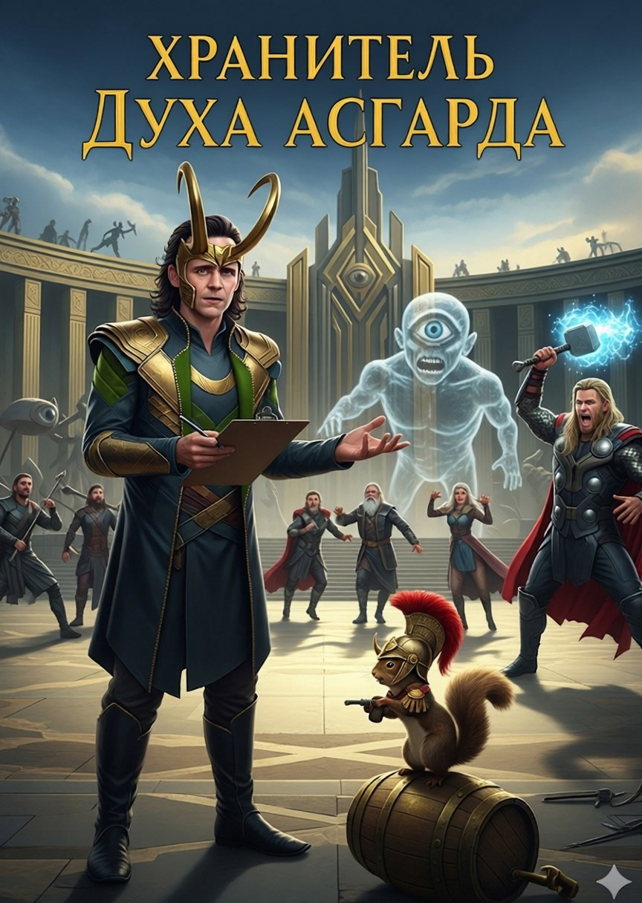

# Хранитель Духа Асгарда

## Аннотация

Что делать богу коварства, если главный враг — не ледяные великаны, а смертельная, всепоглощающая скука? Вечность в Асгарде превратилась в дурно поставленный спектакль, где каждый день — точная копия вчерашнего. Устав от «творческого некроза» и вепрей по тысячелетнему рецепту, Локи решает внести в идеальный мир немного... драматургии. Всего лишь тонкая настройка Божественного Эфира, чтобы добавить красок в пресные доклады воронов Одина.

## Обложка

