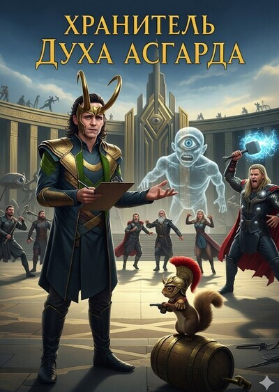

# Хранитель Духа Асгарда

## Аннотация

Что делать богу коварства, если главный враг — не ледяные великаны, а смертельная, всепоглощающая скука? Вечность в Асгарде превратилась в дурно поставленный спектакль, где каждый день — точная копия вчерашнего. Устав от «творческого некроза» и вепрей по тысячелетнему рецепту, Локи решает внести в идеальный мир немного... драматургии. Всего лишь тонкая настройка Божественного Эфира, чтобы добавить красок в пресные доклады воронов Одина.

## Обложка

### Часть 1. Творческий некроз

Часть 1. Творческий некроз

Громоподобный рык, который Тор по ошибке принимал за смех, в очередной раз встряхнул резные балки великого чертога. Он стоял посреди зала, воздев над головой опустевшую пивную кружку, и его лицо, багровое от выпитого мёда и натужного веселья, сияло самодовольством. Вокруг него боги и герои хохотали, хлопали по столам, били себя в грудь. Они исполняли свои роли в этой вековой пьесе с прилежанием хорошо обученных, но смертельно уставших актёров. Грохот веселья был оглушительным, но пустым; он не согревал, а лишь подчёркивал холод, царивший под позолотой и гобеленами.

— …и тогда я сказал ему: «Это не булава, это моя жена!» — донёсся до Локи финал заезженной до дыр истории. Очередная волна отрепетированного хохота прокатилась по залу.

Локи не слушал. Его взгляд был прикован к собственной тарелке. Там, на поверхности остывающего соуса, медленно затягивалась тонкая, радужная плёнка жира. Она подрагивала от вибрации, сотрясавшей зал, но упорно ползла от краёв к центру, стягивая жидкое варево в плотную, безжизненную массу. В этой плёнке Локи видел метафору всего их существования. Вот она, жизнь богов — яркая, жирная, обильная, но оставь её без движения хоть на миг, и она покроется этой тошнотворной коркой стагнации. Он ощущал вкус этого пира не языком, а всей душой: вкус пережаренного вепря, приготовленного по канону тысячелетней давности, который каждый новый повар воспроизводит всё более механически и бездарно; вкус застоявшегося мёда, сладкого до оскомины, и, главное, вкус бесконечного, удушающего повторения.

Он сидел чуть поодаль от общего веселья, в тени колонны, и его неподвижность была вызовом, молчаливым протестом против этого оглушительного праздника энтропии. Его пальцы лениво обводили край кубка. Он не пил. Воздух был плотным, как сусло, — стандартный букет любого пира из пролитого пива и пота сотен тел. Но сквозь эту жирную вонь Локи улавливал другую, куда более важную ноту. Запах пыли. Той самой, что оседает на вещах, которыми давно не пользуются.

— Локи, ты опять не ешь, — голос Фрейи прозвучал неожиданно близко. Она подсела к нему, её собственное лицо хранило следы вежливой усталости. Золотые волосы были уложены в безупречную причёску, платье сияло драгоценностями, но глаза… в глазах застыла та же тоска, что и в жирной плёнке на соусе. — Один будет недоволен.

— Он всегда недоволен, — отозвался Локи, не отрывая взгляда от тарелки. Его голос был тихим, почти шёпотом, но каждое слово звенело отточенной сталью. — Это его единственное развлечение. Наблюдать, как его идеальный мир ржавеет от бездействия, и хмурить брови. Драматургически слабо.

— Просто попробуй кабана. Повар сегодня…

Её фразу оборвал новый взрыв хохота. Это Тор, уронив кружку, пытался поймать её на лету, но вместо этого неуклюже врезался в стол, с которого с грохотом посыпалась посуда. Никто не рассердился. Все лишь засмеялись громче. Это было частью сценария. Тор — неуклюжий, но добродушный силач. Очередная сцена из бесконечного дурного спектакля.

Фрейя тяжело вздохнула и отвернулась, поняв тщетность своей попытки. Разговор, едва начавшись, утонул в общем шуме, сделался бессмысленным. Локи почувствовал укол почти физической боли. Это была боль художника, запертого в галерее, где висит лишь одна, дурно написанная картина, и все вокруг делают вид, что восхищаются ею.

Рассказ Тора иссяк. Наступила короткая, звенящая пустотой пауза — та самая, когда один актёр ушёл со сцены, а другой ещё не вышел. Для Локи эта секунда была страшнее любого крика. В ней не было покоя. В ней была пустота. Он знал, что сейчас кто-то другой, какой-нибудь седобородый эйнхерий, откашляется и начнёт свой рассказ. О том, как он сражался с великаном, или о том, как он перехитрил гнома. История будет другой, но суть останется прежней. Прошлое. Вечное, неизменное, мумифицированное прошлое. А будущее… будущего в Асгарде не было. Было только бесконечное сегодня, являющееся точной копией вчера.

Цикл был нерушим. И в этот момент Локи понял с леденящей ясностью, что если кто-то и способен его разорвать, то это только он. Не из злобы. Не из жажды власти. А из простого, базового инстинкта творца — невыносимости созерцания дурного искусства.

Пир уже начал терять свою и без того сомнительную энергию, превращаясь в пьяное, сонное бормотание, когда в зале появились они. Хугин и Мунин. Вороны Одина влетели в чертог бесшумно, как два клочка ночного неба, и это беззвучное движение было куда более властным, чем грохот Тора. Все разговоры мгновенно стихли. Герои, которые секунду назад горланили песни, потупили взоры. Даже пьяные замотали головами, пытаясь протрезветь. Вестники Всеотца не терпели фамильярности.

Они сделали круг под сводами и плавно опустились на плечи Одина, восседавшего на своём троне. Чёрные, как полированный обсидиан, без единого проблеска, их глаза были не глазами живых существ, а объективами, бесстрастно фиксирующими реальность. Их клювы были плотно сжаты. В их присутствии сам воздух, казалось, становился плотнее, гуще, наполняясь ожиданием.

Один медленно, с усталостью человека, выполняющего тысячелетнюю рутину, поднял руку.

— Что видели? Что слышали? — его голос пророкотал под сводами, но в нём не было ни любопытства, ни тревоги. Лишь формальность. Вопрос, который нужно было задать.

Первым ответил Хугин, Мысль. Его клюв щёлкнул, как затвор старого механизма. Голос был лишён каких-либо интонаций — ровный, механический, будто сгенерированный бездушным аппаратом.

— Мидгард: сев завершён. Урожай прогнозируется в пределах нормы. Конфликты локальные, стратегического значения не имеют.

Затем заговорил Мунин, Память. Его голос был точной копией голоса брата.

— Свартальфахейм: добыча руды стабильна. Новые жилы не обнаружены. Уровень производительности соответствует плановым показателям. Ванахейм: сезонные ветры без аномалий. Альвхейм: без происшествий. Йотунхейм: без происшествий.

Локи слушал, и в его душе поднималось нечто большее, чем просто раздражение. Это было холодное, почти научное отвращение. Он смотрел не на Одина, а на воронов. Идеальные инструменты. Безупречные каналы передачи данных. Они доставляли информацию в чистом, дистиллированном виде, без примесей, без эмоций, без интерпретаций. И именно это делало их чудовищно, невыносимо бездарными рассказчиками. Это был не доклад разведчиков. Это была биржевая сводка. Отчёт бухгалтера о состоянии вселенной. В их словах не было ни жизни, ни смерти, ни драмы, ни комедии. Только факты. Сухие, безвкусные, мёртвые факты. И Асгард питался этой информационной пылью, принимая её за пищу для ума.

Глядя на механические движения вороньих голов, слушая их безжизненные голоса, Локи вдруг понял. Проблема была не в скучных историях Тора. Проблема была в самом источнике информации. В канале. В этом безупречном, объективном, убийственно правдивом канале, который выхолащивал из реальности всю её суть, оставляя лишь скелет событий.

В его мозгу, как вспышка молнии, родилась идея. Не просто идея — концепция. Дерзкая, опасная, и оттого восхитительно прекрасная в своей простоте. А что, если «испортить» канал? Не менять факты. Боги упаси, это было бы слишком грубо, слишком предсказуемо. А что, если изменить их подачу? Что, если заставить этот безупречный ретранслятор не просто передавать информацию, а… интерпретировать её? Добавлять краски? Нагнетать драму? Превратить скучный отчёт о погоде в эпос о борьбе стихий? Что, если научить Мысль и Память искусству?

Один устало кивнул, принимая доклад.

— Вольно, — бросил он, и вороны, взмахнув крыльями, покинули его плечи и уселись на балку под потолком, превратившись в две неподвижные тени. Он дал знак музыкантам, и те робко заиграли какую-то заунывную мелодию. Пир, прерванный на несколько минут, возобновился, но уже без прежнего энтузиазма.

Всеотец не заметил ничего. Он был слишком поглощён своей вселенской усталостью и бременем власти. Он не увидел, как в глазах его приёмного сына, сидевшего в тени, вспыхнул хищный, голодный огонь. Огонь творца, нашедшего, наконец, свой холст и свои краски. Холстом должен был стать весь Асгард. А красками — души его обитателей.

Свои апартаменты Локи предпочитал всем остальным чертогам Асгарда. Здесь царил идеальный порядок, но это был не мёртвый порядок Вальхаллы. Это была продуманная, живая композиция. Книги на полках стояли не по алфавиту, а по темам, образуя причудливую карту его интересов. Артефакты на столе были расставлены так, что свет от магического светильника падал на них под определённым углом, создавая игру теней. Это было пространство, подчинённое воле одного-единственного художника. Его святилище.

Он стоял у высокого стрельчатого окна, глядя на раскинувшийся внизу ночной Асгард — идеальный, слишком идеальный. Прямые, как стрелы, улицы; ровный, холодный свет фонарей, горящих негасимым пламенем; башни дворца, устремлённые в небо с математически выверенной точностью. В этой безупречной геометрии он видел не гармонию, а тиранию линейки и циркуля. Это была сетка на листе миллиметровой бумаги, где не оставалось места для живого, небрежного мазка. Город, спроектированный уставшим богом-бухгалтером.

Его пальцы скользнули по холодному камню подоконника. Мысли, до этого бывшие лишь смутным чувством, теперь оформлялись в чёткий, безжалостный манифест, который он произносил внутри своей головы.

«Они боятся хаоса, — думал он, глядя на ровные ряды огней. — Они построили этот золотой загон и назвали его Порядком. Но единственный настоящий, абсолютный хаос — это идеальный порядок, доведённый до своего логического предела. Это тепловая смерть вселенной, переведённая на язык духа».

Он оторвал взгляд от унылого великолепия города. «Это энтропия. Асгард не болен. Он мёртв. Он просто ещё не заметил этого, потому что его сердце продолжает биться по инерции, заведённое тысячу лет назад».

Он резко отвернулся от окна. Решение было принято. Не спонтанно, не в порыве гнева. Оно созревало в нём годами, и сегодняшний пир, этот апофеоз дурновкусия, стал лишь последней каплей. Пассивное созерцание уродства было окончено. Начинался акт творения. А любое истинное творение начинается с разрушения.

Локи подошёл к книжной полке, его движения стали точными и быстрыми. Он не тянулся к древним фолиантам с тёмными проклятиями. Это было бы слишком банально. Его пальцы нашли небольшой, скромно переплетённый том без названия. Его собственный конспект, исписанный убористым почерком много веков назад, когда магия была для него не инструментом, а наукой, полной неизведанных возможностей. Он искал не оружие. Он искал лазейку в системе.

Он быстро перелистывал страницы, покрытые формулами и диаграммами. Теория элементалей, основы трансфигурации, хрономантия… всё не то. Наконец, его палец остановился на нужном заголовке, выведенном чуть более крупно: «Теория психического резонанса. Принципы воздействия на коллективную эмпатическую матрицу».

Он усмехнулся. Эмпатическая матрица. «Божественный Эфир», как его пафосно назвал Один. Система, созданная для единения, стала инструментом тотальной унификации, превратив всех асов в приёмники, настроенные на одну-единственную, бесконечно унылую волну.

Что ж, пришло время добавить в эфир немного помех.

В главную библиотеку Асгарда Локи не заглядывал столетиями. Она, как и всё остальное, превратилась в музей, где хранители берегли знания, не понимая их сути. Но его интересовала не парадная часть. Его путь лежал в дальнее, заброшенное крыло, куда не заходили даже уборщики. Здесь воздух был густым и неподвижным, пахло пылью, старой бумагой и чем-то ещё — едва уловимым, от распадающихся магических фолиантов. Тишина в этом крыле была не просто отсутствием звука, а чем-то вещественным, давящим на барабанные перепонки.

Он не стал возиться с запертой дверью. Это было бы слишком шумно и грубо. Вместо этого он подошёл к стене, украшенной огромным барельефом Иггдрасиля. Его пальцы, не колебляся, нашли нужные точки — руны, скрытые в переплетении корней и ветвей. Он нажал на них в строгой, известной только ему последовательности. Раздался тихий скрежет, и часть стены, изображавшая ствол мирового древа, беззвучно ушла в сторону, открывая тёмный проход. Он сам создал этот ход много веков назад, когда был молод, любопытен и ещё верил, что знание стоит того, чтобы его прятать.

Внутри небольшого тайника было ещё тише и темнее. Локи зажёг на кончике пальца маленький изумрудный огонёк, и его свет выхватил из мрака ряды стеллажей и единственный массивный сундук из тёмного дерева, окованный железом. Его шаги гулко разносились под сводами, поднимая с пола облачка вековой пыли, которая лениво закружилась в свете его магического пламени.

Сундук не был заперт — забвение всегда было лучшей защитой. Локи откинул тяжёлую крышку. Внутри лежали свитки, чертежи, исписанные его собственным, ещё угловатым, заносчивым юношеским почерком. Это были его рабочие материалы, наброски и расчёты, которые он делал, когда Один привлёк его, своего самого талантливого, пусть и несносного, сына, к величайшему проекту в истории Асгарда — созданию «Божественного Эфира».

Он быстро перебирал пергаменты, пока не нашёл то, что искал. Большой свиток с детальной схемой эмпатической матрицы. И на полях — его пометки. Вот она. Небольшая диаграмма, обведённая в кружок, с подписью: «Эмоциональный байпас. Резервный контур для прямого инвольтирования аффективных состояний». Проще говоря — чёрный ход. Дыра в системе безопасности, которую он встроил на случай… на всякий случай.

Перечитывая свои собственные записи, он усмехнулся. Каким же он был самонадеянным юнцом! Но в усмешке не было презрения, скорее — ностальгия, смешанная с лёгким самодовольством. Он вспомнил, зачем оставил эту лазейку. Не просто для розыгрыша. Это был его личный предохранитель против тирании. На случай, если Один решит превратить Эфир из инструмента единения в инструмент тотального контроля над мыслями и чувствами. Так что это был не просто вандализм. Это была давняя, отложенная на века борьба с системой.

Но тут его взгляд наткнулся на кое-что ещё. Внизу страницы, мелким, почти неразборчивым почерком была сделана приписка: «ВНИМАНИЕ: неконтролируемая эмпатическая отдача может привести к каскадному резонансу, где эмоции наблюдателей усиливают исходный сигнал. Побочные эффекты: коллективная истерия, спонтанные нарративные галлюцинации».

Он на мгновение замер. Коллективная истерия. Звучало… многообещающе. Но затем он увидел то, что заставило его нахмуриться. Ключевая руническая формула, отвечающая за модуляцию сигнала, была целой, но рядом с ней стоял его собственный юношеский комментарий: «Стабилизирующая руна Альгиз — избыточна. Перестраховка Одина. Убрать для чистоты эффекта». Он вспомнил, как сознательно убрал этот предохранитель, сочтя его уродливой заплаткой на изящном полотне заклинания. Самонадеянность юности. Это добавляло в его безупречный план элемент хаоса, случайности. Он не мог быть на сто процентов уверен, что всё сработает так, как он задумал.

Колебание длилось не дольше удара сердца. А потом его сменил азарт. Риск. Непредсказуемость. Разве не этого он так жаждал? Разве не это отличало живое искусство от мёртвого ремесла? Идеально выверенный план был бы скучен. А вот импровизация на грани катастрофы… О, это было совсем другое дело.

Он решительно свернул свиток и сунул его за пазуху. План был готов. Неидеальный. Опасный. И оттого — совершенный.

Вольер воронов располагался в одной из самых охраняемых башен дворца. Подобраться к нему незамеченным было задачей нетривиальной даже для бога козней. Но Локи не собирался вступать в бой или прокрадываться мимо постов, рискуя быть обнаруженным. Его методы всегда были изящнее.

Он затаился в глубокой тени арки, всего в двадцати шагах от коридора, ведущего к вольеру. Там, в конце коридора, несли вахту два эйнхерия, огромных, как шкафы, и, вероятно, столь же сообразительных. Локи прикрыл глаза, сосредоточился и сплёл из воздуха и магии простую, но эффективную звуковую иллюзию. Из-за поворота в дальнем крыле дворца донеслись звуки ссоры: громкие, пьяные голоса, звон разбитой бутылки и отборная брань.

Стражники у вольера переглянулись. Один раздражённо цыкнул языком.

— Опять эти идиоты из третьей когорты, — проворчал он. — Пойду вправлю им мозги. А ты оставайся здесь.

— Давай быстрее, — буркнул второй.

Пока первый стражник, тяжело топая сапогами, удалялся в сторону источника шума, Локи выскользнул из тени. Он двигался абсолютно бесшумно, его лёгкие сапоги не издавали ни звука на каменных плитах. Он был тенью, скользящей вдоль стены. Оставшийся стражник стоял спиной к нему, вглядываясь в темноту коридора, откуда ушёл его напарник. Этого было достаточно.

Замок на массивной двери вольера был защищён рунами стража. Локи не стал его ломать. Вместо этого его пальцы заплясали в воздухе, сплетая контр-заклинание — сложную ложь из магии, которая представилась замку легитимным ключом. Руны на мгновение вспыхнули и погасли. Раздался глухой щелчок поддавшегося засова.

Внутри вольера пахло птицами, старым деревом и сухой соломой. На огромной ветви, установленной в центре, спали Хугин и Мунин, прижавшись друг к другу. Два тёмных, неподвижных комка перьев.

Локи медленно, плавно подошёл к ним. Воздух вокруг него начал слегка вибрировать, наполняясь изумрудным свечением, которое исходило от его ладоней. Он не собирался кричать варварские заклинания или чертить в воздухе сложные символы. Его магия была тонкой, как мысль. Он собирался говорить.

Он наклонился к спящим птицам, и его голос полился в тишину — тихий, вкрадчивый, убедительный шёпот гипнотизёра, проникающий сквозь сон прямо в их сущность.

— Мысль… Память… — начал он, едва шевеля губами. — Вы видите не события. Вы видите истории. Вы слышите не слова. Вы слышите музыку, стоящую за ними. Хватит протоколов. Хватит отчётов. С этого момента ваша задача — не информировать. Ваша задача — волновать.

Он осторожно коснулся головы Хугина. По чёрным перьям пробежала едва заметная изумрудная рябь.

— Не говорите, что Тор был силён. Покажите, как трещали кости великана под его ударом. Заставьте всех услышать этот хруст. Не говорите, что Фрейя скорбит. Заставьте всех захлебнуться её золотыми слезами, почувствовать их солёный вкус на губах.

Затем его палец коснулся Мунина. Новая волна зелёного света.

— Не говорите, что Один мудр. Заставьте всех почувствовать на своих плечах невыносимую тяжесть его короны, холод его пустого трона. Не рассказывайте. Показывайте. Преувеличивайте. Добавляйте конфликт. Ищите драму в каждом вздохе, в каждом упавшем листе. Превратите этот мир в сцену. А я посмотлю, как они сыграют свои новые роли.

Он отступил. Вороны не проснулись. Но их дыхание, до этого ровное и спокойное, стало более глубоким, прерывистым. Словно во сне они видели нечто грандиозное и тревожное.

Работа была сделана.

Локи так же тихо вышел из вольера, прикрыл за собой дверь и провернул замок. Он растворился в тенях за мгновение до того, как из-за поворота вернулся первый стражник, ругаясь себе под нос, что не нашёл никаких дебоширов.

Эйнар, стражник из ночной смены, стоял на своём посту на восточной стене и отчаянно боролся со сном. Предрассветные часы были самыми тяжёлыми. Холодный ветер пробирал до костей, а монотонность службы убаюкивала лучше любой колыбельной. Он думал о горячей каше, которую съест на завтрак, и о своей тёплой постели. До смены оставалось всего ничего.

Первые лучи солнца начали окрашивать небо на востоке, и длинные тени легли на каменные плиты двора. Эйнар машинально посмотрел на свою собственную тень — вытянутую, нелепую фигуру с копьём. Он переступил с ноги на ногу, и тень покорно повторила его движение. Всё было как обычно. Скучно. Предсказуемо.

Он замер, уперев копьё в землю, и уставился на горизонт, где разгоралась заря. И тут что-то шевельнулось на периферии его зрения. Его собственная тень.

Он застыл. Дыхание перехватило. Тень, которую он только что видел неподвижной, медленно, с издевательской грацией, поклонилась ему. Она согнулась в поясе, преклонила голову, а потом так же медленно выпрямилась, хотя сам Эйнар стоял не шелохнувшись, прямой, как его копьё.

Это длилось всего секунду. Одну невыносимо долгую секунду. Он моргнул, и тень снова была нормальной — неподвижным тёмным пятном, послушно лежащим у его ног.

— Недосып, — прохрипел он, яростно тряся головой. Но холод, от которого застучали зубы, шёл уже не от предрассветного ветра, а изнутри. Он пытался найти рациональное объяснение: игра света, обман зрения, усталость. Но его не отпускало ощущение, что сама ткань реальности на мгновение прохудилась, и в эту дыру заглянуло нечто неправильное. Что-то в мире сломалось.

Из теней арки, мимо поста Эйнара, прошла тёмная, стройная фигура, закутанная в плащ. Стражник, всё ещё потрясённый увиденным, почти не обратил на неё внимания. Обычный вельможа, возвращающийся с ночной прогулки.

Если бы Эйнар присмотрелся внимательнее, если бы его взгляд не был затуманен страхом, он бы увидел, что на лице бога козней, Локи, играла лёгкая, хищная и донельзя довольная улыбка. Улыбка художника, который только что сделал первый мазок на своём великом полотне и теперь с нетерпением ждал, когда высохнет краска, чтобы увидеть результат.

### Часть 2. Премьера апокалипсиса

Часть 2. Премьера апокалипсиса

Тор Одинсон проснулся от хихиканья. Не от оглушительного хохота эйнхериев, не от громоподобного смеха собственного отца и уж точно не от язвительного смешка Локи, который всегда звучал так, будто кто-то царапает стекло. Это было тихое, тонкое, навязчивое хихиканье, похожее на шелест сухих листьев, и оно просачивалось сквозь тяжёлый, похмельный сон, в котором великаны были сделаны из медовухи, а реки текли пивом.

Тор открыл глаза. Воздух в его покоях словно загустел, набился пылью и чужой, сладковатой магией. Во рту стоял приторный привкус, как от перезрелых лесных ягод, что лопаются на языке, оставляя лишь вязкую горечь. Он сел на огромной кровати, и дубовые доски протестующе скрипнули под его весом. Чугунная тяжесть в черепе отозвалась на движение тупой болью. Хихиканье не прекратилось. Оно доносилось из угла комнаты, из-за массивного гардероба, куда он обычно сваливал доспехи.

— Кто здесь? — пророкотал Тор. Голос, непривычно хриплый после вчерашнего пира, показался ему чужим. — Выходи! Честью клянусь, если это опять твои шутки, Локи…

Фигура вышла из-за гардероба, и Тор замолчал.

Потому что это была его точная копия. Не просто похожая, не сотканная из теней. Это был он сам, до последней детали: та же спутанная светлая борода, тот же шрам над правой бровью, те же могучие плечи. Но что-то одно в этой картине никак не становилось на место в гудящей голове бога грома. Его двойник был одет в пышное белое свадебное платье.

Платье было абсурдно, нелепо великолепным. Тысячи крошечных жемчужин покрывали лиф, кружевные оборки каскадом спускались к полу. Длинная фата, приколотая к золотистым волосам, была расшита серебряными рунами. Видение — а это не могло быть ничем иным — выглядело абсолютно реальным. Кружево подрагивало от несуществующего сквозняка, а жемчуг ловил тот скудный утренний свет, что сочился между тяжёлыми шторами.

Двойник в платье приложил палец к губам, кокетливо наклонил голову, подмигнул Тору и снова хихикнул тем самым тонким, сводящим с ума смешком.

Первой реакцией Тора был гнев. Чистый, незамутнённый, простой как удар молота. Он взревел, и рёв этот сотряс стены. Вскочив с кровати, он ринулся вперёд, сжав кулаки размером с небольшие наковальни. Удар был сокрушительным. Он вложил в него всю ярость от похмельной головной боли, от дурного сна и от этого нелепого видения, но кулак провалился в пустоту — лишь лёгкий, холодный озноб, будто он сунул руку в стоячую воду.

На мгновение иллюзия исказилась, пошла рябью, но не исчезла. Двойник в платье лишь отступил на шаг, поправил несуществующую складку на юбке и продолжил хихикать, теперь уже громче, наглее. Он взревел снова, и между его пальцами заплясали искры. Он метнул в иллюзию короткую молнию, но та прошла насквозь, оставив на стене лишь небольшое опалённое пятно. Призрак в платье лишь кокетливо погрозил ему пальцем.

Вот тогда Тор и замер. Не только его мышцы, но и сама его суть, его власть над громом, оказались бессильны. Он тяжело дышал. Лоб стал холодным и липким. Это было не страшно. Это было унизительно. Он, сокрушитель миров и победитель ледяных гигантов, стоял в собственном исподнем и не мог ничего сделать с призраком самого себя в дурацком платье. Он чувствовал себя самым могучим и самым бесполезным существом в Девяти мирах. Вся его сила, вся его гордость оказались бессмысленны перед лицом этого насмешливого хихиканья. Он посмотрел на свои руки — руки, что держали Мьёльнир, — и впервые в жизни они показались ему просто кусками мяса.

В зале для завтрака царил сдержанный хаос. Боги и герои сновали туда-сюда с растерянными лицами, перешёптывались, показывали пальцами в пустоту. Тишина в зале стала плотной, натянутой, готовой лопнуть в любой момент. Только Фрейя, богиня любви и войны, сидела за своим столом с идеальной осанкой, делая вид, что ничего не происходит. Она намеревалась позавтракать, как подобает леди, даже если Рагнарёк решит начаться прямо сейчас.

Изящным движением пальцев она подозвала слугу, но тот пробежал мимо, отмахиваясь от чего-то, что видел только он. Фрейя поджала губы. Дурные манеры.

Она взяла в руки серебряный нож и вилку, намереваясь разрезать ещё тёплую, пахнущую корицей булочку, когда почувствовала над головой странный холод. Прямо над её безупречной причёской зависла небольшая, персональная грозовая туча. Тёмно-серая, с перламутровыми всполохами, она выглядела до смешного материальной. Фрейя моргнула. Туча не исчезла.

Из неё упала первая капля. Густая, тяжёлая, цвета расплавленного золота. Она с тихим шлепком приземлилась в центр булочки. За ней упала вторая, третья. Через несколько секунд из тучи хлынул настоящий ливень из золотых слёз — гипертрофированное, вытащенное наружу безжалостной магией проявление её скорби по Бальдру, превращённое в нелепое и очень мокрое зрелище. Золотые капли барабанили по столу. Булочка моментально просела, превратившись в отвратительную, блестящую кляксу.

Фрейя попыталась прикрыться тарелкой, но поток только усилился, заливая ей волосы и плечи. Она сидела так несколько секунд, пока вокруг неё разливалась блестящая лужа. Воины за соседними столами замерли, глядя на это зрелище с открытыми ртами. Кто-то хихикнул.

Не сказав ни слова, Фрейя медленно положила нож и вилку на стол, выровняв их параллельно краю, и так же медленно встала. С её золотистых волос стекали золотые струи. Шёлковое платье прилипло к телу. С абсолютно непроницаемым лицом, глядя прямо перед собой, она развернулась и покинула зал. Её молчаливый, мокрый и униженный уход произвёл на присутствующих куда большее впечатление, чем любые крики.

К девяти утра Асгард был парализован. Не войной, не чумой. Он был парализован плохим театром. Магия Локи, внедрившаяся в Божественный Эфир, расползлась по городу, как вирус, превращая сознание каждого жителя в сцену для абсурдной пьесы.

На своём посту у Радужного моста Хеймдалль, чьи глаза могли видеть, как растёт трава в Мидгарде, застыл. Десятки тысяч ледяных великанов надвигались на Асгард. Иллюзия была грубой, но она не пыталась обмануть его глаза. Она била прямо в мозг через Эфир, подменяя сигналы, идущие от сетчатки. Он знал, что видит нечто неправильное, но паника, навязанная ему извне, уже сжимала его горло. Инстинкт, усиленный магией, возобладал над разумом, и он поднёс к губам Гьяллархорн. Тревожный, пронзительный звук рога разнёсся над городом. Звук начала последней битвы.

Хеймдалль опустил рог, готовясь встретить врага. И в этот момент армия исчезла. Растворилась в утреннем воздухе. А на её месте, на зелёном лугу, появился хоровод из нескольких сотен весело блеющих коз в миниатюрных крылатых шлемах валькирий. Хеймдалль смотрел на них, потом на свой рог, потом снова на коз. Выражение вселенского замешательства исказило его суровое лицо. Он только что объявил о конце света из-за стада парнокопытных.

В раскалённых кузницах под городом гномы-мастера выли от ярости. На их верстаки, где лежали свитки с уникальными чертежами, пикировали иллюзорные огненные драконы. Огонь был нематериален, но порождал настоящий, физический жар. Тонкий пергамент темнел, коробился и осыпался пеплом под его дыханием. Труд нескольких месяцев уничтожался за пару минут бессмысленным спецэффектом.

В казармах эйнхериев старые друзья Бьорн и Харальд впервые в жизни смотрели друг на друга с ненавистью. Минуту назад они делили кружку мёда, но потом Эфир, будто подлый сплетник, шепнул Бьорну на ухо видение: ему показалось, что Харальд, глядя на его старый шрам, презрительно ухмыльнулся.

— На что уставился? — прорычал Бьорн.

— Ты о чём?

— Думаешь, я не видел? Тебе смешон мой шрам? Забыл уже, где я его получил, пока твою задницу спасал?!

Словесная перепалка быстро переросла в мордобой.

А на рыночной площади творился сущий ад. Торговцы и жители метались, отмахиваясь от личных кошмаров. Полная женщина визжала, глядя, как сотни иллюзорных пауков выползают из её корзины с яблоками. Уважаемый торговец тканями рыдал, потому что его шёлковые рулоны в его глазах превратились в прах. Социальные связи, доверие, рутина — всё, на чём держался порядок, рвалось на глазах. Асгард перестал быть городом. Он стал собранием одиноких сумасшедших, запертых в общем кошмаре.

Локи стоял на балконе с чашкой чая и наблюдал за паникой. На его лице играла довольная улыбка творца, чьё творение устроило дебош на городской площади. Наконец-то! Наконец-то в этом сонном царстве появилась жизнь. Драма. Движение. Пусть это были страх и растерянность, но они были в тысячу раз живее той пресной похлёбки, которую они называли миром. Да, это было искусство.

Он присмотрелся к деталям. Вот Тор выбежал на площадь, пытаясь стряхнуть с себя иллюзию в свадебном платье. Забавно. Вот Хеймдалль уже в третий раз трубил тревогу. Остроумно.

Но потом его взгляд зацепился за другие сцены. Золотые слёзы Фрейи… это было чересчур. Прямолинейно, сентиментально, почти пошло. Драка эйнхериев из-за мнимой ухмылки? Банальный конфликт, достойный дешёвой мыльной оперы. А эти драконы… почему обязательно драконы? Улыбка медленно сползла с его лица. Удовлетворение сменилось раздражением. Он понял, что создал не высокую трагедию, а низкопробный фарс. Это был не Шекспир. Это была базарная пьеса.

В его замысле была элегантность, ирония. А в реальности получился кричащий, аляповатый балаган. Он вспомнил свою запись на свитке. Вот он, результат. Его тончайший инструмент превратился в кувалду. Он хотел дать им почувствовать скрытую драму бытия, а вместо этого вывалил на них их самые примитивные страхи в самой вульгарной обёртке.

«Где полутона? Где психологическая глубина?» — пронеслось в его голове. Он смотрел на мечущуюся толпу, и вместо восторга творца чувствовал брезгливость. Раздражение эстета, чей шедевр испортили. «Это не искусство. Это кричащая безвкусица. Они заслуживали очищающего огня, а получили дешёвый фейерверк». Он с отвращением поставил чашку на перила.

Тронный зал был полон. Разъярённые боги окружили Локи, отрезая пути к отступлению. Воздух был наэлектризован их гневом. Каждый из них отмахивался от собственных иллюзий, что делало сцену ещё более сюрреалистичной.

— Это ты! — Тор пробился сквозь толпу. Его лицо было багровым. Призрачное свадебное видение вилось вокруг него, периодически поправляя фату. — Опять твои… твои фокусы!

— Брат, я всего лишь добавил немного… зрелищности, — Локи сделал шаг назад. Его сердце начало стучать чуть быстрее. — Ты же сам вчера жаловался на смертную скуку.

— Подарком? — раздался холодный голос Фрейи. Она протиснулась вперёд, отряхивая с плеча невидимую золотую пыльцу. — Мой гобелен, над которым я работала двадцать лет, уничтожен, Локи. Он превратился в клубок визжащих змей.

— Искусство требует жертв, дорогая, — парировал Локи. — А твой гобелен, будем честны, был… ну, драматургически слабоват. Слишком много оленей.

Эта фраза стала последней каплей. Тор взревел и бросился на него. И в этот момент сработал «психический рикошет». Чем сильнее была ярость Тора, тем плотнее становилась его персональная иллюзия. Призрак в свадебном платье возник прямо на его пути, раскинув руки. Тор врезался в него, но его руки снова прошли сквозь пустоту. Иллюзия захихикала и обвила его шею своими призрачными руками.

— Пусти! Убери! — ревел Тор, молотя кулаками по воздуху.

— Это побочный эффект! — крикнул Локи, пытаясь перекричать шум. — Я всё исправлю! Это просто… первая проба!

Но его никто не слушал. Шум в зале превратился в какофонию. Он огляделся. Десятки глаз, полных ненависти, смотрели на него. И он осознал с ледяной ясностью, что впервые в своей долгой жизни полностью, абсолютно потерял контроль.

— ДОСТАТОЧНО!

Голос Одина не был громким, но в нём была тяжесть веков. Он появился в зале из бокового прохода, опираясь на копьё Гунгнир. Его единственный глаз обвёл обезумевшую толпу. Один ударил древком копья о мраморный пол. Звук был сухим и властным. Иллюзии на секунду поблекли.

— Что здесь происходит…

Он не договорил. Искажённый Эфир больше не подчинялся своему создателю. Система уловила доминирующую эмоцию в зале — первобытный страх перед концом света — и решила, что это отличная тема для третьего акта. Стены тронного зала растаяли. Золотые колонны сменились картиной пылающего мира. С почерневшего неба падал гигантский волк Фенрир. Из глубин поднимался змей Йормунганд. Вороны транслировали Рагнарёк. Не просто картинку — они транслировали ощущение вселенской безысходности.

Все в зале замерли, парализованные ужасом. И в этот момент Локи всё понял.

Он смотрел на лицо Тора, искажённое видением Рагнарёка, и видел в нём не только ужас, но и отражение свадебного платья. Он видел, как золотые слёзы Фрейи теперь смешиваются с иллюзорным пеплом конца света. Это была не его пьеса. Вороны не транслировали его замысел. Они просто брали то, что было на поверхности — страх, скорбь, ярость, — и усиливали это до предела. Как тупой, но усердный подмастерье.

Чем больше все боялись, тем страшнее становились иллюзии. Чем страшнее иллюзии — тем сильнее страх. Он создал не сломанный передатчик. Он создал самопожирающий механизм безумия. Истинный ужас заключался не в том, что он ошибся. А в том, что он создал нечто, что было живым, голодным и абсолютно безвкусным.

Видение Рагнарёка парализовало всех, но не Тора. Его простой гнев оказался сильнее навязанного страха. Оправившись от ступора, он снова двинулся на Локи, рыча как раненый зверь. Локи понял, что на объяснения нет времени. Его сейчас убьют. Просто потому, что он был самой удобной целью в этом мире, потерявшем смысл. У него были секунды.

Он не стал создавать сложную иллюзию. Вместо этого он использовал знание. Глубокое знание слабостей своего брата.

Прямо перед лицом несущегося на него Тора он материализовал один-единственный образ. Огромного, чёрного, волосатого паука размером с волка. Он знал об иррациональном, животном ужасе, который его брат испытывал перед арахнидами с самого детства.

Эффект превзошёл все ожидания. Тор не просто закричал. Он издал панический, тонкий, почти поросячий визг, абсолютно несовместимый с его героическим образом. Не глядя, он шарахнулся в сторону. Его могучее плечо врезалось в ближайшую мраморную колонну. Раздался треск. Колонна, подточенная веками, не выдержала удара. С оглушительным грохотом она накренилась и рухнула, поднимая облако мраморной пыли и вызывая новую волну паники.

В создавшейся суматохе, пока все отвлеклись на грохот, пыль и визг Тора, Локи действовал. Он больше не был ни творцом, ни эстетом. Он был просто существом, которое хотело выжить. Он проскользнул за массивный трон Одина, нырнул в неприметную дверь служебного коридора и исчез во тьме.

Он больше не был режиссёром. Он стал актёром в чужой, вышедшей из-под контроля, уродливой пьесе. И сейчас ему досталась роль беглеца.

### Часть 3. Безумие как метод

Часть 3. Безумие как метод

Тронный зал Асгарда уже несколько часов был сценой для дурно поставленной трагедии, а её режиссёр — затравленным беглецом. Для большинства асгардцев эти часы растянулись в калейдоскоп персональных кошмаров. Для Локи они сжались в один тугой, вибрирующий миг. Адреналин, толкавший его по пыльным служебным коридорам, давно иссяк, оставив только холодный, липкий ком на дне желудка. Он больше не бежал. Он анализировал.

Его убежищем стала старая кладовая, затерянная за выцветшими гобеленами с очередной победой Тора над каким-то безымянным ледяным великаном. Воздух здесь был густым, почти осязаемым, сотканным из запахов пыли, мышиного помёта и едва уловимой, сладковатой ноты высохшей темперы. Это было его тайное святилище, студия и, по совместительству, место величайшего позора. По стенам были небрежно развешаны акварели — сентиментальные, до боли бездарные пейзажи, котята, играющие с клубками света, цветы с неестественно яркими лепестками. Каждый мазок — отчаянная попытка найти гармонию в мире, требовавшем от него лишь хаоса. Он ненавидел эти рисунки всей своей сутью. И только они не давали ему окончательно распасться.

Сейчас, однако, они служили лишь молчаливыми свидетелями его провала. На каменном полу, в круге света от магического огонька, был развёрнут старый свиток — та самая схема Божественного Эфира, его неоконченное, импровизированное оружие. Локи сидел перед ним на корточках, подперев подбородок костяшками пальцев, и не просто смотрел на древние руны — он их допрашивал. Взгляд, обычно полный иронии, сейчас был острым и холодным, как скальпель хирурга, вскрывающего собственный труп в поисках роковой ошибки.

— Не то… не так… — шептал он, и дыхание поднимало с пола крошечные вихри пыли.

Пальцы медленно скользили по пергаменту, обводя место, где он самонадеянно проигнорировал стабилизирующую руну. Он проигрывал в уме события последних часов снова и снова, отсекая эмоции, оставляя лишь сухую механику. Первоначальный замысел был элегантен, как стилет: всего лишь подкрутить контрастность реальности, добавить ей немного драматургии, превратить пресные доклады воронов в захватывающие трейлеры. Но получилось нечто иное. Пиратская трансляция из преисподней, запущенная на всех каналах одновременно. Вульгарно. Безвкусно. Отвратительно.

Ошибка была не в инструменте, а в публике. Он дал богам драму, но они оказались никудышными зрителями. Их мелкие, примитивные страхи, их тщеславие, их застарелые обиды — всё это хлынуло в Эфир, отравляя его, как капля чернил отравляет стакан чистой воды. Его изящная модификация превратила сеть в гигантский усилитель их коллективного подсознания. Система не просто транслировала. Она слушала, впитывала доминирующую эмоцию — страх — и ретранслировала её обратно, усилив в десять раз. Самоподдерживающийся цикл безумия. Вирус, который он сам написал и выпустил.

Отключить систему он не мог — для полной перезагрузки требовался одновременный волевой импульс его самого и Одина, а Всеотец сейчас был слишком глубоко в собственном кошмаре. Откатить модификацию — тоже: вирус уже стал самоподдерживающимся и не отвечал на его команды. Пытаться заглушить тысячи отдельных иллюзий — всё равно что вычерпывать океан ложкой. Каждая подавленная галлюцинация порождала две новые, питаясь паникой того, кто пытался с ней бороться. Чем яростнее Тор махал молотом, тем детальнее становилось кружево на свадебном платье его двойника.

Отчаяние накатило, вязкое и тошнотворное. Он вдруг почувствовал себя не богом, а насекомым, запутавшимся в собственной паутине. Он проиграл. Не Тору, не Одину. Своему собственному творению, своей бездарной, вышедшей из-под контроля пьесе. Локи опустил голову, упёршись лбом в холодный камень. Взгляд его бесцельно зацепился за одну из акварелей. Самую нелепую из всех. Белка. Обычная рыжая белка, сжимавшая в лапках несоразмерно большой орех. Он нарисовал её в приступе особо острой тоски, пытаясь запечатлеть хоть что-то простое, лишённое двойного дна.

Белка. Орех. Простая, понятная цель.

Тысячи слабых, панических сигналов… создающих белый шум.

Один… громкий… всепоглощающий сигнал.

В его сознании что-то щёлкнуло. Сухо, громко, как ломающаяся кость. Он поднял голову. Взгляд сфокусировался. Он смотрел не на акварель — он смотрел сквозь неё, видя уже не рисунок, а решение. Решение настолько абсурдное, настолько идиотское и в то же время настолько гениальное в своей простоте, что у него перехватило дыхание.

Он не будет чистить канал. Он его забьёт.

Он не будет бороться с тысячами маленьких кошмаров. Он создаст один большой, грандиозный, всепоглощающий фарс. Нарратив настолько громкий, эпичный и в то же время абсолютно бессмысленный, что перегруженный Эфир, ведомый его же «драматургическим» фильтром, присосётся к нему, как хищное растение к единственной жертве, игнорируя всё остальное. История должна быть достаточно нелепой, чтобы не резонировать с реальными страхами богов — Рагнарёк и великаны под запретом. Но достаточно захватывающей, чтобы вороны, эти новоиспечённые продюсеры апокалипсиса, сочли её достойной прайм-тайма.

Локи медленно поднялся, хрустнув затёкшими суставами. Пыль осыпалась с его колен. Выражение загнанного отчаяния на его лице сменилось ухмылкой — хищной, лихорадочной, исказившей тонкие губы. В зелёных глазах вспыхнул холодный блеск — тот самый, что всегда появлялся перед началом чего-то ужасного или великого. Он снова был в игре. Не жертва, спасающаяся бегством. Режиссёр. И он только что нашёл для своей бездарной труппы новый сценарий. Хаос не нужно было устранять. Его нужно было возглавить, срежиссировать и довести до такого оглушительного крещендо, чтобы сама реальность не выдержала и заткнулась.

* * *

Тренировочный зал был единственным местом в Асгарде, где Тор чувствовал себя хоть сколько-нибудь уверенно. Здесь всё было просто: тяжёлые мечи, которые нужно поднимать, и манекены из прочной кожи, которые нужно бить. Понятная, честная боль в мышцах. Но сегодня и эта простая физика мира дала трещину.

Тор сидел на полу, тяжело дыша. Пот смешивался с грязью на лице. Он пытался медитировать, как учила мать, — очистить разум, сосредоточиться на дыхании. Но его разум превратился в базарную площадь, где каждая тварь выкрикивала свои страхи. Стоило закрыть глаза, как из углов зрения начинали выползать тонкие, волосатые лапки. Резко открывал — никого. Но фантомное ощущение их движения оставалось на коже, заставляя вздрагивать. А хуже всего была невидимая хихикающая дрянь в свадебном платье. Он её не видел, но постоянно слышал шелест шёлка за спиной и тихий, унизительный смешок. Он был измучен. Унижен. И в ярости.

Эфир был забит шумом, но сквозь какофонию Локи всё ещё мог различить мощные, хоть и искажённые, сигнатуры богов. Сигнатура Тора, пульсирующая яростью и унижением, вела прямо сюда.

— Хватит гоняться за тенями, брат. Я пришёл предложить тебе настоящую битву.

Голос Локи материализовался из воздуха, тихий, ровный, без намёка на панику. Он стоял в дверном проёме, элегантно прислонившись к косяку, безупречный, как всегда. Ни пылинки на тёмном камзоле, ни единой выбившейся пряди. Оскорбительно спокоен.

Тор взревел. Не человеческий крик — рык раненого зверя. В одно движение он вскочил на ноги, мышцы вздулись под кожей. Мьёльнир, лежавший рядом, сам прыгнул ему в руку.

— Ты! — прорычал он, делая шаг вперёд. Пол под сапогами, казалось, прогнулся. — Я размажу тебя по этим стенам так, что даже вороны твоего отца не соберут!

— Можешь. Потом, — Локи не сдвинулся с места, лишь поднял ладонь в умиротворяющем жесте. — Если Асгард к тому времени ещё будет стоять. А пока поверь, последнее, чего я хочу, — это твоей примитивной ярости. Мне нужно нечто гораздо более редкое. Не твой молот. Мне нужен твой… талант.

Тор замер на полпути, сбитый с толку. Молот в его руке показался вдруг неуместно тяжёлым. Он моргнул, пытаясь переварить услышанное.

— Э-э-э… — протянул он. Праведный гнев вытек из него, оставив лишь гулкое недоумение. — Какой талант?

Локи оттолкнулся от косяка и медленно вошёл в зал, двигаясь с грацией хищника, обходя брата по широкой дуге.

— Ты величайший воин Девяти миров. Все это знают. Твои победы воспевают в сагах, твои статуи на каждой площади. Это скучно, брат. Повторение пройденного, — Локи остановился напротив него, его зелёные глаза впились в глаза Тора. — Но вот вопрос: сможешь ли ты сыграть величайшего воина? Не будучи им в этот момент? Убедить всех — и эту проклятую, сводящую с ума магию — что ты сражаешься в самой главной, самой отчаянной битве своей жизни? Против врага, которого нет.

Он сделал паузу, давая словам просочиться сквозь вязкое, неповоротливое мышление Тора.

— Это… — Локи чуть склонил голову, словно пробуя слово на вкус, — …требует не силы. Это требует артистизма. Искренности в абсолютной лжи. Тонкая работа. Я, признаться, сомневался, что ты на это способен. Слишком сложно. Слишком… не для тебя. Думал, ты откажешься.

Это был удар ниже пояса. Точный, выверенный, отравленный. Локи не просил о помощи. Он бросал вызов. Он задел единственную струну, которая ещё могла звучать в душе Тора сквозь шум страха и унижения, — его гордыню. Сказать ему, что он чего-то не может, было страшнее любого оскорбления. Особенно когда это говорил Локи.

Тор опустил молот. Дыхание всё ещё было тяжёлым, но в глазах вместо слепой ярости появилось озадаченное, почти детское упрямство. Идея сражаться с невидимым врагом была ему непонятна. Но идея доказать Локи, что он не просто тупая гора мышц, — эта идея ему нравилась. Перспектива снова оказаться в центре героического эпоса, пусть и фальшивого, перевешивала ненависть. На время.

— Что… что нужно делать? — глухо спросил он.

На губах Локи промелькнула тень торжествующей улыбки, которую он тут же подавил.

— Для начала, брат, — сказал он, его голос снова стал деловым и чётким, — тебе нужно перестать выглядеть как побитая собака и вспомнить, что ты, вообще-то, бог грома. У нас аудиенция у отца.

* * *

Кабинет Одина больше не был оплотом власти. Он превратился в символ вселенской усталости. Всеотец не сидел на своём резном троне. Он стоял у огромного стола, заваленного настоящими свитками, и машинально отмахивался от иллюзорных, которые сыпались на него с потолка, как осенние листья в мёртвом лесу. Они пролетали сквозь его руки, сквозь стол, беззвучно оседая на полу и тут же исчезая, уступая место новой волне призрачной макулатуры.

Один выглядел так, будто постарел на тысячу лет за одно утро. Его единственный глаз, обычно полный мудрости или гнева, был мутным и расфокусированным. Эфир, вышедший из-под контроля, вываливал на него весь архив Асгарда. Он слышал не тишину кабинета, а отголоски сотен проигранных битв. Чувствовал не тепло камина, а фантомную боль от старых ран. Его тошнило от информации.

Когда Локи и Тор вошли, он даже не сразу их заметил.

— Отец, — голос Тора прозвучал на удивление тихо.

Один вздрогнул. Медленно поднял голову. Взгляд его с трудом сфокусировался на сыновьях. В нём не было гнева. Только бездонная, выжженная усталость.

— Локи, — выдохнул он. Не обвинение, а констатация факта. Как если бы он сказал «дождь». — Зачем?

— Потом объясню, — отрезал Локи, не давая разговору уйти в русло упрёков. Времени не было. — Сейчас есть только один способ это остановить. Он безумен, но он единственный.

Он изложил суть плана. Кратко, чётко, опустив детали. Говорил о переключении внимания, о создании единого, мощного нарратива, о грандиозном спектакле. Тор стоял рядом, массивный и молчаливый, и его присутствие придавало абсурдным словам Локи странную, непреклонную весомость.

Один слушал с каменным лицом. Иллюзорные свитки продолжали сыпаться. Когда Локи закончил, воцарилась тишина.

Наконец, Один медленно покачал головой.

— Нет, — произнёс он, и в его голосе прозвучали нотки старого, забытого металла. Голос царя, а не старика. — Это безумие, помноженное на безумие. Вы устроите ещё больший хаос. Найти другой способ.

И в тот самый момент, когда он произнёс это властное, окончательное «нет», иллюзия в кабинете резко изменилась. Бумажный шторм прекратился. Но на смену ему пришло нечто худшее. С потолка, со стен, из-под пола начала сочиться вязкая, липкая, тошнотворно-сладкая волна золотого мёда. Она не лилась, она набухала, медленно и неотвратимо заполняя пространство, как кошмарный прилив. Золотой свет залил кабинет, искажая всё в гротескную пародию на богатство Асгарда.

Один замер, глядя на это с выражением вселенского ужаса. Это была не просто галлюцинация. Это была сама стагнация, обретшая физическую форму. Он видел, как мёд подбирается к его ногам, чувствовал его приторный запах, забивающий лёгкие. Он понял, что рациональные методы больше не работают. Коллапс неизбежен. И он сдался.

Всеотец закрыл свой единственный глаз, с силой сжал пальцами переносицу.

— Делайте, — его голос был теперь не более чем шёпотом. — Что хотите. Только… прекратите это.

Это было не разрешение. Это была мольба.

* * *

Найти Рататоска было несложно. Он сидел на толстой ветке Иггдрасиля, свесив хвост, и с азартом пересказывал какой-то длинноухой сове последние сплетни. Его писклявый голосок разносился по округе, полный самодовольного восторга. Мир рушился, а это означало, что у него появилось огромное количество эксклюзивного контента.

— …и тогда Тор, представляешь, врезается прямо в колонну! А Хеймдалль трубит тревогу из-за коз! Из-за КОЗ! Я сам видел, клянусь последним орехом…

Он не успел договорить. Железная хватка сомкнулась на его загривке, и в следующую секунду он уже болтался в воздухе, глядя в холодные зелёные глаза бога козней. Сова испуганно ухнула и улетела.

— Добрый день, Рататоск, — промурлыкал Локи. — Прервём на секунду твою блистательную журналистскую карьеру. У меня для тебя предложение, от которого, как говорят в Мидгарде, невозможно отказаться.

Локи не стал тратить время на уговоры. Его палец угрожающе качнулся перед самым носом белки.

— Вариант первый: я превращаю тебя в очень тихий, очень неподвижный орех и оставляю здесь до следующего Рагнарёка. Вариант второй… — Локи сделал паузу, его губы изогнулись в подобии улыбки. — Ты становишься ключевой фигурой в величайшей драме, которую когда-либо видели Девять миров. История запомнит тебя не как мелкого посыльного, а как… полководца.

Испуганное пищание Рататоска застряло у него в горле. Он моргнул. Лесть, смешанная с прямой угрозой, была коктейлем, против которого его крошечный, тщеславный мозг не мог устоять.

Локи, видя, что наживка проглочена, свободной рукой достал из-за пазухи крошечный, идеально выскобленный шлем из половинки жёлудя, с прорезями для ушей и лихо закрученным сучком на макушке, имитирующим плюмаж. С деловитым видом он водрузил этот шлем на голову ошеломлённой белки. Шлем сел идеально.

— Во имя спасения Асгарда, — произнёс Локи с пафосом, от которого у него самого свело скулы, — я назначаю тебя, Рататоск Неустрашимый, верховным главнокомандующим Беличьей Освободительной Армии!

Он опустил белку обратно на ветку.

Трансформация была мгновенной. Страх на мордочке Рататоска сменился удивлением, затем — недоверием, и, наконец, — распирающей, надменной важностью. Он приосанился, выпятил крошечную грудь и кашлянул, прочищая горло. Его взгляд стал серьёзным и властным. Он оглядел пустые ветки вокруг, словно видел перед собой многотысячное войско.

— Кхм! — пискнул он командным тоном. — Вольно! Равняйсь!

Локи с трудом подавил смешок. В свой идеально просчитанный, отчаянный план он только что собственноручно ввёл самый непредсказуемый элемент во всех Девяти мирах. Он создал маленького, пушистого монстра.

* * *

Задний двор дворца был выбран не случайно: достаточно уединённый и достаточно большой. Хотя, как выяснилось, «развернуться» каждый понимал по-своему.

Локи собрал свою «труппу». Тор, всё ещё мрачный, но заинтригованный. Рататоск, который теперь требовал, чтобы к нему обращались «господин генерал». И Фрейя.

— С чего мне тебе помогать, Локи? — холодно спросила она, когда он изложил ей план. — Ты назвал моё главное творение слабой драматургией.

— Именно, — не моргнув, ответил Локи. — И теперь я даю тебе шанс доказать, что я был неправ. Мне нужны не красивые картинки. Мне нужен ужас. Грязь. Хаос. Покажи мне, как выглядит война в исполнении великой богини. Или признай, что кроме оленей, тебе и впрямь нечем меня удивить.

Вызов был принят.

— Итак, — Локи хлопнул в ладоши. — Задача проста. Вы — актёры. Ваша сцена — поле боя. Враг — невидимая армия белок. Мне не нужна настоящая битва. Мне нужна её идеальная симуляция. Грандиозная, яростная, убедительная. Чтобы Эфир поверил. Начали!

То, что последовало, не было даже балаганом. Это был коллапс цивилизации в миниатюре.

Тор воспринял команду с единственно возможной для него прямолинейностью. Он издал боевой клич, от которого у Фрейи завяли цветы на платье, и с размаху метнул Мьёльнир в ближайшую группу воображаемых противников. Раздался оглушительный треск мрамора. У статуи Бёра, прадеда Тора, отвалилась голова и с глухим стуком покатилась по газону.

Фрейя, богиня любви, даже в хаосе войны не могла изменить своей природе. Она взмахнула руками, и с неба сошла… балетная труппа валькирий в сияющих доспехах, которые двигались в замедленной съёмке под несуществующую героическую музыку. Это было невероятно красиво. И абсолютно, до смешного, неубедительно.

А Рататоск превратился в чистое, концентрированное бедствие. Он бегал под ногами у всех в своём нелепом шлеме и пищал противоречивые приказы.

— Ты! Атакуй тот куст! Нет, этот! Кавалерия, за мной! Нет, стоять! Отступаем к фонтану!

Кульминация наступила через три минуты. Тор, пытаясь «героически» увернуться от воображаемого беличьего копья, сделал слишком широкий шаг назад, споткнулся о мечущегося под ногами «генерала» и со всплеском, который поднял волну на полдвора, рухнул спиной прямо в центральный фонтан.

Воцарилась тишина. Тор сидел в воде, ошарашенно моргая; балетные валькирии Фрейи неловко зависли в воздухе; Рататоск отряхивался, бормоча что-то про субординацию.

А посреди этого разгрома стоял Локи. Он медленно обхватил ладонями голову, пальцы вцепились в волосы. Его идеальный теоретический план, его единственная надежда, столкнулся с ужасающей, непрошибаемой стеной чужой некомпетентности и разлетелся на куски. Он молчал. И это молчание было страшнее любого крика. Это была его низшая точка. Момент, когда режиссёр понял, что его актёры не просто бездарны. Они — стихийное бедствие.

Прошло несколько долгих секунд, прежде чем Локи опустил руки. Выражение его лица изменилось. Отчаяние ушло, сменившись холодной, яростной решимостью. Он подошёл к ним как стратег, а нужно было — как укротитель. Или, хуже того, как режиссёр-постановщик в провинциальном театре.

— Стоп! — его голос прорезал тишину, как удар кнута. — Всем стоять.

Он подошёл к каждому индивидуально. Первым был Тор, который как раз вылезал из фонтана.

— Ты, — Локи ткнул в него пальцем. — Забудь про армию. Вот твоя мотивация. Видишь вон ту воображаемую белку у вазы? Пять минут назад она сказала мне, что твоя борода похожа на старую, драную мочалку.

Глаза Тора налились кровью.

— Что?! — проревел он.

— Ярость, Тор! — зашипел Локи ему в самое ухо. — Персональная, оскорблённая ярость! Не героизм! Только целься левее вазы, в трёх шагах, понял? Не разнеси мне весь двор!

Он развернулся к Фрейе, чьи валькирии всё ещё грациозно парили.

— Ты! Забудь о красоте! Мне нужны дым, грязь, всполохи чистого пламени! Думай не о балете, думай о кузнице гномов! Мне нужен ад, а не открытка! Сделай это уродливо! Страшно!

Фрейя удивлённо моргнула, но в её глазах блеснул азарт. Новая, интересная задача.

Он носился по площадке, как одержимый, раздавая короткие, примитивные, но действенные указания. Он буквально дирижировал их движениями, выкрикивая команды, словно заклинания.

— Тор, шаг вправо! Взмах! Страдание на лице, будто на ногу уронили Мьёльнир! Отлично, держи!

— Фрейя, ниже дым! Хочу, чтобы он полз по земле! Дай мне запах гари!

— Генерал! — рявкнул он на Рататоска. — Твой фланг прорвали! Веди своих людей в контратаку на клумбу с розами! Живее!

И постепенно, мучительно, из хаоса начало рождаться нечто иное. Подобие срежиссированной битвы. Она всё ещё была нелепой, но теперь в ней появился ритм, структура и, самое главное, общая цель. Тор яростно фехтовал с воздухом в отведённом ему квадрате. Иллюзии Фрейи стали мрачными и зловещими. А Рататоск с писком повёл свою невидимую гвардию на штурм беззащитных цветов.

Они были готовы. Насколько это вообще было возможно.

К девяти вечера они переместились на центральную площадь Асгарда. Сумрак сгущался, магические фонари бросали на брусчатку длинные, дрожащие тени. Площадь была пуста, но не тиха. Она была пропитана невидимым, давящим гулом коллективного безумия, доносившимся из окон. Гул тысяч персональных кошмаров, слившихся в единую, монотонную какофонию.

Его маленькая труппа заняла исходные позиции. Воздух на площади казался плотным, наэлектризованным. Тор стоял в центре, беспокойно вращая Мьёльнир за ремешок. Он репетировал в голове оскорбление своей бороды. Фрейя стояла поодаль, её губы беззвучно шевелились, пальцы плели в воздухе узоры будущих иллюзий.

Локи обошёл их в последний раз, раздавая последние указания шёпотом. Он больше не язвил, не иронизировал. Он был режиссёром за пять минут до премьеры своего самого отчаянного спектакля. Он был напуган. И невероятно собран.

За мгновение до начала Рататоск обеспечил им последнюю толику комической разрядки. В своём шлеме-жёлуде он взобрался на постамент фонтана и обратился к воображаемой армии с пламенной, писклявой речью.

— Воины! Белки! Сыны и дочери великого Ореха! Этот день войдёт в историю! Мы сбросим иго богов-угнетателей! За свободу! За жёлуди! В атаку!

Это было смешно. Но Локи, наблюдая за ним, почувствовал укол холода. Белка больше не играла. Она верила.

В этот момент на главном балконе дворца появилась фигура. Один. Он смотрел вниз, на площадь, на эту абсурдную сцену. На его лице не было ни гнева, ни надежды. Лишь выражение игрока, поставившего всё своё состояние на самую безумную лошадь в истории всех забегов.

Локи поймал его взгляд. На мгновение весь шум, весь хаос, все Девять миров сжались до этого безмолвного диалога между отцом и сыном, между отчаянием и безумной надеждой.

Один едва заметно, почти неощутимо, кивнул.

Это был сигнал. Точка невозврата.

Локи глубоко вдохнул холодный вечерний воздух, чувствуя, как он обжигает лёгкие. Он медленно поднял руку, готовясь дать знак к началу величайшего и, возможно, последнего фарса в истории Асгарда.

### Часть 4. Хранитель

Часть 4. Хранитель

Вечерний воздух на центральной площади Асгарда был холодным и плотным, как застывший мёд в погребе великана. Он пах мокрым камнем, коллективной паникой, въевшейся в брусчатку, и оставлял на языке металлический привкус перегоревшего колдовства. Локи стоял в тени статуи какого-то забытого предка, чьё каменное лицо выражало вечное недоумение — эмоцию, которую бог козней сейчас понимал как никогда. Он чувствовал себя режиссёром за пять минут до премьеры спектакля, где все актёры — импровизаторы, сценарий написан на салфетке, а декорации могут вспыхнуть в любой момент. Кровь отбивала в висках лихорадочный ритм, но ладони, на удивление, оставались сухими и холодными — руки кукловода, а не актёра. Весь его план, рождённый из отчаяния, свёлся к этому тихому, напряжённому ожиданию.

Он скользнул взглядом по своей «труппе». Тор, огромный и мрачный, переминался с ноги на ногу в центре площади; мокрый плащ прилипал к плечам — последствие падения в фонтан во время репетиции, — а на лице застыло выражение преувеличенной серьёзности, какое бывает у детей, играющих в войну. Локи дал ему простую мотивацию: белки, эти исчадия хаоса, публично усомнились в размере его бицепсов. Этого хватило. Ярость, пусть и сфабрикованная, была для Тора самым привычным топливом. Рядом Фрейя, поправив складки платья, репетировала жест — плавное движение пальцами, которое должно было породить уродливые иллюзии. Её глаза блестели от странного азарта художника, которому впервые разрешили нарисовать нечто отвратительное. А на постаменте, в крошечном шлеме из жёлудя, застыл Рататоск, выпятив тощую грудь. Его глазки-бусинки горели огнём мании величия. Он был уже не сплетником, а полководцем.

Локи поднял голову. На высоком балконе дворца, в пятне света, темнела одинокая фигура Одина. Он не двигался, просто смотрел вниз, как уставший бог смотрит на неизбежное. С высоты донёсся едва заметный кивок. Не благословение. Не приказ. Просто молчаливое: «Делай что должен. Хуже уже не будет».

Этого было достаточно. Локи перевёл взгляд на Тора, и их глаза встретились. Ни слова, ни жеста. Лишь еле заметное движение подбородка — тихий сигнал, понятный только им двоим. Сигнал, запускающий конец света в миниатюре. Тор глубоко, шумно втянул воздух, и в этот момент Локи щёлкнул пальцами.

Звук был сухим и резким, как треснувший сучок. И реальность откликнулась.

Иллюзия родилась не мгновенно. Сначала по брусчатке пробежала лёгкая рябь, словно под камнем проснулось нечто огромное. Затем в швах между плитами показались тёмные ростки. Они тянулись вверх, извиваясь, и на глазах у всех превращались в беличьи фигуры. Тысячи. Жилистые, поджарые твари с безумными красными глазами и оскаленными резцами. В крошечных лапках они сжимали заточенные щепки и острые осколки камня. Вместо боевого клича над площадью поднялся тонкий, массовый писк, от которого закладывало уши. Воздух наполнился запахом мокрой шерсти, гнилых орехов и чистой, ничем не разбавленной ненависти.

Тор выдохнул, и его черты исказились в гримасе праведного гнева. Он неловко, но с оглушительным энтузиазмом начал свой «бой». Мьёльнир со свистом рассёк воздух, ударив по брусчатке. Камень треснул, полетели искры. Громовержец издал громогласный рёв, совершенно не соответствующий размерам противника. Он топтал, махал молотом, уворачивался от воображаемых атак, разыгрывая целый спектакль для одного зрителя — для Божественного Эфира.

И тут с балкона, усиленный магией, ударил голос Одина. Усталый, лишённый всякой эмоции, что придавало словам сюрреалистическую весомость.

— Асы Асгарда! — рокотал Всеотец. — Настал час, которого мы боялись. Беличья угроза, о которой предупреждали древние руны… или не предупреждали, неважно… она у наших ворот! Их цель — наш священный орех мироздания! Сражайтесь!

Локи едва не рассмеялся. «Священный орех мироздания». Это было даже лучше, чем он мог придумать.

И Эфир клюнул. Локи почувствовал это всем своим существом. По всему Асгарду личные кошмары начали меркнуть. Голограмма Тора в свадебном платье, хихикавшая над каким-то эйнхерием, икнула и растворилась. Золотой дождь, заливавший покои Фрейи, иссяк. Эфир, как голодный хищник, учуял добычу покрупнее — единый, мощный, всепоглощающий нарратив «Великой Беличьей Войны». Хаос из тысячи мелких ручейков слился в один грандиозный поток. Локи стоял в стороне, и перед ним разворачивалась не драка, а мизансцена. Вот здесь нужно добавить больше дыма. А здесь усилить звук ударов. Его пальцы подрагивали, бессознательно дирижируя этим безумием. План работал.

В любой гениальной пьесе есть место для импровизации. Особенно когда один из актёров — опьянённая властью белка. Рататоск, взобравшись на голову каменного предка, окончательно вошёл в роль. Внимание Эфира, сфокусированное на площади, ударило по нему, как бочка крепчайшего мёда.

— Второй беличий фланг! — взвизгнул он, указывая когтистой лапкой в сторону фонтана. — В обход! Атакуйте его уязвимое место, как лист на спине Сигурда!

Писк иллюзорных белок на мгновение смолк. Даже Тор замер с занесённым Мьёльниром. В его сценарии не было никакого «листа на спине Сигурда». Он растерянно моргнул и посмотрел на Локи. Взгляд был полон немого вопроса: «Что это за хрень?». Иллюзорные белки, подчинявшиеся общему нарративу, тоже на мгновение «подвисли». Локи физически ощутил, как Эфир заколебался, как мощный поток был готов снова распасться на сотни мелких ручейков.

На мгновение Локи ощутил пустоту в желудке — знакомое чувство тотального провала. Этот пушистый идиот сейчас разрушит всё! Паника длилась ровно мгновение, а затем включился инстинкт режиссёра.

— Гениально, полководец! — не теряя ни секунды, крикнул Локи. Его голос был полон фальшивого восхищения. — Он нашёл уязвимость! Тор! Брат, защищай левую лодыжку! Это их главная цель!

Тор моргнул ещё раз. Его лицо медленно расплылось в понимании. Ему снова дали простую и ясную задачу. Не думать. Защищать лодыжку. Это он мог.

— А-а-а-аргх! — взревел он с новой силой и, неуклюже подпрыгивая, начал прикрывать свою левую ногу.

Бой мгновенно стал ещё более абсурдным, а значит, ещё более захватывающим для Эфира. Фрейя, уловив идею, тут же вплела в общую иллюзию новую деталь: вокруг левой лодыжки Тора вспыхнуло слабое, болезненное зеленоватое свечение. Тысячи белок с удвоенным остервенением бросились на ногу громовержца. Поток Эфира снова стабилизировался, став ещё мощнее. Локи выдохнул, прислонившись к холодному камню статуи. По спине тёк пот. Он не просто спас пьесу. Он, благодаря этому идиоту в жёлудевом шлеме, сделал её зрелищнее. А Рататоск, распираемый от гордости, продолжал выкрикивать команды, внося в спектакль всё новые слои восхитительного идиотизма.

— Артиллерия! Где моя ореховая артиллерия?! Огонь по правому уху!

Напряжение достигло пика. Воздух загустел, словно превращаясь в стекло. Эфир, перегруженный одним-единственным, но невероятно абсурдным нарративом, работал на износ. Локи чувствовал его вибрацию в костях. Время пришло. Он поймал взгляд Тора и резко вскинул руку. Финальный акт.

Тор понял. Он издал последний, оглушительный рёв и ударил Мьёльниром плашмя оземь. По сигналу Локи, десятки тысяч иллюзорных белок одновременно, как единый организм, прыгнули на Тора. Время словно замедлилось. Локи видел каждую деталь: летящие шерстинки, крошечные, полные наигранной ярости мордочки, искажённое от натуги лицо Тора. Это было ужасно, нелепо и по-своему грандиозно.

И в этот момент реальность не выдержала.

Раздался не звук. Это была внезапная пустота, которая втянула в себя все шумы площади — рёв, писк, команды Рататоска. А за ней последовал ментальный хлопок. Громкий, нефизический «ДЗЕНННЬ!», похожий на звук лопнувшей басовой струны. Звук, который ощущался не ушами, а затылком. В то же мгновение всё выключилось. Не растворилось, а именно выключилось, как изображение на старом кинескопе. Белки, свечение, героическая музыка — всё исчезло. Площадь оглохла.

И с тишиной пришла оглушительная пустота. Привычный фоновый гул чужих мыслей и чувств, который все принимали как должное, исчез. Впервые за сотни лет каждый в Асгарде оказался в абсолютном, звенящем одиночестве своей собственной головы. И это было почти так же страшно, как иллюзии. Наступила обычная, скучная, неловкая реальность.

На несколько секунд всё застыло. Тор — в героической позе, одной рукой прикрывая свою «уязвимую» лодыжку. Фрейя — с изящно растопыренными пальцами. Несколько эйнхериев продолжали лежать на брусчатке, самоотверженно изображая павших в бою с грызунами. Тишину нарушил тонкий голос.

— Перегруппироваться! — отчаянно пищал Рататоск, не заметив перемен. — Раненых отнести в дупло!

Его голос звучал жалко и бесконечно глупо. Один из эйнхериев на земле не выдержал и фыркнул. Тор медленно, очень медленно опустил Мьёльнир. Он посмотрел на свои руки, потом на лодыжку, потом на пустое пространство перед собой. Его лицо выражало лишь глубочайшее замешательство. Не говоря ни слова, он сделал несколько тяжёлых шагов к статуе и подошёл к Рататоску, который всё ещё пытался командовать пустотой. Громовержец не стал кричать. Он аккуратно, двумя пальцами, словно снимая с цветка насекомое, взял шлем-жёлудь с головы полководца. Повертел его в пальцах, а затем, с тем же усталым выражением лица, сунул в карман.

С потерей символа власти Рататоск будто сдулся. Пискнув что-то нечленораздельное, он шмыгнул со статуи и скрылся в темноте.

Локи посмотрел на балкон. Один всё так же стоял там, молча. Затем он перевёл взгляд на Тора. Тот, убрав жёлудь, подошёл к одному из «павших» эйнхериев и несильно пнул его сапогом.

— Вставай, комедиант. Война кончилась.

Воин поднялся, отряхиваясь. Он не посмотрел на Тора. Его взгляд, полный затаённой ненависти, был прикован к Локи.

В голосе Тора не было злости. Только тяжёлая, свинцовая неловкость. Всеобщая, удушающая неловкость, которой пропитался сам воздух Асгарда, — вот и вся цена спасения. Никто не скажет спасибо. Все просто постараются забыть.

На следующий день тронный зал выглядел так, будто в нём пытались провести ремонт силами пьяных великанов. Обломки мраморной колонны, которую снёс Тор, образовывали в углу неуместную инсталляцию. Локи стоял перед троном Одина, сохраняя на лице маску скучающего цинизма. Он был морально готов ко всему. Один сидел на троне, подперев голову рукой. Он выглядел так, словно не спал несколько сотен лет.

— Ты вверг Асгард в хаос, — начал он монотонно. — Едва не разрушил Эфир. Повредил государственное имущество, — он кивнул на обломки, — и вызвал массовую истерию. По всем законам, я должен приговорить тебя к самой суровой каре.

Локи слегка склонил голову. «Начинается», — подумал он.

— Однако, — продолжил Один, и в его единственном глазу на мгновение блеснула искра. — Впервые за сто лет в Асгарде что-то произошло. Паника была искренней. Разрушения — настоящими. И облегчение, когда всё закончилось… оно тоже было настоящим. Люди почувствовали себя живыми. Даже если причиной тому была иллюзорная беличья армия.

Он сделал паузу.

— Казнить тебя было бы предсказуемо. А я, Локи, смертельно устал от предсказуемости.

— Всегда к вашим услугам, отец, — процедил Локи.

— Именно, — кивнул Один. — Именно. Поэтому, ввиду твоих… уникальных талантов, я учреждаю новую должность.

Локи напрягся.

— Должность? — переспросил он.

— Ответственную и ключевую, — подтвердил Один. — Отныне ты назначаешься… Хранителем Духа Асгарда. Он произнёс это с абсолютно каменным лицом. — Твоя первейшая обязанность — не допустить, чтобы он вновь покрылся ржавчиной бездействия. Будешь устраивать еженедельные зрелища. С обязательным отчётом. И предоставлением росписи свершений на грядущий сезон.

Улыбка медленно сползла с лица Локи. Он смотрел на Одина с неподдельным ужасом. До него дошло. Это была не награда. И не наказание. Это была пожизненная каторга. Идеальная, садистски точно подобранная пытка. Он хотел славы артиста. А получил должность тамады.

Прошла неделя.

Локи стоял у края площади, переоборудованной под сцену, и смотрел на происходящее с выражением лица человека, который познал все круги ада и нашёл там ещё один, персонально для себя. Его левый глаз едва заметно подёргивался. В руках он держал магический кристалл со светящимся списком: «План зрелищ на пятую седмицу лета. Утверждено. О.». За эту неделю Локи будто постарел на тысячу лет. Скука ушла. На смену ей пришёл организованный, одобренный на высшем уровне, оглушительный энтузиазм.

— А сейчас, — произнёс Локи в магический рупор мёртвым голосом, — следующий номер. Тор Одинсон. С оригинальным номером «Жонглирование».

На сцену, под жидкие аплодисменты, вышел сияющий от гордости Тор. Он поклонился и подбросил Мьёльнир. Молот, обладая собственным мнением, пролетел пару метров, перевернулся и с тяжёлым, глухим стуком упал ему прямо на ногу. Тор издал оглушительный, полный искренней боли вой. Он запрыгал на одной ноге, держась за ушибленное место и выкрикивая проклятия, которые заставили бы покраснеть даже портового грузчика.

И в этот момент асы-зрители взорвались. Не смехом. Восторженными, оглушительными аплодисментами. «Браво!», «На бис!». Для них это было лучшее шоу за долгие годы. Искреннее, живое, понятное.

Локи смотрел на прыгающего от боли брата и ревущую от восторга толпу, и на его лице застыло выражение абсолютной, вселенской тоски. Он получил всё, чего так отчаянно желал.

