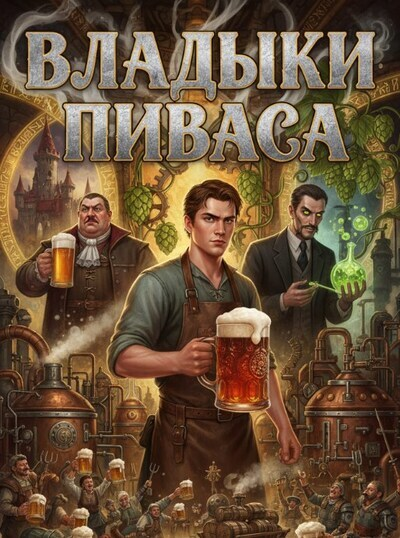

# Владыки Пиваса

## Аннотация

Студент-технолог попал в мир, где аристократия гордится отвратительным пивом. Его первая цель — не выжить или вернуться домой, а просто сварить себе нормальный стаут. Так начинается дерзкий стартап в декорациях фэнтези: крафтовая революция одного человека против вековых традиций, рыночных монополий и целого Ордена блюстителей «чистого вкуса». Изготавливая в средневековых условиях то, чего этот мир никогда не видел, он быстро наживает могущественных врагов.
Но настоящая угроза приходит не от фанатиков старины. Его гением заинтересовался безжалостный технократический Синдикат, который намерен использовать пивоварение для создания оружия абсолютного контроля. Когда твои знания о дрожжах становятся чертежами для эликсира, порабощающего волю, война за долю рынка превращается в отчаянную битву за будущее. Ведь самое страшное оружие — то, которое тебе предложат в красивом бокале.

## Обложка

