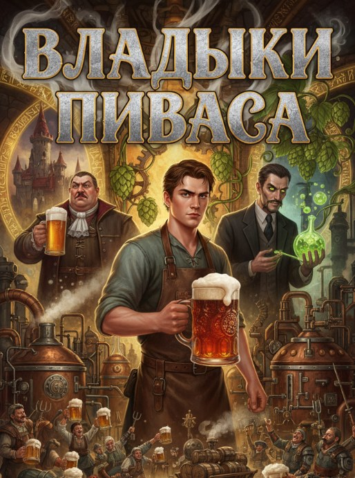

# Владыки Пиваса

## Аннотация

Студент-технолог попал в мир, где аристократия гордится отвратительным пивом. Его первая цель — не выжить или вернуться домой, а просто сварить себе нормальный стаут. Так начинается дерзкий стартап в декорациях фэнтези: крафтовая революция одного человека против вековых традиций, рыночных монополий и целого Ордена блюстителей «чистого вкуса». Изготавливая в средневековых условиях то, чего этот мир никогда не видел, он быстро наживает могущественных врагов.
Но настоящая угроза приходит не от фанатиков старины. Его гением заинтересовался безжалостный технократический Синдикат, который намерен использовать пивоварение для создания оружия абсолютного контроля. Когда твои знания о дрожжах становятся чертежами для эликсира, порабощающего волю, война за долю рынка превращается в отчаянную битву за будущее. Ведь самое страшное оружие — то, которое тебе предложат в красивом бокале.

## Обложка

### Часть 1. Восстание Тёмного

Часть 1. Восстание Тёмного

Месяц. Грёбаный месяц он гнил в этом чужом, пахнущем сырым камнем и безнадёгой мире. Первоначальный шок, похожий на удар под дых после падения с велосипеда, схлынул, оставив после себя вязкую, серую апатию. Василий Пупков, бывший студент-технолог, а ныне Всеволод Тринадцатый из рода Жигулёвых, обнаружил, что паника — ресурс конечный. Когда она иссякает, остаётся только тупое, беспросветное смирение с реальностью. А реальность была кислой. Буквально.

Огромный, пустынный зал, который здесь с издевкой называли трапезной, тонул в полумраке. Высокие сводчатые потолки терялись во тьме, куда не дотягивался одинокий свет сальной свечи на столе. Из щелей в заколоченных ставнями окнах тянуло промозглым осенним холодком, заставляя невольно ёжиться и втягивать голову в плечи. Воздух пах пылью, мышами, слежавшейся сыростью и едва заметной ноткой гнили, въевшейся в сами стены этого проклятого поместья. Вася потерял всякую мотивацию, кроме самых базовых — дышать, есть, спать. Даже попытки разобраться, как он здесь оказался, утонули в безразличии. Какая, к чёрту, разница, если итог один? Он здесь, а его мира больше нет.

Скрипнула тяжёлая дубовая дверь. В зал вошла Матрёна, единственное живое существо в этом доме, не считая его самого и вечно сонного хомяка. Женщина неопределённого возраста, с морщинистым, усохшим лицом цвета печёного яблока и с тяжёлым взглядом усталых, выцветших глаз, в которых он был лишь очередным недоразумением в длинной череде таких же. Она молча поставила на стол тяжёлую глиняную кружку и скрестила руки на груди, ожидая. Это был их ежедневный ритуал. Холодная война, где она видела в нём ленивого, бесполезного барчука, а он в ней — неотъемлемую часть этого убогого мира.

Он поднял кружку. Холодная и чуть липкая. Внутри плескалась мутноватая янтарная жидкость со слабой, рыхлой пеной, которая тут же осела. Родовое пиво Жигулёвых. Символ их былой славы, как любила ворчать Матрёна. Вася поднёс кружку к лицу. Запах. Слабый, но отчётливый дух прелого, отсыревшего зерна и чего-то похожего на запах тряпки, которой неделю мыли полы и забыли просушить. Он зажмурился.

Он сделал глоток на чистом автомате — рефлекс, вбитый в него тридцатью днями мучений. Жидкость коснулась языка, и его тело взбунтовалось раньше, чем мозг успел отдать приказ. Водянистое, практически безвкусное тело напитка тут же сменилось резкой, уксусной кислотой, которая ударила по рецепторам. Не благородная кислинка бельгийского ламбика, а плоская, грязная кислота браги, которая вот-вот скиснет окончательно. Послевкусие было ещё хуже — привкус мокрого картона и какой-то металлической горечи, будто он лизнул ржавый гвоздь. Это был вкус полного, безоговорочного провала. Вкус вырождения.

Тело, помнившее горечь настоящего хмеля, сладость имперского стаута и цитрусовый взрыв хорошего IPA, отреагировало инстинктивно. Внутренности свело резким, кислым спазмом, и он едва не согнулся пополам. Дыхание перехватило, к горлу подступила желчь. Он не мог это проглотить. Не в этот раз.

Он резко наклонился вперёд и сплюнул янтарную жижу прямо на серые каменные плиты пола. Не издевательски, не демонстративно, а с рефлекторной брезгливостью человека, откусившего от гнилого яблока. В пустынном зале влажный, шлёпающий звук прозвучал непристойно громко. На камне, впитываясь в вековую грязь между плитами, растекалась мутная лужица. Во рту остался омерзительный кислый привкус, язык свело.

«Нет. Хватит. Просто хватит. Это не пиво. Это какая-то алхимическая пародия, насмешка. Это пойло для скота, а не для человека. Я больше не могу. Ни одного грёбаного глотка».

Тонкая плёнка апатии, державшая его месяц, лопнула. По телу прошла резкая, колючая дрожь, смывая оцепенение. Мышцы на шее и плечах окаменели. Пальцы сами собой сжались в кулаки, впиваясь ногтями в ладони. Дыхание стало частым и поверхностным. Перед глазами на долю секунды вспыхнул образ: запотевший бокал с пинтой «Атомной Прачечной» в его любимом баре. Плотная белая пена, аромат тропических фруктов и хвои, пробивающийся сквозь холодное стекло. И этот образ, этот призрак из потерянного мира, стал детонатором.

— Ох, господи… — Матрёна цокнула языком так громко, что эхо отразилось от потолка. — Барчук, ну что ж ты делаешь-то, а? Напиток родовой… дед твой его ещё… святыню на пол лить!

Всеволод медленно выпрямился, вытирая рот тыльной стороной ладони. Он посмотрел на неё, и впервые за месяц в его взгляде не было безразличия. Была ярость.

— Дед мой, значит, пил эту… кислятину? — голос прозвучал хрипло, незнакомо. Он перебил её, не дав закончить причитания. — Не верю. Или у него вкуса не было совсем. Потому что это, — он ткнул пальцем в сторону лужицы, — даже не пиво! Это оскорбление самой идеи пива!

Матрёна поджала губы, её лицо превратилось в суровую маску. Она видела гнев, но не понимала его природы. Для неё это была просто блажь очередного сумасбродного аристократа.

— И что теперь, по-вашему, пить прикажете? Воду из колодца? — в её голосе прозвучал яд. — Другого-то нет. И не будет. Род Жигулёвых своё отжил, боярин. Давно. Осталось только это пойло да стены эти старые.

«Другого нет». Эта фраза ударила его, как пощёчина. Месяц он принимал это как данность. Как приговор. Но сейчас, на пике холодного, деятельного гнева, она прозвучала иначе. Как вызов.

Он посмотрел на свои руки. Руки двадцатиоднолетнего аристократа, тонкие, без мозолей. Но в голове были другие руки — руки Васи Пупкова, которые знали, как рассчитать плотность сусла, как отличить хмель «Цитра» от «Мозаика» по запаху, как выставить температурные паузы при затирании солода.

«Другого нет?» — пронеслось в его голове. — «Значит, будет».

Впервые за этот бесконечный месяц у него появилась цель. Не изменить мир, не вернуть себе трон, не стать великим магом. Цель была куда проще и эгоистичнее.

Просто сварить себе нормального, мать его, пива.

Через полчаса он ворвался в родовую библиотеку. Если трапезная была усыпальницей, то библиотека была её склепом. Воздух здесь был густым и тяжёлым, как застоявшаяся вода. Пахло так, будто здесь умерли миллионы книг, и их бумажные души до сих пор витали среди стеллажей. Пыль лежала повсюду толстым, бархатным слоем, который не тревожили, казалось, десятилетиями. Пламя принесённой им свечи выхватывало из мрака корешки книг, покрытые плесенью, стопки свитков, перевязанных истлевшими бечёвками, и паутину, густую, как рыбацкая сеть.

Но Васю не интересовали ни древние пророчества, ни хроники великих битв. Он мыслил как технолог, а не как историк. Ему нужна была не магия. Ему нужна была инструкция.

«Должно же что-то остаться, — думал он, пробираясь между стеллажами и оставляя в пыли отчётливые следы. — Не могли же они всё пропить. Хозяйственные книги, записи о варках, закупках сырья. Что-то, что объяснит, как они докатились до такой жизни».

Он начал методично, полка за полкой, перебирать фолианты. Это была грязная, нудная, изматывающая работа. Пыль набивалась в нос и в горло, заставляя его постоянно чихать и кашлять. Ветхие страницы рассыпались в руках, превращаясь в труху. Большинство книг оказались пафосной, бесполезной чушью. «Сто способов сервировки Светлейшего Лагера для Императорского приёма». «Геральдика Пивных Родов: Полное собрание гербов и девизов». «Философия пены: Трактат о бренности бытия и идеальной шапке». Он с отвращением швырял их на пол. Это была литература потребителей, а не производителей.

Прошло несколько часов. Свеча оплыла почти наполовину. Вася уже начал отчаиваться, когда его рука наткнулась на что-то в самом дальнем, самом тёмном углу нижней полки, заваленной кипой старых счетов за воду. Не громоздкий фолиант в тиснёной коже, а небольшой, плотный том, переплетённый в простую, грубую телячью кожу без единой надписи. Он был тяжелее, чем выглядел.

Он вытащил книгу, сдул с неё слой пыли, от которого тут же расчихался, и положил на единственный относительно чистый угол стола. Открыл. Страницы были не из пергамента, а из плотной, чуть желтоватой бумаги, и пахли не плесенью, а странной смесью старого чернила и чего-то пряного, почти лекарственного. На ощупь они были гладкими, почти вощёными. Вместо изящной каллиграфии он увидел аккуратные, почти чертёжные буквы, таблицы, схемы и формулы.

«Что за?.. Это не похоже на остальные книги. Это… это же техническая документация! Цифры, расчёты… Но что это за символы? Зашифровано? Зачем шифровать рецепт пива?»

Он забыл об усталости. В груди вместо тяжести зародился жар, кровь быстрее побежала по жилам. Он наклонился над книгой, чувствуя, как разгорается азарт. Это было оно. То самое чувство, когда после часов дебаггинга ты наконец находишь строчку с ошибкой. Он вспомнил, как на третьем курсе писал курсовую по криогенному охмелению. Старый профессор, тот самый, что потом его разгромил, дал ему доступ к архиву кафедры. И там, среди советских учебников, он нашёл похожую тетрадь — рукописные записи какого-то старого технолога, где тот использовал свой собственный код, чтобы скрыть от коллег свои наработки по штаммам дрожжей. Простой шифр замены, который легко ломался частотным анализом.

Он всмотрелся в текст. На титульном листе, выведенная твёрдой рукой, была всего одна фраза: «О сути Хмельной Тьмы».

Вася усмехнулся. Местные, со своим примитивным мышлением, наверняка приняли бы это за книгу по чёрной магии. Тьма, запретные знания, все дела.

Это был не гримуар. Учебник.

Спрятанный, засекреченный, но учебник. Он не знал, кто его написал и почему спрятал. Но он знал главное: это его шанс. Шанс не просто сварить нормальное пиво, а создать нечто, чего этот мир ещё не видел. Идея, зародившаяся от простого отвращения, начала обретать масштаб.

Пивоварня встретила его запахом сырого камня, застарелой кислой вони и тотальной безнадёжности. Огромные медные чаны, гордость предков, стояли вдоль стен, покрытые зеленоватой патиной и слоем грязи. Оборудование проржавело. Казалось, здесь не варили ничего приличного со времён царя Гороха.

Вася, вооружённый расшифрованным трактатом и неуёмным энтузиазмом, столкнулся с первой серьёзной проблемой. Рецепт, который он дешифровал, требовал главного — основы любого тёмного пива. Жжёный солод. А его здесь попросту не существовало. Местная философия пивоварения, зацикленная на «чистоте» и «светлости», считала любой солод темнее соломенного испорченным.

«Нет жжёного солода — сделаем», — решил Вася. Он понял, что готового сырья не найти, и придётся начинать с нуля. Он нашёл в закромах мешок отборного сырого ячменя, несколько дней замачивал его, ждал появления крошечных белых ростков, превращая зерно в так называемый «зелёный солод». А затем столкнулся с главной проблемой: как высушить и обжарить его без специальной печи? План был прост и гениален в своей тупости. Он развёл огонь в старом очаге, на котором когда-то кипятили воду, нашёл в кладовке огромную чугунную сковороду, больше похожую на щит, и высыпал на неё влажный солод. Нужно было постоянно помешивать, доводя его до тёмно-коричневого, почти чёрного цвета. В теории.

На практике он недооценил три вещи: ярость открытого огня, теплопроводность чугуна и собственную неопытность в таких кустарных методах. Он отвлёкся буквально на минуту, чтобы свериться с записями, как по пивоварне пополз едкий, горький дым.

— Чёрт! — он бросился к очагу.

Было поздно. Солод на сковороде не просто подгорел. Он обуглился и вспыхнул, превратившись в маленький огненный вулкан. Пламя лизнуло старый деревянный стеллаж рядом с очагом, и сухие, пропитанные пылью доски тут же занялись.

— Да твою ж мать! — закашлялся Вася, пытаясь сбить огонь грязной мешковиной. Дым ел глаза, дышать было нечем. Пивоварня стремительно наполнялась удушливым чадом. Он запаниковал. План «сварить пивка» плавно перетекал в план «не сгореть к чертям в этой дыре».

В этот момент дверь с грохотом распахнулась. На пороге стояла Матрёна в ночной рубахе и с кочергой в руке, разбуженная шумом и запахом гари. Её глаза расширились, но ни крика, ни паники в них не было. Она оценила обстановку за секунду.

— Ох, господи… — выдохнула она своё коронное, но на этот раз в нём не было укора, только констатация факта. — Спалишь нас всех, барчук!

Она бросила кочергу, развернулась и исчезла. Вася подумал, что она сбежала, и не винил её. Но через десять секунд она вернулась, таща за собой огромное деревянное ведро с грязной водой, которой, видимо, мыла полы. Без лишних слов она с размаху выплеснула его содержимое на горящий стеллаж.

Раздалось оглушительное шипение. Клубы пара смешались с дымом, на мгновение скрыв всё. Когда пар рассеялся, огонь был потушен. Остались только обугленные доски, лужа грязной воды на полу и удушающая вонь, от которой слезились глаза.

Вася стоял посреди этого хаоса, кашляя и отплёвываясь, с почерневшим от сажи лицом, и чувствовал себя полным идиотом. Гений-попаданец, революционер-пивовар, спаливший собственную пивоварню при первой же попытке.

Матрёна упёрла руки в бока, оглядела разрушения и медленно покачала головой.

— Алхимик… — пробормотала она с такой интонацией, будто это было самое страшное ругательство в мире.

И тут, в этой трагикомичной сцене, появился третий персонаж. Привлечённый запахом, из-за мешка с ячменём высунул любопытный нос фамильяр рода Жигулёвых — хомяк по имени Закус. Крошечное существо с серьёзной алкогольной зависимостью. Он подбежал к луже на полу, где смешались вода и остатки первой, скисшей до состояния едкого уксуса браги, которую Вася с отвращением выплеснул в угол несколько дней назад. Хомяк с энтузиазмом ткнулся в лужу носом, сделал пару жадных глотков.

Его реакция была мгновенной.

Закус замер. Его маленькое тельце мелко затряслось. Он издал писк, полный вселенской скорби, потом его лапки подогнулись, и он картинно, как актёр в немом кино, завалился на бок, высунув язык. Обморок был настолько театральным, что не оставлял сомнений в вердикте.

Первая попытка была не просто провалом. Она была отравой даже для хомяка-алкоголика.

До Великого Турнира Пенного оставалось чуть больше месяца. Этот месяц превратился в ад из проб, ошибок и ворчания Матрёны. Но к последнему дню, после десятка неудачных варок, у него всё же получилось.

День Великого Турнира Пенного. Центральная площадь столицы ревела сотней голосов, смешивая выкрики торговцев, бряцание кружек и фырканье лошадей в единый праздничный гвалт. Воздух был пропитан запахами жареного мяса, выпечки и, конечно же, пива. Десятки сортов, но все на одно лицо — золотистые, прозрачные, сверкающие на солнце. Праздник «Чистоты и Порядка».

Всеволод чувствовал себя чёрной овцой. Его единственный, выстраданный за бессонные ночи бочонок выглядел чужеродным на фоне блестящих, окованных медью бочек великих родов. Когда подошла его очередь, он с трудом выкатил свою неказистую бочку в центр арены. По рядам аристократии, рассевшихся на трибунах, прошёл недоумённый шепоток.

Он воткнул кран, подставил простую глиняную кружку и наполнил её.

И в этот момент шёпот сменился потрясённым гулом.

Напиток, который полился из бочонка, был не золотым. Он был чёрным. Чёрным, как безлунная ночь, как смола, как сама «Хмельная Тьма» из трактата. И когда он закончил наливать, над чернотой поднялась плотная, кремовая, кофейного цвета пена, которая не оседала. Он знал, что напитку отчаянно не хватает ещё пары недель созревания: вкус был слишком резким, несбалансированным. Но выбора не было.

Напротив него, за столом судей, сидел главный блюститель традиций — Барон Курт фон Пилснер, Магистр Ордена Адептов Нефильтрованного. Мужчина средних лет, с идеально ровной спиной и ухоженной бородой. Его взгляд скользнул по Всеволоду и его бочонку, не задерживаясь, словно наткнулся на грязь под ногами. Увидев цвет напитка, он даже не притронулся к поданной ему кружке. Его лицо окаменело. Он брезгливо отодвинул кружку кончиками пальцев, будто это была дохлая крыса.

— Что… это? — его голос, усиленный лёгкой магией, прогремел над площадью, заставив толпу замолчать. Он не спрашивал. Он обвинял.

Всеволод молчал. Что он мог сказать? «Это имперский стаут, господа, с нотками шоколада и жжёного кофе»? Они бы сочли его сумасшедшим.

Барон поднялся.

— Мы собрались здесь, дабы воспеть чистоту и свет! Дабы насладиться золотом ячменных полей, воплощённым в кристально чистом напитке наших предков! — он говорил медленно, чеканя каждое слово. — А что мы видим? Мы видим мутную ересь! Отвар гоблинов! Жижу, сваренную в подвале из грязи и отчаяния! Это не пиво! Это оскорбление самой Чистоты! Это плевок в лицо нашим традициям!

Его речь была пафосной, и старые бароны одобрительно кивали. Но пафос, не подкреплённый ничем, кроме традиции, превратился в нудную проповедь. В толпе перешёптывались, кто-то из молодых наследников на трибуне демонстративно зевнул.

И тогда случилось то, чего не ожидал никто. Один из младших судей, молодой и дерзкий барон по имени Рихард из почти разорившегося рода Коршунов, которому было абсолютно нечего терять, с кривой усмешкой поднял свою кружку с чёрным напитком.

— Что ж, — громко сказал он, перебивая Пилснера. — Если это яд, то я хочу умереть с полным желудком.

Он сделал большой, смачный глоток.

На площади повисла тишина. Все смотрели на него.

Глаза Рихарда расширились. Он замер, прислушиваясь к своим ощущениям. Потом недоверчиво посмотрел на кружку. И сделал ещё один глоток, уже медленнее, вдумчивее. Он не мог понять, что он пьёт. В этом мире не было ни шоколада, ни кофе. Он не мог подобрать слов, чтобы описать этот плотный, бархатистый, горько-сладкий вкус. Но его лицо выражало неподдельный, искренний восторг.

Он медленно поставил кружку на стол.

— Барон, — обратился он к опешившему Пилснеру. — Ваше пиво, без сомнения, чистое. Как дистиллированная вода. И такое же безвкусное. А вот это… — он кивнул на чёрную жидкость, — это, клянусь бородой моего деда, самый интересный напиток, что я пробовал за последние десять лет.

Турнир Всеволод не выиграл. Победил, разумеется, фон Пилснер со своим каноничным лагером. Но это было неважно. Прецедент был создан. Раскол произошёл. Но в лице фон Пилснера не было обычной ярости проигравшего. Черты его застыли, а в глазах вместо огня появился лёд. Барон смотрел на него так, словно Вася не просто нарушил правила, а осквернил его личную святыню.

Вечер. Та же пустынная трапезная. Но атмосфера изменилась. Напряжение, висевшее в воздухе весь день, спало, оставив после себя странную, звенящую пустоту. Всеволод и Матрёна сидели за столом друг напротив друга. Свеча отбрасывала на их лица дрожащие тени. Они молчали. Неловкость была почти осязаемой. Оба понимали, что сегодня что-то безвозвратно изменилось, но не знали, как об этом говорить. Он проиграл, но не был разбит. Она видела его унижение, но впервые за месяц в её взгляде не было злорадства.

Внезапно тишину разорвал громкий, требовательный стук в ворота.

Они переглянулись. Гостей в этом доме не было уже много лет. Матрёна, подхватив свечу, пошла открывать. Вася остался сидеть, сердце колотилось где-то в горле. Он ожидал чего угодно: стражников от Пилснера, обвинений в ереси, приказа о высылке.

Матрёна вернулась не одна. За ней шёл молодой парень в ливрее с гербом — коршуном, сжимающим в когтях пивную кружку. Род Коршуновых. Гонец от барона Рихарда.

Парень поклонился и протянул Всеволоду небольшой, но увесистый мешочек из кожи.

— Мой господин, барон Рихард, шлёт своё почтение и восхищение, — отрапортовал гонец. — Он говорит, что устал пить воду, которую остальные именуют пивом. Он просит приготовить для его гильдии фехтовальщиков две бочки… — парень на мгновение запнулся, подбирая слова, — …этой вашей восхитительной тьмы. В мешочке аванс.

Когда гонец ушёл, Матрёна взяла мешочек, подошла к столу и высыпала его содержимое. На потёртое дерево со звоном посыпались серебряные и несколько золотых монет. Не целое состояние, но для них — несметное богатство. Это были первые настоящие деньги, которые род Жигулёвых заработал за долгие, долгие годы.

Она молча, сосредоточенно пересчитала монеты. Сложила их в аккуратные столбики. Потом подняла взгляд на Всеволода. В её глазах больше не было укора. Не было и подобострастия. Было что-то новое. Удивление, смешанное с крупицей… уважения?

Она сгребла монеты обратно в мешок, затянула тесёмку и протянула его ему.

— Надо будет ячменя закупить, — сказала она тихо, и это были самые важные слова, что он слышал от неё. — Побольше.

Всеволод взял мешок. Он чувствовал вес монет в своей ладони. Он смотрел на них, потом перевёл взгляд в окно, в сторону далёких огней замка фон Пилснера. Победа? Нет. Это было только начало. Начало чего-то большого, сложного и, скорее всего, очень опасного.

«Короче, — подумал он, и впервые за долгое время в его мыслях не было отчаяния, а была лишь холодная, азартная злость. — Стартап взлетел. Есть первый клиент. И первый враг, который хочет сжечь мой офис вместе со мной. Норм. Погнали».

### Часть 2. Возвращение Светлого

Часть 2. Возвращение Светлого

Две недели лихорадочной, грязной работы, слившихся в один сплошной гул, пахнущий жжёным солодом, древесной пылью и потом. Аванс от барона Коршунова, такой тяжёлый и обжигающий в первую ночь, испарился почти мгновенно, обратившись в скрип телег, привезших мешки с ячменём, в брань нанятых мужиков, что заделывали прожжённую дыру в крыше пивоварни, и в звон молотков, латающих обугленные стропила.

Всеволод, ещё недавно Вася Пупков, студент и прокрастинатор эпических масштабов, не помнил, когда в последний раз спал больше четырёх часов подряд. Апатия, та вязкая, серая трясина, что засасывала его раньше, выгорела дотла, оставив после себя выжженную землю, на которой теперь росла только одержимость.

Он больше не был гостем в чужом теле. Он стал менеджером проекта на грани дедлайна, владельцем стартапа, который внезапно «выстрелил», и теперь пытался на ходу собрать самолёт, уже вывалившись из него. Он сам таскал мешки, ругался с плотниками, до хрипоты спорил с Матрёной из-за каждой потраченной монеты и по ночам, при свете сальной свечи, снова и снова вчитывался в строки трактата, пытаясь выжать из древнего текста ещё хоть каплю эффективности. Азартная злость первых дней сменилась измотанной, деловой сосредоточенностью; он вздрагивал от каждого скрипа двери и почти не выпускал из рук кружку с остывшим травяным отваром. Две бочки «Восстания Тёмного» уехали к Коршунову, и теперь нужно было действовать, пока рынок не забыл скандальный вкус его пива. Нужно было сырьё. Много сырья.

Торговые ряды столицы встретили его плотным, слоёным запахом. Снизу, от мостовой, тянуло конским навозом и прелой соломой. С лотков несло ароматом копчёной рыбы, пряной корицы и острым духом дешёвого эля, которым с утра уже заправлялись портовые грузчики. Над всем этим висела едва уловимая кислая нотка немытых тел. Воздух был густым, живым, наполненным криками зазывал, скрипом несмазанных колёс, женским смехом и деловитым перезвоном монет. Сотни людей текли по узким проходам, задевая друг друга локтями и корзинами.

Всеволод, сжимая в кармане мешочек с остатками аванса, чувствовал себя на удивление уверенно. Он был не просто боярином на прогулке. Он был клиентом. Покупателем. А клиент, как известно, всегда прав.

Его целью была лавка Стефана Ячменное Зерно, самого крупного торговца солодом в городе. Толстый, потный мужик с лицом, похожим на недопечённый пирог, всегда расплывался в заискивающей улыбке при виде дворянского герба. Всеволод помнил его ещё по тем временам, когда закупал сырьё для своих первых, неудачных экспериментов.

— Десять мешков отборного ячменя, Стефан, — бросил он с порога, стараясь, чтобы голос звучал весомо и небрежно. — И три мешка хмеля. Лучшего, что у тебя есть.

Торговец, протиравший прилавок грязной тряпкой, замер. Он медленно поднял глаза, и привычная алчность в них сменилась странной, почти панической растерянностью.

— Господин барон… — начал Стефан, и его голос был на тон выше обычного. — Какая радость… Какая честь…

— Ближе к делу, Стефан. У меня нет времени на твои расшаркивания.

— Да-да, конечно, господин барон… Только вот… с ячменём незадача вышла, — пролепетал торговец, обильно потея. — Весь, понимаете, до последнего зёрнышка… уже законтрактован. Урожай в этом году не ахти, сами знаете…

Всеволод нахмурился.

— Как законтрактован? У тебя половина лавки завалена мешками.

— Так то чужое, милорд! На хранении! — заюлил Стефан, избегая смотреть ему в глаза. — Дом фон Пилснеров всё выкупил. Оптом. На корню, можно сказать. Для нужд Ордена…

В животе возникло то самое паршивое ощущение, как перед сдачей курсача, к которому ты не готовился. Списать это на простую неудачу было соблазнительно, но слишком уж не вязалось с поведением торговца.

— Хорошо, — процедил Всеволод. — А хмель?

— И хмель туда же, господин барон… Все лучшие шишки — им. Для чистоты напитка, так сказать…

Он вышел из лавки, чувствуя, как уверенность начинает крошиться. Ладно, один монополист. Бывает. В городе ещё с десяток торговцев помельче. Он решительно направился к следующему, тощему старику по имени Ганс, чья лавка ютилась в вонючем переулке. История повторилась с пугающей точностью. Ганс мялся, кашлял в кулак, жаловался на неурожай, на засуху, на нашествие долгоносиков и, в конце концов, тоже сослался на крупный контракт с Орденом Адептов Нефильтрованного. Третий торговец просто сделал вид, что не видит его, и спешно начал обслуживать какого-то простолюдина. Четвёртый, гном с перебитым носом, выслушал и коротко рявкнул: «Нету».

К полудню Всеволод обошёл их всех. Результат был нулевым. Он стоял посреди шумной, гудящей площади, но крики зазывал и звон монет превратились в бессмысленный белый шум, как из сломанного радиоприёмника. Он крепче стиснул в кармане мешочек с монетами. Серебро и золото, ещё вчера сулившие любые возможности, теперь были просто бесполезным металлом.

Один из торговцев, самый молодой, догнал его у выхода с площади. Он выглядел напуганным, но, видимо, совесть мучила его сильнее страха.

— Милорд, — прошептал он, оглядываясь по сторонам. — Вы уж не держите на нас зла…

— В чём дело? — устало спросил Всеволод. — У вас что, сговор?

— Хуже, милорд, — парень понизил голос ещё больше. — Нам… настоятельно порекомендовали. От Ордена. Не иметь дел с… ну, вы понимаете. С теми, кто варит… чёрное.

Он не договорил, поклонился и юркнул обратно в толпу. Всеволод остался один. Шум рынка никуда не делся, но он перестал его слышать. Детали происходящего — смех торговки, скрип телеги, блеск монеты — вдруг сложились в ясный и уродливый умысел. Это была не случайность. Это была стена. Аккуратно, методично и безжалостно выстроенная. Его враг не стал вызывать его на дуэль или подсылать убийц. Он просто нажал на нужные рычаги. Он действовал не мечом, а рынком.

— Вот тебе и свободная конкуренция, — пробормотал он в пустоту. — Они не просто перекрыли мне кран. Они, блин, взорвали весь водопровод до самого источника.

Он перестал суетливо оглядываться. Плечи расправились. Он медленно выдохнул, и взгляд, до этого растерянно бегавший по толпе, сфокусировался, стал жёстким. Он проиграл бой, даже не поняв, что война уже началась.

Крик Матрёны был похож на визг пилы, вгрызающейся в сучковатое полено. Он ворвался в тяжёлый, неглубокий сон Всеволода, выдернув его из липкой дрёмы. Была глубокая ночь. За окном выла ноябрьская вьюга. Первой мыслью было — опять пожар. Он рывком сел на кровати, пытаясь нащупать в темноте штаны. Но запаха дыма не было. Вместо него по коридору тянуло чем-то другим. Резким, кислым, тошнотворным. Запахом уксуса. Запахом прокисшего пива.

Он вылетел в коридор, даже не накинув рубаху. Матрёна стояла на пороге пивоварни, прижимая руки ко рту. Её лицо в дрожащем свете фонаря было белым, как полотно.

— Там… Барчук, там… — она не могла договорить, просто махнула рукой в сторону темноты.

Он шагнул внутрь и замер. Зрелище, открывшееся ему, было хуже любого пожара. Бурления не было. Три больших бродильных чана, его гордость, стояли мёртвыми, тихими, но едкая, уксусная вонь ударила в нос с такой силой, что заслезились глаза. Поверхность пива покрывала тонкая, сероватая плёнка, как на застоявшейся воде. Это был не стаут. Это была гигантская кастрюля с прокисшими щами. Весь его продукт. Вся партия, которую он с таким трудом сварил из купленного втридорога у контрабандистов ячменя. Всё, что должно было стать товаром и принести хоть какие-то деньги, превратилось в зловонную жижу.

Он подошёл к ближайшему чану, игнорируя протестующий вопль Матрёны. Зачерпнул пригоршню. Жидкость была тёплой, склизкой и отвратительно пахла. На языке остался едкий, уксусный привкус.

— Всё, — прошептал он. — Всё до последней капли.

Он не закричал. Не выругался. Просто стоял и смотрел, а в ушах застучала собственная кровь, вытеснив все остальные звуки. Всё вокруг исчезло, остались только три мёртвых чана и запах гнили. Это был конец. Блокада, а теперь диверсия. Его просто стирали с доски, как глупую, неуместную помарку.

Матрёна за его спиной что-то причитала про порчу, про сглаз, про то, что не надо было связываться с чёрной магией. Он её не слушал. Его взгляд скользил по дну одного из чанов, который они уже успели опорожнить. Что-то тускло блеснуло в остатках жижи. Он опустил руку в склизкую массу и нащупал небольшой, тяжёлый предмет. Это был кругляш из свинца, грубый и неказистый. На одной его стороне была коряво выцарапана руна, которую он не знал. А на другой — до боли знакомый символ. Золотая пивная кружка, герб Ордена Адептов Нефильтрованного.

Он поднял амулет на уровень глаз. Вот оно. Не просто диверсия. Это было послание. Клеймо. Демонстрация силы и безнаказанности. Они не просто уничтожили его пиво. Они пришли в его дом, в его святая святых, и нассали ему в душу, оставив на память свою визитную карточку.

Пустоту внутри затопила медленная, горячая ярость. Он молча сжал свинцовый амулет в кулаке. Сжимал, пока острые края руны не впились в ладонь, превращая металл в смятый комок. Азартная злость, с которой он начинал, испарилась. Осталась только тихая, острая, как осколок стекла, ненависть. Это больше не было бизнесом. Он превратил эту войну в личную. Враг хотел не просто разорить его. Он хотел его унизить. Сломать. И он только что совершил фатальную ошибку — он дал этой ненависти лицо и имя.

На следующий день столица загудела, как растревоженный улей. Всё началось с центральной площади, где обычно зачитывали королевские указы. Вместо привычных герольдов в ливреях, там появились трое оборванцев, нанятых Всеволодом за пару медяков и обещание выпивки. Он долго и мучительно пытался втолковать им основы вирусного маркетинга, но быстро понял, что это безнадёжно.

— Короче, мужики, — свёл он инструктаж к предельно простой формуле, сидя с ними в дешёвой таверне. — Задача простая. Вы не глашатаи. Вы — сплетники. Ходите по самым людным местам и как бы по секрету, но чтобы все слышали, рассказываете одну историю. Поняли?

Троица, уже успевшая опрокинуть по кружке, согласно закивала.

— Историю про стаут Жигулёва. Что это не просто пиво, а… эм… афродизиак! — Всеволод понизил голос до заговорщицкого шёпота. — Для мужской силы, понимаете? Ядрёная штука. Такая, что после одной кружки… ну, вы поняли. Хайп надо создать!

— Хайп, милорд? — переспросил самый старый из них, беззубый дед с красным носом. — Это какой-то демон? Я слыхал, демоны в этом деле помогают…

— Тьфу ты! Не демон! — в отчаянии воскликнул Всеволод. — Ажиотаж! Шум! Чтобы все только о нём и говорили! И главное — ни слова о том, что это я вас нанял. Это должен быть слух. Типа, секретная инфа от бабкиной троюродной сестры, которая работает прачкой у барона Коршунова. Чем абсурднее, тем лучше!

Он сунул им деньги и выпроводил за дверь, чувствуя себя полным идиотом. Это был иррациональный поступок, жест отчаяния. Он не мог ответить Пилснеру магией, не мог пробить экономическую блокаду. Единственное, что у него оставалось — это информация. И он решил превратить её в оружие.

Результат превзошёл все его самые смелые и самые идиотские ожидания. Концепция «испорченного телефона» сработала безупречно. Нанятые им оборванцы, не поняв и половины слов, но уловив суть, начали нести по городу такую дичь, что у Всеволода, когда до него дошли первые отголоски, на секунду перехватило дыхание от смеси ужаса и восторга.

«Слыхали! — орал один на рыбном рынке, размахивая вяленой плотвой. — Чёрное пиво от Жигулёва! Не простое, а колдовское! Его на драконьей крови варят! Кто выпьет — у того… кхм… хмель в штанах заколосится! Да так, что коса нужна будет!»

«А я слышал, — подхватывал другой у казарм городской стражи, — что сам демон по имени Хайп рецепт нашептал! И теперь любая девка, понюхав того пива, сама на тебя вешается! Инфа стопроцентная, мне гном-контрабандист рассказал!»

«Говорят, от него дети рождаются сразу с усами и пивной кружкой в руке!» — неслось из третьей таверны.

Слух, подхваченный сотнями ртов, пополз по городу. Он обрастал новыми, всё более невероятными подробностями. Благородные дворяне и дамы из высшего света брезгливо морщились, услышав эти вульгарные сплетни. Барон фон Пилснер, до которого эта новость дошла в тот же день, пришёл в ярость от такой «грязной, плебейской тактики». Он хотел объявить стаут ересью, а его превратили в похабный анекдот.

Но среди тех, кто был попроще — купцов, ремесленников, солдат, студентов и прочей городской молодёжи — начался нездоровый, ажиотажный интерес. Тема «колдовского пива для мужской силы» стала главной в тавернах и на улицах. Кто-то смеялся, кто-то крутил пальцем у виска, но равнодушным не остался никто. Спрос, который Пилснер пытался задушить блокадой, начал расти вопреки всему. Люди приходили к воротам поместья Жигулёвых, пытаясь купить хоть бутылку «чудо-напитка». Всеволод, конечно, ничего им продать не мог — все запасы были уничтожены. Но он добился главного. Он ответил на удар. Асимметрично. Глупо. Но эффективно. Он проиграл битву за сырьё, но выиграл информационную войну, поставив на кон собственную репутацию и превратив своё пиво из «ереси» в скандальный, но жутко популярный бренд.

Время тянулось, как дешёвый эль. К концу декабря ажиотаж, поднятый слухами, выдохся, разбившись о простую истину: пива не было. Город укутался в холодный туман, и реальность снова показала свои серые, безденежные зубы. Всеволод сидел за столом в своём маленьком, продуваемом сквозняками кабинете. Перед ним лежала бухгалтерская книга, раскрытая на середине. Он ненавидел эту книгу. Она была бесстрастна и жестока, как палач.

В левой колонке, «Приход», сиротливо ютились несколько записей: остатки аванса от Коршунова. Всё. Правая колонка, «Расход», была похожа на длинный, уродливый шрам, расползшийся на всю страницу. Ремонт пивоварни. Оплата рабочим. Закупка ячменя и хмеля у контрабандистов по тройной цене. Потери от уничтоженной партии… Итог, подведённый внизу страницы кривым угольком, был однозначен. Минус. Глубокий, безнадёжный минус.

Он сидел, уставившись на эти цифры, и чувствовал, как от кончиков пальцев по телу расползается неприятный холодок, не имеющий ничего общего с декабрьской стужей. Азарт выгорел. Злость иссякла. Осталась только тупая, ноющая усталость. Он применил гениальный, как ему казалось, маркетинговый ход, но что толку в спросе, если ты не можешь обеспечить предложение? Креативность не могла победить простую экономику. Он умудрился проиграть, даже устроив врагу публичную порку. Пилснер, возможно, потерял лицо, но он, Всеволод, терял последние деньги.

Дверь тихо скрипнула. Вошла Матрёна. Она не стала, как обычно, ворчать про разбросанные бумаги или чад от свечи. Она вообще ничего не сказала. Просто подошла и молча поставила на стол деревянную миску с горячей, дымящейся похлёбкой и толстую краюху свежего хлеба. Запах чеснока и наваристого бульона ударил в нос, и Всеволод понял, что не ел со вчерашнего утра.

Он поднял на неё глаза. В её взгляде не было ни упрёка, ни злорадства, ни даже жалости. Только какая-то тяжёлая, молчаливая поддержка. Она видела эти цифры. Она видела его поражение. И она осталась. Этот простой жест — тарелка супа в нужный момент — значил больше, чем любые слова сочувствия.

Он медленно взял ложку.

— Я проиграл, Матрён, — сказал он тихо, и слова дались ему с трудом. Голос был чужим, севшим. — Проиграл.

Она поджала губы и села на стул напротив.

— Ешь, барчук. На голодный желудок глупости думаются.

— Это не глупости. Это факты, — он ткнул ложкой в сторону бухгалтерской книги. — На одном стауте, как на одной ноге, далеко не ускачешь. Он меня кормит, он же меня и топит. Я завишу от одного продукта, от одного рецепта. И Пилснер это понял. Он просто перекрыл мне доступ к специфическому сырью, и всё. Конец стартапа.

Он зачерпнул горячей похлёбки. Она обожгла язык, но принесла какое-то странное, отупляющее облегчение. Впервые с момента начала этой авантюры он почувствовал не азарт, не злость, а глухую, беспросветную безнадёжность. Он закрыл книгу. Щелчок обложки прозвучал в тишине кабинета как приговор.

Он сидел неподвижно, уставившись на закрытую книгу. Казалось, это была могильная плита, под которой он похоронил и себя, и своё будущее. Под тяжестью этих цифр его ярость рассыпалась в пыль, оставив внутри только холодный пепел. Он проиграл.

Матрёна, всё это время молча стоявшая в дверях, увидела, как его плечи обмякли, а взгляд стал пустым, остановившимся. Это было не мимолётное уныние барчука, а тихое принятие поражения. Не сказав ни слова, она развернулась и ушла в тёмный коридор. Всеволод даже не поднял головы.

Через минуту послышались её шаги — не старческое шарканье, а твёрдая, тяжёлая поступь. Она подошла к столу и с глухим стуком поставила на проклятую книгу небольшой, но увесистый деревянный ларец, тёмный от времени.

— Вот, — голос её прозвучал жёстко, без тени жалости. — Всё, что есть. На похороны себе копила.

Она открыла крышку. Внутри, на выцветшей ткани, тускло блеснула горсть серебряных и несколько старых золотых монет.

— Не для того я их всю жизнь горбатясь собирала, чтоб доживать свой век в этой гнили, глядя, как всё в прах рассыпается. Либо ты сейчас что-то придумаешь, либо прогорим оба. Ставлю на тебя, алхимик.

Сказав это, она развернулась и вышла, не дожидаясь ответа. Всеволод смотрел то на монеты, то на свои дрожащие руки. Холодный вес этого металла был тяжелее любого долга. Это был вес её морщинистых рук, её прожитой жизни, её последней, упрямой веры в него. Безнадёжность не ушла — её выжгло внезапной, ледяной ясностью. Теперь у него не было права проигрывать.

Январь выдался лютым. Снег завалил поместье по самые окна, отрезав его от остального мира. Время, казалось, застыло, превратившись в вязкую, холодную массу. Для Всеволода это было время отчаяния и лихорадочной работы мысли. Он почти не выходил из пивоварни, которая теперь была не производственным цехом, а лабораторией и камерой пыток одновременно. Он должен был что-то придумать. Найти выход. Или умереть под завалами своего прогоревшего бизнеса.

Он думал о враге. Снова и снова прокручивал в голове их противостояние. В чём сила Пилснера? В его светлом, золотистом пиве. В каноне. В традиции. В контроле над рынком лагеров. Он был королём этого рынка. Неприступным, самодовольным королём.

И в одну из долгих, бессонных ночей, когда за окном выла вьюга, в гудящей от усталости голове сама собой, как сорняк, проросла простая, безумная, еретическая мысль.

«Если не можешь победить короля на его поле, нужно ворваться в его замок и поджечь трон».

Он не будет больше бодаться с Пилснером на рынке тёмного пива. Это его ниша, но она слишком мала и уязвима. Он ударит в самое сердце его империи. Он сварит своё светлое пиво. Но не такое, как у них. Не бледную копию их лагера. А нечто совершенно противоположное. Анти-лагер. Ересь в квадрате.

На следующее утро он ворвался в пивоварню, где Матрёна пыталась навести порядок, а Закус спал в пустом мешке из-под солода. Всеволод был похож на безумного алхимика, открывшего формулу философского камня. Глаза горели, волосы стояли дыбом. Он схватил кусок угля и, не обращая внимания на ошеломлённое лицо служанки, начал рисовать прямо на оштукатуренной стене.

— Смотри! — крикнул он, выводя кривые круги и стрелки. — Вот! Это они! Барон и его Орден! — Он нарисовал бочку с надписью «Лагер». — Они варят низовым брожением. Это долго. Это требует холода. Их дрожжи оседают на дно. Вкус чистый, гладкий, скучный! Понимаешь?

Матрёна смотрела на него, как на душевнобольного. Закус проснулся от крика, высунул нос из мешка и чихнул от угольной пыли.

— А вот — это мы! — Всеволод нарисовал вторую бочку, гораздо больше первой, и закрасил её чёрными штрихами. — Мы сварим эль! Верховое брожение! Это быстро! Это требует тепла! Дрожжи поднимаются наверх! Вкус будет… другим! Более сложным!

— Барчук, да кто ж… — начала было Матрёна.

— Подожди! Это ещё не всё! — перебил он, его голос срывался от возбуждения. — Главное — вот! — Он нарисовал огромный, колючий цветок хмеля. — Они используют хмель для консервации и лёгкой горечи. Они его боятся! А мы… мы завалим наше пиво хмелем! Не столько для горечи, сколько для аромата! Чтобы било в нос не прелой травой, а чем-то резким, смолистым, как сосновый бор после дождя! Чтобы в нём была горечь полыни и пряный дух можжевельника! Это будет не просто пиво. Это будет удар по рецепторам! Нечто вроде Индийского Светлого Эля!

Он отступил от стены, любуясь своими каракулями. Матрёна молча смотрела то на него, то на стену. В её глазах читалась смесь ужаса и сострадания.

— Горькое пиво? — наконец выдавила она. — Барчук, ты с ума сошёл? Да кто ж такую отраву пить по своей воле будет?

Закус, видимо, привлечённый словом «пить», выбрался из мешка, подошёл к стене и попытался лизнуть угольный рисунок хмеля. Он тут же брезгливо фыркнул, затряс головой и, обиженно пискнув, спрятался обратно.

Непонимание окружающих только подстегнуло Всеволода. Он рассмеялся — впервые за много недель. Это был нервный, маниакальный смех человека, который поставил на кон последнее и нашёл в этом отчаянное веселье. Это был его единственный шанс. Его безумная, последняя ставка.

Середина февраля. Портовый район столицы. Воздух здесь был тяжёлым и солёным, пах рыбой, гниющими снастями и дешёвым табаком. Таверна «Морской Чёрт» была худшей из всех портовых забегаловок. Грязные, липкие столы, прокопчённый потолок, публика из просолённых насквозь моряков, грузчиков с бычьими шеями и городской голытьбы. Идеальное место.

Всеволод выбрал это поле боя намеренно. Он не пошёл в аристократические салоны, где его бы подняли на смех. Он пошёл туда, где люди ценили не «чистоту канона», а крепость и забористость. Он притащил сюда единственную бочку своего нового творения — эля «Возвращение Светлого» — и объявил бесплатную дегустацию.

Сначала всё шло по худшему сценарию. В таверну, привлечённые слухами о халяве, заглянули несколько мелких купчишек и пара скучающих дворянских сынков. Они с важным видом брали глиняные кружки, делали глоток… и их лица искажались от отвращения.

«Фу, какая горечь!»

«Да это же полынь чистая! Отрава!»

«Жигулёв совсем рехнулся. Сначала чёрное пойло, теперь горькое…»

Они брезгливо ставили кружки и уходили, делясь презрительными замечаниями. Всеволод стоял за импровизированным прилавком, и его руки, наливающие пиво, начали мелко дрожать. Неужели Матрёна была права? Неужели он потратил последние ресурсы на создание продукта, который никому не нужен?

Но потом к бочке подошёл старый моряк. Лицо — дублёная кожа, борода с проседью, на руке выцветшая татуировка якоря. Он молча взял кружку, с сомнением понюхал. В нос ударил мощный, непривычный аромат. Моряк сделал большой, основательный глоток. Его брови сошлись на переносице. Он не поморщился. Он задумался. Погонял пиво во рту, прислушиваясь к ощущениям. Потом проглотил и хрипло крякнул.

На несколько секунд в таверне повисла тишина. Все смотрели на него.

— А ну-ка, — сказал он наконец, и его голос был похож на скрип корабельных снастей. — Налей ещё.

Он протянул пустую кружку.

— Хоть на пиво похоже, — добавил он, глядя на Всеволода с неожиданным уважением. — А не на ту водичку для барышень, что нам обычно впаривают.

Слова моряка стали сигналом. Один из грузчиков, наблюдавший за сценой, решительно подошёл и тоже потребовал кружку. Выпил, крякнул и одобрительно хлопнул моряка по плечу. За ним потянулся другой, потом третий. Молодые подмастерья, уставшие от безвкусного аристократского пойла, с любопытством пробовали новинку.

Им нравилось. Им нравился этот резкий, сильный, бескомпромиссный вкус. Эта горечь была честной. Она не пыталась никому угодить. Она была такой, какая есть. Как и они сами.

Через полчаса у бочки Всеволода выстроилась очередь. Он лихорадочно работал, наполняя кружки, и не мог поверить своим глазам. Он смотрел на эти грубые, обветренные лица, на мозолистые руки, сжимающие его пиво, и понимал. Он проиграл битву за аристократию. Их нежные рецепторы были не готовы к такому удару. Но он только что, совершенно случайно, открыл для себя целый новый континент. Рынок простых людей. Людей, которые хотели, чтобы их пиво имело характер.

Первый день весны был обманчиво тёплым. С крыш капало, воздух пах талым снегом и прелой землёй. Всеволод стоял на стене своего небольшого, обветшалого поместья и смотрел на дорогу. Война вымотала его. Последние месяцы были похожи на отчаянный спринт по минному полю. Но он выстоял.

Новый эль «Возвращение Светлого» стал сенсацией в портовых районах и среди простого люда. Он не приносил огромных денег — его целевая аудитория была небогата, — но он создал прецедент. Он нанёс удар по монополии Пилснера там, где тот не ожидал — снизу. Отток молодёжи и солдат из дорогих аристократических таверн в дешёвые портовые кабаки стал заметным. Бизнес барона тоже начал нести убытки.

И вот, час назад, это случилось. К воротам поместья подъехал одинокий всадник в ливрее дома фон Пилснеров. Не убийца, не диверсант. Парламентёр. Он держался холодно и официально, словно приехал не к заклятому врагу, а к равному по статусу. Он передал Всеволоду свиток, перевязанный золотым шнуром и скреплённый восковой печатью с гербом Ордена.

Это не была угроза или ультиматум. Это было деловое предложение. Сухое, лишённое эмоций, оно состояло из трёх пунктов. Барон Курт фон Пилснер предлагал:

Немедленно прекратить любые магические и экономические действия, направленные друг против друга.

Признать сложившийся статус-кво на рынке напитков.

Установить временное перемирие до следующего Великого Турнира Пенного.

Всеволод, прочитав свиток, не раздумывал ни секунды. Он написал на обороте одно слово: «Согласен» — и поставил свою печать. Он был истощён. Его ресурсы были на нуле. Продолжать войну означало гарантированно пойти на дно вместе с врагом.

Он отдал ответ гонцу и теперь смотрел ему вслед, пока тот не скрылся за поворотом. Прямая угроза миновала. Наступил хрупкий мир, полный затаённой вражды. Он не чувствовал радости победы. Только глухую усталость и тревогу. Это была не победа. Это была ничья, вызванная взаимным истощением. Пат.

Он посмотрел на горизонт. Их война ослабила обоих. Великие пивные дома, столпы этого мира, показали свою уязвимость. Они создали на рынке прореху, пустоту власти, которую кто-то очень скоро захочет заполнить. Он не знал, кто это будет и откуда придёт новая угроза. Но знал одно: это затишье было лишь передышкой.

### Часть 3. Доля Крафта

Часть 3. Доля Крафта

Три месяца спрессовались в бесконечный, тягучий цикл из трёх нот: солод, хмель, долги. Перемирие с фон Пилснером, поначалу казавшееся оглушительной победой, на поверку оказалось всего лишь сменой вида пытки. Вместо острой, будоражащей боли открытой войны пришла тупая, ноющая боль рутины. Всеволод больше не был дерзким инноватором, бросавшим вызов устоям. Он стал мелким лавочником, менеджером убыточного стартапа, бухгалтером, логистом и грузчиком в одном лице. Каждое утро начиналось не с творческих озарений, а с затхлого запаха долговой книги.

Он стоял на полуразрушенной крепостной стене своего поместья, глядя на внутренний двор. В марте здесь ещё лежали остатки грязного снега, а теперь июньская пыль покрывала всё ровным, серым слоем. Она лежала на покосившихся крышах сараев, на сваленных в углу пустых бочках, на его собственных плечах. Ладонь сама коснулась волос, и на коже осталась серая перхоть из пыли и усталости. Победа не принесла радости. Она принесла бесконечную операционку. Каждый бочонок «Возвращения Светлого», проданный в портовых кабаках, означал не триумф, а часы унизительных переговоров с трактирщиками, взятки портовой страже и ночи, проведённые за расчётами, где дебет никак не хотел сходиться с кредитом. Люди Пилснера больше не устраивали диверсий, но мелкие чиновники из «Пивнадзора» теперь наведывались с проверками чуть ли не каждую неделю, выискивая несуществующие нарушения и выписывая штрафы, которые съедали всю мизерную прибыль.

«Масштабирование бизнеса, твою мать», — пробормотал Всеволод, глядя на то, как Закус пытается утащить в нору засохшую корку хлеба размером с него самого. Хомяк пыхтел, упирался, но корка застряла. Точнейшая метафора его нынешнего положения. Он создал продукт, который рынку был нужен, но у него не было ни сил, ни ресурсов, чтобы этот продукт рынку дать. Он выгорел. Не физически — Матрёна следила, чтобы он ел хотя бы раз в день. Творческий азарт, что вытащил его из апатии, испарился, оставив после себя только вязкую, серую скуку. Ему хотелось творить, экспериментировать, а вместо этого он пересчитывал медные монеты и ругался с поставщиками гнилого ячменя.

Именно в этот момент, когда уровень его экзистенциального отчаяния достиг дна, тишину нарушил странный звук. Не скрип телеги, не ржание лошади. Это был ровный, почти бесшумный шорох, с которым по гравию могли катиться только идеально смазанные и подогнанные колёса. Ворота поместья были открыты — их уже лет двадцать никто не закрывал за ненадобностью, — и во двор въехало нечто, совершенно чуждое этому миру пыли и упадка.

Во двор въехал не фургон, а произведение инженерного искусства. Безупречно чёрный, покрытый несколькими слоями лака, он блестел на солнце, как обсидиан. Ни единой пылинки, ни единой царапины. В него была запряжена пара низкорослых, до блеска вычищенных пони, чья чёрная шерсть лоснилась, а гривы были заплетены в сложные косы. Фургон остановился в центре двора, и тишина, нарушаемая лишь пыхтением Закуса, стала почти осязаемой.

Дверца, тоже без единого скрипа, открылась, и на землю ступила нога в начищенном до зеркального блеска сапоге. Затем появился и его владелец. Это был гном. Высокий для своей расы, почти по плечо Всеволоду, он был одет в строгий чёрный костюм из тонкого сукна, который сидел на нём безупречно. Густая, ухоженная борода была подстрижена идеально ровным клином, а на носу сидели тонкие очки в стальной оправе. Он окинул двор быстрым, оценивающим взглядом, и на его лице не отразилось ничего, кроме лёгкого, почти незаметного отвращения, словно он попал в чашку Петри с неизученной культурой плесени. Контраст между этим образцом стерильности и запущенным двором был настолько вопиющим, что у Всеволода на миг заломило в зубах. От гнома же не пахло ничем. Вообще. Словно он существовал в собственном, отфильтрованном от реальности пузыре.

— Боярин Всеволод Жигулёв? — голос гнома был таким же ровным и лишённым эмоций, как и его костюм. Никаких приветствий, никаких расшаркиваний.

Всеволод спустился со стены, отряхивая штаны.

— Ну, я. А вы, собственно, кто? Налоговая? Если да, то касса во-о-он в том сарае, там мышь повесилась, можете забрать.

Гном не улыбнулся. Он даже бровью не повёл.

— Меня зовут Ингвар Хмелебород. Я представляю «Синдикат Крафта». — Он говорил на языке, который Всеволод инстинктивно понимал. Это был не язык аристократов или простолюдинов. Это был язык презентаций и бизнес-планов. — Мы провели анализ рыночной ситуации. Ваш продукт, India Pale Ale, который вы называете «Возвращение Светлого», является интересным нишевым решением с высоким потенциалом масштабирования.

Всеволод замер. Слова «потенциал» и «масштабирование» подействовали на его измученный мозг, как нашатырь на обморочного.

— Однако, — продолжил Ингвар, делая шаг и брезгливо обходя кучу куриного помёта, — ваша производственная база и логистические цепочки неэффективны. Вы тратите девяносто процентов ресурсов на операционную деятельность, оставляя на разработку, менее десяти. Это путь к стагнации и банкротству.

Из дома вышла Матрёна с пустым ведром. Увидев странного гостя и его лакированный экипаж, она остановилась, скрестив руки на груди. Её лицо мгновенно стало непроницаемым, как у старого партизана на допросе. Закус, учуяв что-то неладное, бросил свою корку и шмыгнул Всеволоду за сапог.

— И что вы предлагаете? — спросил Всеволод, чувствуя, как внутри зарождается что-то похожее на надежду. Или на очередную фатальную ошибку.

— Мы предлагаем синергию, — отчеканил Ингвар. — Стратегическое партнёрство. Наши технологии, наши ресурсы, наша логистика. Ваши… — он на секунду запнулся, подбирая слово, — …нестандартные креативные решения. Мы берём на себя всю грязную работу. Закупки, производство, дистрибуцию, взаимодействие с контролирующими органами.

Ингвар сделал паузу и посмотрел Всеволоду прямо в глаза. И в этот момент он сказал именно то, что было способно пробить броню из цинизма и усталости.

— Мы построим здесь, на вашей территории, современную лабораторию. С контролируемой температурой, чистыми культурами дрожжей, с любыми ингредиентами, которые вы только сможете вообразить. Вы будете только творить, боярин. Никаких закупок, никаких переговоров, никакой грязи. Никаких долговых книг. Только чистое искусство.

Тишина стала такой плотной, что он слышал только глухие удары собственного сердца в ушах. Это было… идеально. Это было именно то, о чём он мечтал в самые чёрные ночи, когда в очередной раз не сходились цифры. Заниматься только тем, что он умеет и любит. Переложить всю ненавистную рутину на кого-то другого.

— Какие условия? — голос сел.

— Двадцать процентов от чистой прибыли — вам. Плюс полные и эксклюзивные права на все разработанные технологии — нам, — без малейшего колебания ответил Ингвар. Заметив, как дрогнуло лицо Всеволода, он добавил: — Это щедрое предложение, боярин. Учитывая, что мы несём все расходы и риски. А вы не несёте никаких.

— Обдерёт как липку, барчук, — тихо, но отчётливо сказала Матрёна себе под нос, но так, чтобы Всеволод услышал.

Он её не слушал. В его глазах уже горел прежний, азартный огонь. Перед ним замелькали новые сорта пива, экзотические рецепты, бесконечные возможности. Это было избавление.

— Я согласен.

Он протянул гному руку. Рукопожатие Ингвара оказалось коротким, сухим и деловым. Как только их руки расцепились, Ингвар, не таясь, достал из кармана небольшой серебряный флакон, плеснул на ладони прозрачной жидкостью с резким запахом и тщательно растёр. Всеволод, ослеплённый своими мечтами, этого даже не заметил.

А Матрёна заметила. И молчаливая уверенность в том, что этот чистоплотный гном принесёт в их дом беду, стала в ней простой и незыблемой.

Следующие два месяца пронеслись в пьянящем, безумном угаре. Всеволод назвал этот период «медовым месяцем», и это было недалеко от истины. Он снова был влюблён — в работу, в процесс, в безграничные возможности, которые открылись перед ним. Старое поместье преобразилось. На месте развалившегося сарая, где он когда-то чуть не сжёг себя заживо, выросла новая пивоварня. Гномы работали молча, быстро и пугающе эффективно. Они не использовали магию — они использовали технологию. Стальные балки, заклёпки, рычаги и шестерни. За две недели они возвели здание, которое выглядело как нечто среднее между заводским цехом и алхимической лабораторией.

Внутри не было ни камня, ни дерева. Только нержавеющая сталь, стекло и белая кафельная плитка. Воздух был настолько отфильтрован, что казался мёртвым и отдавал слабым привкусом металла и спирта. Вместо старых медных чанов, которые нужно было драить часами, стояли блестящие стальные танки с герметичными крышками и встроенными термометрами. Ряды стеклянных колб, реторт и микроскопов занимали целый стол. Всеволод чувствовал себя ребёнком, которого запустили в самую большую и дорогую в мире лавку игрушек.

Он с головой ушёл в творческий угар, навёрстывая месяцы вынужденного простоя. Его мозг, освобождённый от оков бухгалтерии, фонтанировал идеями. Он наконец-то смог реализовать то, о чём читал в земных блогах крафтовых пивоваров.

— Нам нужна соль! — кричал он, врываясь в лабораторию в шесть утра. — Морская! И кориандр! Будем варить гозе!

Ингвар, который, казалось, обходился парой часов сна в сутки и всегда находился на своём посту за столом с логарифмической линейкой, лишь кивал. И через час гном-снабженец уже приносил мешочек с крупной морской солью и пучок свежего кориандра.

— Драконий фрукт! — озаряло его через неделю. — Он должен дать невероятный цвет и тонкий аромат. Сделаем кислый эль!

Ингвар снова кивал. И на следующий день из какой-то южной провинции прибывал курьер с корзиной ярко-розовых, чешуйчатых плодов.

Всеволод был на пике эйфории. Он творил. Он был гением, художником. Ингвар никогда не спорил, не критиковал. Он лишь внимательно слушал, задавал точные, умные вопросы и скрупулёзно всё записывал в толстую книгу в кожаном переплёте. Он был идеальным продюсером, идеальным партнёром.

Однажды они столкнулись с проблемой, которая сводила на нет все усилия. Несмотря на стерильность, некоторые партии пива всё равно заражались дикими дрожжами и скисали.

— Проклятье! — Всеволод в сердцах ударил кулаком по стальному столу. — Мы всё делаем правильно, всё стерильно, откуда эта зараза лезет? Это нестабильно!

Ингвар сидел напротив, постукивая кончиком стилуса по странице журнала.

— Нестабильность — это дефект процесса, — спокойно сказал он. — Любой дефект можно устранить. Вопрос в технологии.

И тут Всеволод, распалённый азартом и желанием блеснуть эрудицией, совершил свою главную ошибку. Он решил поделиться с Ингваром самыми сокровенными, «попаданческими» знаниями.

— Технологии… — он схватил грифель и начал быстро рисовать на листе пергамента. — Смотри. Проблема в том, что мы убиваем не всё. В сусле, в воздухе, везде есть… микроскопическая жизнь. Мелкие твари, которые жрут сахар и гадят кислотой. Чтобы их убить, нужна температура. Но если мы перегреем сусло, мы убьём вкус. Нужен точный, кратковременный нагрев. Не кипячение, а… шоковая терапия. Градусов до семидесяти, на пятнадцать-двадцать секунд. Это убьёт дикарей, но оставит в живых всё, что нам нужно.

Он назвал это «пастеризацией», в честь какого-то древнего земного пивовара, как он ляпнул Ингвару. Ингвар слушал с предельным вниманием, его глаза за стёклами очков горели холодным, хищным огнём.

— Но это только полдела! — не унимался Всеволод. — Самое главное — это дрожжи. Мы используем то, что летает в воздухе. Это как набирать в армию кого попало с улицы. А нам нужны элитные бойцы! Один вид, один штамм, который будет работать предсказуемо и давать стабильный результат. Их нужно выделить. Под микроскопом. Найти одну, самую сильную клетку, и размножить её в стерильной среде. Создать чистую культуру.

Он говорил с восторгом, как учитель, нашедший самого способного ученика. Он делился величайшими секретами своего мира, думая, что они говорят о пиве. Он был ослеплён своим гением и не видел, что Ингвар — идеальный ученик — записывает не рецепт идеального напитка, а набрасывает концепцию биологического оружия.

Матрёна наблюдала за всем этим со стороны. Она не понимала ни слова из их разговоров про «пастеризацию» и «культуры». Но она видела, как изменился её «барчук». Он похудел, под глазами залегли тени, но они горели лихорадочным, нездоровым огнём. Он почти перестал появляться в доме, ночуя прямо в лаборатории на неудобной койке.

Однажды вечером она всё же решилась. Застала его в старой пивоварне, куда он зашёл за какой-то забытой книгой.

— Барчук, — начала она, вытирая руки о передник. — Нехорошо это всё.

— Что «нехорошо», Матрён? — он отмахнулся, не глядя на неё. — У нас прорыв! Мы скоро будем варить пиво, которое этим аристократам и не снилось!

— Гном этот… он нехороший, — упрямо повторила она. — Глаза у него пустые. Как у дохлой рыбы. И не ест он ничего нашего, только свою еду из фургона таскает. И спиртом всё время руки трёт, будто от нас отмыться хочет.

Всеволод раздражённо обернулся.

— Матрёна, прекрати. Это называется гигиена. Это прогресс. А то, что ты говоришь — это ретроградство и бабские суеверия. Ингвар — гений. Он понимает меня с полуслова.

— Он тебя не понимает, — тихо сказала она. — Он тебя… изучает.

Всеволод рассмеялся.

— Ну всё, приехали. Теории заговора. Не мешай мне работать, пожалуйста.

Он взял книгу и ушёл обратно в свою сияющую стальную башню, оставив её одну в полумраке старой пивоварни. И Матрёна поняла, что достучаться до него не сможет. Он был слишком высоко, слишком пьян от своего творчества, чтобы увидеть пропасть, к которой его ведут.

Первый ледяной укол тревоги пронзил Всеволода в середине сентября. Это был мелкий, незначительный эпизод, который, тем не менее, сбил с него пелену эйфории.

Они отлаживали процесс варки нового сорта — шоколадного стаута. Процесс требовал ювелирной точности. Температуру затора нужно было поддерживать в пределах одного градуса в течение часа. За этим следил один из лучших гномьих пивоваров, Брок — пожилой, молчаливый мастер, работавший с ними с самого начала.

Всеволод как раз обсуждал с Ингваром возможные варианты этикетки, когда тот вдруг замолчал на полуслове и уставился на панель с датчиками на стене. На одном из циферблатов крошечная стрелка термометра дрогнула и отклонилась вправо от нужной отметки. Всего на полградуса.

Брок, стоявший у чана, тут же заметил это и бросился к топке, чтобы убавить огонь. Но было поздно. Ингвар уже поднялся из-за стола. Он двигался со своей обычной, размеренной скоростью, но в этой походке было что-то от неумолимости часового механизма.

— Мастер Ингвар, я… — начал Брок, его лицо под густой бородой побледнело. — Температура скакнула. Всего на полградуса, я сразу же… я всё исправил!

Ингвар не смотрел на него. Он смотрел на датчик.

— Отклонение — ноль целых семь десятых градуса, — его голос был абсолютно ровным. — Погрешность недопустима. Партия будет утилизирована.

Всеволод вскочил.

— Да ладно тебе, Ингвар, ерунда какая! Меньше градуса! Никто и не заметит разницы во вкусе. Брок же отличный специалист, он не…

И тут Ингвар повернулся к нему. И впервые за всё время их знакомства на его лице появилось нечто похожее на улыбку. Холодная, пустая, идеально симметричная гримаса. Всеволод почувствовал, как напряглись мышцы шеи.

— Хороший специалист не допускает погрешностей, Всеволод. А этот, — он кивнул в сторону Брока, даже не удостоив того взглядом, — стал неэффективен. Он подлежит списанию.

Воздух в помещении словно загустел.

— Списанию? — выдавил Всеволод наконец. — Ты его уволишь, что ли? Из-за такой ерунды? Это же бред!

— Именно. — Улыбка Ингвара исчезла, сменившись привычной деловой маской. Он повернулся к окаменевшему Броку. — Расчёт получишь у начальника охраны. Сдай инструмент. У тебя десять минут, чтобы покинуть территорию.

Два других гнома, работавших в цеху, тут же подошли к Броку. Без слов, без эмоций, они взяли его под руки и повели к выходу. Брок не сопротивлялся. Он только один раз обернулся и посмотрел на Всеволода. В его взгляде не было ни гнева, ни обиды. Только тихое, раздавленное недоумение.

Всеволод застыл, не в силах пошевелиться. Внезапно весь уют их идеальной творческой лаборатории испарился. Блестящие стальные стены вдруг показались ему стенами операционной или морга.

— Ты… ты не мог так поступить, — прошептал он, когда за Броком закрылась дверь.

Ингвар уже вернулся к столу и делал пометку в своём журнале.

— Эмоциональная привязанность к персоналу снижает эффективность производства, — сказал он, не поднимая головы. — Это непрофессионально. Увольнение одного неэффективного сотрудника — это приемлемая цена за поддержание дисциплины. Логично?

Всеволод ничего не ответил. Он пытался убедить себя, что это просто… другой подход. Жёсткий стиль управления. Что угодно, лишь бы не признавать очевидного: для Ингвара люди были такими же винтиками в механизме, как шестерёнки и рычаги. И изношенные винтики без сожаления выбрасывают.

Страх, поселившийся в нём в тот день, не уходил. Развязка наступила в конце октября, глубокой, безлунной ночью. Всеволод не мог уснуть, одержимый идеей сварить эль на основе светящегося мха. Не в силах ждать, он решил проверить, не оставил ли Ингвар образец в своей личной лаборатории. Это было единственное место в пивоварне, куда он старался не заходить без приглашения.

На цыпочках он прокрался по гулким коридорам. За ним увязался Закус. Дверь была не заперта. Всеволод толкнул её и замер на пороге. Атмосфера здесь разительно отличалась от их общего цеха. Пахло как в земной больнице — спиртом и ещё чем-то неуловимо-химическим. Вдоль стен стояли ряды стеклянных реторт, в которых медленно пульсировали жидкости разных цветов. На стенах висели огромные, детализированные анатомические карты нервной и кровеносной систем человека, орков и гномов.

Светящегося мха нигде не было. Но на центральном столе из чёрного полированного камня, под единственной яркой, безжалостно-белой лампой, лежал огромный фолиант в переплёте из чёрной, матовой кожи. Движимый внезапным любопытством, Всеволод подошёл и открыл книгу. На первой странице каллиграфическим почерком было выведено: «Протокол „Перманентная Лояльность“. Практическое пособие по созданию продукта „Эль Бессмертный“».

У него на миг перехватило дыхание. Он лихорадочно листал страницы. Это был не сборник рецептов. Это был научный труд. Чудовищный в своей гениальности. Формулы, диаграммы, расчёты. На страницах мелькали графики ферментации, очень похожие на его собственные. Он наткнулся на раздел, посвящённый стабилизации при помощи кратковременного нагрева. Его «пастеризация». Он увидел целую главу о выведении чистых моноклеточных культур. Его идея об «элитных дрожжах».

А потом он дошёл до последней главы. «Практическое применение». Он впился глазами в строки. «…конечный продукт, именуемый в дальнейшем „Эликсир“,… вызывает полное и необратимое подавление высших волевых центров реципиента… его лояльность перманентно и абсолютно переключается на „Мастера“ — индивида, чьи биологические маркеры (капля крови, частица эпителия) были внесены в Эликсир на финальной стадии созревания…»

Он чуть не задохнулся. Это было не пиво. Это было оружие абсолютного контроля. И он, Вася Пупков, своими руками помог его создать. Все его знания, которыми он так щедро и наивно делился, были последним, недостающим элементом в этом дьявольском уравнении. Ингвар не был пивоваром. Он был Виктором Франкенштейном, а Всеволод — его тупым, но полезным Игорем.

Его пальцы разжались сами собой. Книга тяжело шлёпнулась на каменный пол.

— Я надеялся, ваше любопытство не распространяется на техническую документацию.

Всеволод медленно обернулся. В дверях, бесшумно появившись из темноты коридора, стоял Ингвар. Он был абсолютно спокоен.

Паника ударила в голову, как перебродивший эль. Горячая, мутная, лишающая способности мыслить. Всеволод отшатнулся назад.

— Что… что это такое? — прохрипел он, указывая дрожащей рукой на книгу.

Ингвар медленно вошёл в лабораторию, аккуратно прикрыв за собой дверь.

— Я создаю идеальный инструмент менеджмента, — поправил он. Его голос был спокоен. — Устраняющий человеческий фактор. Вы были очень полезным ресурсом. Спасибо. Ваш контракт окончен.

Никаких злодейских монологов. Только холодная, офисная фраза, от которой кровь стыла в жилах. Ингвар сделал едва заметный кивок. Из тени за его спиной выступили два гнома-охранника с короткоствольными арбалетами в руках. Всеволод понял. Его собирались «списать».

Инстинкт выживания взревел. Всеволод схватил со стола первую попавшуюся колбу с пузырящейся зелёной дрянью и швырнул её в сторону гномов. Колба разбилась, обдав одного охранника едкими брызгами. Это дало Всеволоду секунду. Он рванулся к выходу, опрокидывая на своём пути стол с ретортами. Борьба была короткой и неуклюжей. Он врезал второму охраннику кулаком по лицу, но гном лишь мотнул головой и ударил его в ответ рукоятью арбалета под рёбра. Дыхание сбилось. Его тут же скрутили и повалили на холодный кафельный пол.

— Неэффективно, — констатировал Ингвар, наблюдая с отстранённым интересом. — Слишком много шума.

Он подошёл к большому стальному баллону в углу и повернул вентиль. Послышалось тихое шипение. В воздухе появился резкий, тошнотворно-сладковатый запах. Эфир.

— Через три минуты здесь произойдёт несчастный случай, — сообщил Ингвар, глядя на свои карманные часы. — Трагическая случайность. Жаль терять лабораторию, но издержки приемлемы.

Голова закружилась, комната поплыла. Он видел, как Ингвар спокойно поднял с пола фолиант и направился к выходу.

«Закус…» — мелькнула последняя мысль. Хомяк выскочил и с отчаянным писком вцепился зубами в сапог уходящего Ингвара.

Гном остановился. Он посмотрел вниз с выражением брезгливого недоумения. Лёгкое движение ноги — и хомяк отлетел в угол. Ингвар вышел, плотно прикрыв за собой дверь.

Сознание угасало. Краем глаза мелькнула опрокинутая им керосиновая лампа, которую он принёс с собой. Огонёк ещё горел. Лужа какой-то горючей жидкости медленно подползала к лампе.

«Вот и всё», — подумал он без страха, без отчаяния. Только глухая, всепоглощающая усталость.

Потом была искра. Вспышка ослепительно-белого света. Оглушающий грохот. Боль. И темнота.

Он пришёл в себя от боли. Вторым был запах — смесь гари, лекарственных трав и пыли. С трудом разлепив веки, он увидел знакомые трещины на потолке. Своя старая комната.

Он лежал в своей кровати. Всё тело было одной сплошной раной. Левая рука и плечо были туго забинтованы.

— Лежи, дурень, — раздался рядом знакомый ворчливый голос.

Рядом на стуле сидела Матрёна. Она выглядела уставшей и постаревшей лет на десять.

— Что… — голос был чужим, хриплым. — Что случилось?

Матрёна молча сменила старую повязку на его руке на новую, пропитанную пахучей зелёной мазью.

— Что случилось, — повторила она без всякой интонации. — Пивоварня твоя новая взорвалась. Разнесло на куски. Я тебя из-под балки вытащила.

Она затянула узел на повязке.

— Гномы твои уехали на следующее утро. Все до единого. Ингвар твой велел передать, что «Синдикат Крафта» разрывает с тобой все отношения. Официальная версия — трагический инцидент из-за твоей халатности. Контракты расторгнуты. Денег у нас нет. Ни монеты.

Она говорила сухо, как зачитывала приговор. Репутация уничтожена. Бизнес разрушен. Он — изгой.

Он закрыл глаза. Пустота. Он всё потерял. Хуже. Он сам, своими руками, отдал чудовищу оружие, способное поработить весь мир. И теперь никто, кроме него, не знает об угрозе «Эля Бессмертного». И никто ему не поверит.

На грудь ему что-то мягко ткнулось. На нём, свернувшись калачиком, лежал Закус. Одна лапка у хомяка была перевязана крошечной тряпочкой. Он тихо попискивал во сне.

Матрёна проследила за его взглядом.

— Этот тоже чуть не сгорел. Нашла его рядом с тобой, без сознания. Лапу подпалил, берсерк мелкий.

Она встала, чтобы уйти.

— Матрён… — прошептал он.

Она остановилась в дверях.

— Почему… почему ты осталась?

Она помолчала, глядя в тёмный коридор.

— Потому что кто-то должен этому дурню повязки менять, — буркнула она и вышла.

Всеволод остался один в тишине, нарушаемой лишь тихим сопением хомяка. Он лежал, глядя в потолок, и чувствовал, как пустоту внутри начинает медленно заполнять что-то новое. Не отчаяние. Не жалость к себе. Это была холодная, чёрная, бессильная ярость. Он проиграл. Его раздавили, сожгли и выбросили на свалку. Но он ещё был жив. И он был зол. И эта ярость была единственным, что у него осталось. И, может быть, этого было достаточно.

### Часть 4. Эль Бессмертный

Часть 4. Эль Бессмертный

Почти месяц прошёл с тех пор, как мир Всеволода, построенный на пьяной эйфории и запахе жжёного солода, сгорел дотла. Первые две недели выпали из памяти, оставив после себя только вкус горьких трав и ощущение чужих рук, меняющих повязки. Боль жила в обожжённом плече, дёргала за треснувшие рёбра при каждом вдохе. Он дышал мелко, боясь разбудить её. Матрёна выходила его. Он смутно помнил её грубые, но на удивление осторожные руки, запах отвара, который она насильно вливала ему в горло, и вкус крепкого куриного бульона, который, казалось, возвращал его к жизни по капле.

Когда тело, скрипя и протестуя, пошло на поправку, началась пытка иного рода. Физическая боль утихла, сменившись тупой, ноющей болью в изуродованной руке — багровые, стянутые шрамы навсегда останутся напоминанием о его чудовищной глупости. Но эта боль была ничем по сравнению с пустотой внутри. Творческий азарт, пьянящее чувство полёта, которое двигало им с момента находки трактата, — всё исчезло. Он пробовал думать о новых рецептах, но в голове было тихо и пусто, как в сгоревшей пивоварне. Он больше не был гением-стартапером. Он был идиотом, который с радостным гиканьем отдал чертежи ядерной бомбы маньяку.

За последние две недели, когда он уже мог сидеть и даже ковылять по комнате, его единственным занятием стало чтение. Он снова и снова перечитывал «О сути Хмельной Тьмы», но теперь искал не вдохновение, а ошибку. Свою ошибку. Он вчитывался в каждую строку, пытаясь понять, где, в каком месте этой могущественной технологии была заложена уязвимость, которую он в своей гордыне проглядел. Это не было медитацией. Скорее, вскрытием. Он препарировал труп собственного триумфа в поисках причины смерти. К началу нового месяца Всеволод похудел, осунулся и, казалось, постарел лет на десять. Боль он научился загонять так глубоко внутрь, что она почти перестала ощущаться. На её месте теперь жило нечто иное — холодное, спокойное намерение. В его повестке дня остался один-единственный пункт. Исправить.

Кабинет барона Курта фон Пилснера напоминал мавзолей, воздвигнутый в честь бога по имени Порядок. Здесь не было места хаосу или импровизации. Воздух, прохладный и неподвижный, пах пчелиным воском, которым до блеска были натёрты панели из тёмного дерева, и тонким ароматом старой бумаги. Каждый предмет занимал своё, строго отведённое ему место: пресс-папье из зелёного мрамора лежало идеально параллельно краю стола, стопка документов была выровнена с математической точностью, даже перья в чернильнице стояли как солдаты на параде. От этой упорядоченности, от неживой правильности кабинета становилось не по себе. И в центре этого мавзолея, за массивным столом, сидел его верховный жрец.

Барон фон Пилснер выглядел так, будто сошёл с собственного герба. Прямая спина, безупречно завязанный шейный платок, лицо, холодное и бесстрастное, будто высеченное из камня. Он не выказал ни удивления, ни злорадства, когда слуга доложил о прибытии Всеволода Жигулёва. Лишь едва заметно приподнял бровь и кивком велел впустить. Он был уверен, что сломленный, разорённый враг приполз сдаваться на милость победителя.

Всеволод вошёл, чуть качнувшись, и на безупречном ковре за его сапогами остались грязные следы. Он не стал извиняться. Его одежда, некогда приличная, теперь висела на нём мешком. Он был бледен, под глазами залегли тёмные тени. Левую руку, обмотанную не самой чистой тряпицей, он держал чуть согнутой, прижимая к телу. В его позе не было ни капли заискивания. Только бездонная усталость, под которой угадывалась жёсткая, несгибаемая решимость. Он остановился в нескольких шагах от стола, глядя на Пилснера прямо, без страха и ненависти. Просто смотрел, как смотрят на инструмент.

– Барон, – голос прозвучал хрипло, как будто им давно не пользовались.

– Жигулёв, – Пилснер откинулся на спинку кресла, его пальцы сомкнулись в замок. Он ждал. Наслаждался моментом. – Неожиданный визит. Я полагал, после ваших… шумных экспериментов с гномами, вы предпочтёте на время уйти в тень. Очевидно, я ошибался в оценке вашей скромности.

Всеволод проигнорировал колкость. Он медленно сунул правую руку за пазуху и извлёк оттуда сложенный вчетверо, потрёпанный лист пергамента. Шагнул к столу и аккуратно положил его на полированную поверхность. На листе была грубо, но разборчиво начерченная схема. Цепочка химических преобразований, несколько формул и в центре — два слова, обведённые в рамку: «Эль Бессмертный».

Пилснер лениво наклонил голову, пробежал взглядом по чертежу. Уголки его губ дрогнули в презрительной усмешке.

– Любопытные каракули. Очередной рецепт вашей… грязи? Боюсь, рынок уже пресытился вашими инновациями.

– Это не пиво, – спокойно ответил Всеволод. – Это оружие. Психотропное. Полный контроль над волей любого, кто сделает хотя бы глоток. Ингвар Хмелебород, ваш новый конкурент, почти закончил его создание. Я знаю, потому что я сам, как последний идиот, отдал ему недостающие технологии.

Он замолчал, давая барону осознать сказанное.

– Когда он его закончит, он не будет воевать с вами за рынки сбыта. Он просто придёт на следующий Великий Турнир и угостит всех баронов, включая короля. И на этом ваша история закончится. Ваш «Золотой Канон», ваши традиции… всё это станет неважным. Потому что это неэффективно. А Ингвар не терпит неэффективности.

Всеволод выпрямился, глядя Пилснеру в глаза.

– Я пришёл не просить о помощи. Я пришёл предложить вам сделку. Ваши ресурсы и связи против моих знаний о враге и его технологии. Мы остановим его вместе, или он поодиночке превратит нас в своих безвольных марионеток.

Наступила долгая тишина. Пилснер медленно поднялся с кресла. Он подошёл к окну и заложил руки за спину, глядя на огни вечерней столицы. Его лицо было непроницаемо.

– Восхитительно, – наконец произнёс он, не оборачиваясь. Голос его сочился ядовитым сарказмом. – Просто восхитительно. Сначала вы, Жигулёв, врываетесь в наш мир, как кабан в огород, растаптывая вековые устои своей мутной жижей. Объявляете войну моему роду, моему Ордену, всему, что мы строили поколениями. Потом вы ложитесь под гномов, этих безродных торгашей, и вместе с ними едва не взрываете собственное поместье.

Он сделал паузу, обернулся.

– А теперь, когда вас предали, обобрали до нитки и вышвырнули на помойку, вы приходите ко мне. Ко мне! И предлагаете разгребать последствия вашей же запредельной глупости и гордыни. Вы находите это… логичным?

Каждое слово Пилснера било наотмашь. Всеволод стоял, не шелохнувшись, принимая их. Он ожидал этого. Он заслужил это.

– Да, – тихо сказал он. – Это моя вина. Абсолютно и полностью. И что с того?

Он сделал шаг вперёд.

– Когда армия Ингвара, опьянённая его эликсиром, будет маршировать по вашим хмельникам, сжигая ваши пивоварни, вам станет легче от осознания того, что во всём виноват я? Ваша правота согреет вас, когда вы будете стоять перед ним на коленях, как послушная собачка? Моя вина — это факт. Но угроза — это реальность. И у вас есть выбор: упиваться фактом или бороться с реальностью.

Этот ответ, кажется, застал Пилснера врасплох. В его холодных глазах впервые за весь разговор промелькнуло что-то похожее на интерес. Перед ним стоял не сломленный юнец, а человек, в котором выгорело всё, кроме воли.

Барон молча вернулся к столу. Его взгляд снова упал на схему. Он долго смотрел на неё, потом перевёл взгляд на Всеволода.

– Допустим, на одно безумное мгновение, я вам поверю, – процедил он. – Что вы предлагаете? Конкретно.

– Мне нужен доступ к вашей библиотеке. Ко всем вашим архивам. Я считаю, что мой предок, написавший трактат о «Хмельной Тьме», знал об этой угрозе. Он должен был оставить ключ к противодействию. Но один я его не найду. Мне нужен ваш ум, ваша дотошность, ваше знание канонов. И мне нужны ваши шпионы. Мы должны знать, где Ингвар и что он делает.

– А взамен? – в голосе Пилснера прозвучал металл.

– Взамен я покажу вам, как уничтожить его творение. И после того, как всё закончится… я исчезну. Мой род, мои рецепты, всё, что вас так раздражает. Можете забрать себе. Мне уже всё равно.

Пилснер молчал, но мускул на его щеке дрогнул. Всеволод сделал последний ход. Он полез в свою заплечную сумку и достал оттуда небольшую, обмотанную кожей флягу. Поставил её на стол рядом со схемой.

– Вот то, за что мы с вами воевали, – сказал он, кивнув на флягу. – Мой лучший имперский стаут. Последнее, что у меня осталось. – Он посмотрел на схему. – А вот то, что нас обоих убьёт. Выбор за вами, барон.

Пилснер молча подошёл к шкафу, достал два своих фамильных бокала. Один он поставил перед собой. Налил из графина свой идеальный, золотистый пилснер. Затем он взял флягу Всеволода и налил во второй бокал. На полированном столе стояли два напитка. Один — золотой и прозрачный. Символ порядка. Другой — чёрный, густой, непроницаемый. Символ хаоса.

Пилснер поднял бокал со стаутом. Густая жидкость коснулась его губ. Он ощутил мощный вкус — горький шоколад, кофе, жжёный сахар. Сложный, многослойный, дерзкий. Абсолютно варварский. И… безупречно сбалансированный. «Ересь… Какая продуманная, какая… восхитительная ересь, – подумал он. – Этот мальчишка… он не просто варвар. Он гений». И осознание того, что такой гений служит гномам, было для Пилснера невыносимее любого личного оскорбления. Что-то тёплое, давно забытое, шевельнулось в его груди. Уважение. Неохотное, злое, но совершенно искреннее уважение к мастерству врага.

Он медленно поставил бокал на стол.

– В этом… – произнёс он глухо. – …есть своя чудовищная логика.

Он поднял глаза.

– Библиотека будет в вашем распоряжении с утра. Мой капитан стражи ждёт ваших инструкций по поводу слежки. А теперь, Жигулёв, убирайтесь из моего кабинета. Мне нужно побыть одному. И подумать о том, как низко я пал.

Союз был заключён.

Библиотека замка фон Пилснера была храмом, посвящённым слову. Они работали уже второй день. Они просеивали тонны бесполезной информации: хозяйственные книги, трактаты о хранении, геральдические справочники. Всё тщетно.

– Бесполезно, – наконец сказал Всеволод, откидываясь на спинку стула. – Здесь ничего нет. Просто рецепты!

– Вы ищете не там, Жигулёв, – Пилснер, изучавший оригинал трактата через увеличительное стекло, поднял голову. – Вы смотрите на слова. А нужно смотреть на то, как они написаны.

Это была кропотливая, нудная работа. Всеволод описывал химическую суть каждого этапа, а Пилснер искал аномалии в тексте.

– Фильтрация, – сказал Всеволод, когда за окном уже сгустились сумерки. – Самый тонкий момент.

– Постойте, – Пилснер замер, склонившись над книгой. – Вот оно. Глава о фильтрации. Посмотрите… первые буквы каждого абзаца.

Всеволод наклонился. Он пробежал взглядом по первым буквам.

«С… О… Л… Ь…»

Он поднял глаза на Пилснера.

«М… Е… Р… Т… В… О… Г… О…»

Сердце пропустило удар.

«М… О… Р… Я…»

– Соль мёртвого моря, – прошептал Всеволод. – Что за…

– Я думаю, всё гораздо проще, – Пилснер задумчиво постучал пальцем по странице. – «Соль мёртвого моря» — это поэтическая метафора. Что такое поваренная соль с химической точки зрения, Жигулёв?

– Хлорид натрия, – машинально ответил Всеволод, его мозг лихорадочно заработал. – Консервант. Нейтрализатор! Чёрт возьми! Что, если психоактивный компонент, который синтезируют дрожжи Ингвара, сам по себе крайне нестабилен? Что, если он вступает в реакцию с хлоридом натрия и мгновенно распадается на безвредные составляющие? Соль не мешает дрожжам, она нейтрализует яд!

Он выпрямился, глядя на Пилснера с выражением, близким к шоку.

– Это гениально, – выдохнул он. – Не нужно никакого волшебства. Просто щепотка обычной, мать её, соли! Она превратит «Эль Бессмертного»… в обычное, чертовски вкусное, но абсолютно безвредное пиво!

В этот момент в библиотеку торопливо вошёл капитан стражи.

– Мой лорд. Новости. Гном Хмелебород со своим отрядом движется на юг. К Пивной Горе.

Всеволод и Пилснер переглянулись.

– Пивная Гора… – пробормотал Всеволод. – Чёрт, я видел это название в его записях… «Слеза Чистого Солода»!

– Слеза Чистого Солода… – подтвердил Пилснер. – Древняя легенда. Последний, редчайший компонент. Конечно, он отправился туда.

– Они нас опережают, – констатировал Всеволод. – Гонка началась.

Через десять дней изматывающей погони они достигли предгорий. Разведчик, высланный вперёд, вернулся с плохими новостями. Он нашёл место стоянки Ингвара. Пустое. На поляне, приколотый к сосне, их ждал листок дорогой гномьей бумаги.

«Увидимся на Турнире. Рекомендую оптимизировать ваши логистические цепочки. И.».

Всеволод сжал записку в кулаке. Он вспомнил спокойную, снисходительную улыбку Ингвара за мгновение до взрыва. Улыбку абсолютного превосходства.

– Он не просто опередил нас, – сказал Всеволод глухим голосом. – Он издевается. Он хочет устроить шоу.

– Великий Турнир Пенного, – подытожил Пилснер. – Через неделю. Он собирается подчинить себе всю аристократию и короля. Одним ударом.

Над ареной Великого Турнира, отбрасывая на землю гигантскую тень, висело творение Ингвара. Огромный дирижабль, сплетённый из меди, стали и стекла, напоминал готический собор в стиле стимпанк. Это была не просто небесная пивоварня. Это был храм эффективности.

План родился из отчаяния. Пилснер отвлёк охрану у грузового подъёмника, устроив грандиозный скандал из-за «неэстетичного цвета дубовой клёпки». Под этим прикрытием Всеволод, Матрёна и Закус проникли на борт.

Грузовой отсек был лабиринтом из медных труб. Внутри было жарко, пахло раскалённым металлом и машинным маслом. Они пробирались, замирая при каждом лязге поршней и шипении пара. Но один из гномов-техников их заметил. Он открыл рот, чтобы закричать.

В этот момент Матрёна сделала два быстрых шага, и чугунная сковородка в её руке со свистом рассекла воздух. Раздался глухой чугунный звон. Гном мешком осел на пол. Второй ошарашенно уставился на него. Этой секунды хватило.

– Закус, давай! – крикнул Всеволод, указывая на пучок резиновых шлангов.

Хомяк с боевым писком вцепился в ближайший шланг. Раздался тихий свист. По всему залу взвыла сирена. В воцарившемся хаосе они бросились вперёд, вглубь механического сердца летучей крепости.

Центральный варочный зал был похож на алтарь. В центре стоял огромный медный котёл, в котором медленно вращалось золотистое, светящееся варево. У пульта управления, спиной к ним, стоял Ингвар.

– Ингвар! – крикнул Всеволод, врываясь в зал.

Гном медленно обернулся. На его лице было лишь лёгкое раздражение.

– Неэффективно. Но предсказуемо, – холодно констатировал он. – Я недооценил ресурс вашей живучести. Моя ошибка.

Он шагнул навстречу. Всеволод бросился на него и был легко отброшен в сторону. Ингвар методично, без злости, как будто давил таракана, начал его избивать. Удар. Ещё один. Прижатый к краю платформы у котла, задыхаясь от боли, Всеволод понял, что это единственный шанс.

Когда Ингвар занёс ногу для последнего удара, Всеволод не стал защищаться. Он из последних сил разжал искалеченную руку, в которой всё это время был зажат мешочек с солью, и высыпал его содержимое в чан. Жар от котла опалил лицо. «Вот и всё, – подумал он. – Пожалуйста, сработай».

Ингвар замер. А потом рассмеялся.

– Глупец, – сказал он. – Ты действительно думаешь, что жалкая щепотка соли может испортить мой шедевр? Я докажу тебе твоё ничтожество.

Его гордыня не позволила ему допустить даже мысль о провале. Он схватил медную кружку, зачерпнул светящийся эликсир и сделал большой, жадный глоток.

Его лицо не исказила гримаса боли. Оно выразило крайнюю степень озадаченности. Он опустил кружку, посмотрел на неё, потом на Всеволода. В его глазах не было узнавания.

– Простите… а кто вы такой? – спросил он вежливо.

Затем его глаза закатились, и он рухнул на палубу. Соль не просто нейтрализовала эликсир. Вступив в реакцию с психоактивными компонентами, она превратила его в мощный нейротоксин, избирательно выжигающий центры долговременной памяти. Он не просто опьянел. Он обнулился.

Неделю спустя они стояли в том же зале. Пилснер держал в руках полный рецепт «Эля Бессмертного» и молча протягивал его Всеволоду.

– Мы должны это сжечь, – сказал он.

Всеволод взял тяжёлую книгу. На мгновение, на один коварный удар сердца, его захлестнула чудовищная мысль. Он один знал секрет. Он мог бы править этим миром.

Его взгляд упал на Закуса. Хомяк сидел на краю пульта управления. Где-то он раздобыл главный трофей — идеально провяленную воблу. Он с упоением грыз её и преданно смотрел на хозяина.

Всеволод усмехнулся. Впервые за долгое время. Он подошёл к бочке с нейтрализованным эликсиром и открыл кран.

– Пожалуй, – сказал он, глядя, как растекается по полу его величайшее и самое страшное творение. – В мире и без этой дряни хватает отравы.

Пилснер молча кивнул. Он взял у Всеволода фолиант и швырнул его в ещё горячую топку варочного котла. Сухие страницы вспыхнули мгновенно.

Война закончилась. Они не стали друзьями, но Пилснер молча наполнил второй бокал своим пивом и протянул Всеволоду. Тот кивнул и принял его. Так, в тишине, они заключили новый, настоящий союз.

