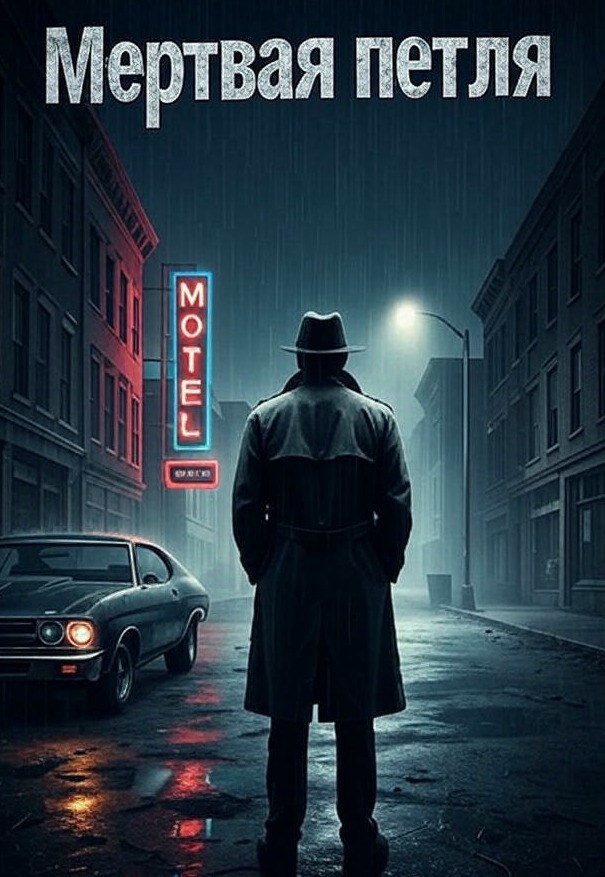

# Мёртвая петля

## Аннотация

Два года назад бывший военный следователь Макс Хартман похоронил своего напарника.
А теперь он получил от него сообщение: "Помоги".
В поисках призрака Хартман попадает в город-ловушку, где за фасадом обещанного рая скрывается смертельная угроза. Он думает, что ведёт расследование, но на самом деле он приманка в игре, правила которой написал кто-то другой.
Невидимый враг знает его прошлое, его слабости и каждый его следующий шаг. Чтобы вырваться из мёртвой петли, Максу придётся столкнуться с правдой, которая страшнее смерти.

## Обложка

### Глава 1

Глава 1

Макс Хартман вёл машину, как дышал. Не думая, не прилагая усилий. Старый Chevelle 1970 года, чёрный, с выцветшим до седины пятном на капоте, плыл по асфальту. Он чувствовал машину как собственное тело, послушное каждому движению. Внутри пахло не выхлопом или бензином. Пахло остывшим чёрным кофе, старой кожей и едва уловимым, въевшимся запахом оружейного масла. Это был его кокон. Его передвижной монастырь.

Шоссе разрезало бесконечные поля кукурузы, как чёрный шрам. Низкое солнце заливало мир длинным, обманчиво-золотым светом. Американская идиллия, нарисованная на гниющем холсте. Из динамиков лился монотонный голос диктора, сообщавшего об очередном закрытом заводе где-то в "ржавом поясе". Просто фон. Белый шум угасающего мира.

На пассажирском сиденье лежала книга. Потрёпанный экземпляр "Чикагских стихов" Карла Сэндберга, издание 1916 года. Углы страниц были загнуты, на полях виднелись выцветшие карандашные пометки, сделанные тонкой женской рукой. Рукой его матери. Это был его единственный план на ближайшие дни — маленький, реальный шаг в сторону от недавнего прошлого.

Он не искал покоя. Покой был иллюзией для тех, кто никогда не видел настоящего хаоса. Он искал тишины. Контролируемой, предсказуемой тишины, которую можно было нарушить по собственному желанию.

Резкий, чужеродный писк впился в тишину салона. Он шёл из бардачка. Звук, который Макс не слышал два года. Его лицо, до этого расслабленное, окаменело. Мышцы на шее напряглись. Он съехал на обочину, гравий зашуршал под колёсами. Двигатель продолжал ровно урчать.

Зашифрованный спутниковый телефон Thuraya. Он лежал там, завёрнутый в промасленную ветошь. Заряженный месяц назад. Резервный канал. Последний рубеж. Макс достал его. Холодный пластик в ладони. Экран светился ядовито-зелёным.

Одно слово. И строка координат.

"Помоги".

Отправитель: M_Torres_Ghost. Майкл Торрес. Призрак. Его напарник, которого Макс лично опознавал по зубам два года назад. На похоронах которого он стоял под ледяным дождём, и единственной реальностью под тем небом были четыре края могильной ямы.

На долю секунды мир замер. А потом в мозгу щелкнул ледяной тумблер. Послание.

Большой палец Макса нашёл своё привычное место на руле и начал мерно, ритмично постукивать. Раз. Два. Три. Четыре. Старый ритуал контроля. Передышка закончилась.

Он развернул Chevelle так резко, что зад машины вильнул, выбросив из-под колёс фонтан гравия. Золотой свет американской мечты остался позади. Впереди лежала серость.

Координаты указывали на старую фабрику. Лоуэлл, Пенсильвания. Город, который карта ещё помнила, а реальность уже похоронила. Контраст ударил по глазам, как только он съехал с шоссе. Ржавые скелеты заводов впивались в низкое небо. Воздух стал тяжелее, в нём висел привкус сырости, угольной пыли и чего-то кислого, металлического.

Мотель назывался "Тихая Гавань". Неоновая вывеска конвульсивно мигала, буквы "Т" и "а" давно умерли. Получалось "ихая Гавнь". Рядом с входом, на единственном чистом парковочном месте, стоял новый минивэн с логотипом "Элизиум". Макс припарковался подальше, в тени гигантского рекламного щита, на котором выцветшая семья улыбалась уже не существующему миру. Припарковавшись, он бросил взгляд на пассажирское сиденье. Книга. Лежит на виду. Глупо. Первая ошибка за сегодня. Он вернулся и убрал книгу в бардачок.

За стойкой регистрации сидел парень лет двадцати. Слишком чистый, слишком опрятный для этого места. Его поло было идеально белым, а на груди красовался вышитый логотип: стилизованное дерево, растущее из круга. "Элизиум". Улыбка парня была намертво приклеена к лицу.

— Добрый вечер! — его голос был слишком бодрым. — Ищете покоя и… внутреннего баланса?

Макс молча положил на липкую стойку три мятые двадцатки.

— Номер.

— Конечно, конечно! Мы здесь ценим простоту. — Парень сгрёб деньги. Его взгляд быстро, профессионально оценил Макса — одежда, выправка, шрам над бровью. — Мы предпочитаем наличные. Для… ясности. Вы к нам надолго?

— Посмотрим, — ответил Макс.

— Наш город — идеальное место, чтобы… очиститься от суеты, — добавил парень, протягивая ключ. Улыбка дрогнула на долю секунды.

Макс забрал ключ.

— Спасибо.

— Обретайте гармонию, — бросил парень ему в спину.

В холле Макс остановился. В нос ударил резкий, химический запах лемонграсса. Дешёвая попытка перебить въевшуюся в стены плесень и старый табак. Этот приторный, стерильный аромат был чужеродным, как и парень за стойкой.

Номер был чистым ровно настолько, чтобы не вызывать отвращения. Застиранное покрывало, выщербленный стол, пятно на потолке, похожее на карту неизвестного континента. Скудную сумку он разбирать не стал. Просто положил на кровать свой SIG Sauer P226.

Его руки двигались сами. Привычно, отточенно. Магазин извлечён. Патрон из патронника. Затвор снят. Пружина. Ствол. Он раскладывал детали пистолета на грязном покрывале. Механический ритуал. Он чистил оружие. Не потому, что оно было грязным. А потому, что это был его способ медитации. Единственный способ заставить замолчать голоса в голове.

К фабрике Корвина он шёл пешком. Сумерки сгущались, превращая город в декорации к фильму ужасов. Макс двигался по тротуару, который местами раскрошился до земли. Он видел детали упадка, которые складывались в общую картину апокалипсиса. Брошенная детская качель, ржаво скрипнувшая под порывом ветра. Витрина магазина, за которой на пыльном манекене висело свадебное платье, пожелтевшее от времени и горя.

Фабрика занимала несколько кварталов. Гигантский кирпичный монстр с выбитыми зубами окон. Ворота были наглухо заварены. Забор из сетки-рабицы провис и местами был покрыт рыжей коростой ржавчины. Здесь должно быть тихо. Здесь должна быть смерть.

Он заметил машину боковым зрением. Старый Ford Crown Victoria, патрульная машина шерифа. Она не ехала. Она медленно ползла вдоль противоположной стороны улицы, как хищник, выслеживающий добычу. Никаких мигалок. Никакого шума. Только ровный гул двигателя.

Макс не повернул головы. Он остановился и сделал вид, что разглядывает трещину в кирпичной стене фабрики. Он чувствовал взгляд. Тяжёлый, изучающий. Он мог описать его, не видя. Это был взгляд человека, который не знает, кто ты, но уже решил, что ты — проблема.

Машина поравнялась с ним и остановилась. Десять секунд тишины, нарушаемой только скрипом старой качели где-то позади. Макс считал удары своего сердца. Ровно. Спокойно. Он не был добычей.

На одиннадцатой секунде машина медленно тронулась с места и скрылась за углом. Предупреждение было сделано. И оно было получено. Шериф в игре. Неважно, на чьей стороне. Важно, что Макс теперь на его радаре.

Он дождался, пока звук двигателя полностью затихнет. Затем повернулся и пошёл обратно к мотелю. Сегодня он был просто туристом, заблудившимся в умирающем городе. Ночь всё расставит по своим местам.

Ночь в Лоуэлле была густой, как нефть. Уличное освещение работало через фонарь, создавая островки тусклого света в океане тьмы. Макс двигался в этой тьме, как рыба в воде.

Он обошёл периметр фабрики, держась в тени зданий. Главный вход его не интересовал. Он искал слабость. И нашёл её с тыльной стороны, там, где забор граничил с заросшим пустырём. Сетка-рабица у основания проржавела. Не было необходимости рвать сетку. Пальцы нашли опору, и он отогнул край ровно настолько, чтобы протиснуться. Ни одного лишнего звука, ни одного лишнего движения.

На территории фабрики пахло мокрой землёй и прелыми листьями. Он ожидал запустения, тишины кладбища.

Но первое, что он увидел, — свежие следы шин на влажной земле. Глубокие, чёткие. Не от легковой машины. От тяжёлых грузовиков.

Второе, что он услышал, — низкий, ровный гул. Он шёл из глубины главного цеха. Это был не скрип металла под ветром, не стон умирающего здания. Это был звук работающего промышленного генератора. Звук жизни там, где должна была быть смерть.

Макс замер в тени соседнего склада, метрах в двадцати от стены цеха. Он медленно двинулся вдоль неё, его ботинки глухо ступали по размокшему грунту. Он поднял голову. Окна цеха были тёмными, покрытыми слоем многолетней грязи.

И тут в одном из окон на третьем этаже на долю секунды вспыхнул свет. Короткая, оранжевая вспышка. В ней мелькнул силуэт, и у его лица что-то тускло блеснуло.

Макс отступил глубже в тень, сливаясь с ней. Его сердце не забилось чаще, дыхание не сбилось. Эмоции придут позже. Сейчас в голове была только одна, кристально ясная мысль.

Они не просто работают. Они наблюдают.

Торрес не звал его на кладбище. Он звал его на войну.

### Глава 2

Глава 2

Рассвет над Лоуэллом просто менял оттенок серого. Мутный, как разбавленное молоко, свет просачивался сквозь ржавые рёбра ферм заброшенного склада, где Макс Хартман провёл остаток ночи. Он не спал. Сон был роскошью, непозволительной на вражеской территории. А фабрика Корвина, без сомнения, была именно такой.

Холод пробирался сквозь плотную ткань куртки, впитывался в мышцы, заставляя их ныть тупой, привычной болью. Макс двигался тихо, тенью скользя вдоль бетонной стены, подальше от прожекторов, которые погасли ровно в шесть утра, по таймеру. Профессионалы. Они работали по расписанию. Наблюдатель с оптикой, которого он заметил ночью, тоже исчез. Смена караула.

Макс вернулся к своему Chevelle, который он оставил в рощице чахлых деревьев в полумиле от фабрики. Он завёл двигатель. Рокот V8 показался оглушительным. Рискованно, но он был достаточно далеко, и сейчас движение было важнее тишины. Он позволил мотору поработать, согревая не только металл, но и себя. Внутри передвижного монастыря, его единственного настоящего дома, на мгновение вернулось подобие порядка. Он был один. Он контролировал ситуацию. Ложь была сладкой на вкус, как первый глоток горячего кофе.

Сообщение на телефоне всё ещё горело в его памяти. Одно слово. "Помоги". От Майкла Торреса. Призрака. Человека, чей гроб, накрытый флагом, он нёс два года назад. Торрес позвал его на войну. И Макс пришёл.

Бар "Перекрёсток". Иронично, подумал Макс, для города, из которого все дороги вели в никуда. Он толкнул тяжёлую дверь и вошёл внутрь. В баре пахло кисло, въевшимся духом пролитого пива. Запах пытались вывести хлоркой, но от этого стало только хуже: едкая химия лишь подчёркивала старую вонь. И сквозь всё это, из старой вентиляциии, тянуло тонким, почти неощутимым металлическим привкусов ржавчины. Попытка скрыть упадок, которая лишь подчёркивала его.

За стойкой из тёмного, исцарапанного дерева стоял мужчина лет шестидесяти. Лицо бармена было пергаментным, испещрённым сетью глубоких морщин и старческих пятен. Кожа так плотно обтягивала череп, что казалось, её натянули и закрепили много лет назад. Он протирал стакан тряпкой с таким видом, будто занимался этим всю свою жизнь и собирался заниматься вечно. Макс сел на шаткий табурет, подальше от пары окон, но так, чтобы видеть вход.

— Кофе. Чёрный.

Бармен, не говоря ни слова, взял с полки щербатую кружку и налил в неё тёмную, пахнущую гарью жидкость из старой кофеварки. Макс обвёл взглядом помещение. Пусто. Кроме него, за столиком в самом тёмном углу сидела женщина. Она делала вид, что читает книгу в мягкой обложке, но её кофе, как и его, остывал нетронутым. Одета она была слишком опрятно для этого места. На ней были добротные, но заметно ношеные джинсы и туристические ботинки, покрытые слоем дорожной пыли. Она не была местной, но отчаянно старалась ею казаться.

Он отвернулся, сосредоточившись на бармене. Прямые вопросы здесь не работали. Они вызывали лишь глухую стену молчания. Нужна была наживка.

— Тихо тут у вас, — сказал Макс, глядя в свою кружку.

Бармен хмыкнул, не прекращая полировать и без того чистый стакан.

— Всегда тихо. С тех пор, как Корвин встал. Здесь теперь только тишина. Или вой ветра в пустых цехах.

— Слышал, кто-то пытается оживить это место. Какая-то корпорация. "Элизиум", кажется?

Взгляд бармена на долю секунды стал острее. Он поставил стакан на стойку. Звук прозвучал слишком громко.

— Оживить, — он процедил слово с таким отвращением, будто сплюнул на пол. — Они скупают мертвечину. Кости этого города. Продают воздух, которым дышать нельзя. Йога на развалинах. "Найди свой внутренний покой" там, где твой отец потерял лёгкие.

Он наклонился через стойку, его голос упал до заговорщического шёпота.

— Но вот на Корвине… там жизнь другая. Ночью. Грузовики. И не с органической капустой они оттуда выезжают, если ты понимаешь, о чём я.

Макс молча сделал глоток. Кофе был горьким и едва тёплым. То, что нужно. Он чувствовал на себе взгляд женщины из угла. Она больше не притворялась, что читает.

— Что за грузовики? — спросил Макс, нарушая собственное правило.

— Те, на которые лучше не смотреть, — отрезал бармен и отошёл в другой конец стойки, давая понять, что разговор окончен.

Дверь бара скрипнула.

Он вошёл так, словно бар принадлежал ему. Шериф Броуди. Высокий, обрюзгший, с лицом, которое когда-то, возможно, было симпатичным, но теперь потекло, испорченное выпивкой и плохим сном. Он не стал осматривать помещение. Его взгляд, тяжёлый и мутный, сразу нашёл Макса. Медленно, переваливаясь с ноги на ногу, он подошёл к стойке. Его правая рука небрежно, но демонстративно лежала на рукояти его "Глока".

— Документы, — сказал он. Это был не вопрос.

Макс посмотрел на него. Спокойно. Оценил расстояние, возможные траектории, отражение в зеркале за стойкой. Женщина в углу замерла.

— У вас есть причина?

— Мой город. Мои причины. Этого достаточно. Документы. На стойку. Живо.

Макс медленно, без резких движений, достал из кармана водительские права и положил на липкую поверхность. Броуди взял их двумя пальцами, поднёс близко к глазам.

— Макс Хартман. Проездом? — он вернул права, но не взгляд.

— Что-то вроде.

— Люди, которые здесь "проездом", обычно едут дальше. По Двадцать седьмому шоссе, прямо насквозь. Они не крутятся без дела, не задают… — он запнулся, подбирая слово, — лишних вопросов.

— Я просто пью кофе, шериф.

Броуди наклонился. От него пахло потом и дешёвым лосьоном после бритья. Его голос стал тише, но в нём зашипела неприкрытая угроза.

— Нет. Ты не просто пьёшь кофе. Ты здесь, и ты уже проблема. А у меня, блин, и без тебя проблем по горло.

Макс заметил это. Лёгкую, почти незаметную дрожь в пальцах шерифа, лежащих на стойке. Это был не гнев. Это был страх.

— Так что вот тебе мой дружеский совет, Хартман. Допивай свою бурду… и убирайся из моего города. Пока он сам тебя не убрал. Понял меня?

— Вас понял, шериф, — ровным голосом ответил Макс.

Броуди выпрямился, окинул его последним полным ненависти взглядом и, не дожидаясь ответа, развернулся и вышел. Дверь за ним захлопнулась.

Тишина в баре нарушилась скрипом стула. Женщина из угла подошла к стойке. Вблизи она выглядела моложе. И ещё более неуместно в этом интерьере.

— Не самый дружелюбный приём, — она выдавила из себя нервную улыбку. — Сара Чен. Я журналист.

Макс молча смотрел на неё. Журналист. Конечно. Это было самое очевидное и самое фальшивое прикрытие.

— Я пишу материал о социальных последствиях закрытия промышленных предприятий. Деиндустриализация и всё такое, — она говорила быстро, словно боялась, что он её прервёт. — О Лоуэлле.

— И что, шериф не любит журналистов? — тон Макса был абсолютно нейтральным.

— Он не любит никого, кто суёт нос к фабрике Корвина, — прямо сказала она. — Я заметила, вы тоже… интересуетесь.

"Заметила она". Она следила за ним с того момента, как он вошёл. Возможно, и раньше.

— Может, объединим усилия? У меня есть информация, у вас, похоже, есть… навыки.

Макс сделал ещё один глоток остывшего кофе. Он позволил тишине повиснуть между ними, наблюдая, как она начинает нервно теребить мочку уха.

— Какие навыки? — спросил он.

Она на секунду растерялась.

— Навыки… ну… не бояться шерифа Броуди. И говорить с такими людьми, как этот бармен. У меня не очень получается.

Ложь. Она была слишком умна, чтобы не уметь говорить с людьми. Её неуверенность была такой же частью легенды, как и её блокнот.

— Что именно вы ищете, мисс Чен? — спросил Макс, ставя пустую кружку на стойку.

— Правду, — её голос прозвучал на удивление твёрдо. — О том, как этот город умирает. И почему.

Макс поднялся со стула. Он достал из кармана несколько мятых купюр и положил их на стойку.

— Правда здесь — плохой попутчик, мисс Чен. От неё больше проблем, чем от лжи.

Он развернулся и пошёл к выходу, не оглядываясь. Он чувствовал её взгляд на своей спине. Она была проблемой. Ещё одной переменной в уравнении, которое он пока не мог решить.

Макс не спешил возвращаться в мотель. Он прокручивал в голове утренние события. Шериф. Бармен. "Журналистка". Все они были связаны с фабрикой. Лоуэлл был не просто умирающим городом. Это был город с секретом, и этот секрет охраняли.

Он проехал мимо очередного рекламного щита "Элизиума". На нём улыбалась неправдоподобно счастливая женщина в позе лотоса. Слоган гласил: "Очисти своё тело. Очисти свой дух. Очисти свою жизнь". На фоне ржавых остовов заводов это выглядело как жестокая насмешка.

Макс припарковал Chevelle у двери своего номера. Он заметил, как за приоткрывшейся занавеской соседнего номера мелькнуло лицо Сары Чен. "Журналистка", как же.

Он уже потянулся к ключу, но замер. Что-то было не так. Запах.

При заселении в номере стоял резкий, искусственный аромат лемонграсса. Сейчас этот запах стал слабее. Его перебивало что-то другое. Едва уловимый химический запах. Запах чистоты, но не той, что бывает после уборки. Искусственной, мёртвой чистоты. Чем-то напоминающий антисептик.

Сердце не пропустило удар. Оно просто начало работать по-другому. Ровно, холодно, перекачивая кровь, насыщенную не страхом, а чистым, ледяным адреналином. Он вытащил из-за пояса свой пистолет. Предохранитель щёлкнул почти беззвучно.

Он толкнул дверь плечом. Она поддалась. Замок был вскрыт чисто.

Внутри всё было на своих местах. Кровать заправлена неумелой горничной. Его рюкзак лежал на стуле, нетронутый. Он быстро проверил тайник в подкладке. Деньги были на месте.

Он подошёл к прикроватной тумбочке. На ней лежала его книга. Зачитанный до дыр томик стихов Карла Сэндберга. На книге лежал один-единственный патрон калибра 9мм. Патрон, которого здесь быть не должно. Послание было ясным: "Мы знаем, кто ты".

Макс замер. Ледяной адреналин в венах сменился чем-то более тяжёлым и острым — яростью.

Кто-то знал его прошлое. Не просто имя, а его армейское прошлое. Дёрнул за ниточку, и он, марионетка, примчался в этот город-ловушку.

Наблюдатель, шериф, "журналистка" — части механизма, заведённого до его приезда.

Они полезли в его память. И он этого так не оставит.

### Глава 3

Глава 3

Воздух в лёгких превратился в лёд. Макс застыл посреди номера, и тишина мотеля давила на уши. Послание было не просто оставлено. Оно было исполнено чисто. Это была работа профессионала. Бесшумного, невидимого. И сейчас этот профессионал, скорее всего, наблюдал за ним, ожидая реакции. Гнева. Страха. Ошибки.

Хартман заставил себя выдохнуть. Медленно. Он забрал патрон, и положил книгу на стол, ровно на то место, где она лежала, только теперь правильной стороной вверх. Затем, не издав ни звука, подошёл к двери и вышел на улицу.

Дверь в номер Сары Чен была закрыта. Он не стал стучать. Просто ждал. Он знал, что она за дверью. Она тоже ждала.

Прошла минута. Две. Наконец замок в её двери тихо щёлкнул.

Сара стояла на пороге, в тех же джинсах и футболке. В её руке был телефон, но она не смотрела в него. Она смотрела на Хартмана. Её лицо было бледным.

— Твоя легенда — мусор, — сказал Макс. Голос был тихим, но резал воздух, как нож. — "Журналистка". Кто надоумил?

Она вздрогнула, но не отступила.

— Я не знаю, о чём вы…

— Они были в моей комнате, — прервал он её, делая шаг вперёд. Она инстинктивно попятилась вглубь своего номера. — Оставили сообщение. Очень личное. Так что хватит игр. Кто ты и что тебе здесь на самом деле нужно?

Он вошёл в её номер и закрыл за собой дверь. В комнате пахло её духами и страхом. На столе лежал открытый ноутбук со схемами и спутниковыми снимками фабрики. Никаких заметок о "социальных последствиях".

Её взгляд метнулся к ноутбуку, затем снова на него. Она поняла, что игра окончена.

— Мой отец, — её голос дрогнул, но затем стал твёрдым. — Он был инженером. На этой фабрике. Он погиб здесь. Они сказали — несчастный случай. Я знаю, что это ложь.

Хартман смотрел на неё, оценивая каждое слово, каждое движение. Он видел правду. Не всю, но её ядро. Месть. Это он понимал.

— У тебя есть информация, — констатировал он, кивнув на ноутбук. — У меня — навыки, которые тебе нужны, чтобы не закончить, как твой отец.

Сара побледнела ещё сильнее.

— Потому что так они работают, — отрезал он. — Они уберут всех, кто узнает правду. Прямо сейчас мы оба — цели.

Он подошёл к окну, посмотрел на ржавеющие крыши Лоуэлла.

— Так что вот сделка. Ты даёшь мне всё, что у тебя есть. Все данные. Каждую мелочь. Взамен я не дам им тебя убрать. Просто. Опасно. Согласна?

Она смотрела на него долго, её мозг аналитика просчитывал варианты. Но вариантов не было. Она кивнула. Один раз. Резко.

— Хорошо, — сказал Хартман. — Тогда слушай. Нам нужно на ту высоту, что к западу от фабрики. До рассвета.

Его привели сюда и сделали целью. Значит, они здесь и он узнает, кто за этим стоит.

— Здесь больше оставаться нельзя, — сказал Макс. — Выезжаем через 10 минут. Ты первая. Ждёшь меня на выезде из города у биллборда "Элизиума" пять минут. Будет хвост — я замечу.

Сара хотела что-то возразить, но понимала, что он прав.

Манёвр сработал. Дорога за ней была чиста. Макс заглушил двигатель своего Chevelle рядом с ее Бьюиком, подслеповато моргнувшим фарами в свете рекламного щита.

— Ноутбук, — коротко приказал он, пересаживаясь на пассажирское сиденье ее машины. — Показывай, что у тебя есть.

Холодный утренний туман облепил ржавые фермы фабрики Корвина. Он глушил звуки и размывал очертания. Хартман лежал на животе на заросшем склоне холма, ткань его куртки намокла, холод пробирался к коже, но он не обращал на это внимания. Физический дискомфорт был старым знакомым, фоновым шумом, который помогал сосредоточиться.

Метрах в пятнадцати левее, за кустами дикой сирени, залегла Сара Чен. Он видел её лишь мельком — тёмный силуэт, почти слившийся с пейзажем. Их партнёрство держалось на простом, как выстрел, расчёте: он — таран, она — источник информации. Простая сделка. Опасная.

Его бинокль был прикован к подъездной дороге. Он ждал. Терпение было мышцей, которую армия накачала до состояния стального троса. Он мог ждать часами. Днями.

— Ничего, — прошипел голос Сары в миниатюрном наушнике. — Может, зря тратим время?

— Ночью тут только охрана и грузовики. Начальство приезжает днём. Так безопаснее. — ответил Хартман, не отрывая глаз от дороги. Его голос был тихим, почти без интонаций.

— Откуда такая уверенность?

Он оставил вопрос без ответа. Тишина длилась почти минуту, пока по гравийной дороге не прокатился шёпот шин. Из-за поворота выехал чёрный седан. Он двигался плавно, неторопливо. Двигался так, словно дорога принадлежала ему.

— Это не просто броневик, — сказала она через несколько секунд молчания. — Похоже на заводское бронирование, класс не ниже VR7. Толщина стоек, рамы… это не самоделка. Правительственные номера, но не местные. Это не промышленники. Кто это, Хартман?

Хартман замер. Дыхание остановилось где-то на полпути в лёгкие, словно наткнулось на стену. Он не ответил, потому что слова застряли где-то в горле. Человек, вышедший из передней пассажирской двери, двигался с той самой уверенностью, которая бывает только у тех, кто привык, что мир прогибается под них. Безупречно отглаженная форма. Генеральские звёзды на погонах, тускло блеснувшие в сером утреннем свете.

— Я его знаю, — выдавил он.

— Знаешь? Кто он?

— Хоукинс, — Хартман сказал имя, будто выплюнул.

Он видел, как идеально выверенные движения Хоукинса диссонировали с окружающей разрухой. Генерал достал телефон, его лицо выражало досаду. Он презирал это место. Презирал всё, что не блестело и не подчинялось уставу. Из водительской двери вышла женщина. Стройная, в строгом тёмном костюме, с папкой в руках. Она двигалась бесшумно, как тень генерала. Её лицо было невыразительным, причёска — строгой. Она не смотрела на Хоукинса. Её взгляд методично сканировал периметр: крыши цехов, лесополосу, этот самый холм. Хартман инстинктивно вжался в землю, хотя и знал, что с такого расстояния его не разглядеть. Он отметил её поведение. Это была не секретарша. Это был профессионал.

— Молчи, — приказал он Саре, поднеся руку к миниатюрному микрофону на воротнике. — Просто наблюдай.

Женщина закончила осмотр, её взгляд на секунду задержался на их холме, а затем скользнул дальше. Мышцы спины Хартмана свело от напряжения. Не потому, что его заметили. А потому, что его могли заметить. Эта женщина думала так же, как он. Она проверяла высоты.

— Кто она? — шёпот Сары был едва слышен.

— Не знаю. Помощница.

Женщина подошла к генералу и что-то тихо сказала. Тот раздражённо кивнул и убрал телефон. Они направились к главному зданию. Их фигуры исчезли в тёмном проёме ворот. Чёрный седан остался у входа, немой и угрожающий, как надгробный камень.

Хартман медленно выдохнул. Это будет война против своих.

Хартману был нужен отдых, но он не мог расслабиться. Они утром сняли номера в Holiday Inn за 50 миль от Лоуэлла. Комната давила на него своими старыми обоями и запахом химии. Образ Хоукинса на фоне ржавой фабрики стоял перед глазами. Генерал здесь. Значит, дело серьёзнее, чем он думал. Это не частная разборка. Это операция.

* * *

Макс встал с кровати. Простыни были холодными и скользкими.

Его взгляд упал на дешёвую кофеварку на тумбочке. Он насыпал в фильтр порошок, который лишь отдалённо напоминал кофе, и нажал кнопку. Аппарат затрясся, загудел с натужным стоном, а потом по комнате пополз резкий, едкий запах перегретого пластика.

И этот запах стал ключом.

Он мгновенно перенёс его из дешёвого мотеля в самое сердце его личного ада. Запах жжёной пластмассы смешался в его сознании с другим — запахом раскалённой кирпичной пыли, горелого пороха и чего-то сладковатого, тошнотворного. Перед его глазами вспыхнуло не мигание неона, а безжалостное иракское солнце над руинами двухэтажного дома. Он снова стоял там, задыхаясь от жары и пыли, а его руки были покрыты чужой кровью. Он видел лицо информатора, который за несколько часов до этого пил с ним чай и показывал фотографии своих дочерей. А теперь он, Хартман, стоял над тем, что от них осталось. Ошибка в расчётах. Одна цифра не там. Один неверный квадрат на карте, переданный пилоту. И целая семья превратилась в статистику, которую списали на "сопутствующий ущерб". Он промолчал тогда. Прикрыл себя, прикрыл отряд. Он выбрал карьеру вместо правды. И каждый день платил за этот выбор.

Хартман отшатнулся от кофеварки, едва не сбив её на пол. Дыхание сбилось, сердце колотилось где-то в горле. Он налил мутную, пахнущую пластмассой жидкость в щербатую чашку и сел за стол. Он не пил. Он просто смотрел, как над поверхностью поднимается пар. Ждал, пока кофе остынет. Пока бешеная скачка мыслей замедлится. Пока он снова сможет дышать. Маленький, жалкий островок контроля посреди океана хаоса, бушевавшего у него в голове.

Ожидание было роскошью. Информатор был единственной нитью. Ненадёжной, тонкой, но он должен был за неё потянуть.

Возвращаться в Лоуэлл было рисковано, но необходимо, и оно того стоило. Макс смог разговорить Гаса, старика-бармена из "Перекрёстка". И тот дал ему наводку. Сказал, что это бывший сотрудник фабрики, уволенный, злой. Он готов говорить.

Макс взял со стола пистолет, проверил магазин. Холодная тяжесть металла в руке была единственным, что сейчас казалось реальным.

Заброшенный склад у старых железнодорожных путей встретил его тишиной и запахом гниющего дерева. Лунный свет просачивался сквозь дыры в крыше, рисуя на бетонном полу призрачные полосы. Хартман двигался вдоль стены, его ботинки хрустели рассыпанным гравием. Каждый его нерв был натянут. Он подозревал, что это ловушка. Но это был и шанс выманить игроков на его поле.

Он шёл на встречу с человеком по имени Рик. Бармен описал его как "озлобленного мужика, который знает, где на фабрике крысы зимуют". Рик был готов продать эту информацию.

Хартман нашёл его в дальнем углу склада. Мужчина сидел, прислонившись к бетонной опоре, его ноги были вытянуты вперёд. Он будто спал. Но голова была неестественно, страшно свёрнута набок. Хартман замер в десяти шагах. Он уже знал.

Он подошёл ближе. На шее жертвы виднелась тонкая, почти невидимая в полумраке борозда. Гаррота. Никаких улик. Чистая работа. Профессиональная.

В городе работал "чистильщик". Хартман медленно поднялся. Воздух в складе стал плотным, тяжёлым. Он был не один.

Фигура возникла из тени за грудой проржавевших бочек. Бесшумно, как призрак. Не было ни шагов, ни шороха. Просто в один миг там было пусто, а в следующий — уже нет. Инстинкты Хартмана сработали раньше, чем мозг успел отдать приказ. Он рванулся в сторону в тот самый момент, когда в воздухе блеснуло лезвие ножа. Сталь прошла в сантиметре от его горла.

Схватка была короткой и почти беззвучной. Никаких криков. Только сдавленное хриплое дыхание, глухие удары по телу и скрежет ботинок по бетонной крошке. Противник был в тёмной одежде, лицо скрыто капюшоном. Он был не крупнее Хартмана, но двигался с невероятной скоростью и звериной эффективностью. Каждый его удар был нацелен на поражение.

Хартман ушёл в глухую оборону, блокируя выпады предплечьями. Он чувствовал, как удары отдавались в костях. Это был не уличный боец. Это был обученный убийца. Хартман отступил на шаг, пытаясь разорвать дистанцию. Противник не дал ему этого сделать. Новый выпад ножом, на этот раз снизу. Хартман отбил руку, но лезвие всё равно полоснуло его по левому предплечью. Руку обожгло острой болью, словно по ней провели раскалённым металлом.

Он понял, что проигрывает. В ближнем бою с вооружённым и равным по силе противником он был в невыгодном положении. План рухнул. Логика и тактика здесь больше не работали. Остался только хаос.

И Хартман подчинился ему. Вместо того чтобы снова отступать, он сделал нелогичный, самоубийственный шаг вперёд, прямо на врага. И пока тот на долю секунды замешкался от неожиданности, Хартман со всей силы ударил ногой по проржавевшей опоре стоявшего рядом огромного, шаткого стеллажа. Тяжеленный ржавый металл с грохотом накренился и рухнул в сторону убийцы. Тот был вынужден отскочить, чтобы его не придавило. Это дало Хартману два спасительных шага. Два вдоха. Две секунды, чтобы выжить.

Чистильщик не стал преследовать. Он выпрямился, оценивая ситуацию. Элемент внезапности был утерян. План провалился и у него. Он взглянул на Хартмана, и даже в темноте тот почувствовал холод этого взгляда. Затем фигура так же бесшумно, как и появилась, скользнула в темноту одного из проломов в стене и исчезла.

Хартман остался один посреди гулкого склада. Он тяжело дышал, прижимая ладонью кровоточащую рану на руке. Кровь была горячей и липкой. Он не видел лица убийцы, не слышал его голоса. Но он запомнил его движения. Абсолютное хладнокровие, жестокая, выверенная экономия каждого жеста.

И в этот момент издалека донёсся тонкий, нарастающий вой сирен. Они ехали сюда. К нему. К трупу. Он был в ловушке, ранен, а его враг — невидимка, пофессионал с армейскими навыками. Война, на которую его позвал Торрес, только что началась. И он уже истекал кровью на её передовой.

Чистильщик не просто убил информатора. Он позвонил 911. Он приготовил сцену для полиции, где Хартман был главным актёром.

* * *

Джимми Хантер шагнул в переулок, и темнота поглотила его. Он не бежал. Он просто уходил, становясь частью ночного города — неотличимым от мусорного бака или тени от пожарной лестницы. Лёгкая боль в рёбрах, куда пришёлся удар Хартмана, была приятным, почти забытым ощущением. Это был не провал. Провалом была бы его смерть. Это было... осложнение. Интересное осложнение.

Он остановился, прислонившись к холодной кирпичной стене. Информатор был лёгкой работой. Мягкий, перепуганный, он даже не успел понять, что произошло. Просто тихий хрип и всё. Джимми делал это сотни раз. Это было как в детстве, в лесах Монтаны. Когда он выслеживал оленя, затаив дыхание, чувствуя каждый толчок крови в висках. Тихий щелчок тетивы. Идеальный выстрел.

Армия должна была стать его раем. И поначалу так и было. Они научили его убивать эффективнее, дали ему лучшее оружие и цели, которые не мычали от страха. Он был лучшим. Но они не поняли главного. Для них это была работа, долг. Для него — страсть. Они не любили войну, они её терпели. А Джимми её любил. Он упивался ею. И когда они это поняли, они испугались. Его вышвырнули, как бешеную собаку, слишком опасную даже для псарни.

А потом его нашла Рейнольдс. Она не видела в нём монстра. Она увидела в нём идеальный инструмент. Она не просила его меняться. Она дала ему то, в чём он нуждался: цель. И хорошую, очень хорошую работу. Джимми был её слесарным резцом, что вскрывает металл: точным, холодным, безжалостным.

Но Хартман... Хартман был другим. Он не был добычей. Джимми почувствовал это в тот момент, когда их взгляды встретились в полумраке склада. В нём не было паники. Только холодная оценка и готовность к бою. Он двигался правильно. Он думал. Удар по стеллажу — это было непредсказуемо, грязно, но эффективно. Это был ход не солдата, а выжившего.

Джимми провёл языком по зубам. Во рту стоял медный привкус — отголосок короткой, яростной схватки. Годы лёгкой работы, устранения «проблем», которые не давали сдачи, почти превратили его ремесло в рутину. Хартман вернул в неё главное — охоту. Настоящую охоту на равных.

И ему это нравилось.

### Глава 4

Глава 4

Вой сирен перешёл в визг, а потом растаял вдали. Хартман лежал на заднем сиденье старого "Бьюика" Сары, вжимаясь в потрескавшийся винил. Мир за окнами превратился в смазанные полосы неоновых огней и мокрого асфальта. Каждый поворот отзывался тупой, пульсирующей болью в левом предплечье.

Сара забрала его в квартале от склада, как они и договаривались перед встречей с информатором. Макс просто ввалился в машину, в крови, запыхавшийся после стычки и бега. Всё было ясно без лишних слов.

— Оторвались, — голос Сары был напряжённым, но ровным. Она вела машину уверенно, без лишних движений. — Они ехали на вызов. На наш вызов.

Он не ответил, глядя на свою руку. Тряпка, которой он зажимал рану, насквозь пропиталась кровью, став в тусклом свете фонарей почти чёрной. Он сосредоточился на запахе в машине. Пахло мокрым асфальтом, остывающим металлом капота и слабым, едва уловимым ароматом духов Сары. Что-то цитрусовое и чистое. Этот запах был здесь чужим.

Свой Cheville ему пришлось оставить вчера у Holiday Inn. Слишком заметная машина. Макс надеялся, что ещё сможет вернуться за ней. Но сейчас это не было важно.

Они не останавливались, пока огни Лоуэлла не остались далеко позади. Через час езды на север, они свернули к безликому мотелю у шоссе. Сара расплатилась наличными, используя фальшивые документы.

— Давай, — сказала она, открывая дверь в номер. — Нужно заняться твоей рукой.

Номер был стерильно-безликим, с одинаковой мебелью и запахом промышленного освежителя воздуха. Сара усадила его на край кровати и исчезла. Вернулась через минуту с автомобильной аптечкой.

Он не смотрел на рану. Он смотрел на её руки. Пальцы у неё были длинные, тонкие, привыкшие к клавиатуре, а не к полю боя. Но они не дрожали. Она промыла рану антисептиком и стянула края пореза пластырем, наложила повязку. Аккуратно, но туго.

— Готово, — сказала Сара, отступая на шаг. — Порез длинный, но не глубокий. Рана будет мешать неделю-две. И нужно следить, чтобы не было заражения.

Макс кивнул, медленно сгибая и разгибая пальцы здоровой руки. Адреналин уходил, оставляя после себя гул в ушах и противную слабость в мышцах. Веки налились свинцом.

— Спасибо.

Сара села на стул напротив, пристально глядя на него. В тусклом свете лампы её лицо казалось бледным и строгим. Она больше не играла в восторженную журналистку.

— Это не журналистское расследование, — сказала она. — Я здесь, чтобы вернуть отцу его имя. Доказать, что он был прав.

Хартман медленно кивнул. Теперь всё вставало на свои места. Её интерес. Её знания. Её присутствие здесь. Это не было расследованием. Это была вендетта. Или, ещё хуже, поиск справедливости. Он знал, чем это обычно заканчивается. Грязью и кровью.

Прошло несколько часов. Сквозь щели в жалюзи пробивались первые полосы света. Не серого — никакого. Просто мир за окном становился менее чёрным. Пыль в комнате из невидимой превратилась в почти осязаемую взвесь. Хартман не спал. Он стоял у окна, неподвижный, как статуя, и смотрел на пустую парковку. Боль в руке превратилась в нудное, но терпимое напоминание о провале.

Сара сидела на полу, скрестив ноги. Перед ней на низком кофейном столике стоял ноутбук, его экран отражался в её уставших глазах. Тишина в комнате прерывалась лишь тихим, но ожесточенным стуком клавиш.

— Бесполезно, — пробормотала она, скорее для себя, чем для него. — Их основная сеть — крепость. Все порты закрыты. Я неделю не могу пробиться, ни через известные уязвимости, ни через фишинг. Профессионалы, чёрт бы их побрал.

Она откинулась назад, на секунду прикрыв глаза. Но затем снова наклонилась к экрану, меняя тактику. Окно прямого взлома сменилось десятком других — поисковики, архивные страницы, базы данных известных утечек. Она больше не ломилась в дверь. Она шла в обход. Её пальцы методично вбивали запросы: "Corwin factory contractors", "Lowell PA outsource".

Прошел еще час. Хартман не шелохнулся. Он слышал, как изменился ритм её работы: яростный стук сменился долгими паузами, прерываемыми короткими очередями набора текста.

— Вот ты где... — прошептала она.

Макс повернул голову. Её лицо было напряжено, взгляд сфокусирован на строчках кода на тёмном фоне.

— Старый контракт на аутсорсинг офшорной IT-компании, всплывший в одной из утечек два года назад, — быстро заговорила она, словно боясь упустить мысль. — Фабрика Корвин использовала стороннее бухгалтерское ПО. "FinCount Suite". Если они всё ещё используют его с остальной инфраструктурой...

Её пальцы снова замелькали, открывая зашифрованные форумы через onion-браузер.

— Они не могли оставить такую дыру... не могли... — бормотала она, просматривая ветки обсуждений. И вдруг замерла. — О да...

Макс подошел ближе. На экране была страница закрытого хакерского форума. Тема, созданная три дня назад.

— "FinCount Suite 4.5. Удалённое выполнение кода", — прочитала Сара вслух, и в её голосе появился хищный азарт. — Кто-то нашел способ обойти защиту. Хотя эксплойт уже опубликован, они могли ещё не успеть сделать патч. Это наш шанс.

Она работала быстро и точно, копируя код эксплойта, внося в него необходимые изменения. Затем, сделав глубокий вдох, запустила его. Секунда. Две. Пять. На экране ничего не происходило.

— Давай же... — процедила она сквозь зубы.

И вдруг на экране появилось окно входа. Без запроса пароля. Просто строка доступа. Сара быстро щёлкала клавишами.

— Я внутри, — выдохнула она. Голос был тихим, но звучал как выстрел. — Не во всей сети. Только в их бухгалтерском архиве, но... этого более чем достаточно. Я нашла их. ЧВК "Арес Секьюрити". Официально — подрядчик Пентагона. Неофициально — личная армия Хоукинса. Грязная работа, теневые операции.

— Этого следовало ожидать, — угрюмо ответил Макс.

"Нет, это явно не уровень журналиста. MIT? UCSD? Сара, где же ты этому научилась?", — думал он. С этим разберёмся позже.

Сара замолчала. Стук клавиш прекратился. Тишина, которая наступила после, была другой. Не задумчивой, а напряжённой. Макс медленно повернулся. Сара смотрела на экран, и её лицо было непроницаемым.

— Что там?

— За последние два дня на эту подставную компанию поступило три крупных транша от "Арес Секьюрити". Почти два миллиона долларов. Получатель "Номад Холдингс, LLC", но внутренний меморандум, санкционирующий перевод, оформлен на имя Майкла Торреса.

Дыхание Хартмана замерло. Всё тело на мгновение окаменело, превратившись в единый узел напряжённых мышц. Он подошёл и посмотрел на экран. Цифры, даты, названия компаний. Сухая, безжалостная логика данных. Имя, которое было для него священным, теперь стояло в одном ряду с воровством и предательством.

— Это невозможно, — сказал он. Голос был не его. Глухой и чужой.

— Это факт, Макс, — Сара ткнула пальцем в экран. — Вот номер служебного меморандума, вот даты переводов. Всё здесь. Твой друг жив. Или его именем кто-то очень умело пользуется.

Три недели назад. Задолго до того, как ему пришло сообщение. Всё было спланировано. Его заманили сюда. Сообщение было приманкой. А он, как идиот, на неё клюнул. Но Торрес… Торрес не мог. Человек, который вытащил его из-под огня в Фаллудже, истекая кровью, не мог.

Мог ли? Два года — это много. Люди меняются. Или, может, он никогда его и не знал по-настоящему.

— Смотри! — Сара развернула к нему ноутбук, её голос стал резким от нетерпения. — Даты. Суммы. Это не старые транзакции, Макс. Это происходит прямо сейчас! Вот даже вывод крупной суммы наличными где-то в Западной Вирджинии! Твой друг либо жив и очень богат, либо…

— Нет. — Макс покачал головой, не глядя на экран. Он смотрел сквозь стену, в своё прошлое. — Это не он.

— Да как ты можешь это говорить?! Цифры не лгут! Он тебя подставил. Использовал как отвлекающий манёвр, как живую мишень, пока он выводит их активы!

Её слова были как удары. Логичные. Правильные. И совершенно невыносимые.

— Ты его не знала. — Голос Макса был тихим, но в нём звенела сталь. — Он бы никогда… В Афганистане он вытащил меня из-под огня, когда… — Он оборвал фразу. Воспоминание было его. Делиться им — значило осквернить. — Это не он. Что-то здесь не так.

— Очнись! — Сара вскочила, её лицо исказилось от фрустрации. Она с размаху захлопнула крышку ноутбука. Резкий щелчок заставил его вздрогнуть. — Твой друг — призрак! Либо мёртвый призрак, либо тот, кем он сейчас притворяется! Мы не можем строить план на твоих… на твоих чувствах! Хоукинс — вот реальная, осязаемая цель! Деньги идут от его ЧВК!

— Это подстава, — упрямо повторил Макс. — Они хотят, чтобы мы так думали. Они знают, что он был моим напарником.

— А может, это он и хочет, чтобы ты так думал?! Чтобы свалить всё на подставу? Или подставить тебя? Ты запутался в своих воспоминаниях, Макс! А люди умирают! Информатор мёртв! Шериф ищет нас! А ты защищаешь грёбаного призрака, который, может, всё это и затеял!

Спор зашёл в тупик. Они оба были правы. Она верила цифрам. Он верил человеку. И он больше не был уверен, кто из них больший дурак. Он стиснул зубы так, что заныли челюсти. Сомнения были ядом. Они парализовали. Нужно было действовать.

Он сделал глубокий вдох, прогоняя образ Торреса. Загоняя его в самый тёмный угол сознания.

— Хорошо. Хоукинс.

Он произнёс это слово так, будто проглотил осколок стекла. Это было неправильное решение. Он чувствовал это каждой клеткой своего тела. Но это было единственное решение, которое могло сдвинуть их с мёртвой точки.

На окраине Лоуэлла, в маленьком доме с аккуратно подстриженным газоном, шериф Броуди сидел на кухне. На нём была форма, но без значка и фуражки. Он выглядел просто уставшим, обрюзгшим мужчиной средних лет. Перед ним на столе стояла кружка с остывшим кофе.

Его взгляд был прикован к холодильнику. К детскому рисунку, прикреплённому магнитом в виде божьей коровки. На рисунке криво нарисованное солнце с ножками-лучами улыбалось трём человечкам-палочкам. Он, его жена и их дочка. Мир, который он пытался защитить.

Он взял телефон, набрал номер. Прижал трубку к уху.

— Привет, дорогая. Да, всё в порядке. — Его голос был нарочито бодрым. Фальшивым. — Нет, ничего нового. Всё тихо. Просто… просто хотел услышать твой голос. Да. Целую малышку. И тебя.

Он положил трубку. Бодрость мгновенно слетела с его лица, оставив после себя выражение загнанной, всепоглощающей тоски. Он не был коррумпированным. Он был в ужасе. Он отправил семью к сестре жены в другой штат неделю назад. И каждый день молился, чтобы ужас, поселившийся в его городе, не дотянулся до них.

Ночь снова опустилась на Лоуэлл. Холодный, мелкий дождь шуршал по крыше "Бьюика". Парковка возле фабрики Корвина была пуста, если не считать двух патрульных машин ЧВК, стоявших у ворот.

— Это рискованно, — прошептала Сара. Она смотрела в бинокль из темноты машины, припаркованной на другой стороне улицы. — Охрана сменилась. Эти выглядят серьёзнее.

— У нас нет выбора. Нам нужно знать, о чём они говорят, — ответил Макс. Он посмотрел на миниатюрное устройство, которое протянула ему Сара.

— Откуда это?

— С AliExpress. - съязвила она. — Не вскрывать же мне "Арес Секьюрити" с помощью журналистского диктофона.

Макс взял пьезомикрофон. Холодный, плоский корпус размером с фалангу мизинца. "Кто же ты на самом деле, Сара, что у тебя такие игрушки?" — подумал он, но вопроса не задал. Он просто кивнул.

Он выскользнул из машины. Двигался бесшумно, тенью вдоль ржавого забора. Дождь был его союзником. Он глушил звуки и скрывал движения. Боль в перевязанной руке вспыхнула, когда он перелез через забор, но Хартман проигнорировал её.

Бронированный седан Хоукинса стоял отдельно, ближе к административному корпусу. Макс проскользнул к задней части машины. Пахло мокрой грязью, машинным маслом и бензином. Он быстро протёр небольшой участок заднего стекла, прямо над багажником. Устройство прилипло, как должно — тонкий слой геля зафиксировал его на поверхности. Теперь малейшие колебания стекла, вызванные голосами внутри будут преобразованы в сигнал.

Затем он скользнул под днище, достал второй модуль — ретранслятор. Закрепил его магнитом рядом с топливным баком — так, чтобы не было лишнего экранирования.

Внезапно парковку залил свет фар. Патрульная машина. Не ЧВК. Полиция. Она медленно катила вдоль периметра. Макс замер, вжавшись в грязь под машиной. Сердце глухо стучало в рёбрах. Он слышал, как кровь стучит у него в ушах, отмеряя удары. Один. Два. Три. Машина должна была уже проехать. Потом она тронулась и уехала.

Он закончил работу и так же бесшумно вернулся. В машине Сара протянула ему наушник. Он вставил его в ухо. Сначала были только помехи и шум дождя. Потом щёлкнула дверь машины. Они услышали голоса - искажённые, приглушенные. Сара подстроила адаптивные фильтры на цифровом приёмнике. Речь теперь можно было разобрать.

Голос Хоукинса был напряжённым, почти срывающимся на визг.

— …он был на складе! Броуди доложил, что он ушёл! Чёрт побери, Рейнольдс, этот Хартман — абсолютно неуправляемый фактор!

Голос Рейнольдс прозвучал в ответ. Тихий, ровный, лишённый всяких эмоций. Словно говорила машина.

— Любой фактор можно учесть, генерал. Или устранить. Угроза будет нейтрализована. Мы входим в финальную фазу проекта.

— А что с… с ним? — спросил Хоукинс.

В наушнике повисла пауза. Долгая, полная фонового шума. Потом Рейнольдс сказала:

— Он выполнил свою роль. Пришло время зачистки. Хартман, свидетели, архив — всё это уже завтра перестанет быть проблемой.

Макс и Сара переглянулись в темноте. Впервые за долгое время на их лицах было нечто похожее на уверенность. Макс сжал в кармане холодный металл запасной обоймы. Время действовать.

### Глава 5

Глава 5

У задней стены фабрики Корвина, в густой тени, два силуэта замерли у ржавой решётки вентиляционной шахты.

Хартман упёрся ботинком в стену, наваливаясь всем весом на короткий ломик. Его левое предплечье, перетянутое свежей повязкой, отозвалось тупой, ноющей болью. Он проигнорировал её. Боль просто напоминанием, что он ещё жив.

Металл поддался с протяжным скрежетом ржавчины, рвущейся по живому.

— Готово, — выдохнул он, отбрасывая лом.

Рядом с ним на корточках сидела Сара. Свет от экрана её ноутбука выхватывал из темноты сосредоточенное лицо и пыльные чертежи отца. Она кивнула, не отрывая взгляда от схемы.

— Эта шахта должна идти прямо над старым архивом. Если, конечно, они не перестроили всё к чертям.

— Не стали бы. Слишком дорого, — сказал Хартман. — Ты первая.

Сара поджала губы, но спорить не стала. Она протиснулась в узкий прямоугольный проём. Хартман последовал за ней, и мир сузился до душного, пахнущего ржавчиной и вековой пылью металлического короба. Они двигались на коленях, медленно и осторожно.

— Мой отец говорил, здесь можно было услышать, как рабочие в цеху… ну… — начала она шёпотом, её голос гулко отдавался от стен.

— Тише, — резко оборвал её Хартман.

— Что?

— Твоё дыхание. Слышно за милю. Ровнее. И молчи.

Она замолчала. Тишина в узком коробе стала давящей, почти физической. Он чувствовал её напряжение. Она была аналитиком, стратегом, но не полевым оперативником. Этот металлический гроб был его территорией, а для неё — пыткой.

По мере продвижения Хартман уловил новый запах. Он пробивался сквозь привычную вонь ржавчины и мышиного помёта. Сладковатый, химический, как хлорка, но под ним — едва заметная нота чего-то прелого, органического. Словно в абсолютно чистой палате долго пролежал труп, и теперь дезинфекция отчаянно пыталась скрыть следы разложения.

Запах вызвал у него глухую, иррациональную тревогу. Так пахнет место, где случилось что-то непоправимое, а улики не спрятали, а выжгли кислотой.

Он остановился, прижав палец к губам. Впереди, в десяти метрах, виднелась ещё одна решётка. Он подполз, заглянул вниз. Тускло освещённый кабинет. Ряды серых металлических шкафов. Внизу никого.

— Чисто, — прошептал он. — Спускаемся.

Они осторожно спрыгнули на бетонный пол. Тишина в архиве была почти абсолютной, нарушаемая лишь гудением старого системного блока. Слишком тихо. Слишком просто. Ощущение ловушки стало почти физическим. Воздух загустел, а волоски на затылке встали дыбом — животный инстинкт, который спасал ему жизнь чаще, чем бронежилет.

— За работу, — скомандовал Хартман, занимая позицию у двери. — Я прикрываю.

Сара, не теряя ни секунды, подошла к компьютеру. К её облегчению, он был без пароля — простой электронный каталог для внутреннего пользования. Халатность или приманка — разбираться было некогда. Её пальцы быстро забегали по клавишам, пролистывая списки.

— Есть, — прошептала она через полминуты. — Сектор Г, стеллаж 14-Б. Последние поступления за квартал. Это они.

Хартман скользнул к указанному шкафу. Замок был дешёвым. Пара движений тонкой металлической пластиной, щелчок — и дверца открыта. Внутри ровными стопками лежали папки с логотипом "Арес Секьюрити". Он не стал выбирать. Сгрёб всю верхнюю полку, охапку из пяти или шести папок, и засунул их в рюкзак Сары, который она протянула ему.

— Всё, уходим.

И в этот момент, словно их действия нащупали невидимый луч, архив взорвался звуком.

Оглушительный вой сирены ударил по ушам. Красные лампы аварийного освещения замигали, заливая всё пульсирующим, кровавым светом. И тут же раздался тяжёлый, лязгающий грохот. Металлические жалюзи с силой обрушились на окна и на единственную дверь, отрезая им путь.

— Суки, они нас ждали, — выругался Хартман.

В коридоре за матовым стеклом двери появились силуэты. Трое. Они двигались слаженно, как единый, хорошо подогнанный механизм. Это были не охранники. Это были охотники.

Прошлое научило Хартмана одному: когда ловушка захлопнулась, не пытайся её открыть. Проламывай новую дыру.

— За стол! — крикнул он, и его голос утонул в вое сирены.

Он опрокинул тяжёлый металлический шкаф, который с грохотом рухнул на пол. В ту же секунду по двери ударила первая очередь. Пули разрывали тонкий металл, как бумагу. Хартман ответил двумя короткими выстрелами из своего «Зига».

— Сара, к окну! К дальнему! Ползи!

Он видел её замершее лицо, шок в широко раскрытых глазах. Она не была готова к этому. Он снова выстрелил, прижимая огнём бойцов в коридоре. Воздух наполнился запахом пороха и горячего металла.

— Пошла!

Приказ подействовал. Сара очнулась, прижала к груди ноутбук и поползла к единственному окну без решётки.

Хартман перезаряжался, когда это случилось. План провалился не из-за гениальной тактики врага, а из-за банального хаоса. Увидев, что двое бойцов обходят их с фланга, Хартман рванулся к Саре.

— Уходим, сейчас!

Он резко дёрнул её за руку, заставляя подняться. От неожиданного рывка она споткнулась, и ноутбук выскользнул из её рук. Тяжёлый, неуклюжий корпус с глухим хрустом ударился о бетонный пол. Из вентиляционных отверстий пробился тонкий, едкий дымок палёной электроники.

Всё. Вся её работа. Взломанные серверы, финансовые следы, чертежи её отца, её единственное оружие, её причина быть здесь — всё превратилось в кусок мёртвого, дымящегося пластика.

Она замерла, глядя на разбитый корпус в руках с таким выражением, будто пуля попала в неё.

В этот момент Хартман понял, что они проиграли. Он выдернул чеку из дымовой шашки и швырнул её в центр комнаты. Густой серый дым мгновенно заполнил помещение. Он рванул к Саре, схватил её за ледяную руку.

— Уходим!

Он разбил окно прикладом пистолета. Они выпрыгнули наружу, во внутренний двор, приземлившись на мокрый асфальт. За воротами, в сотне метров, стоял их старенький седан. Слишком далеко.

— Бегом! — рявкнул он.

Они рванули через двор под вспышки выстрелов. Пули высекали искры из асфальта у их ног. Хартман затолкнул Сару на пассажирское сиденье, сам прыгнул за руль. Ключ в зажигании. Рёв мотора.

Они рванули с места под градом пуль. Заднее стекло разлетелось на тысячи осколков. Лобовое треснуло, покрывшись густой паутиной. Они вылетели за ворота фабрики, унося с собой только своё поражение.

В двадцати милях от этого хаоса, в стерильном офисе на верхнем этаже комплекса "Элизиум", майор Хелен Рейнольдс сидела за столом из светлого дерева. На одном из её мониторов беззвучно транслировались записи с камер наблюдения фабрики. Она не смотрела.

На ней были дорогие наушники, из которых лилась запись пения странствующего дрозда. Она сделала маленький глоток из фарфоровой чашки. Редкий тайваньский улун. Покой. Порядок. Контроль.

Она сняла наушники, отложив их на стол так, чтобы они легли идеально параллельно краю. Взяла телефон, набрала номер.

— Запускайте, — её голос был ровным, тихим, лишённым всяких эмоций. — Да, заголовок: "Вооружённое нападение на промышленный объект в Лоуэлле". Фотографии у вас. Обеспечьте максимальное распространение.

Она положила трубку. Не было ни удовлетворения, ни злорадства на её лице. Она просто выполнила очередной пункт своего плана. Хелен Рейнольдс снова надела наушники, закрыла глаза и вернулась к пению птиц.

* * *

Макс гнал по тёмным улицам, резко сворачивая в проулки, чтобы сбросить возможный хвост. Лишь когда завод остался далеко позади, а вокруг были только спящие дома умирающего города, он немного сбавил скорость. Адреналин ещё стучал в ушах.

— Телефон, — резко сказал Макс.

Сара, всё ещё находясь в шоке, непонимающе посмотрела на него.

— Что?

— Твой телефон. Давай сюда.

Не дожидаясь ответа, он достал свой, и рукоятью пистолета разбил его корпус.

— Твой.

Она отдала. Он повторил процедуру с её телефоном, превратив его в кусок бесполезного пластика и выбросил в окно вслед за своим.

— Есть ещё? — спросил он, не глядя на неё, его глаза сканировали дорогу.

— Есть, — тихо ответила она. — Защищённый, весь трафик через каскад зарубежных прокси. Отследить почти невозможно.

— Достань, — приказал Макс. — Но не включай, пока я не скажу.

Машину бросили в заброшенном гараже на окраине города. Запах остывающего металла и пороха смешивался с вонью гниющего мусора. Хартман заглушил двигатель.

Адреналиновый пик прошёл, оставив после себя тошноту и мелкую, выматывающую дрожь в пальцах. Пустоту. Его предплечье снова начало пульсировать болью, острой и настойчивой.

Сара сидела неподвижно, всё ещё сжимая в руках мёртвый ноутбук. Рваные края пластика, обугленные внутренности. Её лицо было похоже на каменную маску.

Хартман включил радио, медленно вращая ручку настройки. Шипение и помехи сменялись обрывками музыки, рекламой средства от изжоги, а потом — ровным голосом диктора местного новостного канала

"... и мы прерываем наш эфир срочным сообщением. Полиция штата сообщает подробности ночного инцидента в городе Лоуэлл. По предварительным данным, была совершена вооружённая попытка проникновения на территорию частного промышленного объекта „Корвин“. В ходе завязавшейся перестрелки..."

Макс прибавил громкость.

"...подозреваемым удалось скрыться. Полиция распространила фотографии предполагаемых преступников, сделанные камерами наблюдения. Это Макс Хартман, бывший следователь военной полиции, и его сообщница Сара Чен. Оба объявлены в розыск, считаются вооружёнными и особо опасными…"

Голос диктора продолжал что-то говорить, но они уже не слушали. Макс выключил радио.

Он смотрел на Сару. В её глазах не было слёз. Только холодная, выжженная пустота. Они потеряли свои имена, свободу, цель. Они перестали быть охотниками. Они превратились в дичь.

Хартман вдруг почувствовал себя невероятно уставшим. Чувство полного, абсолютного провала. Его снова переиграли. Использовали его предсказуемую реакцию, его тягу к действию. Они не просто шли в ловушку — они бежали в неё.

А кукловод сидел где-то в тепле, дёргая за ниточки.

Он посмотрел на свои руки — одна перепачкана пороховой гарью, на другой багровеет повязка. Это были руки молотка, который только что с размаху ударил по собственным пальцам.

Они смотрели друг на друга в полумраке гаража.

Недоверие, споры — всё это смыло адреналином и провалом. Осталось только общее поражение.

Их загнали в угол.

И впервые за очень долгое время Макс Хартман не знал, что, чёрт возьми, делать дальше.

### Глава 6

Глава 6

Хартман сидел на перевёрнутом ведре, методично разбирая свой SIG Sauer. Он протирал и раскладывал детали на промасленной тряпке. Это был его островок порядка, необходимый, даже когда всё летело к чертям.

Сара сидела на бетонном полу, прислонившись спиной к стене. Остатки её ноутбука лежали рядом. Задняя крышка была сорвана. В руках Сара вертела оплавленную плату SSD. Все её наработки, все файлы её отца, вся её жизнь за последний год — всё было там.

— У тебя ведь были копии? Где-то в сети, облаке? — спросил Хартман.

— В "облаке"? Макс, ты хочешь сказать "в чужом компьютере"? — горько усмехнулась Сара. — Все резервные копии — на физических носителях. В банковской ячейке за пятьсот миль отсюда. И свежий в сгоревшем кардридере.

Она посмотрела на свой рюкзак.

— У нас есть только папки. Бумажные папки, которые мы забрали.

Хартман не ответил. Слова были бесполезны. Они проиграли. Их выследили, загнали в ловушку и раздавили. Теперь их лица были в новостях. Опасные преступники. Террористы. Идеальный финал для плана Рейнольдс.

Сара подползла к рюкзаку и вытряхнула содержимое на пол. Пять папок из серого картона упали рядом с мёртвым ноутбуком. Она схватила верхнюю.

— Графики дежурств... мусор.

Вторая.

— Инструкции по пожарной безопасности... тоже мусор.

Она отшвырнула их. Она раскрыла третью, и взгляд сразу упал на формулы. Она начала читать, забыв обо всём.

Хартман наблюдал. Для него это были просто бессмысленные листы. Отчёты, спецификации, химические формулы, похожие на заклинания. Но Сара читала их, видела за символами логику. Это была не взрывчатка, но что тогда?

Она перелистнула страницу и замерла, глядя на протоколы испытаний.

Дыхание спёрло. Медленно, словно боясь того, что увидит, она подняла взгляд на Хартмана. Отчаяние в её глазах сменилось чем-то иным — холодной, острой сосредоточенностью.

— Макс... — её голос дрогнул. — Это не оружие...

Сара ткнула пальцем в абзац.

— Точнее... это только половина оружия. Состав стабилен при контакте с кислородом, водой, не реагирует на температурные изменения. Безвреден. Сам по себе.

Хартман взглянул на отчёт, и его взгляд стал твёрдым и холодным.

— Бинарное? — спросил он.

Сара лихорадочно закивала.

— Да, но... здесь нет самого главного. Формул второго компонента, активатора и катализатора. Только кодовые упоминания... Корвин производил только этот компонент...

Они снова смотрели друг на друга, слыша только стук дождя. Они знали концепцию угрозы. Но у них не было самого важного: точной формулы яда.

Они не знали, где он может быть. В другой лаборатории? Может, ответ в логистике?

Сара, не отрываясь от бумаг, схватила четвёртую папку. Транспортные накладные и счета. Её палец скользил по строчкам. Грузовые перевозки из нескольких штатов. Запчасти для генераторов. Медикаменты.

— Вот, — сказала она. — Странно.

— Что?

— Поставки от "Арес" для корпорации "Элизиум". Десятки тонн. Официально — "высокоэффективные органические удобрения". Зачем ЧВК, личной армии Хоукинса, поставлять удобрения для этого показушного wellness-культа?

Её взгляд был вопросительным, но Хартман резко поднял голову. Что-то щёлкнуло в его памяти. Деталь, которую он счёл неважной. Просто болтовня.

— Нет, — сказал он. — Не только для них.

— Что "не только"? — Сара нахмурилась.

— Бармен. Старик в "Перекрёстке". Он сказал, грузовики "Элизиума"... "таскают свои органические удобрения по всему городу". Не на фабрику. По городу.

Сара медленно опустила папку. Её лицо стало бледным, выделяя тёмные круги под глазами от усталости. Хартман посмотрел на неё и увидел в её глазах то же, что только что понял сам.

Картинка сложилась. Белые, чистые фургоны с логотипом в виде лотоса, разъезжающие по умирающему городу. Распыляющие "органические удобрения" на чахлые газоны и пустые клумбы. Безобидная, даже благая деятельность. Фасад здоровья и чистоты. А под ним — первый, инертный компонент невидимым слоем покрывает всё вокруг. Улицы. Дома. Людей.

— Вот, — голос Сары был тихим, лишённым всяких эмоций, и от этого казался ещё страшнее. Она снова смотрела на технические отчёты. Пока она говорила, её пальцы нашли свободную нитку на рукаве старой армейской куртки, которую она носила. Она начала механически теребить её.

— Нарушение техники безопасности. Отсутствие должной вентиляции в секторе С. Риск химического загрязнения. Мой отец писал о том же самом. Почти слово в слово.

Хартман молчал. Он знал, что сейчас любые слова будут фальшивкой. Он просто слушал.

— Он был лучшим инженером на этой фабрике. И когда Корвин продали этим ублюдкам из "Арес", а те начали свои игры... отец заметил. Он заметил нарушения. Заметил, что привозят оборудование, не указанное в сметах. Что отчёты по безопасности подделывают.

Её голос слегка дрогнул. Она сделала вдох, словно собираясь с силами.

— Он пытался говорить. Сначала с начальством. Его назвали паникёром. Потом он написал в отраслевой надзор. Его отчёт "потеряли". Тогда он начал собирать доказательства, чтобы пойти в прессу. И вот тогда они начали его уничтожать. Методично. Они подстроили аварию. Небольшую утечку, которую списали на его "халатность". Его отстранили. Потом провели внутренний аудит и обвинили его в подделке документов и саботаже. Друзья перестали с ним здороваться. Никто не хотел связываться с сумасшедшим, который идёт против системы.

Она посмотрела на свои руки, на выбившуюся нить.

— Они не просто убили его, Макс. Они разбирали его на части, медленно. Сначала репутация, потом работа, потом друзья... Они довели его до состояния, когда он начал бояться собственной тени. Когда единственным выходом показалась верёвка. Они не убили его. Они заставили его сделать это самому.

Сара подняла на Хартмана глаза. Сухие, но полные такой боли, что у него свело скулы.

— Они убили его дважды, Макс. Сначала его репутацию, потом его самого. Мне не нужна месть. Это слишком просто. Я хочу вернуть ему имя. Хочу, чтобы все знали, что он был прав. Что он был героем, а не психом.

Её палец машинально скользнул по одному из оставшихся чертежей отца — старому, пожелтевшему листу. Мелкие, идеально ровные буквы и цифры, выведенные с точностью машины. Запах старой бумаги и пыли на мгновение перенес её из холодного гаража в тепло их старого дома, в святая святых — отцовский подвал.

Ей было семнадцать. На столе перед ней лежал ворох брошюр из университетов. MIT, Стэнфорд, Калтех. А она стояла, затаив дыхание, и смотрела, как отец с помощью паяльника и пинцета возвращает к жизни старый ламповый радиоприемник. В подвале пахло канифолью и остывающим металлом.

— Почему ты не уехал, пап? — спросила она тогда, нарушив тишину. — Ты мог бы работать где угодно. В Кремниевой долине. Строить компьютеры, а не ковыряться в этом... антиквариате.

Он не поднял головы, его внимание было приковано к хрупкой плате.

— Любой может собрать новую блестящую игрушку из готовых деталей, Сар. Это просто. Но чтобы понять, почему старая, надежная система вдруг дает сбой... чтобы найти одну-единственную сгоревшую дорожку в этом хаосе... для этого нужно видеть не детали. Нужно видеть всю схему целиком. Понимать, как она дышит.

Он наконец оторвался от работы и посмотрел на нее поверх очков.

— Вот почему я выбрал для тебя Беркли.

Она нахмурилась.

— Я еще ничего не выбрала. И почему именно Беркли? У MIT программа лучше.

— В MIT тебя научат строить мосты, — улыбнулся он. — А в Беркли тебя научат понимать, почему мосты рушатся. Они учат видеть систему. А когда ты видишь систему, ты можешь ее исправить. Или сломать, если она прогнила изнутри. Не будь просто инженером, Сара. Будь тем, кто видит схему.

Он протянул ей маленький, почти невесомый резистор.

— Мир — это просто очень большая плата. Кто-то должен следить, чтобы она не сгорела.

Запах сырого бетона и гниющего мусора вернул ее в реальность. Она сидела в холодном гараже, а рядом с ней был сломленный, но не сдавшийся солдат. И она смотрела на бумаги отца, на его схемы.

Он научил ее видеть систему. И теперь она видела, как прогнила та, что убила его. Она не просто вернет ему имя. Она сломает их схему. Она должна была. Ради него.

Хартман не сказал "мне жаль". Он ничего не сказал. Он видел отражение. Отражение всех тех, кого система перемалывала и выплёвывала. Системе было плевать на имена. Она требовала жертв.

В этот момент она перестала быть для него функцией. Она стала человеком. Его недоверие, последнее, что оставалось, уступило место глухому, твёрдому пониманию. Они были в одной лодке. И лодка тонула.

Глядя на неё, Макс впервые за всё время их знакомства думал не о тактике. Её история цепляла что-то внутри, что он годами пытался выжечь калёным железом — чувство долга не перед приказом, а перед человеком. Он ненавидел эту уязвимость.

Её горькая решимость, казалось, придала ей новых сил. Сара снова наклонилась над бумагами, её взгляд стал жёстким и точным. Она просматривала подшитые к отчётам метеосводки, анализы почвы, графики.

— Смотри, — сказала она, указывая на колонку цифр. — Анализ погодных условий за прошлую неделю. Скорость ветра, влажность, отсутствие осадков...

После таблицы шёл ещё один лист. График. Карта Лоуэлла, разделённая на квадраты. Она снова посмотрела на карту, на даты, и её голос сломался.

— Они закончили на прошлой неделе. Первый компонент... Он уже здесь. Везде. В земле, в воздухе, которым мы дышим. Этот город... это уже бомба.

Она подняла на него взгляд, и последняя фраза прозвучала как приговор.

— И мы сидим в самом её центре.

В ту же секунду спокойствие Хартмана, рассыпалось в прах. Осталось только острое, удушающее желание — бежать, не разбирая дороги, проломить стену, вырваться из этой клетки размером с город.

Шум дождя за стеной перестал быть просто фоном. Теперь он звучал как шипение бикфордова шнура. Как неумолимый отсчёт таймера.

### Глава 7

Глава 7

Разложенные бумаги были неопровержимым доказательством. И абсолютно бесполезными.

Сара невидящим взглядом уставившись на схемы бинарного соединения, на графики распыления.

— Вот оно, Макс, — её голос был тихим и хриплым. — Чёрным по белому. План геноцида в масштабах одного города. И я не могу с этим ничего сделать.

Она подняла на него глаза. В них больше не было слёз. Только выжженная пустота.

— Мы в розыске. Официально — террористы. Любой патрульный, которому я попытаюсь это показать, выстрелит мне в голову, прежде чем я закончу первое предложение. У нас есть правда, которую некому рассказать.

Хартман закончил собирать свой "Sig Sauer". Финальный щелчок затвора прозвучал в затихшем гараже как точка в конце приговора. Он не смотрел на папки. Он смотрел на Сару.

— Есть один человек, который будет слушать, — сказал он. — Потому что у него нет выбора.

— Кто? — в её голосе прозвучал горький скепсис. — Генерал Хоукинс?

— Шериф Броуди.

Сара замерла, а потом невесело рассмеялась.

— Броуди? Ты серьёзно? Он же первый нас и пристрелит. Он напуган до смерти.

— Именно, — спокойно ответил Макс. — Он напуган. А страх — это рычаг. Его город превратили в бомбу. Его дети могут умереть. Он это понимает лучше нас. Ему нужно дать выбор: либо он помогает нам, либо хоронит здесь свою семью.

Наступила тишина. Сара взвешивала его слова. Это был безумный, отчаянный план. Единственный, который у них был.

— Допустим, — наконец сказала она. — Как мы до него доберёмся? Наша машина разбита, а пешком по городу, где на каждом столбе висит твоя фотография, мы далеко не уйдём.

Макс молча поднялся.

— Нам нужен транспорт. Незаметный. Жди.

Он выскользнул за ржавую дверь. Сара осталась одна, прислушиваясь к шуму дождя, который, казалось, будет идти вечно. Час тянулся за часом. Каждый шорох заставлял её вздрагивать, пока спустя вечность снаружи не донёсся кашляющий звук старого мотора.

Дверь гаража со скрипом отъехала в сторону. В проёме показался старый, избитый пикап Ford Ranger. Правое крыло было помято, а по лобовому стеклу тянулась паутина трещин. За рулём сидел Хартман. Он заглушил мотор.

— Где ты его взял? — спросила Сара, подходя к машине.

Макс посмотрел на неё, потом на пикап.

— Он был никому не нужен. Даже ключи оставили. Поехали. Нужно найти таксофон.

Таксофон казался чудом выживания в умирающем мире. Пластиковая трубка была липкой, в щели для монет забилась грязь. Хартман набрал номер участка, бросил в щель пару четвертаков. Он не стал менять голос.

— Передайте шерифу Броуди, — сказал он оператору. — Разговор о корпорации "Элизиум". Перекрёсток у старого элеватора. Сегодня. В девять вечера. Пусть будет один.

Он повесил трубку, не дожидаясь ответа. Они отъехали от таксофона. Макс вёл пикап, его взгляд был прикован к зеркалу заднего вида. На секунду ему показалось, что неприметный белый фургон с логотипом "Элизиума", стоявший в переулке, слишком медленно выезжает на дорогу. Он моргнул. Фургон свернул в другую сторону. Макс заставил себя поверить, что ему показалось, но не мог отделаться от ощущения, что за ними следят.

Старый элеватор торчал над заброшенной промзоной — ржавый позвоночник давно сдохшего гиганта. Хартман и Сара ждали в тени полуразрушенного склада напротив. Воздух пах остывшим асфальтом и гнилым зерном.

Ровно в девять два световых конуса пронзили темноту. Броуди подъехал, заглушил мотор. Вышел, держа руки на виду, ладони пустые. Он был один.

— Что вам нужно? — крикнул он, его голос эхом отразился от бетонных стен.

— Правду, шериф, — ответил Хартман, выходя из тени. — Информацию. Помощь.

И в этот момент из-за угла элеватора шагнула фигура. Чёрная тактическая экипировка, безликая балаклава. Движения экономные, выверенные, как у зверя, не тратящего лишней энергии. "Чистильщик".

— Ложись! — рявкнул Хартман, выхватывая свой пистолет.

Но было поздно. Броуди застыл на месте, его лицо исказилось от ужаса при виде фигуры в чёрном. Он инстинктивно дёрнулся к своему "Глоку", но его движения были медленными, скованными паникой.

"Чистильщик" не целился в Хартмана. Его задачей была сцена, и шериф был её главным реквизитом. Он преодолел дистанцию в три шага. Прежде чем Броуди успел наполовину вытащить пистолет из кобуры, тонкая струна гарроты обвилась вокруг его шеи.

Шериф издал сдавленный хрип. Его руки рефлекторно взлетели к горлу, пальцы отчаянно заскребли по металлу, пытаясь ослабить удавку. Всё его внимание, вся его воля сконцентрировались на этой единственной точке удушающей боли. Именно на это и рассчитывал убийца.

Пока Броуди боролся за воздух, "чистильщик", удерживая гарроту одной рукой, второй с презрительной лёгкостью закончил движение шерифа — выхватил его "Глок". Затем он прижал холодный ствол к затылку Броуди.

Хартман успел сделать только шаг вперёд.

Грохнул выстрел. Короткий, оглушающий.

Тело Броуди обмякло и тяжело рухнуло на асфальт. "Чистильщик" разжал пальцы, и пистолет шерифа упал на землю рядом с его рукой. Теперь сцена была завершена. Мёртвый коп, его собственное оружие рядом, и двое "террористов" напротив.

Вой сирен становился громче, превращаясь из далекого плача в пронзительный визг. У них были секунды.

Шок на мгновение парализовал Макса, но годы тренировок взяли своё. Он рванулся к телу. Опустился на одно колено. Его движения были быстрыми и экономичными. Сначала — оружие. Он подобрал "Глок" шерифа. Затем — боеприпасы. Два полных магазина из подсумков на поясе Броуди. Последнее — связь. Он сорвал с плеча убитого рацию. В его сознании промелькнула мысль, лишенная сентиментальности: "Прости, шериф. Но тебе они больше не понадобятся".

— Сара, в машину! Живо! — его голос был резким, как удар хлыста.

Команда вывела её из ступора. Они рванулись к пикапу. Макс прыгнул за руль, бросив рацию на сиденье. В тот же миг из-за поворота показались первые проблесковые маячки. Ford Ranger сорвался с места, оставляя за собой тело шерифа, тишину промзоны и ловушку, которая только что захлопнулась.

Пикап нёсся по ночным просёлочным дорогам, подпрыгивая на ухабах. Сара вцепилась в руль, её костяшки побелели. Хартман сидел рядом, молча проверяя трофейный "Глок". В салоне стояла звенящая тишина, нарушаемая только рёвом мотора.

— Они знали, — прошептала Сара. — Они, блядь, знали, что мы там будем. Они всё знали.

Хартман ничего не ответил. Он смотрел в окно, на пролетающие мимо тёмные деревья.

Внезапно на приборной панели ожил телефон Сары. Тот самый, зашифрованный, который она считала чистым. На экране светилось имя: "МАККЕФРИ". Сара резко затормозила у обочины. Она смотрела на экран, как на змею. Потом судорожно вздохнула и ответила.

— Агент Чен, доложите обстановку. — Голос Маккефри в динамике был лишён всяких интонаций, плоский и официальный.

— Сэр, ситуация вышла из-под контроля. Шериф Броуди убит. Они знали, где мы будем. Это ловушка. Нам нужна немедленная поддержка, группа захвата…

— Агент Чен, ваша операция скомпрометирована и официально прекращена, — перебил её Маккефри. — Вам приказано немедленно покинуть квадрат и прекратить любые контакты. Ваши рапорты не подтверждены, и Бюро не санкционирует участие в локальных криминальных конфликтах. Вы меня поняли? Вы больше не представляете федеральную власть. Конец связи.

В трубке раздались короткие гудки. Сара смотрела на мёртвый телефон, её лицо медленно искажалось от ярости, неверия и абсолютного, тотального предательства. Она закричала — короткий, сдавленный крик, полный боли. И со всей силы швырнула телефон в приборную панель. Пластик треснул.

Она повернулась к Хартману. Он всё это время молча смотрел на дорогу, но слышал каждое слово.

— Они… — начала она, задыхаясь. — Они просто бросили меня. Списали. Как неисправное оборудование. Я…

Она сделала судорожный вдох, пытаясь собрать остатки самообладания.

— Я не журналист, Макс. Чёрт… Я не журналист. Я из АТФ. Агент Чен. Это моё дело. Было моим. Теперь меня списали. Похоронили вместе с ним.

Они спрятали машину под железнодорожным мостом на самой окраине города. Тяжёлые капли срывались с ржавых балок, оставляя грязные потёки на лобовом стекле. Это было единственное безопасное место, которое они смогли найти. Клетка внутри клетки.

Хартман включил автомобильное радио на минимальной громкости. Голос диктора был бодрым и беспристрастным.

"...полиция штата сообщает подробности ночного инцидента в городе Лоуэлл. В ходе перестрелки был убит шериф местного департамента Дэвид Броуди. Подозреваемые — Макс Хартман, бывший следователь военной полиции, уволенный со службы по дискредитирующим обстоятельствам, и его сообщница Сара Чен. По предварительным данным, они являются членами радикальной экстремистской ячейки..."

Хартман выключил радио. Тишину тут же прорезал жёсткий стук дождя по металлической крыше. Сара сидела, откинувшись на сиденье, и смотрела в потолок. Она почувствовала тошнотворную лёгкость, будто пол ушёл из-под ног, и она осталась висеть в пустоте без законов и правил.

А Макс, наоборот, стал предельно спокоен. Неопределённость исчезла. Сомнения ушли. Теперь всё было просто. Были они, и были все остальные. Хаос, от которого он бежал, стал его новой реальностью. И в этой реальности он чувствовал себя как дома.

Он посмотрел на Сару. В тусклом зелёном свете приборной панели она выглядела почти ребёнком. Потерянным и обманутым.

— Принято, — сказал он тихо.

Сара медленно повернула к нему голову.

— Что… что принято?

Макс перевёл взгляд с её лица на мокрую дорогу впереди. На мир, который объявил им войну.

— Они убрали все правила, — сказал Макс. — Хорошо. Значит, теперь их нет и для нас.

* * *

В офисе Хелен Рейнольдс в комплексе "Элизиум" царил идеальный порядок. В воздухе витал тонкий аромат редкого чая.

На одном из мониторов беззвучно транслировались новостные каналы, на которых мелькали фотографии Хартмана и Чен. Хелен не смотрела. В её наушниках играла запись пения птиц.

Дверь распахнулась без стука, нарушая выверенную гармонию.

Генерал Хоукинс не вошел — он проломился в кабинет. Его лицо было багровым, идеально отглаженная форма помялась, а под мышками проступили темные пятна пота. Он пах страхом и дорогим, но уже выдохшимся одеколоном.

Хелен медленно сняла наушники и положила их на стол — идеально параллельно краю.

— Генерал, — её голос был лишён интонаций, словно звук, отфильтрованный от всего человеческого. — Вы нарушаете протокол.

— К черту протокол! — рявкнул Хоукинс, подлетая к столу. — Рейнольдс, ты обещала, что Хартман и свидетели не будут проблемой! Бойня на твоей фабрике! Они ушли! С документами! Теперь ещё Броуди!

Хелен сделала маленький глоток из фарфоровой чашки. Она смотрела на генерала как на неисправный, слишком шумный механизм.

— Хартман уже не наша проблема, генерал. Он — проблема полиции штата, а скоро станет проблемой ФБР. Он теперь официальный террорист, чьим словам никто не поверит. Он сам загнал себя в клетку. Фактор учтен и нейтрализован.

— А свидетели? — не унимался Хоукинс. — А Торрес? Что, если Хартман до него доберется? Что, если они заговорят?

— Вы слишком много беспокоитесь о второстепенных деталях, — Хелен поставила чашку на блюдце. Фарфор звякнул с едва слышным, чистым звуком.

Она сделала едва заметный жест рукой.

— Генерал, — голос Рейнольдс был тихим, почти ласковым. — Вы как раз и были таким ненужным свидетелем.

Прежде чем Хоукинс успел осознать смысл этих слов, "чистильщик" шагнул вперед из тени. Гаррота обвилась вокруг шеи генерала. Раздался сдавленный хрип, грузное тело обмякло, колени подогнулись.

Хелен Рейнольдс смотрела на это с отстраненным любопытством энтомолога, наблюдающего за последними конвульсиями насекомого. Ни ненависти, ни удовлетворения. Просто устранение переменной.

Когда все было кончено, "чистильщик" аккуратно опустил тело на дорогой ковер.

— Убери потом, — бросила она, отворачиваясь к окну.

Она снова смотрела на лес, на мир, который жил по своим хаотичным, нелогичным законам. Но хаос был лишь ресурсом.

То, что скоро произойдет в Лоуэлле, войдет в историю как жертвоприношение на алтарь нового порядка. Но этот город — всего лишь первый шаг в новой игре. Первый из десятка будущих жертв, необходимых для запуска механизма.

Афганистан научил её одному: война в старом понимании — с флагами, патриотизмом и честью — была уделом таких идиотов, как Хоукинс. Настоящая война была бизнесом. Идеально просчитанной экономической операцией по переделу мира. И Хелен, в отличие от генералов в Пентагоне, точно знала, как и против кого будет начата следующая.

### Глава 8

Глава 8

Старый Ford Ranger пожирал мили ночного шоссе, унося их прочь из Пенсильвании. Ржавчина на крыльях и трещина на лобовом стекле делали пикап почти невидимым среди таких же рабочих лошадок. Макс вёл машину, его взгляд методично сканировал дорогу и зеркала. Сара сидела рядом, отрешенно глядя на пролетающие мимо огни редких ферм.

На рассвете, они съехали с шоссе у первого попавшегося сонного городка, название которого они даже не запомнили.

— Тормози здесь, — сказала Сара, указывая на вывеску "Благотворительный магазин Св. Винсента".

Макс молча свернул на почти пустую парковку. Он посмотрел на свою куртку, на которой все еще виднелись следы грязи со двора фабрики, потом на Сару. Её джинсы были порваны на колене после падения.

— Мы выглядим как ходячие улики, — констатировал он.

— Хуже, — ответила она. — Мы выглядим как бездомные в городе, где нет бездомных. Я пойду одна. Меньше внимания.

Она вернулась через полчаса с двумя бумажными пакетами. Внутри была простая, непримечательная одежда. Выцветшие джинсы, серая толстовка, спортивная курточка для Сары. Рабочие штаны, фланелевая рубашка и тёмная куртка для Макса. Она расплатилась мятыми купюрами из их скудного запаса.

— Размер примерно наш, — сказала Сара, — всё лучше чем наше тряпьё.

На заправке они переоделись в тесном туалете, пахнущем хлоркой. Старую одежду они выбросили в разные мусорные баки в нескольких милях друг от друга.

Теперь они были просто двумя безымянными путешественниками в старом пикапе. Это не была защита. Но это давало им ещё несколько часов времени.

— Нам нужны наличные, — глухо сказал Макс, нарушая молчание, когда они снова выехали на шоссе. — На бензин, на еду. Те несколько сотен, что у нас остались, скоро закончатся.

Слово "наличные" щелкнуло в голове у Сары. Она замерла, её взгляд сфокусировался.

— Подожди… — прошептала она. — Наличные. Когда я была в их системе… я просматривала логи так быстро, пытаясь найти главное — переводы "Номад Холдингс". Но там было что-то ещё. Мелькнуло и пропало.

Она закрыла глаза, пытаясь восстановить картинку, отпечатавшуюся в памяти за секунды до того, как ноутбук был уничтожен.

— Транзакция… не перевод, а снятие. Крупная сумма. Через отделение банка. Я помню, как геолокация показалась мне странной. Далеко от Пенсильвании… Западная Вирджиния... Городок с дурацким названием... Фэйрвью? Да, кажется, Фэйрвью.

Макс молчал, но его мозг заработал с ледяной скоростью, обрабатывая новую информацию. Он смотрел в темноту за окном, но видел не дорогу, а тактическую карту.

"Торрес знал, что это заметят," — пронеслось у него в голове. — "Крупное снятие наличных в отделении банка, под камерами, со свидетелями... Это слишком явный, слишком кричащий след для человека, который пытается исчезнуть."

— Мы едем в Фэйрвью, — сказал он наконец, и в его голосе впервые за долгое время появилась твёрдая уверенность. Он больше не шел вслепую. Он шел на встречу.

Фэйрвью, штат Западная Вирджиния, оказался полной противоположностью Лоуэлла. Аккуратно подстриженные газоны, одинаковые дома с белыми заборами.

— Город выглядит неплохо, — тихо сказала Сара, когда они медленно ехали по главной улице. — Достаточно неплохо, чтобы здесь жить без суеты.

Эта фраза повисла между ними, наполненная горькой иронией. Они припарковали пикап в нескольких кварталах от центра и двинулись к единственному месту, где можно было анонимно получить доступ к информации — к публичной библиотеке. Натянув капюшоны и опустив головы, они вошли внутрь, стараясь не привлекать внимания и держаться подальше от камер наблюдения.

Заняв компьютер в самом дальнем углу, Сара принялась за работу. У неё не было инструментов для взлома, но они были и не нужны. Она открыла публичный сайт окружного реестра недвижимости.

— Он не мог купить дом на свое имя, — шептала она, её пальцы летали по клавиатуре. — Но он должен был как-то зарегистрировать сделку. Ищем все покупки за наличные, без ипотеки, за последние две недели.

Список был коротким — всего три сделки. Две на имена местных жителей. А третья…

— Вот, — её палец замер на строке. — Покупатель: "Номад Холдингс LLC". Тринадцать дней назад.

— Номад? Которые платили Торресу? — недоуменно спросил Макс.

— Да, — кивнула Сара. — Они используют его, а он их. Очень умно. Полная анонимность настоящего владельца.

Она быстро переписала адрес на клочок бумаги. У них был следующий шаг.

Дом находился на краю города, в новом, ещё не до конца заселённом квартале. Типовой двухэтажный коттедж. Окна были тёмными. Они ждали полчаса. Никакого движения.

Они вошли через заднюю дверь. Без единого звука. Хартман — направо, Сара — налево, прикрывая сектора. Дом был почти пуст — ни мебели, ни следов обжитого пространства. Только запах свежей краски и гулкое эхо их шагов.

Но в центре пустой гостиной на полу стояли две картонные коробки и пара дорожных сумок, явно новых, набитых одеждой. Место выглядело как перевалочный пункт. Кто-то готовился к долгому бегству, но был прерван.

Хартман стоял посреди комнаты. Его взгляд зацепился за что-то на дне одной из коробок. Что-то маленькое, неуместное среди аккуратно сложенных вещей. Он медленно подошёл и наклонился.

Это была потрёпанная детская игрушка. Плюшевый зелёный динозавр с одним оторванным глазом-пуговицей.

Хартман замер. Он видел этого динозавра раньше. На выцветшей фотографии, которую Майкл Торрес всегда носил в бумажнике. На той фотографии его маленькая дочка крепко-крепко обнимала этого самого динозавра.

— Никто здесь не жил, — голос Сары эхом отразился от голых стен. — Это просто декорация. Приманка.

Хартман не ответил. Он смотрел сквозь динозавра, сквозь стену. Все детали теперь выстраивались в отчаянную, неуклюжую попытку спасения.

— Это не для него, — перебил Хартман. — Деньги. Дом. Всё это — для них.

Они гнались за призраком предательства, пока настоящий Майкл Торрес пытался купить новую жизнь своей семьи.

Внутренний монолог Хартмана оборвался, когда его пальцы, двигаясь на автомате, нащупали что-то жёсткое под плюшевой кожей динозавра. Шов на спине игрушки. Он был грубее остальных, нитки — новее.

Макс достал нож и вспорол зелёную ткань. Внутри, среди полиэстеровой ваты, лежал прямоугольник чёрного пластика. Флеш-накопитель.

— Сара.

Она взяла флешку, но Макс остановил её руку, когда она уже собиралась развернуться.

— Подожди, — сказал он. Голос был тихим, но твёрдым. — Сначала — основы.

— Основы? — она непонимающе на него посмотрела. — Макс, здесь может быть всё! Ответы!

— Именно. А ещё это место — идеальная ловушка. Мы не знаем, кто и когда сюда придёт. И Торрес, подготавливая убежище, не оставил бы свою семью без ресурсов. Он бы оставил тайник.

Его взгляд просканировал пустую комнату.

— Профессионалы так и работают. Сначала — схрон с припасами. Деньги, документы, связь. Он должен быть здесь. И мы его найдём. А потом исчезнем.

Хартман не ждал её согласия. Он начал методичный осмотр, простукивая стены, проверяя плинтусы. Сара, поняв его логику, присоединилась к нему. Они искали не то, что спрятано, а то, что было сделано неправильно: неровный участок стены, половица, которая скрипит иначе, чем другие, крышка вентиляции, сидящая чуть криво.

Они нашли тайник через двадцать минут в стене гардеробной на втором этаже, за фальшивой панелью розетки. Внутри, в небольшой нише, лежал плотный, обмотанный скотчем пакет. В нём было несколько пачек стодолларовых купюр в вакуумной упаковке и тонкая папка с поддельными паспортами и свидетельствами о рождении для жены и дочери Майкла Торреса.

— Теперь уходим, — сказал Макс. — План такой. Первое: избавляемся от пикапа. Он грязный. Второе: покупаем новую машину. Что-нибудь скучное, за наличные. Третье: тебе нужен компьютер. Чистый. И только потом мы найдём новую дыру и посмотрим, что на этой флешке.

Они действовали быстро. Угнанный Ford Ranger оставили в глухом переулке, стерев все отпечатки.

За полторы тысячи долларов наличными владельцу автосвалки они получили двадцатилетний минивэн "Chevrolet Astro" неопределённого серого цвета — идеальной машины для того, чтобы затеряться в потоке.

— Документы, конечно, кривые. — сказал Макс. — Но пару дней мы выиграем.

Следующей остановкой был ломбард, где Сара купила дешёвый, бывший в употреблении ноутбук.

Деньги Торреса позволили им подготовиться. Они действовали раздельно, минимизируя время под камерами. Сара отправилась в Walmart: продукты и вода на несколько дней, два тёплых спальных мешка, газовая горелка с баллоном и автомобильный инвертор для зарядки. Отдельно, она за наличные приобрела два предоплаченных телефона.

Макс в лавке для охотников и туристов выбрал мощный бинокль и детальные бумажные карты. Новая аптечка, кровоостанавливающий порошок, хирургический пластырь, обезболивающее. Минивэн стал их автономным мобильным узлом для выживания.

Они остановились за городом, в стороне от дороги.

Сара достала из кармана ещё одну флешку — свою собственную — и загрузилась с неё. Чистый Linux, старый, проверенный, изолированный. И только после этого она вставила в USB-порт накопитель, найденный в игрушке.

На экране появился единственный файл: "Family-Archive . ZIP". Сара дважды кликнула по нему. Поверх иконки возникло небольшое окно с единственным полем для ввода. "Введите пароль".

— И всё? — спросил Хартман, глядя через её плечо. — Просто архив под паролем?

— Просто, да не совсем, — ответила Сара, не отрывая взгляда от экрана. — Если у Майка был хоть какой-то мозг, он поставил пароль символов на двадцать.

— Можешь его взломать?

Сара невесело усмехнулась.

— На этом корыте? Макс, я буду взламывать его до второго пришествия. Нам нужно не взломать его, а открыть. Угадать ключ. И чем дольше мы здесь сидим и гадаем, тем выше шанс, что за нами придут. Так что да, у нас миллион попыток. Но времени — почти нет.

Через час Сара оторвалась от экрана.

— Первая попытка провалилась, — сказала она устало. — Я пробовала перебор стандартных паролей. И попробовала номер его отряда. Не то.

— Каким он был? — тихо спросила она через некоторое время. — Торрес.

Хартман замер, а потом заговорил, глядя в стену.

— Он ненавидел кинзу. Говорил, на вкус как мыло. Однажды в Кандагаре он променял свой сухпай на банку тёплой колы. Просто чтобы почувствовать вкус дома. У него была дурацкая привычка щёлкать зубами в такт музыке... Когда родилась его дочь, он показал мне её фото. И сказал, что теперь знает, ради чего стоит получать пули. Он был хорошим человеком, Сара. Лучше меня. А я… я списал его со счетов.

Голос не дрогнул, но Сара услышала в нём трещину. Она молча подвинула ему свою коробку с рисом.

Именно в этот момент она тихо ахнула.

— Ты сказал, он променял сухпай на колу. Чтобы почувствовать вкус дома. Это не просто факт. Это… символ. Пароль не может быть сложным. Он должен быть… личным. Абсурдным.

Она снова склонилась над экраном. Её пальцы медленно набрали два слова.

**КЛЮЧ ДОСТУПА ПРИНЯТ. ДЕШИФРОВКА…**

— Какой пароль? — спросил Хартман.

Сара выдохнула два слова, которые прозвучали как эпитафия его глупости:

— Тёплая кола.

Строка загрузки дошла до конца. На экране появилось окно файлового менеджера с несколькими папками: "Фото", "Документы", "Личное". Сара быстро открыла каждую, бегло просматривая содержимое. Семейные снимки, сканы каких-то старых счетов, рабочие инструкции. Она разочарованно вздохнула и откинулась назад, потирая уставшие глаза.

— Макс, это просто личный архив Торреса. Документы, фото. Последний файл создан полгода назад, — в её голосе звучало отчаяние. — Похоже, он не оставлял нам послания. Он просто спрятал свои личные вещи в игрушке дочери. На всякий случай.

Мысль о том, что это очередной тупик, повисла в спертом воздухе мотеля. Флешка была не ключом. Просто последней вещью, которую человек, готовящийся исчезнуть, забрал с собой.

Хартман молчал, глядя на экран, на котором мелькали иконки чужой, оборвавшейся жизни.

— Погоди, — Сара снова наклонилась к экрану, ведомая профессиональным упрямством. Нельзя оставлять камня на камне. Она вернулась в корневой каталог и методично пошла по папкам: "Documents/Official/Army".

Список файлов был коротким. Большинство — стандартные армейские формы. Сара просматривала их один за другим. Очередной файл назывался "OP_Mirage_Report_AAR . PDF".

На экране открылся отсканированный официальный бланк Министерства обороны.

**ОПЕРАЦИЯ "МИРАЖ". ПРОВИНЦИЯ ГИЛЬМЕНД, АФГАНИСТАН. ОТЧЁТ О ПРОВЕДЕНИИ И ПОТЕРЯХ.**

Он помнил "Мираж". Провальная операция. Засада. Двое погибших. Десять раненых. Расследование, которое он сам и вёл. Расследование, которое ему приказали свернуть.

Их глаза побежали по списку участников.

**Командир оперативной группы: Полковник ХОУКИНС, ДЭНИЕЛ.**

"Полковник... Теперь он уже генерал-майор. За провальную операцию." — пронеслось в голове у Макса.

**Специалист по связи: Сержант ТОРРЕС, МАЙКЛ.**

**Следователь ВП (прикомандированный): Капитан ХАРТМАН, МАКС.**

Он увидел собственное имя, и на мгновение забыл, как дышать. А потом они увидели последнее имя, в разделе "Логистическое обеспечение и планирование".

**Майор РЕЙНОЛЬДС, ХЕЛЕН.**

Рядом с именем шла приписка: "По итогам внутреннего расследования отстранена от занимаемой должности. Переведена в резерв с рекомендацией к увольнению".

Макс понял, почему он не вспомнил Рейнольдс. Его расследование тогда вышло прямо на подполковника Стивена Дэвиса, но кто-то сверху его прикрыл. А на майора Рейнольдс уже потом навесили всех собак, без Хартмана.

Холод обжёг его изнутри. Она винила в этом его.

Фрагменты больше не были случайными. Они складывались в единственно возможную, чудовищную картину. Это не было сокрытием преступления. Это была месть. Долгая, холодная, тщательно спланированная месть. Она не просто чистила следы за Хоукинсом. Она чистила список. Список всех, кто был на той операции. Всех, кого она винила в своём падении. Хоукинс, Торрес… и он. Хартман.

И Макс понял ещё одно:

— Сара, этот след был не для нас. Это путь, по которому пройдут федералы за Торресом.

Они гнались за тенями генерала и призраком Торреса, пока настоящий кукловод — женщина-майор, списанная в утиль — расставляла фигуры на доске. Они были крысами, бегущими по лабиринту, который она для них построила.

### Глава 9

Глава 9

Старый минивэн пожирал мили ночного шоссе, возвращая их на восток, в сторону Пенсильвании. Дождь превратился в нудную изморось. Дворники скрипели, размазывая по стеклу грязь и свет редких фар. Их монотонный скрип отмерял секунды гонки, у которой, как они теперь понимали, не было финиша. В салоне пахло остывшим кофе, сырой тканью сидений и чем-то кислым — запахом долгой дороги без надежды на приют.

Хартман вёл машину, сжимая руль с такой силой, что старый пластик тихо скрипел под его ладонями. Он не смотрел на Сару. Он смотрел в мокрую, беззвёздную пустоту перед собой, и казалось, она заполнила собой весь мир.

– Я должен был понять, – глухо произнёс он, нарушив тяжёлое молчание. – С самого начала. Сообщение… оно было не в его стиле. Слишком… прямое.

Сара не подняла головы от экрана ноутбука. Его свет выхватывал из темноты её бледное, сосредоточенное лицо.

– Она знала его профиль. Знала и твой. Она рассчитывала, что ты отреагируешь именно так. На эмоциях.

– Я подвёл его. Опять. – Хартман с силой сжал руль. – Сначала там, в горах… теперь здесь. Я повёлся, как…

– Как друг, Макс. – Сара резко подняла на него взгляд. Синие пиксели отражались в её глазах. – Ты повёлся как друг. Она знала, что ты не бросишь своего. Это не слабость. Это то, на чём такие, как она, всегда выезжают.

Она отвернулась к экрану, но добавила тише:

– И на моей… на моей одержимости отцом. Мы оба были идеальными инструментами.

Хартман молчал. Её слова не приносили утешения. Они лишь срывали кожу с раны, под которой оказалась гниль его самообмана. Он думал, что он — молот, который ломает стены. А оказался рычагом, которым открыли нужную дверь. В чужих руках. Руках женщины, о которой он едва помнил. Майор Рейнольдс. Специалист по логистике. Тихая, незаметная, с вечно ровной спиной и пустыми глазами. Она была фоном, мебелью. А оказалась кукловодом.

Провалился. Предсказуемо. Мотор натужно взвыл под ногой.

"Она знала. Что приеду. Что буду копать. Что найду следы."

Спидометр перевалил за восемьдесят.

"Что поверю в предательство Майка. Это же проще. Проще, чем признать, что я слепой идиот."

"Тёплаякола. Пароль. Моя эпитафия."

Он не скорбел по другу. Он злился на себя за то, что позволил себя так дёшево купить. А она смотрела. Стояла в стороне и просто смотрела, как он бежит по её лабиринту. Каждый ход, каждый манёвр — её. Не его. Она использовала не его силу. Она использовала его гордыню.

Спидометр показывал девяносто. Капли дождя превратились в косые белые штрихи.

– Макс, – тихо сказала Сара.

Он не ответил, лишь сильнее вдавил педаль.

– Макс, сбавь скорость, – её голос стал твёрже. – Мы не доедем до Лоуэлла, если разобьёмся к чёрту в Западной Вирджинии. Ты ей этим не поможешь.

Он резко сбросил газ. Машину качнуло. Гудение шин по мокрому асфальту снова стало монотонным, гипнотическим.

Сара, раскрыла ноутбук. На экране был открыт отчет по операции "Мираж".

— Я не понимаю, — пробормотала она, скорее для себя, чем для него. — Месть. Да, это сильный мотив. Она винит вас всех в своем падении. Хоукинс, Торрес, ты. Список логичен. Но метод… он не сходится.

Макс обернулся.

— Что не сходится?

— Всё. — Она провела рукой по экрану. — Зачем для мести троим людям нужен такой сложный план? Зачем бинарное химическое оружие? Зачем вовлекать целую корпорацию "Элизиум" и распылять компонент по всему городу? Это не хирургический удар. Это ковровая бомбардировка. Непропорционально.

Макс усмехнулся, безрадостно и зло.

— Это не просто месть за "Мираж". Это ещё и удобный способ избавиться от нас всех разом. Сука планирует на десять шагов вперёд. Устроить теракт в Лоуэлле, свалить всё на нас, а самой выйти сухой из воды.

— Возможно, — неуверенно согласилась Сара. — Но всё равно… что-то не так. Нужно понять, что такое "Элизиум" на самом деле.

Их базой стало безымянное придорожное кафе с бесплатным Wi-Fi. Они заняли столик в самом дальнем углу. Макс сел лицом к входу, заказал два чёрных кофе. Сара, загрузившись со своей защищённой флешки, начала копать. Она начала с тёмной стороны "Элизиума" — форумы бывших сотрудников, закрытые группы, слитые документы. Поначалу — только восторженные отзывы клиентов и стандартная корпоративная чушь. Но чем глубже она погружалась, тем страннее становилась картина.

— Макс, посмотри, — позвала она его через час. — "Элизиум" — это не просто wellness-корпорация. Это пирамида. Реальный деструктивный культ. Классическая схема. Внизу — "Масса", богатые клиенты, просто дойные коровы. Выше — "Продвинутые", они вербуют новых... А на самом верху — "Посвящённые". О них почти нет информации, только слухи. Бывшие члены пишут о них с суеверным ужасом. Говорят, они не просто последователи. Они — фанатики.

— И Рейнольдс просто использует этих фанатиков? — глухо спросил Макс.

— Подожди… — ответила Сара, её взгляд был прикован к монитору. — Я нашла кэш старого, удалённого чата для "продвинутых". Два года назад. Они обсуждают "трансформацию" проекта. Уход от "простой коммерции" к "истинному пути".

Она прокручивала логи, её дыхание становилось прерывистым.

— Они говорят о "Логике", который принёс им "ясность цели"... Они называют Вейла "Глашатаем", но не лидером... Вот!

Её палец замер на сообщении двухлетней давности. Автор, один из первых адептов, писал: "Мы должны полностью довериться видению Логика. Парадигма Рейнольдс — единственное, что спасёт нас от скверны этого мира".

Макс почувствовал, как воздух в кафе стал ледяным.

— Она… — начал он.

— Она не просто использовала "Элизиум" как прикрытие, Макс, — Сара повернулась к нему, и в её глазах стоял ужас. — Она его создала. Точнее, пересоздала. Артур Вейл, глава "Элизиум" был обычным мошенником, продававшим воздух. Она пришла и превратила его аферу в религию. Она дала им структуру и идеологию. Она — их теневой правитель, их Логик. А Вейл — просто зазывала, её марионетка.

Сара открыла другой файл — "Манифест Чистоты". Текст был наполнен эзотерической, псевдорелигиозной риторикой о "скверне индустриального мира", о "больном обществе потребления" и о необходимости "огненного очищения", чтобы освободить Землю для "избранных". Лоуэлл, "ржавый пояс" — всё это было для них не просто местом. Это был символ болезни, которую нужно выжечь.

— Это не месть за Хоукинса и Торреса, — сказал Макс, и его голос был пуст. — Мы — просто галочки в списке, которые нужно было вычеркнуть по пути. А Лоуэлл — это жертвоприношение. Они собираются "очистить" город в качестве первого шага. Это клятва на крови.

Они смотрели друг на друга. Враг, за которым они гнались, только что изменился. Это была уже не мстительная женщина-офицер. Она была фанатичным теневым лидером культа, обладающая оружием массового поражения и армией верующих, готовых умереть за неё. И они только что поняли, что всё это время пытались потушить пожар, не зная, что стоят на пороге вулкана.

Они снова были в машине. Тишина в ней стала плотной, тяжёлой. Дышать было трудно, словно из воздуха уходил кислород, оставляя только усталость и горечь очередного провала.

Сара искала в архиве любые зацепки связанных с семьей Торреса.

— Личные письма, фотографии… рапорты… подожди, — пробормотала она себе под нос, прокручивая список файлов из архива Торреса. — Странный файл. "Pet-Tracker-Warranty-Card . PDF".

Хартман резко затормозил на обочине.

– Что ты сказала?

— Гарантийный талон, — медленно проговорила она, открывая документ и поднимая на него удивлённые глаза. — GPS-трекер для животных, марка ‘FindMe’. Здесь серийный номер и код.

– У его дочери была собака. Золотистый ретривер по кличке Санни. Она его обожала. Торрес купил ей этот трекер. Он всегда панически боялся, что пёс убежит со двора…

Сара уже вбивала название в поисковую строку ноутбука. Сайт компании. Страница поиска устройства. У неё перехватило дыхание от безумной, нелепой надежды. Она ввела серийный номер и код доступа из гарантийного талона. Нажала "Enter". Система несколько секунд думала, а потом выдала координаты.

На карте появилась мигающая точка. Фермерский дом в тридцати милях к востоку от Лоуэлла.

Они несколько секунд смотрели на экран. На эту маленькую, пульсирующую точку надежды и ужаса. Это была либо последняя подсказка от друга, пытавшегося спасти свою семью. Либо ловушка, о которой Рейнольдс знала с самого начала.

– Поехали, – сказал Хартман, и машина снова влилась в поток тьмы.

Минивэн остался в лесополосе, в полумиле от точки. Дальше — пешком. Дождь кончился, но земля под ногами чавкала вязкой грязью. Пахло прелой листвой и холодной гнилью. Воздух застыл.

Дом показался внезапно. Чёрный силуэт на фоне чуть посветлевшего ночного неба. Он выглядел заброшенным. Выбитые окна на втором этаже, облупившаяся краска, провисшее крыльцо.

Он достал пистолет. Щелчок предохранителя был единственным звуком в этой мёртвой тишине. Сара шла за ним, стараясь наступать в его следы. Её дыхание было прерывистым и громким.

Хартман поднял бинокль.

Они были там. Рядом с домом застыли два тёмных прямоугольника — пикапы "Арес Секьюрити". У крыльца виднелась одна неподвижная фигура. Ещё одна патрулировала периметр, двигаясь с ленивой, уверенной походкой человека, который знает, что угрозы нет.

И в этот момент, когда холодная ясность ситуации пронзила Хартмана, из дома донёсся звук. Короткий, пронзительный женский крик.

Он оборвался так же внезапно, как и начался. Словно кричавшей зажали рот.

Этот звук изменил всё. Он сжёг дотла тактику, расчёт и осторожность.

Хартман опустил бинокль. Он повернулся к Саре.

Она посмотрела в его глаза и отшатнулась. Ярость в них стала холодной и острой, как осколок стекла, нацеленный на дом. Решение было принято. Он не сказал ни слова. Но она всё поняла.

### Глава 10

Глава 10

Лес молчал. Это была затаившаяся, хищная тишина, полная шорохов, которые могли быть чем угодно: ветром в верхушках сосен, ночным зверьком или шагами человека, идущего убивать. Макс Хартман двигался сквозь эту тишину, как её часть. Каждый его шаг по мокрому ковру листьев был выверен, бесшумен.

Рядом, чуть позади, двигалась Сара. Он слышал её дыхание — частое, сдавленное, звук человека, который изо всех сил пытается скрыть страх, но проигрывает. Её движения были угловатыми, неуверенными. Она спотыкалась там, где он проплывал. Она цеплялась за ветки, которые он огибал, не касаясь. Она была живой. И от этого — уязвимой. А значит, уязвимым был и он.

— Макс, это… это выглядит слишком просто, — прошептала Сара. Её голос дрожал.

Хартман не ответил. Он не думал о простоте или сложности. Он думал о крике, который они услышали десять минут назад. Женский крик, оборвавшийся на полувздохе. Словно ей просто заткнули рот. Или хуже. Он думал о своей ошибке. О том, как он поверил в предательство Торреса. Эта вина была физической. Она сидела под рёбрами тяжёлым, горячим комком. И единственным способом нейтрализовать её было действие. Жестокое, прямое, окончательное.

Он снял свой SIG P226 с предохранителя. Щелчок в ночной тишине прозвучал оглушительно. Точка невозврата. Сара вздрогнула.

Он медленно поднял руку, указывая не на дом, а на один из пикапов "Арес".

Сара поняла. План был грубым. Злым. Он не собирался действовать тихо.

— Ты с ума сошёл? — её шёпот был почти беззвучным. — Они же…

— Приготовься, — его голос был ровным и пустым. Голос человека, отдающего приказ самому себе.

Она смотрела на него, и в её взгляде, освещённом бледным светом далёкой луны, был не страх перед наёмниками. Это был страх перед ним. Перед тем, во что он превратился прямо у неё на глазах. Из человека, полного вины и сомнений, он стал чем-то первобытным. Оружием, приведённым в боевую готовность.

Он передал ей "Глок" шерифа. Её пальцы были ледяными.

— Когда начнётся, беги к дому. Ко второму этажу. Не останавливайся, — сказал он.

Он не ждал ответа. Он поднял пистолет. Его руки не дрожали. Его дыхание было ровным. Он был спокоен. Так спокоен он не был с тех пор, как покинул армию. Это был тот хаос, к которому он был рождён. Тот, что заглушал все остальные голоса в его голове.

Два выстрела. Сухие, резкие, как удар хлыста. Они разорвали тишину. Первый выстрел пробил переднюю покрышку пикапа. Второй разнёс боковое стекло кабины. Он не пытался их убить. Он хотел заставить их сгруппироваться, выдать свои позиции, потерять преимущество внезапности.

Паники не было. Удивление на лицах наёмников сменилось мгновенной, слаженной реакцией. Тот, что был у крыльца, тут же занял позицию за углом дома. Второй, патрулировавший периметр, упал на колено и вскинул винтовку. Ещё двое выскочили из дома. Они двигались согласованно. Двое заняли оборону у дома. А двое других, развернувшись, дали короткую, заградительную очередь в общем направлении леса, корректируя цель через оптику. Они ждали этого.

Деревья вокруг затрещали, кора и мокрые листья брызнули в стороны. Пули входили в землю с глухим, чавкающим звуком, будто вгрызались в сырое мясо. Сара, сделавшая было рывок вперёд, инстинктивно рухнула за толстый ствол сосны. Осколки дерева и грязь осыпали её.

— Макс! — её крик был тонким, испуганным. — Они… они везде! Я не пройду!

— Ручей! Уходим к ручью! Пошла! — голос Хартмана сорвался на рык, утонув в треске выстрелов.

Он вёл ответный огонь, но это было бессмысленно. Он стрелял по вспышкам, по теням. Его пули уходили в темноту. Их пули находили цель. Или проходили в сантиметрах от неё.

Они его видели.

Он сместился на несколько метров вправо... две пули тут же просвистели там, где только что была его голова. Чёрт. Приборы ночного видения. Он должен был это предвидеть. Ошибка. Непростительная ошибка, рождённая яростью.

Той же слепой яростью, что похоронила под обломками семью в Ираке. Что заставила его поверить в предательство Майка. Рейнольдс била точно.

ПНВ. Зелёный, зернистый мир, в котором они с Сарой были яркими, тёплыми, беззащитными силуэтами. Ловушка была не в количестве людей. Она была в технологии. Рейнольдс знала, что он пойдёт напролом. Что он выберет ярость, а не хитрость. Она не просто ждала его. Она подготовила для него идеальный тир.

— Не могу! — закричала Сара. — Огонь слишком плотный! Я…

Очередь из автоматической винтовки прошила дерево рядом с её головой. Кора разлетелась во все стороны. Она замолчала, издав только короткий, сдавленный вскрик. Прижалась к земле, закрыв голову руками. Всё. Она сломалась.

Хартман почувствовал резкий, едкий запах. Тошнотворная смесь горелого бензина, плавящегося пластика и прелой листвы. Этот запах навсегда впечатается в его память.

"Идиот. Предсказуемый, самонадеянный идиот."

Он привёл сюда Сару, чтобы её убить.

"Думал, это твой бой? Твоё искупление? Ты просто молоток, который Рейнольдс направила на последний гвоздь. Она знала, что ты придёшь. Знала, что ты устроишь шум. Ты не решаешь проблему, Хартман. Ты и есть проблема. Последняя деталь в её идеальном плане."

Он перекатился за поваленное дерево, и тут же по трухлявой древесине забарабанили пули, выбивая щепки. Он был в ловушке. Сара была в ловушке. Это был конец. Глупый, бесславный конец, срежиссированный женщиной, которую он даже не принимал в расчёт.

И в этот момент стрельба прекратилась.

Тишина, наступившая после оглушительной канонады, была ещё страшнее. Хартман замер, прислушиваясь. Они не ушли. Они перезаряжались. Или, что хуже, обходили их с флангов.

Внезапно на втором этаже дома вспыхнул свет. Тусклый, жёлтый свет выхватил из темноты прямоугольник окна. В этом прямоугольнике появилась женская фигура. Худая, измождённая. Мария Торрес. Она прижалась лицом к стеклу, её глаза были огромными от ужаса. Она смотрела не на пикап, а в темноту леса, туда, где они прятались.

Она открыла рот. Её голос, искажённый стеклом и расстоянием, был полон отчаяния, но отчётлив.

— Уходи, Макс! Это ловушка! Она всех нас убьёт!

Слова повисли в воздухе на долю секунды. Рядом с Марией возникла вторая, более крупная тень. Грубая рука схватила её за плечо и резко оттащила от окна. Мария вскрикнула. Свет погас.

Стрельба возобновилась с новой силой. Но теперь она была другой. Более редкой, прицельной. Они больше не пытались подавить их огнём. Они выцеливали.

Он больше не был тактиком. Он был зверем, загнанным в угол. А зверь, когда ему некуда деться, бросается на охотника.

— Сара! — крикнул он так громко, что на мгновение перекрыл треск выстрелов. — Беги! Сейчас! К ручью! Не оглядывайся!

И прежде чем она успела ответить, он совершил единственное, что мог. Единственное, чего от него не могли ждать, потому что это было чистое самоубийство. Он выскочил из-за своего укрытия. Ответ был рискованным, почти немыслимым. Он выстрелил не по людям, а по единственному мощному прожектору, закреплённому на столбе у въезда на ферму. Два выстрела. Сноп искр. Стеклянный плафон разлетелся вдребезги. Поляна погрузилась в почти абсолютную, густую темноту, нарушаемую лишь далёким светом луны.

Это дало им несколько секунд, пока глаза наёмников привыкнут, а их приборы ночного видения перенастроятся с яркой вспышки на почти полное отсутствие света. Это был его шанс.

Хартман рванулся к Саре, схватил её здоровой рукой и потащил за собой вглубь леса. Она спотыкалась, падала, он поднимал её и снова тащил вперёд. За спиной слышались беспорядочные выстрелы, крики. Но они уже не целились. Они стреляли вслепую.

Они бежали. Бежали сквозь колючие кусты, перепрыгивая через поваленные деревья, утопая по щиколотку в грязной воде ручья. Адреналин сжигал остатки сил. Лёгкие горели. Ноги были ватными. За спиной всё стихло. Они оторвались. Они пробежали ещё с полмили, прежде чем Хартман остановился, уперевшись руками в колени. Он тяжело дышал, пытаясь восстановить сбившееся дыхание. Сара рухнула на мокрую землю рядом, свернувшись в клубок и тихо всхлипывая.

Они живы. Они проиграли. Поражение было тотальным. Оно осело во рту вкусом крови и грязи.

Сообщение на его зашифрованном телефоне. Одно слово. "Помоги". Отправитель: "Призрак". Он не сомневался ни секунды. Это был Майкл. Кто ещё мог знать этот номер? Кто ещё мог использовать этот позывной? Тогда это было настолько очевидным, что он об этом не задумывался.

Всё стало на свои места. Она знала его позывной. Знала его историю. Использовала Марию. Знала, что Хартман придёт за призраком своего напарника.

С самого начала это была не просьба о помощи. Это была просто приманка. И отправила её она. Хелен Рейнольдс.

### Глава 11

Глава 11

За двадцать миль к югу от фермы минивэн съехал с шоссе и замер на пустой парковке у лесополосы. Двигатель затих. В наступившей тишине стал слышен только шум дождя и сбившееся дыхание двух человек. Адреналин, гнавший их через ночной лес, отступал, оставляя после себя пустоту и тошноту.

Макс не двигался. Руки мёртвой хваткой вцепились в руль. Его взгляд был прикован к трещине на лобовом стекле, похожей на карту неизвестной страны. Страны его унижения.

Сара двигалась в полумраке. Её движения были резкими, почти лихорадочными. Она сорвала полосу с подола своей рубашки, смочила её водой из бутылки и протянула ему.

— Макс. Возьми. У тебя кровь на щеке.

Он не пошевелился.

— Макс, чёрт возьми, посмотри на меня! — её голос сорвался на шёпот. — Они могут прочесать шоссе. Мы должны двигаться дальше.

— Она знала, — его собственный голос прозвучал глухо, будто доносился с другого конца туннеля. — Она знала, что я приду за ним.

— Я знаю. Но сейчас это не имеет значения. Имеет значение только то, что мы выберемся отсюда живыми.

Она взяла его дружбу, его верность, его код чести — и превратила это в поводок. И он, Макс Хартман, тот, кто всегда видел на три шага вперёд, заглотнул её. Крючок, леска, грузило. Всю снасть целиком.

— Макс! — Сара потрясла его за плечо. Сильно. — Ты меня слышишь? Мы проиграем, если останемся здесь!

Он медленно повернул голову. Взгляд его был пуст, как заброшенный дом.

— Я уже проиграл, Сара. В тот самый момент, когда прочитал то сообщение.

— Нет! — она почти закричала. — Проигрыш — это когда ты мёртв или сдался. Ты жив. Я жива. А значит, игра не окончена.

Сара рванулась к нему. Схватила за ворот, дёрнула на себя — их лица сблизились почти вплотную. В её движении было всё: злость, отчаяние и невыносимое напряжение последних суток.

— Слышишь меня?! — прошептала она. — Мы не сдохнем вот так. Не здесь. Не сейчас.

Хартман смотрел на неё. На её измазанное грязью лицо, на дикий огонь в глазах, на дрожащие руки. Она была напугана до смерти, но она не сдавалась. Она пыталась вытащить его. Его, а не себя.

— Она вела меня за руку, как ребёнка, — сказал он, и в его голосе впервые за этот час появился металл. — Она думала, что я предсказуем.

— И она оказалась права, — отрезала Сара. — Мы оба были предсказуемы. И что теперь? Сядем здесь и будем ждать, пока она не придёт закончить начатое?

Он медленно поднялся. Сперва на одно колено, потом на ноги. Он двигался тяжело, словно каждый сустав был залит свинцом. Его шок, его ступор, его унизительная боль — всё это сжималось, уплотнялось внутри. Превращалось в тугой, холодный узел под рёбрами.

— Нет, — сказал он, глядя на огни. — Теперь мы будем непредсказуемы.

* * *

Макс сидел на подножке минивэна. Он закончил чистить оружие — и своё, и трофейный "Глок". Он методично пересчитывая оставшиеся патроны так, словно в этом механическом действии был скрыт ответ. Его ступор постепенно проходил, сменяясь холодной, отстранённой сосредоточенностью. 35 патронов. Слишком мало для войны с Арес. Достаточно для одной Рейнольдс.

— Она ждёт, что мы заляжем на дно или совершим ещё одну глупость, — глухо сказал он. — Мы не можем атаковать её напрямую. До Хоукинса мы тоже не дотянемся. Значит, заставим её саму прийти к нам.

Сара, сидевшая на полу со скрещёнными ногами, кивнула. Экран ноутбука отражался в её глазах. Она уже не была жертвой, оплакивающей разбитые надежды. Она была аналитиком за работой.

— Чтобы выманить паука, нужно дёрнуть за правильную нить в его паутине, — проговорила она. — Её сила — в культе. В слепой вере её "Посвящённых". Если эта вера пошатнётся, она не сможет отсидеться в стороне. Она — "Логик". Она должна будет лично устранить сбой в системе.

Её пальцы забегали по клавиатуре. Она искала не секреты, а слабости. Имена "Посвящённых" были тайной, но некоторые из них были слишком богаты и влиятельны, чтобы оставаться в тени.

— Я нашла несколько "Посвященных". Есть один очень перспективный, — сказала она через полчаса. — Джеймс Кэдвелл. Нефтяной магнат, мультимиллионер. В интервью постоянно говорит о "духовном перерождении" и "обретении ясности" благодаря философии "Элизиума". Он не просто адепт, он тщеславный павлин, который кичится своей причастностью к "элитному кругу". Он хвастается в сети. Он — слабое звено.

Макс обернулся. В его глазах появился холодный блеск интереса.

— Тщеславие — это рычаг. Что мы ему предложим?

— Правду, — ответила Сара. — Но не всю. Маленький, ядовитый кусочек. Мы создадим легенду.

Она взяла свой одноразовый телефон и сфотографировала три листа из папок, которые они забрали из архива: поставки "удобрений" в Элизиум, протокол испытаний и карту распыления над Лоуэллом. Камера была ужасной, снимки получились смазанными, с плохим освещением.

— Идеально, — кивнул Макс. — Выглядит как паническая съёмка в подсобке. Достоверно.

Сара создала новый почтовый ящик. Простой, безликий — "janette3294 @ outlook. com". Она начала набирать текст, и Макс подошёл ближе, читая через её плечо и внося короткие, резкие правки. Каждое слово было взвешено.

Subject: Элизиум планирует массовое самоубийство

To: james. cadwell@ cadwell-energy. com

Body: Джеймс, я работала на Элизиум в Лоуэлле, я обычный техник, но мне пришлось бежать, когда я узнала, что планирует Логик. Мне очень страшно, я боюсь что они меня убьют. Вы единственный, у кого я могу сейчас попросить помощи. Я не хочу умирать здесь. Помогите мне, молю. Когда вы увидите эти документы — вы поймёте, о чём я. Я хотела отдать их Броуди, местному шерифу, но его тогда убили, у складов, я не хочу закончить как он. Я буду ждать вас завтра в полдень в придорожном кафе "У Пита" на 27-м шоссе, в 15 милях к западу от Лоуэлла. Это людное место, там я буду в безопасности. Если вы не придёте, я не знаю, что делать. Наверное, пойду в полицию штата. Мне больше нечего терять.

— Хорошо, начнём с него — сказал Макс. — Ты взываешь к его эго спасителя. Упоминание Броуди придаёт вес. Он поймёт, что ты не врёшь. Подготовь копии и для других "Посвященных".

— А теперь главный ход, — сказала Сара. Её палец завис над полем "BCC". — Рейнольдс уверена, что контролирует всё. Но мы не будем на это рассчитывать. Мы ткнём её носом в нашу игру.

Она ввела адрес, который нашла ранее: "personnel. support @ elisium-corp. com"

— Ящик для "жалоб", — пояснила она. — Нашла на старом форуме. Один уволенный сотрудник написал, что пожаловался туда на своего начальника, и его вышвырнули в тот же день без объяснения причин. Это не отдел кадров. Это её личный канал для доносов. Прямо в руки.

— Нагло, — оценил Макс. На его губах появилась тень улыбки, похожая на шрам. — Ей придётся объясняться с тщеславным миллионером, который получил доказательства её плана и считает, что его хотят втянуть в массовое самоубийство. Она не сможет просто убрать его. Она будет вынуждена успокоить его, убедить.

Они молчали, глядя на готовое письмо. План был готов. Почти.

— Пока она будет занята Кэдвеллом, её внимание будет приковано к нему, — сказал Макс, поднимая с пола рацию Броуди. — Но её люди будут начеку. Нам нужна будет отвлекающая цель.

Он включил рацию, проверяя заряд.

— Перед самой встречей мы дадим её людям ложный след. Далеко отсюда. Сообщение о том, что нас с тобой видели. Это заставит её разделить силы. Создаст хаос.

Сара посмотрела на него, потом на экран. На рацию. Все элементы сошлись.

— Оправляй. — сказал Макс.

Для второго письма Сара настроила отложенную отправку через четыре часа.

To: personnel. support @ elisium-corp. com

Subject: Для Хелен Рейнольдс, Логика

Body: Пароль к архиву ты знаешь со времён Афганистана

В приложенном архиве под паролем "мираж" был простой текстовый файл:

"Рейнольдс, у нас есть твой полный послужной список, включая 'Мираж'. У нас есть доказательства, что 'очищение' — это твоя личная вендетта. Мы не идём в ФБР. Мы идём к твоим 'Посвящённым'. Они узнают, что их 'Логик' — списанный в утиль майор, использующий их веру для сведения личных счётов. У тебя есть один шанс забрать эти файлы, или этот пакет документов автоматически будет разослан всему твоему внутреннему кругу, как Кэдвеллу. Завтра на рассвете сообщим координаты. Приедешь одна."

Наживка готова.

* * *

В двадцати милях к северу от Лоуэлла, Хелен Рейнольдс стояла у панорамного окна своего офиса в комплексе "Элизиум". Утро было идеальным. Ясным, солнечным. Она смотрела не на лес внизу, а на экран планшета в руке. На нём медленно двигалась маленькая светящаяся точка с пометкой "Объект Арес-2". Грузовик. Он уже покинул Индиану и двигался через Огайо в сторону Лоуэлла. Всё шло по плану.

Вид этой точки, этого идеально выверенного логистического маршрута, на мгновение перенёс её назад. Не в кабинет, а в жаркое, пыльное марево афганской провинции Гильменд. Она снова чувствовала запах раскалённого металла, дешёвого дизеля и сладковатый, тошнотворный аромат опиумных полей. Она видела не экран, а серые транспортные контейнеры, помеченные как "медицинское оборудование", которые под бдительной охраной морпехов грузили на транспортники. Контейнеры, в которых не было ни бинтов, ни антибиотиков.

Это была её империя. Идеально отлаженный механизм, работавший под прикрытием армии США. Оружие и техника в обмен на власть, деньги и влияние, которые и не снились генералам в Пентагоне. И всё это рухнуло. Из-за одного тупого, жадного генерала и одного слишком усердного следователя военной полиции.

Она провела пальцем по экрану, возвращаясь в настоящее. Губы тронула холодная, почти незаметная улыбка. Она вернёт себе всё. С процентами.

Планшет противно завибрировал и выдал уведомление о важном письме в "ящике для жалоб". Хелен увидела тему и задохнулась от ярости. Идеальное утро закончилось.

### Глава 12

Глава 12

**6:14am**

Воздух в салоне старого минивэна был спертым, тяжелым. Машина стояла в тени гигантского дуба на заброшенной стоянке для отдыха, невидимая для редких машин, проносившихся по шоссе. Рассвет только начинал окрашивать низкие облака в оттенки серого и больного фиолетового.

Макс Хартман не спал. Он сидел на пассажирском сиденье, методично пересчитывая патроны, раскладывая их на грязной тряпке на приборной панели. Тридцать пять штук калибра 9мм. Двенадцать в его SIG Sauer, двадцать три — в магазинах к трофейному "Глоку". Он не просто считал. Он взвешивал. Каждая пуля была аргументом. Тридцать пять аргументов против целой армии. Он был в проигрышном положении, и это знание приносило странное, ледяное спокойствие. Неопределенность исчезла. Осталась только математика.

Рядом, на водительском сиденье, сгорбившись над ноутбуком, сидела Сара. Свет экрана вытравливал цвет с её лица, оставляя только резкие тени под глазами и жесткую линию сжатых губ. Она больше не была похожа ни на журналиста, ни на агента АТФ в панике. Она была аналитиком, вычисляющим точку приложения силы. Единственную точку, нажав на которую, можно было сдвинуть мир.

— Готово, — тихо сказала она.

Макс молча кивнул. Он не смотрел на экран. Он знал, что там.

Сара в последний раз пробежалась глазами по письму. Внутренний адрес они получили в ответ на их вчерашний ультиматум, в "ящике для жалоб" уже не было нужды.

To: h. reynolds. elysium. logic@ proton .me

Subject: Встреча

Body: Ты на своей территории, мы на твоих условиях. Бизнес-комплекс "Элизиум". Кафе на первом этаже. Сегодня, 07:30. Приедешь одна.

**6:45am**

Палец Сары на секунду замер над клавишей Enter, а затем уверенно нажал на неё. Щелчок в тишине салона прозвучал как взведенный курок. Всё. Механизм был запущен.

— Поехали, — сказал Макс, собирая патроны. — У нас мало времени.

**7:05am**

Они заняли позицию в полумиле от бизнес-комплекса. Минивэн стоял в заросшем тупике старой подъездной дороги, скрытый от шоссе густыми кустами. Отсюда прекрасно просматривался участок трассы, ведущий к трехэтажному офису "Элизиума", отражающему первые лучи солнца.

Макс поднял бинокль. Оптика выхватывала из потока машин обыденную утреннюю жизнь: грузовики, спешащие на склады, седаны клерков, школьный автобус.

**7:15am**

— Время, — сказала Сара.

Макс взял рацию Броуди. Холодный пластик привычно лег в руку. Он сделал несколько коротких, резких вдохов, поднимая пульс. Нажал на тангенту. Его голос, искаженный динамиком, прозвучал в эфире панически и сбито, как у человека, задыхающегося от адреналина и страха.

— Централи, это 7-14, код 11-99, офицер в беде! Повторяю, 11-99! Стрельба на пересечении 15-го шоссе и Олд-Милл-роуд! Двое подозреваемых, мужчина и женщина, соответствуют ориентировке по делу Хартмана-Чен! Код 10-53, офицер ранен! Нужна поддержка, срочно!

Он бросил рацию на сиденье.

— Наш выход. Оставляем машину здесь. — Макс проверил свой пистолет и выскользнул из минивэна, растворяясь в утренних сумерках.

**7:28am**

Они видели, как к главному входу бизнес-центра "Элизиум" плавно подкатил одинокий черный седан. Из него вышла Хелен Рейнольдс. Строгий брючный костюм, идеальная осанка, лицо, лишенное эмоций. За ней бесшумной тенью следовал высокий мужчина в темной одежде — "чистильщик".

Рейнольдс посмотрела на пустые столики кафе на первом этаже, затем её взгляд медленно обвел парковку. На её лице не было страха. Только холодное, расчетливое раздражение. Она поняла, что встреча — это фарс. Она вошла в здание, чтобы переиграть их со своей территории.

— Сейчас, — скомандовал Макс.

Они сорвались с места, быстрым шагом, почти бегом, пересекая парковку. Каждый взгляд в сторону камер наблюдения заставлял внутренности сжиматься. Секунды утекали. Обогнув угол здания, они оказались у служебного входа. Красная коробка пожарной сигнализации на стене. Макс не колебался. Он обмотал кулак рукавом куртки и с силой ударил по стеклу

**7:30am**

Мир взорвался звуком. Пронзительный, прерывистый вой сирены ударил по ушам. Под потолком коридоров замигали красные лампы, заливая всё тревожным, пульсирующим светом, как стробоскопы.

Через несколько секунд двери распахнулись, и наружу хлынули люди. Сонные клерки, раздраженные айтишники с кружками кофе в руках, уборщицы. В нарастающем хаосе никто не обратил внимания на двух человек, которые, пригнувшись, скользнули внутрь против течения, как угри.

Они поднялись по пожарной лестнице, перепрыгивая через три ступеньки. Третий этаж. Табличка "Хелен Рейнольдс. Директор по развитию". Дверь была открыта. Коридор был пуст.

**7:42am**

Тишина в офисе Рейнольдс была почти абсолютной, нарушаемая лишь далеким, приглушенным воем сигнализации. Помещение было воплощением своей хозяйки: холодное, стерильное, идеальное. Белая мебель, хром, стекло. Ни одной лишней детали. Ни одной фотографии. Ничего личного.

Макс занял позицию в тени массивного шкафа, который давал идеальный сектор обстрела от двери. Сара присела за огромным столом из черного стекла, её рука сжимала тяжелый металлический пресс-папье. Она дышала часто, прерывисто.

Они ждали. Десять минут растянулись в час. Каждый звук в коридоре заставлял сердце замирать. Хлопнула дверь где-то внизу. Грохот упавшего предмета. Далекие голоса.

Потом они услышали его. Резкий, отмеренный стук дорогих каблуков по бетону пожарной лестницы, эхом отдававшийся в тишине этажа. Звук приближался. Дверь с лестничной клетки распахнулась.

Две пары шагов по коридору. Одна — четкая, быстрая, стук дорогих каблуков по мрамору. Вторая — почти беззвучная, мягкое шуршание тактических ботинок.

Дверь в офис распахнулась.

На пороге стояла Хелен Рейнольдс. Её лицо было искажено холодной яростью. Она поняла, что её провели. Её загнали в ловушку в её собственном логове. За ней следовал "чистильщик".

— Проверь серверную, — бросила она, не глядя на него. — Я хочу знать, что они успели…

Она осеклась. Из тени вышел Макс. Его SIG Sauer смотрел ей прямо в переносицу.

— Конец связи, майор, — его голос был тихим и абсолютно спокойным.

"Чистильщик" не стал тянуться за оружием. Он отреагировал сразу. В следующее мгновение он уже не стоял на месте, а летел через комнату, сокращая дистанцию.

Макс успел выстрелить один раз. Пуля прошла мимо, разбив окно за спиной убийцы. Офис наполнился звоном осыпающегося стекла. А потом "чистильщик" врезался в него.

Он не атаковал Макса — он атаковал оружие.

Его выпад был молниеносным. Одна рука, как стальной капкан, захлестнула запястье Макса, удерживающее пистолет, и с силой вывернула его в сторону. Вторая рука легла на затвор пистолета, не давая ему выстрелить.

Макс не успел нажать на спуск. Ствол его собственного пистолета теперь смотрел в стену, а всё его тело оказалось в жёстком захвате. Началась не драка, а вязкая, отчаянная борьба за контроль. Каждый мускул напрягся до предела.

Одновременно с этим Рейнольдс, поняв, что Макс занят, бросилась не к выходу, а к столу — к Саре. Её лицо было перекошено от ненависти.

— Отдай документы, сука!

Сара вскочила, выставив перед собой тяжелый пресс-папье, как щит. Рейнольдс, не сбавляя скорости, врезалась в неё. Они сцепились в неуклюжей, отчаянной схватке. Это не было похоже на поединок. Это была драка на парковке. Царапанье, толчки, отчаянные попытки вцепиться в волосы, в одежду. Сара была слабее, но её подпитывал страх и ненависть к женщине, уничтожившей её отца. Она размахнулась и со всей силы ударила Рейнольдс по руке тяжелым куском металла.

Рейнольдс взвыла от боли, но не отступила, вцепившись Саре в горло.

"Чистильщик" давил, медленно выкручивая ему руку. Макс понял, что проигрывает. Он сделал единственное, что мог — резко подался в ту же сторону, используя инерцию, и со всей силы врезался вместе с убийцей в стеклянную стену террасы.

Раздался оглушительный треск. Они рухнули сквозь разбитое стекло вперемешку с осколками. От удара хватка "чистильщика" ослабла, и пистолет, выскользнув из руки Макса, отлетел на пару метров в сторону.

"Чистильщик" поднялся первым. В руке он сжимал крупный, зазубренный осколок стекла. Макс перекатился в сторону, его бедро горело от пореза. Он был ранен, а его противник снова вооружен.

Игнорируя боль, Макс извернулся, его правая рука скользнула за спину, к пояснице. Пальцы нащупали холодную, рифлёную рукоять "Глока", который он засунул за пояс джинсов этим утром. Резким, отработанным движением он выдернул пистолет и, еще не успев толком прицелиться, дважды нажал на спуск.

Грохот выстрелов был оглушительным. "Чистильщик" замер, глядя на два красных пятна на своей груди, а затем глухо рухнул на полированный пол.

Рейнольдс с силой оттолкнула от себя Сару. Затем, прежде чем Макс успел подняться на ноги, она схватила с подставки тяжелый дизайнерский монитор и швырнула его в сторону Макса. Тот инстинктивно закрылся руками. Экран с грохотом разлетелся о стену.

Когда Макс опустил руки, Рейнольдс уже не было.

Они остались одни в разгромленном офисе. Макс, тяжело дыша, поднялся с пола. Сара сидела на коленях, кашляя и потирая шею. На полу лежал труп. За разбитым окном ш ветер.

И сквозь этот шум до них донесся другой звук. Нарастающий, неотвратимый. Вой сирен полицейских машин, приближающихся к зданию.

### Глава 13

Глава 13

Старый минивэн мчался на юг, унося их обратно в сторону Лоуэлла. Пульсирующий сине-красный свет и вой сирен остались позади, у разгромленного офиса. Макс вел машину, выжимая из старого мотора всё, на что тот был способен. Рядом Сара изучала захваченный планшет Рейнольдс, их единственный трофей.

— Есть! — воскликнула она, когда на экране появилась карта. — Я в её системе слежения! Объект "Арес-2"... вот он! В шестидесяти милях к западу, движется по семьдесят первой трассе!

На её лице на мгновение появилось торжество, но тут же сменилось недоумением. Экран мигнул. Поверх карты возникла иконка с надписью: "УДАЛЕННОЕ СТИРАНИЕ ДАННЫХ. ВЫПОЛНЯЕТСЯ..."

— Макс, эта сука... — начала она сдавленно, а потом сорвалась на крик, — она всё стерла! Всё! Мы его потеряли!

Макс стиснул руль так, что побелели костяшки. Снова слепы.

— Мы знаем только его примерное местоположение и трассу. Этого мало. Там сотни грузовиков.

Сара замолчала, обхватив голову руками. Она прокручивала в памяти ту единственную минуту, что видела карту. Маршрут, трасса, конечная точка... Фабрика. Пальцы Сары замерли над рюкзаком. Туннели. Слово возникло в сознании само собой, обжигающе ясное. Чертежи отца.

— Он должен был попасть на фабрику, но не через главный въезд, — прошептала она. — Я видела на карте... маршрут вел к заброшенному железнодорожному депо, в миле от фабрики! Он собирался уйти под землю!

Её рука метнулась к рюкзаку, лежавшему между сиденьями. Она судорожно сжала его.

— Это наш единственный шанс. И всё, что у нас есть — здесь.

Она кивнула на рюкзак. На пять картонных папок внутри.

Они нашли вход за оградой фабрики — вросшую в земляной склон ржавую стальную дверь. Съехав с дороги, они бросили минивэн в густых зарослях. Перед тем как шагнуть во тьму туннеля, Хартман на секунду замер.

— Сара, пора вызывать кавалерию, — сказал он. Его голос был тихим, но твёрдым. — Мы перехватим грузовик, но дальше этим должны заняться федералы. Мы не сможем больше убегать.

Сара кивнула. Её лицо было напряжено.

— Есть экстренный канал, — сказала она. — Протокол только для крайних случаев. Использовать его — всё равно что сдаться.

Она достала ноутбук. Пакет данных был подготовлен ещё вчера, и она отправила его по защищённому каналу связи, который не могли проигнорировать. К пакету она приложила короткое сообщение: "Координаты цели. Детали теракта. Агент Чен."

— Готово, — сказала она, закрывая ноутбук. — Они получат это через несколько минут.

— Отлично, — кивнул Макс. — Теперь нам нужно остановить Рейнольдс.

В нос ударил густой, спёртый воздух, запах гнили и мокрого бетона. Контраст между серым утренним светом и абсолютной темнотой внутри был ошеломляющим. Макс включил фонарь. Луч вырвал из мрака узкий, сводчатый коридор и две полосы ржавых рельсов, уходящих вглубь.

Хартман быстро соорудил завал из старых прогнивших шпал и кусков арматуры, оставив лишь узкий проход.

Грузовик опаздывал. Хартман посмотрел на часы. Десять минут сверх расчётного времени. Слишком много для такой операции. Что-то шло не так. Он не знал, что в этот самый момент, в сыром подвале заброшенного депо в миле отсюда, Хелен Рейнольдс лично наблюдала, как её техник закрепляет на груди Майкла Торреса C4 и таймер. Она не доверяла эту работу никому. Актив нужно было доставить к месту исполнения теплым и готовым к детонации.

Наконец они услышали его. Низкий, рокочущий гул дизельного двигателя, многократно усиленный эхом туннеля. Из-за поворота ударили два слепящих луча, и из мрака вынырнул грузовик. За рулем сидел боевик в форме "Ареса". За грузовиком следовал чёрный внедорожник.

Медленно, скрежеща боками о кирпичную кладку, водитель направил огромную машину в узкий проход. Внедорожник остановился позади. Из него вышли двое бойцов.

В этот момент Хартман спрыгнул с невысокого технического уступа прямо на капот грузовика. Не теряя ни секунды, он  дважды выстрелил в лобовое стекло и потом ещё дважды по внедорожнику, заставив бойцов "Ареса" залечь. Осколки и рикошет в замкнутом пространстве туннеля на несколько секунд дезориентировали их. Он вытащил обезвреженного водителя из кабины.

Из внедорожника, стоящего позади, вышла Хелен Рейнольдс. В её руке был небольшой пульт.

— Хартман. Опять ты. Отдай папки, и, может быть, твой друг умрёт быстро, — её голос был обманчиво спокоен. Она нажала на кнопку. — Пять минут до взрыва.

Из трейлера послышался писк. Мерзкий бип-бип раз в секунду.

Двое бойцов "Ареса", до этого изредка и неэффективно отстреливающиеся из-за внедорожника, переглянулись. Приказ охранять груз не стоил их жизней. Один коротко кивнул другому. Прикрывая друг друга, они начали быстро отступать к выходу из туннеля, оставляя Рейнольдс наедине с её ультиматумом. Она даже не посмотрела в их сторону.

— Сара, держи её на мушке!  — крикнул Хартман и, пригибаясь, рванулся вдоль борта трейлера к задним дверям. Он дёрнул ручки. Внутри, в зловещем свете аварийной лампы, стоял контейнер с символом биоопасности. К нему цепями был прикован человек.

Его волосы и борода были спутаны. Одежда превратилась в лохмотья. Он был худ и измождён, но он был жив. Его глаза, пустые и расфокусированные, медленно поднялись и остановились на лице Хартмана.

Майкл. Майкл "Призрак" Торрес.

И на его груди мигали красные цифры таймера.

04:45

— Выбирай, Хартман. Твой друг или целый город.

Пронзительный писк таймера отмерял секунды.

— Макс… — прохрипел Торрес. — Оставь. Это… приказ...

— Я не могу! — голос Сары сорвался. Свет её фонарика выхватывал плотный клубок проводов. — Здесь три разных детонатора, Макс! Ловушки! Я… я не успею!

— Заткнись, — бросил Макс Торресу, не поворачиваясь. Он схватил монтировку и всадил её в дужку массивного замка, навалившись всем весом. Металл лишь глухо звякнул.

02:15.

— Я предал тебя... поверил им... — прохрипел Торрес.

Макс на секунду замер.

— Ты защищал семью. Я бы сделал то же самое.

Он снова с утроенной силой ударил по замку. Безрезультатно.

00:42.

— Макс, это ловушка для сапёра! — вдруг крикнула Сара. — Но… смотри! Источник питания! Все три детонатора запитаны от одного автомобильного аккумулятора!

Ее слова словно придали Максу сил.

00:15.

— Давай, сука! — выдохнул он, наваливаясь на монтировку в последний, отчаянный раз. Раздался оглушительный, сухой ЩЁЛК. Каленая сталь лопнула. Он рванул цепи, оттаскивая Торреса от контейнера.

00:05.

— Сара, сейчас! — крикнул он.

00:02.

Она решилась. Одним резким движением перекусила толстый красный кабель.

Писк оборвался. Таймер погас. Тишина.

Она откинулась назад и рассмеялась, пока по щекам не потекли слёзы. Торрес рухнул в объятия Макса.

— Я думал… я думал, ты поверил, — прошептал он.

— Я и поверил, — глухо ответил Макс. — Прости меня.

Рейнольдс только презрительно взглянула на них. Она не сопротивлялась и молчала, пока он стягивал ей руки за спиной. Этот раунд она проиграла. Начиналась другая игра.

### Эпилог

Эпилог

Хартман вытолкнул Рейнольдс на заросшую площадку перед входом в туннель. Утренний свет ударил по глазам после темноты. Пространство было залито серым, безрадостным светом. И на фоне этого света чернели десятки фигур. Люди в тактической экипировке с нашивками ФБР. Десятки стволов были направлены на них.

— НА ЗЕМЛЮ! РУКИ ЗА ГОЛОВУ!

К ним неторопливо подошёл человек в тёмном костюме.

— Агент Бэннер, ФБР, — произнёс он. — Похоже, у нас будет долгий разговор.

Прошло две недели. В стерильной комнате для допросов агент Бэннер положил на стол пять картонных папок.

— Архив Корвина был вычищен. Сервера — стерты под ноль. В бухгалтерии "Элизиума" — только пожертвования и гранты. Ваши папки, мистер Хартман, — единственное, что физически связывает "Арес Секьюрити" и "Элизиум". Без них это просто слова двух беглецов против уважаемого подрядчика Пентагона.

— Она пыталась взорвать город! — Макс резко поднялся, стул за его спиной с грохотом упал на пол.

— И дала показания против людей, которых мы искали годами, — невозмутимо ответил Бэннер. — Генерал Хоукинс, по её словам, был главой операции, а она — лишь исполнителем, которого шантажировали. Хоукинс исчез. А майор Рейнольдс… сотрудничает со следствием.

Бэннер сделал паузу, глядя на Макса.

— Мы получили ваш пакет данных, мистер Хартман, — продолжил Бэннер, его голос был ровным, лишённым эмоций. — Мы приехали сюда, чтобы помочь вам. Но, как видите, мы опоздали. Вы всё сделали за нас.

На выходе его ждала только Сара.

— Торрес в безопасности, — сказала она. — Программа защиты свидетелей. Он дал полные показания. Но…

— Этого недостаточно, — закончил за нее Макс. — Папок хватило, чтобы начать расследование, но не чтобы её утопить. Они пошли на сделку. Её спрячут.

Она протянула ему сложенный листок бумаги.

— Она не просто пешка, Макс. Она — ключ к чему-то большему. И они только что спрятали этот ключ у себя в кармане. Но кое-кто в Бюро считает, что такие нити нельзя обрывать. Это немного. Но это начало.

Он взял листок. Адрес в Колорадо. Новое имя Рейнольдс.

Напротив, через дорогу, был книжный магазин. Витрина была покрыта таким толстым слоем пыли, что казалась матовой. На вывеске, почти стёртой временем, ещё можно было разобрать два слова: "Книги. Поэзия".

Хартман, сам не зная зачем, перешёл дорогу. Подошёл к двери. Металлическая ручка была холодной и неподатливой. Заперто. На стекле висела выцветшая, написанная от руки синими чернилами табличка. Два слова, которые подвели итог не только этому магазину, но и всему городу.

"ЗАКРЫТО НАВСЕГДА".

Он долго стоял, глядя на своё отражение в пыльном стекле. Усталое, небритое лицо, наложенное на воспоминание о книге из прошлого. Это была не просто закрытая дверь. Это была дверь в ту жизнь, которой у него никогда не было и уже не будет. Дверь, заколоченная досками и заваленная обломками его решений. Он молча отвернулся.

Сара стояла на другой стороне улицы и наблюдала за ним. Она видела всё. Было только общее понимание того, что ещё одна дверь захлопнулась.

Она уехала час назад. Макс стоял на пыльной автобусной остановке, не оправданный, не свободный. Система не защитила его, но защитила её. И дала ему её новое имя.

Он скомкал листок в кулаке. Хаос, от которого он бежал всю жизнь, теперь имел точный адрес. Хартман пошёл вдоль шоссе. Горизонт больше не казался пустым.

