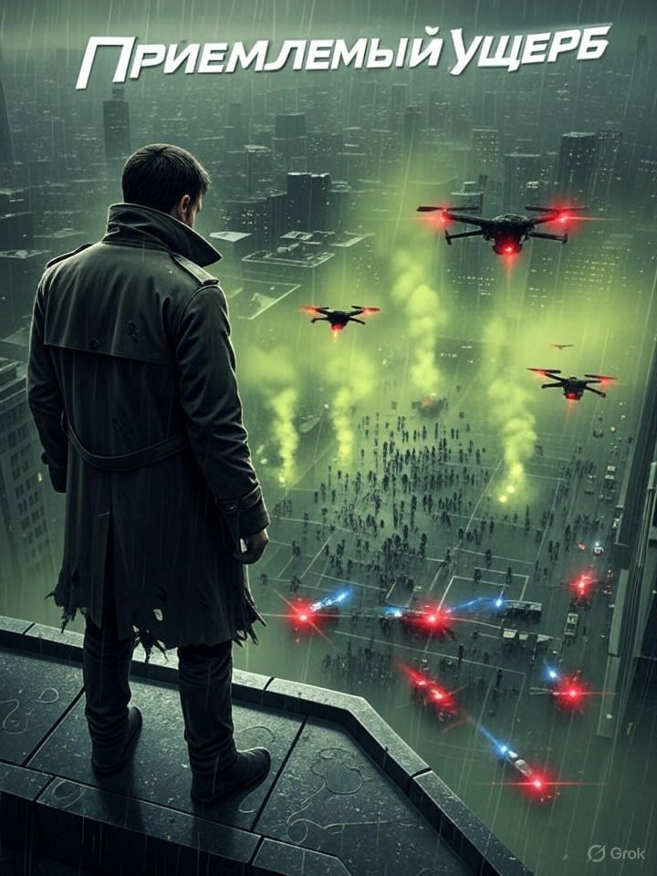

# Приемлемый ущерб

## Аннотация

Когда бывший военный и аналитик ATF раскрывают заговор с массовым применением психотропного оружия, им приходится выбирать между спасением тысяч жизней и сохранением собственной человечности. Какой будет цена "приемлемого ущерба" в мире, где главным полем боя стало человеческое сознание?

## Обложка

