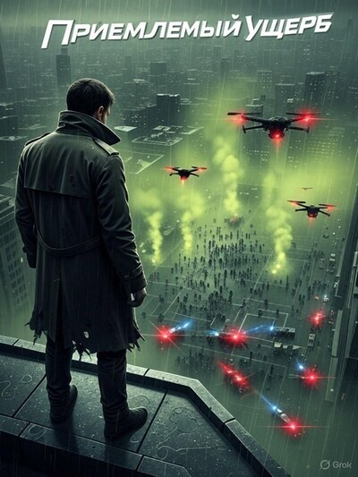

# Приемлемый ущерб

## Аннотация

Когда бывший военный и аналитик ATF раскрывают заговор с массовым применением психотропного оружия, им приходится выбирать между спасением тысяч жизней и сохранением собственной человечности. Какой будет цена "приемлемого ущерба" в мире, где главным полем боя стало человеческое сознание?

## Обложка

### Глава 1

Глава 1

Полковник Грант смотрел на неё через одностороннее стекло. В его взгляде смешивались профессиональное любопытство и лёгкое превосходство, которое он даже не считал нужным скрывать. Он работал с "особыми активами" — шпионами, перебежчиками, гениями с извращённой логикой. Хелен Рейнольдс, без сомнения, была самым ценным и самым опасным экземпляром в его коллекции. Он держал её на коротком поводке. Сомнений в этом у него не было.

Она сидела за белым столом в центре комнаты, чья казённая белизна напоминала скорее лабораторию, чем тюремную камеру. Никаких лишних предметов. Воздушные фильтры, постоянная температура. Её "аналитический аквариум", как в шутку называли это место техники. Для Гранта это был идеальный инкубатор. Он даже позволил ей доступ к изолированному терминалу — все логи проверялись ежечасно. Его цифровая крепость казалась неприступной. Место, где он мог изучать её гениальный, извращённый ум, не опасаясь заражения.

Он вошел. Пневмоприводы с шипением вогнали дверь в раму. Раздался глухой удар, отрезавший комнату от внешнего мира. Рейнольдс не обернулась. Она смотрела прямо перед собой, на белую стену, будто читала на ней невидимый текст.

— Хелен, — начал Грант, его голос был образцом спокойной власти. — У нас сеанс.

Она медленно повернула голову. Взгляд сфокусировался на нём — безразличный, неподвижный, будто он был не человеком, а набором данных на экране.

— Сеанс, полковник? Вы говорите как психотерапевт. А ведь всё наоборот. Это я анализирую вас. Вашу систему. Вашу… уязвимость.

Грант позволил себе снисходительную улыбку. Эта игра ему пока не наскучила.

— Я вас слушаю.

— Представьте, полковник, — её голос звучал ровно, академически. — Идеальный вектор атаки. Не военная база. Не правительственное здание. Слишком очевидно. Слишком шумно. Цель — малый город в "ржавом поясе". Миллфилд, Огайо, например. Символ той самой стабильности, которую вы так стараетесь защитить.

Грант слушал, его интерес нарастал. Её аналитика всегда была безупречной.

— Цель — не инфраструктура, — продолжала она, — а общественные устои. Невидимое оружие. Аэрозоль, который не создаёт эмоции, а лишь катализирует то, что уже есть. Ненависть к соседу, страх перед будущим, подавленную агрессию. Представьте толпу на городском празднике. В один момент они едят хот-доги, а в следующий — разрывают друг друга на части из-за неосторожного толчка.

Она говорила, и Грант видел это. В груди сдавило — знакомое чувство, как от сводки о провале операции. Но сквозь тревогу проступило и другое: холодный, острый азарт исследователя, увидевшего чудовищно красивую формулу. Он увидел улицы Миллфилда не как гипотезу, а как кадры из отчёта с места событий. Гениально. И чудовищно. Именно за это он и ценил её. Она видела угрозы там, где другие видели лишь статистику.

— Это мог бы сделать внутренний враг, — закончила она. — Не иностранная держава. Кто-то, кто знает ваши болевые точки. Кто-то, кто понимает, что главная война идёт не за территорию, а за сознание.

Он кивнул, обдумывая её слова. Она была права. Абсолютно права. Угроза реальна.

— Спасибо, Хелен. Очень… познавательно.

Грант вышел, не заметив, как её губы на долю секунды изогнулись в подобии улыбки. Дверь снова зашипела, отрезая его от неё. Он был полностью уверен, что только что провёл очередной успешный сеанс контроля над своим самым ценным активом.

Рейнольдс осталась одна. В наступившей тишине единственным звуком остался ровный, низкий гул системы вентиляции. Для неё он давно стал синонимом пустоты. Она подошла к терминалу, встроенному в стену. Приложила ладонь. Экран ожил, показывая стандартный интерфейс.

Она запустила рутинный скрипт обслуживания логов, но на последнем этапе ввела в поле комментария нестандартную команду — последовательность, которую она нашла в архивах системных обновлений шестимесячной давности. Для наблюдателя это выглядело как синтаксическая ошибка. На самом деле, эта команда использовала уязвимость в старом коде для открытия защищенного канала. На экране, в обход всех протоколов, появилось анонимное окно мессенджера.

"Фаза 1 завершена. Оценка эффективности положительная. Ожидайте дальнейших инструкций. Логик."

Она коснулась виртуальной клавиши Enter. Сообщение исчезло.

Экран погас. На несколько секунд Хелен Рейнольдс посмотрела на своё отражение в тёмном, гладком стекле. То же спокойное лицо. Тот же ровный изгиб губ. Она моргнула — медленно, почти неестественно — и отошла от стены.

Пыльная парковка у придорожной закусочной в Орегоне. Солнце клонилось к закату, окрашивая небо в грязно-оранжевые тона. Макс подогнал свою неприметную тёмно-серую "Тойоту". Из соседней машины, старенького минивэна, выбрались мужчина и женщина. Он открыл заднюю дверь. Оттуда, щурясь на свет, вышла Эмили. Бледная, худая, она смотрела так, словно разучилась моргать.

Мать бросилась к ней, сжимая в объятиях. Отец шагнул к Максу.

— Мы… боже… спасибо, — он протянул толстый белый конверт. Руки его дрожали. — Вот. Это… всё, что мы смогли собрать.

Мать, не отпуская дочь, посмотрела на Макса. В её глазах был не только страх за ребёнка, но и страх перед ним.

— Эмили… он… он не сделал тебе… ничего плохого?

Отец вздрогнул и бросил на жену укоризненный взгляд. Они говорили о "Пророке", но вопрос был направлен в Макса.

— Нет, — голос Макса был ровным. — Ей лучше поговорить с кем-то. Не с вами.

Он взял конверт, не глядя.

— Что нам теперь делать? — спросил отец.

— Забудьте мой номер, — сказал Макс. — Просто уезжайте.

Уже в машине, повернув ключ в зажигании, он мельком взглянул в зеркало заднего вида. Семья стояла, обнявшись, — маленький островок отчаянной близости посреди пыльной парковки. Он решил их проблему, но не принёс им мир. Просто сменил один страх на другой — тихий и холодный.

После "Элизиума" обычная слежка за неверными мужьями казалась пресной. Такие дела — выдёргивать людей из пасти "пророков" — были единственным, что ещё могло заставить кровь бежать быстрее.

Ночь. Номер в безымянном мотеле у шоссе. Запах дешёвого дезинфицирующего средства. Макс сидел на краю кровати, на которой лежала белая ткань. На ней — разобранный "Глок".

Он методично протирал каждую деталь промасленной ветошью. На затворной раме виднелась едва заметная царапина. Холодная сталь в руках, знакомый запах оружейного масла, точные, отточенные движения.

На стене фоном бубнил телевизор. Новости.

— …возвращаемся к шокирующим событиям в Миллфилде, штат Огайо. Официальные лица до сих пор не могут объяснить причины массовой истерии…

Макс замер, рука с затворной рамой застыла в движении.

На экране появились кадры, снятые камерой наружного наблюдения. Зернистое, чёрно-белое изображение. Люди не просто бежали в панике. Они двигались… неправильно. Рваные, хаотичные движения, полные животной, бесцельной агрессии. Мужчина бился головой о почтовый ящик. Две женщины раздирали друг другу лица ногтями. Это была не паника. Это был чистый, беспричинный психоз.

Запах оружейного масла вдруг показался едким, и к нему примешался фантомный, тошнотворный дух горелого пластика — запах из прошлого. В ушах, как тогда, зародился низкий, вибрирующий гул.

Он резко встал. Тело мгновенно похолодело, отказываясь подчиняться. Воздух в комнате будто загустел, и Макс сделал короткий, рваный вдох, силой заставляя легкие работать. Он вцепился пальцами в край стола, пережидая, пока комната перестанет плыть перед глазами.

Он заставил себя снова посмотреть на экран. На растерянного шерифа, говорящего о "беспричинной агрессии". Год. Целый год после "Элизиума" он ждал чего-то подобного. Не нового взрыва, не захвата заложников. А именно этого — тихого, расползающегося безумия в самом обычном месте. Теста. Полевых испытаний её разработок.

Рейнольдс.

Ладонь сама коснулась лица. Ледяная.

Она под замком. Военная разведка… эти ублюдки в костюмах, они думали, что могут её контролировать.

Они не клетку ей дали. Они дали ей лабораторию. Ресурсы целого, блядь, государства.

Он схватил со стула свою сумку, швырнул её на кровать. Начал сгребать в неё вещи. Он должен ехать. Прямо сейчас. ФБР будет искать наркотики или газ. Они не поймут, что воюют с идеей.

И в этот момент раздался короткий электронный звук.

Трель и потом скрежет.

Звук, настроенный только для одного зашифрованного канала. Только для одного контакта.

Он резко обернулся. Подошёл к столу, открыл крышку ноутбука.

Поверх карты города на экране появилось полупрозрачное окно чата. Отправитель: С.Ч.

Сообщение:

"Это она. Я нашла след."

Макс с силой захлопнул крышку ноутбука. Резкий хлопок пластика разорвал тишину комнаты.

### Глава 2

Глава 2

Первой жертвой стал засохший можжевельник. Сара Чен сделала одно-единственное, идеально точное движение крошечными воронёными ножницами. Высохшая веточка упала на поддон с сухим, едва слышным шорохом. Почти вздох облегчения. Порядок восстановлен. Хотя бы здесь, в этом горшке с капризным бонсаем, которому она отдавала последние крупицы своего терпения. За пределами этого клочка мёртвой, но упорядоченной природы царил хаос.

Полночь давно миновала. Офис ATF был пуст и тих, если не считать мерного гула серверов в соседнем помещении и тихого шёпота вентиляции.

На одном из четырёх мониторов висел официальный отчёт по инциденту в Миллфилде, штат Огайо. "…вероятное массовое отравление неустановленным веществом галлюциногенного типа". Чушь. Ложь. Или, что хуже, некомпетентность.

Сара его не читала. На двух других экранах были открыты терминалы. Её пальцы работали точно и экономно, вбивая последние строки скрипта в командную строку. Она не искала улики. Не в этот раз. Система была слепа к тому, что не укладывалось в её протоколы. Сара искала аномалии. Её скрипт сопоставлял сотни разрозненных официальных отчётов, открытых баз данных и утечек, ища несовпадения: компании-однодневки, регистрировавшие закупки безобидных химикатов, и логистические фирмы, арендовавшие для них склады, чьи маршруты странным образом сходились в одной точке перед инцидентом.

Она чувствовала себя взломщиком в собственном доме. Каждый запущенный запрос в обход стандартных процедур оставлял цифровой след, который мог уничтожить её карьеру. Но бездействие стоило бы дороже. Она уже заплатила эту цену однажды.

Она сжала челюсти так, что заболели зубы. Не снова. Никогда снова.

Эта ярость была холодной и острой, как игла. Она направила её всю в одну точку — на замерший курсор — и нажала Enter.

Система, которой она служила, была создана для реакции, а не для предвидения. Она ловила преступников по следам, которые те оставляли — гильзы, отпечатки пальцев, финансовые транзакции. Но что, если враг не оставлял следов? Что, если он действовал как вирус, используя существующую инфраструктуру, меняя не материю, а поведение?

Враг, которого она знала, Хелен Рейнольдс, была именно такой. Она не взрывала здания. Она взрывала сознание. В прошлый раз они остановили её чудом, заплатив кровью. А теперь доклады ФБР по Миллфилду твердили о "массовой истерии" и "заражённой воде". Они искали яд, токсин, наркотик. Они искали то, что можно найти. А Рейнольдс никогда не работала с очевидным. Сара знала, что та не травит людей. Она просто открывает запертые в них клетки. Выпускает то, что они так старательно прячут даже от самих себя.

Но как доказать? Официальные каналы были закрыты. Дело Рейнольдс лежало в архиве под грифом, который означал одно: "Не влезай, убьёт". Убьёт не пулей, а приказом об увольнении, чёрной меткой, которая поставит крест на её будущем. Точно так же, как это случилось с её отцом. Он тоже пытался сказать системе, что она слепа. И система выдавила его, как инородное тело.

Поэтому она здесь, ночью, в пустом офисе. Использует ресурсы ATF против воли ATF.

Скрипт завершил работу. На экране замерли несколько десятков строк. Белый шум. Закупка ацетона в Кентукки. Партия аэрозольных клапанов в Неваде. Аренда склада в пригороде Дейтона. Всё через разные, только что зарегистрированные Midwest General Supply, LLC. Любой другой аналитик закрыл бы файл через пять минут.

Для любого другого это был информационный шум. Сара видела в нём следы, оставленные хищником.

Пальцы вернулись к работе, короткими точными очередями вбивая команды. Запущен второй скрипт. Этот не искал данные. Он строил связи. Линии на экране начали ветвиться, сплетаясь в сеть. Тонкие аксоны тянулись от узла к узлу, образуя узор. Хаос обретал структуру. Все связи сходились к единому невидимому центру. И там, в его сердце, замерло название:

"Элизиум Холдингс".

Сара замерла, затаив дыхание. Этого не могло быть. Название, которое должно было быть похоронено в самых глубоких и пыльных архивах Пентагона. Корпоративная оболочка, которую Рейнольдс использовала в прошлый раз. Они уверяли её, что все активы заморожены, все счета аннулированы, структура ликвидирована.

Ложь.

Не последователи. Не имитаторы. Это была она. Рейнольдс.

Дверь кабинета открылась без стука.

Сара вздрогнула, резко оборачиваясь. Инстинкт заставил её палец метнуться к клавише, чтобы сбросить экраны, но было поздно. На пороге стоял заместитель директора Кавано. Он выглядел так, словно только что вернулся с тяжёлого ночного совещания — идеально скроенный костюм был слегка помят, а в усталых глазах карьериста застыла тревога. Его дорогой одеколон ударил в нос — чуждый запах в её мире.

Он не задавал вопросов. Его взгляд проскользнул по мониторам и зацепился за одно-единственное слово. За название в центре сети. Лицо Кавано, до этого уставше-нейтральное, окаменело. Он всё понял.

— Чен, — в его тихом голосе не было никаких интонаций, кроме одной — ледяной, не терпящей возражений власти. — Что, чёрт возьми, ты делаешь? Я думал, мы закрыли эту тему. Выключи это. Сейчас же.

— Сэр, это не охота на призраков, — слова полились из неё быстро, сбивчиво. Она ткнула пальцем в экран. — Это факты. Десятки закупок, логистика точь-в-точь как в прошлый раз, и всё сходится к…

— Мне плевать, к чему там всё сходится, Сара, — перебил он, даже не взглянув на её схемы. Он смотрел на неё. Как на проблему. — Дело "Элизиума" в архиве. Его курировала военная разведка. Они дали официальное заключение: угроза нейтрализована. Хелен Рейнольдс изолирована и сотрудничает с правительством. Конец истории.

— Но Миллфилд! — почти выкрикнула она. — Это их почерк, их… их грёбаная подпись!

— Миллфилд — это дело местных властей и ФБР. Не наше, — отрезал Кавано. Он сделал шаг в кабинет и понизил голос. — Ты хоть понимаешь, что будет, если ты начнёшь копать под военных? Они нас раздавят, Чен, и даже не заметят. У меня был очень неприятный разговор. В очень высоком кабинете. Мне недвусмысленно намекнули, что интерес ATF к закрытым делам контрразведки будет расценён как… недружественный акт. У меня приказ сверху: не лезть.

Он врал. Частично. Про разговор, скорее всего, правда. Но его тон говорил о другом. Это была не просто лояльность приказу. Он боялся. Не за агентство, а за себя. Это читалось в том, как напряглись его плечи под идеальным кроем пиджака.

— Но если я права… — начала она, но её голос дрогнул.

— Тогда тем более не лезь! — Кавано впервые повысил голос, и в нём появились резкие, чеканные ноты. — Ты ставишь под удар всё агентство из-за своей… одержимости! Из-за призраков! Я официально запрещаю тебе использовать ресурсы ATF для этого расследования. Ты меня поняла? Ещё один несанкционированный запрос в систему — и я отстраняю тебя. Это не просьба, агент Чен. Это приказ.

Он развернулся и вышел, тихо прикрыв за собой дверь. Оглушительная тишина, оставшаяся после него, давила сильнее любого крика.

Стена. Он возвёл перед ней глухую, непрошибаемую стену из бюрократии и страха.

Опустошение длилось недолго. Его вытеснил холодный, сфокусированный гнев — тот, что не кричит, а действует. Слова Кавано — "недружественный акт" — ударили по больному, воскресив в памяти лицо отца. Того самого молодого гения со снимка на её столе, который улыбался, ещё не зная, что система, которой он пытался помочь, его же и сожрёт за точно такое же "любопытство". Его сломали.

Она сжала кулаки так, что ногти впились в ладони. Нет. Не с ней. Она не позволит им это сделать. Если система не хочет видеть правду, она найдёт того, кто готов задать ей трёпку, чтобы она прозрела.

Она без колебаний положила руку на мышь и навела курсор на иконку зашифрованного мессенджера. Контактная книга была почти пуста. Лишь несколько псевдонимов. Она выбрала тот, который не использовала почти год.

М. Х.

Она набрала короткую фразу, каждое слово — как удар молотом по наковальне.

"Это она. Я нашла след."

Она смотрела на сообщение несколько секунд. Это была черта. Шаг за неё — и пути назад не будет. Она станет таким же изгоем, как и он. Она отправит человека, которого едва не сломала эта война, обратно в пекло. Но выбора не было. Кавано и ему подобные не оставили ей выбора.

Она нажала "Отправить".

Сразу после этого инстинкт заставил её запустить программу-"чистильщик", скрипт, который должен был стереть все следы её ночной активности. Медленно поползла синяя полоска прогресса. Программа сообщила о завершении работы. Никаких ошибок. Но когда Сара вручную проверила системный лог доступа, она увидела свою последнюю запись. А под ней — еще одну, с временной меткой на долю секунды позже: READ: user_SC_activity. Client: [ACCESS_DENIED].

Кто-то прочел ее действия в тот же момент, как она их совершила. И этот кто-то имел уровень доступа, скрывающий даже его имя.

Ее первым позывом было выдернуть сетевой кабель. Она даже дернулась к системному блоку, но тут же замерла. Бесполезно. Все ее запросы уже прошли через центральные серверы. Следы остались там, а не в этой коробке под столом. Она не просто постучала в дверь. Она оставила на ней свою визитную карточку.

Её кабинет перестал быть безопасным местом. Он стал полем боя.

### Глава 3

Глава 3

Сороковая по счёту заправка растворилась в зеркале заднего вида. Штат Огайо встретил Макса не пасторальными пейзажами, а низким серым небом, которое, казалось, лежало прямо на крыше его Тойоты. Почти двое суток в пути с ночлегом в мотеле. Тело ломило, Макс держался на злости и кофеине. Потрёпанная Тойота гудела, как усталый зверь, но Макс уже не слышал её. Он слышал тишину, которая ждала его впереди.

Миллфилд. Табличка на въезде была новой, ярко-синей, с нарисованным колосом пшеницы. "Сердце урожая Огайо". Кривая усмешка тронула губы Макса. Сердце урожая. Теперь здесь собирали только страх.

Въезжая на главную улицу, он сразу это почувствовал. Не тишину — мирную, расслабленную, какая бывает в таких городках. А её изнанку. Пустоту, из которой вырвали все звуки: детский смех, лай собак, даже шум проезжающей машины. Улицы были пустынны, но не от безлюдья, а от страха. Занавески в окнах двухэтажных домов висели неподвижно, но затылок сверлило ощущение чужих взглядов.

На столбах, рядом с выцветшими объявлениями о школьном концерте, висели новые, напечатанные на принтере листки. Пропала собака. Пропал кот. Пропал ещё один кот. Даты на всех были одинаковые. День, когда сердце урожая перестало биться.

Он припарковал свою Тойоту у аптеки с запертой дверью и пошёл пешком. Воздух был влажный, плотный, пах мокрым асфальтом и чем-то ещё. Неприятным. Сладковатым, как гниющие фрукты, оставленные на солнце. Он прошёл мимо двух соседей, говоривших через низкий штакетник. Когда он поравнялся с ними, их голоса оборвались. Два старика замерли, провожая его спину тяжёлыми взглядами.

Закусочная "У Пэтти". Согласно новостям, эпицентр. Макс толкнул стеклянную дверь с потрескавшейся наклейкой "Открыто". Колокольчик над дверью издал короткий, сиротливый звон, тут же поглощённый тишиной.

Запах ударил первым. Резкая волна хлорки, отчаянно пытавшаяся перебить въевшийся дух прогорклого масла и чего-то ещё, металлического. Помещение было маленьким, отчаянно чистым. Линолеум на полу протёрт до белёсых пятен, красные виниловые диваны у стен потрескались, обнажая желтоватый поролон.

За стойкой двигались два человека: пожилая женщина с лицом, похожим на печёное яблоко, и молчаливый парень лет двадцати. Он двигался медленно, будто во сне, протирая один и тот же стакан тряпкой, не замечая, что тот давно чист.

Макс сел за столик в углу. Отсюда просматривался и вход, и окно на кухню. Спиной к двери не садиться. Найти два пути отхода. Его путь был один — та же дверь, в которую он вошёл. Хреново.

Женщина подошла, не глядя ему в глаза. Её взгляд скользил по столу, по солонке, куда угодно, не задерживась.

— Кофе, — сказал он. Голос прозвучал хрипло после долгого молчания.

Она кивнула и ушла. Единственным звуком в помещении было низкое, натужное гудение старого холодильника с напитками. В углу сидел ещё один посетитель — мужчина в рабочей куртке, уставившийся в свою тарелку с нетронутой яичницей.

Тишина была неправильной. В ней не было покоя. Это была тишина класса, в котором сидит ученик с пистолетом в рюкзаке. Каждый шорох, каждый скрип стула заставлял людей вздрагивать.

Женщина принесла кофе. Чёрный, как нефть. Макс сделал глоток. Жидкий, горький. Он не почувствовал вкуса. Он чувствовал атмосферу.

Мужчина в углу неловко двинулся. Вилка соскользнула с края тарелки и с оглушительным звоном ударилась о ножку стола. Дзинь.

В ватной тишине этот резкий металлический звон заставил всех вздрогнуть.

Женщина замерла. Парень у стойки выронил стакан, который он так долго протирал. К счастью, тот упал на резиновый коврик. Мужчина, уронивший вилку, съёжился, словно его ударили, и медленно, с опаской, начал наклоняться, чтобы её поднять.

Макс смотрел на них, и разрозненные детали соединились в одну картину. Это не было горе. Горе объединяет, заставляет людей говорить, плакать, обниматься. А это — разъединяло. Химический растворитель для социальных связей.

Почерк Рейнольдс. Только теперь он стал тоньше, изящнее.

Это не горе. Это взведённый курок.

Он оставил на столе несколько долларов и вышел, не допив кофе. Сладковатый запах гнили на улице показался ему теперь знакомым.

Карта местности, которую он загрузил ещё в мотеле, была простой. Миллфилд лежал в небольшой низине, окружённый полями и пологими холмами. Согласно сводке погоды, в день инцидента дул слабый северо-западный ветер. Значит, любой неуязвимый наблюдатель должен был находиться на возвышенности к западу от города. Там была всего одна ферма.

Тойота протестующе скрипнула, сворачивая на грунтовку. Ферма выглядела так, словно пережила войну и проиграла. Облупившаяся краска на доме, ржавый остов трактора у сарая, покосившийся забор. Но на крыльце сидел старик с ружьём на коленях.

Макс остановил машину на приличном расстоянии и вышел. Он не поднимал рук, не делал резких движений. Просто стоял под моросящим дождём, позволяя старику себя рассмотреть.

— Сгинь отсюда, если ты из правительства, — проскрипел старик. Голос был как ржавый замок.

— Я не из правительства, — сказал Макс. — Я хочу услышать, что вы видели.

Старик прищурился. Его глаза, выцветшие, как старые джинсы, изучали Макса.

— Они… эти в костюмах… сказали, что это болотный газ, — сплюнул он на мокрую землю.

— А ещё просили молчать, чтобы не вредить репутации мэра, — закончил за него Макс ровным голосом.

Старик замер, и ствол ружья медленно пополз вниз.

— Откуда ты знаешь?

— Я не с ними. Я за ними.

— Всю жизнь тут живу, такого газа не видел, — продолжил старик, уже тише. — Я им говорю — оно жужжало. Как… как злой улей. А они мне про погоду…

— Сколько их было? — спросил Макс, медленно подходя ближе.

— Кого? Тех в костюмах? Двое. Или… ты про… про насекомых? — Старик, Амос, как значилось на почтовом ящике, нахмурился, пытаясь вспомнить. — Не сосчитать. Облако. Чёрное. Шло низко над деревьями, прямо на город. А запах…

— Запах?

— Как будто проводка горит. Такой едкий, металлический запах. И… и ещё что-то. Сладковатое. Как… как гнилые персики. — Амос с ненавистью посмотрел в сторону города. — Они сказали, я это выдумал. Сказали, лучше молчать, а то… ну, выборы на носу. Чтоб не вредил репутации мэра. Ублюдки.

— Политика? — Макс задал вопрос, уже зная ответ.

— А что ж ещё? Конкуренты нашего мэра хотят сорвать ежегодный фестиваль. Каждый год какая-то грязь. Но такое… такое в первый раз.

Макс кивнул. Политика. Ежегодный фестиваль. Идеальный ложный след. Простой, понятный, приземлённый. Рейнольдс бросила кость для местной полиции и ФБР. Но он не собака, чтобы за ней гоняться. Он узнал почерк.

— Они вернутся? — спросил Амос. В его голосе прорезался страх.

— Да, — ответил Макс. Он не знал этого наверняка, но знал другое. Такие операции не оставляют свидетелей. — Держите двери на замке.

Он сидел в своей Тойоте на парковке заброшенной заправки с видом на ферму Амоса. Стемнело. Медленно ел сухое, безвкусное печенье, запивая тёплой водой из пластиковой бутылки. Механический процесс. Топливо для тела. В окне дома старика горел одинокий жёлтый свет. В городе внизу не горело почти ничего.

Вкус печенья, похожий на прессованную пыль, внезапно ударил по нервам.

Ирак. Ночь. Жара такая, что воздух можно пить. Он сидит, прислонившись к стене из глиняных кирпичей, и смотрит на звёзды, яркие и безразличные. Рядом сидит сержант Кларк, рыжий парень из Техаса, и с методичной точностью сапёра делит ножом энергетический батончик на две равные части. Их единственная еда на ближайшие двенадцать часов. Кларк протягивает ему половину.

— Держи, Хартман. Если нас сегодня грохнут, хоть помрём не голодными, — шутит он. Его зубы белеют в темноте.

Макс берёт батончик. Он липкий и приторно-сладкий. Они едят молча. И в этом молчании, в этом общем куске сахара и химии, больше товарищества, чем в любых словах. Они — одна система. Один организм.

Кларка убили через три дня. Пуля снайпера. Прямо в глаз.

Макс моргнул. В руке он сжимал надкушенное печенье. Кларка больше нет. Товарищества больше нет.

Остался только вкус пепла.

Он завёл двигатель. Передышка окончена. Но вместо того чтобы уехать, он съехал с парковки и припарковал машину на заросшей просёлочной дороге, в тени старых дубов. Отсюда ферма была как на ладони. Он не знал, почему остался. Протокол этого не требовал. Но инстинкт, отточенный годами в полях, где ошибка стоила жизни, шептал, что картина неполная.

Он ждал почти два часа. Тишина. И вдруг что-то изменилось. Не звук. Не движение. Просто воздух стал другим. Натянулся, как струна.

К дому Амоса подъехал фургон. Тёмный, без номеров, без опознавательных знаков. Он двигался с выключенными фарами, почти бесшумно. Остановился за сараем. Двери скользнули в сторону. Из фургона вышли двое.

Макс поднял бинокль.

Они двигались не как грабители. Пригнувшись, от тени к тени, идеально используя мёртвые зоны. Тёмная тактическая одежда, разгрузки, в руках — пистолеты с глушителями. Не "люди из правительства". Не политические наёмники.

Команда зачистки.

Он не полез за телефоном. Звонить в 911 — всё равно что запустить сигнальную ракету. Он потянулся под сиденье и достал нож. Выскользнул из машины, растворяясь в ночной темноте.

Переключатель в его голове щёлкнул. Рефлексия закончилась. Началась работа.

Они шли уверенно. Слишком уверенно. Периметр не проверяли. Считали, что цель — старый фермер в доме. Ошибка.

Макс зашёл с тыла, через огород Амоса. Земля была мягкой после дождя. Его ботинки не издавали ни звука. Он двигался вдоль забора, оставаясь в тени сарая. У стены стояли садовые инструменты. Он взял в руки тяжёлую совковую лопату. Баланс был неплохим. Холодный металл привычно лёг в ладонь.

Первый оперативник возился с замком на задней двери. Его напарник стоял на стрёме, осматривая двор. Он смотрел не туда.

Макс вышел из тени. Два быстрых шага, на ходу нанося удар ребром совковой лопаты точно под колено оперативника. Оперативник издал сдавленный хрип и рухнул на колени. Макс не дал ему опомниться. Второй удар, короткий, как укол, рукояткой в висок. Тело обмякло и беззвучно завалилось набок.

Второй, услышав глухой звук падения, резко обернулся. Его пистолет с глушителем метнулась в сторону дома. Поздно. Макс уже был в тени сарая. Оперативник сделал несколько шагов вперёд, сканируя темноту.

Макс подобрал с земли камень и швырнул его в противоположный угол двора. Камень ударился о металлическую бочку. Дзень.

Оперативник инстинктивно развернулся на звук. Этой секунды хватило.

Макс рванулся вперёд. Одной рукой он перехватил ствол оружия, уводя его в сторону. Другой рукой, сложенными пальцами, нанёс короткий, точный удар в кадык. Оперативник закашлялся, теряя равновесие. Макс развернул его, заходя за спину, и провёл удушающий. Он считал удары сердца. На десятом тело в его руках обмякло.

Он опустил второго на землю.

Всё заняло меньше пятнадцати секунд. В доме Амоса всё ещё горел свет. Старик ничего не слышал.

Макс стянул с лица первого оперативника балаклаву. Незнакомое лицо. Жёсткое, злое. На рукаве тактической куртки он нащупал нашивку. Пальцы узнали рельефный рисунок. Он сорвал её и поднёс к глазам, вглядываясь в лунном свете.

На тёмном фоне была вышита белая, стилизованная буква "К" со стрелой, выходящей из неё.

Kratos Solutions.

Сукины дети. Прошлое вернулось не просто как воспоминание. Оно пришло, чтобы убивать.

Он опустился на колено и провёл быстрый, методичный обыск. Пистолеты — Глок, как и у него. Он забрал их и все запасные магазины. В подсумках на поясе — две светошумовые гранаты М84, компактная аптечка. Ценные находки. Макс забрал всё.

Резкий хлопок по щеке вернул в сознание второго оперативника. Не давая ему опомниться, Макс прижал его к стене сарая. Лезвие ножа холодом коснулось горла.

— Частота. Быстро.

Оперативник смотрел на него с холодной, профессиональной ненавистью. Макс сильнее надавил ножом, до первой капли крови. Тот прохрипел несколько цифр.

Макс вырубил его снова, коротким ударом. Он затащил их в сарай и завалил дверь старой бороной. Через пару часов они очнутся, но этого времени ему хватит.

Он вернулся к рации, ввёл частоту. Канал был пуст.

Макс бесшумно скользнул к фургону. Два быстрых, глубоких прокола в боковинах задних колёс. А уже отъезжая, он заставил старый двигатель захлебнуться топливом. Тишину разорвал громкий, рваный хлопок, похожий на выстрел. Макс не оглядывался. Старик был предупреждён, а враг — обездвижен.

Через минуту щелчком ожила рация. А потом раздался голос.

Искажённый. Пропущенный через вокодер. Безэмоциональный, как голос робота.

— Группа Дельта, статус? Новый приоритет — химик. Зачистка сегодня. Повторяю, приоритет — химик, не старик.

Макс замер. Голос из рации, искажённый, безэмоциональный, отпечатался в мозгу. Новый приоритет — химик. Не старик. Значит, их целью был именно Амос, свидетель. А теперь… теперь всё изменилось. Амос стал просто помехой на пути к новой цели — химику. Тому, кто создал это дерьмо. Он здесь. Рядом. И Kratos Solutions только что приказали его убрать.

### Глава 4

Глава 4

Стопки распечаток, юридических справочников и технических руководств громоздились на полу квартиры Сары, готовые обрушиться от одного неверного шага. Между ними оставались лишь узкие проходы. На стенах висели пробковые доски, истыканные кнопками и соединённые красными нитями, — паутина версий и кладбище тупиковых гипотез. В центре всего этого упорядоченного хаоса стоял стол с тремя мониторами и открытым корпусом ноутбука, а клубок проводов расползался по полу, демонстративно выдернутый из сетевых розеток.

Это был её аналитический улей, её крепость и её клетка.

Это был её изолированный от мира пузырь. Здесь протоколы ATF не действовали. Здесь не было Кавано с его карьеристской трусостью. Здесь её не мог достать тот, кто следил за ней из глубин системных логов, во всяком случае, она на это надеялась.

Перед тем как отключиться от сети, она успела сделать ещё кое-что: запустить "сторожевого пса". Крошечная программа-анализатор, которая не лезла в чужие сети, а лишь сканировала метаданные исходящего трафика с определённых серверов. Большую часть времени она была бесполезна, но иногда, если кто-то допускал ошибку, могла засечь всплеск активности на нужном направлении.

Единственным окном в реальный мир был одноразовый зашифрованный телефон.

Он завибрировал.

Сообщение было коротким, лишённым всякой вежливости. Таким мог быть только отчёт Макса.

"ЧВК Kratos Solutions. Цель — химик. Зачищают следы."

Сара перечитала слова трижды. Каждое было ключом. Kratos Solutions — предсказуемо. Рейнольдс использовала тогда Ares Security. Ares расформировали, а бойцы перешли в Kratos — ещё более безжалостный, эффективный монстр с полным отсутствием морали. "Зачищают следы" — логично. Но "химик"... это меняло всё. Это превращало безликую организацию в уязвимую человеческую цель.

Она подошла к большой белой доске, исписанной схемами корпоративных связей "Элизиум Холдингс". Взяла губку и без сожаления стёрла недели работы. Компании, счета, директора — всё это было лишь дымовой завесой. Фасадом. Рейнольдс играла в другую игру.

Вернувшись к столу, она вставила в ноутбук флешку с криптографическими ключами. На экране ожил не проводник с папками, а защищённый интерфейс доступа к архивам ATF — её прощальный подарок себе перед уходом в подполье. Её арсенал.

Её пальцы двигались по клавиатуре с выверенной экономией движений, отстукивая сухую дробь команд. Она не искала имя. Она искала паттерн. Сначала — закрытые кадровые архивы, к которым у неё остался теневой доступ. Она запустила скрипт, который искал химиков-органиков, уволенных за последние пять лет из трёх ведущих био-корпораций по статьям "нестабильность" или "нарушение протокола".

Через минуту система выдала двенадцать имён. Слишком много.

Второй шаг — финансовый след. Сара переключилась на другую базу, анализирующую крупные транзакции с наличными. Она скормила ей список из двенадцати имён, добавив фильтр по географии — "ржавый пояс", последние шесть месяцев.

Воронка сузилась до двух кандидатов.

Финальный аккорд — база недвижимости. Она проверила обоих по покупкам домов в сельской местности, вдали от любопытных глаз. И здесь система выдала одно-единственное совпадение. Есть.

Пока она работала, её взгляд скользнул к бонсаю. Одна хвоинка пожелтела. Рука сама протянулась и аккуратно отщипнула её. Маленький акт контроля в мире абсолютного хаоса.

Компьютер пискнул. Один раз, коротко и требовательно. Сара замерла, задержав дыхание. Воздух в комнате вдруг стал плотным. На чёрном экране командной строки мигала одна-единственная строчка, подсвеченная зелёным.

РЕЗУЛЬТАТ НАЙДЕН: 1. ВЕРОЯТНОСТЬ СОВПАДЕНИЯ: 94.2%

Она бросилась к столу. На экране появилось досье. Фотография встревоженного, сутулого мужчины лет пятидесяти, с редкими волосами и выражением вечной паники на лице. Он был похож на человека, который извиняется даже перед неодушевлёнными предметами, если случайно их заденет.

Имя: Доктор Леонард Браун.

Специализация: Органическая химия, нейрофармакология.

Статус: Гений. Автор семнадцати патентов в области модуляции синаптических связей.

Примечание: Уволен из корпорации "VitaMolecular Tech" полгода назад. Официальная причина: "эмоциональная нестабильность, параноидальные тенденции, несоблюдение протоколов безопасности". Неофициальная: украл корпоративные исследования и исчез.

Последний пункт заставил её замереть. Он не просто ушёл. Он сбежал. И он что-то унёс с собой.

Дальше — больше. Главное совпадение. Три месяца назад Леонард Браун, используя наличные и подставное лицо, купил уединённый фермерский дом с большим участком земли. В сельской местности штата Мичиган. В двух часах езды от Миллфилда.

Это был он. Их химик. Имя на экране превратило безликую организацию в конкретную, уязвимую цель.

Сара схватила телефон. Сначала — координаты, как самый срочный пакет данных. Затем она запаковала файл с досье в зашифрованный контейнер, добавив самоуничтожение сообщения через десять минут после прочтения. Её пальцы летали по экрану, набирая сопроводительный текст, пытаясь вложить в него всю свою тревогу: "Он трус, Макс. Они его не оставят в живых. Будь осторожен".

Отправив сообщение, она посмотрела на фотографию Брауна. На его испуганные глаза. Она только что навела на этого человека две силы, одинаково безжалостные. И не знала, какая из них окажется быстрее.

Фары выхватывали из темноты бесконечную серую ленту шоссе. Двигатель Тойоты натужно ревел, пожирая милю за милей. Макс вёл машину на автомате, его сознание было где-то далеко, на ферме в Мичигане. На экране телефона светилась карта, услужливо показывая маршрут.

Телефон завибрировал в держателе на приборной панели. Имя "С.Ч." на экране. Он включил громкую связь.

— Координаты получил, — сказал Макс, его голос был ровным, лишённым эмоций. — Буду через полтора часа. Вхожу тихо, забираю его, уходим.

— Нет, — голос Сары в динамике был резким, прерывистым из-за медленного 3G. — Слишком прямолинейно. Рейнольдс знает, что ты... она знает тебя. Она может ждать именно этого.

— Ждать чего? — Макс нахмурился. — Что я спасу парня, которому она хочет пустить пулю в лоб? Бред. Зачем ей это?

— Нет! Она будет ждать, что ты пойдёшь напролом! Что ты кинешься спасать его, как тогда, в Лоуэлле. Это может быть ловушка, Макс. Дом может быть заминирован. Или там уже сидит снайпер. Наблюдай сначала. Оцени обстановку. Не лезь в...

— У нас нет времени на "оцени обстановку"! — перебил он, повысив голос. В машине стало тесно от его раздражения. — Другая группа Kratos Solutions уже может быть там! Каждая минута, что я сижу в кустах, это их фора!

— Я проверяю их эфир. Пока... тихо, — в её голосе прорезались умоляющие нотки. — Послушай, я не говорю отступать. Я говорю — будь умнее. Она играет в шахматы, а ты хочешь перевернуть доску. В этот раз так не сработает. Пожалуйста.

Наступила долгая пауза. Было слышно только шуршание шин по асфальту и тихое посвистывание ветра. Макс смотрел на дорогу, но видел другое. Видел лицо Сары в Лоуэлле. Слышал её голос, вытащивший его из ада. Она была права тогда. И, скорее всего, права сейчас.

Он ненавидел всё это. Ненавидел эту сложность, эту паутину интриг. Ему хотелось простой, понятной цели.

— Хорошо, — выдохнул он. Звук собственного голоса удивил его. Он был почти спокойным. — Сначала разведка. Но если я увижу их машины у ворот, я иду на штурм. Договорились?

— Договорились, — в её голосе послышалось явное облегчение. — Макс... Спасибо. Я буду на связи.

Он отключился, не прощаясь. И не сбавил скорость. Он согласился на её условия, но его тело, его инстинкты кричали об обратном. Он чувствовал, как драгоценные секунды утекают сквозь пальцы.

Полковник Грант терпеть не мог доклады о провалах. Они были свидетельством потери контроля, а контроль был его религией. Он перечитал зашифрованный отчёт от куратора Kratos Solutions в третий раз. Слова на экране были выверены и безэмоциональны, но за ними сквозила ярость от унизительного поражения.

"Столкновение с высокоорганизованной враждебной ячейкой. Применена тактика контрзасады. Вероятный руководитель — агент Макс Хартман. Предположительная цель — захват актива 'Химик' для конкурирующей структуры".

Грант откинулся в кресле. Его кабинет напоминал скорее серверную, чем место для человека: холодный свет, гул вентиляции и ни одной личной вещи на поверхностях. Единственным живым элементом был огромный экран на стене, на котором транслировалось изображение из "аналитического аквариума" Хелен Рейнольдс. Она сидела за столом, неподвижно глядя на шахматную доску. Контролёр, наблюдающий за переменной в изолированной системе.

Он знал, что отчёт — ложь. "Враждебная ячейка" — это один Хартман. Грант знал его досье. Списанный армейский рейнджер, сломленный, но опасный, как осколок стекла. Не шпион. Просто пёс, которого спустили с цепи.

Но ложь была полезной.

Грант думал не о провале группы зачистки. Он думал о том, что если бы Хартман действительно добрался до химика... если бы он или кто-то ещё захватил технологию Рейнольдс, это стало бы катастрофой. Неконтролируемое психотропное оружие в руках террористов или, что хуже, корпоративных конкурентов — это был его ночной кошмар. Хелен Рейнольдс, при всей её чудовищности, была контролируемой переменной. По крайней мере, он так считал.

Он активировал комлинк, защищённую линию прямой связи с её "аквариумом".

— Логик, — сказал он, используя её кодовое имя. Голос его был ровным, без тени эмоций. — Отчёт о попытке перехвата актива получен. Ваш запрос на расширение протоколов безопасности актива одобрен. Вы получаете прямой оперативный контроль над второй тактической группой Kratos Solutions. Не допустите повторения.

На экране лицо Хелен Рейнольдс оставалось бесстрастным. Но Грант заметил это. Уголок её губ на долю секунды напрягся, словно сдерживая улыбку. Она получила то, что хотела. Провал оперативников не ослабил её, а, наоборот, развязал ей руки. Хартман, пытаясь помешать ей, лишь дал ей больше власти.

Грант отключил связь. Он смотрел на её неподвижную фигуру.

Переменная была под контролем. Система работала.

Так он считал.

Безжизненный белый свет люминесцентных ламп заливал асфальт у круглосуточной заправки на границе Огайо и Мичигана. Макс вставил пистолет в бак и прислушался к тишине. Гул холодильников из магазина и редкий шелест проезжающей мимо фуры лишь подчёркивали ночную пустоту.

Внутри заправки пахло дешёвым пластиком и застарелым фритюром. Не обращая внимания на сонного кассира, уткнувшегося в телефон, Макс налил в бумажный стакан самый крепкий чёрный кофе из термоса. Жидкость пахла жжёной кислотой. Расплатившись наличными, он вышел обратно в холодную ночную пустоту.

Холодный воздух ударил в лицо. Макс не сел в машину. Это был его ритуал. Он стоял, держа обжигающий стакан, и смотрел, как тонкая струйка пара поднимается от тёмной поверхности, извиваясь в неподвижном воздухе, и медленно тает. Просто наблюдать. Просто ждать, пока кофе остынет.

Он поймал своё отражение в грязном стекле витрины. Не герой, не спаситель. Просто измотанный человек с глубокими тенями под глазами. Лицо незнакомца, которого он видел каждое утро в зеркале. "И снова всё то же самое", — пронзила короткая мысль. Тот же бег по кругу. Та же война, у которой нет конца.

Телефон в кармане завибрировал.

Он поднёс его к уху. Это была Сара. Её голос был другим. Ни аналитического спокойствия, ни умоляющих ноток. Только металл.

— Макс, они знают!

— Что знают? — Он всё ещё смотрел на пар, поднимающийся от стакана.

— Всё! Мой "сторожевой пёс" только что сработал. Всплеск активности. Короткий зашифрованный пакет данных с сервера, который я пометила как "Грант", на узел связи, принадлежащий Kratos Solutions. Я не могу прочесть сообщение, но вижу его размер и маршрут. Слишком маленький для отчёта. Идеальный для набора координат. Они передали им местоположение твоего химика. Ближайшая база Kratos всего в тридцати милях от цели!

Слова Сары ударили наотмашь. Мир сузился до двух цифр на навигаторе и её голоса в телефоне.

— Сколько у меня времени?

— Вот в этом и проблема! Расчётное время их прибытия — двадцать минут, Макс. Двадцать!

Он бросил взгляд на навигатор своего телефона. Яркие, безжалостные цифры светились в темноте:

Прибытие через 35 минут.

Пятнадцать минут. Целая вечность.

Он не ответил. Бумажный стакан с остывшим кофе выскользнул из его пальцев и шлёпнулся на асфальт. Тёмное пятно мгновенно расползлось по серому бетону, как клякса на приговоре.

Макс уже был в машине. Рёв старого мотора ударил по ушам, грубый и яростный, раскалывая ночную тишину. Тойота сорвалась с места, оставляя за собой визг шин и тонкий запах палёной резины.

Гонка началась. И он уже проигрывал.

### Глава 5

Глава 5

Доктор Леонард Браун не паковал вещи — он спасал данные. Его руки дрожали, когда он пытался защёлкнуть замок старого кожаного чемодана. Пальцы, привыкшие к точности микропипетки, не могли справиться с грубым металлом. Внутри, завёрнутые в грязные футболки, лежали не рубашки, а плоские, холодные прямоугольники жёстких дисков, исписанные мелким почерком блокноты и три герметично запечатанные колбы с мутной жидкостью. Его интеллектуальное наследие, ставшее его же проклятием.

Комната вокруг него была отражением этого хаоса. На полу валялись стопки книг по нейробиологии, перемешанные с пустыми коробками из-под пиццы и бутылками из-под воды. На стенах висели спутниковые снимки его же дома с пометками о "слепых зонах". Единственным островком маниакального порядка был рабочий стол: несколько мониторов светились сложными трёхмерными моделями молекул, а рядом, совсем неуместно, стоял верстак с примитивным набором химического оборудования.

— Энтропия… — бормотал он себе под нос, раскачиваясь взад-вперёд. — Система всегда стремится к хаосу… нужно лишь… задать правильный вектор…

Он говорил о молекулах. Он говорил о людях. Он говорил о себе.

Тишину, до этого абсолютную, вдруг пронзил короткий, тревожный крик совы. Он вздрогнул и замер, прислушиваясь. Что-то изменилось. А затем — резкий, сухой шум крыльев, словно крупная птица сорвалась с ветки прямо над домом. Тишина, вернувшаяся после этого, казалась ещё более глубокой и зловещей.

Браун ощутил, как внутри всё стянулось в тугой, холодный узел. Медленно, словно двигаясь под водой, он подошёл к окну и выглянул сквозь щель в жалюзи.

Сначала он ничего не увидел. Лишь знакомый пейзаж: тёмные силуэты деревьев, асфальт подъездной дороги, тускло поблёскивающий в свете луны. А потом он заметил движение. Не людей. Просто тени. Две тёмные фигуры, скользящие вдоль забора с неестественной, хищной плавностью. Они двигались бесшумно. Они уже были здесь.

В ядовито-зелёном монохроме ПНВ мир для "Ворона" сузился до фермерского дома. Реальность, лишённая лиц и деталей, превратилась в набор плоских, фосфоресцирующих силуэтов — мир без людей, состоящий из одних тепловых сигнатур. Мир, в котором легко убивать. Он видел одну из них внутри. "Актив" метался из комнаты в комнату.

"Актив нервничает. Хорошо", — констатировал "Ворон". Мысль была плоской, как изображение в окуляре. Нервный актив совершает ошибки.

В его наушнике раздался сухой щелчок. Это был сигнал от "Ястреба", снайпера, занявшего позицию у старого дуба. Позиция готова. "Ворон" не ответил. Они общались не словами, а тишиной. Отсутствие возражений означало "принято".

Он поднял левую руку, растопырив пальцы, затем сжал их в кулак. Универсальный жест. "Гриф" и "Сокол", две безликие тени рядом с ним, тут же отделились от группы.

Ни единого слова, ни одного лишнего движения. Это была механика, отлаженная на десятках таких операций. Безжалостный часовой механизм корпоративного насилия.

"Ворон" проверил свой HK416. Бесшумно дослал патрон в патронник. Он поднял три пальца, начиная беззвучный обратный отсчёт до штурма. Три… Два…

В этот момент тишина лопнула от рёва мотора. Он начался как низкий гул, который "Ворон" сперва принял за проезжающий по дальнему шоссе грузовик. Но гул не удалялся. Он нарастал, превращаясь в яростный, клокочущий рёв. Рёв старого мотора, работающего на пределе.

Рёв, которого здесь быть не должно.

Макс не видел, куда едет. Он чувствовал дорогу через руль, через вибрацию кузова своей Тойоты. Последние пять миль он мчался с выключенными фарами, ориентируясь по памяти и слабому лунному свету. Пятнадцать минут. Сара сказала, что они опережают его на пятнадцать минут. В его мире это была вечность. Тихий штурм уже не был вариантом. Он опоздал. Значит, нужно было превратить опоздание в оружие.

"Они уже там. Периметр, снайпер. Тихий подход — самоубийство. Значит, нужно сломать их схему. Они ждут тень, а получат две тонны стали. Перегрузить их. Заставить реагировать, а не думать. Стать главной проблемой на тридцать секунд. Глупо. Безрассудно. Но это единственный шанс."

Пульс бился где-то в горле, мешая дышать. Во рту стало сухо и горько, как от фольги. Макс не подавлял панику — он превращал её в топливо.

Вот он, поворот. Макс выкрутил руль. Тойота вылетела на подъездную дорожку. Впереди, метрах в ста, он увидел тёмный силуэт фургона, припаркованного так, чтобы перекрывать выезд. Рядом с ним — три тени.

Макс включил фары и вдавил педаль газа в пол.

Машина прыгнула вперёд. "Ворон" успел только обернуться, его глаза под ПНВ расширились от изумления. Рёв двигателя стал оглушительным.

А потом был удар — глухой, душераздирающий скрежет сминаемого металла. Удар расколол тишину. Тойота от удара развернулась и застыла перед фургоном.

Макс уже выкатывался из водительской двери. Горячий капот стал его укрытием. Его "Глок" уже был в руке. Свет уцелевшей фары Тойоты подсвечивал фургон и две фигуры возле него, превращая их в чёткие мишени. Первый выстрел ушёл в ближайшего оперативника. Второй и третий — по колёсам фургона. Он обездвиживал их, приковывал к месту.

Профессионалы. Он помнил это. Они не запаниковали. Из-за искорёженного фургона раздался гортанный крик:

— Контакт! Слева! Подавить!

Воздух над головой Макса прошили пули. Они крошили асфальт, били в корпус Тойоты с глухим, больным звуком. Гонка превратилась в позиционную перестрелку. Секундомер был запущен.

Макс не считал выстрелы. Он слушал ритм. Три короткие очереди. Пауза на смену позиции. Ещё две. Они прижимали его, заставляли сидеть за машиной. Этой паузы ему хватило.

Он рванулся через открытое пространство, чувствуя, как пули свистят рядом. Пять шагов. Удар плечом в дверь. Замок вылетел с треском.

Воздух внутри был спертым и тяжёлым. К сладкому запаху гниющих персиков примешивалась едкая, кислая нота человеческого страха. В тусклом свете мониторов он увидел его. Доктор Браун. Он не прятался. Сидел на полу в углу, обхватив голову руками и раскачиваясь.

Макс грубо схватил его за воротник рубашки, пытаясь поднять.

— Вставай!

Браун поднял на него безумные, ничего не видящие глаза. Тонкая струйка слюны стекала по подбородку. Он принял Макса за одного из них.

— Нет… — пролепетал он. — Прошу… я, эм… всё отдам…

— Я не с ними! — рыкнул Макс, встряхивая учёного, как тряпичную куклу. В кухонное окно тут же ударила пуля, разлетаясь веером осколков. Макс оттащил Брауна от стены.

— Они… они пришли… за мной…

— Хочешь жить — беги! — прорычал Макс, понимая, что слова бесполезны. — Сейчас!

Взгляд Брауна оставался пустым. Он был в своём собственном аду, и достучаться до него было невозможно.

"Чёрт с тобой", — подумал Макс. Времени на уговоры не было. Он схватил Брауна за воротник и потащил обмякшее тело к чёрному ходу, отстреливаясь вслепую в сторону дверного проёма. Макс проклинал каждый лишний килограмм этого паникующего груза.

Задний двор был ловушкой. Две фигуры — "Гриф" и "Сокол" — уже ждали их там. Они перекрывали единственный путь к спасительной темноте леса. Огонь открыли с двух сторон.

Макс швырнул Брауна в неглубокую дренажную канаву у старого, покосившегося забора.

— Замри! — приказал он телу, которое и так было неподвижно.

Он откатился за угол дома, чувствуя, как деревянная обшивка рядом с его головой превращается в щепки. Времени не было. Позиция была проигрышной.

Он сунул руку в карман куртки и нащупал холодный, ребристый цилиндр. Светошумовая граната М84. Его "план Б" на случай, если всё пойдёт совсем не так. Всё пошло совсем не так.

Не целясь, он выдернул чеку и швырнул гранату по высокой дуге в центр двора.

Мир взорвался. Не огнём — светом. Ослепительная, нестерпимая вспышка магния, глазам стало больно даже с закрытыми веками. За ней последовал оглушительный хлопок, ударной волной ударивший по барабанным перепонкам. 180 децибел боли и дезориентации.

Макс услышал короткие, яростные крики оперативников. Он выиграл пять секунд. Может, шесть.

— Вперёд! — крикнул он, снова рывком поднимая Брауна.

Бросок через двор. Они спотыкались, почти ничего не видя, но ноги сами несли их к тёмной стене леса. За спиной раздались первые, беспорядочные выстрелы. Слишком поздно. Они уже были в темноте, под спасительным покровом деревьев.

Они бежали минут десять, продираясь сквозь колючие кусты и перепрыгивая через поваленные стволы. Погоня отстала. Где-то далеко слышались крики и шум перегруппировки, но здесь, в глубине леса, их окружала лишь тишина. Слышно было только их собственное рваное, хриплое дыхание и треск веток под ногами.

Макс остановился, тяжело опираясь на ствол сосны. Браун рухнул на землю. Учёный лежал на влажной хвое и дрожал, как в лихорадке. Макс позволил себе на секунду поверить, что они оторвались. Что самый опасный этап позади.

Это была ошибка.

Тишина в лесу исчезла. Ей на смену пришла низкочастотная вибрация, которая шла не столько через уши, сколько через грудную клетку: вумп-вумп-вумп. Вертолёт.

Через мгновение его мощный прожектор полоснул по верхушкам деревьев, выхватывая из темноты резкие, мечущиеся тени. Луч двигался методично, прочёсывая квадрат за квадратом. Они были в ловушке.

Браун сел, его лицо в свете прожектора было белым как мел. Он посмотрел на Макса с отчаянием человека, который увидел свой смертный приговор.

— Бесполезно… — прохрипел он, задыхаясь от бега и паники. — Они… они не убьют. Не меня. Им нужен… нужен… — он вцепился в куртку Макса, его глаза горели безумным огнём. — Аид! Формула… только у меня! Полная формула Аида!

Макс замер. Шум вертолёта, холод ночного леса, боль в натруженных мышцах — всё отошло на второй план.

Аид. Кодовое название из архивов Рейнольдс в Лоуэлле. Арес, Деймос, Аид. Макс вспомнил эту последовательность — названия проектов, выстроенные в зловещую триаду. Арес — бог войны. Деймос — его сын, бог ужаса. Аид — бог подземного царства, царства мёртвых.

Всё, что было до этой ночи, — Миллфилд, "Деймос", бой у дома — мгновенно съёжилось, стало незначительным. Это был не основной удар. Это была прелюдия. Артподготовка.

Настоящее оружие, истинная цель всего этого, носило имя бога смерти.

Понимание ударило Макса под дых, выбив воздух. Мышцы свело так, будто он шагнул в ледяную воду. Они не просто бежали от наёмников. Они бежали от чего-то несоизмеримо худшего. И это что-то уже дышало им в затылок.

### Глава 6

Глава 6

Семь минут в холодном ручье дали им шанс. Вертолёт, не найдя тепловой сигнатуры, сместил квадрат поиска на восток.Выбравшись на берег, Макс с трудом сдерживал дрожь. Тело отказывалось слушаться, но он потащил онемевшего от холода Брауна через лес на юг, подальше от дорог и шума погони. Они шли два часа, пока не вышли к небольшому фермерскому посёлку. Старый, грязный пикап, оставленный с ключами в замке зажигания у одного из домов, оказался их спасением. Сто миль на запад, по второстепенным дорогам, и вот они здесь.

Мотель "Black Roof Inn" на пустынном шоссе был анонимным, как братская могила.

Жёлтый свет единственной лампы выхватывал из полумрака карту водяных разводов на потолке, похожую на архипелаг неизвестных островов. Кондиционер в окне надсадно гудел, и корпус его вибрировал так, что, казалось, по стеклу вот-вот побегут трещины. Это место было идеальным. Оно было настолько убогим и безликим, что само стирало следы.

Макс задвинул цепочку на двери и задернул плотные, пахнущие пылью шторы. Осмотрел комнату — один быстрый, оценивающий взгляд. Убежище было паршивым, но на ближайшие несколько часов оно было безопасным.

Доктор Браун сидел на соседней кровати, закутавшись в тонкое, пахнущее нафталином одеяло. Он застыл, словно восковая фигура, только в глазах застыл ужас недавнего крушения.

Макс сходил к дребезжащему торговому автомату на углу. Монеты упали с глухим стуком, спираль провернулась, и в лоток выпал сэндвич в целлофановой упаковке и бутылка воды. Он вернулся к Брауну и молча поставил их на прикроватную тумбочку. Ни слова утешения. Ни жеста поддержки. Просто топливо для тела, которое было ему нужно живым.

Браун даже не повернул головы.

Макс сел на шаткий стул напротив. Минуту в комнате висел только гул кондиционера. Макс ждал. Пусть химик сам выплывет с той грани, где сейчас тонул. Потом он заговорил. Тихо и ровно.

— Говори. Рассказывай про "Аид".

Это не было вопросом. Это было вскрытие.

Браун вздрогнул, словно его ударили. Он медленно повернул голову. Его взгляд был расфокусирован, будто он смотрел не на Макса, а на то, что осталось позади, в лесу.

— Я… я не могу, — прошептал он, и его губы едва двигались.

Макс не отводил взгляда. Он просто ждал.

— Пожалуйста… — Браун обхватил себя руками, раскачиваясь. — Они… они убьют меня.

— Они и так пытались, — констатировал Макс. — Дважды за последние несколько часов. Твоё молчание тебя не спасёт. Меня интересует только одно. "Аид". Что это?

Химик глубоко, судорожно вздохнул. И начал говорить. Сначала слова были рваными, как будто он выдирал их из себя с мясом.

— Это… это должно было быть… лекарством. Ноотропом. Высшего порядка. Я… я хотел помочь людям. Думать яснее. Преодолеть… когнитивные барьеры. Представьте себе мозг, работающий на сто процентов своих аналитических возможностей. Без эмоционального шума. Чистая логика.

На секунду в его голосе исчез страх, сменившись почти безумной страстью учёного. Он говорил о своей работе, и страх на мгновение отступил.

— Но потом пришла она. Логик. — Он произнёс это слово так, будто оно оставляло во рту вкус яда. — Она увидела в моей работе не ключ, а отмычку. Она взяла мою раннюю формулу, "Деймос"… и извратила её. Перевернула с ног на голову!

— Я видел, что делает "Деймос", — ровно сказал Макс, вспоминая мёртвые глаза толпы в Миллфилде.

— Нет! Вы не понимаете! — почти выкрикнул Браун, и в его голосе прозвучало оскорблённое самолюбие гения. — Она не создаёт эмоции, понимаете? Она ничего не создаёт! Она просто… срывает с них предохранители! Превращает подсознательную тревогу в животную панику. Мимолётное раздражение — в слепую, убийственную ярость. Это… это варварство! Неэстетично! Использовать скрипку Страдивари, чтобы забивать гвозди!

— Меня не волнует эстетика, — прервал его Макс. — "Аид".

Голос Брауна снова сорвался на шёпот. Он наклонился вперёд, и его глаза стали огромными.

— "Аид"… это конец. "Деймос" — это толпа с факелами. "Аид" — это чума. Полный когнитивный коллапс. Он не просто усиливает существующие эмоции. Он атакует саму структуру личности. Стирает её. Разрушает синаптические связи, отвечающие за высшую нервную деятельность: эмпатию, планирование, самосознание…

Он осёкся, пытаясь подобрать слова.

— Человек… он перестаёт быть человеком. Остаётся только… набор базовых, саморазрушительных инстинктов. Голод, страх, агрессия. Без всякой цели. Без логики. Просто… хаос в отдельно взятом черепе. Они будут нападать друг на друга, на стены, на самих себя. До полного истощения.

Он посмотрел на свои дрожащие руки.

— Это не оружие. Он… уничтожает души.

— Зачем? — вопрос Макса был простым, почти грубым. — Зачем Рейнольдс такая штука?

Браун поднял на него пустой взгляд.

— Рычаг. Инцидент в Миллфилде — это только начало, прелюдия. План — провести серию таких атак, чтобы создать общенациональную истерию перед промежуточными выборами. Заставить всю страну кричать о терроризме, о неспособности власти защитить граждан. — Он говорил теперь быстрее, словно пересказывал чужой, выученный урок. — Конечная цель — паника. Паника, которая заставит Конгресс принять любой закон, который пообещает безопасность. Новый "Патриотический акт 2.0". Только гораздо хуже. Тотальная слежка, отмена базовых свобод, чрезвычайное положение по щелчку пальцев. Это даст её покровителям… почти неограниченную власть.

— Покровителям? — Макс вцепился в это слово.

— Да. Она не одна. — Браун потёр виски. Он вспомнил её холодную, вежливую улыбку из своего недавнего прошлого, и его свело желудком. Она говорила с ним не как с пленником, а как с нерадивым сотрудником.

— Не волнуйтесь о последствиях, доктор, — произнёс тогда её тихий, ровный голос. — Наши друзья на Капитолийском холме очень заинтересованы в стабильности. А стабильность иногда требует… хирургического вмешательства.

Воспоминание было таким ярким, что Браун вздрогнул.

— А "Аид"… — его голос снова стал шёпотом. — "Аид" — это её козырь. Её гарантия. Если паники от "Деймоса" будет недостаточно, если какой-нибудь принципиальный сенатор встанет на пути… она угрожает применить его в крупном городе. Она сказала… она сказала, что один грамм "Аида" в системе вентиляции центрального вокзала в час пик… и город сам себя сожрёт за шесть часов. Никто не посмеет ей отказать.

Макс достал свой одноразовый зашифрованный телефон. Он запустил мессенджер, ввёл длинный пароль, и через несколько секунд на экране появилось лицо Сары Чен.

Она выглядела уставшей. Под глазами залегли тени, но взгляд был острым, сфокусированным. Она сидела в полутёмной комнате, и свет от монитора отбрасывал на её лицо холодные, голубоватые блики. Она была на войне. Так же, как и он.

Он смотрел на неё, и на секунду настоящее расслоилось. Лоуэлл. Её голос в ушах, единственный якорь в том аду. Он доверял ей тогда. Должен доверять и сейчас. Но что-то скреблось внутри. Рейнольдс двигала им, играя на ярости. Сара — на долге. Две стороны одной доски. Он мотнул головой, отгоняя яд. Ему просто нужен её мозг.

— Сара, — сказал он, и его голос прозвучал хрипло. — У нас проблемы.

Он коротко, по-военному, изложил суть информации от Брауна. Масштаб плана, "Аид", покровители в правительстве. На её лице мелькнул и тут же исчез шок. Он сменился напряжённой, почти хищной концентрацией. Она не паниковала. Она анализировала.

— Доктор Браун? — она обратилась прямо к химику, который съёжился, увидев на экране новое лицо. — Меня зовут Сара Чен. Мне нужна любая деталь. Любая зацепка. Имена, места, протоколы связи.

Её профессиональный, спокойный тон подействовал на Брауна лучше, чем молчаливое давление Макса. Запинаясь, он начал отвечать на её вопросы. Они работали. Макс — тень у окна, ухо, прислушивающееся к шоссе. Браун — дрожащий голос, выкладывающий смертоносные секреты. А Сара, за сотни миль от них, превращала этот хаос в точные координаты цели.

Она выслушала всё. Не перебивая. Когда Браун замолчал, на несколько долгих секунд повисла тишина. Сара смотрела куда-то мимо камеры, её пальцы быстро стучали по невидимой клавиатуре. Макс видел, как в её глазах отражаются бегущие строки кода.

Наконец, она снова посмотрела на них. Её лицо было холодным и решительным.

— Понятно, — произнесла она. — Доктор, у меня к вам очень серьёзное предложение. И вам оно не понравится.

Браун напрягся.

— Мы должны инсценировать вашу смерть, — отчеканила Сара.

Реакция была мгновенной. Браун издал звук, похожий на предсмертный хрип.

— Исключено! — рявкнул Макс, ударив кулаком по столу. — Мы не прячемся. Мы не бежим. Мы наносим удар. Находим их лабораторию, их базу. И сжигаем всё дотла.

Это был его рефлекс. Его суть.

— И что дальше, Макс? — её голос в динамиках прозвучал без тени эмоций. Ровный, холодный металл логики. Его ярость разбилась об этот голос, как волна о бетонный пирс, оставив только бессильное шипение. — Уничтожишь одну лабораторию? Они построят новую через неделю в другом штате. Убьёшь десяток наёмников из Kratos Solutions? Они наймут ещё сотню. Их ресурс не ограничен. А Рейнольдс и её покровители останутся в тени, наблюдая за твоим бессмысленным представлением, и дёрнут за новые ниточки.

Она наклонилась ближе к камере, и её взгляд был прямым и безжалостным.

— Но если они решат, что Браун мёртв… если они поверят, что единственный носитель полной формулы "Аида" устранён… они решат, что их главный козырь утерян навсегда. Их охрана расслабится. Коммуникации станут менее защищёнными. Они совершат ошибку. И вот тогда мы ударим. Не по пешкам. А по королеве.

Макс смотрел на её лицо на экране. Прятаться за фальшивой могилой, пока враг действует. Что-то внутри него восстало против этой идеи. Это было не по его правилам.

— Я не буду… — начал он, но слова застряли в горле. Он ненавидел эту мысль, но её правота была неоспорима.

— И как ты себе это представляешь? — прорычал он. — Написать некролог в местной газете?

Его сарказм прервал резкий, властный стук в дверь.

Тук. Тук. Тук.

Три отчётливых, размеренных удара. Не стук горничной. Не стук пьяного соседа. Это был стук людей, которые не спрашивают разрешения войти.

В одно мгновение комната погрузилась во тьму. Макс одним движением сбил выключатель лампы. Его рука уже нашла на тумбочке холодную рукоять Глока.

За дверью наступила тишина. Макс слышал только гул крови в ушах. Потом раздался голос.

— Откройте. Полиция.

### Глава 7

Глава 7

В тесном мотельном номере воздух будто загустел, мешая дышать. Браун, сидевший на краю кровати, издал сдавленный писк, похожий на звук, с которым сдувается детский шарик. Его и без того огромные глаза распахнулись до предела, радужки превратились в крошечные точки посреди залитых ужасом белков.

— Тихо. Ни звука, — раздался голос Сары. Металлический, сжатый напряжением, но всё ещё приказывающий.

Макс не шелохнулся. Он не смотрел на дверь. Он смотрел на Брауна, и в его взгляде не было угрозы, только констатация неизбежного. Один резкий вдох от химика, один неверный звук — и всё закончится здесь, в этом дёшевои номере. Он медленно поднял руку, ладонью вниз. Замри.

Браун замер.

Только после этого Макс поднялся со стула. Он двигался плавно, без единого лишнего жеста. Плечи оставались неподвижны, всё движение шло от ног — натренированная экономия усилий, где каждый шаг выверен. Он подошёл к двери и прижался к глазку. Красные и синие блики беззвучно скользили по мокрому асфальту парковки. Одна патрульная машина. Две фигуры в форме.

— Полиция округа, — раздался снаружи приглушённый голос. Спокойный, уверенный. Не голос штурмовика Kratos Solutions. — Сэр, откройте дверь. Поступила жалоба на шум.

Макс отстранился от глазка. В полумраке комнаты черты его лица застыли, превратившись в рельеф, с которого невозможно было считать ни одной эмоции.

— Местные, — прошептал он в микрофон. — Что делаем?

— Тяни время. Узнай, чего хотят, — голос Сары был напряжён. — Не афишируй себя. Может, просто проверка.

Макс снова прижался к двери.

— Всё в порядке, офицер. Просто... смотрели кино. Сделаем потише.

Пауза. За дверью слышался треск рации.

— Сэр, менеджер сообщил о криках. Мне нужно лично убедиться, что у вас всё в порядке. Процедура. Пожалуйста, откройте.

Процедура. Это слово было ключом. Они не могли просто уехать. Макс бросил взгляд на трясущегося Брауна. Он знал, что химик — слабое звено, но не представлял, насколько. Этот человек одним своим видом кричал о вине и панике. План "Б" был прост — окно в ванной и рывок через парковку к машине. Но это означало стрельбу. А стрельба означало, что Рейнольдс узнает их точное местоположение через пять минут.

Он посмотрел на свой потрёпанный бумажник на столе. Там, в потайном отделении, лежал его последний аргумент. Реликвия из прошлой жизни частного детектива, которую он ненавидел, но хранил.

— Минуту, офицер.

Он сделал шаг назад, жестом приказав Брауну отодвинуться в самый тёмный угол, за кровать. Затем глубоко вдохнул, выдыхая из себя Макса Хартмана, бывшего рейнджера и беглеца. На его место пришёл кто-то другой. Усталый, раздражённый федерал на скучном задании.

Он открыл дверь ровно настолько, чтобы выйти самому, прикрывая телом комнату. Перед ним стояли двое. Один — пожилой, полноватый, с лицом человека, который мыслями уже дома, у телевизора. Второй — молодой, поджарый, с коротким ёжиком волос. Его взгляд был острым и внимательным. Именно он и говорил. Миллер, гласила нашивка на его форме.

— Добрый вечер, — сказал Макс ровным, низким голосом. Он не дал им заговорить. Он достал бумажник, раскрыл его и коротко качнул перед лицом молодого копа. Фальшивое удостоверение федерального маршала с вымышленным именем — Кендрик — блеснуло в свете фонаря. — Маршал Кендрик. Перевожу свидетеля по программе защиты. Ваш менеджер только что поставил под угрозу федеральную операцию.

Пожилой шериф мгновенно потерял всякий интерес. Федералы — это всегда головная боль и куча бумаг. Он отступил на шаг, всем своим видом показывая, что его смена окончена.

Но заместитель Миллер не двинулся с места. Его взгляд скользнул с удостоверения на лицо Макса, задержался на свежей ссадине на скуле, потом снова вернулся к пластиковой карточке, будто сверяя не фотографию, а что-то другое.

— Понятно, сэр, — сказал он наконец. В его голосе не было подобострастия. Только холодная констатация. — Просто... будьте потише. Не стоит привлекать к себе лишнего внимания. Особенно здесь.

Он говорил о мотеле, но Макс услышал другое. "Я знаю, что ты лжёшь, но у меня нет причин это доказывать."

Миллер развернулся и пошёл к машине, не оглядываясь.

Макс захлопнул дверь, щёлкнул замком. На секунду он прислонился к холодному дереву. Напряжение схлынуло, и тело разом налилось свинцом. Он посмотрел на Брауна, съёжившегося в углу, потом на свой телефон, где в мессенджере всё ещё висело непрочитанное сообщение от Сары с её планом.

— Сара была права, — выдавил он в микрофон. — Мы слишком заметны. Делаем по-твоему.

Он отошёл от двери, его взгляд был отсутствующим, сфокусированным на воспоминаниях последних дней.

— В Миллфилде старик говорил о чёрном жужжащем облаке, — сказал он, больше себе, чем ей. — Я думаю, она использует дроны для распыления.

В динамике телефона на мгновение повисла тишина, а затем раздался голос Сары, уже без тени паники, холодный и аналитический.

— Это логично. Бесконтактно, эффективно, почти невозможно отследить до источника. Это усложняет всё.

— Значит, тем более нужно исчезнуть с радаров. Делаем по-твоему, — закончил Макс, принимая её план окончательно. — Выдвигаемся.

Они ехали в полной тишине, нарушаемой лишь нервным бормотанием Брауна на пассажирском сидении. Угнанный для бегства старый пикап постоянно вело вправо. Максу приходилось крепко держать руль, удерживая машину на дороге.

Пока они ехали к месту инсценировки, Макс решил задать вопрос, ответ на который он искал с Лоуэлла.

— Доктор, а что такое "Арес-2"?

Браун вздрогнул, вынырнув из своих мыслей.

— "Арес-2"? О, это был ещё один проект Рейнольдс, другой принцип, бинарная платформа. Разный эффект от примесей. Талантливая, перспективная разработка. Вспышка слепой ярости на две минуты. Метаболиты практически не определяются, но вызывают жесткое похмелье потом.— Браун замолчал на время, собираясь с духом. — Я знал авторов, заочно. А потом, в течение недели с ними произошли несчастные случаи. Тогда я и сбежал... "Аид" в сотни раз страшнее...

Его голос затих, и дальше они снова ехали в тишине.

Сара нашла им место по спутниковым картам. Заброшенная автомобильная свалка в семи милях от города. Кладбище ржавеющего американского величия, скрытое от шоссе густым лесом и оврагом. Идеальное место для похорон.

Макс свернул на едва заметную грунтовку. Фары выхватили из темноты горы искорёженного металла. Скелеты "Кадиллаков" с пустыми глазницами фар, перевёрнутые пикапы, похожие на дохлых жуков. Воздух был густым и неподвижным, он пах сырой землёй, ржавчиной и машинным маслом — запахом распада. Макс остановил машину на краю оврага.

— Выходи. Забирай всё своё.

Браун вылез из машины, дрожа. Он озирался по сторонам так, словно из-за любой груды металла мог выскочить оперативник Kratos.

— Что... что мы здесь делаем? — пролепетал он.

— Инсценируем твою смерть, доктор, — голос Макса был ровным, безэмоциональным. — Давай бумажник. Часы. Всё, что может тебя идентифицировать.

Браун замер. Его рука инстинктивно легла на запястье, где висели старые, потёртые часы "Сейко". Подарок отца. На мгновение в его глазах блеснул протест. Это была не просто вещь. Это была последняя нить, связывавшая его с миром, где за химические формулы не приходили убивать.

Макс заметил этот взгляд. Он ничего не сказал. Просто ждал, неподвижный, как придорожный камень. Эта выжидающая неподвижность давила сильнее любого крика.

Браун сорвал часы с руки и протянул их Максу. Потом достал бумажник. Его пальцы дрожали так, что он едва мог его удержать. Макс забрал вещи и бросил их на приборную панель пикапа. Затем он открыл багажник и достал красную пластиковую канистру с бензином.

Он работал методично, без суеты. Сначала облил салон. Дешёвая синтетическая обивка жадно впитывала горючее. Потом вылил остатки на капот и крышу. Едкий запах бензина смешался с запахом ржавчины и сырости, создавая тошнотворный коктейль.

Браун стоял поодаль, обхватив себя руками. Он смотрел на Макса, и в его взгляде был не только страх, но и что-то ещё. Странное, почти гипнотическое любопытство.

— В это никто не поверит, — с сомнением сказал Браун. — Нет тела.

— Если план Сары сработает, полиции будет легче признать вас мёртвым, чем отбиваться от прессы, — ровным голосом ответил Макс, не глядя на него.

Макс бросил пустую канистру в овраг. Достал из кармана дешёвую зажигалку. Чиркнул кремнем. Маленький огонёк задрожал на ветру.

Он не стал бросать её издалека. Он подошёл к открытой двери и бросил зажигалку на пропитанное бензином пассажирское сиденье.

Машина не взорвалась, как в кино. Она вспыхнула с глухим, утробным рёвом — ВУУУМФ. Пламя мгновенно заполнило салон, вырвалось из окон, лизнуло капот. Чёрный дым повалил в ночное небо. Запах горящего пластика, резины и краски ударил в нос, заставив Брауна закашляться.

Макс молча смотрел, как огонь пожирает пикап. По его лицу скользили рваные оранжевые отсветы, но взгляд оставался неподвижным, сфокусированным на чём-то внутри, чего не мог коснуться огонь.

— Сделано, — коротко бросил Макс в телефон, глядя на догорающую машину. — Мы призраки. Дальше что?

— Отлично, — голос Сары был спокоен. — Двигайтесь от свалки на юг. Миль через 5 есть круглосуточный супермаркет. На парковке зелёный "Шевроле Кавальер" девяносто восьмого года. Ключи под ковриком, документы в бардачке. Я купила его час назад за наличные у какого-то фермера на Craigslist. Он думает, что продал машину студенту. Встретимся в убежище в Индиане.

Оранжевый свет экрана одноразового ноутбука освещал лицо Сары в полумраке придорожной кофейни. Она сидела за самым дальним столиком, спиной к стене. Отсюда ей были видны и входная дверь, и окно. На ней была невзрачная серая толстовка с капюшоном, натянутым на голову. Очередная бессонная душа, коротающая ночь за работой. Никто не обращал на неё внимания.

Воздух пах переваренным кофе и хлоркой. Контраст между этой унылой обыденностью и тем, что она делала, был разительным. На экране её ноутбука, подключенного к миру через тройную цепочку VPN, шла война.

Она не просто сливала информацию. Она создавала реальность.

Сначала — почтовый ящик. Она выбрала местного стрингера, фрилансера, который поставлял новости разным изданиям. Из десятка её фишинговых ловушек, сработала одна в мессенджере.

Затем — текст. Она написала разные варианты писем от имени анонимного источника в полиции. Никаких эмоций. Только сухие, тревожные факты.

Первое письмо, для местного телеканала: "Сгоревший дотла автомобиль обнаружен на старой свалке у шоссе 23. Предположительно, внутри находились останки человека. Полиция не комментирует возможную связь с недавним инцидентом на ферме Брауна".

Второе, для региональной газеты: "Источник в офисе шерифа сообщает, что сгоревший автомобиль может принадлежать одному из участников перестрелки у дома известного учёного Леонарда Брауна. Ведётся опознание".

Третье, для сайта, специализирующегося на теориях заговора: "ОФИЦИАЛЬНО СКРЫВАЮТ: тело в сгоревшей машине — это доктор Браун. Его устранили те же, кто провалил первую попытку. Зачистка свидетелей продолжается".

И ещё одно, в скандальный таблоид: "Кто забрал тело? Очевидец пожара, который сообщил 911, утверждает, что видел человека за рулём! Полиция отрицает! Что скрывают власти?"

Она подбрасывала разные версии, чтобы создать информационный шум. Ложь, перемешанная с правдой, была самым эффективным оружием. Она знала, что в условиях всеобщей паники и недоверия к властям, журналисты ухватятся за любую сенсацию. Они сами сделают за неё всю работу.

Она нажала "Отправить" с интервалом в три минуты для каждого письма.

Потом она запустила своего "чистильщика". Программа прошла по её следам, как цифровой отбеливатель, стирая логи, удаляя временные файлы, затирая историю. Она откинулась на спинку дешёвого пластикового стула и сделала глоток остывшего кофе. На вкус он был как грязь. Она думала о своём отце. Дэвид Чен верил в систему, в протоколы, в чистоту данных. Он пытался изменить её изнутри и был ею раздавлен. Сара больше не верила в систему. Она использовала её инструменты против неё самой. От этой мысли во рту стало кисло, и даже мерзкий кофе не мог это заглушить. Но это была цена. Цена, которую она была готова заплатить.

Через час она открыла Твиттер на своём телефоне. Лента пестрела новостями. Местный телеканал выпустил экстренный сюжет. "Трагическая развязка или зачистка следов? Что случилось на свалке у шоссе 23?"

План сработал. Леонард Браун официально был мёртв.

Сара закрыла ноутбук. Вытащила из него загрузочную флешку и положила в карман. Сам ноутбук она оставила на столике. По дороге к выходу она выбросила телефон в мусорный бак у туалета. Она вышла на улицу, где её ждал ничем не примечательный "Форд Фокус", взятый напрокат на чужое имя.

Заброшенный фермерский дом встретил их затхлым запахом пыли и запустения. Он стоял на отшибе, в паре миль от второстепенной дороги, и принадлежал дальним, давно умершим родственникам Сары. О нём не знал никто. Идеальное убежище.

Внутри было холодно и гулко. Лунный свет, пробиваясь через замызганные окна, рисовал на полу бледные прямоугольники. Макс нашёл в большой комнате старый каменный камин. Он молча, без единого слова, вышел на улицу и через десять минут вернулся с охапкой сухих веток и поленьев. Вскоре в камине заплясал живой, тёплый огонь.

Сара достала из багажника машины свой "тревожный рюкзак". Консервированная фасоль, галеты, бутылки с водой, аптечка. Она открыла три банки фасоли и поставила их к огню, чтобы подогреть.

Они сидели на пыльном полу перед камином. Макс, Сара и Браун. Никто не говорил. Единственными звуками были треск поленьев в огне и тихий стук ложек о жесть банок, когда они начали есть.

Впервые за последние двое суток можно было просто дышать.

Макс смотрел на огонь, но видел не пламя. Он видел лицо молодого копа. Миллер. Макс запомнил это имя и это лицо. Ещё одна гиря на весах.

Его взгляд сместился на Брауна. Химик ел механически, не чувствуя вкуса. Его руки мелко дрожали. Он дрожал не от холода. Его трясло от пережитого шока.

Макс молча поднялся, подошёл к шкафу и достал старый, выцветший плед. Он подошёл к Брауну и накинул его ему на плечи.

Браун вздрогнул от неожиданности. Он поднял на Макса глаза — испуганные, но уже не такие затравленные. В них промелькнула тень благодарности. Он не сказал "спасибо". Макс не сказал "пожалуйста". Слова были не нужны. В этот момент между ними возникло что-то хрупкое, едва заметное. Доверие.

Сара наблюдала за этой сценой. Она видела Макса не как безжалостную машину для убийства, а как... защитника. Уставшего, сломленного, но защитника. Она смотрела на них, и на мгновение её охватило что-то тёплое и совершенно неуместное, похожее на сочувствие. Она тут же мысленно отстранилась, заставив себя вернуться к карте и плану. Нежность в их ситуации была непозволительной роскошью. Она делала уязвимой.

— Итак, что мы имеем? — Сара нарушила тишину. Её голос звучал в гулком доме слишком громко. Она разложила на полу карту штата, подсвечивая её фонариком телефона. — Рейнольдс для мира не существует. Браун для мира мёртв. У нас есть несколько дней, может, неделя, пока они не поймут, что их обманули.

Она обвела пальцем несколько городов.

— Браун сказал, её цель — давление на правительство. Через две недели — промежуточные выборы. Огайо, Мичиган, Иллинойс — это ключевые колеблющиеся штаты. Это не может быть совпадением.

Макс поднял взгляд от огня.

— Продолжай.

— Она будет бить по самым больным точкам. Предвыборные митинги, встречи с избирателями. Места массового скопления людей, — Сара говорила быстро, её мысль неслась вперёд. — Она использует "Деймос", чтобы вызвать панику и беспорядки. Сорвёт выборы в нескольких штатах. Создаст прецедент национального хаоса.

— Зачем? — спросил Макс.

— Чтобы напуганный Конгресс и Сенат приняли новый "Патриотический акт 2.0". Или что-то похожее. Закон, который даст её покровителям неограниченные полномочия. Контроль над связью, передвижением, финансами. Тотальный контроль. "Деймос" — это инструмент, чтобы протащить этот закон.

Её теория была логичной. Слишком логичной.

— Слишком сложно, — сказал Макс, покачав головой. Он смотрел в огонь, словно видел там лицо Рейнольдс. — Рейнольдс не политик. Она... хирург. Она не создаёт хаос ради хаоса. У неё всегда есть точная, конкретная цель. Одна. Главная. А это... это слишком распыляет силы.

— Возможно, — согласилась Сара, хотя в её голосе слышалось нетерпение. — Но это единственная рабочая версия, которая у нас есть. Мы должны составить список всех крупных политических мероприятий в этих штатах на ближайшие две недели. И быть там раньше неё.

Макс ничего не ответил. Он не мог этого объяснить, но что-то внутри, натренированное годами войны, выло о ложном следе. Он неохотно кивнул. План Сары был единственным, что у них было. Даже если он был неправильным.

Пока Макс и Сара строили свою стратегию, доктор Браун сидел в углу, закутавшись в плед Макса. Он не слушал их. Его мозг, наконец освободившись от парализующей паники, заработал в единственном режиме, который он по-настоящему понимал, — режиме науки. Он достал из кармана несколько смятых, влажных бумажек, которые успел сунуть в карман перед побегом из дома. Это были ксерокопии транспортных накладных на закупку химических прекурсоров. Он высушил их у огня.

Это был его внутренний монолог, его убежище, его единственное лекарство от страха. Он начал пересчитывать. Не из-за недоверия к цифрам на бумаге, а из-за въевшейся привычки любого настоящего учёного: проверь всё сам. Трижды.

"Так, катализатор B-7… Молярная масса 119.38 грамм на моль. Объём в накладной — двести литров. Плотность 1.22 грамма на кубический сантиметр. Значит, общая масса… двести сорок четыре килограмма. Двести сорок четыре тысячи грамм."

Он водил пальцем по бумаге, его губы беззвучно шевелились.

"Количество молей… две тысячи сорок четыре. Для синтеза одной дозы "Аида" — под дозой я понимаю объём, достаточный для распыления в замкнутом пространстве типа вагона метро — требуется… по моим расчётам… ноль-целых-две десятых моля катализатора. Это был теоретический расчёт для максимальной эффективности…"

"Я думал, они закупают с запасом. Для тестов. Для отработки технологии распыления. Я думал, это на одну-две дозы "Деймоса", может, на одну экспериментальную "Аида"... но цифры… цифры не сходятся…"

"Две тысячи сорок четыре разделить на ноль-целых-две десятых… это…"

Его рука замерла. Карандаш, которым он царапал расчёты на обороте другой накладной, выпал из пальцев. Бормотание прекратилось. Он уставился на полученное число. Оно было не просто большим. Оно было чудовищным. Абсурдным.

"Десять тысяч двести двадцать доз. Этого не может быть. Ошибка в расчётах. Или я забыл коэффициент выхода реакции…"

Он пересчитал снова. И снова. Результат не менялся.

В его голове не было паники. Был только ледяной, математический ужас. Осознание масштаба, которое не укладывалось в голове. Десять тысяч доз. Это не для митинга. Не для стадиона. Это для города. Для целого города.

Его дыхание прервалось. Он медленно поднял голову. Макс и Сара всё ещё спорили у карты. В его сознании проступила ужасающая картина: они готовились к перестрелке, в то время как Рейнольдс готовила химический Армагеддон.

Он на четвереньках подполз к ним, как раненое животное. Его лицо было белым как полотно. Он ткнул в них дрожащим пальцем скомканную бумагу.

— Нет… нет, этого не может быть, — прохрипел он.

— Что, Браун? В чём дело? — Сара раздражённо обернулась.

Браун поднял на них глаза, полные такого первобытного ужаса, что Макс инстинктивно положил руку на пистолет.

— Я… я думал, это закупка для тестов. Но этот объём… катализатор B-7… Боже мой.

— Что, Браун? Говори! — рявкнул Макс.

— Это не для митингов. Этого хватит, чтобы накрыть "Аидом" целый город.

В комнате повисла тишина. В камине с треском лопнуло полено, рассыпав сноп искр.

Они поняли, что всё это время готовились не к той войне.

### Глава 8

Глава 8

Хелен Рейнольдс смотрела на экран.

На стеклянной стене её аналитического аквариума висели десятки новостных заголовков и скриншотов из социальных сетей. Изображения были холодными, как и воздух, который непрерывно гнала в помещение бесшумная система вентиляции.

Здесь не было ничего лишнего. Белые стены. Серый пол. Прозрачный стол и стул, будто вырезанные из застывшего воздуха. Она провела пальцами по гладкой поверхности стола. Холод. Чистота. Ни пылинки. Воспоминание о крошащейся штукатурке и вкусе грязи во рту на миг укололо в основании черепа и тут же отступило, вытесненное этой безупречной пустотой. Это был её идеально контролируемый рай и её самая изощрённая тюрьма.

В официальных отчётах по делу Брауна царила неразбериха. Заявление полиции штата было уклончиво-безответственным: "Мы расследуем обстоятельства нападения на дом доктора Леонарда Брауна и инцидент на шоссе 23. Очевидно, он стал жертвой криминальных структур". Дежурная фраза, чтобы замять шумиху и перевести дело в разряд "висяков". Но из всех сообщений, официальных и не очень, следовал один вывод: Леонард Браун мёртв.

Слишком грязно. Слишком хаотично. Слишком вовремя.

Она знала почерк Хартмана. Он был человеком прямого столкновения, сломанных костей и грохота выстрелов. Это была не его работа. Слишком театрально. Это была работа Сары Чен. Попытка аналитика сыграть в тактическую игру.

Рейнольдс достала из нагрудного кармана идеально белый шёлковый платок. Сняла очки в тонкой титановой оправе и начала медленно их протирать, хотя на линзах не было ни единого пятнышка. Единственный звук в помещении — тихое, методичное шуршание шёлка по стеклу.

Ошибка Сары Чен была в самой предпосылке. Она думала, что обманывает человека. Рейнольдс мысленно усмехнулась. Человек — это набор погрешностей и эмоционального шума. Она давно переросла эту стадию. Она — система. А любая система немедленно распознаёт аномалию, выбивающуюся из логики уравнения. Гибель двух ключевых противников в одной случайной аварии — это не решение уравнения. Это грубо вписанный в него неверный ответ.

Глупо. И оскорбительно.

Она могла бы доказать Гранту, что они живы. Предъявить ему анализ нестыковок, расчёт вероятностей, психологический профиль. Но это было бы контрпродуктивно. Он бы начал сомневаться, перепроверять, усилил бы контроль. Отнял бы у неё свободу действий.

Зачем доказывать, что фигура всё ещё на доске, если можно заставить противника поверить, что она превратилась в призрака?

Нет. Не нужно опровергать ложь. Нужно её принять. Использовать. Превратить в оружие.

Браун "мёртв". Прекрасно. Но его знания, их угроза — теперь нематериальны. Невидимы. А нет ничего страшнее для системы, чем невидимый враг. И Грант, как и любой системный человек, боится не призраков. Он боится аномалий. Переменных, которые невозможно классифицировать, внести в отчёт и подшить в папку.

Она остановилась. Надела идеально чистые очки. Изображение на стене стало резче, пламя — холоднее.

Она создаст для Гранта нового врага. Осязаемого, понятного и абсолютно смертоносного. Она возьмёт призрака, созданного Сарой Чен, и оденет его в плоть и кровь самого страшного кошмара национальной безопасности.

Она превратит Макса Хартмана в террориста.

Дверь в аквариум тихо зашипела, и вошёл полковник Грант. Он держал в руках планшет с тем же отчётом. Его лицо, как всегда, было маской служебной усталости и уверенности в себе. Он видел её как свой самый ценный и самый опасный актив. Укрощённого хищника. Она видела в его глазах эту иллюзию контроля — уверенность дрессировщика, который кормит тигра с руки, держа палец на кнопке электрошокера. Бедняга. Он всё ещё думал, что клетка заперта.

— Ну что, Логик, поздравляю, — сказал он, останавливаясь в паре метров. — Ваша главная проблема самоликвидировалась. Химик сгорел в Огайо.

Рейнольдс медленно повернулась к нему. Она позволила плечам едва заметно напрячься, а в голосе появиться лёгкой хрупкости — той самой, которую он принимал за уязвимость. Маска тревоги села на лицо идеально.

— Он мёртв. Браун мёртв, — её голос был тихим, почти шёпотом. — Но его знания… они не сгорели в этой машине, полковник. Они были у Брауна в голове. В его записях. Хартман выбил из него всё. И избавился от него.

Она сделала паузу. Дала яду время впитаться.

— Вы верите в совпадения такого масштаба? — она сделала шаг к нему, её взгляд был прямым и изучающим. — Я — нет. Хартман - оперативник высшего класса. В Миллфилде он оказался не случайно. У него теперь есть всё. Абсолютно всё, чтобы воспроизвести "Деймос" с нуля.

Грант молчал, его мозг уже просчитывал варианты. Этого она и хотела.

— Или даже… — добавила она, понизив голос до предела. — Попытаться синтезировать "Аид".

Слово "Аид" упало в тишину комнаты с тяжестью свинцовой гири. Грант сжал челюсти. В его голове прокручивался один и тот же сценарий: нестабильный ветеран с тяжёлым ПТСР, бывший лучший оперативник страны, теперь отступник, в руках которого формула оружия, способного обрушить нацию в хаос. Это была не просто угроза. Это был экзистенциальный кошмар для человека, посвятившего жизнь порядку.

— Он не просто нестабилен, полковник, — продолжила Рейнольдс, увидев, как в его глазах сменился фокус. Он перестал анализировать её слова и начал просчитывать угрозу. Программа запущена. — Он идеалист. А нет ничего опаснее идеалиста с оружием массового поражения. Он захочет "исправить" мир. Представьте, что он продаст формулу Ирану… Китаю… или, что хуже, использует её сам. Против нас. Чтобы показать системе, как она неправа. Представьте "Деймос" в Конгрессе...

— Это недопустимо, — отрезал Грант. Он уже не слушал её. Он говорил сам с собой, принимая решение, которое она ему подсунула.

— Мне жаль доктора Брауна, — с фальшивым сожалением сказала Рейнольдс. — Он был… полезен. Но теперь главная угроза — это призрак по имени Хартман. Живой или мёртвый, его нужно нейтрализовать. Его сеть, его контакты. И ту, кто ему помогала.

Она посмотрела на экран, где рядом с досье Макса было досье Сары.

— Агент Чен. Она… сентиментальна. Она его слабость. Она ключ к нему.

— Агент Чен под колпаком, — бросил Грант, уже разворачиваясь к выходу. — Но Хартман… его нужно найти. Немедленно. И сжечь дотла всё, что у него осталось.

Дверь за ним зашипела, закрываясь. Рейнольдс осталась одна. Лёгкая, почти незаметная улыбка тронула уголки её губ. Он даже не понял, что только что добровольно спустил её с цепи.

Кабинет Гранта был полной противоположностью её аквариума. Тёмное дерево, кожаное кресло, флаг США в углу. На столе — фотография улыбающейся жены и двух дочерей. Каждый предмет здесь был якорем, удерживающим его в мире традиций, долга и порядка. В том самом мире, который он так отчаянно пытался защитить, используя её, самое хаотичное из оружий.

Он снял трубку защищённой линии. Его голос лишился всяких обертонов, став плоским и приказным.

— Мне нужен старший оператор DHS. Немедленно. Уровень доступа "Омега".

Через несколько секунд линия щёлкнула.

— Полковник Грант. Готовьте BOLO. Объект — Макс Хартман, бывший… сотрудник. Статус — внутренний терроризм, подозрение в хранении и разработке химического оружия. Связь с радикальными группами. Да, именно так. Вооружён, особо опасен.

Он слушал ответ на том конце провода.

— Мне плевать на доказательства. Доказательства будут позже. Сейчас у меня есть приказ. Выполняйте. Санкция на любые меры при задержании. Любые. Вы меня поняли?

Он бросил трубку. Руки слегка дрожали — не от неуверенности, а от переизбытка энергии, от ощущения собственной правоты. Он спасал свою страну. Он делал то, на что у других не хватало духа.

Затем он набрал внутренний номер Рейнольдс.

— Вам и вашей группе Kratos Solutions предоставлены дополнительные ресурсы. С этой минуты вы получаете статус вспомогательного подразделения в рамках антитеррористической операции "Огненный дозор". Ваша задача — содействие в поимке Хартмана. Вы — мой главный консультант по этому делу. Докладывать напрямую мне.

Он был уверен, что привязал её к себе ещё крепче. Дал ей задание, поставил в рамки. Он чувствовал себя гроссмейстером, двигающим по доске королеву.

На его мониторе оператор DHS закончил ввод данных. На экране появилось знакомое лицо Макса Хартмана из его армейского личного дела — молодое, суровое, ещё не тронутое той болью, что придёт позже. Под фотографией вспыхнула артериально-красная плашка:

WANTED. DOMESTIC TERRORIST.

Механизм был запущен. Огромная, безличная государственная машина начала медленно разворачиваться, чтобы раздавить одного человека.

Рейнольдс снова смотрела на стеклянную стену. Теперь на ней были не отчёты, а живая паутина данных, связывающих двух людей. Макс Хартман и Сара Чен. Схемы их перемещений. Записи их переговоров, разбитые на спектрограммы. Психологические профили, составленные не армейскими психологами, а её собственными аналитиками.

Она коснулась иконки с его именем, и на центральном экране развернулся файл. Сухая, безэмоциональная выжимка чужой жизни, полной огня и пепла.

ЛИЧНОЕ ДЕЛО: ХАРТМАН, МАКС

ГОД РОЖДЕНИЯ: 1987

2007 – 2011: БОЕВАЯ СЛУЖБА (АРМИЯ США)

ТВД: Ирак (Операция «Иракская свобода», период "The Surge").

Специализация: Разведка / Штурмовые операции (городские условия).

Примечание: Высокая боевая эффективность. В ходе службы зафиксированы признаки тяжёлого ПТСР.

2012 – 2014: ПЕРЕКВАЛИФИКАЦИЯ

Новая специальность: Следователь, Отдел криминальных расследований (CID), Корпус военной полиции.

2015 – 2020: СЛУЖБА В CID

ТВД: Афганистан.

Должность/Звание: Ведущий следователь / Капитан.

Ключевое дело: Расследование операции "Мираж" (см. файлы "РЕЙНОЛЬДС, Х.", "ХОУКИНС Д.")

2021: УВОЛЬНЕНИЕ

Официальная причина: «несоответствие служебным требованиям».

Неофициально: уволен по после отказа закрыть дело против вышестоящих офицеров.

2024: ИНЦИДЕНТ В ЛОУЭЛЛЕ

См. файлы "РЕЙНОЛЬДС, Х.", "Элизиум", "Ares Security".

Примечание: Установлена связь с объектом ЧЕН, САРА.

Рейнольдс смахнула файл с экрана. Хартман. Сломанный солдат. Вся его жизнь после Ирака — поиск искупления через насилие. Он не защищает, он наказывает, называя это справедливостью. Жалкая рационализация зависимости от хаоса. Его следствие по операции "Мираж" уничтожило военную карьеру Хелен. Его реакции — набор рефлексов, а не решений. Угроза слабому? Агрессия. Несправедливость? Прямое столкновение. Он — молоток, который ищет гвоздь, и в этом его главная уязвимость. Предсказуемость.

Рядом с файлом Хартмана на экране светился второй. Более короткий, но не менее опасный.

ЛИЧНОЕ ДЕЛО: ЧЕН, САРА

ГОД РОЖДЕНИЯ: 1994

ОБРАЗОВАНИЕ: Калифорнийский университет в Беркли (UC Berkeley).

Степень: Магистр наук в области анализа данных (M.S. in Data Science).

2012 – 2017: АКАДЕМИЧЕСКАЯ ПОДГОТОВКА

Специализация: Анализ больших данных (Big Data), предиктивное моделирование, сетевая безопасность.

Примечание: Отмечена как один из лучших выпускников программы.

2018 – НАСТ. ВРЕМЯ: ФЕДЕРАЛЬНАЯ СЛУЖБА (ATF)

Должность: Ведущий аналитик, отдел по борьбе с незаконным оборотом оружия и взрывчатых веществ.

Ключевые навыки: OSINT (разведка по открытым источникам), анализ метаданных, выявление скрытых паттернов в неструктурированной информации.

Психологический профиль: Высокий интеллект, склонность к несанкционированным действиям при уверенности в собственной правоте.

2024: ИНЦИДЕНТ В ЛОУЭЛЛЕ

Примечание: Основной мотиватор — реабилитация репутации отца.

Установлена связь с объектом ХАРТМАН, МАКС.

Рейнольдс смахнула оба файла. Два сломанных инструмента, которые в связке представляли иррациональную, но значительную угрозу. Её взгляд сместился на профиль Сары. А вот это интереснее. Одержимость системной справедливостью — почти детская попытка посмертно реабилитировать отца. Она умна, видит паттерны, но всё ещё верит, что систему можно починить изнутри. Наивно. Её главная ошибка — вера в то, что логика может победить хаос. И ещё одна…

Рейнольдс увеличила схему их взаимодействий. Линии, показывающие их коммуникацию, вспыхивали ярче в моменты кризиса. Вместе они создают иррациональную переменную. Он — её физический инструмент, её "молот". Она — его моральный компас, его оправдание. Их связь выходит за рамки профессиональной. Они — классическая симбиотическая пара, где каждый компенсирует недостатки другого. И в этом их главная, системная уязвимость.

Она коснулась пальцем фотографии Сары Чен на холодном стекле. Хартман — это крепость. Штурмовать его в лоб — значит терять ресурсы. Глупо. Любую замкнутую систему можно взломать не через стены, а через протоколы обмена данными с внешним миром. Через её единственную критическую зависимость. Его уязвимость — это не его травма. Это она.

Рейнольдс повернулась к своему помощнику Маркусу, который молча стоял у стены.

— Приготовь всё для "Фазы 2", — её голос был тихим, но абсолютным. — Цель — не Хартман. Цель — агент Чен. Эмоции — это системная ошибка. И я её использую.

Фермерский дом в Индиане был сам символом забвения, и на какое-то короткое время он дарил иллюзию безопасности. Они были призраками в мёртвом доме, вычеркнутые из мира живых.

Макс сидел на скрипучем стуле, методично чистя пистолет, который забрал у оперативника Kratos Solutions. Движения были автоматическими, въевшимися в мышечную память. Это заземляло. Он смотрел, как доктор Браун, закутавшись в старое одеяло, мерил шагами комнату, бормоча под нос химические формулы. Его личная мантра против страха.

Сара сидела за ноутбуком у единственного окна, выходящего на заросшее поле. Её пальцы застыли над клавиатурой. Она уже несколько минут не двигалась.

— Сара? — позвал Макс. Тишина в ответ.

Он поднялся и подошёл к ней. На экране её ноутбука, подключённого к сети через десяток прокси-серверов, висел официальный бюллетень BOLO. С его фотографией.

Его фотография. Под ней — красные буквы.

На секунду стало трудно дышать, будто из лёгких разом выкачали весь воздух. Он не читал текст. Он просто смотрел на два слова: DOMESTIC TERRORIST.

Мир, который казался бесконечным, внезапно сжался до размеров этой пыльной комнаты. Стены словно подались внутрь. Снаружи больше не было убежища. Был только прицел. Прицел всей страны, наведённый на него.

На экране, рядом с красной плашкой BOLO, мигнул крошечный, едва заметный значок — зелёная точка в углу зашифрованного мессенджера. Это был их условный сигнал с Джимом Мортоном, единственным кому она доверяла в ATF. Сигнал тревоги. Сара открыла чат. Сообщения посыпались одно за другим, без знаков препинания, в панике:

"сара что черт возьми происходит"

"на хартмана спустили всех собак приказ сверху омега"

"говорят он украл химию это безумие"

"это ловушка"

Сара захлопнула ноутбук. Её лицо вмиг стало пергаментно-серым. Она посмотрела на Макса.

— Она не просто повесила на тебя всё, Макс, — прошептала она. — Она использовала это. Она превратила тебя из призрака… в чудовище для всей страны. В официальную цель.

Макс ничего не ответил. Он смотрел на свои руки. Руки солдата. Руки убийцы. Теперь — руки террориста. Он ожидал страха. Ожидал ярости. Но вместо этого пришла странная, холодная, почти освобождающая ясность.

Прятаться больше не нужно. Играть в чужие игры больше не нужно.

Они загнали его в угол. Заклеймили. Нарисовали мишень на груди.

И совершили фатальную ошибку.

Дали ему единственную войну, которую он понимал.

### Глава 9

Глава 9

Тишину разорвал сухой, точный щелчок. Потом ещё один. Макс разбирал свой «Глок», методично раскладывая детали на засаленной тряпке на кухонном столе.

Телевизор был выключен уже десять минут, но Макс всё ещё видел перед глазами его призрачный отпечаток: собственную фотографию под заголовком "ВНУТРЕННИЙ ТЕРРОРИСТ. ВООРУЖЁН И КРАЙНЕ ОПАСЕН". Не ту, что в досье маршалов, а более раннюю, армейскую. Лицо моложе, но взгляд тот же — тяжёлый, оценивающий, не видящий ничего, кроме угроз и дистанций.

Сара стояла у окна, глядя в чёрную, беззвёздную ночь Инди, обхватив себя руками. Она не двигалась. Просто смотрела, словно ожидая увидеть на горизонте рой полицейских машин.

— Они нас найдут. — Голос доктора Брауна был едва слышен, как шорох мыши в стене. Он сидел на полу в углу, обхватив колени. — Найдут и убьют. Всех.

Макс не ответил. Он протёр ствол ветошью, смоченной в оружейном масле. Резкий запах химии и металла почти перекрывал другую вонь, которой пропитался этот фермерский дом — сырой земли и гниющего дерева. Этот дух тлена он знал слишком хорошо. Так пахнут временные укрытия за день до того, как становятся могилой.

— Это конец, — всхлипнул Браун, раскачиваясь взад-вперёд. — Тебя… из-за тебя… — он поднял дрожащий палец в сторону Макса. — Вся страна теперь ищет тебя! И нас вместе с тобой! Они натравят на нас всё, что у них есть! Собаки, вертолёты, дроны…

— Леонард, замолчи, — резко оборвала его Сара, без тени сочувствия в голосе. Она оторвалась от окна и подошла к нему. — Подумай. Просто на секунду включи свой гениальный мозг и подумай.

Она присела перед ним на корточки.

— Они объявили его террористом. — Её тон был ровным, аналитическим, но в нём звенела сталь. — Не беглым преступником. Не соучастником. Террористом. Это не просто бюллетень на розыск. Это лицензия на убийство. Официальное разрешение любому копу пристрелить его на месте. Это значит, что тот, кто нажал на эту кнопку, хочет развязать себе руки. Абсолютно.

Макс вставил пружину на место. Щелчок. Он поднял глаза на Сару. В её голосе он слышал не страх, а азарт аналитика, вскрывающего новую, нетривиальную проблему.

— Зачем? — продолжила она, поднимаясь. Она подошла к старой меловой доске, висевшей на стене, реликвии из времён, когда в этом доме жили дети. Она взяла обмылок мела. — Потому что мы для них не просто помеха. Мы — угроза их главному плану. А раз так, то и план этот не про хаос. Он политический. Они боятся, что Макс докопается до заказчика. До кого-то наверху, чьё имя нельзя произносить в новостях.

Она обвела на доске слово "ПОЛИТИКА". Макс закончил сборку, проверил ход затвора. Звук был идеальным. Ярость, кипевшая в нём после новостей, улеглась, оставив после себя холодную пустоту. Сара дала ему то, что было нужно. Не надежду. Вектор.

Тишина в комнате загустела. Ноутбук Сары тихо гудел на столе, и его вентилятор был единственным звуком, нарушавшим покой за стенами фермы. Это был звук их единственного оружия.

— Так, — Сара листала данные на экране. — Если это политика, значит, нам нужен кто-то, кто больше всех выиграет от принятия нового "Патриотического акта". Кто-то, кто сможет монетизировать страх. Ищем ястребов, — бормотала она, скорее для себя. — Людей с военным прошлым, сторонников жёсткой руки. Тех, кто спит и видит, как частные подрядчики получают больше власти.

— Он… — раздался из угла слабый голос.

Они оба обернулись. Браун смотрел на экран невидящим взглядом, но его лицо изменилось. Паника уступила место напряжённой работе памяти.

— Ястреб… — повторил он дрожащим голосом. — Я… кажется, я слышал это слово. Ещё там, в лаборатории. До того, как сбежал.

Сара мгновенно оказалась рядом с ним.

— Что ты слышал, Леонард? Точно? Говори.

— Они… двое из культа, из "посвящённых". Они обсуждали доставку компонентов. И один сказал… — Браун зажмурился, пытаясь ухватить ускользающее воспоминание. — Сказал что-то вроде… "Ястреб из Иллинойса всё одобрит. Он один из нас. Старая гвардия". Я… я тогда не придал значения.

— Ястреб из Иллинойса… — Сара вернулась к ноутбуку, её пальцы застучали по клавиатуре. — Сенаторы, конгрессмены, Иллинойс, военная служба… На экране возникло несколько портретов. — Трое подходят под описание. Слишком зыбко.

Макс взял свой новый одноразовый телефон. Дешёвый пластик ощущался в руке чужеродно после холодной стали пистолета. Он набрал короткое зашифрованное сообщение своему контакту в разведке. Старый друг, старый долг. Это было рискованно, но необходимо.

"Три фамилии. ИЛЛ. Связь с ЧВК. Максимальный приоритет".

Отправил и отложил телефон. Теперь оставалось только ждать. Это была самая ненавистная ему часть работы.

Ночь была прохладной и влажной. Макс сидел на скрипучих ступенях крыльца, позволяя ночной прохладе остудить кожу.

Дверь за спиной тихо скрипнула. Он не обернулся. Знал её шаги. Сара села рядом, протягивая ему кружку. Кофе был почти остывшим, горьким. То, что нужно. Он думал о другом ночном звуке. О тихом, довольном поскуливании Ганнера, его овчарки, когда он чесал его за ушами. Это было в другой жизни. Ганнер умер от старости, когда Макс был во второй командировке. Он узнал об этом из письма матери, кивнул и пошёл чистить винтовку. Только сейчас он понял, что та новость выбила из-под него последнюю опору, связывавшую его с домом.

— Мой отец… — тихо сказала Сара, нарушив молчание. — Он бы оценил иронию. Его затравила система, которую он пытался сделать лучше. А мы прячемся в доме его сестры, который она завещала мне и куда я не приезжала лет десять.

Он посмотрел на неё. Она видела не деревья. Она видела схемы, графы связей, векторы атак. Её мозг никогда не отдыхал. Они были как два сломанных инструмента, идеально подошедших друг другу. И эта мысль его пугала. Привязанность — уязвимость. Рычаг для врага. Рейнольдс уже это поняла. Она била не по нему. Она била по Саре, используя его как оружие.

— Он верил в правила? — спросил Макс. Вопрос был не о её отце. Он был о ней.

— До самого конца. Он думал, что если всё делать правильно, по протоколу, то правда победит. — В её голосе была горькая усмешка. — Он ошибался. Правда — это просто версия событий, у которой больше власти. И сейчас она не на нашей стороне.

Телефон на ступеньке коротко завибрировал. Макс взял его. Сообщение, от его человека:

"Мэтисон. Остальные чисты. Его фонд получал деньги от структур, связанных с 'Кентавром'. Проверь их".

Макс показал телефон Саре. Вернувшись в дом, она тут же вбила название в поисковую строку защищённого браузера.

— "Кентавр Логистикс", — пробормотала она, пока на экране загружались данные. — Зарегистрирована в Делавэре. Микроскопическая фирма, почти нулевая активность... Классическая прокладка. — Её пальцы застучали по клавиатуре, запуская скрипты. — Ищу связи. Это может занять время.

Они ждали почти час, глядя на ползущие по экрану строки кода. Наконец ноутбук пискнул.

— Есть, — её голос был тихим. — "Кентавр" связан с юридической конторой в Панаме, которая обслуживает оффшорный фонд на Кайманах. Тот самый фонд, что финансировал операции Kratos Solutions в прошлом.

Она ткнула пальцем в экран. Строчка в финансовой отчётности. Крупный анонимный донат в предвыборный фонд сенатора Мэтисона три месяца назад. Сумма с шестью нулями.

— Вот он. Платёж, — сказала Сара, откидываясь на спинку стула. Она на мгновение прикрыла глаза. Пазл сложился. — Платёж за будущую услугу. Они устраивают теракты. Страна в панике. Мэтисон, как герой войны, выходит на трибуну и проталкивает "Патриотический акт 2.0". Kratos Solutions и их покровители получают почти неограниченные государственные контракты. Всё сходится.

Макс посмотрел на схему, которую она нарисовала на доске. Мэтисон, Kratos Solutions, Рейнольдс. Всё выглядело логично. Слишком логично.

— Его следующее выступление? — спросил он.

— Через два дня. Предвыборный митинг в Пеории, Иллинойс. — Сара уже выводила на экран карту города. — Центральная площадь, открытое пространство. Идеальная цель для атаки дронов.

Конкретная цель. Конкретное время. Война перестала быть призрачной. Макс допил остывший кофе одним глотком.

Макс двигался по комнате с отточенной эффективностью. Проверял оружие, раскладывал по карманам запасные магазины, готовил старый "Шевроле Кавальер". Наконец-то привычный режим. Разведка, сбор данных, подготовка. Он будет глазами и ушами Сары на месте.

Она подошла и протянула ему небольшой пакет. Внутри — ещё один одноразовый телефон, фальшивые права на имя некоего Джона Салливана, дорожного рабочего, и пачка мятых наличных.

— Ты теперь не Макс Хартман. Ты никто, — сказала она. — Не привлекай внимания. Просто осмотрись. Проверь крыши, пути отхода, возможные точки для запуска дронов.

Когда он уже собрался выходить, её рука легла ему на предплечье. Лёгкое, почти невесомое касание.

— Макс. — Её голос был тише обычного. — Только разведка. Ни во что не ввязывайся. Пожалуйста. Ты нужен здесь. Мне… нам нужен.

Это было первое прямое, незамаскированное выражение её беспокойства. Словно в безупречно работающем механизме на мгновение проскочила посторонняя шестерня. Он не нашёл слов, чтобы ответить. Просто кивнул, его взгляд задержался на ней на долю секунды дольше, чем следовало.

Он сел в "Кавальер". Старый двигатель закашлялся и завёлся с натужным рёвом. Машина выехала со двора. Вскоре рёв мотора затих в ночи, оставив Сару и Брауна одних в тишине обречённого дома.

Ночное шоссе было почти пустым. Макс вёл машину, механически следя за дорогой, его мысли были уже в Пеории. Он прокручивал в голове план. Он будет на месте к утру. У него будет почти сорок восемь часов.

В старом фермерском доме Сара сидела за ноутбуком, её пальцы застыли над клавиатурой. Она мониторила полицейские частоты и новостные агрегаторы Пеории. Эфир был чист, никаких сообщений о происшествиях. Именно эта стерильность её и беспокоила. Интуиция, которую она научилась не игнорировать, назойливо шептала, что в их идеальной теории чего-то не хватает.

Внезапно в боковой ленте её агрегатора мелькнуло сообщение из Твиттера. Оно не было помечено как важное. Никаких красных флагов.

"Безумие на футбольном матче плей-офф в Оук-Парке! Люди атакуют друг друга! #OakPark #911"

Оук-Парк. Не Пеория. Она быстро вбила название в карту. Пригород Чикаго. В ста пятидесяти милях к северу от цели Макса. Просто пьяная драка, сказала она себе.

Но тут же появилось второе сообщение. Потом третье. Десятое. Хэштег #OakPark начал пульсировать, набирая скорость, как кардиограмма умирающего.

Экран одного из новостных каналов внезапно почернел, а потом взорвался трясущимися кадрами с камеры мобильного телефона. Футбольное поле, залитое светом прожекторов. Крики. Но это была не паника после взрыва. Это было нечто худшее. Люди… они набрасывались друг на друга. Родители били других родителей. Подростки в футбольной форме катались по траве, вцепившись друг другу в горло. Их лица были искажены гримасами первобытной ярости. "Деймос".

Сара смотрела на экран, и на мгновение её аналитический ум просто отключился. А когда включился снова, в нём остался один-единственный факт, острый, как игла: их вели. Вся их теория была ловушкой.

Это не было отвлечением от атаки. Это и была атака. И они её проспали.

### Глава 10

Глава 10

Телефон в руке Дэйва дрожал. Экран смартфона был ярким пятном в прохладном вечернем воздухе. Под светом стадионных прожекторов он пытался поймать в кадр своего сына, тринадцатилетнего Джейсона, номер семь на спине, но тот носился по полю слишком быстро.

Вокруг гудели трибуны стадиона в Оук-Парке. Родительские крики, свистки судьи, смех подростков. В воздухе смешались запахи жареного арахиса и скошенной травы. Дэйв опустил телефон. Вот оно. Пятничный вечер, какой и должен быть.

Он улыбнулся и снова навёл камеру на поле.

И тут он почувствовал его. Странный, неуместный запах. Словно кто-то жёг пластик прямо под трибуной. Запах горелой проводки и чего-то приторно-сладкого, как от гниющих персиков. Дэйв поморщился, оглянулся. Ни дыма, ничего.

В ряду перед ним двое мужчин, до этого мирно обсуждавшие игру, вдруг вскочили на ноги. Один тыкал пальцем в другого.

— Ты толкнул мою жену!

— Я её не трогал, ты, жирный ублюдок! Сядь на место!

Их голоса стали слишком громкими, резкими, почти срываясь на лай. В них не было логики спора, только голая, животная агрессия. Дэйв нахмурился. Вокруг них, как круги по воде, расходилось беспокойство. Люди начали оглядываться, их лица менялись. Улыбки гасли, сменяясь подозрительностью.

Через секунду спор перерос в драку. Мужчины сцепились, повалились на пластиковые сиденья с сухим треском. Женщина рядом с ними закричала, но её крик был не испуганным, а яростным. Она вцепилась в волосы другой женщине.

Паника не нарастала — она взорвалась. Мгновенно. Словно оборвался невидимый поводок, сдерживающий первобытный страх в сотнях людей. Дэйв видел, как сосед, минуту назад предлагавший ему термос с чаем, с искажённым лицом отталкивает чужого ребёнка, чтобы пробиться к выходу. Крики боли, ярости и страха слились в единый, нечеловеческий вой.

— Джейсон! — закричал Дэйв, пытаясь перекричать хаос. Он схватил жену за руку, таща за собой. — К машине, быстро!

Толпа стала вязкой, враждебной. Люди больше не были соседями. Они были препятствиями. Угрозами. Он видел страх в их глазах, но это был не страх перед неведомой угрозой. Они боялись друг друга.

Он пробивался к лестнице, заслоняя жену. Его смартфон выскользнул из вспотевшей ладони и упал на бетонный пол. Камера продолжала снимать, смотря в небо.

В кадре мелькали бегущие ноги. Кто-то опрокинул стакан с газировкой, и тёмная липкая струйка потекла к объективу. Звук записывался идеально. Детский плач, пронзительный и отчаянный. Женский визг. Мужской рёв. И поверх всего этого — нарастающий, разрывающий душу вой сирен.

Последний кадр, прежде чем хруст раздавленного экрана оборвал запись. На вытоптанной траве валялась одинокая футбольная бутса. Зелёная, с белыми полосками. На пятке маркером был нарисован номер семь.

"Кавальер" нёсся по ночному шоссе I-74, пожирая белую разметку. Макс вёл машину на автомате, его разум был в Пеории. Он просчитывал варианты. Точки наблюдения. Пути отхода. Он был молотом, летящим к гвоздю, который указала Сара.

В кармане завибрировал одноразовый телефон. Экстренное оповещение.

Он съехал на обочину, гравий зашуршал под колёсами. На экране — красный баннер и заголовок: "ХАОС НА ШКОЛЬНОМ МАТЧЕ В ПРИГОРОДЕ ЧИКАГО. ДЕСЯТКИ ПОСТРАДАВШИХ". Макс включил радио.

Голос репортёра, задыхающийся, срывающийся, пробивался сквозь треск помех.

— …свидетели описывают внезапную вспышку массовой агрессии… полиция не справляется… речь идёт о десятках пострадавших детей…

Макс слушал. Лицо его казалось маской, и только мышцы на челюстях вздувались тугими узлами. Он вцепился в руль с такой силой, что старый пластик жалобно скрипнул. В салоне стояла мёртвая тишина, нарушаемая только его собственным дыханием и голосом из динамиков.

— …эксперты пока не могут объяснить природу явления, но неофициально говорят о возможном химическом…

Дети.

Слово заставило его резко, судорожно вдохнуть, будто из лёгких выбили весь воздух.

С глухим рыком он ударил кулаком по приборной панели. Пластик треснул, оставив уродливую паутину разломов. Боль в костяшках отступила, став чем-то далёким. Внутри разливалась пустота, холодная, как вакуум, в центре которой комом застыла вина.

"Снова."

"Снова не успел."

"Пока я играл в шпиона по твоим правилам, Сара… пока я ехал в грёбаную пустыню за твоим призраком… она убивала детей".

Ярость схлынула, и на её месте остался лишь пепел вины — холодный, липкий, всепроникающий. Он был не стратегом. Не защитником. Он снова был тупым орудием, которое подвело всех. Инструментом, который направили не в тот гвоздь.

С визгом шин старый Шевроле развернулся через две сплошные. Макс вдавил педаль в пол. Двигатель взвыл. Он не смотрел на спидометр. Он мчался обратно в Индиану. Обратно к единственному человеку, на которого он мог выплеснуть эту ярость.

Его лицо ничего не выражало. Но он смотрел на дорогу, уже не видя её, а цель. Взгляд сфокусировался, отсекая всё лишнее, превращая мир за лобовым стеклом в простой туннель. Война перестала быть шахматной партией. Она снова стала личной.

Тишина в заброшенном фермерском доме была застарелой, въевшейся в стены, как запах пыли. Скрип половицы под ногой Сары прозвучал в ней непристойно громко. Единственным источником света был экран ноутбука, бросавший холодные, синие блики на её лицо. На экране — те же кадры из Оук-Парка, снятые с вертолёта. Хаос, сведённый к упорядоченным точкам движущихся фигур.

Дом был её убежищем, её крепостью. Старые, выцветшие обои в мелкий цветочек. На каминной полке — выцветшая фотография её тёти, молодой и улыбающейся. Мир, где у уравнений ещё были решения.

Сара заставила себя глубоко вдохнуть. Воздух был холодным, пах старым деревом и мышами. Она закрыла окно с новостями. Эмоции — это шум. Шум мешает анализу.

В углу, на старом кресле, съёжился доктор Браун. Он раскачивался взад-вперёд и что-то бормотал под нос. Химические формулы. Его мантра против ужаса. Он был живым воплощением её ошибки.

Она открыла карту. Нанесла две точки: Миллфилд, Огайо. Оук-Парк, Иллинойс. Соединила их линией. Никакой политической логики. Никакой военной стратегии.

Что их объединяло?

Миллфилд. Ежегодный фестиваль. Сердце американской глубинки. Семьи, традиции.

Оук-Парк. Школьный матч по футболу. Будущее нации. Дети.

И тут разрозненные точки на её ментальной карте соединились в узор. Холодный, ясный и чудовищно простой. Она открыла статистику по освещению в СМИ. Теракт в Миллфилде получил в три раза больше эфирного времени, чем любой политический митинг. Атака на детей в Оук-Парке… она побьёт все рекорды.

Цели были не тактические. Они были символические. Удар по самым незащищённым точкам американской души.

— Ей плевать на выборы, — прошептала Сара в пустоту комнаты. Голос прозвучал чужим. — Ей плевать на сенатора Мэтисона и на чёртов "Патриотический акт". Это… это дымовая завеса. Прикрытие.

Она смотрела на точки на карте.

— Это не теракт. Это психологическая операция. Она не ломает здания. Она ломает нас. Она заставляет нас бояться не её, а друг друга.

Сара закрыла ноутбук. Она смотрела на точки на карте, и холод медленно поднимался от живота к горлу, мешая дышать. Это было не похоже на удар. Это было холодное осознание, что ты сам прорубил полынью, в которой теперь тонешь. Она, гениальный аналитик, повелась на самую логичную, самую очевидную, самую примитивную наживку. Она выстраивала защиту от удара по королю, а противник атаковал не фигуры — он атаковал доску, весь мир, на котором велась игра.

Она посмотрела на оцепеневшего Брауна. Потом на тёмную, пустую дорогу за окном, ожидая возвращения Макса. Комната вдруг показалась невыносимо тесной. Воздух — спёртым.

Она проиграла этот раунд. И цена её проигрыша измерялась в детских жизнях.

Экран. Яркий, холодный свет.

Кабинет полковника Гранта.

Новостной канал. Внизу бегущая строка: "ОУК-ПАРК: ЧИСЛО ПОСТРАДАВШИХ РАСТЁТ. ВВЕДЁН КОМЕНДАНТСКИЙ ЧАС".

На экране — пресс-конференция ФБР. Человек в строгом костюме говорит что-то про "беспрецедентный акт внутреннего терроризма". Его лицо растерянно.

Смена кадра. Зал заседаний в Конгрессе.

Сенатор Мэтисон, тот самый "ястреб", стоит на трибуне. Его лицо багровое. Он не говорит, он кричит.

— …новая, невидимая угроза! Они атакуют наших детей в наших городах! Мы не можем больше прятаться за устаревшими законами! Нам нужны чрезвычайные полномочия!

Аплодисменты. Вспышки фотокамер.

Смена кадра. Снова новостной канал. Эксперт по безопасности, с озабоченным видом:

— Это меняет всё. Угроза больше не исходит извне. Враг среди нас.

Бегущая строка внизу обновляется: "СЕНАТОРЫ В ЭКСТРЕННОМ ПОРЯДКЕ ВНОСЯТ НА РАССМОТРЕНИЕ ЗАКОНОПРОЕКТ “ПАТРИОТИЧЕСКИЙ АКТ 2.0”".

Последний кадр. Полковник Грант в своём кабинете. Он отключает телевизор. На его лице ничего не дрогнуло, но уголки губ на долю секунды изломились в подобии довольной улыбки. План работал. И он, полковник Грант, был в самом его центре. Он контролировал ситуацию.

Дверь фермерского дома распахнулась с такой силой, что ударилась о стену. На пороге стоял Макс. Он не кричал. Его молчание давило, вытесняя из комнаты воздух. Он был покрыт дорожной пылью, его глаза горели в полумраке. Он смотрел на Сару. Он тяжело дышал, воздух со свистом вырывался из лёгких. Он не кричал, но каждый его вдох был как сдавленный рык.

— Дети, Сара.

Его голос был тихим, почти шёпотом. Но в нём было больше ярости, чем в любом крике.

— Я знаю, — её голос был таким же тихим, но твёрдым. Она не отводила взгляд.

— Твой план. Твой… анализ. Сенатор. Всё это… — он сделал шаг вперёд. Комната, казалось, сжалась.

— Было ошибкой. Моей ошибкой. Я… ну… я не учла…

— Не учла? — он рассмеялся. Холодный, короткий смех без веселья. — Ты направила меня в грёбаную пустыню! Пока ты тут играла в шахматы, она… она делала то, что делает всегда!

— Да. Я. И что теперь, Макс? — Сара встала, встречая его взгляд. Между ними было всего несколько футов, но расстояние казалось пропастью. — Будешь бить стены? Обвинять меня? Это вернёт тех детей? Или это просто поможет тебе почувствовать себя лучше?

Его ярость, ищущая выхода, наткнулась на стену её спокойного, опустошённого принятия вины. Он ожидал оправданий. Споров. Чего угодно, но не этого. Тишина в комнате загустела, стала тяжёлой. Каждый звук — скрип половицы, дыхание — мог стать детонатором.

Макс отвёл взгляд первым. Он посмотрел на треснувшую чашку на столе. На пыль на подоконнике. На свои руки, сжатые в кулаки.

Разнести бы всё к чертям. Эту комнату. Её. Себя. Снова поверил, идиот. Думал, мозг победит зверя, но зверь не думает — он побеждает всегда. Рейнольдс знала. Она дёрнула за нужные ниточки: ПТСР, вина, ярость. Приманка была не для аналитика Сары. Она была для него, для солдата. И он заглотнул её, как пёс. Аль-Джамиль, теперь эти дети... список потерь растёт, и он всегда в нём — тот, кто не успел. Сара ошиблась в анализе, но он ошибся в себе. Он хотел врага, которого можно ударить, а враг оказался в голове.

Он медленно разжал кулаки. Холодная ясность пришла на смену ярости. Не успокоение. А осознание правил новой игры.

— Она всегда на шаг впереди, — сказал он, уже тише. Голос был хриплым. — Потому что мы реагируем. Всегда.

Сара кивнула, плечи её слегка опустились от облегчения.

— Значит, нужно перестать реагировать, — сказала она. — Нужно заставить её реагировать на нас.

Доктор Браун, всё это время сидевший неподвижно, как предмет мебели, медленно поднял голову. Слёзы высохли на его щеках, оставив грязные дорожки. Но в его глазах, обычно полных животного ужаса, появилось что-то новое. Твёрдость выжженной земли, на которой уже ничего не может вырасти. Даже страх.

Он посмотрел на Макса, потом на Сару.

— Она… она считает меня трусом, — его голос дрожал, но не от страха. От чего-то другого. — И она права. Но она также считает меня гением. И использует моё творение, как мясник использует скальпель. Грубо. Без изящества. И в этом Рейнольдс тоже права.

Макс и Сара молча смотрели на него. Тишина в комнате стала звенящей.

— Я могу связаться с ними, — продолжил Браун. Он выпрямился в кресле. — Через старые протоколы. Я предложу ей то, от чего её высокомерие не позволит отказаться. Полную. Стабильную. Улучшенную формулу "Аида". Её шедевр, доведённый до совершенства.

Макс моргнул. Сара замерла. Это было настолько безумно, настолько самоубийственно, что на мгновение показалось гениальным.

— Я стану наживкой, — сказал Браун, и в его голосе впервые за всё это время не было страха. Только тяжесть вины, настолько огромной, что она вытеснила всё остальное, и холодная, пустая решимость человека, у которого отняли всё, включая право бояться. — Но на этот раз мы будем держать удочку.

### Глава 11

Глава 11

Тишина в старом доме была глухой, давящей. Она забивала уши, но мысли в ней звучали оглушительно. Предложение доктора Брауна застряло в спёртом воздухе. Самоубийство, обёрнутое в тактический план.

Макс смотрел не на химика, а на трещину в потолке, похожую на схему пересохшей реки. Его голос был ровным, без всякого тепла. Голос, которым отдают приказ, а не вносят предложение.

— Нет.

Браун вздрогнул, словно от удара.

— Исключено. Мы не выставляем гражданских под удар. Тем более тебя. — Макс перевёл взгляд на Сару. Она молчала, сохраняя лицо неподвижным, но кончики пальцев быстро, почти незаметно, барабанили по крышке ноутбука. Просчитывала.

— Но… но это единственный способ, — пролепетал Браун, и в его голосе, обычно дрожащем от страха, прорезалась твёрдость, неожиданная, как кристалл, выросший в чашке Петри. — Они ждут, что мы будем прятаться. Реагировать. А это… это наш ход. Впервые. Я знаю её, Макс. Я знаю, как она думает. Знаю, что ей нужно.

Макс медленно повернул голову и посмотрел на химика в упор, тяжело и неотрывно. Память обожгла запахом горелой пыли. Ирак. Семья Аль-Джамиль. Его план, безупречный в своей солдатской простоте, рассыпался пеплом на том рынке. Он спасал гражданских из огненного хаоса, а его информатор умирал в переулке вместе с детьми. Потом была Сара с её многоступенчатой шахматной партией против Мэтисона — и снова ловушка. Пока они метили в голову змея, его хвост — "Деймос" — смёл в кровавую кашу трибуны стадиона. Их планы, его и её, были предсказуемы. Один — в своей прямоте, другой — в своей сложности.

А теперь этот… этот трясущийся от любого шороха человек предлагал нечто совершенно иное. Нелогичное. План, построенный не на силе и не на анализе, а на слабости. На знании психологии одного конкретного монстра. "Я знаю, что ей нужно". Эта фраза эхом отдавалась в голове Макса.

У него был свой кодекс, выжженный на костях проваленных операций: защищать слабых. Не подставлять их. Не использовать как наживку. Этот кодекс был всем, что у него осталось, единственной стеной, отделявшей его от таких, как Рейнольдс.

И сейчас эта стена трещала.

Он смотрел на Брауна, и впервые видел не перепуганного учёного, а солдата. Добровольца, идущего на минное поле с одной гранатой. Этот человек нашёл в себе то, что Макс давно потерял — причину умереть. Не потому, что жизнь пуста, а потому, что это имело смысл.

Словно кто-то провернул внутри него ледяной воро́т, и со дна поднялась мутная тошнота.

— Он прав, Макс, — голос Сары вырвал его из внутреннего ада.

Она развернула к нему ноутбук. На экране была не сложная схема, а простая диаграмма из трёх кругов: "Высокомерие Рейнольдс", "Трусость Брауна (воспринимаемая)", "Прямолинейность Хартмана (воспринимаемая)". Линии сходились в центре, в точке с надписью "СЛЕПОЕ ПЯТНО".

— Она не поверит, что Браун действует сам. Решит, что это я им манипулирую, а тебя использую как охрану, — быстро заговорила Сара. — Она увидит ловушку. И захочет её обезвредить, доказать, что она умнее. Войдёт в неё, уверенная, что всё контролирует. Это наш единственный шанс. Заставить её поверить в то, что она нас переиграла.

Макс долго смотрел на схему. Потом на Брауна. Страх в глазах химика никуда не делся, но под ним тлел холодный, выстраданный уголёк. Уголёк решимости смертника. Он медленно, почти незаметно, кивнул. Один раз.

— Хорошо. Но если что-то пойдёт не так… — его голос стал хриплым. — Я вытащу тебя. Или умру, пытаясь.

Одноразовый телефон в руке Брауна казался холодным и чужеродным. Дешёвый пластик, лишённый истории. Идеальный инструмент для призраков. Макс замер у окна, и в его неподвижности чувствовалось такое напряжение, словно воздух вокруг него вот-вот зазвенит. Рядом с ним Браун невольно втянул голову в плечи. Казалось, сама тень, которую отбрасывал Макс, весила тонну. Он сканировал подъездную дорогу, деревья, линию горизонта.

Запах в доме изменился. К вековой пыли добавился острый, химический запах нервного пота. Ладонь Брауна была мокрой. Он боялся, что телефон выскользнет. На экране ноутбука Сары горели три ключевые фразы. Спасательный круг.

Браун набрал номер. Каждый гудок в трубке отсчитывал секунду, и сердце Брауна спотыкалось в такт этим механическим звукам. Пять гудков. Шесть. Он уже решил, что никто не ответит, когда на том конце раздался щелчок. И голос. Ровный, безэмоциональный, как у синтезатора речи.

— Слушаю.

Браун сглотнул. Слова застряли в горле. Он посмотрел на Сару. Она ободряюще кивнула.

— Это… э-э… Леонард Браун. Я жив, — начал он, стараясь, чтобы голос не дрожал. — Мне нужно… поговорить с Логиком.

Пауза. Долгая, тяжёлая.

— Доктор Браун мёртв. Его останки опознаны. Кто это? ATF? ФБР? — в голосе собеседника не было ни удивления, ни любопытства. Только холодный анализ.

— Нет! Нет, я… — дыхание перехватило. Пальцы до боли вцепились в пластик телефона. Сценарий вылетел из головы. — Я всё объясню. Хартман… он мёртв. Я сбежал от него до… до пожара. У меня есть то, что ей нужно. Улучшение. Для Аида.

— Доказательства. Прямо сейчас. Или этот звонок будет помечен как враждебный контакт. У вас меньше тридцати секунд.

Доказательства. В сценарии этого не было. Взгляд метнулся к Саре. Она быстро написала на блокноте: "Формула. Скажи, что она у тебя". Но это было предсказуемо. Ловушка, которую они увидят за милю.

Он посмотрел на неподвижную спину Макса. И в этот момент что-то щёлкнуло. Страх не ушёл, он отодвинулся на второй план, уступив место другому, более сильному чувству. Научной гордости. Оскорблению. Они использовали его искусство как дубину.

Он отклонился от сценария.

— Деймос… — его голос неожиданно обрёл твёрдость. — Его стабилизирующий компонент… это трёхкомпонентный катализатор на основе родия. Любой хороший химик это вычислит. Но есть и четвёртый. Секретный. Инертный полимер, который я добавил в последнюю партию. Он предотвращает быстрый распад молекулы при контакте с кислородом выше тридцати процентов. Без него время действия сокращается вдвое. Об этом знаем только я… и она.

Тишина на том конце провода стала иной — напряжённой, полной невысказанного интереса. Макс замер, перестав сканировать периметр. Сара подняла глаза от ноутбука, её лицо выражало смесь шока и восхищения. Этой детали она не знала.

Наконец голос Маркуса вернулся. Он был другим. Не теплее, но… деловитее.

— Оставайтесь на этой линии. Вам перезвонят.

Короткие гудки. Связь прервалась.

Браун уронил телефон на стол, словно тот был раскалённым. Его тело била крупная дрожь. Сара подошла и осторожно положила руку ему на плечо.

— Ты справился. Ты дал им больше, чем мы планировали. Это было… блестяще, Леонард.

Макс обернулся. Подошёл к столу, налил в пыльный стакан воды из бутылки и молча протянул его химику. В его глазах не было ни одобрения, ни похвалы. Только сухое, почти невидимое признание факта. Этот человек только что шагнул в клетку с тигром и дёрнул его за усы.

Звук отчёта, положенного на стол, был сухим и резким. Маркус стоял перед стеклянной стеной "аквариума" Хелен Рейнольдс. На идеально прозрачных поверхностях не было ни одного отпечатка пальца, ни одной личной вещи — только рабочие инструменты, расположенные с геометрической точностью. Она сидела в кресле, глядя не на него, а на сложную схему связей на дисплее.

— Он не мог этого выдумать, — доложил Маркус. — Деталь про полимер подтвердилась. Но это слишком похоже на ловушку.

Рейнольдс медленно, почти гипнотически, протёрла салфеткой свои очки в тонкой оправе.

— Разумеется, это ловушка, Маркус, — её голос был тих, как шелест страниц. — Примитивная, как и её автор.

Она коснулась экрана. Фотография Сары Чен увеличилась. От неё протянулись линии к досье Макса Хартмана и к пустому файлу с пометкой "Леонард Браун, статус: жив".

— Это её почерк. Аналитический, прямолинейный. Она думает, что может играть в мою игру. Она использует известную трусость Брауна и предсказуемую прямолинейность Хартмана как камуфляж. Она делает ставку на мою логику.

Рейнольдс на мгновение улыбнулась. Улыбка не коснулась её глаз.

— Она недооценивает меня. И совершенно неверно оценивает их слабости. Они думают, что вводят вирус в мою систему. Они не понимают, что система — это я. И я уже получила права администратора в их сети. Маркус. Перезвони им.

— Что передать?

— Соглашайся на встречу. Передача формулы "Аида". Все их условия.

Маркус колебался. Это противоречило всем протоколам.

— Но, мэм… захват на месте…

— Мы заберём Брауна, — прервала она его. — Мы получим улучшенную формулу. А Хартмана и Чен мы используем. Они не понимают, что Браун — это не наживка. Это наш троянский конь. Он сам приведёт нас к их базе, к их планам. Их смерть в прямом эфире, во время попытки "террористической атаки", которую мы на них же и повесим, станет идеальным катализатором. Последним толчком, который заставит Конгресс принять всё, что нам нужно.

Она встала и вывела на экран цифровую карте Детройта.

— Пусть играют в свои игры. Мы уже победили. Они просто этого ещё не знают.

Телефон на столе завибрировал. Звук показался оглушительным. Все трое вздрогнули. Браун смотрел на аппарат с суеверным ужасом. Макс кивком указал ему взять трубку.

— Слушаю, — голос химика снова дрожал.

— Логик согласна, — произнёс холодный голос Маркуса. — Через сорок восемь часов. Заброшенные цеха литейного завода "Бюдд" в Детройте. Координаты вышлем за час до встречи.

Наступила тишина, и в ней почти физически ощущался общий, беззвучный выдох облегчения.

Маркус сделал паузу.

— И последнее. Доктор Браун приходит один. Совершенно один. Если мы заметим Хартмана, тень Хартмана или даже малейший след его присутствия в радиусе пяти миль, сделка отменяется. И мы найдём вас. Поверьте, у нас для этого достаточно ресурсов.

Связь прервалась.

Браун медленно опустил трубку, глядя на Макса с неприкрытым ужасом. Сара закрыла глаза. План сработал. Слишком хорошо. Они сами захлопнули за собой дверь ловушки.

Макс не сказал ни слова. Подошёл к выцветшей карте на стене. Его палец нашёл тёмное пятно Детройта. Челюсти сжались до скрипа.

Они требуют, чтобы он шёл один. Чтобы я не смел появляться. Сидел и ждал.

Она хотела, чтобы он остался в стороне. Чтобы он, предсказуемый молот, сидел в клетке, пока она разбирается с аналитиком и химиком. Она считала его тупой силой, которую легко изолировать.

Уголок его рта дрогнул, искривившись в жесткой, холодной усмешке.

Она только что убрала его с доски. И дала ему полную свободу действий.

### Глава 12

Глава 12

Горячий, кислый запах вчерашнего кофе заполнил комнату. Макс не отрывал взгляда от водяного пятна на потолке фермерского дома. Оно расползлось от трубы, напоминая старую карту или, если прищуриться, воронку от взрыва. Где-то в Ираке, в пыльном доме семьи Аль-Джамиль, на потолке было такое же.

Он опустил взгляд на настоящую карту, расстеленную на шатком кухонном столе. Карта Детройта и его окрестностей. Город-призрак, ставший полем боя.

— Хорошо, — неожиданно для Сары сказал он, поднимая на неё глаза. — Тогда как мы его защитим? Не если, а как.

Макс отошёл от стола, чувствуя, как стены начинают давить. Ему нужен был воздух, пространство. Взгляд зацепился за книжную полку в углу комнаты, заваленную старым хламом. Среди пожелтевших журналов и пыльных статуэток стоял потрёпанный томик стихов в мягкой обложке. Он не прикоснулся к нему, просто смотрел.

Сара заметила его взгляд. Она подошла и остановилась в нескольких шагах позади, не нарушая его личного пространства. Впервые за долгое время она видела не солдата, не "молот", а просто человека, смотрящего на книгу.

— Что это? — её вопрос был тихим, почти неслышным. Без нажима, без анализа. Простое любопытство.

Макс не отрывал взгляда от выцветших букв на корешке.

— "Дым и сталь". Сэндберг, — ответил он, голос стал немного глуше. — Мать читала.

Всего три слова. Но в них было больше, чем во всех отчётах, которые она на него читала. Больше, чем во всех их спорах о тактике и морали. Он бессознательно потёр шрам на предплечье. В этот момент он не был оперативником, преследуемым демонами войны. Он был мальчиком, который слушал стихи.

Сара молча кивнула. Она не стала задавать вопросов, не стала говорить банальностей. Она просто поняла. И это молчаливое понимание сняло часть напряжения в комнате. Оно не решило их тактической проблемы, но создало между ними что-то новое. Хрупкую, но настоящую связь.

— Вы оба неправы.

Голос доктора Брауна заставил их обернуться. Он стоял у стола, держа в дрожащей руке кружку с остывшим кофе. Всю дорогу он молчал, съёжившись в комок страха. Но сейчас в его глазах появилось что-то новое. Раздражение. Научное высокомерие.

— Вы… вы пытаетесь играть на её доске. По её правилам, — он поставил кружку на стол. Кофе выплеснулся на карту. — А нужно… нужно сменить доску.

Макс с Сарой переглянулись.

— Много лет назад, — начал Браун, и его голос обрёл неожиданную твёрдость, когда он заговорил о своей работе, — я работал над базовым стабилизирующим соединением. Основа для всех моих ноотропов. И я был… я был молод. И тщеславен.

Он сделал паузу, словно собираясь с духом.

— Я боялся, что мою работу украдут. Что какой-нибудь корпоративный ублюдок из VitaMolecular присвоит её себе. И я… из чистой научной гордыни… добавил свою подпись.

— Подпись? — не поняла Сара.

— Это инертный, нерадиоактивный изотоп теллура. Молекула-призрак. Абсолютно безвредная. Её невозможно обнаружить стандартным химическим анализом. Она не влияет на свойства основного вещества. Но… — Браун посмотрел на них, и в его глазах блеснул триумф гения, — …если знать, что искать, его можно засечь портативным масс-спектрометром. Для него он светится, как битый пиксель на чёрном экране. Рейнольдс об этом не знает. Никто не знает. Она думает, что украла формулу. Но она украла и мою подпись.

Макс замер. Сара медленно выпрямилась, её мозг заработал с бешеной скоростью.

До них дошло.

Это было не просто слабое место. Не улика. Это был трекер, вшитый в самую кровь всей операции Рейнольдс. Они могли отследить не людей, не дроны. Они могли отследить само оружие. Каждую каплю.

— Масс-спектрометр… Мобильная лаборатория! — Сара вскочила так резко, что шаткий стул под ней качнулся. На её лице появилось хищное выражение человека, нашедшего единственную уязвимость в непробиваемой стене. — У ATF есть такие! Их используют для экологического мониторинга!

Она заметалась по комнате, жестикулируя, словно чертя невидимые схемы в воздухе. Макс и Браун молча наблюдали. Она была в своей стихии.

Она достала из рюкзака новый, ещё не использованный зашифрованный телефон, включила его и быстро набрала номер. Её тон мгновенно сменился с возбуждённого на деловой, с ноткой заговорщической срочности.

— Мортон, это Чен. Мне нужна твоя помощь. Неофициально.

На том конце провода повисла пауза. Макс слышал тихое, искажённое помехами дыхание.

— Сара? Тебя же… вы же… — голос молодого агента был полон страха и растерянности.

— Я жива, Мортон. И у меня дело государственной важности, о котором государство не должно знать. Слушай внимательно. В системе есть заявка на калибровку спектрометра номер семь-один-четыре. От филиала в Толедо. Она висит без движения две недели. Подними её, измени пункт назначения на Детройт под предлогом срочной экологической проверки по запросу EPA. Я пришлю тебе код доступа к их серверу. Легенда — проверка фонового загрязнения от старых заводов. Никто и не удивится. Мы дадим тебе маршрут для них, и ты продублируешь мне телеметрию.

Тишина. Долгая, мучительная. Макс видел, как Сара сжала кулак.

Она ставила на кон не только свою жизнь, но и карьеру, свободу и, возможно, жизнь этого парня.

— Сара, это… это подсудное дело, — наконец пробормотал Мортон. — Если Кавано узнает, он меня под трибунал отдаст. Живьём съест.

— Я знаю, — мягко, но твёрдо ответила Сара. — Поэтому и звоню тебе.

Ещё одна пауза.

— Хорошо, — выдохнул Мортон. — Чёрт с тобой, Чен. Но если нас вскроют, я тебя не знаю.

— Договорились, — сказала Сара и отсоединилась. Она посмотрела на Макса. — У нас есть глаза.

Теперь, когда они могли найти логово зверя, нужно было подготовить приманку. Браун сел за ноутбук. Его пальцы порхали над клавиатурой. Страх исчез, осталась лишь холодная концентрация.

— Я создам для неё идеальную модель. Файл для симуляции синтеза. Все расчёты будут безупречны на поверхностном уровне. Но я изменю параметры на наноуровне.

— Какие ошибки ты внёс? — спросил Макс, подходя ближе.

Браун указал дрожащим пальцем на строку кода.

— Здесь. Я изменил параметр катализатора. Нанограммы. И другой изомер. При симуляции синтеза ста граммов, для теста, отклонение будет в пределах статистической погрешности. Но при попытке создать тонну... всё превратится в инертную, бесполезную смолу. К тому времени, как она поймёт, будет поздно.

— А для объёма в литры, десятки литров? — уточнила Сара.

— Искажённый, слабый эффект, — на лице Брауна появилась тень горькой усмешки. — Воздействие на нервную систему вызовет ощущение кашля и удушья. Как будто от слезоточивого газа. Один из моих неудачных побочных вариантов. Они решат, что произошёл сбой оборудования или сырьё было грязным, но не поймут, что ошибка в самой формуле.

Он нажал Enter. Файл был скопирован. Браун вытащил дешёвую синюю флешку. Пока он работал, Сара вышла на улицу к "Форду", на котором должен был ехать Браун. Через пять минут она вернулась, вытирая руки.

— Машина готова, — сказала она. — Четыре беспроводные камеры. Дадут нам почти полный обзор.

Она протянула Брауну флешку.

— Здесь встроен GPS-маячок, — сказала она.

— Снова AliExpress? — усмехнулся Макс, вспоминая её "жучки" в Лоуэлле.

— Да, — без тени улыбки ответила Сара. — И сейчас это наш единственный вариант.

Прошло четыре часа. За окном начинало темнеть. Единственным источником света в комнате был экран ноутбука Сары. Она сидела, сгорбившись над ним, её лицо освещал холодный синий свет. Рядом, наклонившись к экрану с почти религиозным трепетом, стоял доктор Браун. Макс держался в тени, наблюдая за этой тихой, цифровой охотой. Мортон сообщил, что всё готово.

— Подключилась, — сказала Сара. На экране появилось окно с аскетичным интерфейсом. Графики, шкалы, командная строка.

— Ищите пик на ста двадцати восьми атомных единицах массы, — Браун диктовал, и в его голосе не было и тени страха. Он снова был учёным в своей лаборатории, уверенным и точным. — Он будет очень слабым, почти на уровне шума. Но чистым. Без гармоник.

— Поняла, — ответила Сара. — Мортон, начинай сканирование. Район порта. Направление на север. Мы будем проверять точки по накладным, которые у нас есть. Ищем склады, связанные с "Кентавр Логистикс".

На экране замелькали графики. Макс не понимал этих синусоид и пиков, но видел, как Сара напряжённо вглядывается в хаотичные линии, словно пытается расслышать шёпот в оглушительном шуме.

— Слишком много промышленных отходов, фон грязный, — пробормотала она. — Мортон, включи фильтр на тяжёлые металлы. Нам нужно очистить сигнал от свинца и ртути.

График на мгновение замер, а затем стал чище. Но нужного пика не было. Это была охота. Тихая, невидимая, цифровая. Они прочёсывали город сектор за сектором, просеивая тонны промышленных помех в поисках одного-единственного химического отпечатка.

Тишину взорвал резкий, высокий электронный писк.

Макс обернулся.

Писк повторился. Стал настойчивее.

На карте Детройта, прямо над руинами завода "Пакард", загорелась одна-единственная, яркая красная точка.

— Нашёл, — прошептала Сара. Её голос дрогнул. — Чёткий сигнал. Чистый. Намного сильнее, чем где-либо ещё. Боже… там тонны этого дерьма.

Она посмотрела на Макса. Они нашли логово зверя. В комнате повисла тишина, тяжёлая от осознания масштаба угрозы и близости цели.

Макс подошёл к окну и посмотрел на тёмный силуэт заброшенного элеватора на горизонте. Ржавый пояс. Города, которые умерли, но забыли похоронить.

Он представил себе этот огромный, разлагающийся мегаполис. Заброшенный завод "Пакард", который Сара описывала ему — сорок акров бетона и битого стекла, целый город-призрак внутри города. Соборы индустриальной эпохи, превратившиеся в склепы. Идеальное место, чтобы спрятать лабораторию. Чтобы спрятать армию. Чтобы спрятать смерть.

— Лаборатория, — первой нарушила молчание Сара, её голос был ровным, аналитическим. Она уже перешла в режим планирования. — Это источник. Мы должны ударить по нему. Уничтожим лабораторию тихо, без властей, и вынудим Рейнольдс использовать подделку с флешки.

Она повернулась к Брауну.

— Доктор, вы можете создать необходимые... инструменты?

Браун на мгновение задумался.

— Да. Усыпляющий газ для нейтрализации. И что-нибудь, чтобы устроить пожар. Это возможно.

Сара кивнула, её глаза горели холодным огнём стратега.

— Отлично. Kratos будут ждать стандартную атаку спецназа и стрельбу. Они подготовили оборону против шума и силы. Вместо этого — невидимая химия и огонь.

Следующие двадцать четыре часа превратились в лихорадочную гонку со временем. Заброшенный дом на окраине Детройта стал их штабом и подпольной лабораторией.

Переезд с фермы в Индиане был рискованным, но необходимым шагом. Теперь они были в логове зверя.

Браун, превозмогая страх, сам, используя наличные, закупил нужные компоненты в разных магазинах города. Затем, запершись в старом сарае, он колдовал над горелкой и колбами.

Макс, рискуя всем, провёл весь день за разведкой периметра завода "Пакард". Он вернулся поздно вечером, грязный, уставший, но с чётким планом проникновения. Два патруля по два человека снаружи, четыре внутри у мониторов. Смены по 12 часов. И одна уязвимость в системе вентиляции.

Сара всё это время не отходила от ноутбука, координируя их действия, изучая старые схемы завода и готовя цифровое прикрытие.

К рассвету всё было готово. На старом кухонном столе, застеленном клеёнкой, стояли результаты их общей работы. Несколько герметичных контейнеров с газом и десяток плоских, похожих на мыло, термитных брикетов в вощёной бумаге.

Браун, с почти нежной осторожностью упаковывал контейнеры в специальный рюкзак.

— Газ на основе производных фторотана, с модифицированной летучестью, — теперь, когда теория была реализована на практике, он говорил уверенно, как лектор. — Он тяжелее воздуха. В замкнутой системе вентиляции он осядет внизу, нейтрализуя патрули на нижних уровнях за три-четыре минуты. Они просто уснут.

— А это, — он похлопал по брикетам, и в голосе его звучала почти гордость, — термитная смесь. Оксид железа и алюминиевый порошок. Даёт температуру свыше двух тысяч градусов. Не взрывается. Просто плавит всё, к чему прикоснётся. Сталь, бетон, оборудование. Невозможно потушить.

Макс молча проверял снаряжение. Трофейный Глок с глушителем, несколько запасных магазинов, нож.

— Пора, — сказал он.

### Глава 13

Глава 13

От заброшенного дома до старых цехов завода Бюдд было всего двадцать минут езды.

Доктор Леонард Браун заглушил старенький Форд. Двигатель заглох с дребезжащим, предсмертным кашлем, и наступила тишина. Не та, живая, из его загородного дома, полная спокойного лесного шума. Эта была мёртвой, в которой уши начинали гудеть от собственного давления. Она пахла пылью, ржавчиной и десятилетиями забвения.

Он сидел, вцепившись в руль. Руки дрожали так мелко и часто, что пластик рулевого колеса вибрировал под пальцами, издавая тихий дребезжащий звук. Сделай вдох. Выдох. Макс сказал ему, как дышать. Квадратом. Четыре секунды вдох, четыре задержка, четыре выдох, четыре задержка. Но воздух в лёгкие не шёл. Он застревал где-то в горле, густой и пахнущий плесенью.

Старые цеха возвышались перед ним — не скелет чудовища, а труп целой эпохи. Выбитые окна были тысячами слепых глаз, уставленных в никуда. Взгляд зацепился за стену. Там, почти стёртый временем, угадывался выцветший лозунг: "Спросите человека, кто им владеет". Ирония была настолько горькой, что во рту на мгновение перебило металлический привкус паники.

Он здесь, потому что сам вызвался. Эта мысль была единственным, что удерживало его от панического бегства. Не жертва. Инструмент. Он повторял это про себя, как мантру.

Тяжёлая металлическая дверь в стене со скрежетом отъехала в сторону. Из темноты выступили две фигуры оперативников Kratos Solutions. Чёрная форма без опознавательных знаков, лица скрыты за балаклавами. Их профессионализм был пугающе нечеловеческим.

Один остался у двери. Второй подошёл к машине. Он не стучал в стекло. Просто стоял рядом, и его неподвижность была красноречивее любой угрозы. Браун сглотнул. Он дрожащей рукой открыл дверь и вывалился наружу.

Его провели внутрь. Огромное, гулкое пространство, тонувшее во тьме. Единственным источником света был одинокий прожектор, создавая ослепительно-белый круг, как на театральной сцене. В центре светового пятна стоял Маркус, помощник Рейнольдс.

Браун остановился на краю круга. Свет бил в глаза. Он был на сцене. Он был приманкой.

В убежище Сара смотрела на мозаику из четырёх зернистых чёрно-белых изображений на своём экране. Камеры, которые она прикрепила к машине Брауна, давали почти полный обзор.

— Он внутри. Маркус уже вскрывает файл, — прошептала она.

Маркус подключил флешку к защищённому планшету и запустил программу-анализатор. На экране побежали строки кода, система проверяла целостность файла и запускала симуляцию синтеза в изолированной среде. Браун стоял, едва дыша.

На планшете Маркуса появилась надпись. Зелёные, чёткие буквы.

"МОДЕЛИРОВАНИЕ УСПЕШНО. КЛЮЧЕВЫЕ ПАРАМЕТРЫ В НОРМЕ".

— Итак, доктор, формула у нас. И почему вы решили, что мы вас отпустим? Вы бы нам очень пригодились, — Маркус улыбнулся, но в его взгляде не было эмоций, только оценка — холодная, как скальпель хирурга.

— Если я умру, Деймос станет Open Source и тоже пригодится многим. Вряд ли Рейнольдс справится с таким уровнем энтропии, — сказал Браун. — Я хочу дожить свой век тихо и подальше от вас и вашей политики. Мне плевать на мир, если в нём не будет меня.

Это была ложь, которую сам Браун не мог бы принять, но в мире Рейнольдс не было другой правды.

Маркус на мгновение замер, затем кивнул.

— Логик ценит прагматизм. Деньги и билет в твоей машине. Как и договаривались.

В "аналитическом аквариуме" было тихо. На огромном экране висела картинка с тепловизора дрона. Зеленоватая фигурка Брауна, шатаясь, шла к своей машине.

— Он блефует, — сказал Грант, скорее убеждая себя. Он слышал весь разговор через аудиоканал. — Угроза с Деймосом... он не мог этого организовать. Ликвидировать его.

— Подождите, — голос Рейнольдс был спокоен. — Если он не блефует, последствия будут… неприятными. Дайте ему отъехать. Пусть "Ворон" ведёт его с дистанции. У нас есть запись. Я хочу перепроверить.

Грант колебался, но кивнул. Угроза анархии была для него страшнее потери одного свидетеля. Он отдал приказ о скрытом наблюдении.

На огромном экране Рейнольдс вывела запись последних тридцати секунд встречи, картинка увеличилась на части экрана, проигрываясь в замедленном режиме. Она смотрела на шею Брауна в момент, когда он произносил фразу "Мне плевать на мир". Вот оно. Едва заметное напряжение грудино-ключично-сосцевидной мышцы. Непроизвольная реакция на ложь, которую тело пытается сдержать.

— Блеф, — тихо произнесла она, скорее для себя. Затем повернулась к Гранту. В её глазах был холодный блеск подтверждённой гипотезы. — Вы правы, полковник. Он врал.

Грант с облегчением выдохнул, и его лицо снова стало жёстким. Он нажал кнопку на своём коммуникаторе.

— Команда "Ворон", объект у вас. Сменить протокол. Ликвидировать. Чисто. Конец связи.

Браун сел в машину. Он справился. Он выжил. В кейсе на соседнем сиденье — пачки денег, билет до Буэнос-Айреса. Свобода. Он отъехал от склада.

В убежище Сара не отрывала глаз от экрана.

— Он выехал. Пока чисто…

Внезапно в кадре с камеры, спрятанной в заднем бампере, ожили две точки света. Они быстро росли.

— Чёрт, Макс! — голос Сары стал напряжённым. — Хвост! Чёрный фургон, появился из ниоткуда. Нагоняют, быстро!

Макс сидел за рулём "Шевроле Кавальер" на съезде с шоссе, скрытый тенью от гигантского рекламного щита. Двигатель был заглушён. Он слышал голос Сары в миниатюрном наушнике. Он закрыл глаза. Перед ним встала не дорога, а пыльная улица в Рамади. Семья Аль-Джамиль. Он обещал им безопасность. Он следовал протоколу. А система дала сбой. Он тогда тоже сидел и ждал. Полагался на чужой план. Больше никогда.

Он переступил через себя. Он пустил Брауна одного. И сейчас, зная, что за ним едут убийцы, он чувствовал знакомую тошноту. Тот же самый стыд, что и в Ираке. Он снова провалился. Нет. Ещё нет. В этот раз он сам написал протокол.

Он открыл глаза. Рука легла на холодную рукоять трофейного Глока, лежащего на пассажирском сиденье. Ярость осталась в Рамади. Месть — слишком личное. Это было просто исправление ошибки.

Он видел, как на шоссе показались фары. Сначала маленькая, мечущаяся точка — "Форд" Брауна. За ним, неумолимо нагоняя, — хищный силуэт чёрного фургона.

Когда фургон почти настиг машину Брауна, Макс завёл двигатель. Машина взревела. Он вылетел на шоссе, блокируя дорогу. Просто стена.

Оперативники в фургоне среагировали мгновенно. Лобовое стекло осветилось вспышками выстрелов. Пули с глухими ударами впечатывались в капот. Одна прошила лобовое стекло, оставив дыру в сантиметре от его головы.

Макс пригнулся и, выжав сцепление, дал машине скатиться чуть вперёд, открывая себе сектор для стрельбы. Он выстрелил дважды. Сухие, точные хлопки Глока были почти не слышны на фоне рёва моторов.

Первая пуля прошила переднее левое колесо фургона. Фургон ещё не вильнуло, но через секунду покрышка, с шипением теряя воздух, подломилась, и тяжёлую машину резко повело влево.

Водитель отчаянно пытался выровнять машину, но Макс выстрелил снова. Вторая пуля разнесла боковое стекло со стороны водителя. Он не видел, попал ли, но этого хватило. Фургон, потеряв управление, съехал с дороги и с глухим скрежетом врезался в ограждение.

Машина Брауна, проскочив мимо, исчезла за поворотом. Тридцать секунд. Целая вечность.

Макс не стал ждать. Он резко вывернул руль и скрылся в темноте просёлочной дороги. Он исправил ошибку.

В заброшенном доме Сара вскочила со стула.

— Есть! Он уехал! Он оторвался от них! Макс, у тебя получилось!

Макс молча смотрел на экран. Он только что вернулся, от него пахло порохом и ночным холодом. Он не разделял её радости. Это было слишком легко.

Хелен Рейнольдс смотрела на точно такой же экран в своём "аквариуме". Она видела отчёт о провале группы "Ворон". О вмешательстве неучтённого автомобиля.

Уголки её губ дрогнули и на миллиметр поползли вверх. Это была не улыбка, а скорее констатация успешного вычисления. Всё шло по плану. Даже лучше. Провал группы "Ворон" окончательно убедит Сару Чен, что они переиграли её. Что у них есть время.

Она открыла защищённый канал связи.

— Маркус.

— Слушаю, Логик.

— Начать операцию "Приемлемый ущерб", — её голос был ровным, лишённым всякой интонации, будто она зачитывала прогноз погоды. — Цель: Парад в честь Дня ветеранов, центральные улицы Детройта. Активация по протоколу "Аид".

— Время активации?

— 12:00.

В убежище на ноутбуке Сары сработал "сторожевой пёс", но иначе, чем раньше. Запустился скрипт дешифровки, который она написала несколько дней назад.

— Когда Грант отправил Kratos координаты Брауна, — быстро говорила Сара, глядя на бегущие строки. — Я знала и шифротекст, и его содержание. Этого хватило, чтобы найти уязвимость в шифровании... Атака по известному тексту...

На экране появился результат. Короткая расшифрованная строка из перехваченного пакета от Гранта:

ПРИКАЗ: ОПЕРАЦИЯ "ПРИЕМЛЕМЫЙ УЩЕРБ". ПРОТОКОЛ "АИД". ЦЕЛЬ: ДЕТРОЙТ. АКТИВАЦИЯ: 11/11 12:00.

Сара замерла. Послезавтра.

У них осталось чуть больше суток.

Она зафиксировала время отправки пакета и включила таймер на экране.

01:09:45:21

Они не выиграли. Они только что запустили обратный отсчёт до конца города.

### Глава 14

Глава 14

Осталось до активации "Аида": 01:09:45:21

После грохота боя и визга шин тишина в заброшенном доме казалась неестественной. Она не успокаивала — оглушала. Красные цифры на экране ноутбука Сары отсчитывали секунды с механической безжалостностью. Каждая смена цифры отдавалась вспышкой багрового света на трёх лицах, застывших в тени.

— Она знала, — прошептала Сара, и её голос надломился. — Каждый наш шаг. Она знала, что мы спасём Брауна. Она этого и хотела. Провал её команды — это дымовая завеса, которая убедила её, что мы поверили в свою победу.

Макс молчал, не отрывая взгляда от таймера. Сознание, натренированное войной, уже отбросило шок и работало: сканировало, оценивало, искало решение. Но впервые за долгое время вместо решения — стена. Красная, мигающая.

Молчание нарушил доктор Браун. Его глаза были широко раскрыты, но смотрели не на экран, а куда-то внутрь, на картину, которую он один мог видеть во всех ужасающих деталях.

— Вы не понимаете, — его голос дрожал, но в нём слышалась жуткая клиническая точность учёного. — "Аид" — это не "Деймос". "Деймос" — это катализатор ярости и паники. Грубый инструмент. А "Аид"… он запускает когнитивный каскад. Он не усиливает эмоции, он их стирает. Он атакует префронтальную кору, разрывает связи, отвечающие за высшую нервную деятельность. За эмпатию. За самосохранение. Люди не будут в ярости или страхе. Они… перестанут быть людьми. Превратятся в автоматы, выполняющие простейшие, базовые, саморазрушительные программы. Будут биться головой о стены. Шагать под машины. Раздирать себя ногтями. И всё это — в тишине. С пустыми глазами.

Он поднял взгляд на Макса.

— Это не бойня, Хартман. Это стирание душ. Массовое. Одновременное.

Макс потёр внезапно похолодевшие ладони о джинсы. Он видел смерть во всех её проявлениях, но то, что описывал Браун, выходило за рамки всего, что он мог себе представить.

— Мы сливаем всё, что у нас есть, в ФБР, — сказал он полчаса спустя. Голос его был ровным, почти механическим. Тот самый голос, который спасал его в Ираке. — Анонимно. Координаты завода, записи Брауна, наш анализ. Пусть они разбираются.

Браун судорожно кивнул, ухватившись за эту идею, как за спасательный круг.

Но Сара медленно покачала головой, не отрывая взгляда от экрана.

— И что дальше, Макс?

— Что значит «что дальше»? — он нахмурился. — Они проведут рейд. Нейтрализуют угрозу. Сорвут атаку.

— Да. Они сорвут атаку, — её тон стал абсолютно ровным. — И знаешь, что будет потом? Полковник Грант выступит на закрытых слушаниях в Конгрессе. Он скажет, что его ценный актив, Хелен Рейнольдс, была саботирована террористом Максом Хартманом. Что она сошла с ума и "погибла при попытке к бегству".

Она повернулась к нему.

— Команду Kratos на заводе перестреляют. Никаких свидетелей. Грант представит это как героическую операцию ФБР по его наводке. Он зачистит все концы. Но технология… Макс, сама формула "Аида"… они останутся у него. Мы спасём город сегодня, чтобы они получили возможность контролировать всю страну завтра.

Это было сказано тихо, почти буднично, и от этого становилось только страшнее. Макс почувствовал, как его план, такой простой и правильный, обратился в ничто. Она была права. Он думал как солдат, решающий тактическую задачу. Она — как игрок в долгую, грязную игру.

— Так что, возвращаемся к нашему плану? — спросил он, и в голосе прозвучала горечь. — Взрываем лабораторию?

— Да. Это единственный способ, — подтвердила Сара. — Уничтожить их запасы и заставить Рейнольдс использовать твою флешку. Только так мы докажем её причастность и выведем из игры Гранта.

Вместо крика или удара кулаком по столу Макс с оглушительным скрежетом отодвинул стул и медленно встал. В тесном пространстве заброшенного дома стало тесно, будто его тело разом увеличилось вдвое.

— Нет, — сказал он. Одно слово, произнесённое без интонации, прозвучало как приговор.

— Макс, это… это единственный способ… — начала Сара.

— Нет, — повторил он, делая шаг к ней. — Мы не террористы, Сара. Мы не взрываем химические лаборатории в центре города. Это то, что делают они.

— Они готовятся уничтожить сотни тысяч людей! — её голос сорвался. — А ты боишься испачкать руки?

— Речь не о чистоте рук. Речь о том, где проходит черта, — он подошёл к ней вплотную, нависая над её стулом. — Ты слышала себя? "Вынудим", "уничтожим"… Как только мы начинаем использовать их словарь, как только мы начинаем думать, как они, мы уже проиграли. Я не для того вытаскивал тебя из той фабрики. Не для того, чтобы ты превратилась в неё. Я не стану тем, кто нажмёт на этот курок. Никогда.

Сара откинулась на спинку стула, её лицо побледнело. Она поняла, что упёрлась в Ирак. В ту стену, которую он выстроил вокруг себя после возвращения. И тогда она ударила по самому больному.

— Мы реагировали в Иллинойсе, Макс. Быстро. Чётко. По твоим правилам. И мы опоздали, — её голос был тихим. — Мы опоздали, и дети пострадали. Помнишь крики по радио? Я помню. Каждую ночь их слышу. Сейчас у нас есть шанс контролировать ситуацию, а не смотреть на неё в прямом эфире. Да, это ужасный выбор. Но другой выбор — гарантированная катастрофа.

Макс открыл рот, чтобы возразить, но не нашёл слов. Она была права. Он помнил.

И тут раздался третий голос.

— Она права, Макс.

Они оба обернулись. Доктор Браун, который всё это время сидел, сжавшись в комок, вдруг выпрямился.

— Наш план… он ужасен, — сказал он, обращаясь к Максу. — Он рискованный. И да, это метод, который используют террористы. Но он направлен на неодушевлённое оборудование. Он даёт шанс. А "Аид"… "Аид" шансов не даёт. Он — абсолютная величина. Сара предлагает нам выбор между риском трагедии и гарантированным уничтожением. Между грязной войной и чистым геноцидом. Как учёный, как человек… я не могу не выбрать меньшее число. Каким бы ужасным оно ни было.

После слов Брауна у Макса не осталось аргументов.

Он отвернулся от них. Он уставился на тёмное окно, на своё смутное, искажённое отражение. Человек с усталыми глазами и сжатыми челюстями смотрел на него в ответ.

"Что ты делаешь, Хартман? Снова играешь в праведника? Снова чертишь линию на песке, которую никто, кроме тебя, не видит?"

Он видел перед собой лицо полковника Мэттьюза в Фаллудже. "Иногда, сынок, чтобы спасти деревню, приходится сжечь пару домов". Он тогда кивнул. А потом увидел семью Аль-Джамиль, сгоревшую в одном из таких "домов". Его приемлемый ущерб. Его провал.

"Но это другое," — шептал другой голос, голос Сариной логики. — "Тогда ты был слепым инструментом. Сейчас у тебя есть контроль. Это не повторение. Это… искупление."

Искупление. Какое лживое, отвратительное слово. Но что, если она права? Что, если его упрямство, его слепая верность кодексу, рождённому из вины, приведёт к гибели тысяч?

Он посмотрел на Сару. На её лице было напряжённое ожидание. Она не давила. Она дала ему выбор. И именно это ломало его больше всего.

Он медленно, очень медленно повернулся. Его лицо ничего не выражало. Голос, когда он заговорил, был ровным, безжизненным.

— Хорошо.

Сара закрыла глаза, выдохнув воздух, который, казалось, держала в лёгких несколько минут.

— Но на одном условии, — продолжил Макс, и его взгляд был прикован к Саре. — Я буду на месте. Лично. Все решения по контролю хаоса, по минимизации ущерба — мои. Это моя ответственность. — Он сделал паузу, выталкивая из себя следующее слово. — Мой грех.

В его взгляде не было ни гнева, ни прощения. Только пустота.

Он посмотрел мимо неё, на тикающий таймер.

— Начинаем.

### Глава 15

Глава 15

**Осталось до активации "Аида": 01:09:04:12**

Ночь над Детройтом была беззвёздной и влажной. Низкие облака отражали тусклый оранжевый свет города, создавая над руинами завода "Паккард" подобие грязного купола. Макс двигался в тени гигантских, мёртвых корпусов. Воздух пах мокрым бетоном, ржавчиной и застоявшейся водой.

Он не лез через главный периметр. Сара нашла на старых картах давно заваренный служебный туннель канализации, который проходил под территорией завода. Решётка была ржавой, но поддалась лому после десяти минут напряжённой, изматывающей работы.

Внутри пахло гнилью и стоячей водой. Макс натянул противогаз, купленный вчера Брауном; его фильтры надёжно отсекали ядовитые испарения. Луч налобного фонаря выхватывал из темноты скользкие стены.

— Я в туннеле, — прошептал он в миниатюрный микрофон. — Двигаюсь на север.

— Вижу тебя, — раздался в наушнике голос Сары. На её ноутбуке тусклая точка его маячка ползла по схеме коммуникаций. — Через пятьдесят метров будет вертикальная лестница. Она ведёт к решётке прямо у стены северо-восточного склада. Патруль прошёл эту точку две минуты назад. У тебя есть окно в десять минут.

Макс двигался быстро и бесшумно. Здесь, во тьме, на вражеской территории, где каждый звук мог стать последним, его чувства обострялись до предела.

Лестница была скользкой от слизи. Он поднялся наверх. Решётка была прямо там, где сказала Сара. Он осторожно приподнял её и выбрался наружу, оказавшись в мёртвой зоне между двумя корпусами. Впереди, метрах в тридцати, виднелась большая решётка вентиляционной шахты.

Он ждал. Сердце билось ровно, как метроном. Макс чувствовал каждый удар не в груди, а в кончиках пальцев.

— Чисто, Макс. Иди, — скомандовала Сара.

Он преодолел открытое пространство за несколько секунд. Болты на решётке были новыми. Макс достал из рюкзака портативный лазерный резак. Раздался лишь тонкий, высокочастотный гул, когда луч света начал беззвучно плавить металл.

Он прикрепил контейнер с газом к внутренней стороне решётки, выставил на таймере три минуты и активировал его. Затем так же бесшумно отступил в тень. Три минуты. За это время он успел пересчитать все трещины на стене напротив, различить три разных оттенка ржавчины на трубе и проиграть в голове дюжину худших сценариев. Ничего не происходило. Не было ни криков, ни сирен.

В наушнике раздался спокойный голос Сары, в котором, однако, прозвучала едва уловимая жёсткость.

— Время вышло, Макс. — На её экране таймер, который она запустила одновременно с активацией устройства, обнулился. — Расчётное время воздействия — три-четыре минуты. Газ должен был сработать. Иди. У тебя пятнадцать минут, пока сменная группа не поднимет тревогу.

Макс вскрыл небольшой служебный вход. Внутри было темно и тихо. В главном зале первого этажа он увидел их. Четверо оперативников Kratos. Двое сидели за столом с мониторами, уронив головы на клавиатуры. Двое лежали у стены. Они просто спали.

Он поднялся на второй этаж. Здесь, за герметичным стеклом, находилась сама лаборатория. Две фигуры в костюмах химзащиты замерли, глядя на показания датчиков. Они не понимали, почему вся охрана внизу перестала выходить на связь.

Макс не стал входить в лабораторию. Браун указал ему другую цель. Сердце комплекса. Помещение с системой охлаждения главного биореактора. Дверь была защищена кодовым замком.

— Сара, я у цели.

— Работаю... — её голос в ушах был напряжён. — Система старая, но после трёх неверных попыток уходит в минутную блокировку. Обхожу защиту... есть. Запускаю перебор по вероятным комбинациям, начиная с дат. Это займёт около минуты. Стой наготове.

Макс ждал, прислушиваясь к каждому шороху. Минута. Макс замер, превратившись в слух. Он слышал гул насосов, тихий треск инея на трубах и собственную кровь в ушах. Наконец, в наушнике раздался щелчок.

— Есть! Один-девять-восемь-семь. Примитивно. Год рождения техника, видимо.

Макс набрал код. Замок щёлкнул.

Помещение было маленьким, забитым гудящими насосами и переплетением труб, покрытых инеем. Он достал термитные брикеты. Три заряда на основные насосы. Два — на клапаны подачи хладагента. Он выставил таймеры. Пять минут.

Когда он уже собирался уходить, он заметил движение за стеклом лаборатории. Один из лаборантов ткнул пальцем в экран, где мигал красный индикатор: "Сбой давления в системе вентиляции". Он что-то сказал напарнику и решительно направился к выходу в коридор.

Лаборант увидел Макса. На мгновение они замерли. Макс увидел, как под прозрачным забралом шлема расширились глаза. Лаборант дёрнулся, его рука метнулась к панели тревожной кнопки на стене.

Сухой хлопок "Глока" с глушителем был почти не слышен. Тело в громоздком костюме неуклюже осело на пол. Макс быстро обыскал его. Магнитный пропуск, USB-ключ с логотипом Kratos. Физический токен доступа. Макс, не раздумывая, сунул его в карман, возможно Сара сможет вытянуть информацию.

"Никаких свидетелей", — сказал бы Грант. Мысль была омерзительна. Как и необходимость, её породившая. Он развернулся и бросился к выходу.

**Осталось до активации "Аида": 01:08:24:12**

Он был уже в миле от завода, когда это началось. Сначала из окон северо-восточного корпуса вырвалось яркое, белое пламя. Беззвучное на таком расстоянии. Затем донёсся низкий, утробный гул. Не взрыв. Гул плавящегося, агонизирующего металла.

В заброшенном доме Сара повернулась к Максу. Он только что вернулся, от него пахло раскалённым металлом и едким дымом. На его лице не было ни триумфа, ни облегчения. Только серый оттенок кожи и пустота во взгляде, словно вся энергия ушла на то, чтобы просто дойти сюда.

— Ещё кое-что, — сказал Макс. Он вытащил из кармана серый USB-ключ и бросил его на стол рядом с ноутбуком Сары.

Она взяла его. Её пальцы на мгновение замерли. Тревожные складки у рта разгладились, и в глазах вспыхнул холодный азарт взломщика.

— Это… это не просто флешка. Это аппаратный ключ аутентификации. Токен доступа к их внутренней сети. С таким… — она подняла глаза на Макса, — …с таким я могу не просто стучаться в их дверь. Я могу войти.

Но часы на экране Сары продолжали свой безжалостный бег. И теперь Рейнольдс и Грант знали, что их атаковали. Они потеряли своё главное оружие. И до парада оставалось чуть больше суток. У них не было Аида. Но у них была формула Брауна. Их единственная надежда.

Ловушка была взведена. Осталось дождаться, когда зверь в неё попадёт.

**Осталось до активации "Аида": 01:08:22:02**

Хелен Рейнольдс не смотрела на пламя. Огонь был для неё слишком хаотичным, слишком примитивным элементом. Она смотрела на данные. На отчёты о полной потере связи с датчиками в северо-восточном крыле завода.

Они не стали играть в её игру. Они просто… разбили доску. Грубо. Неэлегантно. И эффективно. Это было в стиле Хартмана.

Дверь в её стерильный мир распахнулась без предупреждения. Ворвался полковник Грант. Его лицо было искажено яростью и с трудом сдерживаемой паникой.

— Что, чёрт возьми, произошло?! Мне доложили о пожаре! О полной потере объекта! Я дал вам контроль, Рейнольдс! А вы позволили одному сломленному солдату уничтожить всю мою операцию!

Рейнольдс медленно повернулась в кресле.

— Ваша операция, полковник? — её голос прозвучал так тихо, что Грант осёкся на полуслове. — Насколько я помню, это наша совместная операция. И она не уничтожена. Она просто перешла в новую фазу.

— Новую фазу?! — Грант провёл рукой по волосам. — У нас нет лаборатории! У нас нет "Аида"! У нас нет ничего!

— Вы мыслите как завхоз, потерявший склад, полковник, — Рейнольдс медленно встала. — А нужно мыслить как стратег. Они уничтожили оборудование и готовый продукт. Неприятно, но не смертельно. Они думают, что лишили нас оружия. Они ошибаются. Наш главный актив — информация. И она у нас есть.

Грант уставился на неё. В его глазах боролись ярость и проблеск надежды.

— Но нам негде его синтезировать! У нас нет времени!

— Время — это ресурс, который можно сжать, — отрезала Рейнольдс. — А место… место предоставите вы. Мне нужна лаборатория. Немедленно. Военная. Уровень биологической безопасности 4. В радиусе ста миль отсюда их как минимум три. Я хочу получить доступ к ближайшей. В течение часа.

Грант отшатнулся.

— Это… это невозможно! Это требует санкции комитета начальников штабов!

— Вы не слышите меня, полковник, — в голосе Рейнольдс не было угрозы. Только холодная, абсолютная констатация факта. — У вас нет времени на разрешения. У вас есть выбор. Либо вы предоставляете мне инструменты, и завтра в 12:00 вы — герой. Либо вы сидите здесь и объясняете на слушаниях, как операция стоимостью в сотни миллионов долларов, которую вы курировали лично, сгорела дотла. Их диверсия — это наш карт-бланш. Теперь вы можете задействовать любые ресурсы под предлогом чрезвычайной ситуации. Они сами развязали вам руки. Используйте это.

Грант смотрел на неё, и его паника медленно сменялась мрачной решимостью. Она была права. Этот провал был идеальным оправданием для нарушения всех правил.

Он молча развернулся, достал свой защищённый телефон и набрал номер.

— Соедините меня с генералом Пирсом. Уровень срочности — "Огненный дозор". Да, немедленно.

Рейнольдс вернулась к своему столу. Хартман думал, что отнял у неё оружие. Глупец. Он только что запер её в одной клетке с целой армией. В своей клетке.

### Глава 16

Глава 16

**Осталось до активации "Аида": 01:08:02:50**

Сара вставила серый USB-ключ, добытый Максом, в свой ноутбук. Она смотрела на значок нового подключённого устройства на экране. Её пульс отстукивал частый, жёсткий ритм. В её руках был не просто трофей. Это был ключ от чужой крепости, и теперь она собиралась войти без стука.

— Хаос — их слабость, — пробормотала она, скорее для себя. Её пальцы зависли над клавиатурой. — Они в панике, меняют протоколы, перебрасывают ресурсы. Сейчас их сеть билась в агонии: системные администраторы судорожно меняли протоколы, закрывали порты, отзывали права доступа на лету.

На экране побежали строки кода. Она не пыталась взломать их главный сервер — это было бы самоубийством. Она использовала токен, чтобы войти в систему как техник-лаборант, чью жизнь Макс оборвал час назад. Доступ был ограниченным, низкоуровневым. Она видела только внутреннюю почту, логи доступа к оборудованию и общие технические бюллетени. Ограниченный доступ её не смущал. Для неё это была не стена, а дверь с замочной скважиной, к которой у неё теперь был ключ.

Она начала искать. Не приказы. Не переписку. Она искала следы паники. Экстренные протоколы, запросы на перемещение, активацию резервных мощностей. Десятки, сотни строк системного мусора. Но в хаосе всегда есть паттерн. Её отец учил её этому.

За несколько часов она успела не только просеять тонны системного мусора, но и составить карту их обновлённой сети, найти пару новых уязвимостей и отследить финансовые потоки Гранта, которые метались между счетами. Она собирала информацию по крупицам, ожидая главного. И вот, наконец, в потоке данных мелькнул сигнал.

**Осталось до активации "Аида": 00:22:42:35**

Неброская строка в логах систем жизнеобеспечения: "Активация объекта „Цитадель“. Проверка систем вентиляции и энергоснабжения. Уровень срочности: максимальный".

— "Цитадель"… — прошептала она.

Она переключилась на другой терминал, где был открыт доступ к старым, списанным архивам времён Холодной войны, которые она скачала давным-давно. Поиск по кодовому названию занял меньше секунды.

— Вот ты где, — на её лице появилось хищное выражение.

"Цитадель". Законсервированный командный бункер Стратегического авиационного командования, построенный в шестидесятых, чтобы выдержать прямой ядерный удар. Расположен в двадцати милях к северу от Детройта, под гранитным холмом. Официально — списан и затоплен. Неофициально — идеальное место, чтобы спрятаться и управлять концом света.

Она вернулась к логам Kratos. И увидела второй фрагмент. Логистический запрос на "перемещение актива высшей ценности" точно по координатам "Цитадели".

— Она бежит под землю, Макс, — сказала она в пустоту комнаты. — Бросает всё и прячется. Собирается закончить начатое из самого безопасного места на Среднем Западе.

**Осталось до активации "Аида": 00:22:05:18**

Макс вёл "Форд" по унылому дневному шоссе. Он ехал не быстро, сливаясь с редким потоком дальнобойщиков под низким ноябрьским небом. На пассажирском сиденье лежал одноразовый телефон. Он молчал. Это было хуже всего.

Сообщение от его старого контакта пришло ещё вчера вечером: "Будет завтра. Это последняя услуга". С тех пор — тишина. Макс задействовал последний контакт из прошлой жизни, зная, что обратной дороги больше не будет. И теперь мог только ждать, надеясь, что его не предали.

Телефон коротко завибрировал. На экране — анонимное сообщение. Набор координат и одна фраза.

"Хорошее фаер-шоу. Искры долетели и до нас. Посылка на месте. Мы квиты".

Макс свернул с шоссе на едва заметный съезд. Через милю гравийной дороги он увидел ориентир — заброшенный железнодорожный мост, ржавый скелет, перекинутый через пересохшую реку. Он заглушил машину и вышел.

Промозглый ноябрьский воздух был холодным и плотным, пахло влажной землёй и ржавчиной старого моста. Под мостом, в тени массивной бетонной опоры, он увидел его. Длинный, невзрачный брезентовый чехол.

Он не стал осматривать его здесь. Быстро забросил в багажник и поехал обратно. Лишь вернувшись в относительную безопасность, он расстегнул молнию.

Внутри, в ложементах из тёмного поролона, лежала Barrett MRAD. Не просто оружие — инструмент для единственного, выверенного выстрела. Рядом, в отдельном отсеке — прицел Schmidt &amp; Bender; тяжёлый и холодный, он мгновенно выстудил ладонь.

Он достал винтовку. Холодная сталь привычно легла в руки. Он проверил затвор, баланс. Всё было идеально. Он посмотрел на Брауна, который с ужасом и благоговением смотрел на оружие.

— Этим… вы собираетесь?.. — Браун не смог закончить фразу.

— Это наш единственный шанс, доктор, — ответил Макс, не отрываясь от установки прицела. — Один шанс. Один выстрел.

Он посмотрел на Сару.

— Ты нашла её?

Сара молча кивнула, указывая на точку на карте. Бункер "Цитадель".

— Она под землёй, Макс. В километре от ближайшей дороги. Стены — три метра железобетона. Даже если ты подойдёшь вплотную, ты её не достанешь.

Макс не ответил. Он посмотрел на таймер. Двадцать один час.

Через пару часов вернулся Браун, вымотанный и бледный. Его вылазка за компонентами превратилась в многочасовое плутание по городу. Он расплачивался наличными, не оставляя цифрового следа, но от каждого случайного взгляда у него холодели пальцы, а в горле вставал ком. Самым нервным испытанием стала старая лавка радиодеталей, где он, с трудом усмиряя дрожь в руках, скупил всё по списку Сары: SDR-компоненты, мощный передатчик и несколько высокочувствительных атмосферных датчиков уже для своего устройства. Дальше было проще: в охотничьем отделе он нашёл нужную экшн-камеру, а в строительном гипермаркете — тяжёлую портативную электростанцию. Когда он, едва дыша, свалил всё это на пол, перед ними лежал полный комплект. Конструктор для их маленького, управляемого апокалипсиса был собран.

Переход занял у них почти два часа в густеющих сумерках. Их последним убежищем стал чердак заброшенного склада на углу Мичиган-авеню. Отсюда открывался идеальный, хотя и далёкий, вид на Вудворд-авеню.

Макс подошёл к разбитому слуховому окну, вглядываясь в редкие огни города.

— С рассветом они начнут прочёсывать все крыши и чердаки по периметру, — тихо сказал он, не оборачиваясь. — Это место — очевидная снайперская позиция. Нас найдут в течение часа.

— Для них этого места не существует, — ответила Сара от своего ноутбука. Её голос был уверенным. — Три часа назад я внесла этот склад в закрытые отчёты городской службы спасения как "объект под экстренным санитарным сносом из-за обрушения несущих конструкций после пожара". Для любого патруля, который проверит адрес, это здание — груда опасных развалин, оцепленная и помеченная как "проверено". Они даже не подойдут близко. Мы в слепой зоне, которую я сама для них и нарисовала.

Макс молча кивнул. Он доверял её цифровой войне так же, как она доверяла его винтовке.

**Осталось до активации "Аида": 00:16:05:18**

Они были на месте. Пора было привести механизм в движение. Звонок должен был прозвучать в момент максимальной ночной усталости дежурной смены, когда до утренней паники останутся считанные часы.

Сара стояла у окна. Стекло было ледяным, покрытым слоем городской грязи. Она смотрела не на улицу, а на своё отражение — бледное, с тёмными кругами под глазами. В её руке лежал дешёвый одноразовый телефон. Его лёгкий пластиковый корпус казался насмешкой над той ролью, которую этому аппарату предстояло сыграть.

Она проговорила текст про себя в третий раз, калибруя интонации: чуть больше надрыва здесь, чтобы голос дрожал, но не срывался. Убрать профессиональный термин, заменить его бытовым страхом. Нужно было смешать панику обывателя с точностью фактов — смесь, от которой у ФБР не останется выбора.

Она с такой силой сжала телефон, что дешёвый пластик корпуса едва заметно прогнулся под пальцами. Она отошла от окна и набрала номер. Не номер 911. Номер контртеррористического центра ФБР в Детройте. Прямой, непубличный. Гудки. Один. Два.

— Контртеррористический отдел, оператор Дэниелс, — раздался в трубке спокойный, уставший голос.

Сара сделала вдох, впуская в лёгкие затхлый воздух чердака. Она прикрыла глаза.

— Я… я не могу назвать своё имя, — её голос дрогнул, но ровно настолько, насколько она отрепетировала. — У меня информация. О теракте. Здесь, в Детройте.

Пауза на том конце. Оператор, несомненно, включил запись.

— Говорите, мэм. Где вы находитесь?

— Я не скажу. Они… они повсюду, — Сара добавила в голос нотку паранойи. — Парад. Завтрашний парад в честь Дня ветеранов. На Вудворд-авеню. Они что-то планируют.

— Какого рода угроза, мэм? Бомба? Стрелок?

— Нет… нет, не бомба. Что-то другое. Химия, я думаю. Я слышала… они говорили про "массовое поражение". Про "неспецифицированный агент". Что никто ничего не поймёт, пока не станет слишком поздно. Это всё, что я знаю. Прошу вас… сделайте что-нибудь!

Она не дала оператору задать следующий вопрос. Резко оборвала звонок. Со щелчком вынула аккумулятор, потом выломала SIM-карту. Тонкий кусочек пластика хрустнул между её большим и указательным пальцами.

Специальный агент ФБР Фрэнк Дэвис ненавидел вкус остывшего кофе. Он был таким же — бумажным, горьким — и во время осады в Уэйко, после сорока восьми часов без сна. Он сидел в оперативном штабе детройтского отделения — стеклянной коробке, гудящей от работающих серверов и напряжения.

Сигнал тревоги взвыл не сиреной, а резким, неприятным зуммером, зарезервированным для угроз класса "Альфа". На центральный экран вывели расшифровку звонка. Молодые агенты, выросшие на сериалах про ФБР, забегали, закричали аббревиатурами. Хаос, который они принимали за эффективность.

Дэвис остался сидеть. Он медленно перечитывал текст на экране. Снова и снова. Что-то было не так.

Фразеология. Слишком гладкая. Слишком правильная. "Неспецифицированный агент", "массовое поражение". Так не говорят террористы. Так пишут в служебных инструкциях.

— Похоже на интеллектуальную гранату, — пробормотал он себе под нос, сминая стаканчик. — Бросили, чтобы посмотреть, куда осколки полетят.

К нему подошёл его напарник, молодой и рьяный Картер.

— Фрэнк, что думаешь? Очередной псих?

Дэвис покачал головой.

— Нет. Слишком выверен. Картер, какой у нас статус по трассировке?

— Глухо, Фрэнк. Техники говорят, звонок был через цепочку зарубежных VoIP прокси. Чистая работа.

Дэвис покачал головой.

— Вот именно. Чистая работа. Почерк аналитика, а не террориста. — Он ткнул пальцем в экран, где светилась информация о входящем вызове. — И смотри сюда. Звонок сделан на непубличный номер центра. Старый номер. Тот, что мы сменили три месяца назад после утечки. Он остался только в архивных инструкциях. Инструкциях, которые составляла аналитическая группа ATF. Та самая, где работала Сара Чен до своего… исчезновения. Она знает наши старые протоколы.

Картер присвистнул.

— Думаешь, это она? Чёрт возьми, зачем?

— Чтобы заставить нас делать её работу, — Дэвис поднялся. Его колени хрустнули. — Она знает, что мы не можем проигнорировать такую угрозу, даже если она на девяносто процентов фальшивка. Она использует нас как свой личный спецназ.

— Но если она врёт…

— А если нет? — Дэвис посмотрел на Картера холодными, уставшими глазами. — Если там действительно готовится атака, а мы просидели сложа руки, потому что звонок показался нам "странным"? Нет. Выбора у нас нет.

Он повернулся к остальным. Его голос перекрыл гул паники.

— Так, слушайте сюда! Поднимайте всех. Снайперские пары на крыши по всему маршруту парада. Группы быстрого реагирования в переулках. Агентов в толпу. Проверять каждого с рюкзаком, каждого, кто выглядит нервным. Готовимся к худшему. Чем бы оно, чёрт возьми, ни было.

Сара нажала на кнопку. И слепая, неповоротливая государственная машина, как она и рассчитывала, пришла в движение, ответив рёвом сирен и хаосом мобилизации.

**Осталось до активации "Аида": 00:14:22:08**

Огонь развели в старой проржавевшей бочке, которая теперь отбрасывала на стены чердака дрожащие, живые тени. Пустые консервные банки из-под фасоли — их ужин — стояли на пыльном подоконнике, похожие на нелепый натюрморт.

Они были вымотаны. Это была не просто усталость в мышцах, а то глухое изнеможение, что приходит, когда спадает многодневное напряжение и адреналин больше не держит на ногах, оставляя лишь звенящую пустоту.

Доктор Браун, который, казалось, должен был сломаться первым, тихо поднялся. Он подобрал несколько досок, которые Макс принёс ранее, и аккуратно, стараясь не шуметь, подложил их в бочку. Огонь нехотя лизнул сухую древесину и занялся снова. Браун сел обратно на своё место, чуть поодаль, и снова закутался в старый плед. Он больше не дрожал. В его глазах застыла странная, отстранённая пустота человека, который уже принял худшее и теперь просто наблюдал за течением эксперимента.

Макс сидел на полу, скрестив ноги. Перед ним на промасленной тряпке лежала Barrett MRAD. Он не чистил её — она была в идеальном состоянии. Он её изучал. Медленно, методично, палец за пальцем, привыкая к каждому изгибу, к каждому щелчку. Он проверял плавность хода затвора, надёжность фиксации магазина, крепление сошек. Затем установил оптику Schmidt &amp; Bender, выверяя ось прицела с осью ствола. Только в этом механическом, точном процессе пульс в его висках замедлялся, возвращаясь к ровному, спокойному ритму.

Сара сидела у ноутбука. Красные цифры таймера обратного отсчёта были единственным постоянным источником света в комнате, кроме огня. Она больше не искала информацию. Теперь её экраны были ловушками, ждущими сигнала: перехваченные полицейские частоты, замершие финансовые потоки Гранта, карта с единственной отмеченной точкой — вентиляционной шахтой бункера "Цитадель". Она подпёрла голову рукой, и её веки тяжело опускались.

— Тебе надо поспать, — голос Макса, тихий и ровный, прозвучал в тишине чердака неожиданно громко. Он не смотрел на неё, продолжая регулировать кольцо диоптрий на прицеле.

Сара вздрогнула и выпрямилась.

— Я не могу. Я должна следить… за их реакцией. За Грантом.

— Они отреагируют утром, — так же тихо ответил Макс. — Сейчас у них совещания и поиск виноватых. Серьёзные решения примут на свежую голову. Ты будешь нужна нам завтра. Свежая.

Он поднял на неё взгляд. В свете огня его глаза казались почти чёрными.

— Я подежурю. Спи.

Это был приказ, но в нём не было грубости. Только констатация факта. Она была их мозгом, но сейчас этот мозг работал на износ и рисковал перегореть.

Сара смотрела на него несколько секунд. На его широкие плечи. На то, как уверенно и спокойно его руки лежали на смертоносном оружии. Она хотела возразить, сказать, что справится. Но её тело предательски заныло от усталости, а в глазах защипало от бессонной ночи. Она кивнула.

— Разбуди через четыре часа.

— Разбужу.

Она отключила звук уведомлений на ноутбуке, оставив на экране лишь тикающий таймер. Сняла свою серую толстовку, свернула её и положила на пол у бочки, устроив подобие подушки. Через минуту её дыхание стало ровным и глубоким.

Макс посмотрел на неё, потом на Брауна, который, кажется, тоже задремал, сидя на ящике.

Он остался один. В тишине заброшенного склада, в сердце вражеского города. Перед ним — огонь. Рядом — винтовка. А на экране ноутбука — красные цифры, неумолимо отсчитывающие время до момента, когда ему снова придётся действовать. Он закрыл глаза. Отдыха не было. Была только короткая передышка.

### Глава 17

Глава 17

Они заняли позицию ещё ночью, за несколько часов до рассвета. Перемещение по городу с оборудованием и ослабленным Брауном было самым рискованным этапом операции. Теперь, когда улицы внизу кишели федералами, которых они сами сюда и позвали, чердак заброшенного склада на углу Мичиган-авеню и 14-й улицы стал одновременно их гнездом и ловушкой. Пути назад не было.

Ветер на этой высоте был другим — резким, режущим, он швырял в лицо смесь строительной пыли и ледяной крупы. Он нёс запахи города: мокрый асфальт, выхлопы и прелую горечь мусорных баков из переулков внизу. Под ногами хрустел гравий и битое стекло. Горизонт был проткнут иглами небоскрёбов и расплывался в серой дымке над пригородами.

Сара работала, не позволяя себе ни одного лишнего движения. Каждый клик, каждая команда были выверены с холодной точностью, словно любая ошибка могла обрушить не только операцию, но и её саму.

Макс не смотрел на них. Он был в своём собственном мире — мире стали, оптики и баллистики. Перед ним на прорезиненном коврике лежали части его винтовки, Barrett MRAD. Он двигался без суеты, с выверенной медлительностью, превращая сборку в ритуал. Холод анодированного алюминия ствольной коробки привычно лёг в ладонь. Этот вес заземлял, возвращал в единственную реальность, которую он понимал. Он вспомнил, как отец впервые дал ему в руки старую охотничью винтовку. "У оружия нет совести, сынок. Она есть только у того, кто жмёт на спуск. И она всегда остаётся с тобой". Что сейчас было внутри него? Он сосредоточился на щелчках и движении металла. Это было проще, чем пытаться отличить холодный расчёт от подступающей паники.

Прикрепив приклад, он отрегулировал щеку, подогнав под себя с точностью до миллиметра. В Ираке он делал это в пыли, в жаре, под звуки далёкой перестрелки. Тогда он верил. Верил в миссию, в справедливость, в свой кодекс. "Приемлемый ущерб", — сказал тогда полковник. Три слова, которые стали для него клеймом. Он проклинал себя за то, что тогда согласился. Теперь, чтобы искупить старый грех, ему предстояло совершить новый. Такова была цена.

Установка оптического прицела Schmidt &amp; Bender стала финальным штрихом. Он протёр линзы мягкой тканью, его дыхание оставляло на стекле мимолётное облачко. В этой оптике мир терял полутона. Всё становилось простым. Есть цель. Есть фон. Есть траектория пули. Никакой морали. Никаких сомнений. Он посмотрел на Сару. Она стояла спиной, ссутулившись над своим оборудованием. Она несла свой груз. А он возьмёт на себя свой.

Движение затвора было плавным, почти беззвучным. Глухой щелчок в конце хода, когда патрон вошёл в патронник, и финальный, чуть более громкий — когда он повернул рукоять, запирая ствол. Звук окончательности.

Он лёг. Прижался щекой к холодному пластику приклада. Мир в прицеле сузился до улицы внизу. Он видел не людей, а сектора обстрела, мёртвые зоны, возможные пути подхода и отхода. Он видел не город, а тактическую карту. Напряжение в плечах ушло, дыхание стало ровным и глубоким. Сердце перестало колотиться. Здесь, в мире оптики и баллистики, всё было на своих местах. И это было самое страшное.

В десятках метров под землёй царила иная атмосфера. Командный центр Рейнольдс был тёплым и тихим, воздух — отфильтрованным до безвкусия. На огромной, изогнутой панели из нескольких мониторов транслировалось то же самое, что видел Макс в свой прицел, но с десятков камер: городских, с дронов-наблюдателей, тепловизоров. Город был не живым организмом, а набором данных.

Полковник Грант нервно ходил взад-вперёд по бетонному полу. Его начищенные ботинки издавали тихий скрип.

— Слишком много ФБР, Хелен. Слишком много. На крышах, в толпе. Они что-то знают. Это может сорвать…

Хелен Рейнольдс сидела в кресле неподвижно. Её взгляд был прикован к экранам. На её лице не было ни тени беспокойства.

— Успокойтесь, полковник, — её голос был тихим, но легко перекрывал гул серверов. — Они слепы. Они ищут то, что им подсунула Чен. Ищут смертника с бомбой. Они смотрят на землю. Они всегда смотрят на землю.

Она сделала паузу.

— А угроза придёт с неба.

Грант остановился, глядя на её спокойное, почти скучающее лицо. Рейнольдс медленно повернула голову к нему. На её губах появилась тень улыбки.

— Эта паника… она даже полезна. Она создаёт идеальный фон. Когда всё закончится, все будут благодарить вас за то, что вы предвидели и подготовили ответные меры. Вы станете героем, полковник. Героем, который спас Америку от хаоса.

Грант расправил плечи, его взгляд обрёл жёсткость.

День парада начался с низкого, нарастающего гула. Этот гул не имел ничего общего с рёвом самолётов или вертолётов. Он был иным — физическим, проникающим в самую плоть. Звук роя. Он вибрировал в подошвах ботинок, отдавался в груди, заставлял дрожать стекло в окнах.

Сначала люди не понимали. Они поднимали головы, ища источник шума.

А потом над Вудворд-авеню появилось облако. Тёмное, пульсирующее, состоящее из сотен маленьких тел, оно двигалось с неестественной, слаженной грацией, заслоняя бледное ноябрьское солнце. Дроны. Толпа, ещё секунду назад весёлая, замерла. Десятки, а затем сотни смартфонов взмыли в воздух. Внизу, в прицел, Макс видел, как отец подсадил на плечи ребёнка, указывая на небо. Мальчик смотрел на дронов с той смесью любопытства и страха, которую взрослые уже разучились испытывать.

Он не смотрел на дронов. Он смотрел в оптический прицел на лицо этого отца. На доверчивую улыбку ребёнка. Он дышал ровно. Холодное пламя, а не хаос. Он не был хирургом. Он был тем, кто снова согласился на приемлемый ущерб. Ложь была горькой, как пороховая гарь. Семья Аль-Джамиль. Их лица вспыхнули в его памяти, и чувство вины впилось, как зазубренный крючок. Он моргнул, отгоняя призраков. Здесь он контролировал всё.

Рядом с ним Сара, казалось, перестала быть человеком. Её взгляд приковался к экрану, пальцы двигались по клавиатуре с отточенной скоростью. На экране — мозаика из данных: скорость ветра, трансляция с уличных камер и взломанных каналов ФБР. Она дирижировала хаосом.

Закутанный в плед, доктор Браун вцепился в свой планшет, где бежали строки атмосферного анализа. Он бормотал под нос что-то о парциальном давлении и скорости осаждения, словно читал защитную мантру.

— Они на позиции, — голос Сары был сухим, как треск статики. — Точно над главной трибуной. Начинают снижение.

Она сделала короткий вдох, её пальцы замерли над одной клавишей.

— Отправляю пакет Дэвису. Сейчас. Обратной дороги нет.

Она нажала Enter. Где-то в фургоне ФБР на планшет специального агента Фрэнка Дэвиса только что упала информационная бомба.

Макс навёл перекрестье прицела на основание флагштока у главной трибуны — идеальную точку для поправки на ветер. Он видел мэра, но следил за пространством.

В подземном командном центре царила почти вакуумная тишина. На гигантской видеопанели мерцала мозаика из сотен изображений, транслируемых с дронов. Картина триумфа.

Хелен Рейнольдс стояла в центре зала, заложив руки за спину. Её поза выражала абсолютный контроль. Полковник Грант, напротив, вибрировал от возбуждения.

— Боже… — выдохнул он. — Хелен, это… невероятно. Мощь…

— Это не невероятно, полковник, — её голос был лишён эмоций. — Это — следствие. Порядок, который мы вносим в хаос.

— Да-да, конечно… — торопливо согласился Грант. — Они готовы?

Рейнольдс сделала едва заметный кивок своему помощнику, который сидел за терминалом.

— Они всегда были готовы, — ответила Рейнольдс. — В отличие от нас, у них нет сомнений.

Она посмотрела на экран, где один из дронов передавал крупный план плачущего ребёнка, потерявшего в толпе мать. На её губах появилась тень улыбки — холодной, исследовательской. Улыбка учёного, который вот-вот подтвердит свою гипотезу.

— Активация, — произнесла она. Голос прозвучал, как щелчок выключателя.

Сопла сотен дронов одновременно и бесшумно выпустили тонкую, почти невидимую аэрозольную взвесь. Она сверкнула на солнце, как алмазная пыль, и начала медленно опускаться на толпу.

Прошло несколько мучительно долгих секунд. А потом начался кашель. Меньше чем за полминуты вся улица превратилась в единый, содрогающийся организм, борющийся за вдох. Люди хватались за горло, их глаза мгновенно краснели. Началась паника. Рейнольдс ждала безумия "Аида", кровавого психоза. Но вместо этого получила чистый, животный страх удушья. Люди не нападали друг на друга. Они бежали, давя тех, кто упал. Крики смешались с непрекращающимся лающим кашлем.

На крыше Сара увидела на своём экране подтверждение: атмосферные датчики зафиксировали резкое изменение химического состава воздуха. Она позволила себе на мгновение закрыть глаза, с шумом выдыхая.

— Сработало, — прошептала она хрипло.

Макс молчал. Его челюсти были сжаты так, что на скулах вздулись желваки. В прицел он видел, как женщина споткнулась и уронила детскую коляску. Видел, как по её лицу бежит тонкая струйка крови из разбитой губы.

— Запись пошла. Я всё фиксирую, — сказала Сара, активируя логгер, который начал синхронную запись с десятка источников.

— Боже мой… — простонал рядом доктор Браун, отворачиваясь от своего планшета. — Что мы наделали…

— То, что было необходимо, — отрезала Сара.

— Что это?

Улыбка исчезла с лица Рейнольдс. Она наклонилась к экрану, её глаза сузились. Мозаика изображений показывала хаос. Но не тот, что она ожидала.

— Почему они просто кашляют? — в её голосе появился металлический звон. — Маркус, анализ.

Маркус уже выводил данные.

— Новая формула. Синтезирована точно по расчётам.

В бункере повисла тишина. На мгновение лицо Рейнольдс превратилось в маску. Пропала всякая отстранённость, остался лишь блеск глаз, напоминающий расколотый обсидиан. Идеально ровная линия губ сжалась в тонкую, белую нить. Она поняла всё. Подделка.

— Что происходит?! — запаниковал Грант. — Хелен, это провал!

— Молчать! — прошипела она. — Этот… трусливый… Браун…

Она захлебнулась собственным бешенством. Они посмели. Они посмели унизить её, превратить её триумф в фарс. Ярость, холодная и чистая, вытеснила все остальные мысли. Если ей не суждено явить миру порядок, она покажет им, что такое настоящий, неконтролируемый хаос.

В оперативном фургоне ФБР специальный агент Фрэнк Дэвис смотрел на тот же кошмар. На его защищённый планшет пришло уведомление. Огромный пакет данных. Он открыл его. В метаданных стояла еле заметная цифровая подпись: S.C.

— Я знал… — прорычал он. — Сука. Я, чёрт возьми, знал.

Он быстро пролистал файлы. Координаты. Схемы туннелей. Имя полковника Гранта. Санкционировать штурм объекта военной разведки — самоубийство для карьеры. Но выставить оцепление он мог.

— Всем группам тактической поддержки! — заорал он в рацию. — Код "Изоляция". Оцепить все выходы из подземных коммуникаций по периметру, указанному в пакете "Дельта". Никто не входит и не выходит! Группе "Альфа" — готовиться к входу!

На крыше Сара перехватила его приказ, и уголок её рта дёрнулся в подобии улыбки.

— Спецназ пошёл. Пять минут до входа в туннель.

— Наконец-то, — выдохнул Браун.

В бункере выли сирены. Красные лампы заливали стальные стены пульсирующим светом. Грант активировал протокол "Выжженная земля" — и жёсткие диски его терминала зашипели, плавясь.

Но Хелен Рейнольдс стала абсолютно спокойной. Ярость испарилась, сменившись ледяной решимостью. Она смотрела на действия Гранта с холодным презрением. Он был предсказуем.

— Они идут за нами! — кричал Грант. — Это конец!

— Не для всех, — тихо ответила она. — Вы были правы, полковник. У патриотов всегда должен быть план Б.

Она коснулась одной-единственной красной иконки на сенсорном экране.

На тактическом планшете Макса раздался резкий сигнал. Дюжина дронов отделилась от основного роя. Их корпуса раскрылись, как лепестки хищного цветка, и на каждом зажёгся ярко-красный светодиод. Они были меньше других. Быстрее.

Сара посмотрела на данные, которые хлынули на её экран. Её лицо побелело.

— Макс… — её голос был едва слышен, в нём пропал весь металл. — Это не аэрозольные баллоны. Корпуса… это пластит. Это дроны-камикадзе.

Макс не смотрел на неё. Он смотрел в прицел на один из этих красных огоньков, который, набирая скорость, устремился не к правительственной трибуне, а к плотной массе бегущих, кашляющих, испуганных людей. Его личный ад, который он пытался контролировать, только что стал реальностью. И он был безоружен перед ним.

### Глава 18

Глава 18

Палец Макса лежал на спуске. Страх, вина, сомнения — всё это сжалось в точку перекрестья прицела. Осталась только задача.

— Сара, передавай. Код "Красный флаг", — его голос в гарнитуру стал ровным, лишённым любой человеческой интонации. Просто поток данных. — Сектор Гамма, азимут двести десять, упреждение два. Цель первая. Сектор Фокстрот, азимут сто восемьдесят…

В оперативном штабе ФБР агент Фрэнк Дэвис слушал поток цифр, который Сара Чен транслировала ему прямо в ухо.

— Сэр, протокол запрещает действовать на основе анонимных данных такого уровня! — голос Картера, его помощника, был на грани срыва. — Мы не знаем, кто этот "Красный флаг"!

Дэвис, не отрываясь от карты, где уже мигала траектория двенадцатого дрона, прорычал:

— Протокол можешь засунуть себе в задницу, Картер. У него есть глаза там, где мы слепы. Всем снайперским парам, работать по его наводке! Живо!

И небо над Детройтом взорвалось огнём. Макс видел в прицел, как одна из жужжащих тварей разлетелась на куски после точного выстрела с крыши отеля "Вестин". Другая, подбитая, врезалась в рекламный щит. За минуту, помимо его четырёх выстрелов по ключевым целям, на тактической карте Дэвиса мигала иконка штурмовой группы, добравшейся до цели. "Докладывайте!" — рявкнул он в рацию. В ответ раздался грохот взрыва.

— Одиннадцать… сбито одиннадцать! — голос Сары дрожал, срываясь на полувсхлип, полусмешок.

— Нет, — сказал Макс. Голос был чужим. — Двенадцатый.

Последний дрон летел низко. Он прижимался к фасадам зданий, используя городской каньон как укрытие. Снайперы ФБР его не доставали. Он был в слепой зоне. И летел прямо к трибуне с ветеранами.

— Сектор Альфа! — кричала Сара в канал. — Цель в секторе Альфа! У вас есть выстрел?

Ответ был приговором.

— Негативно. Повторяю, чистого выстрела нет. Слишком много гражданских.

Дрон вышел на финишную прямую. Макс видел в прицел старика в парадной форме морской пехоты. Рядом с ним — мальчишка лет десяти в дурацкой кепке, с восторгом смотрящий в небо.

Снова. Тот же выбор. Та же цена.

Нет. Не в этот раз.

Его взгляд метнулся от трибуны к угловому административному зданию. Офисы. И кафе на первом этаже. *Я привёл их сюда. Сара — мозг. Браун — ключ. Но курок нажимаю я.*

Он перевёл перекрестье на витрину кафе. Люди внутри. Их меньше. Гораздо меньше. *Я не могу спасти всех. Но я могу выбрать, кто умрёт.* Холодный металл винтовки впивался в плечо. *Не Божья воля. Его математика. Холодная, омерзительная.*

Он сделал выдох. Палец плавно нажал на спуск.

Выстрел оглушил. Но целью Макса был не дрон. Пуля калибра .338 с чудовищной силой ударила в массивное крепление рекламного щита над кафе. Ржавый металл лопнул, передав конструкции колоссальный кинетический импульс. Этого хватило. Инерция полутонного щита завершила начатое. С оглушительным скрежетом он рухнул вниз, накрывая собой стеклянный фасад. Дрон, летевший под ним, был раздавлен за мгновение до того, как достиг цели.

Сначала пришёл толчок. Глухой, низкий. Он ударил снизу, через подошвы ботинок. Бетонная плита под ними завибрировала. Макс почувствовал взрыв телом, костями, прежде чем услышал его. И только через долю секунды донёсся грохот — рваный визг металла и звон осыпающегося стекла.

Макс не отрывал глаз от прицела. Он видел, как из пробоины в здании вырвался чёрный дым. Слышал новую волну криков — уже не панических, а полных боли.

Он медленно опустил винтовку. Его руки слегка дрожали. На лице не было ничего. Ни облегчения. Ни ужаса. Словно на выжженной земле, где только что бушевал пожар.

Сара подошла и молча положила руку ему на плечо. Он не вздрогнул. Не посмотрел на неё. Его взгляд был прикован к столбу дыма, поднимающемуся над его городом. Он выиграл. И цена оказалась именно той, какой он боялся.

Звук тарана, ударившего в стальную дверь бункера, был похож на удар гигантского молота. Бум. БУМ! Дверь сорвало с петель.

— ФБР! Всем на пол! — крик утонул в сухом треске автоматных очередей. Оперативники Kratos ответили огнём. Короткий, жестокий бой в тесном пространстве мгновенно захлебнулся в грохоте и запахе кордита.

— Рейнольдс, что ты наделала?! — визжал Грант, отползая от консоли.

— Конец? — она смотрела на экран, где спецназ прорывался в их логово. На её лице было странное, почти безмятежное выражение. — Нет, полковник. Это… новая переменная.

Она медленно поднесла ко рту ампулу. Её взгляд был прикован к Гранту. Холодный, оценивающий. Безмолвный вопрос: "Ты со мной?"

Грант замер, а потом понял. Он не собирался тонуть вместе с ней. Резко ударив по скрытой панели, он открыл потайной ход — тёмный зев эвакуационного туннеля. Он схватил единственный защищённый сервер и шагнул в темноту.

В тот же миг Хелен Рейнольдс с хрустом раздавила ампулу зубами. Изо рта пошла пена. Она беззвучно рухнула на пол.

Когда спецназ ФБР ворвался в зал, они увидели только её. И пустое место, где только что стоял полковник Грант.

Через десять минут появились они. Люди в строгих костюмах, без опознавательных знаков. Главный из них, мужчина с седыми висками, подошёл к командиру группы ФБР.

— Ваша работа здесь закончена. Мы принимаем периметр.

— Сэр, мы должны…

— Официальная версия для вашего отчёта, — прервал "чистильльщик", не повышая голоса, — объект оказал вооружённое сопротивление и был ликвидирован. Вопросы?

Командир сжал челюсти, но кивнул. На его глазах стирали реальность.

В полумиле от "Цитадели", полковник Грант выбрался из тоннеля. Он сорвал с себя испачканный китель. Под ним оказалась неприметная серая рубашка. Он был готов.

Через несколько томительных секунд подъехал чёрный седан без номеров. Грант сел, бросив на соседнее сиденье серебристый кейс с сервером. Из кармана появился зашифрованный телефон.

— Протокол "Чистый лист". Активировать, — сказал он и прервал вызов.

Он проиграл эту битву. Этот дилетант Хартман, эта выскочка из ATF… они сломали его план. Но он сохранил главный приз. Технологию. Рейнольдс была гениальна, но её мессианство было багом. Теперь у него был её код. Без бага.

Это было не поражение. Это была реорганизация.

Они спускались с крыши в молчании. Макс разбирал свою винтовку, каждое движение было механическим. Он не смотрел ни на Сару, ни на Брауна. Взгляд был обращён внутрь, туда, где сейчас дымились руины.

Они ехали в неприметном седане. Мимо проносились машины скорой помощи и полиции. Их красно-синие огни метались по кабине, раскрашивая лица в тревожные цвета. Макс смотрел в боковое окно. Он видел не спасённый город. Он видел цену спасения. Разбитые витрины кафе. Своё решение, отлитое в бетоне и битом стекле.

В нос ударил знакомый запах. Горелый сахар от сиропов в кофейном аппарате, смешанный с едким дымом. Тот же самый запах стоял в воздухе Рамади, когда он добрался до дома семьи Аль-Джамиль. Слишком поздно. Он пришёл искупить тот грех. Какая чушь. Приемлемый ущерб. Фраза, которую он ненавидел. Теперь это его фраза.

Он почувствовал на себе взгляд Сары. Не повернулся. *Она не поймёт.* Для неё — математика. Победа. Для него — приговор. Он снова на войне. И только сейчас понял, что никогда с неё не уходил.

Небольшой частный аэропорт на окраине Детройта казался островком спокойствия. Доктор Браун вышел из машины. В руках он сжимал кейс с деньгами и билетом до Буэнос-Айреса. Во взгляде, впервые за всё время, была не паника, а твёрдая решимость. Он подошёл к окну со стороны Макса, который даже не повернул головы.

— Спасибо, — тихо сказал Браун. — Не за то, что спасли… а за то, что дали шанс… всё исправить.

Макс лишь коротко кивнул.

Браун обошёл машину и остановился у окна Сары.

— Он винит себя, — сказал химик, кивнув в сторону Макса. — Он видит только то кафе. Заставьте его увидеть остальное. Пожалуйста.

— Я… — начала Сара, но осеклась.

— Берегите себя, агент Чен.

Он развернулся и пошёл к терминалу, не оглядываясь.

Сара проводила его взглядом. Ещё один человек, втянутый в их войну, выбыл из игры. А они остались. Двое. В машине, наполненной удушающим молчанием.

Они ехали по ночному шоссе, прочь из города. Молчание стало плотным, вязким.

— Макс, — не выдержала Сара. — Я знаю, чего это стоило. Но другого выхода не было.

— Знаю, — его голос был ровным, пустым. Он не смотрел на неё.

— Тогда почему ты молчишь? — в её голосе прорвалось отчаяние. — Скажи что-нибудь. Накричи. Что угодно, только не это…

Он медленно повернул голову. Его глаза были как два тёмных туннеля. В них не было ни гнева, ни боли. Только бесконечная, выжженная усталость.

— А что говорить, Сара? — спросил он тихо. — Мы сделали то, что должны были. План сработал. Всё.

"Всё". Сара вздрогнула, будто от удара. Он не спорил. Не обвинял. Он просто констатировал факт. Их история закончилась. Он не видел в ней партнёра. Он видел стратега, который пожертвовал пешками.

Она отвернулась, посмотрела на его отражение в боковом стекле. Холодное, чужое лицо. Призрак.

Телефон завибрировал в её кармане. Два слова от Кавано: "Ко мне. Срочно".

У неё перехватило дыхание. Вот оно. Развязка. Её личная.

Они остановились у монументального, тёмного здания ATF. Оно нависало над пустынной улицей, как гранитный надгробный камень.

— Ты… пойдёшь со мной? — слова вырвались раньше, чем она успела их обдумать. В голосе была отчаянная, почти детская надежда.

Он смотрел на неё долго. Секунду. Две.

— Нет, — сказал он ровно. — Это твоя война, Сара. Я в ней больше не воюю.

Она открыла дверь и вышла на холодный, влажный тротуар. Дверь машины захлопнулась с глухим стуком.

Сара не обернулась. Она слышала, как машина развернулась и поехала прочь. Она стояла и смотрела, как её красные габаритные огни становятся двумя точками, а потом растворяются в ночи.

Она осталась одна. На ступенях, ведущих в здание, которое могло стать либо её триумфом, либо её тюрьмой.

### Глава 19

Глава 19

кабинете заместителя директора Кавано пахло дорогим полиролем для красного дерева, едва уловимым озоном от бесшумно работающей системы климат-контроля и той абсолютной тишиной, какая бывает только в помещениях с идеальной звукоизоляцией. Тишиной, что заставляла слышать собственный пульс. Сара стояла перед массивным столом, но Кавано не предлагал ей сесть. Это тоже было частью ритуала.

На полированной поверхности, идеально по центру, лежала одна-единственная папка. Толстый красный картон с жирным грифом "СОВЕРШЕННО СЕКРЕТНО". Саре она показалась неестественно тяжёлой, будто спрессованной до плотности свинца. Она знала, что внутри. Знала каждую букву, каждое вымаранное имя.

Кавано молча, двумя пальцами, пододвинул папку к краю стола. Приглашение. Приказ.

Сара открыла её. Руки не дрогнули. Она тренировала их не дрожать, как Макс тренировал палец на спусковом крючке. Официальный отчёт о происшествии в Детройте. Слова были гладкими, обтекаемыми, как галька, отполированная бюрократическим прибоем.

"Хелен Рейнольдс, известная как „Логик“, идеологический фанатик и лидер экстремистской ячейки „Элизиум“…"

"…в ходе блестяще проведённой операции ФБР, основанной на анонимной, но проверенной наводке…"

"…оказав вооружённое сопротивление, была нейтрализована при попытке к бегству…"

Ни слова о полковнике Гранте. Ни намёка на военную разведку. Ни малейшего упоминания о поддельном веществе, о плане "Б", о том, что система сама взрастила монстра, а потом неуклюже пыталась отрубить ему голову. Это была чистая, дистиллированная ложь. Идеальный продукт.

Она закрыла папку. Глухой хлопок прозвучал в тишине кабинета как выстрел. Подняла глаза на Кавано, ожидая обвинений. Увольнения. Может быть, даже ареста за превышение полномочий, за несанкционированную операцию, за… за всё.

Кавано смотрел на неё. Его лицо было непроницаемым, как бронестекло. Он не моргал. Сара слышала только ровный гул вентиляции — безличный, равнодушный вздох здания, которому было плевать на правду и ложь. Ему была важна только стабильность.

— Ты довольна, Чен? — его голос был таким же тихим и ровным, как гул системы. — Ты получила свою войну.

Сара промолчала. Говорить было нечего. Война закончилась. Начинался подсчёт убытков.

Тишина нарушилась. Кавано медленно откинулся в своём огромном кожаном кресле. Оно скрипнуло, словно сдавленно простонало под тяжестью принятых решений.

— Твои методы… — он сделал паузу, словно пробовал слово на вкус, — …отвратительны, Чен. Ты нарушила всё, что только можно было нарушить. Подставила агентство под удар. Рискнула жизнями тысяч людей, устроив этот чёртов спектакль.

— Я остановила её, — отрезала Сара. В голосе не было эмоций. Только сталь.

— Ты устроила балаган! — Кавано впервые повысил голос, но тут же осёкся, снова погружаясь в ледяное спокойствие. — Балаган с прессой, с ФБР, с хаосом на улицах… Но… — он медленно провёл ладонью по лицу, от подбородка до лба, словно пытаясь стереть невидимую грязь. — …это, чёрт возьми, сработало.

Он помолчал, изучая её лицо. Сара ждала. Она была аналитиком. Она знала, что это лишь прелюдия.

— Наверху впечатлены, — продолжил Кавано, и в его голосе прозвучал неприкрытый цинизм. — Не твоей победой, пойми правильно. А твоей… эффективностью. Твоей готовностью переступить черту.

Он наклонился вперёд, сцепив пальцы.

— По "настоятельной рекомендации" от людей, чьи имена ты никогда не узнаешь, формируется новая межведомственная спецгруппа. Официальное название: "Группа по анализу и противодействию неконвенциональным угрозам".

Сара продолжала молчать. Она уже поняла.

— Мне не нужны такие агенты, как ты, Чен. Непредсказуемые, неуправляемые. Ты — бомба с часовым механизмом. Но наверху решили, что им нужен кто-то, кто готов… пачкать руки. И у кого есть результат. Они хотят своего цепного пса.

Он снова пододвинул к ней папку. Но на этот раз другую. Тонкую, синюю. С её именем на обложке.

— Я предлагаю тебе её возглавить.

Вот оно. Не награда. Новый поводок. Более длинный, но всё такой же прочный. Он давал ей власть, но делал её ответственной за всё.

— Провалишься — и я лично зарою тебя так глубоко, что твой отец покажется тебе счастливчиком, — Кавано сказал это без злобы. Как прогноз погоды. — Это твой шанс, Чен. Или твой эшафот. Решай.

Сара посмотрела на синюю папку. В её взгляде не было триумфа. Не было радости. Только холодный, кристальный расчёт. Она вспомнила отца. Не его триумфы, а то, каким он стал после. Вспомнила, как он часами сидел на кухне, глядя в стену, будто пытался прочесть там приговор, который ему вынесли.

Он проиграл системе. А она? Она взяла систему за горло и заставила играть по своим правилам. Пусть даже цена за это была чудовищной.

— Я согласна, — сказала она.

* * *

Ночь в Детройте была холодной и пахла сырым бетоном и выхлопными газами. Макс шёл по растрескавшемуся тротуару, не разбирая дороги. Городские звуки — далёкий вой сирены, гул проезжающей машины, пьяный смех из бара — теряли резкость, сливаясь в безразличный гул на периферии сознания. Весь мир сузился до пространства внутри его черепа, где снова и снова прокручивался один и тот же момент.

Двенадцатый дрон. Трибуна с ветеранами. Кафе на первом этаже.

Он не выбирал. Выбора не было. Был только расчёт. Холодный, безжалостный, математически верный. Меньшее зло. Приемлемый ущерб. Те самые слова, которые он презирал, теперь отдавали во рту привкусом меди и пороха.

Макс споткнулся о трещину в асфальте, едва не упав. Выругался в пустоту. Единственно возможное решение. Да, хирург тоже делает единственно возможное, когда отрезает ногу. Пациент жив, но навсегда калека. Он спас большинство. Но крики тех, кого он принёс в жертву, останутся с ним. Навсегда. Просто новые голоса в хоре семьи Аль-Джамиль.

Он поднял голову. Свет витрины. Сара. Её взгляд на крыше. Не осуждение. Хуже. Понимание. Она всё рассчитала. Знала, что ему придётся выбирать, и дала ему это сделать. Использовала его боль как ресурс.

Он сжал кулаки так, что побелели костяшки. А он и не сопротивлялся. Может, даже хотел этого. В бою, в принятии жестоких решений он чувствовал себя живым. А в тишине после — мёртвым.

Уход был единственным выходом. Он токсичен. Радиоактивен. Всё, к чему он прикасался, превращалось в поле боя. Он не мог дать ей мир. Только войну.

Его шаг замедлился. Он остановился, сам не понимая почему. Свет тусклого фонаря выхватил из темноты витрину старого букинистического магазина. Пыльное стекло, стопки пожелтевших книг. Его взгляд зацепился за знакомое название на выцветшей обложке.

"Дым и сталь". Карл Сэндберг.

Образ возник в его сознании с ошеломляющей ясностью: он сидит в кресле, не в прокуренном мотеле, а в настоящем доме. За окном тихо. Он читает эту книгу. Голос матери, читавшей ему эти стихи в детстве, сливается с его собственным. Образ покоя. Простого, человеческого покоя.

Он сделал шаг к витрине. Протянул руку, коснулся холодного, грязного стекла.

Но тут же отдёрнул её, как от огня.

На смену образу покоя пришёл другой. Крики. Звон бьющегося стекла. Лицо женщины в раздавленном кафе, застывшее в немом ужасе.

Он посмотрел на своё отражение в витрине, наложенное на книгу. Увидел не человека, который заслужил покой. Увидел убийцу. Инструмент. Сломанную вещь.

Челюсти свело. Макс резко отвернулся. И ушёл в темноту, оставляя за спиной призрак мира, которого у него никогда не будет.

Покой не для него. Ещё нет.

Может быть, никогда.

* * *

Новый кабинет Сары был огромным. И пустым. Пахло свежей краской и нераспакованной офисной мебелью. Вид из панорамного окна на вечерний Вашингтон был впечатляющим, но холодным. Бездушным.

Она стояла посреди этого пространства, и гулкая пустота давила на уши. Это была её победа. Её территория. Её клетка.

Её взгляд упал на главную стену, целиком занятую гигантской белой маркерной доской. Чистый лист. Гладкая, девственная поверхность, ждущая новых схем, новых угроз, новых имён. Пустота этой доски одновременно и манила, и пугала. Это была её новая война, и теперь она будет вести её в полном одиночестве.

Она достала защищённый телефон. Привычка. Рефлекс. Пальцы, не задумываясь, нашли в списке контактов две буквы.

М. Х.

Она замерла, глядя на экран. Что она ему скажет? "Я победила"? "Я скучаю"? "Ты был прав, цена слишком высока"? Любые слова казались фальшивыми. Неуместными.

Она нажала кнопку вызова. Просто чтобы услышать его голос. Даже если это будет молчание.

Но вместо гудков она услышала только ровный, механический голос оператора. Голос, такой же безличный и холодный, как её новый кабинет.

— Набранный вами номер не существует.

Сара медленно опустила телефон. Он не просто ушёл. Он стёр себя. Он оборвал последнюю нить, которая их связывала.

Она подошла к окну и посмотрела на огни города. Тысячи окон. Тысячи жизней, которые она спасла, заплатив за это единственным человеком, который её понимал.

Победа оказалась тихой. И абсолютной. За окном раскинулся город, который она спасла. И в целом мире не было никого, с кем можно было бы это разделить.

* * *

Офис в Женеве не имел ничего общего с кабинетом Кавано. Здесь не пахло властью. Здесь пахло деньгами. Старыми, тихими, всемогущими деньгами. Воздух был прохладным, вид из панорамного окна на озеро и заснеженные вершины Альп — безупречным, как открытка.

Маркус, бывший "помощник" Рейнольдс, стоял перед столом из тёмного дерева и стекла. На нём был идеальный костюм, который стоил больше, чем Макс зарабатывал за год. Он говорил спокойно, без эмоций, как аналитик, представляющий квартальный отчёт.

— Полевые испытания завершены, — сказал он, глядя на элегантного мужчину лет пятидесяти, которого все знали просто как "Джентльмена". — Объект "Логик" продемонстрировал высокую эффективность. Но, как мы и предполагали, оказался подвержен идеологическому заражению.

Джентльмен медленно кивнул, его пальцы легко постукивали по стеклянной поверхности стола.

— Её мессианство… — произнёс он задумчиво, — …оказалось дефектом производства. Не двигателем.

— Именно, — согласился Маркус. — Она создала оружие для фанатиков. Мы же создадим продукт для советов директоров.

Он положил на стол тонкий, как кредитная карта, носитель данных.

— Полная телеметрия. Все формулы, включая неудачные итерации. И, что самое ценное, — он сделал паузу, — её подробный психологический профиль на агента Хартмана. Ценнейший актив.

Джентльмен взял носитель двумя пальцами. Вставил его в терминал на своём столе. На огромном, во всю стену, экране зажглась сложная инфографика — ветвящаяся диаграмма проекта "Аид".

— Её провал — наш самый ценный урок, — сказал Джентльмен, глядя на экран. Он коснулся сенсорной панели. Одна из веток диаграммы, помеченная "Идеологический компонент: Логик", окрасилась красным и исчезла. — Мы избавимся от этих багов. Эмоциональная привязанность. Зависимость от харизмы.

Маркус кивнул.

Джентльмен снова коснулся экрана. Диаграмма перестроилась, став более строгой, линейной. Появилась новая надпись: "ПРОЕКТ АИД 2.0. Статус: АКТИВЕН".

Война за сознание, которую вела Хелен Рейнольдс, закончилась.

Начиналась её монетизация.

