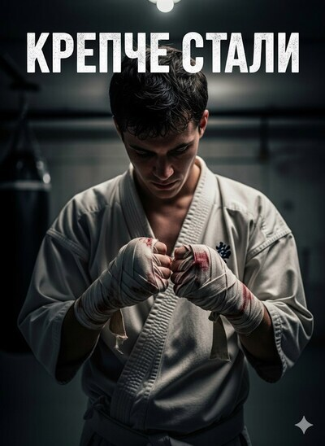

# Крепче стали

## Аннотация

Время не трать даром, молод ты или стар,
Учись ударом отвечать на удар.
Пусть крепче булатной стали будет твоя рука,
И зря враги уповают на мощь стального клинка.

## Обложка

### Глава 1

Глава 1

Ветер пах сырым бетоном и гниющими листьями. Конец октября в Воронеже всегда был таким — серым, промозглым, будто небо выцвело и осыпалось на город мелкой, холодной пылью. Максим шёл, ссутулившись, спрятав подбородок в воротник дешёвой болоньевой куртки; та почти не грела, только противно шуршала при каждом движении. Короткий путь домой лежал за школой, мимо обшарпанных кирпичных гаражей, исписанных кривыми тэгами и вечным «Цой жив». Здесь всегда было безлюдно и кисло пахло кошачьей мочой.

Он почти дошёл до арки, ведущей во двор, когда из-за угла мусорных контейнеров вышли трое. Костя Ширяев и двое его вечных прихлебателей, Саня и Серый, чьи фамилии Максим даже не знал. Они не бежали, не кричали. Просто встали на его пути, и от их ленивого, скучающего превосходства в животе будто провернулся холодный ржавый ключ.

— О, Кравчик. А ну стой.

Голос у Ширяева был ломкий, петушиный, но в бетонном колодце между гаражами он отдавался от стен, неприятно громкий и неотвратимый.

Максим остановился. Сердце споткнулось и забилось, сухо и часто, отдаваясь глухими ударами в горле. Он смотрел не на них, а на свои ботинки, на раздавленную кем-то гнилую ягоду рябины на асфальте. Главное — не смотреть в глаза. Если не смотреть в глаза, может, они просто пройдут мимо. Это работало вчера. И неделю назад.

Но сегодня что-то было иначе. Саня обошёл его сбоку, а Серый сделал короткий шаг назад, отрезая путь к отступлению. Ширяев сделал шаг вперёд, и Максим почувствовал запах дешёвых сигарет и приторно-мятной жвачки.

— Чего в ушах? Музыку слушаешь? — Ширяев протянул руку и выдернул из его уха наушник. Провод натянулся, и старенький плеер Explay, который мама подарила на день рождения, выскользнул из кармана куртки, повиснув на шнурке.

— Дай послушать, — Ширяев лениво забрал плеер. Повертел в руках. — «Эксплей». Говно какое. У меня батя такой в машине забыл, когда продавал.

Серый и Саня тихо хмыкнули. Максим молчал. Он смотрел на синий пластиковый корпус плеера в чужой руке. Внутри него играла какая-то старая группа, которую любила мама. Он не мог вспомнить название. Все мысли исчезли, остался только низкий гул, словно голова оказалась под водой.

— Отдай, пожалуйста, — услышав свой тонкий, дрогнувший голос, он мысленно вжался в себя. Хотелось отмотать секунду назад и промолчать.

Ширяев усмехнулся.

— Чего сказал? Пожалуйста? Ну, раз пожалуйста...

Он сделал вид, что протягивает плеер обратно. Максим инстинктивно шагнул вперёд, протягивая руку. В этот момент Ширяев несильно, почти буднично, толкнул его ладонью в грудь. Это был не удар, а именно толчок — выверенный, точный, рассчитанный на то, чтобы он потерял равновесие.

Он качнулся назад, отчаянно взмахнув руками. Небо и гаражи на миг поменялись местами, а потом спина с глухим шлепком ударилась о мокрый асфальт. Ледяная вода из мелкой, грязной лужи мгновенно пропитала джинсы и куртку до самой кожи. В нос ударил запах прелой листвы и машинного масла. Над ним раздался короткий, захлёбывающийся смешок.

— Ой, упал, — безразлично сказал Ширяев.

Он не стал забирать плеер. Просто разжал пальцы. Пластиковый корпус с лёгким треском ударился об асфальт. Звук был почти неслышным, но Максим увидел, как от точки удара по экрану побежали белые лучи, перечеркнув его навсегда.

Они ушли, потеряв к нему всякий интерес. Саня на прощание пнул его рюкзак, отчего тот отлетел на пару метров. Максим не шевелился. Он лежал в луже, чувствуя, как ледяная вода пробирается под свитер, к самому телу. Но холода он почти не замечал. Живот свело тугим узлом, а к горлу подкатила горячая волна, от которой перехватило дыхание. Что-то тугое и горячее дёрнулось в солнечном сплетении, и кровь бросилась к щекам, делая их мокрыми и тяжёлыми. Хотелось сжаться в точку, исчезнуть, провалиться сквозь мокрый асфальт.

Медленно, он сел. Грязная вода стекала с куртки. Перед ним на асфальте лежал плеер. Протянув дрожащую руку, он поднял его. Экран перечёркивала белая сеть трещин. Он нажал на кнопку. Дисплей на миг вспыхнул белым, а затем цифры на нём расплылись в нечитаемое чёрное пятно. Он погас. Навсегда.

Максим сидел на мокром асфальте, сжимая в руке мёртвый кусок пластика, и смотрел на свои колени. Он не плакал. Слёз не было. Была только пустота и гулкий, оглушающий стыд.

На кухне пахло жареной картошкой с луком и подсолнечным маслом. Запах был густой, домашний, и от этого контраста с уличной сыростью Максиму стало ещё хуже. Он тихо вошёл, надеясь проскользнуть в свою комнату незамеченным.

Мать стояла у плиты, помешивая картошку на шипящей сковороде. Она обернулась и тут же всё поняла. Её взгляд скользнул по его мокрой куртке, по грязи на джинсах, задержался на ссадине на скуле, которую он даже не почувствовал. Она ничего не спросила. Просто выключила газ, вытерла руки о передник и подошла к нему.

— Иди переоденься в сухое. Я сейчас всё соберу. Ужин почти готов.

Она забрала у него из рук рюкзак, и он на негнущихся ногах поплёлся в свою комнату. Переодеваясь, он поймал своё отражение в тёмном стекле шкафа. Худой, нескладный, с прилипшими ко лбу мокрыми волосами и красным пятном на щеке. Он быстро отвернулся.

Когда он вернулся на кухню, мать уже накрыла на стол. На его тарелке дымилась картошка, рядом лежал солёный огурец. Она достала из аптечки ватку и пузырёк с перекисью.

— Сядь, — сказала она.

Он сел на табуретку. Мать смочила ватку и осторожно приложила к ссадине. Зашипело. Он поморщился, но стерпел. Он смотрел на её руки — немного уставшие, с коротко подстриженными ногтями. Они едва заметно дрожали.

— Сильно больно? — спросила она, выбрасывая ватку в мусорное ведро.

— Нормально, — выдавил он.

Она села напротив и посмотрела ему прямо в глаза. Он увидел в них знакомые морщинки тревоги у переносицы. Её губы дрогнули в намёке на улыбку, но уголки так и не поднялись, а взгляд был тёплый, но словно выцветший от бесконечной усталости.

— Максим… я тут объявление видела. В газете. Секция каратэ. Прямо в подвале соседнего дома, в девяносто пятом. Может, походишь? Так… для себя. Чтобы увереннее был.

Она сказала это так, словно извинялась. Словно предлагала что-то стыдное. Он молчал, ковыряя вилкой картошку. Он не верил ни в какое каратэ. Он не верил, что это может что-то изменить. Внутри сидела тупая уверенность, что он просто такой. Созданный для того, чтобы его толкали в лужи.

Из большой комнаты донёсся зычный голос отца, перекрикивающий грохот выстрелов в сериале по НТВ.

— Лен, ты чего там шепчешься с ним? Ужинать давай!

Мать повысила голос, чтобы он услышал:

— Я говорю, может, Максиму на каратэ пойти. Чтобы постоять за себя мог.

В телевизоре началась реклама майонеза. Наступила короткая пауза.

— Ещё один кружок, чтобы штаны протирать, — донеслось с дивана. — У него и так тройки по алгебре выходят. Это самое… Драться на улице его там не научат, только деньги из вас тянуть будут. Пусть лучше уроками займётся, блин! Я после смены прихожу, а он…

Отец не договорил, его слова потонули в громкой музыке из следующего рекламного ролика.

Максим опустил голову ещё ниже. Слова отца ударили точнее и больнее, чем толчок Ширяева. Он почувствовал, как снова закипает тот самый горячий стыд, но к нему примешалось что-то новое — глухая, бессильная злость. Злость на отца, который видел в нём только тройки по алгебре. На Ширяева. На себя.

Он поднял глаза на мать. В её взгляде была мольба. Она искала в нём хоть какой-то ответ, хоть какую-то реакцию. И он, назло отцу, назло всему миру, который считал его ничтожеством, коротко, почти незаметно кивнул.

Массивная железная дверь в подвал была выкрашена в грязно-зелёный цвет и покрыта ржавыми подтёками. Максим потянул за приваренную ручку, и дверь со скрежетом поддалась. В лицо ударил густой, тёплый воздух, пропитанный запахами. Воздух был густым и тёплым: к едкому, въевшемуся в доски запаху пота примешивалась пыль и резкий, аптечный аромат разогревающей мази, чем-то похожей на «Финалгон», которой старшие ученики, видимо, натирали свои бесконечные ушибы и растяжения. Этот запах не отталкивал, он обозначал границу. За этой дверью был другой мир, со своим воздухом, со своими правилами.

Он спустился по бетонным ступенькам. Внизу, в большом, тускло освещённом помещении, обитом по стенам деревянными панелями, двигалось около двадцати человек в белых свободных одеждах. Они двигались синхронно, как единый механизм, под низкий, ровный голос невысокого, плотно сбитого мужчины лет сорока пяти.

— Ич! Ни! Сан!

При каждом счёте раздавался резкий, как выстрел, выкрик «Ос!» и свист десятков кулаков, рассекающих воздух. Максим замер у входа, чувствуя себя абсолютно чужим.

Мужчина в центре зала был сенсеем Морозовым. На нём было такое же белое кимоно, как и на остальных, но подпоясано оно было чёрным, истёртым поясом. Он не кричал. Голос был ровный, почти безэмоциональный, но каждое слово ложилось весомо, как камень. Морозов стоял почти неподвижно, будто его ноги проросли сквозь доски пола, и одного его взгляда, скользящего по рядам, хватало, чтобы заставить всех работать на пределе. Максим замер. Хотелось одновременно и отступить назад, к двери, и, наоборот, вытянуться в струну, чтобы стать незаметнее. Этот человек в центре зала пугал, но в его неподвижности было что-то гипнотическое.

Мать договорилась заранее. Его встретил один из старших учеников, парень с серьёзным лицом и сломанным ухом, и молча провёл в маленькую раздевалку. Там пахло так же, как и в зале, только гуще. Ему выдали старенькое, но чистое кимоно — доги, как его тут называли. Ткань была жёсткой, непривычной, и едва заметно пахла чужим потом, который не вывел никакой порошок.

Его поставили в последний ряд, вместе с такими же новичками, как он. Тренировка уже шла.

— Повторяй за всеми, — коротко бросил парень и вернулся в строй.

Максим попытался. Базовая стойка — дзэнкуцу-дачи. Прямой удар рукой — ой-цуки. Его тело казалось ему чужим, непослушным, сделанным из дерева. Он смотрел на старших учеников — их движения были резкими, экономичными, каждый удар наполнен силой, идущей от бедра. Его же удары были вялыми, руки путались, ноги разъезжались. Через десять минут каждое движение стало вязким, словно он двигался в воде. Мышцы бёдер и плеч налились тупой, ноющей тяжестью, какой он никогда прежде не испытывал. Пот катился по лицу, затекал в глаза, щипал. Он чувствовал себя ещё более жалким и неуклюжим, чем за школой. Он уже был готов развернуться и уйти.

Но потом он посмотрел на их лица. Лица старших учеников. Они были сосредоточены, на них не было ни страха, ни злости, ни радости. Только предельная концентрация. В их глазах была стальная уверенность. Та самая уверенность, которой ему так отчаянно не хватало. И это его зацепило. Он остался.

В конце тренировки, когда все уже едва стояли на ногах, сенсей Морозов скомандовал:

— Новички! К макиварам!

Их подвели к стене, на которой были закреплены обмотанные верёвкой доски.

— Бить сейкен. По десять раз каждой рукой. Сильно.

Сейкен — это были две костяшки, указательного и среднего пальцев. Максим встал напротив своей макивары. Она выглядела твёрдой и безжалостной. Он занёс кулак и ударил. Первый удар получился неловким, слабым. Второй — чуть сильнее. Он почувствовал, как жёсткая поверхность впивается в кожу. После пятого удара костяшки начало саднить. После седьмого боль стала острой. После десятого он отдёрнул руку и посмотрел на неё. Кожа на двух костяшках была стёрта до болезненной розовой плоти, готовая вот-вот лопнуть. Боль была чистой и ясной. Он сжал зубы и поменял руку.

Лёжа в кровати, он смотрел в потолок. Тело ныло незнакомой, тотальной усталостью. Мышцы, о которых он и не подозревал, отзывались тупой болью при каждом движении. Повернуться на другой бок было тяжело, словно тело стало чугунным.

В тусклом свете ночника, пробивающемся из коридора, он поднял руки и рассмотрел их. Костяшки указательного и среднего пальцев на обеих кистях были красными, опухшими. Содранная кожа подсохла и превратилась в тёмные корочки. Он осторожно дотронулся пальцем одной руки до сбитых костяшек другой. Боль была острой, локальной, почти приятной на фоне общего мышечного гула.

Он снова сжал кулак, впиваясь болью от содранной кожи. Эта боль была здесь, на костяшках. Не то что вчерашний стыд — липкий, невидимый, от которого некуда деться. От боли можно было разжать кулак. А можно сжать сильнее. Она была его. Он медленно сжал правую руку в кулак. Содранная кожа натянулась, и по нервам пробежал короткий электрический разряд боли. Он разжал кулак. Потом снова сжал. И снова.

Внезапное, с холодной ясностью, пришло понимание, что эта боль ему нравится. Нравится больше, чем тот стыд. Нравится больше, чем жалость в глазах матери или раздражение в голосе отца.

Он пойдёт на тренировку завтра. И послезавтра. И через неделю. Он будет приходить сюда каждый раз, пока эта боль не вытеснит всё остальное.

Прошло полторы недели. На четвёртой тренировке, когда Максим уже научился не путать правую и левую ногу и даже выкрикивать «Ос!» почти так же громко, как остальные, случилось то, что определило всё.

Тренировка подходила к концу. Все были измотаны до предела. Кимоно промокло от пота и прилипло к телу. Воздух в зале стал густым и тяжёлым, каждый вдох давался с трудом, будто лёгкие пытались прокачать через себя тёплую воду. Максим стоял в строю, пытаясь восстановить сбитое дыхание. Он думал, что это конец. Но Морозов думал иначе.

— Новички! В пары! — скомандовал он своим ровным голосом. — Набивка пресса. По десять ударов каждый. Начать!

В зале повисло напряжение. Максим встал напротив такого же испуганного парня, как он сам. Тот виновато посмотрел на него.

— Ты первый, — прошептал Максим.

Парень неуверенно сжал кулак и ударил его в живот. Удар был слабым, почти детским, но абсолютно неожиданным. Максим не успел напрячь пресс. Удар выбил дыхание с коротким, влажным хрипом. В глазах потемнело, и сквозь гул собственной крови в ушах он едва различал, как в соседней паре отсчитывают удары. Он инстинктивно согнулся пополам, хватая ртом воздух, которого не было. Он закашлялся, пытаясь вдохнуть. Он ждал, что его поднимут, похлопают по спине, скажут, что для новичка это нормально.

Он услышал тихие шаги по деревянному полу. Поднял глаза. Перед ним стоял Морозов. Он не протягивал руку помощи. Он не хмурился. Он просто смотрел на него сверху вниз своими холодными, ничего не выражающими глазами. Взгляд был как у врача, изучающего симптом. Как у механика, осматривающего сломанную деталь.

Наступила пауза. Максим успел услышать, как под потолком гудит лампа дневного света и как тяжело дышит парень в соседней паре. Весь зал затих и смотрел на них. Максим чувствовал на себе два десятка пар глаз. Горячий стыд начал закипать внутри, угрожая поглотить его снова.

И тогда Морозов заговорил. Голос был тихим, ровным, но его услышал каждый в зале.

— Дыши.

Слово «дыши» ударило его сильнее любого кулака. В нём не было ни капли жалости. Ни упрёка. Просто инструкция.

Он, давясь воздухом, заставил себя выпрямиться. Спина выгнулась, мышцы пресса свело судорогой. Он сделал судорожный, хриплый, рваный вдох. Он всё ещё не мог надышаться, но он стоял прямо. Он посмотрел на своего партнёра, который стоял бледный, как полотно, и коротко кивнул ему.

— Давай.

Морозов молча, без единого слова, перевёл взгляд на следующую пару, словно ничего не произошло.

Максим выдержал оставшиеся девять ударов. Он не пытался увернуться или сжаться. Он встречал каждый кулак, напрягая пресс и с шумом выдыхая воздух. К концу его тело дрожало, а в животе всё горело огнём. Но он стоял. И дышал.

### Глава 2

Глава 2

Прошёл год. Год бесчисленных ударов по макиваре, сотни часов, оставленных на жёстком татами, и окриков «Ос!», въевшихся в подкорку. Осень 2017-го принесла тот же запах мокрого асфальта и гниющих листьев, но Максим Кравцов встречал её другим. Он вытянулся, костлявая нескладность уступила место сухой, жилистой силе. Плечи раздались, на животе проступили жёсткие кубики — результат монотонной «набивки».

Его тело стало картой. Костяшки на кулаках, год назад содранные в кровь, теперь покрылись плотными желтоватыми мозолями, нечувствительными, как камень. Голени и бёдра под штанами доги испещряли бледные тени старых синяков — следы сотен пропущенных лоу-киков. Он двигался иначе. Не сутулился, не вжимал голову в плечи. Ходил ровно, ставя ногу на полную стопу, как учил сенсей.

Мир за пределами додзё «Самурай» съёжился, потускнел. Школа превратилась в череду бессмысленных ритуалов, которые нужно было перетерпеть до вечера. Разговоры одноклассников о новых играх и девчонках казались ему фоновым шумом, как радио, настроенное между станциями. Он отдалился не потому, что презирал, — ему стало не о чем с ними говорить. Его реальность пахла камфорой, звучала резкими выкриками и измерялась количеством отжиманий на кулаках.

Причина, приведшая его в зал, — тот унизительный толчок в лужу — давно стёрлась из памяти. Костя Ширяев и его компания перестали существовать как угроза. Развязка, к которой он готовился, произошла буднично и нелепо. Где-то в марте, в забитом на перемене коридоре, Ширяев, шедший навстречу, по старой привычке попытался толкнуть его плечом. Максим не увернулся. Он просто напряг корпус, даже не сдвинувшись с места. Ширяев, не ожидавший сопротивления, врезался в него с глухим стуком, как в стену, и сам отшатнулся. Их взгляды встретились. Максим ждал вызова, злости. Но в глазах Ширяева он не увидел ничего, кроме секундного удивления, сменившегося мутным безразличием. Тот просто обошёл его и пошёл дальше. Всё. Бой, ради которого он месяцами сдирал кожу с костяшек, не состоялся.

И эта несостоявшаяся победа оставила после себя странную лёгкость в груди, похожую на онемение. Механизм, запущенный страхом, продолжал работать. Максим приходил в додзё, переодевался в старое, заштопанное матерью кимоно, завязывал белый, давно посеревший пояс и становился к макиваре. Он просто не знал, что ещё делать. Дисциплина стала единственным понятным языком.

Он стоял перед обитой кожей доской. Вдох через нос, шипящий выдох — «Ш-ш-ш!». Удар. Не шлепок, как год назад, а сухой, плотный щелчок, от которого вибрация прошла по руке до самого плеча. Он не вкладывал злость. Он работал, оттачивая механику. Постановка стопы. Резкий поворот бедра. Выброс кулака. Возврат руки к поясу. Десять ударов правой. Десять левой. Он смотрел на свои руки. Мозоли на костяшках загрубели настолько, что казались частью кости. Он помнил, как сдирал их в кровь, как прижигал йодом, шипя от боли, чтобы кожа загрубела быстрее. Сейчас они не чувствовали почти ничего.

Он снова повернулся к макиваре. И удары стали другими. Жёстче. Злее. Теперь он бил не по воображаемому Ширяеву. Он бил вглубь той тишины, что поселилась внутри. По той растерянности, что осталась после исчезновения врага. Он лупил по ней, пытаясь заглушить вопрос: а что дальше?

Тренировка шла своим чередом. Разминка, кихон, ката. Максим двигался как автомат. Его тело работало безупречно, но разум был далеко. Он чувствовал себя так, будто замахнулся для сильнейшего удара, но цель в последний момент исчезла, и кулак со свистом рассек воздух, увлекая за собой всё тело.

— Мокусо! — прозвучала команда Морозова.

Ученики сели в дзадзэн. Максим закрыл глаза. Нужно было очистить разум. Но мыслей и так не было. В ушах стоял тонкий, высокий звон, как после удара. Та же звенящая тишина, что давила в груди. Он достиг цели. Он больше не был жертвой. Но легче не стало.

После тренировки, когда большинство разошлись, Максим остался. Он подошёл к тяжёлому мешку, набитому резиновой крошкой, и начал отрабатывать маваси-гери. Он вкладывал в удар всю силу, но что-то было не так. Удар получался мощным, но смазанным.

— Бедро не докручиваешь.

Голос за спиной заставил его вздрогнуть. Денис Мартынов, семпай с коричневым поясом, спокойный парень лет семнадцати.

— Вся сила в нём, — продолжил Денис. — Смотри.

Он не стал бить. Он медленно начал разбирать движение на фазы.

— Опорная нога… видишь, на носок встаю? Это ось вращения. А таз… вот, почувствуй. — Он положил ладонь Максиму на поясницу. — Он как будто мешок вперёд проталкивает. Не нога бьёт, а всё тело. Бедро — это праща. А голень и стопа — это камень, который она метает. Попробуй.

Максим попробовал. Получилось неуклюже, он чуть не потерял равновесие.

— Ещё раз. Медленнее. Забудь про силу. Почувствуй, как вес перетекает. Это не про мышцы. Это про физику.

Максим закрыл глаза и попробовал снова. Медленно. Перенос веса. Разворот на носке. Вынос колена. И только в последний момент — хлёсткое движение голенью. Он открыл глаза и ударил.

Мешок качнулся иначе. Вместо гулкого «бум» раздался короткий, плотный шлепок, похожий на выстрел из пневматики, и мешок не просто отлетел, а дёрнулся, завибрировав всем весом. Удар был не сильнее, но несравнимо чище.

Максим опустил ногу, тяжело дыша. Целый год он пытался вложить в удар больше силы. А оказалось, дело было не в ней. Дело было в физике.

Денис просто кивнул.

— Сотню раз медленно, тысячу — быстро. И тогда получится один раз правильно, — сказал он, хлопнул Максима по плечу и ушёл.

Максим остался один. Внутренняя тишина никуда не делась, но теперь в ней что-то наметилось. Тонкая линия, ведущая от его неуклюжего удара к тому чистому шлепку. Он хотел научиться проводить эту линию без ошибок.

В начале 2018-го для Максима состоялись первые соревнования. Он сдал на жёлтый пояс, и сенсей включил его в команду. Отец, узнав, взорвался.

— Какие ещё соревнования? — гремел он на кухне. — Мало того, что вечно синий ходишь? Хочешь, чтобы тебе там башку проломили? Денег на эту… богадельню… не дам!

Мать пыталась его успокоить. Максим молчал. Он ждал, когда тот выдохнется. В итоге мать дала ему деньги тайком.

— Только ты осторожнее, сынок, — прошептала она.

Спорткомплекс «Юбилейный» оглушил его. После скрипа досок и редких, резких выкриков их подвального додзё это место казалось Вавилоном. Гудящие лампы, крики тренеров, рёв трибун, объявления из хрипящих динамиков — всё сливалось в один давящий шум. Воздух был плотным, пропитанным смесью запахов: к приторной сладости хот-догов примешивался едкий камфорный дух мазей, резиновая пыль от татами и солёный пот сотен тел.

Максим приехал с матерью. Она сидела на трибуне, крепко сжимая сумку. Маленькая, потерянная в толпе. Она видела десятки мальчишек в белых кимоно, которые скоро начнут бить друг друга. И среди них — её сын. Он видел её страх даже на расстоянии. От этого хотелось стиснуть зубы, а в груди становилось тесно и колко.

Он нашёл свою команду. Морозов уже был там, спокойный, как скала. Его присутствие успокаивало. Разминка. Растяжка. Механические движения, от которых сведённый страхом живот немного отпускало. Его объявили в первой паре. Соперник — коренастый парень из клуба «Пересвет».

Мать нашла его у выхода на татами, протянула бутылку с водой.

— Ты как? Не волнуешься? — её голос дрожал.

— Нормально… всё, мам, — соврал он. Его колотила мелкая дрожь. Дрожащие пальцы с первого раза не смогли открутить крышку.

Подошёл Морозов. Его взгляд был прикован к парню из «Пересвета».

— Он прёт вперёд, — сказал сенсей тихо. — Как бык. Работай первым. Встречай на движении. Понял?

— Ос, — выдавил Максим.

Дрожь в руках не прошла, но стала частью фона. В голове остался только тихий голос сенсея и лицо парня напротив. Это был приказ.

Выход на татами. Яркий свет бил в глаза. Поклон судье, поклон сопернику. Лицо парня напротив было спокойным, почти скучающим. Просто работа. Это пугало больше всего.

— Хаджимэ!

Он не успел осознать начало боя. Соперник шагнул вперёд. Максим увидел замах ноги, но тело, скованное напряжением, не успело среагировать. По внешней стороне левого бедра будто хлестнули мокрым канатом, и глубоко внутри что-то туго и тошнотворно порвалось.

Шок. В додзё били не так. Здесь боль была злой, целенаправленной. Он попытался отступить, но левая нога слушалась плохо. Мышцы свело судорогой.

Соперник шагнул и ударил снова. Точно в то же место. Боль из жгучей превратилась в острую, а потом сменилась ватным онемением. Нога ниже бедра перестала быть его, превратившись в чужеродный, непослушный отросток.

Максим выбросил вперёд руку, пытаясь нанести ответный удар, но потерял равновесие. Удар прошёл мимо. Он снова увидел лицо соперника — спокойное, сосредоточенное.

Третий лоу-кик. Он даже не почувствовал его. Нога просто подломилась. Он тяжело осел на одно колено, заваливаясь на бок. Холодный татами больно ударил в рёбра.

Он лежал, пытаясь отдышаться. В ушах звенело. Он слышал крик судьи «Ямэ!». Всё кончилось. Тридцать секунд. Он поднял голову и посмотрел на трибуны. Там, среди сотен лиц, было одно, искажённое ужасом. Лицо матери.

И в этот момент его накрыло. Не боль. Стыд. Но не горячий, как в тот раз, а ледяной, парализующий. Тот, что приходит под взглядами сотен людей. Шум трибун вдруг стал оглушительно чётким, каждый кашель, каждый смешок казался направленным на него. Ему хотелось съёжиться, стать меньше татами, просочиться сквозь щели в полу.

Раздевалка была пустой. Пахло потом и сыростью. Максим сидел один на холодной скамейке, спрятав лицо в ладонях. Его плечи мелко, судорожно вздрагивали. Он не плакал. Он пытался дышать.

Дверь тихо скрипнула. Морозов. Сенсей сел рядом, но не слишком близко. Молчал. Потом Максим услышал щелчок замков на сумке.

— Нога. Давай сюда, — голос сенсея был ровным.

Максим нехотя выпрямил ногу. Левое бедро стремительно отекало, кожа над ушибом лоснилась от натяжения, а в центре начало проступать багровое пятно. Морозов открыл бутылочку без этикетки. По раздевалке поплыл резкий запах камфоры. Он плеснул маслянистую жидкость себе на ладонь и начал втирать её в ушиб.

— Болит? — спросил он.

— Не очень, — прохрипел Максим. — Онемела.

— Пройдёт, — ответил Морозов. — Отёк сойдёт, гематома рассосётся. А вот то, что у тебя сейчас вот здесь… — он коротко, жёстко стукнул костяшкой пальца по своей груди, — …оно само не пройдёт.

Максим молчал, уставившись в бетонный пол. Кожу жгло, словно её натирали перцем.

— Ты знаешь, в чём разница между болью и стыдом? — спросил сенсей.

Максим покачал головой.

— Боль — это честно. Тебя ударили, тебе больно. Это сигнал. Всё. А стыд… стыд — это когда ты сам себя предал. Испугался. Сдался. — Он посмотрел Максиму в глаза без осуждения или жалости — так смотрят на деталь, не выдержавшую нагрузки. — Ты сдался?

— Я… упал, — прошептал Максим.

— Я не спрашиваю, упал ли ты. Я спрашиваю, сдался ли ты. Ты сказал судье «стоп»?

— Нет.

— Тебя остановил судья. Не ты сам. Значит, ты не проиграл. — Морозов произнёс это как неоспоримый факт. — Ты просто… закончил бой. Потому что твоё тело оказалось не готово. Не твой дух. Запомни. Проигрывает не тот, кто падает. А тот, кто не встаёт.

Он достал эластичный бинт и начал туго заматывать ногу.

Морозов закончил бинтовать ногу и встал.

— Через час награждение. Будь там. Поддержишь наших.

Он вышел, оставив после себя едкий запах мази. Максим сидел, глядя на свою замотанную ногу. Жар в лице спал, но внутри что-то затвердело. Проигрывает не тот, кто падает, а тот, кто не встаёт. Сенсей сказал это как факт. Как закон физики.

Он поднял голову. В его глазах не было слёз. Только твёрдое, холодное решение. Он вернётся на это татами. И в следующий раз его не остановит никто.

### Глава 3

Глава 3

Время, прошедшее с того дня в «Юбилейном», словно вытравило из Максима остатки мальчишества. Он и не заметил, как это случилось. Просто в какой-то момент, стоя перед мутным зеркалом в раздевалке, он увидел не сутулого, угловатого подростка, а кого-то другого. Плечи раздались, трапеции бугрились под кожей, на животе проступили жёсткие плитки пресса. Весы в медкабинете показывали на восемь килограммов больше, и это была не рыхлая детская плоть, а сухие, налитые работой мышцы. Тело менялось, превращаясь в инструмент, послушный и выносливый.

Память о поражении больше не была открытой раной. Она зарубцевалась, превратившись в твёрдый шрам где-то под рёбрами — не болела, но он всегда чувствовал её, стоило лишь глубже вдохнуть. И он научился опираться на неё. Каждый раз, когда мышцы плавились от напряжения, когда лёгкие горели, отказываясь принимать вязкий, горячий воздух, когда очередной удар выбивал из головы все мысли, кроме одной — сдаться, — он мысленно возвращался туда, в пустую, гулкую раздевалку. Он снова видел ногу соперника, снова чувствовал, как подкашивается его собственная, и холодная, ядовитая злость давала силы на ещё один подход, ещё один удар, ещё одну минуту боли.

Он сдал экзамены на жёлтый и оранжевый пояса. Сдал жёстко, грязно, без блеска, но с таким упрямством, что даже семпаи вполголоса обсуждали его выносливость. Он научился терпеть «набивку» — монотонный, изматывающий ритуал, когда партнёры часами обмениваются ударами по бёдрам и прессу, приучая тело не замечать боль. Его костяшки на кулаках превратились в уродливые мозолистые бугры, кожа на них огрубела и больше не сдиралась в кровь о мешок. Он стал частью этого мира. Его плотью, его запахом, его болью.

Июль 2018 года заливал Воронеж расплавленным асфальтом и липкой духотой. В додзё «Самурай» воздух был ещё гуще. Он стоял неподвижно, вязкий, почти осязаемый, пропитанный запахами десятков потных тел, старой резины макивар и въевшейся в деревянные полы пыли. Открытые под потолком форточки не спасали — вместо прохлады они впускали в зал лишь горячий городской смрад и приглушённый гул машин. Тренировка шла уже второй час.

Максим стоял в паре с Серёгой — парнем на полголовы выше, с длинными, жилистыми руками. Его оранжевый пояс был выцветшим и потрёпанным, почти жёлтым. Они работали кумитэ, спарринг без защиты. Только доги, только голые руки и ноги. Команды сенсея Морозова, сухие и резкие, как щелчки хлыста, задавали ритм.

— Чаще! Быстрее! Не стойте! Кравцов, руки выше!

Удары летели один за другим. Тяжёлый удар в корпус, от которого плотная куртка доги издала звук выбиваемой пыли. Свист ноги, прорезающей плотный воздух. Сдвоенное, тяжёлое дыхание. Максим двигался экономно, собранно. Он уже не суетился, как год назад. Он научился видеть начало движения противника, предугадывать его намерения. Он принял на предплечье жёсткий лоу-кик, отдавшийся вибрацией по всей кости, и тут же ответил своим, вложив в удар вес корпуса. Серёга качнулся, но устоял.

Пот заливал глаза, щипал, заставляя моргать. Мокрое доги прилипло к спине и плечам, сковывая движения. Каждая мышца ныла от усталости, но это была привычная, рабочая боль. Единственная реальность, в которой он теперь жил.

Серёга пошёл вперёд, выбрасывая быструю двойку руками. Классическая атака, которую они отрабатывали сотни раз. Максим сместился влево, принимая первый удар на блок. Правая рука партнёра пролетела мимо, но он тут же развернул корпус и пробил левой. Прямой удар, короткий и точный. Максим не успел среагировать.

Кулак, с костяшками, набитыми до состояния булыжников, вошёл точно в солнечное сплетение.

Вместо мира перед глазами на мгновение вспыхнуло белое солнце. Воздух вырвался из груди с коротким, влажным хрипом. Диафрагма свелась в один ледяной, парализовавший узел. Он согнулся пополам, рот судорожно хватал несуществующий кислород, издавая беззвучный, сиплый хрип. Перед глазами плыли белые пятна. Тело перестало слушаться; руки и ноги стали чужими, налитыми свинцом, и хотели только одного — упасть, свернуться на полу и не двигаться.

И сквозь шум крови в ушах, сквозь ледяной спазм, пробился голос сенсея. Не громкий, но он резал слух, как скрежет металла по стеклу.

— Терпи!

Спазм не отпускал. Дышать было невозможно. Холодная, липкая паника подкрадывалась к горлу.

— Пресс как сталь! — Голос Морозова был спокоен. В нём не было ни сочувствия, ни злости. Только констатация факта. Требование. — Дыши!

Дыши. Простое слово. Невыполнимая задача. Максим упёрся руками в колени, пытаясь распрямить грудную клетку. Он заставил себя сделать короткий, рваный, судорожный вдох. В лёгкие ворвалась крошечная порция раскалённого воздуха. Боль в диафрагме на мгновение стала острее, но спазм чуть ослаб. Ещё один вдох. И ещё.

Он медленно выпрямился. Тело дрожало. Внутри, под рёбрами, сидел тугой, горячий ком. Но он стоял на ногах. Он смотрел перед собой, на расплывчатую фигуру Серёги, который опустил руки и ждал.

— Работать, — бросил Морозов со своего места у стены.

Максим поднял руки в боевую стойку. Ладони были влажными, ноги — ватными. Но он стоял. Он принял удар. Он не сдался. Бой продолжался.

Воскресный обед проходил в привычной, гнетущей тишине. Мать суетилась у плиты, ставила на стол тарелки. Отец, вернувшийся с ночной смены на шинном заводе, сидел за столом, уставившись в старенький телевизор на кухне, где шёл какой-то унылый сериал. Он ел молча, громко стуча вилкой по тарелке, и это был единственный звук, нарушавший монотонное бормотание диктора. Воздух, густой от запаха жареной картошки и дешёвого табака от отца, казалось, давил на плечи.

Максим сел за стол, автоматически подвинув к себе тарелку. Он был в одной майке-алкоголичке — дома стояла невыносимая духота. Он чувствовал на себе взгляд отца, тяжёлый, изучающий, но не поднимал головы. Он просто хотел поесть и уйти в свою комнату. Уйти обратно в свой мир, где всё было просто и понятно.

Он потянулся за хлебницей. Майка натянулась, задралась на боку, и на несколько секунд открыла то, что было под ней. На рёбрах, от подмышки до самого пояса, разлился уродливый синяк. В центре, в месте удара, он был почти чёрным, а к краям расходился тёмно-фиолетовыми, болотно-зелёными и ядовито-жёлтыми разводами, словно на коже разлили бензин.

Отец перестал жевать. Он положил вилку на стол. Звук металла о фаянс прозвучал в тишине как выстрел.

— Это что ещё такое? — его голос был тихим, но Максим почувствовал, как напряглась мать у плиты.

Максим молча опустил руку и поправил майку.

— Ничего.

— Я, по-твоему, слепой? — отец чуть повысил голос. — Я тебя спрашиваю, это что? Ты себя калечить туда ходишь?

Максим продолжал смотреть в свою тарелку. Спорить было бесполезно. Объяснять — невозможно. Любое его слово будет использовано против него. Молчание было единственным щитом.

— В аттестате тройки вылезли, — распалялся отец. — По математике, по физике! А он кулаками машет! Я тебе на это деньги даю?! Чтобы ты их, короче, на лекарства потом тратил?!

— Витя, перестань. Обед же, — тихо сказала мать, не оборачиваясь.

— А ты молчи! — рявкнул отец. — Это твоя идея была! «Пусть мальчик научится за себя постоять»! Вот, любуйся! Скоро инвалидом придёт с этой своей секты, что делать будем?!

Максим медленно поднялся из-за стола. Он не съел ни куска. На его лице не дрогнул ни один мускул. Он смотрел не на отца, а куда-то сквозь него. Он больше не был частью этого мира, этих разговоров, этих криков. Они его не касались.

Он молча развернулся и пошёл в свою комнату.

— Стой! Я с тобой разговариваю! — крикнул отец ему в спину.

Дверь в комнату захлопнулась. Не громко, но окончательно.

Отец остался сидеть на кухне. Он ударил кулаком по клеёнчатой скатерти, но как-то вяло, без прежней ярости. Посуда на столе дребезгнула. Он посмотрел на жену, которая застыла у раковины, опустив плечи.

— Лен, ну ты видишь? — его голос вдруг потерял всю свою грозность. В нём послышалось отчаяние и неподдельный страх. — Он же себя угробит. Ему же плевать на всё… Он меня не слышит. Совсем.

Через несколько дней злость от ссоры с отцом улеглась, оставив после себя лишь привычный горький осадок. Максим вытеснил это из головы. Единственное, что имело значение — тренировка. Сегодня сенсей поставил его в пару с Денисом Мартыновым. Денис уже носил коричневый пояс, готовился к экзамену на чёрный и был на десять, а то и пятнадцать килограммов тяжелее. Работать с ним было честью и пыткой одновременно. Каждый его удар был выверенным, быстрым и тяжёлым. Каждый блок отзывался тупой болью в предплечьях.

Максим решил отработать связку, которую подсмотрел на видео с чемпионата Японии: два быстрых удара руками, чтобы заставить противника поднять руки к голове, раскрывая корпус, и сразу за этим — мощный маваси-гери, боковой удар ногой, в область печени. Теоретически, это был почти гарантированный нокаут.

Он начал атаку. Первый прямой удар Денис легко сбил. Второй, боковой, заставил его поднять руку для блока. Есть! Корпус Дениса был открыт на долю секунды. Этого должно было хватить.

Максим начал закручивать таз, вкладывая в удар всю массу тела. Он уже видел цель — уязвимое место под рёбрами. Но он сделал это на мгновение медленнее, чем следовало. Сказалась накопившаяся за неделю усталость. Начиная удар, он полностью раскрыл свой левый бок, оставив его беззащитным.

Денис был опытнее. Он не стал блокировать удар Максима. Он увидел брешь и атаковал сам.

Его нога уже была в движении. Максим заметил её боковым зрением — белое, размытое пятно кимоно, несущееся прямо к его рёбрам. Времени, чтобы среагировать, уже не было. Он инстинктивно попытался напрячь мышцы пресса, но было поздно.

Он увидел всё в мельчайших деталях. Как напряглись мышцы на голени Дениса. Как его стопа, жёсткая и натянутая, летит точно в цель. Как капли пота срываются с его волос.

А потом он услышал звук.

Вернее, два звука, которые слились в один. Первый — глухой, мокрый шлепок, с которым стопа врезалась в его тело. Звук удара по мясу. А сразу за ним, почти неотличимо, раздался второй. Короткий, влажный, отвратительно-интимный.

Хруст. Глухой, внутренний, будто кто-то сломал прямо в груди сухую сосновую ветку. И этот звук пришёл не снаружи. Он родился внутри его собственной грудной клетки.

Следом за звуком пришла боль. Не та, тупая и ноющая, к которой он привык. Эта была другой — острой и белой, как лезвие скальпеля, мгновенно парализовавшая всё тело. Она заставила всё тело выгнуться дугой.

Ноги подкосились сами собой. Он осел на татами, сворачиваясь в клубок, пытаясь обхватить руками источник этой невыносимой муки. Он попытался вдохнуть, но малейшее движение груди отзывалось новым, ослепительным разрядом агонии. Из горла вырвался сдавленный стон.

Тренировка остановилась. Вокруг него собрались ребята. Он слышал их голоса как сквозь толщу воды. Кто-то позвал сенсея. Морозов подошёл, присел на корточки рядом.

— Где? — коротко спросил он.

Максим не мог говорить. Он лишь ткнул пальцем в левый бок. Морозов осторожно, но сильно прощупал рёбра. Когда его пальцы коснулись больного места, Максим зашипел и дёрнулся.

— Встать можешь?

Он попробовал. С помощью Дениса он кое-как сел, потом поднялся на ноги. Каждый вдох был пыткой.

— Переодевайся, — приказал Морозов. — Поедем, посмотрим.

В травмпункте пахло лекарствами и несвежими бинтами. Уставший, небритый врач с безразличным лицом повесил на светящийся экран его рентгеновский снимок. Тёмное поле, на котором белели призрачные очертания его рёбер.

— Ну, что, боец, допрыгался? — врач ткнул карандашом в снимок. — Вот здесь, видишь? Трещина девятого ребра. Без смещения, повезло тебе. Ничего страшного, но месяц-полтора никаких нагрузок. Понял меня? Вообще никаких. Даже не бегать. Срастётся само. Вот тебе рецепт на обезболивающее. Следующий.

Месяц-полтора. Шесть недель. Сорок пять дней. Эти слова звучали как приговор.

Прошла неделя. Боль в боку из острой превратилась в тупую, ноющую. Она напоминала о себе при каждом резком движении, при каждом глубоком вдохе, при каждом неосторожном повороте во сне. Но когда он оставался один, комната начинала давить тишиной, и эта тишина была страшнее.

Его комната превратилась в тюремную камеру. Четыре стены, стол, кровать и окно, выходящее на унылый двор с чахлыми деревьями. Днём он тупо смотрел в потолок или листал на ноутбуке записи боёв кёкусинкай. Великий Масутацу Ояма, основатель стиля, голыми руками ломал стопки черепицы, убивал быков одним ударом. Его тело было оружием, совершенным и смертоносным. Максим смотрел на своё отражение в тёмном экране. Расслабленное, бесполезное, больное. Мышцы пресса, которые он с таким трудом закачивал, казалось, стали мягче, оплыли.

Там, в додзё, боль была осмысленной. Она делала его сильнее. Здесь, в тишине комнаты, она была просто признаком его слабости, его поражения. Тело предало его.

Отец, как ни странно, почти не злорадствовал. Он лишь однажды, проходя мимо, буркнул: «Ну что, я говорил?», но в его голосе не было торжества, скорее, усталая правота. Мать молча приносила ему еду и мази, её лицо было полно тихого, скорбного упрёка.

Ночью, когда вся квартира погружалась в сон, он не мог заснуть. Он лежал, прислушиваясь к гулу холодильника на кухне и к стуку собственного сердца. Врач сказал: «Никаких нагрузок». Сенсей ничего не сказал. Он просто отвёз его в травмпункт и домой, а на прощание бросил: «Лечись». Что это значило? Ждать его или списать со счетов? Эта неизвестность сжирала его изнутри. Он не мог просто лежать. Не мог позволить телу победить.

В одну из таких бессонных ночей он принял решение.

Он тихо сполз с кровати на пол, стараяся не шуметь. Лёг на спину. От любого движения в боку отзывалась ноющая боль. Он положил руки за голову и попробовал сделать скручивание на пресс.

Тупая боль мгновенно стала острой, пронзающей. Он зашипел сквозь сжатые зубы, но не остановился. Он оторвал лопатки от пола, чувствуя, как протестует каждая клетка его тела. Один раз. Он опустился, тяжело дыша. Пот выступил на лбу. Он сделал ещё одно. И ещё.

Это было его преступление. Его способ не сдаться. Каждое движение причиняло боль, но эта боль была другой. Он контролировал её. Он сам выбирал её. Это была его тренировка.

Прошла вторая неделя, потом третья. Каждую ночь, убедившись, что родители спят, он выполнял свой ритуал. Он нашёл упражнения, которые можно было делать, не нагружая ребро напрямую. Статическая планка, пока всё тело не начинало дрожать от напряжения. Медленные подъёмы ног, от которых горел нижний пресс. Он работал в темноте, в тишине, обливаясь потом, закусив подушку, чтобы не застонать от боли. Он нашёл лазейку. Он обманывал своё тело, обманывал запрет врача. Он продолжал свой путь.

Прошло почти два месяца. Максим стоял перед знакомой, обитой железом дверью, ведущей в подвал. Он не был здесь пятьдесят три дня. Он считал. Боль в боку почти прошла, остался лишь лёгкий дискомфорт при глубоком вдохе или резком повороте. Ждать дальше он не мог. Категорически. Страх, что его место в строю уже занято, что его забыли, списали, был сильнее страха перед болью. Он потянул на себя тяжёлую дверь, и в лицо ударил знакомый, родной запах — густой коктейль из пота, резины и мазей.

В зале шла разминка. Два десятка человек в белых доги синхронно выполняли удары ногами. Стук босых пяток о деревянный пол, резкие выкрики «Киай!», команды семпая — музыка, которую он так боялся больше не услышать.

Когда он вошёл, все на мгновение замерли. Все взгляды обратились к нему. В наступившей тишине он прошёл в раздевалку, оставил сумку и вышел обратно, встав у стены.

Морозов, наблюдавший за тренировкой, остановил счёт. Он медленно подошёл к Максиму. Его лицо было, как всегда, непроницаемым, как высеченная из гранита маска. Он не спросил, как здоровье. Не сказал, что рад его видеть. Он остановился в шаге от него и молча смотрел. Этот взгляд был тяжелее любого удара. Он словно просвечивал насквозь, ища следы слабости, жалости к себе, страха.

— Где болело? — наконец спросил сенсей. Его голос был ровным, безэмоциональным.

Максим молча показал пальцем на левый бок, на место зажившей трещины.

Морозов, не меняя выражения лица, без всякого предупреждения ткнул двумя жёсткими, как палки, пальцами точно в это место. Он нажал. Сильно.

Максим ожидал этого. Он знал, что будет проверка. Он готовился к ней каждую ночь, когда тренировался сквозь боль. В тот момент, когда он увидел движение руки сенсея, он напряг все мышцы кора — пресс, косые, спину — превратив свой торс в камень.

Боль взорвалась внутри острой вспышкой, будто сломанные концы ребра скрежетнули друг о друга. Глаза на мгновение застило тёмной пеленой. Но он выдержал. Он не дёрнулся. Не скривился. Не издал ни звука. Он просто продолжал стоять, глядя прямо в холодные, бесцветные глаза сенсея.

Морозов держал пальцы ещё секунду, словно измеряя его болевой порог, а потом убрал руку.

Наступила пауза. Длинная, звенящая. Весь зал смотрел на них. Максим не дышал.

— Зажило, — наконец констатировал Морозов, будто вынося вердикт.

Он развернулся и бросил через плечо, уже обращаясь не лично к нему, а ко всему пространству додзё:

— Разминайся.

И тренировка возобновилась. Снова зазвучали команды, выкрики, стук ног.

Максим сорвал с себя футболку, бросил её к стене и босиком вышел на татами, вливаясь в общий ритм. Он вернулся домой.

### Глава 4

Глава 4

Его тело стало чужим. Не тем, что он помнил, а инструментом, выкованным из боли и дисциплины. Кожа на рёбрах и бёдрах хранила желтоватые тени старых гематом, а мозоли на костяшках кулаков навсегда вплавились в его анатомию. Он двигался так же, как и думал — экономно, жёстко, отсекая всё лишнее. Мир за пределами додзё стал для него набором препятствий, которые нужно проходить с минимальными затратами энергии.

Ему было пятнадцать. Он уже почти не разговаривал. Дома общение свелось к кивкам или односложным ответам. Школа превратилась в тягомотную повинность, которую нужно было отбыть перед тем, как начнётся настоящая жизнь.

Он прошёл путь до зелёного пояса, сдав очередные экзамены. Каждый кю-тест стоил ему недель подготовки на пределе, десятков мелких травм и сотен часов, вырванных из сна и учёбы. Отец больше не кричал. Теперь он просто смотрел на Максима с тяжёлым, отчуждённым выражением, будто видел перед собой не сына, а чужого, непонятного ему человека. Это молчаливое осуждение ранило сильнее любой ругани. Мать металась между ними, но её тихая забота, натыкаясь на его молчание и отчуждённость отца, бессильно гасла. Страх в её глазах вызывал в нём глухое, иррациональное раздражение. Эта беззащитность напоминала ему о том мальчишке, которого он с таким трудом убивал в себе каждый день.

Он давно уже занимался каратэ не для того, чтобы дать сдачи Косте Ширяеву. Он вообще о нём не вспоминал. Теперь каратэ было его крепостью, его способом отгородиться от мира, который жил по неправильным, бессмысленным законам. В его мире всё было честно. Боль была платой за силу. Дисциплина была путём к результату. И не было ничего важнее.

Апрельский вечер сочился в высокие подвальные окна мутной серостью. Тренировка закончилась полчаса назад. Младшие, гремя шкафчиками и негромко переговариваясь, разошлись. Ушёл и сенсей, бросив на Максима короткий, ничего не выражающий взгляд. Максим остался один.

Воздух был знакомым до последней молекулы: ноты высохшего пота, древесная пыль и въевшаяся в половицы камфора сливались в единый запах, который он давно перестал замечать. Так пахла его территория. Единственная настоящая.

Он стоял в центре татами, босой, в одном доги. Штаны и куртка были влажными и неприятно липли к телу. Он медленно выполнял дыхательные упражнения, втягивая воздух через нос и с силой, со звуком выталкивая его через сжатые зубы. Грудь вздымалась и опадала в выверенном, механическом ритме. Чуть шершавые доски приятно холодили ступни. Здесь, в этой пустоте, он наконец-то мог дышать.

Школьный день смазался в мутный, раздражающий поток. Шум на переменах, смех девчонок, бессмысленные вопросы учителей. Всё это было фоновым шумом, помехами, которые забивали эфир. Он чувствовал, как этот хаос оседает внутри липкой грязью. И только здесь он мог его вычистить.

Он принял исходную позицию. Фудо-дачи. Ноги на ширине плеч, кулаки прижаты к бёдрам. Глубокий вдох. И началось.

Ката. Пинан соно сан.

Первое движение — медленный поворот с блоком ути-укэ. Тело двигалось как единый механизм. Бёдра, корпус, рука — всё работало синхронно. Он не думал о движениях. Тело помнило. Мышечная память, вбитая в него тысячами часов, вела его сама. Удар тэцуи. Разворот. Двойной блок морото-укэ. Каждый удар кулаком резал воздух с сухим, щёлкающим звуком. Каждая стойка была выверена до сантиметра. Каждое движение, каждый резкий выдох «Ибуки!» выталкивал из него мусор, накопленный за день. Мысли становились чёткими, как линии ката.

Вот этот блок — защита от прямого удара в лицо. Он вспомнил, как учительница истории вызвала его к доске, а он не смог ответить, потому что всю ночь читал биографию Масутацу Оямы. Насмешливый взгляд одноклассницы с первой парты. Он выполнил блок резче, вкладывая в него злость.

Вот этот удар ногой — ёко-гери. Он вспомнил слова отца за завтраком. «Совсем от рук отбился со своими дрыгалками. В ПТУ пойдёшь — там тебе место». Нога со свистом вылетела в сторону, зафиксировавшись на уровне головы на долю секунды. Кимэ. Максимальное напряжение в конечной точке удара.

Он не заметил, как окна подвала почернели. Единственная лампа под потолком отбрасывала его резкую тень на стену. В мутных стёклах отражалась его одинокая, сосредоточенная фигура. Он не слышал шума проезжающих машин. Только скрип досок под босыми ногами, шорох собственного кимоно и звук своего дыхания. Вдох-выдох. Ритм, который заглушал всё остальное.

Закончив ката, он замер. Пот стекал по спине, щекотал виски. Дыхание было ровным. Внутри — пустота. Чистая, гулкая, упорядоченная. Он добился своего. Но тут же в сознании всплыла мелкая, почти незаметная ошибка. В связке с ударом уракен его левое плечо было чуть приподнято. На сантиметр. Может, меньше. Никто бы не заметил. Но он заметил.

Это крошечное несовершенство нарушило весь порядок. Он почувствовал укол раздражения. Не на себя. На саму ошибку. На факт её существования.

Без паузы он снова встал в фудо-дачи. Глубокий вдох. И начал всё заново. Нужно было сделать правильно. И он будет повторять это, пока не получится. Даже если для этого потребуется вся ночь.

Школьный коридор на большой перемене вибрировал от гула, как улей в жаркий день. Гул сотен голосов, визг, хлопанье дверей, грохот музыки из чьего-то телефона — всё это сливалось в единую звуковую волну. Максим двигался сквозь эту толпу, как пловец против течения. Ни на кого не смотрел, держал плечи напряжённо, стараясь никого не коснуться. Этот мир был ему чужд. Громкий, хаотичный, бессмысленный.

— Кравцов, привет!

Он остановился. Голос был незнакомый, но обращались явно к нему. Обернулся. Перед ним стояла Алина Сомова из параллельного класса. Он знал, кто она. Все знали. Из тех девчонок, что всегда в центре внимания, всегда смеются. Яркая, живая. От неё пахло чем-то яблочным, и этот запах был таким неуместным в его мире пота и мазей, что он на мгновение растерялся.

— Привет, — выдавил он.

— Слушай, — она улыбнулась, и от этой улыбки в шумном коридоре будто стало светлее. — Мы сегодня в «Спартак» идём, на последних «Мстителей». Там все наши будут… Пойдёшь с нами?

Предложение было таким неожиданным, таким… нормальным, что его мозг на секунду завис. Кино. Он не был в кино года два. В голове, против его воли, вспыхнула короткая картинка: тёмный зал, он сидит в кресле, а рядом она. Её рука случайно касается его руки. Сердце на миг замерло, а потом толкнулось в рёбра с глухим, запоздалым ударом.

Он молчал на секунду дольше, чем требовалось. В её глазах промелькнуло лёгкое недоумение.

— Я… — начал он и кашлянул. — Сегодня не могу.

— Почему? — она чуть склонила голову набок. — Может, тогда завтра?

Завтра. Суббота. Дополнительная трёхчасовая тренировка по кумитэ. Самая тяжёлая за неделю. Он опустил взгляд на свои руки. На сбитые костяшки, на застарелые мозоли. Вот его реальность.

— Нет. Завтра тоже, — он заставил себя поднять взгляд, но посмотрел ей не в глаза, а куда-то мимо, на стенд с расписанием за её спиной. — У меня… — ложь родилась на удивление легко, — репетитор. По математике.

Улыбка на её лице чуть померкла. Не исчезла, а именно померкла, словно убавили яркость. Она смотрела на него с новым, непонятным ему выражением. Не обида. Скорее, смесь разочарования и чего-то, что было похоже на жалость. И от этой жалости у него инстинктивно напряглись мышцы живота, готовясь принять удар.

— А, ну… понятно, — сказала она уже другим, более ровным тоном. — Жаль. Ну, бывай тогда, Кравцов.

Она развернулась и быстро вернулась к своим подругам. Он слышал, как они что-то спросили, и как она ответила, и как они все вместе засмеялись. Для неё этот разговор уже закончился.

А он остался стоять посреди коридора. Шум снова навалился на него, но теперь казался ещё более оглушительным и чужим. В груди на мгновение кольнуло. Он сжал кулаки, прогоняя это чувство. Какое кино? Это их мир. Иллюзия. Ненастоящее. Настоящее — это боль в мышцах после ста отжиманий. Вкус крови. Преодоление.

Он подошёл к окну в конце коридора. Улицу накрыла водяная пыль, от которой асфальт стал чёрным и блестящим. Он посмотрел на часы. Дешёвые, электронные, с секундомером. До начала тренировки оставалось три часа двадцать четыре минуты. Слишком долго.

Вместо своего седьмого этажа он нажал кнопку лифта с цифрой «1». Спустился и потянул на себя тяжёлую металлическую дверь с кривой надписью «Посторонним В.». Дверь со скрежетом поддалась, и в нос ударил густой, спёртый воздух подвала.

Он щёлкнул выключателем. Под потолком моргнула и вспыхнула одна тусклая лампочка. Её жёлтый, больной свет выхватил из темноты лабиринт из труб, обмотанных стекловатой, чужие санки и лари с картошкой. Воздух здесь пах влажным бетоном, прелой картофельной ботвой, ржавчиной и чем-то кисловатым, застойным. Этот запах был полной противоположностью тому яблочному аромату. И это было хорошо.

Он прошёл в свой закуток. Здесь, между двумя бетонными опорами, отец когда-то приварил ему турник. А с потолочной балки свисал на цепи старый мешок, набитый песком и опилками. Отец тогда ещё верил, что это ребячество, которое скоро пройдёт. Он ошибся.

Максим скинул рюкзак и куртку. Остался в одной футболке и джинсах. Холод тут же пробрал до костей. Из рюкзака он достал пару старых, стёртых до дыр снарядных перчаток. Движения были медленными, ритуальными. Он с усилием натянул жёсткую перчатку на правую руку, плотно затянув ремешок на запястье. Потом на левую. Каждый щелчок липучки был шагом, отделявшим его от мира там, наверху. Когда обе руки были защищены, он почувствовал себя собраннее, целее. Словно надел броню.

Он подошёл к мешку. Занял позицию. И нанёс первый удар. Левый прямой.

Глухой, тяжёлый, сырой звук утонул в подвальной тишине. Мешок едва качнулся. Рука отозвалась тупой болью. Он ударил снова. Правый прямой. Потом серия. Раз. Два. Три. Он не думал о технике. Он просто бил. Вкладывая в каждый удар вес тела, злость и то непонятное, сосущее чувство, которое осталось после разговора с Алиной.

Лоу-кик. Джинсы стесняли движение, но он ударил со всей силы. Нога врезалась в плотную массу песка. Ещё удар. И ещё.

Пот начал проступать на лбу, на спине. Он тяжело дышал, выдыхая облачка пара в холодный воздух. Тусклая лампочка раскачивалась под потолком от вибрации, и тени в подвале плясали. Он бил и бил. Колено в корпус. Локоть. Снова руки. Глухой стук разносился по подвалу, смешиваясь со скрипом цепи и его собственным сбитым дыханием.

Он работал до тех пор, пока руки не налились свинцовой тяжестью. Остановился, упершись лбом в жёсткий, холодный брезент мешка. Тот был тёплым в тех местах, куда он бил. Максим закрыл глаза. В голове было тихо. Все мысли, все сомнения были выбиты этим тупым, монотонным самоистязанием. Осталась только физическая боль и гулкая, блаженная пустота. Он добился своего.

Спорткомплекс гудел. Запах пота, разогревающих мазей и дешёвых хот-догов из буфета смешивался в один тяжёлый коктейль. Крики тренеров, рёв трибун, объявления по громкой связи — всё это было привычным рабочим шумом.

Финал региональных соревнований. Он стоял у края татами, ожидая вызова. Посмотрел на соперника. Такой же, как он. Жилистый, худой, с пустыми, сфокусированными глазами. Продукт той же системы.

— Кравцов! Соберись! — донёсся голос Морозова. — Не лезь в рубку. Работай вторым номером. Ноги.

Максим кивнул, не оборачиваясь.

Рефери вызвал их на середину. Поклон. Разошлись.

Гонг.

Рёв толпы мгновенно съёжился, превратился в далёкий гул. Первые секунды — разведка. Соперник двинулся первым. Резкий лоу-кик. Максим подставил блок. Голень отозвалась тупой болью. Хорошо. Бой начался.

Они сошлись в жёстком обмене. Максим старался держать дистанцию, обрабатывая противника ударами ног, но тот постоянно рвался в ближний бой. Удар. Вдох. Ещё удар. Максим пропустил правый прямой в корпус. Воздух вышибло из лёгких, но он стерпел, тут же ответив серией по рёбрам. Это была работа мясников, методичное разрушение чужого тела.

Соперник снова провёл лоу-кик, и удар пришёлся точно по тому самому бедру, которое ему отбили два года назад. Ногу пронзило разрядом электрической боли, мгновенно разбудив память о том первом унижении. На мгновение она онемела.

— Ноги! Что я сказал про ноги, Кравцов! — яростный шёпот сенсея пробился сквозь пелену боли.

Максим стиснул зубы. Он не даст этому повториться. Он проигнорировал вспышку боли, вложив в следующий удар всю ярость на собственную слабость. Маваси-гери в корпус. Удар прошёл. Он почувствовал, как его стопа впечаталась в чужие рёбра.

Шла последняя минута. Оба были на пределе. Движения стали вязкими, словно они дрались под водой. Пот заливал глаза. Во рту стоял солоноватый привкус крови. И в этот момент соперник нашёл брешь. Точный, хлёсткий удар ногой в область печени. Боль была не острой, а глубокой, парализующей. Она разлилась под рёбрами, отключая дыхание. Он отступил, на долю секунды теряя концентрацию. В голове пронеслась мысль: «Всё. Не вывезу».

Но тот, вложившись в последний удар, на мгновение раскрылся. Максим увидел пустоту в его защите. Зазор, существовавший долю секунды. Его тело среагировало раньше, чем мозг успел отдать приказ.

Шаг вперёд, сквозь боль. Резкий вынос правого колена. Хиза-гери. Он вложил в этот удар всё, что у него оставалось. Он почувствовал, как его колено врезалось в живот соперника, сминая мышцы пресса. От удара чужое тело сложилось, будто из него выдернули стержень.

Соперник согнулся пополам, хватая ртом воздух, и рухнул на колени.

Гонг.

Бой был окончен. Рефери поднял его руку вверх. Он был победителем. Он едва стоял на ногах, тело было одной сплошной гематомой, но он был победителем. Сенсей подошёл, хлопнул по плечу. «Ос. Молодец». Высшая похвала. Но Максим почти не чувствовал радости. Только дикую усталость и пульсирующую боль.

Двадцать минут спустя он сидел один на скамейке в пустеющей раздевалке. Адреналин прошёл, оставив тяжёлое, похмельное опустошение. Нога отекла и горела. Разбитая губа пульсировала. Каждое ребро ныло.

Он стянул с шеи ленту с медалью. Положил рядом. Из сумки достал телефон. Одно непрочитанное сообщение. От мамы. «Сынок, поздравляю! Мы гордимся тобой!». Он перечитал его дважды. Потом открыл список контактов. Тишина. Ни одного звонка. Ни одного сообщения.

Он снова посмотрел на медаль. Кругляш из дешёвого позолоченного металла. Он взял её. Холодная и неожиданно тяжёлая. Сжал в кулаке. Острые края впились в ладонь.

Два года он шёл к этому моменту. Думал, почувствует эйфорию. Подтверждение, что всё было не зря. Боль, травмы, ссоры с отцом, одиночество. Всё должно было окупиться этим золотым кругляшом.

Но внутри не было ничего. Ни восторга, ни облегчения. Только гулкая тишина на месте, где должна была быть радость. Эту брешь не могла заполнить холодная железка. Победа оказалась просто фактом. Галочкой в списке. А потом — ничего.

Он закрыл глаза, откинувшись головой на холодную кафельную стену. Пусто. Медаль ничего не изменила. Он прокрутил в голове бой. Не победу. А тот момент, когда удар в печень почти выключил его. Когда тело кричало «сдавайся», а он шагнул вперёд.

Осознание пришло не как мысль, а как внезапно навалившаяся тяжесть в груди. Он посмотрел на медаль. Эта железка была концом пути. Финишной чертой. А всё настоящее было там — на грани, в агонии, когда тело кричало «сдавайся», а он шагал вперёд. Он гнался за этой блестящей вещью, не понимая, что гонится за облегчением. А ему не нужно было облегчение. Ему нужно было то, что ему предшествовало. Боль.

Он открыл глаза и посмотрел на свои руки. Разбитые, в мозолях, с опухшими суставами. Это всё, что у него было. Его инструменты. Его проклятие. И он понял с ужасающей ясностью, что этого никогда не будет достаточно. Нужно всегда идти дальше. Бить сильнее. Терпеть больше. Потому что мысль об остановке вызывала животный страх.

### Глава 5

Глава 5

Апрель двадцатого принёс в Воронеж не только сырость, но и слово «самоизоляция». Додзё закрыли. Для Максима мир, полтора года сжимавшийся до размеров татами, теперь схлопнулся до гулкого подвала под их панелькой. Фоновая боль в теле — в коленях по утрам, в сросшемся ребре на резком вдохе — стала единственным напоминанием о том, что он ещё жив. Всё остальное — школа, разговоры одноклассников, будущее — превратилось в помехи на чужой радиочастоте, которую он давно перестал слушать. Они жили в мире, сделанном из слов и планов. Его мир был сделан из боли, пота и секунд на таймере.

Тяжёлая дверь с надписью «Посторонним В.» теперь была единственной дорогой в его мир. За ней оставались гнетущая тишина квартиры, приглушённое бормотание телевизора, запах материнской стряпни и молчаливое осуждение отца. А здесь, внизу, под тусклой лампочкой, ждали турник и старый мешок, набитый песком. Воздух, пропитанный запахом сырого бетона и ржавчины, был правильным. Это был воздух работы.

Додзё закрыли, но его личное додзё работало без выходных. Отсутствие сенсея и спарринг-партнёров изменило всё. Раньше тренировка была диалогом — с противником, с наставником. Теперь она превратилась в монолог. В самоистязание. Некому было сказать «ямэ». Некому было поправить стойку. Некому было остановить, когда он переходил грань. И это давало странное, извращённое чувство свободы.

Он, одетый в старые спортивные штаны и футболку, методично работал по мешку. Без перчаток. Тхум. Выдох. Тхум. Выдох. Он не вкладывал злость. Это была работа. Он следил за постановкой стопы, за разворотом бедра. Удары отдавались в костяшках глубокой, ноющей болью, которая доходила до самого предплечья.

Он был полностью погружён в этот ритм. Здесь не было соседей, стучащих по батарее. Не было материнских уговоров. Были только он, мешок и гулкая подвальная тишина, нарушаемая лишь скрипом цепи и его собственным дыханием. Но что-то было не так. Тело получало нагрузку, но внутри росло глухое раздражение, похожее на зуд под кожей. Одиночество оказалось плохим спарринг-партнёром.

Мышцы, привыкшие к нагрузке, требовали настоящей боли. Злость поднялась глухой, горячей волной. Не на мать. Не на соседей. На саму изоляцию. На стены, которые отделили его от единственного настоящего мира.

Онлайн-тренировка была жалкой пародией. Максим один раз попробовал, притащив в подвал старенький ноутбук. На экране, в мозаике из двадцати окошек Zoom, мельтешили знакомые лица. Серёга отжимался в узком коридоре. Кто-то расстелил доги на ковре на фоне «стенки» с хрусталём. Голос Морозова, лишённый властности из-за хрипящих динамиков, казался голосом призрака. После команды «пятьсот отжиманий» Максим выключил ноутбук и больше его не включал. Он отжался свою тысячу. В тишине. Один.

Он понял, что по-настоящему один. И его путь теперь зависит только от его собственной жестокости к себе.

Вечером на кухне отец устроил засаду. Он сидел за столом, перед ним, как пасьянс, были разложены глянцевые брошюры ВГТУ. Максим зашёл налить воды из фильтра. Он сразу почувствовал напряжение. Мать резала овощи слишком медленно и ровно, опустив глаза.

— Сядь, — сказал отец. Это была просьба, произнесённая тоном приказа.

Максим не сел. Остался стоять у раковины, медленно наливая воду в стакан.

— Я тут посмотрел, — отец постучал толстым пальцем по раскрытой брошюре. — На радиофизику проходной балл терпимый. С твоими мозгами, если вот поднажать... Репетитора по физике наймём.

Он говорил нарочито спокойно, деловито. Максим пил воду мелкими глотками, чувствуя, как холодная жидкость с трудом проходит по сжатому горлу. Он молчал.

— Ты меня слышишь вообще? — терпение отца начало истончаться. — До ЕГЭ два месяца осталось! Два, Максим! А ты только и делаешь, что в своём подвале пропадаешь!

— Короче, так. Я тебе ставлю условие, — его голос стал жёстче. — Я не буду платить ни за каких репетиторов, пока ты не закончишь с этим своим цирком. Выбирай. Или ты начинаешь готовиться к нормальной жизни, или после школы — добро пожаловать ко мне на завод. Мешки таскать. Посмотрим, надолго ли твоей самурайской выдержки хватит.

В этот момент что-то внутри Максима оборвалось. Не злость. Хуже. Холодное, острое презрение. Он медленно повернулся. И впервые за долгое время посмотрел отцу прямо в глаза.

Он заговорил. Тихо, разделяя слова, словно вбивая гвозди.

— Это моя жизнь. Не твоя.

Отец на мгновение опешил.

— Что?..

— Ты свою жизнь уже прожил. На своём заводе. Среди своих мешков. Не лезь в мою.

Лицо отца словно осело, как остывающий металл, теряющий форму. Ушла жёсткость из челюсти, погас гнев в глазах, оставив после себя лишь растерянность и горькую окалину недоумения. Он медленно опустился на стул.

Максим развернулся и ушёл в свою комнату. Он не чувствовал ни вины, ни сожаления. Только выжженную тишину на месте этих чувств. Он только что сам заколотил дверь между собой и ними, и впервые за весь этот проклятый месяц смог свободно дышать.

Через пару дней мать принесла ему письмо. Странный, почти невесомый конверт из тонкой, чуть желтоватой бумаги. Марки с иероглифами. Япония, префектура Тиба. Denis Martynov.

Сердце пропустило удар. Денис. Он уехал год назад, поступив по обмену. Максим вскрыл конверт.

«Здравствуй, Максим. Надеюсь, у тебя всё в порядке и ты не бросаешь тренировки. У нас тут всё серьёзно. Тренировки шесть раз в неделю, по четыре часа. Первая начинается в пять утра. Сэнсэй Ямагути — старик лет семидесяти, сухой, как стручок перца, но бьёт так, что искры из глаз».

Максим читал, и стены его комнаты словно раздвигались. Затхлый воздух квартиры сменился солёным ветром с японского побережья. Он не был один в своей клетке. Его кумир шёл тем же путём. Только по-настоящему.

«Здесь совсем другое отношение. Это не спорт. Это Будо. Путь. Они говорят, что изоляция и трудности — это не наказание, а лучший точильный камень для духа. Когда вокруг ничего не отвлекает, ты можешь заглянуть внутрь себя и найти там либо сталь, либо гниль. Каждая тренировка здесь — это бой с самим собой. Ямагути-сэнсэй говорит, что тело — это просто ножны. Главное — какой клинок внутри. И этот клинок нужно ковать каждый день, без поблажек и оправданий».

«Сталь или гниль». Эта фраза впилась Максиму в мозг. Он отложил письмо. Он куёт. Значит, внутри — сталь. Всё правильно. Сенсей Морозов, Денис, этот старик Ямагути — все они говорят об одном. А отец, с его заводом и репетиторами, — он из мира гнили.

Он перевернул лист. В самом низу была короткая приписка.

«P.S. Главное — не потерять в этом себя. Здесь многие ломаются, когда цель заслоняет всё остальное. Будь осторожен, братишка».

Максим перечитал эту приписку. Эта приписка на мгновение нарушила монолитную ясность его мира. «Потерять себя». Что это значит? Он и есть — путь. Это не часть его жизни. Это вся его жизнь. Он мысленно отмахнулся от этих слов. Денис просто устал. Главное — про «стальной клинок» и «точильный камень». Вот она, истина. Вот оно, благословение.

Поздний вечер превратился в ночь. Максим спустился в подвал. От сырости было холодно. Он включил тусклую лампочку. Он получил подтверждение. Он получил оправдание. Теперь нужно было действовать.

Он принёс из дома тетрадный лист и моток скотча. Шариковой ручкой, крупными, печатными буквами вывел заголовок: «ПЛАН. МАЙ 2020». И начал писать. Быстро, без исправлений, словно диктовал сам себе приговор.

Подъём — 5:00.

Кросс — 10 км (вверх-вниз по лестнице, пока не выгонят).

Отжимания на кулаках — 1000 раз (10х100).

Приседания — 2000 раз (10х200).

Пресс (скручивания) — 1000 раз.

Статика (планка, стульчик) — до отказа.

Работа по мешку:

Прямые удары руками (гяку-цуки) — 1000 раз.

Лоу-кик (гедан маваси-гери) — 500 раз (каждая нога).

Удары коленями (хидза-гери) — 500 раз.

Ката — 100 повторений (Тайкёку - 60, Санчин - 20,  Тэнсё - 20)

Растяжка — 1 час.

Отбой — 22:00.

Цифры были нереальными, продиктованными желанием наказать своё тело. Он закончил и откинулся на холодную бетонную опору. Он не чувствовал ужаса. Он чувствовал мрачное удовлетворение. Это был его новый закон.

Он аккуратно приклеил лист с планом на бетонную стену. Потом взял письмо Дениса, сложил его так, чтобы виден был только абзац про «стальной клинок», и приклеил рядом.

Получился его новый алтарь.

Максим встал напротив. На него со стены смотрели программа самоуничтожения и её идеологическое оправдание. Он шагнул к мешку, тусклый свет лампы отбрасывал его длинную, искажённую тень. Он поднял руку и коснулся холодного, жёсткого брезента. Это был его алтарь. И служба начиналась сейчас.

### Глава 6

Глава 6

Холодный, упрямый дождь шёл второй день. Он превратил лесную тропу в вязкую, чавкающую кашу из грязи, хвои и прелых листьев. Воздух, густой и тяжёлый, пах мокрой сосновой корой и дешёвой синтетикой спортивных костюмов. Два десятка каратистов из старшей группы бежали плотной, дышащей стаей. Их тяжёлое, сбивчивое дыхание сливалось с шуршанием дождя и шлепками кроссовок по грязевой жиже.

Максим бежал четвёртым, сразу за троицей самых выносливых. Ему было девятнадцать. Два года, прошедшие с карантинной весны, он провёл в этой монотонной гонке. Вместо студенческого билета он получил расчётный лист кладовщика на оптовой базе. Работа была идеальной: тупая, физическая, ночная. С восьми вечера до шести утра он таскал коробки, днём спал четыре часа, а остальное время принадлежало додзё и подвалу. Отец давно перестал кричать — он просто делал вид, что сына нет в квартире. Единственным диалогом с матерью была тарелка с гречкой и молчаливый взгляд, полный изматывающей тревоги.

Он поймал ритм: три шага на вдох, три на выдох. Тело, разогретое изнутри, уже не замечало холодных капель. Мышцы горели от натужного, тягучего усилия. Правое колено тупо ныло — его верный спутник. Он не обращал на боль внимания, просто отмечал её наличие, как ещё один рабочий параметр. Главное — дыхание. Пока ты дышишь, ты можешь двигаться.

Через полчаса тропа пошла вверх. Пологий, но затяжной подъём, который высасывал силы. Стая начала растягиваться. Тот, что бежал прямо перед Максимом, замедлился. Максим обошёл его, не меняя ритма. В голове отчеканилась мысль: «Сломался».

Подъём становился всё круче. Теперь горело всё. Впереди, метрах в двадцати, двое лидеров сдались почти одновременно. Они перешли на шаг, согнувшись пополам.

Собственная усталость вдруг испарилась, вытесненная чем-то ледяным и хищным. Он смотрел на их согнутые спины, на их слабость, и чувствовал почти физическое превосходство. Они сдались. Они позволили боли управлять собой. А он — нет.

Он заставил себя ускориться. Каждый шаг был пыткой. Мышцы кричали. Но он бежал, обгоняя их, намеренно глядя им в лица. Их взгляды — смесь удивления и ненависти — влили в него новую силу. Их слабость питала его. Их боль делала его сильнее.

Последний километр он бежал один. Выбежал из леса к воротам старой советской турбазы, пробежал ещё сто метров и только там остановился. Согнулся, уперев руки в мокрые колени. Тело била крупная дрожь. Спазм подкатил к горлу. Он отвернулся к кустам, и его вырвало горькой, жёлтой желчью. Ни радости, ни гордости. Только выжженное пространство внутри, где должны были быть эти чувства. Он выпрямился, вытер рот тыльной стороной ладони и медленно побрёл к корпусу. Завтра будет новый бег.

Зал в главном корпусе турбазы когда-то был кинозалом. Сейчас татами, расстеленные на полу, превратили его в импровизированное додзё. Вечером, после кросса и двухчасовой тренировки, начался кю-тест. Максим ждал своей очереди последним. Экзамен на коричневый пояс, первый кю, был финалом сборов.

Его вызвали на тамешивари — разбивание досок. В центре зала на двух шлакоблоках уже лежала стопка из четырёх сосновых досок. Дюймовки. Сухие, без сучков. Максим встал в стойку. Закрыв глаза, он отсёк внешний мир. Он дышал медленно, глубоко. Дыхание ибуки. Оно выжигало страх, сомнения, оставляя только холодную концентрацию.

Он открыл глаза. Его взгляд был сфокусирован не на поверхности верхней доски. Он смотрел сквозь них. Тело сработало само. Резкий замах. Тело скрутилось, как пружина. И в момент максимального напряжения из живота вырвался короткий, гортанный крик: «Киай!»

Ребро ладони, сюто, врезалось в дерево.

Острая боль ударила в руку. Одновременно с ней уши резанул сухой, громкий треск. Рука прошла сквозь стопку. Осколки досок с грохотом упали на татами.

Он плавно выпрямился. По краю ладони медленно набухала багровая полоса, проступили капельки крови. Он смотрел на свою руку отстранённо, безразлично. Внутри не было ни радости, ни гордости. Только холодная оценка инженера: задача выполнена. Инструмент сработал. Он поклонился и отошёл в строй.

Вечером после ужина остатки старшей группы собрались у костра. Дождь прекратился. Огонь лениво пожирал сырые поленья, шипел и отбрасывал оранжевые блики на усталые, избитые лица. Кто-то принёс гитару и тихо перебирал струны.

Молчание нарушил Вадим, парень лет двадцати. Он сидел, перематывая свежим бинтом разбитые пальцы на ноге.

— Меня сегодня отчислили, — сказал он буднично, не поднимая головы. Гитара смолкла. — Декан позвонил. Три хвоста.

В наступившем молчании его слова прозвучали оглушительно. Кто-то из парней, сидевших напротив, хмыкнул.

— Допрыгался.

— Да похер, — так же ровно ответил Вадим, туго затягивая бинт. — Зато пояс будет. Коричневый.

Несколько человек одобрительно кивнули. Наступила долгая пауза, наполненная только треском огня. Потом другой, коренастый парень, глядя в пламя, тихо сказал:

— Моя тоже сказала, что я ненормальный. Что у меня вместо мозгов — кимоно. Ушла.

Третий просто молча протянул к огню свои руки — огромные, с разбитыми, опухшими костяшками, словно показывая свой главный аргумент.

Они говорили об этом без сожаления. Наоборот, в их голосах слышалась тихая, извращённая гордость. Каждая потеря была жертвой, принесённой на алтарь их общего божества. Каждое «отчисление», каждое «расставание» было подтверждением их преданности пути.

Максим молчал, но слушал очень внимательно. Он смотрел на их лица, на их разбитые руки, и впервые за много лет перестал чувствовать себя чужим. Он был среди тех, кто говорил на его языке. Языке боли, жертв и преодоления. В этом молчаливом признании было больше тепла, чем во всех словах, что он слышал за последние годы. Другого мира для него больше не существовало. И не нужно.

В последний день лагеря Морозов подозвал его. Они отошли в сторону. Сенсей закурил.

— Хорошо сломал, Кравцов, — сказал он, выпустив струю дыма. — Четыре доски — это уровень. Сила есть.

Максим молчал, чувствуя короткий укол гордости.

— Но, — Морозов посмотрел ему прямо в глаза. — Видел я твой локоть в момент удара. Он ушёл на сантиметр в сторону. Инстинкт. Тело испугалось отдачи. Сознание дало команду бить, а тело в последний момент попыталось себя спасти.

Максим замер.

— Я… я не почувствовал, сенсей.

— Вот именно, — отрезал Морозов. — Ты не почувствовал. А я увидел. Сила есть. Но она слепая. Глупая, как кувалда. Без абсолютного контроля она сломает не доску, а тебя. Твои же кости. Однажды ты вложишь всю эту дурную силу в удар, а локоть или запястье не выдержат. И всё. Конец пути. Понял?

Он докурил, бросил окурок и ушёл.

Максим остался стоять один. Укол гордости испарился. В голове осталась только одна новая, невыполнимая задача: «Абсолютный контроль». Он посмотрел на свою забинтованную руку. Она казалась ему чужим, бракованным инструментом, который его предал.

Тяжёлый баул с глухим стуком опустился на пол в коридоре. Максим едва заметно прихрамывал на правую ногу, стараясь, впрочем, этого не показывать. На короткий вопрос матери «Как съездил?» он лишь неопределённо кивнул и прошёл в свою комнату. Через час, когда в квартире всё стихло, Елена Кравцова с привычной тоской подошла к ненавистной сумке.

Его сын двигался не так, как обычно. Она заметила это сразу. Чуть скованно, неестественно прямо. Холодное, знакомое предчувствие заставило её задержать дыхание. Она открыла молнию. Вытащила мокрое, скомканное доги с бурыми пятнами крови. Полотенце. Носки. На дне — бинты. Она начала методично проверять боковые карманы, ища не ключи, а ответ.

Пальцы наткнулись на что-то твёрдое и шуршащее. Она вытащила это на свет.

Два почти пустых блистера с таблетками. «Кетопрофен». Сплющенный тюбик мази. «Диклофенак-Акрихин гель. Оказывает выраженное противовоспалительное, обезболивающее…»

Картинка сложилась. Мгновенно и страшно. Его отстранённый взгляд. Его невероятная способность терпеть боль. Его победы. Всё это время он не преодолевал боль. Он её отключал. Он медленно, методично разрушал своё тело, глуша его сигналы таблетками, и шёл дальше.

Руки Елены начали мелко дрожать. Блистеры выпали из пальцев. Она медленно опустилась на пуфик у входа. Сил стоять не было. Её сын, её единственный мальчик, убивал себя. И она ничего не могла с этим сделать. Она сидела, и слёзы — беззвучные, горячие, бессильные — катились по её щекам.

Она вошла в его комнату без стука. Он сидел на полу, спиной к двери, и методично отжимался на кулаках. Она обошла его и встала прямо перед ним. Молча протянула раскрытую ладонь. На ней лежали блистеры и помятый тюбик.

Он замер в нижней точке. Потом медленно поднялся. Посмотрел на её руку, потом на её лицо. В его глазах не было ничего: ни вины, ни раскаяния. Только ровная, отполированная поверхность, отражавшая её собственный ужас.

— Что это, Максим? — её голос был тихим, срывающимся шёпотом. — Ты… ты же на таблетках всё это время?

Он молча встал на ноги. Он был выше её почти на голову. Чужой.

— Максим, это же ненормально! — её голос окреп. — Ты же себя уничтожаешь! Пожалуйста, сынок… остановись.

Он смотрел на неё сверху вниз. В его взгляде не было ни злости, ни сочувствия. Только бесконечная, смертельная усталость. Он говорил тихо, ровно, словно констатировал очевидный факт.

— Это и есть моё будущее.

Эта фраза ударила её, как пощёчина. Она закрыла лицо руками и зарыдала — навзрыд, громко, сотрясаясь всем телом.

Максим постоял ещё секунду. Потом, не говоря ни слова, обошёл её, взял с кровати полотенце и направился в ванную. Щёлкнул замок. Через мгновение звук льющейся воды заглушил её рыдания.

Она сидела в пустом коридоре, и её сердце сжималось от двойного страха. Она знала, что муж влез в огромные долги, чтобы «отмазать» Максима от армии полгода назад. «Пусть лучше здесь себя калечит, чем там в гробу вернётся», — прохрипел он тогда ночью. И теперь она смотрела на закрытую дверь ванной, за которой был этот чужой, одержимый человек, и не знала, от чего на самом деле его спасли.

### Глава 7

Глава 7

Ему было двадцать. За год, прошедший с областных соревнований, он переехал. Крошечная комната в старой пятиэтажке недалеко от склада, с продавленным диваном и окном, выходящим на глухую кирпичную стену. Цикл замкнулся: ночная смена, три часа сна, додзё. Всё остальное исчезло.

Он стал суше, злее. Ушла последняя подростковая округлость, оставив под кожей тугие жгуты мышц, проступающие на скулах и предплечьях. Но вместе с жиром ушло и что-то ещё. В его движениях вне зала появилась жёсткая, выверенная осторожность, будто он постоянно боялся повредить драгоценный, но изношенный механизм. Хроническая боль в правом колене, отдающая тупыми толчками в поясницу, стала фоном его жизни. Утренний ритуал теперь начинался не с умывания, а с двух таблеток «Кетопрофена», запитых холодной водой.

С родителями он не разговаривал. Раз в неделю мать оставляла на пороге его старой комнаты пакет с контейнерами. Гречка, куриная грудка. Он забирал его поздно ночью, когда в окнах уже не горел свет, и никогда не говорил «спасибо». Слова принадлежали другому миру.

После получения коричневого пояса Морозов всё изменил. Он больше не гнал Максима на выносливость. Теперь всё было подчинено технике. Идеальной, выверенной до миллиметра. Он больше не был одержим — это слово подразумевало страсть. В нём не осталось страсти. Только функция. Его тело — тщательно калибруемый инструмент. И у этого инструмента была одна-единственная цель: чёрный пояс и победа на предстоящем чемпионате. До него оставалось две недели.

Додзё пахло так же, как и восемь лет назад. Густой, неистребимый запах въевшегося в дерево пота, старой резины и едких мазей. Он был для него так же естественен, как воздух.

В тот октябрьский вечер Морозов прервал разминку на середине. Он не повысил голоса, просто сказал в гулкое пространство зала:

— Строиться.

Двадцать человек замерли, вытянувшись в одну линию. Сенсей стоял у входа, и рядом с ним — незнакомый старик.

Старик был похож на высохший корень имбиря. Сухой, сморщенный, одетый в выцветший синий спортивный костюм советского образца. Седые, почти белые волосы были коротко пострижены, а кожа на лице и руках имела пергаментный оттенок. Но глаза на этом ветхом лице были чужими. Светло-серые, почти бесцветные, они не просто смотрели — они оценивали.

Морозов, который в этом зале был богом, рядом с этим стариком выглядел… почти учеником. В его позе было напряжённое уважение.

— Это Юрий Борисович Седов, — голос Морозова звучал непривычно ровно. — Он понимает в боях немного больше, чем все мы, вместе взятые. Следующие две недели он будет работать с Кравцовым. Остальные — в обычном режиме.

Максим шагнул из строя. Седов медленно подошёл к нему. Просто обошёл вокруг, как покупатель осматривает лошадь. Его взгляд задержался на правом колене Максима, потом скользнул выше, к лицу.

— Дышишь тяжело, — сказал он. Голос был таким же сухим, как и он сам. — Сердце перегружено. С весом играешь?

— Нет, — выдавил Максим.

— Значит, нервы. Или «химия». Что хуже. Ладно, пошли. Работать будем.

Работа оказалась не тем, чего ждал Максим. Седов достал из потёртого рюкзака старенький ноутбук, поставил его на скамью и включил. На пыльном экране появилось видео. Запись финала прошлогоднего чемпионата. Крупным планом — Антон Филатов, высокий, длиннорукий боец из клуба «Пересвет». Главный соперник Максима.

— Смотри, — приказал Седов.

Они смотрели молча. Филатов двигался легко, по-боксёрски, работал на дистанции, постоянно смещаясь.

— Отмотай, — скомандовал Седов Морозову, даже не повернув головы. Морозов послушно щёлкнул по тачпаду. — Стоп. Вот сюда смотри.

Костлявый палец ткнул в экран.

— Видишь? Перед тем как пробить правой, он на долю секунды переносит вес на переднюю ногу. И одновременно чуть опускает левое плечо. Микродвижение. Привычка из бокса. Делает так каждый раз. Это телеграф. Это твой вход.

Максим вглядывался в замедленный повтор. И увидел. Едва заметное движение, которое предшествовало атаке. Он смотрел десятки боёв Филатова, но никогда этого не замечал. Он искал дыры в защите. А нужно было искать привычки.

Седов захлопнул крышку ноутбука.

— Ты сильный, Кравцов. Очень. Выносливый, как бык. Упрямый, как осёл. В этом твоя проблема. Ты предсказуемый. Идёшь вперёд, как трактор. Просто прёшь и давишь. Тебе попадают — ты терпишь. Ещё раз — ты снова терпишь. А он — не пахарь. Он снайпер. Он будет тебя разбирать с дистанции. Левый джеб, правый прямой. Лоу-кик. Он не будет с тобой рубиться. Он будет отстреливать тебе ноги и голову, пока ты не истечёшь кровью. Твоя сила, мальчик, — это твоя главная слабость.

Каждое слово отдавалось в груди глухим ударом. Восемь лет он строил из себя этот трактор, ломал рёбра, стирал костяшки, глотал обезболивающие — всё ради этой силы. И теперь этот старик одним росчерком обесценил всё.

Внутри всё сжалось в тугой, холодный узел. Но он не мог возразить. Потому что где-то в глубине, под слоями упрямства, он понимал, что старик прав.

Седов, казалось, прочитал его мысли. На его тонких губах промелькнуло что-то похожее на усмешку.

— Злишься. Хорошо. Слушай сюда. До соревнований ты не нанесёшь ни одного удара в полную силу. Твоя задача — не бить. Твоя задача — двигаться. Чувствовать дистанцию. Учиться видеть не удар, а подготовку к нему. Заставишь его промахнуться три раза подряд — считай, выиграл раунд. А на четвёртый раз, когда он провалится и раскроется… — Седов сделал паузу. — Вот тогда ударишь. Один раз. Но не как трактор. А как хирург скальпелем. Точно в ту точку, которую я тебе покажу. Понял?

Максим молча кивнул. Это было страшнее любой боли.

Через три дня ад начался. Седов поставил его в центр татами. Вокруг, на равном расстоянии, расположились трое бойцов из старшей группы. Свежие, полные сил.

— Две минуты, — буднично сказал Седов, глядя на секундомер. — Твоя задача — выжить. Не драться. Двигаться. Они будут тебя бить. По-настоящему. Искать свободное пространство. Время пошло.

Первый удар прилетел раньше, чем прозвучал гонг. Резкий лоу-кик от Сергея в левое бедро. Инстинкт заорал: «Ответь!» Максим развернулся, чтобы пробить, и тут же получил два плотных удара в спину от Вадима. Его повело вперёд, прямо на Андрея. Тот встретил его коленом в солнечное сплетение.

Воздух вышибло из лёгких. Он согнулся. Хаос. Он не видел ударов, он их только чувствовал. Глухой стук по рёбрам. Жгучая боль в икроножной мышце. Скользящий удар по затылку. Он потерял ориентацию, крутился на месте, подставляя под удары плечи и спину.

Он упал на колени, потом на бок. Удары продолжались, но уже слабее. Гонг прозвучал глухо и далеко.

— Сорок секунд, — донёсся спокойный голос Седова. — Тебя хватило на сорок секунд. Ты снова стал трактором. Полез в драку. Думай, Кравцов. Головой думай, а не костяшками.

Максим перевернулся на спину. Потолок медленно плыл. Каждая мышца выла от боли. Он лежал и ненавидел. Этих троих. Седова. А больше всего — себя.

— Вставай. Минута отдыха. И снова.

Он поднялся. Ноги дрожали. Вторая попытка. Гонг.

На этот раз он проигнорировал первый удар. Приняв его на бедро, он сделал шаг в сторону, уходя с линии атаки Вадима. Сергей, пробив лоу-кик, на долю секунды потерял равновесие. Максим использовал этот момент, чтобы сместиться ему за спину.

Они снова окружили его. Но теперь он не пытался ответить. Он думал только о пространстве. Он двигался ломаными, непредсказуемыми траекториями. Он пропускал удары, много ударов. По рукам, по плечам. Но они были смазанные, скользящие. Он не давал им прицелиться. Он использовал одного противника как живой щит от другого.

Он больше не контролировал бой. Он контролировал только себя. Своё дыхание. Своё положение в пространстве. Он превратился из мишени в тень. Он чувствовал, как они злятся.

Тупая боль расползалась по телу, превращаясь в сплошной гудящий фон. Но сквозь эту боль в голове вдруг стало тихо и ясно. Он не думал о победе. Он думал о выживании.

Гонг застал его на ногах. Он стоял, покачиваясь, в центре татами. Трое его противников стояли поодаль, тяжело дыша, и смотрели на него с невольным уважением. Он продержался.

Седов подошёл, заглянул ему в глаза.

— Уже лучше, — сказал он. И в его голосе Максиму почудилась тень одобрения.

Ноги подкосились, и он рухнул на колени. Тело было одним сплошным синяком. Но это была правильная боль. Осмысленная. Боль, которая учила.

Дневная пробежка в парке «Динамо» была частью программы Седова. Десять километров в лёгком темпе. «Очищай мозг, — говорил старик. — Думай только о дыхании и ритме».

Максим бежал. Холодный ноябрьский воздух обжигал лёгкие. Под ногами шуршала прелая листва. В наушниках монотонно стучал тяжёлый индастриал. Вдох на три шага, выдох на три шага.

Навстречу по аллее шла пара. Он заметил их издалека, как препятствие. Парень и девушка. Смеялись. Парень поправил на ней яркий оранжевый шарф.

Когда до них осталось метров десять, он узнал её. Алина Сомова. Та самая, из школы. Почти не изменилась.

Их взгляды встретились. На её лице промелькнуло удивление, узнавание. А потом оно сменилось другим выражением. Он понял это с отчётливостью удара. Жалость. Она смотрела на его осунувшееся, бледное лицо с тёмными кругами под глазами, на его старую спортивную куртку, на пустоту в его взгляде. И жалела его.

Максим ничего не почувствовал. Ни ревности. Ни сожаления. Пустота. И лёгкое раздражение от того, что он сбился с ритма дыхания. Этот мир, с его прогулками, смехом и оранжевыми шарфами, был ему абсолютно чужим.

Он отвернулся первым. Не замедлил и не ускорил шага. Просто пробежал мимо. Ритм восстановился. Вдох на три шага, выдох на три шага. Образ Алины стёрся из памяти уже через десять метров.

Последняя тренировка закончилась раньше обычного. Максим сидел на скамейке в раздевалке, медленно разматывая с кистей бинты. Морозов, который всю последнюю неделю молча наблюдал со стороны, подошёл и сел рядом.

— Зайди ко мне, — сказал он тихо.

Кабинет был крошечной коморкой, заваленной старыми журналами и выцветшими кубками. Пахло пылью и «Финалгоном».

Морозов достал термос и налил в две щербатые кружки дымящийся чай.

— Седов хороший мужик, — сказал Морозов, глядя в свою кружку. — Правильный. Он учит побеждать. А я… я учил тебя выживать. Это разные вещи.

Максим молчал, обхватив горячую кружку ладонями.

— Двадцать пять лет назад, — Морозов говорил медленно. — Чемпионат страны. Полуфинал. Я вышел на тот бой уже с травмой. Нестабильный голеностоп, старое растяжение. Надо было сняться. Но я не был нормальным. Я хотел этого больше жизни.

— Вы победили? — голос Максима прозвучал хрипло.

— Победил. — На губах Морозова появилась кривая усмешка. — Последние секунды. Ничья. Понимал, что в дополнительное время он меня раздавит, нога уже не держала. И я рискнул. Маваси в голову. Чисто. Нокаут. Но когда ставил ногу на татами… там я и свалился... — Он сделал большой глоток. — Голеностоп в кашу. Таранная кость, связки... Врачи сказали, сустав просто… развалился изнутри. Я тогда выбрал победу, а не здоровье. Выиграл тот бой, но проиграл весь свой путь. Больше я на татами не выходил.

Он поднял глаза, и впервые Максим увидел в них не сталь, а бесконечную, выжженную усталость.

— Я к чему это всё, Кравцов. Я вижу твоё правое колено. Слышу, как ты дышишь, когда думаешь, что никто не слышит. Я восемь лет толкал тебя по своему пути. Заставлял терпеть. И вот теперь ты дошёл до той же развилки. Через два дня у тебя бой. И тебе придётся выбирать. — Он наклонился ближе, его голос стал почти шёпотом. — Не повтори мою ошибку.

Он замолчал, вглядываясь в лицо Максима. А потом добавил, и эти слова прозвучали как приговор и как благословение одновременно:

— Или повтори. Но сделай это осознанно.

Поздний вечер. Раздевалка давно опустела. Гудела только одинокая лампа. Максим сидел один. Не двигался. Просто смотрел на свои руки, лежащие на коленях. На сбитые, деформированные костяшки, на сеть белых шрамов.

В голове билась одна фраза. «Осознанно».

Слова Морозова не были предостережением. Они были разрешением. Снятием негласного запрета на саморазрушение. Он переложил ответственность на него самого. Сказал: «Ты имеешь право себя уничтожить, если считаешь, что цель того стоит». Это была высшая степень доверия в их извращённой системе координат.

Максим медленно кивнул пустоте. Выбор сделан.

Он открыл свою старую, потрёпанную спортивную сумку. Его движения стали медленными, точными, ритуальными. Как хирург, он начал раскладывать на скамье свои инструменты.

Первым лёг широкий моток белого эластичного бинта. Он должен был намертво зафиксировать колено, превратив его в жёсткий, негнущийся шарнир.

Рядом лёг почти полный тюбик геля «Диклофенак-Акрихин».

Затем — блистер с таблетками «Кетопрофена». Десять овальных таблеток. Две до боя, две — перед финалом.

Он запустил руку в боковой карман сумки и достал небольшую, помятую картонную коробочку. Открыл её. Пять стеклянных ампул с прозрачной жидкостью и несколько одноразовых шприцев. Лидокаин. Его крайняя мера. Если боль в колене станет невыносимой. Укол в четырёхглавую мышцу, чуть выше колена. Несколько минут полной заморозки. Несколько минут, чтобы закончить бой. Он знал, что риск порвать всё к чертям возрастает вдесятеро. Но это был единственный способ заставить ногу работать.

Его пальцы были абсолютно неподвижны, когда он взял одну ампулу. Рассмотрел на свету. Лидокаина гидрохлорид. Прозрачная жидкость, обещающая короткое забвение. Он почти физически представил, как холодная игла проткнёт кожу, как лёгкое жжение сменится онемением, которое поползёт вниз, превращая его живую, болящую ногу в послушный, бесчувственный протез.

Сделано ли это осознанно? Да. Более чем.

Он аккуратно сложил всё обратно в сумку. Застегнул молнию. В гудении одинокой лампы звук бегунка прозвучал оглушительно. Окончательно.

Он встал, закинул сумку на плечо. Не оглядываясь, вышел из додзё в холодную, сырую октябрьскую ночь. Он был готов.

### Глава 8

Глава 8

Две недели до соревнований слились в один длинный, серый выдох. Время потеряло привычные очертания, превратившись в вязкую массу из трёх элементов: работа, сон, тренировки. Максим двигался внутри этой массы как сомнамбула, подчиняясь не желаниям, а графику. Его мир сузился до размеров татами, до запаха склада и до аскетичной пустоты съёмной комнаты.

Он ел не то, что хотел, а то, что было нужно: выверенные граммы куриной грудки, риса, брокколи. Спал не тогда, когда уставал, а ровно семь часов по будильнику. Вкус еды, сладость сна — всё стало функцией, топливом для механизма, который готовили к последнему рывку. Тело превратилось в чужой инструмент, который нужно было подвести к пику формы, игнорируя протестующие сигналы.

Хроническая боль в правом колене стала фоном, как помехи в старом радиоприёмнике. Он научился отключать её, купировать таблетками, которые глотал утром и вечером, запивая ледяной водой. Седов и Морозов довели его подготовку до абсолюта. Убрали всё лишнее: силовые, работу с мешком, бесконечные отжимания. Осталась только тактика. Выживание. Десятки спаррингов, где нужно было не победить, а продержаться. Не ударить, а уйти. Не сломать, а измотать.

К утру назначенного дня он был готов. Взгляд — расфокусированный, неподвижный, направленный не на зал, а сквозь него, в точку, видимую только ему одному. Приговор был вынесен две недели назад в пустой раздевалке. Сегодня — лишь приведение в исполнение.

Дан-тест — экзамен на чёрный пояс — был не боем, а методичной, выверенной годами мясорубкой. Сорок поединков по полторы минуты. Почти без перерыва. Цель — сломать всё, кроме духа.

Спортивный зал был набит гулким шумом — смесью сотен голосов, ударов по лапам и команд судей, сливавшихся в единый звуковой пресс. Запах пота, разогревающих мазей и дешёвого линолеума стоял в воздухе плотной взвесью. Максим не замечал. Он стоял в строю среди десятка таких же претендентов. Напряжённые, сосредоточенные лица. Кто-то молился, кто-то тряс руками, сбрасывая нервное напряжение. Максим был неподвижен. Ждал.

Первые десять боёв прошли на автомате. Свежее тело выполняло команды без сбоев. Двигался легко, экономно, как учил Седов. Уход, смещение, короткий жёсткий удар. Не вкладывался. Просто выполнял задачу. Противники, обладатели коричневых и чёрных поясов, выходили один за другим. Внутренний голос монотонно отдавал команды: «Руки выше. Дыши. Не застаивайся».

После пятнадцатого боя реальность потеряла резкость. Звуки стали глуше, движения противников — смазанными, словно смотришь старую киноплёнку. Накопленная усталость и утренние таблетки создавали странный эффект отчуждения. Всё происходило словно со стороны. Вот его тело уходит от прямого удара. Вот рука наносит ответный лоу-кик. Глухой шлепок, дёрнувшаяся мышца на бедре противника. Удовлетворения не было. Была регистрация факта.

К двадцатому бою боль в правом колене начала пробиваться сквозь анестезию. Сначала слабым уколом, потом тупой, ноющей пульсацией. Противники слились в одну бесконечную череду белых кимоно. Менялись только рост, вес, манера боя. Один работал руками, как боксёр. Другой пытался сломать ему ноги. Третий лез в клинч. Максим больше не думал. Тело работало само, на рефлексах, вбитых восемью годами муштры.

В перерыве между двадцать пятым и двадцать шестым боем он сплюнул на пол. Слюна была розовой. Солоноватый привкус свежей крови. Он не помнил, когда пропустил удар. Уже не имело значения. Кровь во рту была такой же частью ритуала, как команда «Хадзимэ!». Он посмотрел на Морозова. Сенсей стоял у края татами, неподвижный, с непроницаемым лицом. Просто смотрел. Наблюдал за работой своего инструмента.

Критическая точка наступила после тридцать второго поединка. Истощение было полным. Мышцы забило жгучей кислотой, лёгкие работали вхолостую. Каждый вдох — с хрипом. В ушах стоял низкий, непрерывный гул. Он сидел на корточках, опустив голову. Краем глаза увидел, как с соседнего татами уводили под руки парня. Левая рука неестественно висела. Сломал. Бывает. Мысль проскочила без всякой эмоции. Ни жалости, ни страха. Мир сузился до пульсации в колене и гула в ушах.

Последние восемь боёв стёрлись из памяти. Он двигался в тумане, где не было ничего, кроме боли и воли. Не видел противников — видел движущиеся силуэты. Пропускал удары, но не чувствовал их. Тело вздрагивало, отзывалось глухим протестом, но сознание было где-то далеко. Он помнил одно: нельзя падать.

Команда «Ямэ!» после сорокового боя прозвучала, как выстрел в оглохшем мире. Он не сразу понял, что всё кончилось. Просто остановился посреди татами, покачиваясь. Сделал шаг к краю — ноги подкосились. Он тяжело осел на деревянную скамью, тело перестало его держать. Била крупная дрожь. Он сделал это. Выстоял. Но радости не было. Была оглушающая, всепоглощающая пустота.

Раздевалка была маленькой и душной. Тусклый свет выхватывал обшарпанные шкафчики, мутное зеркало в пятнах, потрескавшиеся скамьи. Воздух — густой, пропитанный потом, кровью и десятками мазей. Максим сидел на скамье, оперевшись спиной о холодную стену. Его трясло.

Правое колено распухло, превратившись в бесформенный синюшный шар. Он стянул штаны от кимоно, обнажив уродливый отёк. До финала оставалось меньше часа.

Дверь тихо скрипнула. Вошёл Морозов. В руках — белый эластичный бинт и металлический баллончик. Ни слова. Подошёл, остановился напротив. Взгляды встретились. Вопросов не было. Ответы были известны давно.

Морозов опустился на одно колено. Встряхнул баллончик. Направил сопло на колено Максима.

Ледяной, обжигающий поток хладагента заставил Максима вздрогнуть. Кожа мгновенно покрылась белым инеем. Раздалось тихое шипение. Холод был таким яростным, что почти заглушил глубинную боль. Морозов методично, сектор за сектором, обрабатывал весь сустав.

Максим поднял глаза на мутное зеркало. Увидел своё лицо — чужое, с тёмными провалами глаз и разбитой губой. И за плечом — Морозова. Сенсей смотрел не на него, а на его отражение. И в этом взгляде Максим вдруг увидел что-то похожее на голод. Суровое, почти хищное одобрение. Подтверждение, что всё правильно.

Морозов отбросил пустой баллончик, взял эластичный бинт. Начал бинтовать колено. Туго, виток за витком, с силой, способной сломать кость. Он не просто фиксировал сустав — он превращал его в жёсткий механизм. Лишал его права на боль.

Закончив, Морозов обрезал конец бинта, закрепил. Поднялся с колена. Его ладонь опустилась на плечо Максима. Короткий, жёсткий, почти ударный жест.

— Пора, — сказал он.

Одно слово. Приказ, благословение и приговор.

Рёв толпы бил по ушам плотными волнами. Оглушал, но не проникал внутрь. Максим стоял в своём углу татами. Он чувствовал только две вещи: мёртвую хватку бинта на колене и звенящее спокойствие внутри. Он смотрел на соперника, Антона Филатова. Свежий, мощный, голодный. Его глаза горели. В глазах Максима была пустота.

Гонг.

Филатов начал с дистанции, проверяя защиту. Максим не отвечал. Двигался, смещался, уходил с линии атаки. Не дрался. Выживал. В голове бился приказ Седова: «Заставь его промахиваться».

Филатов нахмурился. Сделал шаг вперёд и нанёс коронный лоу-кик. Максим подставил блок, но удар отдался тупой вибрацией в забинтованном колене. Филатов ударил ещё раз. И ещё. Он понял. Нащупал слабое место.

Бой превратился в методичное избиение. Филатов целенаправленно бил по больной ноге. Каждый удар — как молотом по нерву. Заморозка и таблетки уже не справлялись. Боль прорывалась. Максим терпел. Уходил, блокировал, иногда отвечал короткими сериями. Толпа недовольно гудела.

Секунды на табло застыли. В перерыве Максим опустился на колено. Седов говорил быстро, отрывисто: «Он тебя читает. Меняй стойку. Провоцируй на атаку руками. Ему нужна твоя нога, используй это». Морозов молчал. Смотрел в глаза. Приказ идти до конца.

Второй раунд. Филатов усилил натиск. Зажал Максима у края татами. Один из лоу-киков пришёлся прямо в область колена. В глазах взорвались белые помехи. Нога подогнулась, он почти упал, но удержался. Он на грани.

Тридцать секунд до конца. Он проигрывал. Знал это. И тогда, в тумане боли, всплыла мысль Морозова, ставшая его собственной: «...повтори, но осознанно».

Осознанно.

Он посмотрел на Филатова. Тот тяжело дышал, уверенный в победе. Не враг. Препятствие. Последнее. И Максим принял решение.

Он перестал двигаться. Намеренно опустил руки, открывая голову. Филатов увидел. Его глаза хищно блеснули. Он пошёл вперёд, выбрасывая серию из двух прямых.

Время растянулось. Летящий кулак Филатова — как в замедленной съёмке. После второго удара левая рука соперника на долю секунды пошла вниз, открывая челюсть. Та самая чёрная точка в пространстве. Брешь.

Он не думал о боли.

Перешаг на правую, больную ногу. Сустав внутри повязки протестующе хрустнул, словно в него вонзили раскалённый гвоздь. Но он выдержал. Вложил в этот шаг всю оставшуюся силу, все восемь лет. Развернул корпус. Мир смазался. Единственной чёткой вещью оставалась голова Филатова.

Он выбросил левую ногу назад и вверх. Уширо-маваси.

Глухой, тяжёлый удар пяткой точно в челюсть. У Филатова закатились глаза, тело обмякло. Рёв толпы донёсся словно из-под воды.

Он — чемпион.

Мгновение абсолютного триумфа. Падающее тело Филатова. Оглушительный рёв зала. Всё было не зря.

Он начал гасить вращение. На его правую, опорную ногу обрушился весь вес его тела. Заморозка, бинт, воля — всё перестало работать в один миг.

Он не услышал. Он почувствовал. Всем телом. Сухой, громкий, отвратительный треск, похожий на звук сломанной пополам толстой ветки.

И следом пришла боль.

Не та, к которой он привык. Белая, ослепляющая, абсолютная. Она не была частью его. Она была всем. Она стёрла рёв толпы, свет прожекторов, мысль о победе.

Ноги подкосились. Он рухнул на татами рядом со своим поверженным противником и закричал. Впервые за много лет. Это был не боевой выкрик «киай». Из горла рвался высокий, тонкий, животный вой — звук существа, которому только что оторвали лапу.

Первым был запах. Резкий, химический, стерильный. Он заставил Максима открыть глаза.

Белый потолок с трещинами. Он в палате. Правая нога, от бедра до лодыжки, закована в тяжёлый белый гипс. Чужая, мёртвая. Тупая, глубокая боль пульсировала где-то внутри этой гипсовой тюрьмы.

Он повернул голову. На металлической тумбочке, рядом со стаканом воды, лежали две вещи. Золотая медаль. И абсолютно новый, пахнущий свежей тканью чёрный пояс. На нём золотыми нитками было вышито его имя: «Кравцов М.В.». Он был чужим.

Память вернулась обрывками. Сирены. Носилки. Лицо матери, искажённое ужасом. И спокойный, усталый голос врача, констатирующий факты.

«...полный разрыв передней крестообразной связки...»

«...обширное повреждение медиального мениска...»

«...вы довели сустав до полного разрушения...»

«...о возвращении в спорт, разумеется, и речи быть не может...»

Он смотрел на чёрный пояс. Восемь лет. Он отдал за него всё: друзей, любовь, семью, здоровье.

И это не вызывало у него ничего.

Ни радости. Ни гордости. Ни облегчения.

Только огромную, звенящую, бездонную пустоту. Он достиг вершины и обнаружил, что за ней ничего нет. Только обрыв.

Дверь тихо открылась. Он не повернул головы. Они вошли неловко, гуськом. Мать, отец и Алина.

Отец выглядел постаревшим. В глазах — бесконечная усталость. Гнев был его бронёй, а теперь броня рассыпалась. Мать подошла, села на край кровати. Глаза красные, но она старалась улыбаться. Эта улыбка выглядела страшнее плача. Алина стояла у двери. Живая. Из другого мира.

Они начали говорить. Голоса смешивались в один тревожный, сбивчивый гул.

— Ну вот... я же... — начал отец и замолчал. Сглотнул. — Врач... деньги если... Мы продадим...

— Максимка, всё заживёт, — перебила его мать. Её голос дрожал. — Всё хорошо, слышишь? Главное, что живой...

Алина дождалась неловкой паузы.

— Все говорят, ты герой, — её голос прозвучал тихо, почти неуместно. — Но... оно того стоило?

Вопрос остался без ответа, утонув в гулкой тишине палаты.

Максим молчал. Он перевёл взгляд с их растерянных, любящих, чужих лиц на тумбочку. На чёрный пояс. Предмет, который был его богом, его целью, его смыслом. Теперь это был просто кусок чёрной ткани с золотыми буквами. Артефакт из прошлой жизни, которая закончилась вчера под сухой треск рвущихся связок.

Они продолжали что-то говорить. Мать тихо плакала. Отец кашлял в кулак. Алина смотрела в пол. А Максим смотрел на пояс и впервые за восемь лет задавал себе вопрос, на который у него не было ответа.

Путь закончился.

А кто я теперь?

