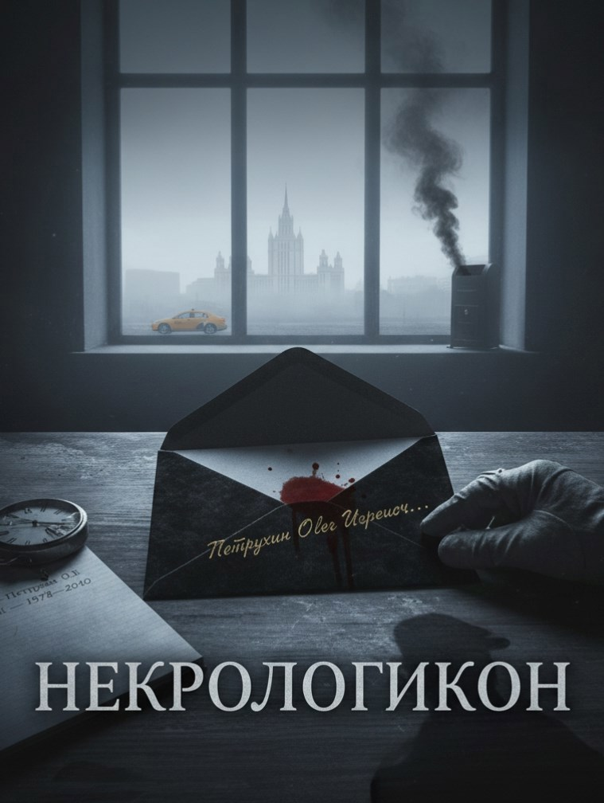

# Некрологикон

## Аннотация

Двадцать лет он работает почтальоном в службе, которой нет на картах. Вместо писем он разносит черные конверты с точной датой смерти адресата. Он — молчаливый свидетель того, как это знание ломает, смиряет или сводит с ума. Он знает одно: система никогда не ошибается.

## Обложка

### Глава 1

Глава 1

Москва никогда не спит, но в пять утра она хотя бы дышит ровнее. Олег Петрухин любил это время. Время, когда город принадлежал ему, дворникам и редким такси. Он был не просто почтальоном. Двадцать лет он служил в особом, несуществующем на картах отделении почты. Он был вестником. Вестником последней даты.

Каждое утро в его казённой брезентовой сумке, среди рекламных буклетов и счетов за коммуналку, лежал один-единственный чёрный конверт. Плотный, бархатный на ощупь картон. На лицевой стороне – каллиграфически выведенный адрес и имя. Под ними – две даты, разделённые тире. Первая всегда указывала на прошлое, вторая — на будущее. На десять, пятнадцать, иногда двадцать лет вперёд.

Олег не знал, кто и как пишет эти некрологи. Он не знал, по какому принципу выбираются получатели. Он был лишь передаточным звеном, молчаливым исполнителем. Содержимого он не видел, но знал, что там. За двадцать лет несколько человек, сломленных или, наоборот, истерически-любопытных, вскрывали конверт прямо при нём. Внутри был аккуратно отпечатанный газетный столбец. «С глубоким прискорбием сообщаем…», «Безвременно ушёл из жизни…», «После продолжительной болезни на 83-м году…».

Олег вёл дневник. Не для сентиментальности. Сухая тетрадь в клетку, где каждой чёрной доставке отводилась строчка: дата вручения, адрес, ФИО и две даты с конверта. Иногда он, спустя годы, проезжая мимо знакомого дома, видел на подъезде траурное фото. И даты совпадали. Всегда. Детали тоже совпадали: это подтверждалось в тех редких случаях, когда ему зачитывали текст. Инженер, которому предрекли смерть в ДТП, погиб под колёсами самосвала. Старушка, чей некролог говорил об инсульте, тихо угасла в своей постели. Система работала без сбоёв. Он разносил факты.

За двадцать лет Олег усвоил: столкни человека с датой его смерти, и с него слетит всё наносное. Останется лишь суть, порой уродливая, порой — неожиданно прекрасная.

Был молодой, лощёный бизнесмен из Москва-Сити, живущий в стеклянной башне на 60-м этаже. Он взял конверт двумя пальцами, брезгливо оглядел Олега с ног до головы.

– Что это за идиотские розыгрыши? Я вызову полицию.

– Это вам, – тихо сказал Олег.

Мужчина увидел даты. На скулах проступила нездоровая бледность. Дата смерти – через 12 лет. Вполне себе расцвет сил. Он сжал кулаки.

– Пошёл вон! – он не закричал, а прошипел, и швырнул конверт Олегу в грудь. – Вон отсюда!

Конверт упал на дизайнерский коврик. Олег молча развернулся и ушёл. Он знал, что мужчина подберёт его, как только закроется дверь лифта. Ярость была лишь маской. Олег видел, как за ней дрожит человек, только что заглянувший в свою могилу.

Была старушка, Анна Сергеевна, в хрущёвке в Беляево, пахнущей корвалолом и яблочными пирогами. Она взяла конверт дрожащими, в пигментных пятнах, руками. Надела очки, всмотрелась в даты. Её смерть была назначена через 18 лет. Ей тогда должно было исполниться 97. Она посмотрела на Олега поверх очков, и в её глазах не было страха, лишь грустная улыбка и такая тихая глубина, будто она смотрела на него с финишной черты очень длинной дороги.

– Что ж, – прошептала она, прижимая конверт к груди. – Спасибо, сынок, что предупредил. Успею носки внукам довязать. И кота пристроить. Зайдёшь на чай как-нибудь?

Олег не зашёл. Он никогда не возвращался.

Был художник с Арбата, вечно пьяный и гениальный. Он выхватил конверт, вскрыл его тут же, пробежал глазами по тексту, расхохотался.

– «Погиб в результате несчастного случая»! Через 15 лет! Ха! Да я каждый день живу как несчастный случай! Значит, у меня есть ещё 15 лет, чтобы пить, творить и любить! Спасибо, почтальон! Ты принёс мне не приговор, а отсрочку!

Он сунул Олегу помятую сторублёвку и захлопнул дверь, из-за которой тут же полилась громкая музыка. Это была странная реакция — смех человека на эшафоте, получившего известие, что казнь отложена.

Были и те, кто просто молчал. Молча брали конверт, молча смотрели на даты, и их лица становились непроницаемыми. В их глазах Олег видел, как за несколько секунд рушились планы, ипотеки, мечты об отпуске, и на их месте вырастала серая стена с одной-единственной цифрой. Это были самые страшные.

* * *

В то утро, 14 сентября 2025 года, он, как обычно, запустил руку в сумку. И его пальцы наткнулись на знакомый бархатный картон. Он вытащил его. И замер.

Адрес был его. Улица Академика Янгеля, дом 14, корпус 2, квартира 112.

Имя было его. Петрухин Олег Игоревич.

В груди будто оборвался трос. Сердце, на миг замёршее, ударило в рёбра — раз, другой, часто, панически. Кончики пальцев онемели от внезапного холода. Он посмотрел на даты.

12.04.1978 – 14.09.2040

Ровно пятнадцать лет. День в день.

Всё вокруг исчезло: шум улицы, утренний свет, сам воздух. Остался только этот чёрный прямоугольник в руках и выведенные на нём цифры. Он стал одним из них. Одним из тех, кому он двадцать лет приносил дурные вести. Теперь весть пришла к нему.

Он не пошёл на маршрут. Впервые за двадцать лет. Вернулся домой, в свою маленькую однокомнатную квартиру, сел на кухне и положил конверт на стол.

Что теперь?

Впасть в ярость, как тот лощёный из Сити? Бессмысленно. Он сам был ходячим доказательством того, что система не ошибается. Удариться в загул, как художник с Арбата, и прожечь остаток дней в угаре? Это противоречило всей его тихой, размеренной жизни. Оставалось смириться, как Анна Сергеевна. Принять и начать методично закрывать дела. Но ему было всего 47. Смириться с тем, что всё закончится в 62? Это казалось предательством по отношению к самому себе.

Проклятие. Вот чем было это знание. Теперь всё станет предзнаменованием. Любой кашель — не начало ли «продолжительной болезни»? Та машина за углом — не она ли ждёт меня в некрологе? Эта скользкая ступенька — не тот ли самый «несчастный случай»? Жизнь превращалась в минное поле, и он знал точную дату, когда подорвётся.

Олег смотрел на конверт. Внутри – сценарий его смерти. Детали. Причина. Возможно, даже слова прощания от несуществующих пока ещё скорбящих. Если он прочтёт, его следующие 15 лет будут подчинены этому тексту. Он будет либо бежать от него, либо покорно идти навстречу. Но свобода выбора – та самая иллюзия, которая делает жизнь жизнью – исчезнет.

Он двадцать лет разносил приговоры. И теперь понял, что единственная власть, которая у него осталась – это власть не знать. Не знать деталей. Принять дату как факт, но отказаться от сценария.

Олег Петрухин взял конверт со стола. Он не стал его рвать в гневе или отчаянии. Спокойным, выверенным движением, каким он двадцать лет опускал письма в почтовые ящики, он поднёс уголок конверта к газовой конфорке.

Синий огонёк лизнул чёрный картон. Тот нехотя задымился, потом по краю побежала оранжевая кайма. Олег смотрел, как огонь пожирает его имя, его адрес и две даты. Он не отвёл глаз, пока пламя не добралось до его пальцев. Он бросил горящий остаток в раковину.

Он принял то, что было на лицевой стороне конверта, — дату. Этого было достаточно. Но подробности, причина, слова скорби – всё это он отдал огню.

Чёрный пепел лежал в раковине.

Олег открыл кран. Вода смыла последние следы его некролога.

Впереди были тысячи дней. Впервые за долгие годы он не знал, что принесёт следующий.

