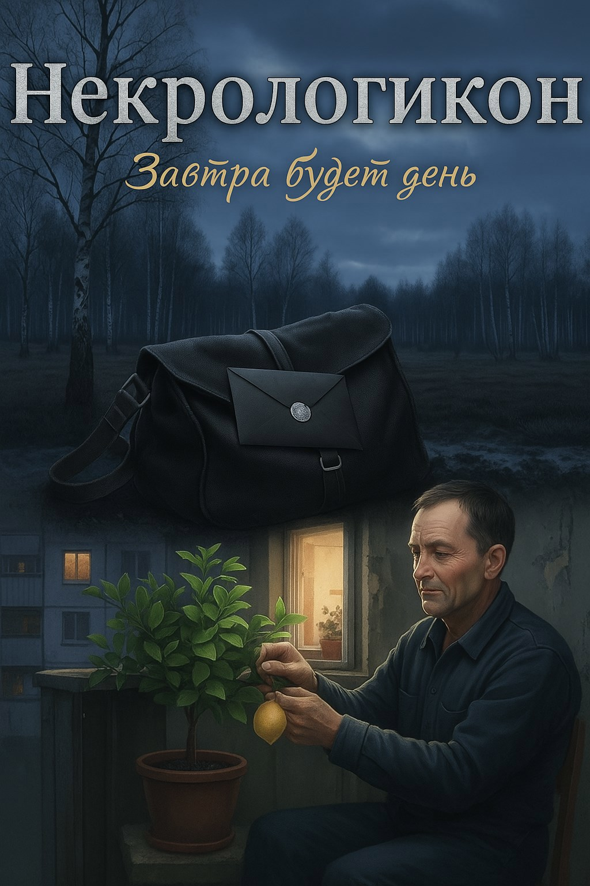

# Некрологикон: Завтра будет день

## Аннотация

Олег Петрухин — не просто почтальон. Двадцать лет он служит в тайном отделении, которого нет на картах, и каждое утро в его брезентовой сумке лежит один-единственный черный конверт. Внутри — аккуратно отпечатанный некролог с двумя датами: рождения и смерти, что наступит в будущем. Он — вестник последней даты, молчаливый исполнитель в Системе, которая никогда не дает сбоев. Он видел всё: гнев, торг, отчаяние и смирение, но сам всегда оставался лишь функцией, отгороженной от мира чужих трагедий.
Но что, если однажды Система выберет своей целью самого вестника? В одно серое утро Олег достает из сумки конверт, на котором стоит его собственное имя и адрес. До конца отмерено ровно пятнадцать лет. Двадцать лет он разносил приговоры, а теперь получил свой. Можно ли сбежать от судьбы, если ты сам — её живое доказательство? Можно ли научиться по-настоящему жить, зная точную цену каждого оставшегося дня, или это знание — лишь билет в персональный ад?

## Обложка

