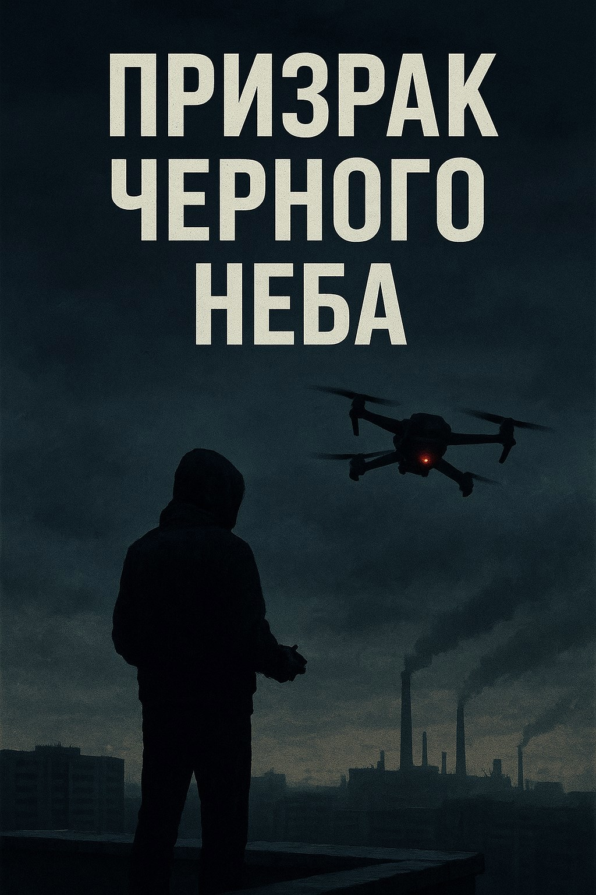

# Призрак чёрного неба

## Аннотация

Игнат, позывной «Призрак», вернулся с войны, но война его не отпустила. Его уникальный талант — виртуозное управление боевыми FPV-дронами — оказывается востребован теми, кто действует в тени. Он становится идеальным наёмным убийцей: безликим, точным, отстранённым. Для него каждая цель — лишь точка на экране, а каждое убийство — просто выполненное полётное задание. Но что, если у следующей цели окажется лицо, которое разрушит его холодный мир протоколов и заставит столкнуться с призраком, от которого он бежал всю свою жизнь?

## Обложка

### Глава 1

Глава 1

Ветер на крыше девятиэтажки — другой. Не тот, что внизу, у подъезда, где он путается в голых ветках тополей и затихает в нишах мусорных баков. Здесь, наверху, он чистый. Свободный. Игнат чувствовал его кожей лица: плотный, колючий поток, пахнущий морозом и едва уловимой металлической пылью с трубы ТЭЦ.

Он положил ладони на шершавый бетонный парапет, ощущая, как крошки забиваются под ногти. Холод тут же впился в кожу. Его взгляд зацепился не за панораму правого берега, тонущего в сером ноябрьском сумраке, а за голубя. Птица билась с ветром в воздушном коридоре между двумя панельными башнями.

Её сносило. Она взмахивала крыльями чаще, пытаясь выровнять курс, но порыв бросал её в сторону. Большой палец правой руки Игната, лежащей на бетоне, едва заметно дёрнулся. Ещё раз. Движение стика на пульте. В голове — не птица. Объект, теряющий стабильность. Боковой ветер, порывы до двенадцати метров в секунду. Вектор смещения. Нужна поправка.

Он втянул носом плотный воздух. Дым из трубы ТЭЦ стелился почти параллельно земле, уходя на юго-запад. Данные приняты. Интерфейс реальности. Он видел мир как полётное задание.

Резкий хлопок входной двери в подъезде. Звук долетел до него как будто с задержкой, плоский и чужой. И интерфейс погас. Игнат моргнул. Голубь пропал из фокуса, став просто серой точкой на фоне серого дома. Холод перестал быть данными. Мышцы свело от озноба. Игнат развернулся и спустился с крыши.

Его квартира была пустой. Не в смысле отсутствия мебели — стол, стул и застелённая армейским одеялом кровать были на месте. Она была пуста от жизни. Ни фотографий на стенах, ни книг на полке, ни случайной чашки на столе. Порядок был абсолютным, как в обеззараженном боксе.

Единственное яркое пятно — стеллаж у окна. Под фиолетовым светом фитолампы стояли горшки с суккулентами. Эхеверии, хавортии, литопсы, похожие на серые камни. В свете лампы висела пыль, невидимая днём. Медленно кружилась в фиолетовом столбе света.

Игнат подошёл к стеллажу. Пальцы, привыкшие к пайке миллиметровых контактов, сняли сухой, пожелтевший лист с основания толстянки. Ни одно движение не было лишним. Он заботился об этих растениях. Поддерживал их существование. Они не требовали эмоций. Только воду и свет.

Короткая, злая вибрация на столе разрезала тишину. Старый кнопочный телефон, купленный на рынке за триста рублей. Надёжный, как автомат Калашникова. И такой же тупой. На экране высветилось СМС от банка.

Последняя выплата по контракту зачислена. Сумма была на пятнадцать тысяч меньше обещанной. Он смотрел на цифры. Ничего не дрогнуло в лице. Просто факт. Всплыла строчка из внутреннего монолога, сухая, как отчёт. *Списали за утерю имущества. Принято*.

Он знал, за какое. За тот самый ретранслятор, что сгорел от скачка напряжения.

Секундная задержка. И потеря сигнала.

Система всегда тебя обсчитает. Это не трагедия. Это правило. Он удалил СМС, стёр сообщение вместе с номером банка. Деньги — ресурс. Ресурса теперь меньше. Он положил телефон на стол, машинально протерев экран рукавом. Пластик телефона коснулся холодной столешницы.

* * *

Запах в военкомате был вечным. Смесь старой бумаги, пыли, дешёвого чая и чего-то кислого, застарелого от пота десятков людей, прошедших через эти стены. На выцветшей стене висел портрет президента. Между стеклом и рамкой застряла крошечная мёртвая муха.

Виктор Семёнович Курахин, замначальника по социальному обеспечению, листал дело Игната. Тишину в кабинете нарушал только скрип стула под его грузным телом и шелест страниц.

— Тихонов, значит, — голос у Курахина был монотонный, без интонаций, будто он зачитывал приказ. — Так. Характеристика отличная. Специалист узкого профиля. Нам такие нужны… на учёте.

Игнат смотрел на потёртые манжеты своей куртки.

— Принял.

— Тут подписать надо. В трёх экземплярах, — Курахин пододвинул пачку бумаг. — Что с дальнейшим трудоустройством? Варианты есть?

Игнат молчал. Вариантов не было. Охранник в супермаркете? Сборщик мебели? Всё это казалось… нереальным. Как пытаться управлять дроном с помощью молотка.

Курахин сделал паузу. Его взгляд скользнул по той же куртке, потом по лицу Игната, по его рукам. Взгляд оценщика.

— Понимаю… — сказал он тем же ровным голосом. — Бывает, что гражданская жизнь… ну… не сразу принимает. А навыки терять нельзя. Это ресурс. Ценный.

Игнат медленно читал бумаги. Постановка на учёт, согласие на обработку данных, подписка о неразглашении. Стандартный набор. Он брал ручку, и Курахин наблюдал за его руками. Длинные пальцы, без дрожи. Идеально.

Когда Игнат потянулся за последним листом, Курахин придержал его. Под ним лежал маленький клочок бумаги без опознавательных знаков. Простая белая бумажка, вырванная из блокнота.

— Есть тут… возможность, — сказал Виктор Семёнович, не меняя тона. — Неофициальная. Для людей с вашим опытом. Работа непыльная. Наблюдение, технический контроль.

Он говорил так, будто предлагал подписаться на газету.

— Если интересно — позвоните. Номер одноразовый. Телефон нужен будет чистый. Не тот, на который выплаты приходят.

Он убрал руку. Взгляд Игната скользнул с листка с номером на бесцветные глаза Курахина. В них не было ни предложения, ни угрозы. Только сухой деловой интерес. Оценка ресурса.

Игнат ничего не сказал. Он просто взял листок вместе с остальными документами, сложил их и убрал во внутренний карман куртки. Курахин едва заметно кивнул.

* * *

Заброшенный радиозавод на правом берегу гудел на сквозняках, как скелет доисторического животного. Ржавые фермы, выбитые окна, ветер в пустых цехах. Но в одном из дальних помещений на втором этаже был порядок. Его порядок.

Рабочий стол, идеально чистый. Инструменты разложены на прорезиненном коврике: каждый на своём месте, параллельно краю. Паяльная станция, осциллограф, тиски. Воздух пах канифолью и душком гниющей водой в луже у стены, куда с потолка капало сквозь дыру в бетоне.

Игнат работал. Его руки двигались плавно, уверенно. Пайка полётного контроллера. Капля олова растеклась по контакту идеально ровным, блестящим мениском. Он был полностью погружён в процесс. Здесь не было прошлого и будущего. Не было денег и военкомата. Была только задача. Контакт. Температура жала. Сопротивление.

Он собирал себя так же, как этот аппарат. Винтик к винтику, провод к проводу.

Он закончил сборку. Подключил аккумулятор. Короткий писк инициализации. Светодиоды на плате моргнули в нужной последовательности. Игнат надел FPV-очки.

Мир исчез. Привычное давление на скулы и переносицу. Зернистая, чуть искажённая по краям картинка с курсовой камеры. В углах — цифры телеметрии. VOLTAGE: 16.8V. RSSI: 100%. Горизонт. Реальность сменилась интерфейсом. В этом интерфейсе он был дома.

Крыша завода. Ветер трепал полы куртки. Игнат поставил дрон на кусок старого рубероида, отошёл на пару шагов. Проверка аппаратуры. Тумблер arm/disarm. Реакция на стики. Всё в норме. Он не смотрел на дрон. Он смотрел на небо, на порывы ветра, поднимающие пыль с крыши.

Щелчок тумблера. Высокий гул четырёх моторов ударил по ушам. Дрон резко, почти вертикально, ушёл вверх, превращаясь в чёрную точку на фоне свинцового неба.

Игнат замер. Только пальцы на пульте совершали едва заметные, точные движения.

Полёт над бесконечной промзоной. Ржавые крыши цехов, трубы, железнодорожные пути, похожие на шрамы на теле земли. «Чёрное небо» Красноярска было не метафорой. Это была плотная, серая пелена, сквозь которую едва пробивался свет.

Дрон нырнул вниз, пронёсся в нескольких метрах над землёй, потом снова взмыл вверх, сделав бочку. Он влетел в остов ржавого башенного крана, виртуозно лавируя между стальными конструкциями. Это был чистый, незамутнённый контроль. Свобода.

Внезапно из-за угла соседнего цеха вылетела стая голубей. Прямо по курсу. *Объекты. Неучтённые. Вектор пересекается*. Резкий рывок стика вправо и вверх. Дрон клюнул носом, уходя от столкновения. Краем пропеллера он всё же задел одну из птиц. Картинку на мгновение тряхнуло. Серое перо промелькнуло перед камерой. *Вибрация на третьем моторе. Незначительная.* Он выровнял аппарат. Стая хаотично разлетелась. Он перевёл дрон в режим зависания, проверяя телеметрию. Всё в норме. Повезло.

Он развернул аппарат и повёл его обратно. Полёт закончился. Дрон идеально завис в метре от него. Игнат снял очки. Мир снова стал плоским, тусклым и тяжёлым. В ушах ещё звенел тонкий гул моторов. Он поймал дрон рукой, щёлкнул тумблером, глуша двигатели. Тишина.

Игнат сидел в своей мастерской и чистил пропеллер, который задел голубя. Крошечная капля крови и серая пушинка. Он вытер их тряпкой, смоченной в спирте. Рядом на столе лежал новый, «чистый» телефон. Дешёвый китайский андроид. Он не смотрел на него, но ощущал его, как заряженный конденсатор на плате — тихий, но готовый разрядиться в любой момент.

Резкая вибрация заставила телефон сдвинуться на металлической столешнице, издав неприятный, дребезжащий зуд. Он затих. Игнат не шевелился.

Прошло десять секунд. Двадцать. Он закончил с пропеллером и отложил его в сторону. Потом медленно взял телефон.

Сообщение. Без текста. Номер не определён. Просто вложение.

Он открыл его. Фотография. Женщина лет сорока пяти, уставшее, но приятное лицо. Снято было явно скрытно, с большого расстояния. Качество плохое. Под фотографией — строчка адреса. Улица на левом берегу. Элитный район.

Игнат смотрел на фото несколько секунд. Лицо — непроницаемая маска.

Просто данные для обработки.

Он положил телефон на стол. Работа. Просто работа.

### Глава 2

Глава 2

Ночь легла на город, как бетонная плита, из-под которой сочился тусклый свет фонарей. Крыша девятиэтажки на левом берегу — плоская, залитая гудроном и усыпанная крошкой битого стекла, хрустевшей под подошвами берцев. Ветер, прилетевший с Енисея, был тяжёлым и мокрым. Он тащил за собой невидимый шлейф заводской гари с правого берега.

Игнат не осматривался — он сканировал. Дверь на крышу, запертая на ржавый засов, поддалась с тихим скрежетом, но без  предательского скрипа — днём он залил петли WD-40.

Пути отхода: эта дверь, пожарная лестница на той стороне. Точки наблюдения: окна соседней высотки, тёмные и слепые. Мёртвые зоны: за коробом вентиляционной шахты. Он опустил рюкзак на землю именно там.

Из рюкзака появился кусок плотного брезента, который Игнат расстелил на шершавом рубероиде. Его чистая зона. Затем — жёсткий пластиковый кейс. Два щелчка замков — сухие, короткие — утонули в ровном гуле ветра. Внутри, в идеально вырезанных ложементах из чёрного пенополимера, лежал его инструмент.

Пульт управления с длинными стиками. FPV-очки, похожие на голову футуристического насекомого. Компактный ретранслятор. И сам дрон со снятыми пропеллерами. Он достал из отдельного кармашка четыре лопасти, привычным движением закрепил их на моторах. Сотни повторений в пыли, в грязи, под огнём — и вот рождается ритуал, единственное, что возвращает контроль.

Он провёл подушечкой пальца по карбоновому лучу рамы. Трещин нет. Достал баллончик со сжатым воздухом, короткими резкими пшиками продул моторы. Пыль, которой здесь дышали все, была врагом. Он подсоединил аккумулятор. Тихий писк, серия музыкальных трелей — полётный контроллер прошёл самодиагностику.

*ВМГ — норма. Видеолинк — канал чистый. Запись на бортовую карту активирована.* Он замер. GPS — захват, семь спутников. Точность низкая. Ждём. Он ждал. Ветер трепал воротник куртки. Из окна на седьмом этаже напротив донёсся короткий всплеск женского смеха — резкий, чужеродный звук в его стерильном мире. Он не повернул головы. Помеха в канале. Игнорировать.

Появился восьмой, девятый. Показатель HDOP упал до 1.2. Достаточно для удержания точки в случае потери сигнала. Он надел очки. Реальность — холодная крыша, огни города, смог — исчезла. Сменилась зернистым чёрно-белым изображением с курсовой камеры, испещрённым зелёными цифрами телеметрии.

Мир снова стал интерфейсом. Понятным. Контролируемым. Он был готов.

Взлёт был не взлётом, а отделением от поверхности. Дрон, похожий на расплющенного чёрного паука, поднялся на три метра, завис, а затем скользнул вперёд, ныряя за парапет крыши. Игнат не двигался, лишь большие пальцы едва заметно танцевали на стиках.

Мир в очках нёсся навстречу. Стена дома, тёмные окна, провода. Он вёл аппарат низко, над припаркованными машинами, используя их как прикрытие от случайных взглядов. Перекрёсток. Улица. Семьдесят метров до цели. Ресторан на втором этаже офисного здания. Панорамные окна светились тёплым, уютным светом.

Дрон поднялся вдоль стеклянной стены, замер в полуметре от неё, невидимый с улицы на фоне тёмного ноябрьского неба. Игнат нашёл цель. Они сидели за столиком у окна.

*Объект А — женщина, около сорока, по фото. Объект Б — мужчина, лет двадцать пять*. *Физический контакт — его рука лежит на её. Эмоциональная реакция — оба улыбаются*. Он переключил управление на подвес камеры, сделал несколько снимков. Лица, руки, бокалы с вином. Всё чётко. Задача почти выполнена.

И тут мужчина достал что-то из кармана. Не коробочку с украшением. Не телефон. Маленькую, неуклюжую деревянную фигурку жирафа, вырезанную, судя по всему, вручную и довольно грубо. Он протянул её женщине.

Она взяла жирафа двумя руками, с такой осторожной нежностью, словно он был из хрусталя. Поднесла к лицу, рассматривая. Улыбка исчезла, сменившись чем-то другим. Усталым, но настоящим. В перекрестье была уже не «объект А». Женщина. Зелёные цифры телеметрии на миг поплыли, потеряв резкость. В ушах застучал собственный пульс, накладываясь на гул моторов. Палец на стике застыл, словно контакт пропал.

*Так. Сбой*. Он резко тряхнул головой, возвращая фокус. Сделал ещё один снимок — крупный план: её пальцы, сжимающие деревянную игрушку. *Данные собраны. Отработал.*

Возвращение было быстрым, механическим. Посадка на брезент, точно в центр. Он отсоединил аккумулятор, и мир в очках погас. Игнат снял их. Холодный ветер и шум далёкой трассы разом ударили по ушам и коже. Он снова был здесь. В теле. И это было больно.

Пустынная набережная возле Коммунального моста. Енисей лениво тащил к северу вязкую кашу из снега и льда — шугу. От воды поднимался густой пар, который тут же смешивался со смогом, создавая плотную, непроглядную пелену. Пахло мокрой глиной и дизельным выхлопом от редких машин на мосту.

Игнат стоял, прислонившись к холодным гранитным перилам. Он пришёл на пятнадцать минут раньше. Ждал. Он не смотрел по сторонам, а слушал. Ветер. Шум воды. Гудение города. Затем — шаги. Тяжёлые, размеренные. Шаги человека, которому не нужно торопиться. Он не обернулся.

Виктор Семёнович поравнялся с ним, остановился, глядя на чёрную воду. На нём был тот же поношенный костюм, та же аура казённой усталости.

— Чисто? — голос Курахина был ровным, без эмоций.

— Принято, — ответил Игнат.

Он вынул из кармана флешку. Маленький кусок чёрного пластика. Холодный и гладкий. И протянул Курахину. Тот взял её, даже не посмотрев, сунул в карман пальто. Взамен из того же кармана появился пухлый бумажный конверт. Игнат взял его. Бумага была тонкой, шершавой и хранила тепло чужого тела. Он переложил тёплый, шершавый конверт в другую руку. Пальцы, ещё помнившие ледяную гладкость флешки, неприятно покалывало.

— Жди, — сказал Курахин. Это был весь диалог. Он развернулся, сделал несколько шагов и туман поглотил его силуэт. Игнат постоял ещё ровно две минуты, как того требовал его внутренний протокол безопасности. Потом сунул конверт во внутренний карман и пошёл в противоположную сторону, к автобусной остановке. Он не пересчитывал деньги. Система не обманывает. Пока ты ей нужен.

* * *

Магазинчик ютился в полуподвальном помещении на правом берегу. Пахло канифолью, перегретым пластиком и пылью. Под стеклом витрин, в ярком свете светодиодных лент, лежали россыпью детали чужого хобби: моторы, пропеллеры, полётные контроллеры, камеры. Мир, в котором Игнат был своим.

Молодой продавец-консультант, парень с модной стрижкой и татуировкой на предплечье, подошёл к нему с заученной улыбкой.

— Могу помочь? Что-то конкретное ищете?

— Видеопередатчик, — коротко ответил Игнат, его взгляд скользил по полкам.

— О, есть отличная модель! Rush Tank, два ватта мощности. Понимаете, он бьёт на десять километров по прямой! Для дальних полётов — самое то. Все берут. Игнат остановил взгляд на парне.

— Мне не дальность. Мне латентность. Какая задержка видеосигнала на TBS Fusion с последней прошивкой? Улыбка консультанта стала менее уверенной.

— Эм… ну, там стандартные протоколы… задержка минимальная. Вроде никто не жаловался.

— Мне не «вроде». Мне цифры. В миллисекундах. И как он держит сигнал в условиях плотной городской застройки? Железобетон, сотовые вышки на крышах, эфир забит вайфаем. Он не «потечёт»?

Консультант окончательно сник. Профессиональная спесь слетела с него, как шелуха. Он смотрел на осунувшееся лицо Игната, на его спокойные, пустые глаза, и понимал, что перед ним не гонщик-любитель.

— Я… я не знаю, — честно признался он. — Надо на форумах смотреть.

— Понятно. Игнат отвернулся обратно к витрине. — Дайте вот этот VTX. И два вот этих мотора. И антенну «клевер» левой поляризации.

Он говорил тихо, но каждое слово было точным. Он точно знал, что ему нужно.

Консультант пробивал товар, не поднимая глаз. Его движения стали резкими, почти суетливыми. Протянул пакет, стараясь не коснуться пальцев Игната.

— С вас… девять четыреста, — сказал парень, его голос звучал уже иначе.

С уважением и лёгкой опаской. Игнат отсчитал деньги из конверта. Без сдачи. Молча забрал пакет с деталями и, не прощаясь, вышел. Консультант проводил его взглядом и почему-то решил, что лицо этого покупателя лучше забыть.

В мастерской пахло остывающим металлом. Игнат склонился над столом, зажав в «третьей руке» новый видеопередатчик. Кончик паяльника коснулся контакта, капля олова расплавилась, издав тихое шипение и выпустив струйку белого дыма. Он работал медленно, сосредоточенно. Каждая пайка была идеальной. Крепкой.

Резкий, анонимный рингтон «чистого» телефона разрезал тишину. Звук был чужим в этом пространстве. Игнат вздрогнул, отложил паяльник. Вытер руки о промасленную ветошь. Нажал на приём вызова.

— Слушаю.

В трубке не было голоса. Был скрежет. Голос, пропущенный через дешёвый модулятор, скрипел и трещал, лишённый интонаций.

— Есть объект.

Игнат молчал, слушал.

— Офисное здание. Серверная. Нужно доставить посылку.

Пауза.

— Небольшое устройство. Вывести из строя электронику. Чисто. Без шума.

Игнат смотрел на разобранный дрон на столе. Полёт внутри здания. Среди бетонных стен, металлической арматуры, работающих сетей. Коридоры. Повороты. Это был высший пилотаж. Риск потерять аппарат и оставить на месте преступления свои отпечатки — почти стопроцентный. Это уже не наблюдение.

Он задал единственный вопрос, который имел значение.

— Охрана?

— Периметр, — проскрежетал голос. — Внутри — датчики движения, объёма. Схема и «окно» для прохода будут через час.

Он снова молчал. Несколько ударов сердца. Он мог отказаться. Послать этот голос к чёрту. Выбросить телефон в Енисей. И что дальше? Снова военкомат? Снова пустота?

— Принял, — сказал он.

В трубке короткие гудки. Он положил телефон на стол. В мастерской снова стало тихо, но тишина изменилась. Стала плотной, давящей. Он поднял паяльник. Рука не дрожала.

Через час на телефон пришёл зашифрованный архив. Игнат перекинул его на старый ноутбук, не подключённый к сети, и запустил программу-дешифратор. На экране медленно проступили чертежи. Поэтажные планы офисного центра «Енисей-Плаза». Схемы вентиляционных шахт, расположение камер наблюдения, зоны покрытия датчиков движения. Никаких имён, названий компаний, ничего лишнего. Только технические данные.

Игнат замер, разглядывая схему седьмого этажа. Это была не просто работа. Это была сложная задача. Почти невыполнимая. Пролететь по узкому воздуховоду, лавируя между лопастями вентиляторов, обойти датчики, выйти точно к цели.

Внешний мир, с его запахами, звуками и деревянными жирафами, перестал существовать. Осталась только схема. Задача. Чистая, холодная, понятная. Он провёл пальцем по пыльному экрану, прокладывая маршрут. Не по коридору. Через решётку вентиляции в подсобке, по главному воздуховоду, минуя датчики. Прямо к серверной.

В затхлом воздухе мастерской вдруг отчётливо запахло горящей пылью — как перед боем, когда прогревается аппаратура. Дыхание, сбитое и поверхностное весь день, впервые за долгое время стало ровным.

### Глава 3

Глава 3

Игнат ссутулился над верстаком. Свет от диодной лампы вырывал из полумрака только его руки и россыпь деталей на антистатическом коврике. Воздух, густой от металлической пыли, пропитался едким дымком остывающего припоя и слабым, почти хвойным духом канифоли.

Он не размышлял. Он работал. Фантомные боли и гул в ушах, вечные его спутники, отступили. Осталась только задача, холодная и ясная, как кристалл. И руки, знающие, что делать.

Пальцы двигались выверенно, без единого лишнего движения. Тонкая медная проволока, виток к витку, ложилась на ферритовый стержень. Не покупной модуль, а собственная сборка. Надёжнее. Мощнее. Он сам контролировал каждый параметр.

Щёлкнули кусачки, отрезая излишек провода. Крошечный винт едва не соскользнул с намагниченной отвёртки, но пальцы успели перехватить его в миллиметре от россыпи деталей. Лёгкое шипение, когда жало паяльника коснулось капли припоя. Дымок взвился вверх, пахнув той самой смесью, что въелась в его одежду и кожу. Он не замечал этого запаха. Он им дышал.

Рядом, напечатанные на 3D-принтере, лежали чёрные пластиковые крепления. Лёгкие, прочные, идеально подогнанные под раму гоночного дрона.

Игнат взял в руки небольшое устройство — ключевой узел. Собранный им генератор электромагнитного импульса. Компактный, но способный на долю секунды выжечь любую незащищённую электронику в радиусе нескольких метров.

Он установил его на раму, защёлкнул крепления. Протянул провода, аккуратно укладывая их в термоусадочные трубки. Поток горячего воздуха из строительного фена заставил пластик послушно обжать провода, превращая их в единый, монолитный жгут. Ничего не болтается. Ничто не замкнёт.

Подключение к полётному контроллеру. К отдельному, неиспользуемому каналу. На экране старого, не подключённого к сети ноутбука, он назначил на этот канал один из тумблеров на пульте. Надпись в программе была сухой и безличной: «ARM PAYLOAD». Вооружить полезную нагрузку.

Проверка. Он подключил аккумулятор. Дрон пискнул, светодиоды моргнули. На экране замелькали строчки телеметрии. Связь со спутниками — ноль. Сигнал GPS был заглушен толстыми сводами цеха. Неважно. Сегодня он не понадобится.

Он надел FPV-очки. Мир сменился зернистой серой картинкой с камеры дрона. Игнат медленно повёл стиками. Пропеллеры не вращались, но на экране он видел, как подвес камеры откликается на его движения. Он был готов.

Крыша технического этажа «Енисей-Плаза» встретила его ледяным ветром. Ноябрь в Красноярске не прощал тонких курток. Игнат поднял воротник, пряча лицо. Внизу гудел город, но здесь, наверху, царил только вой ветра в проводах и гул вентиляционных установок.

Он разложил оборудование быстро, без суеты. Рядом с собой — пульт и очки. Чуть поодаль, у самого края, — второй дрон, наблюдатель. Лёгкий, тихий, с хорошей камерой.

Сначала взлетел наблюдатель. Игнат, не надевая очков, смотрел на экран планшета. Дрон поднялся над зданием, облетел его по периметру. Парковка — почти пустая. Охрана на входе. Ничего подозрительного. Он отвёл дрон в сторону и оставил висеть, сканируя улицу.

Теперь главный.

Игнат надел очки. Реальность снова схлопнулась до картинки с помехами. Он щёлкнул тумблером. Четыре мотора взвыли, и дрон с ЭМИ-устройством оторвался от рубероида. Тяжелее обычного. В поведении чувствовалась инерция.

Он подвёл аппарат к цели — широкой вентиляционной решётке. Вход. Как на схеме. Проверив картинку с наблюдателя в последний раз, он сделал глубокий вдох. Выдох.

Дрон скользнул в тёмное устье воздуховода.

Мир исчез. Остался только узкий, пыльный тоннель, подсвеченный собственным диодом дрона. Звук винтов мгновенно изменился, стал глухим, утробным. Эхо, бьющееся о металлические стены, доносилось из шахты давящим гулом.

Первые десять метров. Прямо. Как на схеме. Впереди — поворот на девяносто градусов. Игнат плавно повёл стик.

Именно в этот момент картинка в очках рассыпалась.

Экран на долю секунды превратился в хаос цветных пикселей. Цифры телеметрии пропали. RSSI. Уровень сигнала. Он рухнул. Железобетонные перекрытия здания работали как экран.

В лёгких вдруг кончился воздух. Он почувствовал, как флисовая кофта неприятно липнет к позвоночнику. Там, где медленно стекла одна капля пота. Он замер, перестав дышать. Дрон летел вслепую. Он знал, что если сейчас дёрнуть стик не в ту сторону, аппарат врежется в стену. Конец. Провал.

Он не дёрнул. Пальцы, натренированные тысячами часов, лишь слегка качнули стик, компенсируя возможный снос.

Картинка вернулась. Такая же зернистая, но вернулась. В углу экрана замерцали цифры. RSSI — 28%. Критически низкий уровень. Ещё чуть-чуть, и сработает failsafe, дрон просто рухнет вниз.

Дыхание вырвалось из лёгких. Он продолжил полёт. Медленнее. Осторожнее. Теперь он летел не столько по камере, сколько по памяти, по той самой схеме, что отпечаталась в его мозгу. Каждый поворот, каждый изгиб.

Цифры вольтажа на экране неумолимо ползли вниз. Быстрее, чем он рассчитывал. Борьба со слабым сигналом и турбулентностью жрала энергию.

Впереди возникло то, чего на схеме не было.

Поток воздуха ударил в дрон, пытаясь развернуть его. Впереди, в боковом ответвлении, тускло вращались лопасти огромного вытяжного вентилятора. Вероятно, с кухни ресторана этажом ниже. Оттуда, из темноты, донёсся едва уловимый, неуместный здесь запах жареного лука.

Игнат ощутил, как свело челюсть. Он боролся с потоком, выравнивая аппарат. Стиками он работал на грани чувствительности, миллиметровыми движениями. Проскользнул мимо. Ещё один поворот.

И вот оно. Решётка в полу воздуховода. Прямо под ним — фальшпотолок технического помещения. Цель.

Он завис над решёткой. Картинка стабилизировалась. Здесь сигнал был лучше. Игнат опустил дрон, просовывая его через металлические планки.

Теперь он висел в небольшом пространстве между подвесным потолком и бетонным перекрытием. Провода, кабели, трубы. Он медленно двинул аппарат вперёд, пока камера не показала то, что нужно. Прямо под одной из плиток — мигающие зелёные и оранжевые огни. Серверные стойки.

Он дал газу. Дрон ударился в хрупкую плитку, проламывая её. Осколки посыпались вниз. В проломе мелькнули ряды чёрных ящиков, опутанных гирляндами проводов.

Завис над ними.

Палец нашёл нужный тумблер на пульте. Секундная задержка. Он нажал.

Камера дрона ослепла. Экран в очках на мгновение вспыхнул белым, потом по нему пробежали волны помех. Изображение вернулось, но все светодиоды на серверах внизу погасли.

Игнат быстро снял очки, схватил планшет. На экране — трансляция с уличной веб-камеры. Он смотрел на тёмное здание «Енисей-Плаза». В окнах на нужном ему этаже свет на секунду моргнул, погас и зажёгся вновь от аварийного питания.

Задача выполнена.

Он снова надел очки. Вывел дрон из-под потолка, тем же мучительным маршрутом повёл его назад, к выходу. Напряжение батареи — 11%. Почти на нуле.

Когда аппарат выскользнул из вентиляционной решётки в холодное ночное небо, напряжение не сменилось облегчением. Пульс, стучавший в ушах, стих, и на его месте остался только вой ветра. Ничего.

Он повёл дрон в сторону Енисея, наблюдая, как на карте планшета маленькая точка ползёт над тёмной водой. Щёлкнул другой тумблер — disarm. Моторы отключились. Точка на карте замерла и через секунду исчезла.

Инструмент сделал свою работу. Инструмент уничтожен. Игнат молча собрал оборудование и так же тихо, как появился, исчез с крыши.

Столовая «У Михалыча» на выезде из города работала круглосуточно. Пахло варёным мясом, дешёвым табаком и мазутом. Воздух был тяжёлым и влажным от пара, идущего от огромных кастрюль на раздаче. За липкими столами сидели дальнобойщики — хмурые, уставшие мужчины в замасленных куртках.

Игнат сел в самый дальний угол. Поставил перед собой тарелку с пельменями, от которой валил густой пар. Рядом — стакан мутного компота.

Он только что совершил стерильное, высокотехнологичное преступление в самом центре города. А теперь сидел здесь, в мире простого физического труда, горячей жирной пищи и грубых разговоров о ценах на солярку.

Он механически подцеплял вилкой пельмени, обмакивал их в сметану и отправлял в рот. Горячо. Кисло. Жирно. Он пытался каталогизировать ощущения, но они оставались чужими, внешними.

Разговоры за соседними столами доносились до него как шум помех. Кто-то ругал дороги, кто-то жену, кто-то начальство. Один из водителей громко смеялся, показывая что-то на экране телефона своему напарнику.

Игнат посмотрел на свои руки. Длинные, тонкие пальцы. Ни царапины, ни мозоля. Они пахли пластиком, а не соляркой.

Пельмени кончились. Компот тоже. На столе остались смятые купюры. Он вышел в холодную ноябрьскую ночь.

* * *

Огромная парковка гипермаркета «Лента» была почти пуста. Редкие машины стояли под тусклым светом фонарей. Ветер гонял по асфальту пластиковые пакеты и сухие листья. Вдалеке кто-то с грохотом катил брошенную тележку.

Старый «Рено» Виктора Семёновича стоял в самом дальнем углу. Фары были выключены. Игнат подошёл к ней, открыл заднюю дверь и сел. Курахин сидел на переднем пассажирском сиденье. Он даже не повернул головы.

— Телефон, — его голос был таким же уставшим, как и всегда.

Игнат молча положил «чистый» аппарат на сиденье рядом с собой.

Курахин кивнул, глядя куда-то в темноту перед собой. Он опустил руку и с соседнего сиденья поднял толстый конверт из плотной крафтовой бумаги. Не глядя, он протянул его назад.

— Твоё.

Игнат взял конверт. Он был увесистым, плотно набитым. Бумага хранила холод салона. Игнат не стал его убирать, просто держал в руке. Он ждал.

Виктор Семёнович наконец повернулся вполоборота, насколько позволяло сиденье. Его немигающие, бесцветные глаза изучали лицо Игната в полумраке.

— Чисто, — сказал он. Пауза. — Без суеты. Работа специалиста.

Слова были простые, сказанные без всякой эмоции. Но для Игната они прозвучали как окончательный вердикт. Он коротко кивнул и взялся за ручку двери. Его работа здесь закончена.

— Погоди, — голос Курахина остановил его. — Есть ещё разговор. Серьёзный.

Игнат замер, рука осталась на ручке. Тон Виктора Семёновича изменился. Усталость исчезла, остался только холодный, твёрдый металл.

— Есть проблема, — сказал Курахин, теперь глядя прямо в глаза. — Человеческий фактор. Её надо убрать. Окончательно.

Воздух в машине вдруг стал плотным, как вата. Игнат сделал вдох, но лёгкие остались пустыми.

— Я… не по этой части, — тихо произнёс он, сам удивляясь, как глухо прозвучал его голос. — Я технарь.

Уголки губ Курахина дёрнулись в подобии усмешки.

— Технарь? То, что ты сделал сегодня… это уже не техника. Это подготовка. А теперь — сам выход. Ты же понимаешь, разница небольшая.

Игнат медленно покачал головой.

— Нет.

Курахин помолчал, его взгляд стал тяжелее. Он не повышал голоса, не делал резких движений. Вся угроза была в его спокойствии.

— Игнат, — его голос стал тихим, почти доверительным, и от этого ещё более страшным. — На войне ты делал и не такое. Гораздо хуже. Или ты забыл, как это бывает? Когда приказ есть приказ.

Он снова сделал паузу, давая словам впитаться.

— Подумай. Это очень большие деньги. В два раза больше, чем ты держишь в руках. И очень большие проблемы, если ты откажешься. Ты ведь… уже в деле. Понимаешь?

Он не ждал ответа. Разговор был окончен. Курахин медленно, демонстративно отвернулся и снова стал смотреть перед собой, в темноту. Он просто выключил Игната из своего поля зрения.

Игнат сидел ещё несколько секунд в оглушительной тишине, нарушаемой лишь воем ветра снаружи. Рядом с ним, на сиденье, лежал телефон-улика. В руках — конверт с деньгами, который вдруг стал невероятно тяжёлым. Он посмотрел на неподвижный затылок Курахина.

Выхода не было. Ни из этой машины. Ни с этой парковки. Ниоткуда.

### Глава 4

Глава 4

Деньги жгли ляжку сквозь ткань спортивных штанов. Не теплом — холодом. Как кусок сухого льда. Игнат сидел на шатком табурете, и этот холод расползался от кармана по всему телу.

Часть наличных он потратил в тот же день. Через анонимный аккаунт он нашёл в интернет объявление: старый, неприметный Ford Focus. Встретился с владельцем на окраине, не торгуясь, отдал деньги. Десять дней на перерегистрацию хватит. Машина была расходником. Как дроны.

В неподвижном воздухе мастерской, пахнущем пылью и старым маслом, всё было как всегда. На верстаке — разобранный полётный контроллер. Деньги, лежавшие в кармане, ничего не изменили. Гул в голове не стих, он просто стал ровнее. Игнат снова был на исходной.

Новый, «чистый» телефон завибрировал на верстаке с сухим, раздражающим дребезжанием. Номер скрыт. Игнат поднёс трубку к уху, не говоря ни слова.

— Есть ещё одна задача, — голос Курахина был таким же серым и безликим, как бумага в его кабинете. — Более… профильная. Не курьерская.

Игнат молчал, слушая.

— Один наш партнёр ведёт строительство. Конкуренты мешают. Нужно немного помочь. Оптимизировать их издержки. На объекте стоит дорогое геодезическое оборудование. Швейцарское. Очень чувствительное к внешним воздействиям.

— Координаты, — коротко бросил Игнат.

— Уже выслал. Срок — сорок восемь часов. Оплата — двойная. Справишься?

— Принял, — сказал Игнат и отсоединился.

Он открыл сообщение. Координаты точки на карте промзоны за Октябрьским мостом. Фотография оборудования: сложный комплекс из теодолита и лазерного сканера на треноге, похожий на футуристического часового.

Двойная оплата. Это означало риск. Холод в теле отступил, сменившись знакомой собранностью. Мышцы напряглись. Он встал и подошёл к верстаку. Началась работа.

Игнат разложил на чистой ветоши компоненты для нового аппарата. Мощные моторы T-Motor с агрессивным изгибом лопастей. Дальнобойный видеопередатчик Rush Tank в ребристом алюминиевом корпусе. Полётный контроллер с быстрым процессором F7.

Он работал молча. Пальцы двигались без суеты, с точностью сапёра. Ни одного лишнего жеста. Он не думал о задаче. Он думал о контактах, о прочности пайки, о калибровке гироскопа.

Резкий, почти хвойный запах канифоли смешивался с едва уловимым запахом сырого бетона. Паяльник с тихим шипением плавил олово, превращая его в блестящие капли, которые намертво скрепляли провода и микросхемы.

Сборка рамы из углепластика. Настройка прошивки Betaflight через старый, не подключённый к сети ноутбук. Каждая строчка кода, каждая настройка PID-контроллера — всё было подчинено одной цели: максимальная скорость, предельная манёвренность, стабильность в последнем пике.

Потом наступил самый тихий этап.

Он достал из металлического ящика свёрток промасленной бумаги. Развернул. Внутри лежал брусок пластита, похожий на кусок серого хозяйственного мыла. Он работал со взрывчаткой так же спокойно, как до этого с микросхемами. Аккуратно, без спешки, сформировал компактный заряд, достаточный, чтобы превратить высокоточную оптику в оплавленный мусор. Он закрепил боевую часть на раме дрона, подсоединил провода детонатора к отдельному каналу приёмника.

Подключил аккумулятор. Моторы издали тихую, пятитональную мелодию инициализации. Система была готова.

Разведка началась в тот же вечер.

Для этого Игнат использовал не смертоносный гоночный дрон, а его противоположность. Маленький, белый DJI Mavic Mini, который выглядел как дорогая игрушка. Почти бесшумный, он терялся на фоне низкого, подсвеченного городом неба.

Он сидел в салоне того самого «Форда», припаркованного в тупике с видом на стройплощадку. Объект был обнесён бетонным забором с колючей проволокой. В свете одинокого прожектора виднелись силуэты недостроенных конструкций, горы щебня и бытовка, из окна которой лился тусклый свет.

«Мавик» поднялся на высоту ста метров. В объектив попала фигура охранника, вышедшего из бытовки покурить. Один. Маршрут обхода предсказуемый: вдоль забора, раз в час. Камеры были, но дешёвые, с большими слепыми зонами.

Цель стояла под брезентовым тентом в центре площадки. Уязвима. Точка взлёта — с крыши заброшенного склада через дорогу. Подлёт на предельно малой высоте, в тени бетонных конструкций, в момент, когда охранник будет на дальнем конце периметра.

Время от взлёта до контакта — не более тридцати секунд.

Ночь. Мелкая изморось секла лицо.

Игнат лежал на холодной, покрытой крошкой рубероида крыше. Под ним был расстелен кусок брезента, но сырой ноябрьский холод уже пробрался сквозь куртку. Рядом, накрытый куском полиэтилена, ждал своего часа дрон. Чёрный, угловатый, с хищно наклонёнными вперёд моторами.

Он не думал о деньгах. Не думал о том, что будет потом. Ветер. Порывы до пяти метров в секунду, с северо-запада. Аккумулятор полный, прогретый за пазухой. Сигнал видео — чистый.

Он отхлебнул из термоса горький, обжигающий кофе. Такой же — из цикория, с привкусом металла от армейской фляги — он пил в ту последнюю ночь перед… Он мотнул головой, отгоняя образ.

На стройплощадке скрипнула дверь бытовки. Охранник вышел на очередной обход.

Время пошло.

Пальцы пробежались по тумблерам на пульте. Питание. Видеосигнал. GPS-модуль деактивирован. Всё в норме. Глубокий, рваный вдох наполнил лёгкие ледяным воздухом.

Плавное движение стика газа вверх.

Пропеллеры с воем рассекли сырую атмосферу. Дрон, качнувшись, сорвался с крыши и нырнул во тьму.

Игнат натянул FPV-очки. Реальность сменилась зернистой, чёрно-белой картинкой, летящей сквозь ночь.

Он провёл дрон над забором, резко спикировав в слепую зону камеры. Низко, в метре над землёй, усеянной арматурой и строительным мусором. Картинка на мгновение пошла рябью — порыв ветра качнул антенну на крыше. Пальцы инстинктивно скорректировали курс. Проскользнул между двумя бетонными колоннами.

Впереди показался тент.

Он навёл цифровое перекрестие на его центр. Дистанция — пятьдесят метров. Тридцать. Десять.

Большой палец правой руки лёг на тумблер с красным силиконовым колпачком. Активация.

Внутренний голос. Холодный. Чужой.

*Цель в зоне поражения. Работаю.*

Палец нажал на тумблер.

На экране очков не было ни огня, ни дыма. Картинка моргнула и рассыпалась серым шумом. Сигнал оборвался.

Игнат сорвал очки. На несколько секунд он ослеп и оглох. Потом до него донёсся звук — глухой, короткий хлопок, который тут же растворился в шуме ночного города. На стройплощадке залаяла собака, закричал охранник.

Игнат, не оборачиваясь, сгрёб оборудование и исчез за парапетом крыши.

Через час он сидел на холодной скамейке на набережной Енисея. Река не замёрзла, по тёмной воде плыло густое ледяное «сало». От воды поднимался пар, смешиваясь со смогом.

Подошёл Виктор Семёнович. Безликий, в немарком тёмном пальто, сливающемся с ноябрьскими сумерками. Молча протянул толстый бумажный конверт.

— Проект успешно закрыт, — сказал он своим канцелярским голосом. — Партнёры довольны.

Игнат взял конверт, не пересчитывая.

— Есть новая задача, — продолжил Курахин, глядя на реку. — Объект сложнее. Человек. Оплата криптой.

Он протянул тонкую картонную папку. Озябшие пальцы Игната неловко сомкнулись на ней, папка качнулась, почти выскользнув из рук. Он крепче перехватил её.

Открыл. С фотографии на него смотрел мужчина за пятьдесят, с мягкими чертами лица и усталой улыбкой. Под снимком была напечатана фамилия.

Орлов. Павел Игоревич.

Имя ничего ему не сказало. Просто набор букв. Просто ещё одна цель.

— Принял, — сказал Игнат, закрывая папку.

Холод внутри него перестал быть просто холодом. Он стал структурой.

### Глава 5

Глава 5

Чердак пах вековой пылью, цементной крошкой и птичьим помётом. Луч налобного фонаря выхватывал из темноты взвесь кирпичной пыли и стекловаты. Холодный ноябрьский ветер гудел в щелях недостроенной крыши, принося с собой слабый, химический привкус городского смога.

Внешний мир для Игната перестал существовать, сведенный к двум круглым экранам перед глазами. Он сидел на старом ящике, спиной к стене, абсолютно неподвижный. Лишь пальцы, лежавшие на стиках пульта, подрагивали в едва заметном, выученном напряжении.

На левом экране горели зелёные цифры телеметрии.

VOLTAGE: 24.1V. RSSI: 99%. STATUS: ARMED.

Задача была простой. Механической. Он прогнал её в голове сотни раз, пока собирал аппарат. Каждый винт, каждая пайка, каждая строка кода. Ничего лишнего.

Его руки двинулись сами, плавно и точно. Левый стик вверх. Тихий, злой вой четырёх моторов разорвал тишину чердака. Дрон, чёрный крест из карбона и пластика, сорвался с кирпичной кладки и вылетел в серый проём окна.

Картинка в очках качнулась, потом стабилизировалась. Город развернулся под ним серо-коричневой картой. Улица Свердловская, забитая вечерним трафиком. Поток красных и белых огней. Для него — не машины. Объекты.

Он вёл дрон на высоте ста метров, чуть в стороне от проспекта. Чёрный Land Cruiser появился в поле зрения через три квартала. Объект 347. Игнат вёл его, держась позади, не привлекая внимания. Спокойно. Как на симуляторе.

На подлёте к Коммунальному мосту картинка дрогнула. По экрану прошла волна помех. Секундная рябь. Троллейбусные линии.

RSSI: 45%

Слепота. Игнат не дёрнулся. Пальцы сами, на чистой мышечной памяти, дали газу и чуть отклонили правый стик. Дрон рванулся вверх, выходя из зоны радиошума. Мозг работал быстрее паники. Протокол.

Картинка вернулась. Чёткая.

RSSI: 88%

Объект был прямо под ним, въезжал на мост. Время пришло.

Игнат перевёл левый стик вперёд до упора.

Дрон накренился и вошёл в крутое пике. Цифры скорости на экране смазались в сплошную зелёную полосу. SPEED: 140 KM/H.

Земля неслась навстречу. Пятьдесят метров. Тридцать. Десять. В поле зрения, закручиваясь в лёгком крене, неслось боковое стекло со стороны водителя. Блики от фонарей на чёрном лаке.

На долю секунды, на самом пределе разрешения дешёвой камеры, проступило лицо Орлова. Спокойное, немного уставшее. Мужчина говорил по телефону, прижав его плечом к уху. Обычный человек, завершающий обычный день.

Картинка взорвалась белым шумом.

SIGNAL LOST.

Через две секунды с улицы донёсся резкий, сухой треск — словно сработал промышленный пресс, коротко и глухо ухнув между домами.

Игнат снял очки. В ушах звенело. Он сидел неподвижно, глядя в темноту. Единственным звуком в мире было его собственное ровное, спокойное дыхание. Задача выполнена.

Он действовал без спешки. Протокол отхода был так же важен, как протокол атаки. Он положил FPV-очки на кирпич и ударил по ним небольшим молотком. Пластик треснул, линзы разлетелись.

Пульт. Штатив от ретранслятора. Антенны. Он методично ломал всё. Платы и микросхемы сбросил в стеклянную банку с ацетоном. Едкий химический смрад ударил в нос, перебивая пыль и холод.

Затем он снял рабочую куртку и штаны. Сложил их в плотный чёрный мешок. Достал из рюкзака другие, ничем не примечательные джинсы и серую толстовку. Переоделся.

Протёр тряпкой, смоченной в том же ацетоне, всё, к чему прикасался: ящик, кирпичи, кусок стены. Банку с электронным крошевом и одежду убрал в тот же мешок.

Он спустился по скрипучей лестнице на первый этаж, вышел через пролом в стене на заднем дворе. Выбрался на тёмную улицу, заставленную ржавыми гаражами.

Мешок он выбросил в переполненный мусорный контейнер в спальном районе, в двух километрах от места. Потом дошёл до остановки и сел в полупустой автобус, затерявшись среди усталых людей, ехавших с работы.

Никто и не взглянул. Прозрачный человек в серой толстовке.

Игнат шагнул в тишину квартиры. Не стал включать свет. Снял ботинки, прошёл в комнату и замер посреди неё.

Он сел в старое кресло у окна. Пылинки, поднятые его движением, лениво закружились в слабом свете уличного фонаря. Из кухни доносилось тихое, старческое тиканье холодильника «Бирюса».

Старый, не подключённый к сети ноутбук загрузился за пару минут. Игнат воткнул в него флешку с анонимным браузером, подключился к общественной сети соседнего дома. Открыл криптокошелёк.

На экране горела цифра. Шестизначная. В USDT.

Он смотрел на неё. Потом ещё раз. Пустые цифры.

Игнат закрыл ноутбук и отставил его в сторону. Он так и сидел в кресле, глядя в окно на далёкие огни ТЭЦ. Час, другой. Свет уличного фонаря медленно полз по стене. Пустота внутри него обрела вес, превратившись в осколок льда под рёбрами. Он не болел, но он был там. Инородный. Холодный.

Тишина в квартире стала густой. Он нащупал на столике пульт. Нажал на кнопку. Экран телевизора ожил, бросив на стену синеватые, дёрганые тени.

Бездумно щёлкал каналами. Громкое ток-шоу. Дешёвый сериал. Реклама кредитов. Белый шум, перекрывающий внутренний гул. Он остановился на местном новостном канале.

Ведущая с отрепетированной серьёзностью зачитывала текст.

— …а теперь к другим новостям. Сегодня вечером в центре города произошла трагедия. В результате взрыва автомобиля погиб известный красноярский предприниматель, один из топ-менеджеров компании «СибГеоПроект» Павел Орлов…

Игнат смотрел на экран. Цель перестала быть объектом 347 и снова обрела имя. Это было частью процесса. Он знал это.

— …по предварительной версии, причиной взрыва стало самодельное взрывное устройство. Ведётся следствие. На месте трагедии побывал наш репортёр…

На экране появился репортаж. Искорёженный остов чёрного внедорожника. Пожарные. Полиция. А потом камера показала женщину средних лет. Её поддерживали под руки. Лицо женщины было серым, мокрым от слёз, рот приоткрыт в беззвучном крике. Жена.

— Он был лучшим… — голос женщины срывался. — Он просто ехал домой… с работы… За что?..

Игнат отвёл взгляд. Это лишняя информация. Шум. Не имеющий отношения к задаче.

Ведущая в студии продолжила:

— Павел Орлов был одним из ведущих специалистов в своей отрасли. У него осталась жена, сын погиб на СВО…

На экране появилась большая семейная фотография. Мужчина, которого он только что убил. Женщина из репортажа. А между ними, обнимая их за плечи, стоял улыбающийся парень лет восемнадцати.

Игнат замер.

Что-то в лице этого парня. Мучительно знакомое. Он наклонился вперёд, вглядываясь в пиксели на экране. В изгиб губ. В прищур глаз.

Изображение на экране распалось, сменившись другим.

Жара. Пыль, скрипящая на зубах. Запах пороха и раскалённого металла. Он сидит в блиндаже, а напротив него, протягивая флягу, сидит тот же парень. Только на несколько лет старше. В выгоревшем «пикселе». С обветренным лицом. Дима. Дима Орлов.

— Держи, Призрак. Вода тут — золото.

— Принял.

— Батя опять пишет… фотки шлёт. У него там помидоры размером с мою башку выросли. Говорит, вернёмся — заставит меня теплицу чинить. А я ему — нет, батя, у меня для этого теперь есть Игнат, у него руки под это заточены, а не под…

Дима не договорил. Воздух пронзил тонкий, нарастающий свист.

Картинка из прошлого схлопнулась. Игнат снова сидел в своей тёмной комнате. Перед ним был экран телевизора. На нём — улыбающийся мальчик на семейном фото.

Павел Орлов. Отец Димы. Батя.

Дима Орлов. Сын.

Холод, бывший его броней и инструментом, стал оружием, направленным внутрь. Дыхание перехватило в ледяном спазме. В носу отчётливо возник фантомный запах горелого пластика и чего-то сладковатого, тошнотворного. Запах оттуда.

Из горла Игната вырвался сдавленный, хриплый выдох. Пульт от телевизора выскользнул из ослабевших пальцев.

С оглушительным треском он ударился о ламинат, развалившись на части. Две мизинчиковые батарейки выскочили из открытого корпуса и со стуком укатились под кресло. Этот резкий, сухой звук в мёртвой тишине квартиры ударил по ушам.

Он посмотрел на свои руки. Руки, которые час назад с выверенной точностью механика вели смертоносный аппарат.

Они тряслись. Мелко, неконтролируемо. Как у последнего алкоголика. Протоколы, отстранённость, контроль — всё, на чём держался его мир, в одно мгновение рассыпалось.

### Глава 6

Глава 6

Потолок плыл. Белый, с разводами от давнего потопа. Игнат моргнул, и картинка дёрнулась, распалась на битые пиксели. Шум в голове не был похож на похмелье. Он был структурным: низкочастотный гул, как от трансформаторной будки, поверх которого накладывался высокочастотный свист, словно от умирающего видеопередатчика.

Он лежал на полу. Липкий ламинат холодил щеку. Вокруг — хаос: пустые бутылки, засохшая пицца в картонной коробке, обломки пульта от телевизора. Экран беззвучно светился, показывая какую-то мыльную оперу. Люди с идеальными лицами открывали рты, но звук тонул в гуле его сознания.

Пахло перегаром, прокисшей едой и пылью. Он попытался сесть. Изображение реальности поплыло, как картинка с рассинхронизированного гироскопа.

*Вспышка.*

Чёрный Land Cruiser на мосту. Вид сверху. Цель в перекрестье. Ветер два метра в секунду. Аккумулятор девяносто два процента.

Лицо Павла Орлова, спокойное, уставшее. Оно морфирует, искажается, и вот уже это лицо Димы в пыльном окопе, он что-то кричит, смеётся, рот открыт, но звука нет.

*Звук взрыва дрона сливается с глухим ударом мины.*

Игнат ударился затылком о ножку стола. Боль была настоящей. Чёткой. Она на секунду пробила пелену гула, и он вцепился в неё, как в единственный чёткий сигнал посреди белого шума.

*Визуальный артефакт. Данные повреждены. Перезагрузка.*

На столе завибрировал телефон. Тонкий, чёрный брусок. «Чистый». На экране горела надпись: «Неизвестный номер». Это мог быть только Курахин. Игнат смотрел на вибрирующий аппарат с холодной, бессильной ненавистью.

Звонок прекратился. Секундная передышка. И снова вибрация, настырная, требовательная.

Встать. Уйти. Куда угодно. Подальше от этой коробки, где воздух казался густым, а тишина делала эхо взрывов только отчётливей. Он поднялся, шатаясь. Ноги не слушались. Натянул вчерашние джинсы. Схватил с вешалки куртку. Телефон на столе не унимался. Игнат вышел за дверь, оставив его вибрировать в пустой квартире.

Виктор Семёнович в пятый раз набрал номер на простом кнопочном телефоне. В трубке шли длинные, равнодушные гудки. Он нажал на сброс. Лицо его было таким же серым и непроницаемым, как казённые обои в его кабинете. Только костяшки пальцев, сжимавших дешёвый пластик, побелели.

Он открыл ноутбук. Файл «Тихонов И.С.». Личное дело. Взгляд зацепился за строку в психологической характеристике: «Стабилен, исполнителен, высокий порог стресса, склонен к подавлению эмоций».

Виктор Семёнович тихо хмыкнул. «Стабилен».

Он закрыл ноутбук. Звонить дальше не было смысла. Актив не на связи. Нарушение протокола. Он достал другой телефон, из тех, что не хранят в рабочем столе. Набрал номер.

— Нужна проверка по адресу. Тихо. Просто посмотреть, дышит ли.

Он положил трубку. Проблема была не решена, но взята на контроль. Неисправный инструмент следовало либо починить, либо утилизировать. И Виктор Семёнович предпочитал второй вариант — он был проще и надёжнее.

Тяжёлая, обитая потрескавшимся дерматином дверь поддалась с глухим стоном. В лицо дохнуло спертым теплом. Воздух, тяжёлый от запахов пролитого пива, дешёвого табака и кислой вони. Низкий, ровный гул десятка голосов ударил по ушам после мёртвой тишины подъезда.

Бар «Точка».

Игнат прошёл к стойке. Ноги вязли в чём-то липком. Выцветшие плакаты рекламировали пиво, которого давно не было в продаже. За спиной бармена тускло отсвечивали мутные зеркала, отражая серые, отёкшие лица посетителей.

Он молча положил на стойку мятую пятитысячную купюру. Бармен, мужчина с оплывшим лицом цвета старой кожи, кивнул. Не спрашивая, плеснул в гранёный стакан водки, рядом поставил такой же мутный стакан с водой. Забрал деньги, отсчитал сдачу.

Игнат взял заказ и осмотрелся. Ему нужен был самый тёмный угол. Подальше от света, от людей. Он нашёл его. Столик у дальней стены, почти скрытый в тени старого игрового автомата. Сел. Выпил залпом.

Жжение в горле. Тепло, поползшее по венам. Гул в голове на мгновение стал тише. Он уставился на пузырьки воздуха, застывшие в толстом стекле стакана.

*Объект в укрытии. Состояние: критическое. Требуется отключение от системы.*

Он не заметил, как она вошла. Просто в какой-то момент его расфокусированный взгляд зацепился за движение за соседним столиком. Девушка.

Она была здесь чужеродным элементом. Чистое тёмное пальто. Волосы собраны в тугой узел. Во взгляде ни страха, ни брезгливости. Перед ней — чашка с чаем, от которой поднимался пар.

*Аномалия.*

Она не пила. Достала из сумки блокнот и ручку. И начала писать. Быстро, урывисто, не обращая внимания на пьяный гул, на липкий стол, на мужчину, который хрипло кашлял через два столика от неё.

Игнат наблюдал за ней. Вдруг её телефон, лежавший на столе экраном вниз, коротко и почти беззвучно завибрировал. Рука с ручкой замерла на полсекунды. Сбой в ритме.

И только после этого, словно почувствовав его взгляд, она медленно подняла голову.

Их глаза встретились. Тёмно-карие, почти чёрные. В них не было ни жалости, которую он ненавидел, ни осуждения. Только спокойное, оценивающее любопытство. Как у техника, разглядывающего незнакомый прибор. Она не отвела взгляд первой.

Игнат опустил глаза в свой пустой стакан. Солдат, оператор, убийца — он не выдержал взгляда обычной девушки в грязном баре.

— …Да ты знаешь, кто я?!

Крик у барной стойки заставил Игната поднять голову. Двое. Один — грузный, в растянутом свитере. Другой — худой, жилистый. Бытовая ссора.

— Да пошёл ты, утырок! — худой толкнул грузного.

Тот пошатнулся, схватился за стойку, его взгляд упал на пустую пивную бутылку. Он схватил её за горлышко и, не целясь, швырнул в обидчика.

Бутылка пролетела мимо. Кувыркаясь в тусклом свете, она летела прямо в их угол.

Игнат не думал. Тело сработало само. Протокол. Угроза на траектории. Не рывок — короткое, точное смещение корпуса в сторону, рука выстрелила вперёд и сбила бутылку на пол. Глухой стук о грязные доски. Драка у стойки мгновенно затихла. Бармен уже тащил обоих к выходу.

Тишина. Почти. Только гул в голове Игната никуда не делся.

Он медленно выпрямился. Девушка смотрела на него. Потом на его лицо.

— Целы? — её голос был ровным.

— Нормально, — хрипло выдавил он.

— Вы здесь нечасто бываете, — это был не вопрос, а утверждение. Она говорила тихо, но каждое слово било точно в цель.

Он молчал.

— Я тоже, — она сделала небольшой глоток чая. — Приходится ходить по таким местам. Искать людей с особыми навыками.

Она сделала паузу, её взгляд фиксировал его реакцию.

— Какими? — хрип вырвался из его горла против воли.

— Решать проблемы, которые нельзя решить обычным способом, — ответила она, не моргнув. — У меня как раз такая. На работе. В «СибРесурсе» погиб мой дядя, Евгений Кожин. Несчастный случай, как говорят в полиции.

«СибРесурс».

Название компании заставило гул в голове Игната обостриться до звона. Волна тошноты подкатила к горлу. Не просто конкурент. Зачистка. Подготовка к поглощению. Название из досье Орлова.

— Соболезную, — просипел он, сам не узнавая свой голос.

— Спасибо, — её губы тронула едва заметная усмешка. — Только я в несчастные случаи не верю. Особенно когда они выгодны конкурентам. Одной московской финансовой группе. Они действуют грязно. Убирают ключевых людей, чтобы посеять хаос. Нанимают кого-то.

Она снова замолчала, глядя прямо ему в глаза. Теперь в её взгляде не было ничего, кроме холодной оценки.

— Мне нужна помощь, — сказала она прямо. — Не просто консультация. Нужен человек, который понимает, как всё устроено. Который может проследить, достать, обеспечить. То, чего полиция делать не будет. Я хорошо плачу.

Он слушал её, и слова накладывались на гул в голове, превращаясь в один чёткий сигнал. Ловушка. Или выход. Разницы он уже не видел. Он убил отца хорошего парня. А перед ним сидела та, кто предлагал направить его навыки на тех, кто стоял за всем этим. Не искупление. Размен.

Он поднял на неё глаза. Впервые за несколько дней взгляд был трезвым и сфокусированным.

— Что нужно делать?

### Глава 7

Глава 7

Осколки в мешке издавали глухой стеклянный звон. Игнат нёс его на вытянутой руке, словно контейнер с биологической угрозой. Три дня запоя, сведённые в один звякающий, вонючий узел. Он зашвырнул его в дальний угол заброшенной территории, где ржавел остов старого пресса. Мешок лопнул. Стекло высыпалось с коротким, сухим шелестом.

В мастерской стоял кислый запах перегара. Игнат открутил крышку канистры с изопропиловым спиртом. Химический удар по ноздрям, стерильный ожог, вытесняющий смрад. Он смочил чистую ветошь и начал методично протирать верстак. Движения выверенные, экономные, как при чистке затворной группы. Стереть следы. Удалить логи. Отформатировать сектор.

Он протёр тиски, паяльную станцию, разложил по ячейкам органайзера отвёртки и пинцеты.

Рука замерла над FPV-очками. Чёрный пластик, похожий на голову инопланетного насекомого. Он посмотрел на них. В глянце линз застыло искажённое отражение. Последние секунды жизни Орлова. Лицо, искажённое пониманием. Дима бы…

Нет. Не думать.

Игнат решительно протёр линзы. Это было тогда. Сейчас — другое. Новая задача. *Помочь ей — значит, выставить счёт. Не искупление. Размен. Принял.*

** * **

Квартира пахла свежей краской и цементной пылью. Запахом нового, ещё нежилого бетона. Типовая однушка в панельной башне на Взлётке. Ни фотографий, ни книг, ни единого личного предмета. Место было стерильным и анонимным.

Светлана уже была там. Сидела за дешёвым кухонным столом, перед ней ноутбук. Она была одета в простой серый свитер и джинсы. Ничего лишнего.

— Садись, — кивнула она на стул.

На экране были фотографии. Мужчины в дорогих костюмах, снятые с большого расстояния.

— Финансово-промышленная группа «Горизонт». Москва, — её голос был ровным, как у диктора новостей. — Они давно пытаются получить контроль над «СибРесурсом». Мой дядя был против продажи.

Игнат взял одну из распечаток. Мужчина с тяжёлым подбородком и холодными глазами.

— Этот. Почему он?

— Лапин. Игорь Борисович. Вице-президент по слияниям и поглощениям. Жёсткий. Говорят, у него своя… служба безопасности.

— Неофициальная, — закончил Игнат. Внутренний процессор обработал данные. Враг определён. Мотив ясен. — Принял.

Он помолчал, глядя ей в глаза.

— Откуда у тебя это? Фото, данные. Это не из открытых источников.

Она выдержала взгляд. Только палец, лежавший на тачпаде, на долю секунды сильнее вжался в пластик. Почти незаметный спазм.

— У моего дяди были свои люди. Он готовился. Не успел. Теперь эти контакты — всё, что у меня есть.

Ложь. Он не знал, почему, но почувствовал это. Низкочастотный гул помех в голове, как перед сбоем системы. Но промолчал. Ему не нужна была её правда. Ему нужна была цель.

— Задача ясна, — сказал он, поднимаясь. — Нужен их график здесь. Передвижения, встречи. Визуальный контакт.

Светлана протянула ему флешку.

— Здесь всё, что есть на данный момент. Их штаб — в отеле «Красноярск». Но они осторожны.

— Я тоже, — ответил Игнат и убрал флешку в карман.

Он больше не задавал вопросов. Брифинг окончен.

* * *

Жужжание было едва слышным, похожим на стрекот крупного шмеля. Маленький дрон типа «cinewhoop», с защитой пропеллеров, висел в ста метрах над крышей отеля. Игнат лежал на техническом этаже соседнего торгового центра, на куске старого рубероида. Пахло битумом и влажной пылью. Шум города внизу отсёкся в тот момент, когда он надел очки. Реальность сменилась зернистой картинкой и ощущением стиков под пальцами.

«Мерседес» остановился у старинного особняка на проспекте Мира. Лапин и двое охранников исчезли в арочном проёме под зелёным навесом. Игнат знал это место — «0.75 Please», один из самых дорогих ресторанов города. Но дрон здесь был бесполезен.

Игнат посадил дрон на крышу и сменил аккумулятор. Ждать. Терпение — ключевой параметр.

Следующий вылет был ночью. Он подвёл дрон к окну номера люкс. Шторы были задёрнуты не до конца. Он активировал направленный микрофон. Бесполезно. Современный стеклопакет глушил звук, превращая речь в неразборчивое бормотание. Он уже собирался отвести аппарат, когда один из силуэтов подошёл к окну. Створка открылась. В проёме показалась рука с сигаретой.

Шанс.

Игнат подал стик вперёд. Дрон скользнул ближе, зависнув в трёх метрах от окна, прячась в тени архитектурной подсветки. Порыв ветра, закрутившийся между высотками, швырнул аппарат в сторону. Инстинкты сработали быстрее мысли. Пальцы на стиках дрогнули, совершив серию почти незаметных корректирующих движений. *Ошибка. Потеря контроля. Недопустимо.*

Микрофон ловил обрывки фраз.

— …вопрос с Быстровым закрыт… пакет будет…

— …никаких следов… как с теми двумя…

— …цена вопроса…

Окно захлопнулось. Всё. Он продержал дрон в точке ещё минуту и повёл его на базу. Данных было мало. Но они были.

Четвёртый час он сидел над аудиофайлом. Шум ветра, гул машин, треск помех. Игнат пропускал запись через фильтры, вырезая частоты, усиливая голос. Рядом Светлана отсматривала часы видео с дрона. В воздухе конспиративной квартиры висела усталость.

— Трёп. Сделка, проценты, какой-то офшор, — сказал он. — Имя. Быстров. Один раз.

— У меня тоже ничего, — ответила она, не отрываясь от экрана. — Приехали, поели, уехали. Как туристы.

Иллюзия простого врага рассыпалась, и Игнат почувствовал раздражение. Он привык, что после разведки цель становится ясной. Здесь же она только размывалась.

— Стой, — голос Светланы стал резким.

Она отмотала видео назад.

— Смотри. Вот кортеж Лапина отъезжает от ресторана. Время 16:50.

Она промотала ещё назад.

— А вот. Время 16:42. Из того же подъезда выходит другой человек. Садится в «Шкоду» и уезжает.

Игнат наклонился к экрану. Фигура в неприметной куртке. Лицо в тени. Он увеличил кадр, борясь с цифровым шумом. Изображение рассыпалось на пиксели, но на долю секунды, когда человек поворачивал голову, проступили различимые черты.

Светлана уже открывала на ноутбуке другой файл. Внутренний справочник «СибРесурса», из архивов дяди. Она быстро пролистала до раздела «Служба безопасности».

— Вот он, — сказала она и ткнула пальцем в экран.

На фотографии был тот же мужчина. Подпись гласила: «Быстров Сергей Петрович. Начальник службы безопасности».

Они переглянулись.

Начальник СБ «СибРесурса» тайно встречается с рейдерами. Предатель. Крот. Сливающий информацию, отключающий камеры, помогающий убирать неугодных.

— Нашли, — выдохнула Светлана.

Игнат молча кивнул. Появилась промежуточная цель.

* * *

Датчик движения на подходе пискнул минуту назад. Он уже ждал. Но когда в дверном проёме появилась она, всё равно напрягся. Рука сама легла на тяжёлый гаечный ключ.

— Это я, — её голос в гулком цеху прозвучал тихо.

Она вошла и замерла на пороге, осматриваясь. Упорядоченный хаос верстаков, стойки с оборудованием, скелеты недособранных аппаратов.

Светлана поставила на чистый край стола старый металлический термос. Развернула два сэндвича в пергаментной бумаге.

Они ели молча. Игнат — быстро, по-армейски, почти не чувствуя вкуса. Она открутила крышку термоса, налила кофе. Пар поднялся в холодном воздухе цеха. Запах был знакомым. Не дорогой арабики, а дешёвого, горького растворимого кофе из банки. Такой заваривали в палатке. На мгновение она перестала быть заказчиком. Просто уставшая женщина с термосом.

Он доел свой сэндвич и уставился на свои руки. Въевшаяся в кожу смазка, мелкие ожоги от паяльника.

— Спасибо, — выдавил он.

— Мы должны знать, что он им передаёт, — сказала она, возвращая разговор в рабочее русло.

— Да.

— Сможешь?

— Да.

Больше они не говорили. Она допила свой кофе, молча забрала термос и бумагу и ушла, оставив после себя лишь слабый запах дешёвого кофе, который быстро растворился в запахах канифоли и машинного масла.

Резкий, неприятный писк вырвал его из дремоты. Игнат спал урывками, прямо в кресле у ноутбука. Программа-сканер, заточенная под частоты службы безопасности «СибРесурса», сработала. СБ экономила на всём, и их старые рации имели известную уязвимость, позволявшую перехватывать пакеты данных. Не взлом. Использование чужой халатности.

На экране бежали строки расшифрованного радиообмена. Большинство сообщений — рутина. Но это было другим. Ключевые слова выделились на экране.

«…Пакет для Г…»

«…Быстров лично…»

«…Старые склады за Шинным…»

«…Завтра. 23:00…»

Он схватил телефон. Набрал её номер.

— Да, — сонный голос.

— Перехват. Быстров. Завтра в одиннадцать вечера. Старые склады за Шинным заводом. Будет передавать пакет.

Тишина на том конце. Потом её голос — из него исчезла сонная мягкость, остался только чёткий, деловой тон.

— Компромат. Он передаёт им компромат на компанию.

— Похоже на то.

— Мы должны знать, что в этом пакете, — в её голосе не было сомнений, только холодная решимость.

— Я буду там, — ответил Игнат.

Это была уже не разведка. Это была операция.

Он сбросил вызов и открыл на ноутбуке спутниковую карту Красноярска. Промзона за Шинным заводом. Лабиринт заброшенных цехов, пакгаузов, подъездных путей. Его пальцы забегали по тачпаду, прокладывая маршруты, отмечая точки наблюдения, пути отхода.

Внутренний холод, который он таскал в себе с момента убийства Орлова, никуда не делся. Но теперь у него была форма. Чёткие грани тактического плана. Он снова стал солдатом, который готовится к бою. А на войне всё просто. Есть свои. И есть чужие.

### Глава 8

Глава 8

Ночь сочилась запахом угольной пыли и стылым дыханием Енисея. В гулком цеху заброшенного завода эти ароматы смешивались с другим, стерильным и резким — запахом изопропилового спирта. Игнат методично протирал контакты на полётном контроллере. Блик от светодиодной лампы скользил по его сосредоточенному лицу, выхватывая из тени резкие скулы.

На чистой ветоши, расстеленной на верстаке, лежали компоненты. Не юркий аппарат для городской слежки. Сегодня на столе была рама под семидюймовые пропеллеры: длинные карбоновые лучи, мощные моторы T-Motor, видеопередатчик с массивным медным радиатором. Машина для дальней дистанции. Для серьёзной работы.

Тонкое жало паяльника коснулось площадки, расплавив каплю олова. Щелчок кусачек. Короткий, горячий выдох строительного фена, обхватившего провод тугой термоусадочной трубкой. Каждый жест — выверенный, экономный, доведённый до автоматизма за сотни часов в полевых мастерских.

Он установил на раму гибридную камеру: маленький глазок дневного канала и линзу тепловизора рядом. Под ней — капсула направленного микрофона. Его зрение и его слух.

Светлана сидела на старом ящике в углу, закутанная в пальто. Она молчала, наблюдая за этим ритуалом. Запах горелой канифоли смешивался с едва уловимым ароматом её духов — системная ошибка, чужеродный сигнал в стерильном мире его мастерской.

— Готово, — голос Игната прозвучал глухо. Он подключил аккумулятор, и на полётном контроллере заморгали светодиоды. Система жива.

Он повернулся к ней. Взгляд — прямой, пустой.

— Инструктаж. Машину оставишь в трёх кварталах от промзоны. Вот здесь. — Он ткнул пальцем в точку на распечатанной спутниковой карте. — Идёшь пешком. Никаких телефонов, ничего, что может дать сигнал.

— Поняла.

Он протянул ей компактную рацию Motorola и маленький наушник телесного цвета.

— Это — твоя связь со мной. Канал шифрованный. Говоришь только по необходимости, коротко. Я — «Первый». Ты — «Второй». Приняла?

Светлана взяла рацию. Холодный пластик оказался тяжелее, чем выглядел.

— Приняла. Пути отхода?

Игнат кивнул, оценив вопрос.

— Два. Первый — тот же, которым пришла. Второй — через дыру в заборе на северной стороне, выводит к гаражам. Если услышишь в рации кодовое слово «туман» — немедленно уходишь ко второму выходу. Не оглядываясь. Не ждёшь меня. Просто исчезаешь.

— А ты?

— У меня свои пути.

Она молча кивнула. В её взгляде не было сомнений, только сосредоточенность.

— Что, если нас обнаружат до начала?

— Тогда операции не будет. Расходимся и ждём инструкций. Но нас не обнаружат.

Он сказал это ровным тоном, как будто зачитывал техническую характеристику. В его мире, мире протоколов и тактики, случайности были сведены к минимуму.

* * *

Крыша заброшенного склада продувалась ледяным ноябрьским ветром, который пах ржавчиной и гнилой листвой. Игнат лежал на тонком каремате. Холод от бетона поднимался по локтям, забирался под куртку, заставляя мышцы спины деревенеть.

Перед ним стоял раскрытый ноутбук, подключённый к ретранслятору. Рядом — пульт управления и динамик приёмника. Он надел FPV-очки, отсекая реальный мир. Теперь была только картинка с камеры дрона и данные телеметрии.

— «Второй», доклад, — его голос в микрофоне рации был ровным.

— Сектор чисто. Наблюдаю подъезд к складам. Пусто, — донёсся из наушника голос Светланы. Она была где-то внизу, в развалинах соседнего цеха.

— Принял. Начинаю работу.

Тихий, хищный шелест пропеллеров. Дрон взмыл в чёрное небо. Игнат переключил камеру на тепловизор. Мир превратился в серо-белый негатив. Холодный бетон, остывшие крыши, редкие тёплые пятна работающих двигателей на парковке у Шинного завода вдалеке.

Он повёл дрон над лабиринтом складов. Внизу, между мусорными баками, сновали крысы — яркие, белые росчерки на холодном асфальте. Он был невидимым наблюдателем, видящим тепло жизни.

— Движение. С запада, — голос Светланы в наушнике.

— Вижу.

На экране появилась яркая тепловая сигнатура. Внедорожник. Медленно катился по разбитой дороге. Игнат чуть поднял дрон, зависнув над точкой встречи. Машина остановилась. Двигатель не глушили.

Дверь открылась. Высокая фигура. Быстров. Он вышел, огляделся. Стоял один.

— «Первый», цель на месте. Один.

— Принял. Ждём.

За эти пять минут он успел трижды проверить заряд батареи и мысленно прогнать маршрут отхода. Где-то далеко, на той стороне города, просигналил поезд — звук нормальной, человеческой жизни, абсолютно чуждый этому месту.

— Ещё одна машина. «Мерседес», — доложила Светлана.

— Вижу.

Из-за угла выкатился седан. Тонированные стёкла. Он остановился в двадцати метрах. Из него вышли двое. Короткие стрижки, плотные фигуры. Москвичи.

Тепловые силуэты двинулись навстречу друг другу. Белые призраки на сером фоне. Игнат замер, превратившись в придаток своей машины. Сейчас.

Быстров протянул одному из москвичей тонкую папку. Тот взял её, даже не заглянув внутрь. Кивнул. Сказал что-то короткое. Всё происходило слишком буднично. Слишком быстро.

Не было напряжения тайной сделки. Не было оглядок по сторонам. Это было похоже на передачу документов курьером.

Слишком тихо.

Это был не мысль, а инстинкт. Сигнал тревоги, выжженный на подкорке. Когда всё идёт слишком гладко — ты в ловушке.

— «Второй», что-то не так, — прошипел он в микрофон.

— Не понимаю. Они уезжают.

— Нет. Стой.

Он пошёл на риск. Гул работающего двигателя внедорожника частично маскировал шелест винтов. Игнат плавно опустил дрон ниже, зависнув в сорока метрах над ними, и активировал направленный микрофон. В динамиках затрещали помехи, сквозь которые пробивались обрывки фраз.

«…пустышка для них… специально подготовили…»

«…пусть копают в эту сторону… выиграем время…»

И потом, отчётливо, голос Быстрова:

«…Сазонов просил передать привет. Сказал, дезинформация сработала. Объект клюнул».

Холод прошил тело. Мир сузился до одной фразы: «Объект клюнул». Он медленно поднял голову от очков, глядя в темноту.

Пустышка.

Спектакль.

Дезинформация.

Объект клюнул.

Объект — это они. Их вели. Их аккуратно направили на этот склад, на Быстрова, на москвичей. Чтобы они увязли в ложном следе.

Сазонов.

В тот самый момент изображение на экране ноутбука подёрнулось рябью. Индикатор уровня сигнала RSSI запрыгал.

Быстров, внизу, закончил разговор. Москвичи уехали. Но он остался. Медленно, словно зная, что за ним наблюдают, он поднял голову. Его тепловая фигура смотрела точно в ту точку неба, где невидимо висел дрон.

Он поднял с заднего сиденья машины какой-то предмет. Длинный, с раструбом на конце. Антидроновое ружьё.

Быстров усмехнулся в темноту.

Приёмник захлебнулся белым шумом. Картинка на экране превратилась в кашу из цветных квадратов. На мгновение проступил силуэт падающей земли, потом — темнота.

— Сигнала нет! — крикнул он, сам не узнавая свой голос. — Управление пропало!

Его пальцы застыли на стиках. Дрон, лишённый связи, перешёл в аварийный режим. Секунду он висел в воздухе, а потом начал падать.

Он сорвал очки. Вдалеке послышался глухой удар.

— Уходим! Живо!

Думать было некогда — только двигаться. Он рвал провода, сгребая оборудование в рюкзак. Пульт выскользнул из онемевших пальцев, глухо стукнулся о рубероид. Игнат выругался, подобрал его и засунул внутрь.

— «Второй», уходим! «Туман»! Код «туман»!

Они бежали по гулкой крыше. Ржавая пожарная лестница обожгла ладони холодом. Внизу, в темноте, их ждала машина и долгая, молчаливая дорога в город.

* * *

Воздух в конспиративной квартире на Взлётке был спёртым. Игнат мерил шагами единственную комнату. От стены до стены. Семь шагов. Разворот. Семь шагов.

— Он знал! — он резко остановился. — Он, сука, с самого начала знал, что мы там будем!

Его голос был хриплым. Руки, привыкшие к тонкой работе, сжались в кулаки. Он с силой провёл ладонью по стене, оставляя на белых обоях грязный, смазанный отпечаток.

— Это была ловушка. Для меня. Для дрона.

Светлана сидела на стуле, неподвижно, её лицо было спокойным.

— Как? Как он узнал? Утечка? Ты кому-то говорила? — он навис над ней.

— Никому. Успокойся.

— Успокойся?! — он рассмеялся, но смех получился лающим, злым. — Я потерял машину! На ней мой почерк, мой стиль пайки, мои настройки! Они теперь знают, с чем имеют дело! Это провал!

— Это не провал, — её голос был тихим, но твёрдым. — Это информация.

Игнат замер. Он смотрел на неё, пытаясь понять, говорит она всерьёз или издевается.

— Что? Какая, к чёрту, информация?!

— Он не просто нас ждал. Он разыграл спектакль. Специально для нас. Зачем? Чтобы мы поверили в москвичей. Чтобы мы копали в сторону «Горизонта».

Она встала, подошла к окну. Внизу проносились огни ночного города.

— Это значит, настоящий враг — не они. И этот враг боится, что мы догадаемся, кто он на самом деле. Он пытается увести нас в сторону. Это сужает круг поиска.

Игнат смотрел на её спину. Для него — тактическое поражение, потеря оборудования, деанонимизация. Для неё — успешная разведка боем.

Кто она такая?

Вопрос, который должен был возникнуть первым, ударил в сознание только сейчас.

Тяжёлое молчание заполнило комнату. Игнат опустился на край дивана, обхватив голову руками. Унижение. Он, считавший себя охотником, оказался дичью.

В этой мёртвой тишине звук показался оглушительным. Резкая, настойчивая, злая вибрация.

Игнат вздрогнул. Звук шёл из его рюкзака.

«Чистый» телефон. Тот самый, который он не трогал с момента убийства Орлова.

Он медленно, словно боясь, достал аппарат. Экран светился. Одно новое сообщение.

Номер не определён.

Дрожащим пальцем он открыл его. Три коротких фразы.

«Хватит самодеятельности. Есть работа. Срочно».

Курахин.

Система.

Они не списали его. Они всё это время наблюдали. Они знают. Знают про Светлану. Про их расследование.

Это был не просто приказ. Это был поводок, который резко дёрнули.

Светлана обернулась. Она увидела его лицо — белое, как бумага, и застывший взгляд, устремлённый в экран телефона. Она не знала, что там написано. Но она поняла, что игра только что стала намного опаснее.

### Глава 9

Глава 9

Ветер с Енисея сек лицо колючей ледяной крошкой. Воздух пах морозом, влажным бетоном и той самой, едва уловимой химической горечью — вечным выдохом города под чёрным небом. Игнат стоял в сотне метров от условленного места, в густой тени гранитной опоры Коммунального моста.

*Ветер. Семь, порывы до десяти. Открытое пространство. Два пути отхода. Объект на месте. Принято.*

Виктор Семёнович стоял на набережной, спиной к реке. Его поношенное пальто нелепо трепыхалось на ветру, но сам он казался неподвижным, как вмёрзший в гранит памятник. Он не смотрел по сторонам. Просто ждал.

Игнат медленно пошёл вперёд. Каждый шаг — взвешенное усилие. Подошвы ботинок скользили по тонкой корке льда, припорошенной сажей. Он остановился в пяти метрах, не нарушая невидимой границы. Енисей за спиной Курахина тяжело ворочался, с тихим хрустом перемалывая ледяную кашу у гранитных плит.

Курахин медленно повернулся. Его лицо было серым, безэмоциональным, как бетонная плита.

— Самодеятельность, Тихонов? — голос был тихим, без нажима, но его спокойствие заставило Игната внутренне напрячься. — Мы даём тебе работу. Деньги. А ты решаешь поиграть в частного детектива.

Игнат молчал. Это был не вопрос, а констатация. *Анализ угрозы: объект спокоен, поза расслаблена. Давление психологическое. Вывод: актив управляем. Требуется короткий поводок, чёткая задача.*

— Ты потерял хороший инструмент, — продолжил Курахин, доставая из кармана тонкий планшет в противоударном чехле. — И наше доверие. Его нужно вернуть.

Он протянул планшет. На экране — фотография мужчины лет сорока пяти. Усталое, интеллигентное лицо, очки в тонкой оправе. Валерий Филатов, начальник финансового департамента «СибРесурса».

— Чистка. Он слишком много знает и начал копать. Срок — сорок восемь часов. Стандартная процедура. Тихо, чисто. После этого ты свободен.

Ложь. Игнат почувствовал её нутром. Никто и никогда не становился «свободным» после такой работы. Свобода была лишь другим названием для утилизации.

Он не взял планшет. Курахин не настаивал, просто держал его в вытянутой руке.

— Не пытайся снова исчезнуть, Игнат, — сказал он, глядя не на него, а на тёмную, вязкую воду. — Мы тебя найдём. А у твоего сослуживца, Орлова… у него ведь мать осталась. Не хотелось бы её беспокоить.

Курахин убрал планшет, развернулся и пошёл прочь. Его шаги гулко отдавались в морозном воздухе. Игнат остался один на один с рекой, ветром и прямой, неприкрытой угрозой.

Воздух в конспиративной квартире на Взлётке был спёртым, пах дешёвым кофе и напряжением. Игнат вошёл, не снимая куртки, и бросил на стол ключ от машины. Светлана оторвалась от ноутбука.

— Ну что?

— Всё, — коротко ответил он.

Он пересказал разговор. Без деталей, без эмоций. Сухая сводка. Цель, срок, угроза. Когда он закончил, комнату заполнила тишина, плотная и вязкая, как смог за окном.

— Я не буду, — сказал Игнат. Голос был хриплым, чужим. — Я не убью ещё одного.

Это был ультиматум. Точка.

Светлана смотрела на него долго, оценивающе. Её тёмные глаза были холодными, как объектив камеры.

— Они угрожают семье Орловых. У тебя нет выбора.

— Выбор есть всегда. Сдохнуть — тоже выбор. Я не… не пройду через это снова. — Его рука непроизвольно сжалась в кулак так, что ногти впились в ладонь.

— И что ты предлагаешь? Сбежать? Они найдут. Убить Курахина? Пришлют другого. — Она говорила быстро, чётко, отсекая нерабочие варианты, как хирург отрезает поражённую ткань.

— Я не знаю. — Ладонь сама коснулась лица. Щетина колола кожу. — Но я не буду стрелять в… очередного Орлова.

Светлана замолчала. Её взгляд скользнул по столу, где лежали распечатки с данными Филатова. Она постучала ногтем по фотографии. Пауза затянулась.

— А если… — медленно произнесла она, поднимая на него глаза. Во взгляде мелькнула опасная, расчётливая искра. — Если не убивать?

Игнат замер.

— Что?

— Они ждут труп. Им нужен результат, — она встала и начала ходить по комнате, её движения стали резкими, собранными. — Фотография в новостях. Закрытое дело. Что если они его получат… но Филатов останется жив?

Идея была безумной. Но она ударила в его сознание, как разряд, заставляя обесточенную систему перезагрузиться с новой задачей.

— Инсценировка? — выдавил он.

— Похищение под видом покушения, — уточнила она. — Мы устроим спектакль. Громкий, с огнём. Все поверят, что Филатов мёртв или вот-вот умрёт. А мы его заберём. Живого. Он их финансовый мозг. Он знает всё. Он — наш ключ к серверу Сазонова.

Лихорадочная энергия наполнила комнату, вытесняя апатию. Они смотрели друг на друга — два игрока, зажатые в угол, которые внезапно увидели третий, самый рискованный путь.

К утру одноразовый дрон был готов. Игнат не спал всю ночь, работая в молчаливом, сосредоточенном трансе. За основу он взял старую раму от гоночного квадрокоптера. Остальное — дешёвые китайские комплектующие. Без почерка.

В спешке, припаивая контакты к детонатору, паяльник соскользнул, оставив на тыльной стороне ладони злой, багровый ожог. Игнат только шикнул сквозь зубы и продолжил работу. На брюхе дрона он закрепил небольшой брикет — смесь бензина и магниевой стружки в пластиковом корпусе, с простым электрозапалом. Не взрывчатка. Пиротехника. Громко, ярко, страшно.

Крыша многоуровневой парковки. Ветер гулял между бетонными колоннами. Внизу, через дорогу, светился стеклянный фасад офисного центра. Игнат лежал на грязном брезенте, вглядываясь в экран FPV-очков. Картинка была зернистой, чуть подрагивала.

В ухе щёлкнуло.

— Объект выходит. Синий «Лексус». Один. — Голос Светланы в рации был спокоен.

*Аккумулятор 92%. Сигнал стабильный. Ветер боковой, рваный. Принято.*

Игнат плавно поднял дрон в воздух. Маленький чёрный крестик на фоне серого неба. Он повёл его через улицу, держась ниже уровня крыш. Машина Филатова выехала со стоянки и остановилась у шлагбаума. Секунды.

— Давай, — скомандовала Светлана.

Игнат перевёл стики. Дрон спикировал вниз, к передней части «Лексуса». В последний момент порыв ветра качнул аппарат влево. Игнат выругался сквозь зубы, компенсируя снос. Руки работали на чистых рефлексах. Ему нужно было попасть не в салон, а под капот.

Удар. Он нажал на тумблер активации.

Громкий хлопок. Яркая оранжевая вспышка. Капот «Лексуса» подбросило вверх, он согнулся гармошкой. Из-под него вырвались языки пламени.

Игнат резко увёл остатки дрона в сторону и врезался в стену соседнего здания. Контакт потерян. Задача выполнена.

Внизу завыли сигнализации. Паника. Запах горелого пластика и изоляции ударил в ноздри, даже здесь, наверху. Тот же запах. Блиндаж. Дима…

Игнат моргнул, возвращаясь в холодную реальность крыши. Быстро сбросил очки и пульт в сумку и побежал к пожарной лестнице. Начиналась вторая часть спектакля.

Светлана накинула на плечи дешёвую куртку с надписью «ПРЕССА» и выскочила из машины. Толпа зевак уже окружила горящий «Лексус». Она уверенно растолкала их.

— Пресса, пропустите!

Филатов сидел на водительском сиденье, оглушённый, с остекленевшим взглядом. Дверь была открыта. Он смотрел на огонь невидящими глазами.

Светлана подскочила к нему.

— Валерий? Валерий Филатов? — она схватила его за плечо. — Я журналист, Светлана Кожина. На вас совершено покушение. Вам нельзя здесь оставаться, они могут вернуться. Я отвезу вас в безопасное место.

Её уверенность подействовала на человека в состоянии шока. Он позволил вытащить себя из машины. Она почти тащила его сквозь ревущую толпу.

— Куда… кто вы? — бормотал он.

— Потом. Сейчас — уходим.

Она затолкала его на заднее сиденье своей машины. Рванула с места. В зеркале заднего вида она видела, как чёрный «Гелендваген» службы безопасности с воем сирен въезжает на парковку. Светлана резко вывернула руль, проскакивая в сантиметрах от его бампера, и вдавила газ. Слишком поздно. Актив был у неё.

Старая сталинка на правом берегу. Пыльный подъезд. Новое убежище.

Филатов спал в комнате под действием сильного успокоительного. Игнат сидел на кухне. Адреналин ушёл, оставив после себя гулкую пустоту. Он смотрел на свои руки. На тыльной стороне левой ладони багровел свежий ожог от паяльника. Раньше он его не заметил.

Он машинально надавил на него ногтем. Острая боль пронзила руку. На его лице на мгновение проступила гримаса.

Светлана, молча стоявшая у окна, обернулась. Ничего не сказала. Подошла к навесному шкафчику, достала старую пластиковую аптечку и положила её на стол перед Игнатом. Потом так же молча вернулась к окну.

Игнат посмотрел на аптечку. На её спину. Снова на аптечку. Медленно открыл. Бинты, перекись, спрей-пантенол. Он взял спрей. Шипение пены на обожжённой коже показалось оглушительно громким в тишине кухни.

Филатов очнулся через два часа. Сел на кровати, дико озираясь.

— Где я? Кто вы такие?

Светлана вошла в комнату. Игнат остался в дверном проёме, тенью.

— Мы вас спасли, Валерий, — голос Светланы был мягким. — На вас покушались. Мы хотим знать, кто.

— Сазонов! — выкрикнул он. — Это он… он всех убирает!

Игнат и Светлана переглянулись.

— Убирает за что? Валерий, сосредоточьтесь! — быстро спросила Светлана.

— Продажа… он продаёт компанию! Это афера, понимаете? Вывод активов! Я… я отказался подписывать.

— Документы? Где они?

— Нет документов! Всё там… на сервере! Его личный сервер, я сам…

В тот момент, когда он произнёс слово «сервере», раздался резкий, сухой щелчок.

В оконном стекле за спиной Филатова, чуть выше его плеча, появилось маленькое, аккуратное отверстие, окружённое паутиной трещин.

Игнат не слышал звука. Он видел только физику процесса: пуля, входящая в стекло, деформация рубашки на груди Филатова. Видел, как на белой ткани, чуть левее центра, появляется крошечная тёмная точка.

Выражение на лице финансиста сменилось с панического на бесконечно удивлённое. Он медленно опустил глаза, посмотрел на свою грудь. Точка на глазах превращалась в большое, мокрое, бордовое пятно.

Он хотел что-то сказать, но изо рта вырвался лишь тихий, булькающий вздох. Тело потеряло каркас. Он осел на пол, как сброшенная одежда.

Игнат не закричал. Он действовал.

— На пол!

Команда вырвалась из его горла сдавленным рыком. Он прыгнул вперёд, сбивая Светлану с ног, увлекая её за собой на пол за секунду до того, как вторая пуля выбила кусок штукатурки из стены там, где только что была её голова.

Он ударился плечом о пол, перекатился и щёлкнул выключателем на стене. Комнату накрыла темнота.

И тишина. Густая, абсолютная.

Нарушаемая только одним звуком.

Частым, мерным: кап… кап… кап…

### Глава 10

Глава 10

Звук пришёл первым. Глухой, влажный шлепок — пуля впилась в стену над головой Светланы, выбив облачко известковой пыли. Игнат не вздрогнул. Он окаменел, превратившись в слух. Время сжалось до такта, который знал только он: удар пули в стену — вдох; падение гильзы там, на далёкой позиции, — выдох.

Второй звук — тихий, почти интимный. Кап. Пауза. Кап. Кровь Филатова мерно падала на старый, рассохшийся паркет.

Третий звук — треск. Оконную раму разнесло в щепки. Осколки брызнули внутрь, осыпав пол колкой стеклянной крошкой. Снайпер работал профессионально. Без суеты. Пристреливался, брал в вилку.

Игнат лежал на полу, вжимаясь в пыльные доски. Обожжённая ладонь горела тупо и неутихающе. Его мир состоял из звуков: выстрелы снаружи, капли крови внутри. Окно — зона смерти. Дверь в коридор — тоже. Сквозной прострел.

Он скосил глаза на Светлану. Она лежала рядом, распластавшись. Глаза широко открыты, смотрели в никуда. Дыхание сбитое, поверхностное. *Объект парализован. Требуется ручное управление.*

— На мой счёт, — его голос был чужим. Низкий, безэмоциональный шёпот, который в этой тишине бил сильнее крика. — К кухне. По полу.

Она не отреагировала.

— Светлана. Приняла?

Новый выстрел. Пуля прошила старый диван, набивку вырвало грязными, свалявшимися клочьями. Это был их единственный шанс. Единственное укрытие.

— Сейчас, — прошипел Игнат.

Он не ждал ответа. На выдохе толкнул диван от себя. Тяжёлая махина проскрежетала по паркету, перекрывая прямую видимость от окна. Снайпер тут же перенёс огонь, всадив в трухлявую обивку две пули подряд.

В этот момент Игнат схватил Светлану за ворот пальто. Рванул на себя, волоча по полу. Ожог на руке пронзила острая боль, но он её выключил. Два метра до кухонного проёма. Два смертельных метра.

Они ввалились в кухню. В нос ударил запах застарелого жира, сырости и слабый душок газа из старой конфорки. Игнат захлопнул дверь. Тонкая, фанерная, она была не защитой, а временной ширмой.

— Чёрный ход, — он кивнул на обитую драным дерматином дверь в углу.

Ржавый засов не поддавался. Игнат ударил по нему плечом раз, другой. Металл визжал, но держался. Светлана стояла рядом, прижав руки ко рту.

— Помоги, — бросил он.

Они навалились вместе. Засов с оглушительным скрежетом поддался. Дверь распахнулась в вонючую, непроглядную темноту двора. Игнат вытолкнул Светлану наружу и выскользнул следом.

Он не повёл её к улице. Нырнул в узкий, пахнущий мочой проход между гаражами. Перемахнул через низкий забор детского сада, неловко приземлившись в песочницу. Через тёмную арку старого дома.

Он двигался на инстинктах, как зверь, знающий свою территорию. Избегал света, держался теней.

Машина Светланы стояла в трёх кварталах от ловушки. Забравшись внутрь, Игнат заблокировал двери. Несколько минут они сидели молча. Тишину нарушало только её прерывистое, рваное дыхание и тихое тиканье остывающего двигателя. Адреналин уходил. Внутри осталось только выжженное, тошнотворное безразличие.

* * *

Тяжёлая стальная дверь цеха закрылась с гулким лязгом, отрезая их от всего мира. Здесь, в его логове, наступила почти абсолютная тишина.

Светлана отошла к верстаку. Достала пачку сигарет, но зажигалка щёлкала впустую. Игнат молча взял у неё из рук коробок спичек, чиркнул. Огонёк осветил её бледное, осунувшееся лицо.

— Они знали, — её голос был хриплым. Она затянулась глубоко, почти до боли. — Они ждали нас. В той квартире. Как?

Она ходила по цеху, от стены к стене.

— Откуда они узнали про квартиру? Я сама нашла её, через третье лицо. Наличными.

Игнат молчал. Прислонился к холодной стали двери, вслушиваясь в тишину за ней. Мысли неслись, выстраиваясь в холодную, безжалостную схему. Ошибка была где-то раньше.

— Это твой план, — его голос был ровным, без упрёка. — Твоя квартира.

— Я проверяла её! Дважды! Она была чистой!

— Значит, следили, — отрезал он. — За тобой. Или за мной.

Воздух в цеху будто стал холоднее. Они смотрели друг на друга. Кто слабое звено?

— Я… я была осторожна, — прошептала Светлана.

— Я тоже, — так же тихо ответил Игнат.

И тогда они поняли одновременно. Это был не прокол. Их не «вычислили».

Их вели.

Вся операция с Филатовым, его похищение, эта квартира… всё было постановкой. Ловушкой, чтобы загнать их в одно место и там же закопать.

— Быстров… — проговорила Светлана. — Это начальник СБ. Это он нас сдал. Он работает на них!

Игнат замер. Быстров. Служба безопасности. Что-то щёлкнуло в его памяти. Не логика. Ощущение. Фрагмент данных, отмеченный как неважный.

Он закрыл глаза, прокручивая запись. Не последнюю операцию. Самую первую. Убийство Павла Орлова.

Он снова видел улицу через объектив дрона-разведчика. За день до атаки. Двор, припаркованные машины. И среди них — серый «Логан» с двумя мужчинами внутри. Он тогда списал их на местных. Ошибка.

Теперь он видел их ясно. Стрижки, выправка, манера сидеть в машине — в режиме ожидания. Наружка. СБ.

Он открыл глаза.

— Они не за Орловым следили, — сказал он медленно, больше себе, чем ей. — Они следили за мной.

Светлана перестала ходить.

— Что?

— С самого начала, — до него доходило, и от этой правды сводило скулы. — С самого первого заказа. Они выставили цель. И выставили наблюдателей за исполнителем. Контроль.

Вывод был простым и чудовищным. Быстров — не предатель. Быстров — верный пёс Сазонова. И одной из его задач был контроль за одноразовыми инструментами. Вроде Игната.

Игнат обвёл взглядом свою мастерскую. То, что пять минут назад было крепостью, теперь стало ловушкой. Каждый прибор, каждый провод, каждый чертёж — улики. Его отпечатки. Его почерк.

Он начал действовать.

Подошёл к основному компьютеру, вырвал из корпуса жёсткие диски. Положил их на наковальню и разбил в крошку несколькими точными ударами молотка.

Собрал все бумаги — схемы, расчёты, карты — и бросил их в старую металлическую бочку. Плеснул растворителя, чиркнул зажигалкой. Сухое пламя сожрало бумаги за секунду.

Светлана молча смотрела на это методичное разрушение. Он не просто заметал следы. Он стирал себя.

Игнат взял с полки бутыль с кислотой. Аккуратно, каплю за каплей, он заливал платы недособранных дронов. Зелёный текстолит шипел, чернел, сворачиваясь, словно обожжённая кожа. Он уничтожал своё оружие. Своё искусство.

Закончив, он собрал один рюкзак. Ноутбук, предварительно завёрнутый в несколько слоёв фольги. Небольшой набор инструментов. FPV-очки и пульт. Один разобранный дрон-разведчик. Самое необходимое.

Его взгляд зацепился за пустое место на верстаке. В памяти на долю секунды вспыхнула другая картина: фиолетовый столб света и серые, похожие на камни, литопсы. Он моргнул, отгоняя образ. Он больше не мог позволить себе о чём-то заботиться. Теперь они погибнут. Без света и воды. *Принято.*

В тот момент, когда он застёгивал рюкзак, в тишине цеха раздался звук. Тонкий, настойчивый, почти забытый.

Вибрация старого «чистого» телефона, который он забросил в ящик с хламом. Сам факт того, что этот номер ещё работал, был демонстрацией абсолютной, всепроникающей власти.

Он медленно подошёл к верстаку, вытащил аппарат. На экране не было номера. «Неизвестный».

Игнат ответил.

— Слушаю.

Голос в трубке был спокойным. Даже скучающим. Канцелярский, безжизненный тон Виктора Семёновича.

— Объект Тихонов. Зафиксировано несанкционированное взаимодействие с проблемным активом «Кожина».

Пауза. В трубке была слышна только тишина казённого кабинета.

— Вами проявлена опасная, непрофильная инициатива. Это привело к незапланированным издержкам.

Игнат молчал. Он чувствовал, как взгляд Светланы буравит его спину.

— Однако, — продолжил Курахин тем же монотонным голосом, — вам предоставляется возможность исправить ситуацию. И закрыть контракт.

Сделка. Простая, как выстрел. Её жизнь в обмен на его.

— Актив «Кожина» подлежит списанию, — произнёс Курахин, и в этих словах не было ничего человеческого. — Ваша задача — обеспечить наше беспрепятственное к ней приближение. Укажите ваше текущее местоположение. Мы всё сделаем сами.

Игнат сжал телефон так, что пластик затрещал.

— После выполнения задачи ваш контракт аннулируется. Вы получите полный расчёт и возможность убыть в любом направлении. Вас больше не побеспокоят.

— А если нет? — выдавил Игнат.

Ответ последовал без малейшей паузы. Голос Курахина стал ещё тише, ещё холоднее.

— Тогда ваш статус меняется с «ненадёжного инструмента» на «враждебная цель». Протоколы работы по таким целям вам известны.

Короткие гудки. Он повесил трубку, не дожидаясь ответа.

Игнат медленно опустил телефон. В цеху стоял едкий дым от сгоревших бумаг и паров кислоты.

Он повернулся.

Светлана смотрела на него. Она не слышала разговора. В её глазах был страх, но ещё была надежда. Она видела в нём единственного защитника.

В голове Игната не было слов. Только образы. Улыбающееся лицо Димы Орлова. Лицо его отца. Пустые, нечеловеческие глаза Курахина.

Он мог предать. Уйти. Стать ещё одним призраком. Или остаться.

— Кто это был? — спросила Светлана, её голос дрогнул.

Игнат смотрел на неё. И молчал.

### Глава 11

Глава 11

Тишина в цеху стала почти абсолютной. Единственный звук, нарушавший её, — мерный стук капель. Раз в три секунды. С ржавой балки под потолком на бетонный пол.

Кап.

Пауза.

Кап.

Каждая капля отдавалась в висках, как сбой метронома, сбивающий рваный ритм сердца.

Игнат опустил телефон. Голос Курахина ещё висел в воздухе, липкий, как паутина. Сдать её и получить билет на выход. Деньги, новая жизнь, забвение. Простой обмен. Актив на актив.

Светлана смотрела на него, не дыша. Её лицо в тусклом свете аварийной лампы было бледным, почти прозрачным. Вся её обычная уверенность испарилась. Остались только тёмные, расширенные зрачки, в которых не отражался свет. Он видел, как на её губах застыл немой вопрос, который она боялась задать. Боялась услышать приговор.

Игнат не смотрел на неё. Его взгляд был расфокусирован, направлен на тёмное, масляное пятно на полу. *Входящие данные: ультиматум. Цель: Светлана Кожина. Условие: содействие в ликвидации. Награда: выживание. Вероятность успеха при согласии: 70%. Вероятность выживания при отказе: менее 5%.*

Он сделал короткий, едва заметный выдох.

И без единого слова развернулся. Движение — резкое, отточенное. Телефон полетел в бетонную стену.

Сухой треск пластика и стекла взорвал тишину. Аппарат разлетелся на куски — корпус, плата, аккумулятор, отскочивший и закрутившийся на грязном полу. Игнат шагнул вперёд и с глухим хрустом наступил на то, что осталось от экрана. Осколки впились в рифлёную подошву ботинка.

Он молча подхватил собранный рюкзак, закинул на плечо. Повернулся к Светлане. Голос ровный, безэмоциональный, будто он зачитывал инструкцию.

— На нас охотятся. Уходим.

Светлана вздрогнула, вынырнув из оцепенения.

— Кто… кто это был? Что они тебе сказали?

Игнат на секунду встретился с ней взглядом. В его глазах не было ничего — ни злости, ни жалости.

— Неважно. Времени нет.

Они уходили через дыру в заборе у железнодорожных путей. Ночь была беззвёздной, затянутой плотной пеленой смога. Воздух имел металлический привкус. Где-то далеко, на сортировочной станции, с лязгом сцеплялись вагоны — звук, похожий на скрежет костей.

— Телефон, — бросил Игнат, не оборачиваясь.

Светлана непонимающе моргнула.

— Что?

— Аккумулятор. Вытащи.

Её пальцы дрожали, едва справляясь с крышкой корпуса, но она подчинилась. Игнат забрал у неё телефон и батарею по отдельности, сунул в разные карманы. Теперь они были призраками.

На проспекте Красноярский Рабочий поймали старый «Логан», прокуренный до состояния пепельницы. Игнат назвал адрес на другом конце города и расплатился наличными. Они вышли в тишину спального района, в сладковатый запах гнили из переполненного мусорного бака.

Второе такси. Новая «Веста». Водитель молчал всю дорогу. Снова наличные, снова выход заранее.

Третьим был переполненный ночной автобус. В салоне было душно, пахло мокрой одеждой и перегаром. Игнат встал у задней двери, Светлана — рядом. Он не садился. Сканировал лица, отражения в тёмных окнах.

В мутном стекле мелькнул мужчина в серой куртке. Неприметный. Он не смотрел на них прямо, но его взгляд в отражении несколько раз скользнул по ним. Дольше, чем нужно. Или ему казалось? *Паранойя — базовый протокол выживания.*

— Выходим, — тихо сказал Игнат, когда автобус замедлил ход.

— Но нам ещё…

— Выходим.

Они сошли на продуваемый ветром проспект. Мужчина в серой куртке остался внутри. Ошибка? Ложная тревога? Неважно. Протокол требовал реакции.

— Избегаем проспектов. Держимся дворов. Возможно, у них есть доступ к городским камерам, — командовал Игнат.

Несколько кварталов они шли пешком через лабиринты дворов. Город вокруг них превратился из дома во враждебную территорию.

Квартира встретила их запахом пыли и старых газет. Двухкомнатная «сталинка» у Речного вокзала. Толстые стены, высокие потолки. Временное убежище, которое Светлана держала на крайний случай.

Она щёлкнула выключателем. Вспыхнула одинокая лампочка без абажура, бросая на стены резкие тени. Мебель стояла под белыми чехлами.

Игнат сбросил рюкзак на пол. Прошёл по комнатам, проверил окна, задёрнул плотные шторы. Обожжённая ладонь тупо ныла.

Светлана опустилась на покрытый чехлом диван. Вся энергия, которая поддерживала её, иссякла. Она обхватила себя руками.

— Они нас найдут, — её голос был тихим, лишённым всякой надежды. — Это… просто вопрос времени. Куда нам бежать?

Игнат молчал, распаковывая рюкзак. Ноутбук, инструменты, FPV-очки, пульт, разобранный дрон.

— Прятаться бесполезно, — сказала она, скорее себе, чем ему. — Куда бы мы ни поехали, они достанут.

Наступила тишина. Гнетущая, тяжёлая. Игнат методично раскладывал на полу инструменты. Словно этот ритуал мог упорядочить хаос.

— Значит, нет смысла прятаться, — произнесла Светлана. В её голосе появилась новая нотка. Не прежняя сталь. Что-то другое. Спокойствие скальпеля перед разрезом.

Игнат замер, поднял на неё глаза.

— Если нас убьют, — продолжила она, глядя в темноту окна, — никто ничего не узнает. Сазонов продаст компанию, уедет. Мой дядя, Орлов, Филатов… все они станут просто статистикой. Единственный способ победить — это не выжить. А сделать так, чтобы информация вышла наружу.

Идея, рождённая отчаянием, кристаллизовалась в воздухе. Она была безумной. Самоубийственной. И единственно верной.

— Нам не нужно убивать Сазонова, — Светлана повернулась к нему. В её глазах больше не было страха. Только ярость. — Нам нужно уничтожить то, что он защищает. Его главный актив.

— Сервер, — закончил за неё Игнат.

Он понял. Это был не план побега. Это был план атаки. Удар по нервному центру в «Первой Башне».

Следующие несколько часов квартира превратилась в военный штаб. Светлана достала пачку одноразовых SIM-карт и начала звонить.

Её голос менялся с каждым звонком. С бывшим коллегой из мэрии он был просительным. Со старым знакомым отца из проектного бюро — деловым и требовательным. С мелким клерком из управляющей компании — властным.

Она лгала, давила на жалость, манипулировала. Вытягивала по крупицам — старые архитектурные планы башни, имена подрядчиков, технические регламенты.

— Как ты это делаешь? — спросил Игнат.

— Мой отец думал, что связи решают всё, — она устало потёрла виски. — А я знаю, что всё решают слабости. У каждого они есть.

На анонимную почту падали PDF-файлы, схемы, чертежи. Игнат скачивал их на свой ноутбук. Он не искал парадный вход. Он искал уязвимости.

Вентканал. Сечение 800х600. Сталь. Прямой участок 12 метров. Потенциальный маршрут.

*Кабель-канал. От крыши до 14 этажа. Оптоволокно. Рядом силовой кабель. Риск помех.*

*Wi-Fi. Сеть для СБ. Мёртвая зона на северо-западном углу. Между 15 и 17 этажами. Интересно.*

Они распечатали схемы на старом принтере, разложили на полу. Светлана указывала на маршруты движения охраны, время смены постов. Игнат накладывал на них схему радиопокрытия, зоны действия камер.

Они работали молча, понимая друг друга без слов. Она — специалист по людям. Он — по технике. И сейчас их миры пересеклись на пыльном паркете старой сталинки.

— Этого не хватит, — сказал Игнат, глядя на разобранный дрон. — Нужен другой видеопередатчик. Мощнее. И моторы.

Денег почти не было. Купить новое оборудование — оставить след. Выход был один.

Он нарушил собственный протокол.

Мастерская «Жестянщика» Баринова ютилась в полуподвале на задворках Шинного завода. Игнат натянул на лицо медицинскую маску, надвинул на глаза бейсболку.

Внутри пахло канифолью, машинным маслом и застарелым потом. Баринов, грузный мужчина с лицом, похожим на старый компрессор, поднял глаза от платы, которую паял.

— Принесло тебя… — его голос был низким, прокуренным. — Вид у тебя, Игнат, будто ты не с войны вернулся, а прямо на неё идёшь.

— Здравствуй, Баринов.

— Не уверен. Чего надо?

— Нужен видеопередатчик. Rush Tank Ultimate. И пара моторов. T-Motor F60 Pro.

Баринов долго молчал, ковыряясь в горе плат.

— Такое… — протянул он наконец. — Таким не в голубей на мосту целиться. Это чтоб сигнал через три бетонных стены пробивал. И летело быстро. Очень.

— Я заплачу, — сказал Игнат. — Позже.

Баринов поднял на Игната тяжёлый взгляд. В его глазах не было ни страха, ни осуждения. Только усталость.

— Ты мне не деньги должен будешь, парень.

Пауза затягивалась.

— Ты лучше не возвращайся сюда больше. Никогда. Понял?

Он отвернулся и, не говоря ни слова, начал рыться в картонной коробке. Через минуту он молча поставил на верстак потёртую коробку с видеопередатчиком и два новых мотора.

Он не задал больше вопросов. Это был его способ помочь. И его способ оборвать все связи.

Вернувшись, Игнат сразу принялся за работу. Новые детали идеально подходили. Он работал быстро, его пальцы летали, припаивая провода. Крошечный винтик выскользнул из пинцета и исчез в щели паркета. Игнат глухо выругался и достал из коробки запасной. Светлана сидела рядом и молча подавала инструменты.

Они почти закончили. План был готов. Безумный, но выполнимый.

— Нашёл, — прошептал Игнат, водя пальцем по архитектурной схеме.

— Что там? — подалась вперёд Светлана.

— Старая шахта. Для технического лифта. Её заложили гипсокартоном при последнем ремонте. Но сама шахта осталась. Вертикальный колодец. Выходит прямо на технический этаж, где стоят серверные стойки.

Он показал ей на схеме.

— А безопасность?

— В этом углу здания — слепая зона для их системы РЭБ. И камер там нет. Зачем ставить камеру, чтобы смотреть на стену? Это наш путь.

Уголки её губ дрогнули в усталой улыбке. Они нашли его — свой единственный шанс.

— Мы сможем… — начала она.

Игнат, прежде чем выключить ноутбук, запустил скрипт, дающий доступ к городским веб-камерам. Проверка периметра.

Он пролистал несколько статичных изображений. Улица. Перекрёсток. Парковка. Двор соседнего дома.

И замер.

Под козырьком подъезда через дорогу стоял человек. Курил, выпустив облачко пара в холодный воздух. Неприметная серая куртка. Та самая. Он не прятался. Он не искал.

Он ждал.

Игнат медленно поднял глаза от экрана. Встретился взглядом со Светланой. Её улыбка погасла.

Он не сказал ни слова. Просто молча повернул к ней ноутбук.

На пиксельном, размытом изображении был их приговор.

### Глава 12

Глава 12

В кабинете пахло старой бумажной пылью и хлоркой. Виктор Семёнович потёр сухие, воспалённые глаза и уставился на экран. На пыльном мониторе светилось окно простого шифратора, курсор мигал на пустой строке — назойливый нервный тик.

Он не чувствовал ни азарта, ни злости. Только тупую, канцелярскую усталость, будто закрывал проблемный годовой отчёт. Актив «Призрак» вышел из штатного режима эксплуатации. Создавал риски. Актив подлежал списанию. Просто. Буднично.

Его пальцы, короткие и толстые, застучали по клавиатуре. Он не просто писал — он конструировал приманку. Дать надежду, но не вызвать подозрений. Апеллировать к их собственному плану, чтобы решение показалось им своим.

«Источник в СБ. Окно 1 час. 02:00–03:00. Технический коридор юго-запад. Камеры, датчики движения периметра в offline. Вход — дверь хозблока, переулок за башней. Один шанс. Подтверди.»

Перечитал. Коротко. По-военному. Именно так, как говорил бы перебежчик. Нажал «Enter». На экране на секунду вспыхнуло подтверждение отправки. Виктор Семёнович откинулся на скрипнувшее кресло и прикрыл глаза. Теперь ждать. Работа сделана. Остальное — дело техников.

* * *

Дешёвый кнопочный телефон на столе завибрировал с сухим, дребезжащим звуком. Светлана вздрогнула. Игнат даже не повернул головы, продолжая изучать разложенные на полу схемы башни.

Она взяла телефон, прочла сообщение. Раз. Другой. Её пальцы дрогнули. Она перечитала снова, впиваясь взглядом в экран.

— Игнат… — её голос был тихим, сдавленным. — Смотри.

Он медленно поднялся, заглянул в экран через её плечо. Лицо оставалось непроницаемым. Он просто читал. Данные для обработки.

— Это оно, — выдохнула Светлана. — Это наш шанс. Источник в службе безопасности… Кто-то тоже хочет свалить Сазонова!

Она вскочила, заходила по комнате, жестикулируя телефоном. Планы, варианты, возможности. Игнат молчал, глядя в экран. В квартире было тихо, слышен был только её возбуждённый шёпот и глухое бормотание старого холодильника.

— Мы сможем. За час мы успеем. Твой дрон…

— Слишком хорошо, — сказал он, обрывая её на полуслове.

Светлана замолчала, уставившись на него.

— Что? Что не так? Это же…

— Они не предлагают, — Игнат наконец поднял на неё глаза. Взгляд был холодным и ясным. — Они загоняют.

В гнетущей тишине он достал из рюкзака остатки своего мира. Крошечные моторы. Плату полётного контроллера. Камеру размером с ноготь. Светлана смотрела, как его пальцы, точные и бесстрастные, собирают на кухонном столе новый аппарат. Маленький дрон-разведчик, «cinewhoop», с защитой пропеллеров. Бесшумный, незаметный. Оружие параноика.

В воздухе запахло канифолью. Тихий треск жала паяльника был единственным звуком. С каждым щелчком соединяемых деталей её плечи опускались всё ниже, а возбуждённый блеск в глазах сменялся тревогой.

Он надел FPV-очки. Реальность отсеклась, сменившись зернистой чёрно-белой картинкой. Запах пыли в квартире сменился острым запахом нагретого пластика. Приоткрыл форточку. Крошечный дрон бесшумно выскользнул в ноябрьскую мглу.

Полёт был похож на движение призрака. Вдоль стен, под арками, прячась в тени припаркованных машин. Город превратился в лабиринт угроз. Он видел линии прострела, мёртвые зоны, точки наблюдения.

Вот и переулок за башней. Пустой, залитый оранжевым светом одинокого фонаря. Та самая дверь. Всё как в сообщении. Слишком чисто. Он поднял дрон выше, заглядывая в тёмные окна второго этажа соседнего, заброшенного здания.

Там. Два силуэта. Неподвижные. Просто ждали.

Он повёл дрон ниже, к неприметному фургону с надписью «Россети Сибирь». Слишком чистый для рабочей машины. Дрон завис у лобового стекла. Картинка в очках дрогнула от радиопомех. На долю секунды отсвет фар проезжающей машины выхватил лицо водителя.

Игнат замер. Он знал это лицо. Скуластое, злое. Видел его пару раз на базе в Ростове. Один из «соседей». Контора.

— Принял, — одними губами прошептал Игнат в пустую комнату.

Он резко отвёл дрон и повёл его обратно. Ловушка подтверждена.

Он снял очки. Комната навалилась на него своей затхлой реальностью. Он встретился со взглядом Светланы — широко раскрытые, потемневшие глаза.

— Их четверо. Минимум. Двое в здании напротив, двое в фургоне. Ждут, когда мы выйдем. Хотят взять тихо.

— Что нам делать? — её голос был почти беззвучным.

Он посмотрел на карту города, разложенную на полу. Его палец нашёл знакомый район на правом берегу. Старый завод. И мёртвая зона вокруг него.

— Я выйду. Но не здесь.

Он начал собирать рюкзак. Его движения были быстрыми, точными.

— Ты уходишь. Сейчас.

— Куда? Игнат, они везде!

— Автовокзал. Восточный. Зал ожидания круглосуточный. Сядешь в самый дальний угол. Будешь там. Ни с кем не говорить. Телефон выбросить перед входом. Поняла?

Она смотрела на него, не понимая.

— А ты? Они же тебя убьют.

Он на секунду замер и посмотрел ей в глаза. В его взгляде не было ни страха, ни жалости. Только функция. Протокол.

— Это не твоя задача. Твоя — быть на вокзале. Через три часа. Если я не приду…

— Что?

— …значит, не приду. Иди.

Он отвернулся, не дожидаясь ответа. Он паковал рюкзак: мотки стальной проволоки, несколько литиевых аккумуляторов, баллончик с чёрной краской, маленький сварочный инвертор.

Инструменты. Не для убийства. Для войны.

Он не слышал, как за ней закрылась дверь. Он уже скользил по тёмной лестнице чёрного хода, и лабиринт проходных дворов поглотил его.

Огромный цех заброшенного завода встретил его тишиной и запахом холодной ржавчины. Он знал это место. Его поле. Они проверят его в первую очередь. И найдут его одного.

Он нашёл старый силовой щиток, вскрыл его. Несколько минут работы с проводами, и под потолком, в самом центре цеха, тускло замерцала одинокая лампа. Приманка. Затем он полез вверх, по скользким от пыли фермам. Поднялся под самую крышу, залёг в тени.

Прошло не больше двадцати минут.

В дальнем конце цеха открылась дверь. Четыре тени. Двигались профессионально, двойками. Они увидели свет и начали двигаться к нему. Их ботинки хрустели по битому стеклу.

Когда первая двойка прошла под ним, Игнат замкнул контакты на заранее подготовленной скрутке.

Сноп ярких синих искр осыпался из щитка. Одновременно с оглушительным треском лопнула лампа. Цех погрузился в непроглядную темноту.

В ту же секунду дезориентации он толкнул ногой секцию старой вентиляционной трубы.

Грохот металла о бетон перекрыл короткий вскрик боли. Один.

В темноте вспыхнули лучи тактических фонарей. Они больше не крались. Они били наугад по верхним ярусам. Но Игната там уже не было. Он спрыгнул. Его нога поехала на пятне замёрзшего мазута, и он едва удержал равновесие, схватившись за раму станка.

Началась охота. Он слышал их приглушённые команды, видел мечущиеся по стенам лучи света. Он не атаковал. Он вёл их. Заставлял растягиваться, разделяться, уводя всё дальше, к пролому в дальней стене. К своему пути отхода.

Вот он. Пятно ночного неба. Десять метров открытого пространства.

Он сделал рывок.

Вспышка справа. Ухо оглушил грохот выстрелов.

ДЗЯНК!

Звук удара пули о швеллер в сантиметрах от него был физическим. Воздух ударил по лицу раскалённой волной, в глаза брызнули бетонная крошка и искры. Резкий, режущий уши звон. Почти сразу сильно дёрнуло бок, швыряя тело на пол, прочь с линии огня.

Он вскочил на ноги, шатаясь. И нырнул в пролом. Он уже был на улице, за стеной цеха. Он бежал, не оглядываясь, поглощённый ночной промзоной.

Он бежал, и холодный воздух обжигал лёгкие. Дыхание сбилось, превратилось в хрип. В голове стучал пульс. Он думал, его просто оглушило. Он чувствовал что-то тёплое и липкое на правом боку, под курткой, но списал на грязь. Адреналин глушил всё.

Боль пришла позже. Не сразу. Сначала тупая, тянущая. Потом, с каждым шагом, она становилась острее. Режущей. Он сбавил темп, прислонился к холодной кирпичной стене склада. Дышал тяжело, с сипом.

Под тусклым светом одинокого фонаря он поднял край куртки. Тёмное, влажное, быстро расплывающееся пятно. Он осторожно коснулся его пальцами. Липкое. Тёплое. Это была не грязь.

Гул далёкой дороги, лай собаки, скрип ветра — всё стало далёким, неважным, будто под толщей воды. Все чувства стянулись в одну точку — в это тёплое, мокрое пятно на боку. Фонарь перед глазами начал двоиться. Ноги внезапно стали чужими, ватными.

Система дала протечку. Он терял кровь. Быстро.

Путь до автовокзала был пыткой. Каждое движение отзывалось вспышкой боли. Мир превратился в набор сигналов: не упасть, дышать, идти. Он двигался на автопилоте, ведомый одной программой — добраться.

Зал ожидания оглушил его запахом дешёвой выпечки и несвежих тел. Сонные, безразличные лица. В проёме показался он.

Светлана, сжавшаяся в комок в самом дальнем углу, увидела его и выдохнула. Она уже хотела встать.

Он сделал шаг к ней.

Облегчение на её лице сменилось недоумением. Потом — ужасом. Она увидела его мертвенно-бледное лицо, капли пота на лбу. Увидела, как он зажимает рукой бок. Тёмная ткань куртки там была почти чёрной, пропитанной.

Он открыл рот, чтобы что-то сказать. Выдать команду, отчёт. Но вместо слов из горла вырвался только сдавленный хрип. Мир перед глазами накренился.

Он не упал — он тяжело осел на грязный кафельный пол у её ног.

Светлана сидела, оцепенев. Вокруг них продолжалась сонная жизнь вокзала. У её ног лежал истекающий кровью человек, и она была одна. Она смотрела на него, и в её широко раскрытых глазах неподвижно отражался тусклый свет вокзальных ламп.

### Глава 13

Глава 13

Веки обожгло белым светом. Звук распался на обрывки: гул голосов, скрежет тормозов, далёкий, затухающий вой сирены. Сознание возвращалось рывками, как плохой видеосигнал.

Вот он на полу. Холодная плитка автовокзала. Запах хлорки и въевшейся грязи. Вот лицо Светланы над ним. Чужое. Белое. Глаза — два тёмных провала, в которых не было ни страха, ни жалости. Только холодная, выжигающая всё оценка.

— Вставай, — её голос был твёрдым, без единой дрожащей ноты.

Он попытался. Мир качнулся, правый бок будто проткнули раскалённым прутом. Её рука — тонкие пальцы — вцепилась в его плечо. Она не помогала ему, она тащила его. Рывком подняла, заставила опереться на себя. Его тяжесть почти согнула её, но она устояла.

Мимо проплывали размытые лица. Никто не смотрел в их сторону. Большой город — идеальное место, чтобы истекать кровью на глазах у всех.

— Сюда.

Она выволокла его на улицу, в ноябрьскую ночь. В нос ударил резкий запах выхлопных газов. У бордюра, фыркая выхлопом, стоял потрёпаный «Hyundai» цвета гнилой вишни. Водитель, угрюмый мужик с одутловатым лицом, курил, уставившись в лобовое стекло.

Светлана распахнула заднюю дверь.

— Помоги, — бросила она водителю.

Тот медленно повернул голову. Его взгляд скользнул по Игнату, по тёмному пятну на его куртке. В глазах мелькнул испуг, потом — брезгливость.

— Э, нет, девочка. Мне проблемы не нужны.

Светлана шагнула к нему. Не достала кошелёк. Просто сунула руку в куртку Игната, вытащила несколько купюр из пачки от Курахина, и швырнула на переднее сиденье.

Водитель замер, его взгляд вцепился в пятитысячные. Он криво усмехнулся.

— За раненого тариф двойной. И за молчание. Маловато будет.

Светлана посмотрела ему в глаза. Без злости. Без угрозы. Потом молча вытащила из ещё несколько купюр и бросила поверх остальных.

— Этого хватит, чтобы ты заткнулся и поехал. И чтобы забыл нас. Если не хватит — я найду тебя. Поехали.

Её тихий, ледяной тон заставил мужика вздрогнуть. Он торопливо сгрёб деньги. Вылез и, не говоря ни слова, помог затолкать обмякшее тело Игната на заднее сиденье. Хлопнула дверь. Двигатель натужно взревел.

Игнат снова провалился в темноту. Последнее, что он почувствовал, — приторно-кислый запах прокисшего молока в салоне старой машины.

Номер в гостинице «Транзит» на выезде из города. Пахло сыростью, дешёвым табаком и затхлым бельём. Сквозь тонкие шторы пробивался неровный свет неоновой вывески.

Светлана разрезала футболку Игната кухонным ножом. Её руки не дрожали. Она смотрела на рану с той же сосредоточенностью, с какой Игнат смотрел на схемы. Рваное отверстие в боку, края почернели. Из раны медленно сочилась тёмная кровь.

Она вернулась из круглосуточной аптеки с пластиковым пакетом. Перекись, бинты, дешёвый антисептик с резким запахом.

Игнат пришёл в себя от боли. Светлана лила антисептик прямо в рану. Боль была такой сильной, что вытеснила всё остальное. Он заскрипел зубами, вцепившись пальцами в скользкую, холодную простыню.

— Тихо, — её голос был ровным, почти безразличным.

Резкий, химический запах смешался с густым, металлическим запахом крови. Она работала жёстко, безжалостно. Промокала рану полотенцем, которое тут же становилось багровым.

В тусклом свете лампы — её лицо. Сжатые губы. Напряжённые желваки на скулах. В её глазах не было сочувствия. Только концентрация.

Сделав тугую перевязку из разорванной простыни, она отошла. Села на стул в углу комнаты. Сложила руки на коленях. И стала ждать.

Его било. Настоящая лихорадка. Зубы стучали. Сознание плавало в горячем, вязком тумане.

— Поправка на ветер… три метра… боковой…

Технические термины. Протоколы. Последнее, за что цеплялся его разум.

— Сигнал… потеря… Потеря сигнала…

Он дёрнулся во сне.

— Дима… держись, брат… Я почти…

Светлана, дремавшая на стуле, вскинула голову. Её глаза мгновенно сфокусировались. Она не шевелилась.

— Курахин… сука…

Имя врага, выплюнутое с бессильной злобой. Светлана даже не моргнула.

Но потом Игнат забился в судороге. Он задыхался.

— Орлов… Батя… Я не… я не хотел… Батя…

Он произнёс это слово так же, как Дима. С той же мальчишеской, тёплой интонацией. Вспомнился тот день. Палатка. Запах разогретой тушёнки. И Дима, показывающий фотографию: «А это мой Батя. Мужик — золото».

Светлана замерла. Её тело окаменело. Она не подошла к нему. Она просто смотрела. И в её тёмных глазах вспыхнул холодный огонёк. Словно на принципиальной схеме наконец нашёлся недостающий контакт, замыкающий цепь.

Он проснулся от тишины. Лихорадка отступила, оставив гулкую слабость и ноющую боль в боку. Свет от вывески за окном стал тусклее. Наверное, утро.

Светлана сидела на том же стуле. Она не спала. Просто смотрела на него из тени.

Боль и слабость сорвали с него броню. Он больше не мог нести этот груз в одиночку.

— Светлана… — его голос был хриплым. — Я должен…

Она молчала. Ждала.

— Тот, кто меня нанял… Курахин… Он работает на Сазонова. Это он заказал всех. И Кожина… твоего дядю.

Слова давались с трудом. Каждое — как осколок стекла. Он выложил всё. Про заказ на Филатова. Про ловушку. Про то, что Сазонов зачищает концы.

Но её лицо оставалось спокойным.

Слова закончились. Тишина в комнате стала плотной. Он ждал.

— Я знаю, — тихо сказала она.

Два слова. Ровные, холодные. Всё его мучительное признание было обесценено в одну секунду.

Она медленно встала. Подошла к его кровати. Тень от неё упала на его лицо.

— Я знаю, что ты на них работал. Но это не всё, что ты мне не сказал.

Это был не вопрос. Это было утверждение.

— Что… что ты имеешь в виду? Я сказал… всё.

— Не всё, — её голос стал ещё тише, ещё острее. — Был ещё один. До Кожина. Верно?

Он молчал. Дыхание перехватило.

— Я не…

— Орлов. Расскажи мне про Орлова.

Имя обожгло его сильнее, чем пуля. Он понял. Это была не догадка. Она знала.

Он отвёл взгляд. Уставился на грязный, выцветший ковёр. Слова вырвались из него шёпотом, вместе с остатками воздуха.

— Да. Это был я. Я убил Павла Орлова.

Он зажмурился. Ожидая крика. Удара. Проклятия. Но не этой тишины.

Наступила абсолютная, мёртвая тишина. Слышно было только, как в ванной капает вода из неисправного крана. Кап. Кап. Кап.

— Евгений Кожин действительно был моим дядей, — её голос прозвучал совсем рядом. Ровный. Безэмоциональный.

Игнат открыл глаза. На его лице отразилось полное непонимание.

Она смотрела на него в упор. Прямо в душу. В её взгляде не было ни слёз, ни ненависти. Только лёд. Чистый, арктический лёд.

— А моим отцом был Павел Орлов.

Звук капающей воды исчез. Остался только её голос.

Она сделала шаг назад.

— И я знаю, что ты его убил. С самого начала. Я нашла тебя не случайно.

### Глава 14

Глава 14

Тишина в номере состояла из гула дешёвого холодильника, капающей в ванной воды и шума крови в ушах Игната. Словно кто-то выключил город, оставив только этот затхлый, запечатанный ящик.

Слова Светланы не взорвались. Они проникли в систему беззвучно, как вирус, обходя все файрволы сознания. Орлов. Отец. Знала. Ложь. Данные вызывали каскадный сбой. Перезагрузка невозможна.

Светлана отошла к окну. Её силуэт на фоне мутного света фонаря с парковки был резким, вырезанным из чёрного картона. Она не смотрела на него. Давала время.

— Моего дядю звали Евгений Кожин, — сказала она в стекло. Голос ровный, безэмоциональный. — А мать — Елена Орлова. В девичестве — Кожина.

Она говорила, а Игнат слушал, как капает вода. Кап. Ещё одна секунда его украденной жизни. Кап.

— В девяностых Сазонов был силой, а мой отец, Павел Орлов, — мозгом. Они вместе поднимали «СибРесурс». Только отец строил, а Сазонов — отжимал.

Она повернулась. Во взгляде не было ничего — ни злости, ни торжества. Только фокус. Как у объектива, подтверждающего захват цели.

— Сначала он отжал у отца долю. Потом — жену. Моя мать ушла к нему. Отец не смог оставаться наёмным менеджером. Он ушёл, создал свой «СибГеоПроект». Когда Кожин хотел передать данные Павлу, Сазонов это узнал и убрал его.

Игнат сглотнул. Во рту стоял отчётливый привкус меди.

— Я сменила фамилию на Кожина, когда мне было шестнадцать. Не хотела иметь ничего общего ни с Орловыми, ни с Сазоновыми. Оказалось очень удобно. Никто и никогда не связывал меня с той семьёй.

Она сделала шаг к кровати.

— Поэтому пойми, Игнат. Речь никогда не шла о справедливости. Только о реставрации. Я возвращаю то, что принадлежит мне по праву.

Он молчал. В голове крутился один-единственный вопрос. Он нашёл в себе силы, чтобы вытолкнуть его наружу.

— Бар… — голос был чужим, надтреснутым, словно связки тёрлись друг о друга, как наждачка. — Зачем?

Светлана усмехнулась. Простое движение мышц на лице.

— Ты правда думаешь, это была случайность?

Она села на край стула, подавшись вперёд. Теперь она была похожа на следователя.

— Я нашла тебя. Это была просто работа с данными. Я подняла личные дела всех, кто служил с Димой. Твоим сослуживцем. Сыном моего отца. Моим братом.

Последнее слово она произнесла тише, но оно ударило сильнее остальных.

— Я отсеяла тех, кто женился, нашёл работу, взял ипотеку. Мне нужны были потерянные. Сломленные. Те, кто вернулся с войны, но так и не пришёл домой. Ты был идеальным кандидатом.

Она смотрела ему прямо в глаза, не мигая.

— Я следила за тобой несколько дней. Видела, как ты выходишь из дома только за водкой. Как сидишь на лавке и смотришь в одну точку. Твоя вина была яркой, горячей, саморазрушительной. Я знала, что ты — мой.

Игнат попытался приподняться. Локоть соскользнул по мокрой от пота простыне, и острая боль в боку обожгла, вырвав из груди сдавленный хрип. Он рухнул обратно на подушку.

— Вся эта история про москвичей… про дядю… — прошептал он.

— Легенда прикрытия, — отрезала она. — Я знала, что ты убийца. Но мне нужно было, чтобы ты сам захотел работать на меня. Нужно было дать тебе цель. Чувство вины — отличный поводок, Игнат. Ты так хотел искупить грех, что готов был на всё. Я просто дала тебе эту возможность.

Он закрыл глаза. Все звуки внешнего мира исчезли. Остался только запах антисептика, затхлого ковролина и её ровный, безжалостный голос.

Она встала, прошлась по комнате.

— Теперь к делу, — её тон стал жёстким, деловым. — Люди Сазонова ищут нас обоих. У тебя нет денег, документов, убежища. Ты ранен. В розыске. У меня есть план и ресурсы.

Она остановилась у кровати, нависнув над ним.

— Ты убил моего отца. Ты должен мне. Этот долг не вернуть деньгами или извинениями. Ты вернёшь его, когда уничтожишь всё, что Сазонов построил.

Игнат молчал, глядя в потолок.

— Я… не смогу, — выдохнул он.

— Сможешь, — её голос стал тихим, но каждое слово било, как удар молотка. — Потому что у тебя нет выбора. Либо сдохнешь в канаве от пули его шестёрок. Либо умрёшь как мой солдат, выполняя приказ. Это единственный размен, который у тебя остался.

Он повернул голову, посмотрел на неё. В её глазах не было ни жалости, ни ненависти. Только холодный, трезвый расчёт.

— Ты… используешь меня.

— Да, — кивнула она без колебаний. — А ты используешь меня, чтобы твоя смерть не была напрасной. Ты — идеальное оружие. Тебя собрала война, Сазонов поставил на тебя прицел. А спусковой крючок нажму я.

Игнат отвернулся. Взгляд зацепился за повязку на боку. Тёмное пятно крови расплылось, стало больше. Перед глазами встало лицо Димы. Голос Димы снова зазвучал в ушах: «Мой батя — мужик что надо».

Боль. Физическая, тупая, ноющая. И другая, которая была с ним всегда. Вина. Искупления не будет. Но будет задача. Будет цель. Понятный финал.

Он снова посмотрел на Светлану. В его глазах больше не было ни шока, ни отчаяния. Только серая, выжженная пустота.

— Принято.

Через час номер в мотеле превратился в штаб. Светлана достала ноутбук и внешний жёсткий диск. Её движения были быстрыми и точными.

— У нас мало времени, — сказала она, открывая на экране чертежи башни «Первой Башни». — Они прочешут все гостиницы на выезде в течение нескольких часов.

Игнат сидел на кровати, прислонившись к стене. Каждое движение отдавалось болью. Он был уже не партнёром. Он был техническим консультантом.

— Шахта технического лифта, — он ткнул пальцем в экран. — Единственный путь. Системы безопасности там старые, аналоговые. «Слепая зона».

— Сможешь провести дрон?

Игнат поморщился, осторожно коснувшись повязки.

— Полёт будет сложным. Узкий канал, много металла. Сильные радиопомехи. Я… не в форме. — Он посмотрел на свою правую руку. Она мелко дрожала. — Реакция замедлена. Нужна будет почти полная автоматизация наведения. Это усложняет сборку. Нужны другие компоненты.

Светлана на мгновение задумалась.

— Значит, заряд будет другим, — сказала она холодно. — Не бризантным. Термитным. Цель — не просто сбой. Цель — пожар. Такой, чтобы от серверов остался только расплавленный кремний. Чтобы даже пепел нельзя было проанализировать.

План превращался из диверсии в казнь. Игнат ничего не ответил. Просто кивнул.

Ближе к утру он отключился. Дешёвые обезболивающие и потеря крови сделали своё дело.

Светлана подождала, пока его дыхание станет ровным. Убедившись, что он спит, она тихо встала. Из потайного кармана своего пальто она достала тонкий, абсолютно чистый смартфон, который ни разу не включала при нём. Вставила новую SIM-карту.

Она вышла в ванную, плотно прикрыв за собой дверь, и включила воду, чтобы заглушить звук. Набрала номер из памяти. После двух долгих гудков на том конце ответили.

— Да. — Голос был мужской, с московским акцентом.

— Это Кожина, — сказала Светлана тихо, но чётко. — Объект готов к инициации. Протокол «Реставрация» будет запущен в течение сорока восьми часов.

— Понял. Потерь не будет?

— Только расходники, — ответила Светлана, глядя на своё отражение в треснувшем зеркале. — Готовьте команду юристов к приёму активов. Как только сервер ляжет, я дам сигнал.

— Добро.

В трубке раздались короткие гудки. Светлана разобрала телефон, вынула SIM-карту. Пальцы на мгновение дрогнули, ломая пластик пополам. Смыла обломки в унитаз.

Она вернулась в комнату. Игнат спал, свернувшись на боку. Лицо во сне было почти детским, беззащитным. Она накрыла его старым одеялом, аккуратно подоткнув край у плеча.

### Глава 15

Глава 15

Номер в гостинице «Транзит» пах пылью, табаком и дешёвым моющим. На расстеленной посреди ковра грязной простыне лежали компоненты. Карбоновая рама, похожая на вскрытую грудную клетку хищной птицы. Четыре мощных мотора. Полётный контроллер — мозг будущего существа.

Игнат, бледный, с влажными от испарины волосами, опустился на колени. Движения его были медленными, словно он боялся спугнуть хрупкую конструкцию. Он взял в руки паяльник. Внешний мир отсёкся, осталась только эта простыня, инструменты и пульсирующая боль.

Боль в боку из острой превратилась в тупую, ноющую, вспыхивая при каждом неловком повороте. Он старался не дышать глубоко. Прижал силовой провод к контакту. Рука с паяльником дрогнула.

Капля расплавленного олова сорвалась и упала мимо, зашипев на ткани простыни.

Он замер, закрыв глаза.

*Боль. Волна. Прошла. Продолжить.*

Выдохнув, он снова поднёс паяльник. На этот раз припой лёг ровным, блестящим кольцом. Контакт был надёжен. Резкий запах канифоли на мгновение перебил затхлый дух комнаты. К нему примешался едва уловимый металлический привкус крови от раны.

Он работал методично, отсекая всё лишнее. Не было ни Светланы, тенью застывшей у окна, ни прошлого, ни преследователей. Была только задача.

Игнат взял  контейнер для боевой части. Никакого пластита. Задача требовала точности хирурга, а не размаха мясника. Он собирал компактный термитный заряд — небольшой цилиндр, способный прожечь стальную дверцу серверного шкафа точно по контуру замка.

Последний штрих — подключение аккумулятора. На плате контроллера загорелся холодный синий светодиод. Камера дрона, маленький стеклянный глаз, ожила и уставилась прямо на него.

Игнат посмотрел в ответ. В этом взгляде не было ничего человеческого.

Он мысленно дал ему имя. «Ангел».

Не хранитель. Вестник.

Светлана сидела в углу. Её оружие не пахло канифолью. Оно светилось синим экраном ноутбука. Она плела свою сеть из нулей и единиц.

На зашифрованном канале связи висело окно диалога. Она печатала быстро, без эмоций.

— Платформа готова. Загрузка начнётся по моему сигналу. Или по таймеру, если я не выйду на связь.

Пауза. Ответ пришёл через несколько секунд.

— Актив… надёжен?

Она бросила взгляд на Игната. Он как раз заканчивал крепить пропеллеры. Его спина была напряжена, на футболке темнело пятно пота. Или крови.

— Он будет работать, — напечатала она. — Это одноразовое решение.

— Потерь среди наших быть не должно. Мы заходим на чистый объект.

Светлана на мгновение прикрыла глаза.

— Потерь не будет. Только среди расходников. Конец связи.

Она закрыла окно диалога. Теперь оставалось настроить протоколы. Не просто слить компромат, а подготовить пакет документов для передачи контроля. Она создала три сценария. Протокол «Альфа»: в случае успеха ключи доступа уходят её московским партнёрам.

Протокол «Бета»: в случае её гибели срабатывает таймер. Пакет документов автоматически рассылается по редакциям трёх крупнейших деловых изданий. Её рука мертвеца.

И протокол «Гамма»: полное стирание данных. Если что-то пойдёт не так.

Она закончила и откинулась на спинку стула. Посмотрела на Игната. Он бережно протирал объектив камеры дрона.

* * *

В мастерской Баринова пахло пылью и остывшим металлом. Хозяин, грузный мужчина с усталыми глазами, заканчивал перепаивать чип. Он поднял голову, когда дверь открылась без стука.

В проёме стояли двое. Быстров, начальник службы безопасности «СибРесурса», и его молчаливый помощник. Они были одеты в неприметные тёмные костюмы, которые на их фигурах сидели как форма. Это была вторая «серая» точка дроноводов, которую они проверяли сегодня.

— Добрый вечер, — голос Быстрова был тихим, почти вежливым. Он производил впечатление человека, который заказывает насилие по телефону.

Баринов молча отложил паяльник. Он жил в этом городе достаточно долго, чтобы отличать полицию от тех, кто приходит вместо неё.

— Чем могу? — его голос прозвучал глухо.

Быстров подошёл к верстаку. Достал из кармана телефон и показал на экране фотографию Игната.

— Знаешь его?

Баринов посмотрел на снимок. Медленно покачал головой.

— Первый раз вижу. Туристов много ходит.

— Не ври мне, Баринов, — так же тихо сказал Быстров. — Он покупал у тебя компоненты. Rush Tank. Моторы T-Motor. Ты должен его помнить.

— Не помню.

Быстров вздохнул. Он кивнул своему помощнику. Тот, без единого слова, подошёл к стеллажу и с силой смахнул на пол анализатор спектра. Прибор ударился о бетон с глухим, дорогим треском.

Баринов вздрогнул, но промолчал.

Помощник перешёл к следующей полке. Он работал методично, без злобы. Один стеллаж. Второй. Редкие чипы, катушки с припоем, платы — всё летело на пол, смешиваясь в кучу электронного мусора.

Это была жизнь Баринова. Он смотрел на это с ужасом, но молчал.

Помощник остановился. Его взгляд упал на маленькую фоторамку, стоявшую на углу стола. Он взял её и передал Быстрову. На фотографии Баринов обнимал худенькую девочку-подростка с брекетами на зубах.

— Дочка? — спросил Быстров.

Баринов не ответил.

— Хорошая девочка. В двадцать четвёртой школе учится, верно? Девятый «Б». У неё скоро экзамены. Важный год. Не хотелось бы, чтобы что-то отвлекало её от учёбы.

Это был конец. Баринов посмотрел в холодные глаза Быстрова, и его упрямство схлынуло. Осталась пустота.

Он медленно, тяжело кивнул.

— Говори, — приказал Быстров.

И Баринов заговорил. Слова выходили из него крошевом, как выбитые зубы. Он рассказал всё, что знал. Про заброшенный радиозавод. Про дорогие компоненты.

Быстров слушал, не перебивая. Когда Баринов замолчал, он кивнул, поставил фоторамку на место и, не прощаясь, вышел.

Баринов остался один посреди развалин своей мастерской. Он не был ранен. Его просто стёрли.

* * *

В аналитическом отделе службы безопасности «СибРесурса» пахло кондиционером и кофе. На огромном экране висела карта города. Информация от Баринова не дала ничего нового. Про цех они уже знали.

— Он ушёл, — констатировал Быстров, стоя перед экраном. — Это всё равно что искать конкретный пакет с мусором на городской свалке.

Аналитики молчали. Зацепок не было.

В этот момент на служебный телефон Быстрова поступил звонок. Он выслушал, коротко бросил «Ждите» и отключился. Повернулся к карте.

— Гостиница «Транзит» на выезде. Администратор узнал их по фото. Премия — пятьдесят тысяч.

Он ткнул пальцем в точку на экране. Дешёвая, Богом забытая гостиница. Идеальное место, чтобы залечь на дно.

Лицо Быстрова не выражало ничего.

— Группу. Быстро.

* * *

Игнат закончил. «Ангел» стоял на полу, готовый к полёту. Он подключил его к ноутбуку для финальной калибровки. Тишина в комнате давила. Любой звук — щелчок клавиатуры, скрип коленей — казался выстрелом. Ещё немного. У них был шанс.

В этот момент на ноутбуке Светланы всплыло окно зашифрованного мессенджера. Одно короткое сообщение от её московского контакта.

«В СБ Сазонова пробой. Ваш квадрат вычислен. Штурмовая группа будет через 10 минут. Уходите».

Слово «уходите» было насмешкой.

Игнат мгновенно отсоединил дрон от ноутбука. Он не задал ни одного вопроса. Подполз к окну, занавешенному грязной шторой, и осторожно отодвинул край. Внизу, на полупустой парковке, тормозил тёмный, неприметный микроавтобус.

Дверь отъехала в сторону. Из неё, не торопясь, вышли четверо. В гражданском, но двигались они не как гражданские. Под расстёгнутыми куртками угадывались очертания бронежилетов. Они не штурмовали. Они начали оцеплять мотель. Спокойно, методично.

Уходить было поздно.

Светлана смотрела на него. Её лицо было бледным. Впервые за всё время она смотрела на него не как на инструмент, а как на человека, который был рядом, когда мир рухнул.

Он посмотрел на неё. Потом перевёл взгляд на дрон, стоявший на полу. Боль в боку исчезла. Страх исчез. Вина исчезла. Осталась только холодная, выжженная функция.

Он сказал одно слово.

— Начинаем.

### Глава 16

Глава 16

— Начинаем.

Слово осталось в затхлом воздухе номера. Не вызов, не акт отчаяния. Просто констатация. Точка, за которой варианты кончились и начался протокол. Снаружи, из-за тонкой рамы, донёсся едва слышный шорох гравия под тяжестью ботинка. А потом ещё один. Они занимали позиции.

Этот звук стал щелчком взводимого курка.

Игнат, не говоря ни слова, развернулся к Светлане. Его лицо было похоже на дисплей прибора с погасшей подсветкой. Боль в боку никуда не делась, но адреналин превратил её в низкий, гудящий фон на периферии сознания.

— Ноутбук. Забирай, — голос ровный, без интонаций. Телеграф. — Чёрный ход, как договаривались. Три минуты, чтобы выйти из периметра.

— Ты… — начала она, но он оборвал её взглядом.

— Я прикрываю. И заканчиваю. Другого шанса не будет. Иди.

Светлана на мгновение замерла. Её тёмные глаза оценили его состояние.

— Принято, — кивнула она.

Никакой суеты. Её движения стали такими же выверенными. Отсоединила блок питания, свернула провод, уложила ноутбук в плоскую сумку. Игнат протянул ей маленький, дешёвый кнопочный телефон.

— Включишь в чистой зоне. Дам сигнал. Один гудок — операция началась. Два — провал.

Она молча взяла телефон. Убрала его в карман пальто, перекинула сумку через плечо. Они стояли у обшарпанной двери, ведущей на пожарную лестницу.

Короткий кивок. Ответный. Она развернулась и беззвучно скользнула в темноту. Дверь за ней закрылась с тихим щелчком.

Тьма на чёрной лестнице была густой, пахнущей сыростью и гниющим деревом. Светлана двигалась вниз, прижимая к груди сумку с ноутбуком. Старая ступенька под ногой предательски скрипнула, и она замерла.

Она заставила свой мозг работать, превращая страх в последовательность команд. Два пролёта. Выход во двор. Обогнуть здание слева, держась тени. Риск — патруль у угла. Вероятность — тридцать процентов. Приемлемо.

Дверь поддалась с протяжным скрипом. Холодный воздух ударил в лицо. Она замерла, сливаясь со стеной. В десяти метрах, у мусорных контейнеров, стояла тёмная фигура. Боец СБ. Курил, выпустив в стылый воздух облачко пара.

Светлана дождалась, когда боец повернёт голову, и проскользнула вдоль стены. Её ботинки не издали ни звука на мокром асфальте.

Соседняя улица. Шум редких машин, оранжевое свечение фонарей. Она не побежала. Пошла быстрым, уверенным шагом.

Она ни разу не оглянулась на гостиницу. В её реальности её уже не существовало. Как и человека внутри.

Шаги Светланы затихли. Теперь один.

Игнат придвинул кровать к входной двери, блокируя проход. Боль в боку прострелила его, вырвав сдавленный хрип. Он на секунду замер, потом выпрямился.

Под окном разбил две пустые пивные бутылки. Осколки рассыпались по линолеуму. Кто полезет — захрустит. Примитивно. Надёжно. На ручку двери, ведущей в коридор, повесил связку пустых консервных банок на леске. Сигнализация отчаявшегося.

Он устроил позицию на полу в дальнем углу, спиной к стене. Отсюда простреливались и окно, и дверь. Разложил перед собой пульт, FPV-очки. Рядом положил старый ПМ с единственным магазином. Восемь патронов.

В глубине рюкзака настойчиво завибрировало что-то забытое. Его старый «чистый» телефон, тот, что должен был быть мёртв.

Он достал его. На экране — «Неизвестный номер». Он нажал на приём.

— Тихонов, — голос в трубке был до отвращения знакомым. Спокойный, чуть уставший голос Курахина. — Это глупо. Прекращай цирк.

Игнат молчал.

— Твоя девочка тебя продала. Связалась с нами час назад. Сдаёт тебя в обмен на свою жизнь. Мы согласились. Уходи сейчас, Тихонов. Просто выйди с поднятыми руками. Тебя ждёт машина и билет куда подальше.

Игнат уже прошёл эту точку. Он видел, как система работает. Она утилизирует.

Он молча нажал отбой. Швырнул телефон в угол.

Игнат надел FPV-очки.

На секунду мир исчез. Только темнота и тишина. Глубокий, рваный вдох. В нос ударил сладковатый химический запах. Запах термитной пасты, которой он пропитывал заряд «Ангела». Запах жжёного сахара и расплавленного металла.

Щёлкнул тумблер на пульте.

Экран ожил. Зернистое изображение с камеры дрона: грязный ковёр, ножки стола, его собственная рука на пульте. Его мир.

Пальцы легли на стики. Привычно, единственно правильно. Лёгкий тремор в руке исчез. Полная концентрация.

Он плавно двинул стик газа вверх. Четыре мотора отозвались тихим воем, переросшим в пронзительный, режущий визг.

Дрон «Ангел» сорвался с подоконника. Картинка в очках дёрнулась, показав клочок ночного «чёрного неба».

Он повёл его вверх, над крышей гостиницы. Город в его очках превратился в живую карту. Внизу, на парковке, застыли два тёмных микроавтобуса. Между машинами были рассыпаны несколько тёмных фигурок.

Быстров стоял за углом, наблюдая за мотелем в биноколь ночного видения. Зеленоватый мир был чётким и безжизненным. Он увидел, как в угловом окне на втором этаже на мгновение погас, а потом снова загорелся свет.

— Второй этаж, угловой номер. Объект на месте, — его голос в ларингофоне был спокоен. — Работает.

Он опустил биноколь. Непрофессионально затянувшаяся операция его раздражала.

— Первая группа — главный вход, блокировать. Вторая — за мной, по лестнице. Третья — держать периметр, — отдал он команды. — Работаем тихо. Объект нужен живым, если получится. Девочку — списать на месте.

Бойцы в чёрном стали частью темноты.

Быстров поправил кожаную перчатку и сам направился к подъезду. Его лицо было спокойным, почти скучающим. Просто ещё одна ночь.

Игнат вёл «Ангела» к центру. «Первая Башня» росла на экране, стеклянный шпиль на фоне больной пелены смога. Десять километров. Пять минут полёта.

Внезапно картинка дёрнулась.

Засекли. Включили РЭБ.

Одновременно с этим снизу донёсся звук. Тихий скрип входной двери мотеля. А затем — глухие, размеренные шаги по лестнице. Они шли.

Два фронта. Виртуальный и реальный.

Пальцы на пульте двигались инстинктивно. Щелчок тумблера. Смена частоты. Картинка на мгновение стабилизировалась.

Шаги на лестнице стихли. Тишина. Они на его этаже. Перегруппировываются.

Он снова посмотрел на экран. Дрон был в нескольких сотнях метров от цели. Помехи усилились, изображение начало «сыпаться».

В тот же момент он услышал тихий металлический скрежет у двери своего номера. Звук инструмента, который аккуратно вставляют в замочную скважину.

Экран. Дверь.

Картинка, распадающаяся на пиксели.

Дверная ручка, медленно поворачивающаяся вниз.

### Глава 17

Глава 17

Тишина кончилась.

Сигнал рухнул до двенадцати процентов. Изображение в FPV-очках рассыпалось на мозаику из серых и чёрных пикселей.

За дверью стихли шаги.

Это было хуже, чем крики и топот. Тишина означала — группа заняла исходные позиции. Время вышло.

*RSSI: 12%. Изображение — крошка. Враг за дверью. Принято.*

Игнат сжал стики пульта. Большой палец правой руки почти незаметно описал круг, уводя дрон от невидимого луча помех. Он летел вслепую. По памяти. По тем огням, что успел зафиксировать в последний миг.

Всё его внимание стянулось в три точки: дрожащая телеметрия в углу дисплея, тупой толчок боли в правом боку и тонкая щель под дверью, откуда тянуло запахом сырого бетона.

Глухой, мягкий удар в дверь. Установка заряда.

Он не шелохнулся. Всё его существо, вся его воля были там, за два километра отсюда, в куске карбона и пластика, несущемся над крышами.

*Высота — 60 метров. Батарея — 87%. Связь — прерывистая.*

Глухой треск. Потом оглушительный грохот, который пришёл не через уши, а через пол, через кости. Дверь, вырванная с кусками косяка, пронеслась через комнату. Номер наполнил едкий запах раскалённого металла и горелого пластика.

Запах блиндажа.

Воспоминание обожгло. Раскалённый воздух, пыль, крик Димы, оборвавшийся на полуслове. Игнат моргнул, сгоняя картинку. Секундное замешательство.

В проёме, в клубах дыма, проступил силуэт. Тяжёлый, в полной экипировке.

Щелчок. Тонкая леска, натянутая между ножками стола и шкафа, лопнула. Страйкбольная граната с магниевой стружкой сработала.

Ослепительная, бесшумная вспышка залила комнату белым светом. Через мгновение ударил оглушающий хлопок.

Полторы секунды.

Игнат, не снимая очков, не видя ничего, кроме остаточных пятен на сетчатке дисплея, выстрелил дважды. Сухой, злой треск пистолета прозвучал детской хлопушкой после взрыва.

Он не знал, попал ли. Но ответная очередь впечатала его в пол, за перевёрнутый письменный стол.

Картинка в очках на миг стабилизировалась. «Первая Башня» выросла из цифрового шума. Огромная, чёрная, утыканная красными сигнальными огнями. Цель.

Пули с сухим треском прошивали тонкую ДСП столешницы. Щепки сыпались на Игната, на его руки, на пульт. От каждого удара по укрытию в правом боку отзывалась старая рана.

Палец дёрнулся. Дрон качнулся, едва не чиркнув по крыше соседнего здания. Он выругался сквозь зубы и выровнял машину.

Высунув руку с пистолетом из-за края стола, он выстрелил ещё раз. Низко. Вслепую.

Ответный огонь прекратился. Меняют тактику.

Игнат заставил себя отключиться. Есть только он, пульт и точка на карте. Его пальцы забегали по стикам, ведя дрон резкими, непредсказуемыми рывками. Он анализировал помехи. Они били из разных секторов, пытаясь поймать «Ангела» в перекрестье. Это была охота.

Снаружи, из коридора, донёсся приглушённый голос Быстрова:

— В обход! Через окно! Второй и третий — со мной!

Клещи.

Игнат откатился в самый тёмный угол. Он сделал ещё два выстрела в сторону дверного проёма, чтобы заставить их пригнуться.

*Патронов — 3.*

*Сигнал — 9%.*

*Батарея — 81%.*

— Твой дружок Дима тоже думал, что он герой. Где он теперь, а, Тихонов?

Игнат на мгновение замер.

Он ответил. Не вслух. Одними губами.

— Сука.

Звон разбитого стекла. Он не успел среагировать.

Его дрон, увернувшись от очередного луча РЭБ, провалился в тень между зданиями. Одновременно холодный ночной воздух ворвался в комнату через разбитое окно.

Угроза с двух сторон. Мозг, привыкший к многозадачности, раскололся надвое. Одна половина вела дрон, другая — слушала звуки в комнате.

Тело работало на инстинктах. Он перекатился, уходя с линии огня от окна. Пуля с визгом ударила в стену там, где только что была его голова.

Его взгляд, прикованный к дисплею, зацепился за аномалию. Ритм. Когда включался излучатель с южной стороны, на долю секунды слабел тот, что бил с востока. У системы была слепая зона. Микроскопическое окно.

*Окно — 0.7 секунды. Один шанс.*

Он мысленно просчитал ритм. Раз… два… три… Сейчас!

Резкий бросок дрона вверх. «Ангел» вынырнул из-за крыши прямо перед башней, в той самой мёртвой зоне.

Сигнал на мгновение прояснился до ста процентов.

Картинка была идеальной. Он видел каждую заклёпку. И свою цель — узкую вентиляционную решётку на двадцать восьмом, техническом этаже.

Всё внимание — там. Вся воля — в кончиках пальцев.

Поэтому движение в дверном проёме осталось незамеченным.

Выстрел.

Плечо обожгло огнём. Удар прошёл сквозь тело и отдался в позвоночнике. Левая рука, поддерживавшая пульт, обмякла.

Пульт накренился, едва не выскользнув из ослабевшей хватки.

Дрон на экране качнулся, чуть не врезавшись в стеклянную стену башни.

Зубы Игната сжались. Перед глазами поплыли чёрные круги. Он вжал пульт в грудь, зафиксировав левый стик газа в нужном положении, и из последних сил корректировал курс одним лишь правым стиком. Неудобно. Неточно. Самоубийственно.

Горячая, липкая кровь текла по руке, капая на пыльный пол. Он чувствовал её металлический запах.

У него остались секунды.

### Глава 18

Глава 18

Дверь, державшаяся на одной петле, рухнула. В проёме, на фоне тусклого коридорного света, стояли три фигуры в чёрном. Впереди — Быстров. Он не стрелял. Просто смотрел.

Игнат не вздрогнул.

Его тело за опрокинутым столом окаменело. Боль в пробитом боку и раздробленном плече больше не жгла — она пульсировала далёким фоновым шумом, красным индикатором на периферии сознания.

Пальцы на стиках пульта не замерли. Они двигались сами, подчиняясь протоколу, вшитому глубже сознания. Вся его реальность свелась к зернистому, монохромному изображению в FPV-очках.

Коридор. Серый, бесконечный коридор технического этажа башни «Красноярск-Сити». Его «Ангел» нёсся по этому коридору, как сгусток помех, как цифровой призрак.

Первая короткая очередь ударила по стене над головой. Кирпичная крошка осыпалась на шею. Он не почувствовал. Грохот выстрелов — глухие удары где-то снаружи, не имеющие отношения к его реальности. Единственным реальным звуком был высокий, почти ультразвуковой писк моторов, который существовал только в его голове. Он и был дрон.

Поворот. Девяносто градусов. Коррекция по тангажу.

Сигнал — 74%. Помехи рвали картинку, но он видел. Он давно научился видеть сквозь шум.

Впереди — решётка вентиляции. Дистанция — двести метров.

* * *

— Живым! Взять его живым! — голос Курахина в рации Быстрова прозвучал так резко, что тот невольно вздрогнул.

Быстров, уже отдававший команду на подавление, осёкся. Он бросил взгляд на начальника. Виктор Семёнович протиснулся мимо бойцов в проём. Его поношенный костюм выглядел абсурдно рядом с чёрной тактической экипировкой.

Он остановился, глядя на ссутулившуюся фигуру за столом. Кровь пропитала куртку на боку и плече. Лицо скрыто за громоздкими очками. Не солдат. Сломленный наркоман в трансе.

Курахин усмехнулся про себя. Он лично поставит точку. Не пулей — словом.

Он медленно пошёл вперёд. Под его дорогими ботинками хрустнула кирпичная крошка. Он вытащил свою рацию, переключился на частоту, которую они пеленговали.

— Всё, Игнат. Игры кончились. Снимай эту херню с головы.

Голос Курахина, металлический и чужой, ворвался в слух Игната.

— Ты проиграл. Ты всех подвёл. Как тогда, с Димой. Помнишь Диму Орлова? Он бы не одобрил.

Игнат не отвечал. Пальцы продолжали выверенные движения.

Курахин подошёл почти вплотную. Спина цели была напряжена. На шее блестели капли пота. Он протянул руку, чтобы сорвать с него очки.

В этот самый момент левая рука Игната, неподвижно лежавшая на самодельном блоке питания, сжала маленький, выведенный наружу тумблер.

Не было громкого хлопка. Был тихий, сухой щелчок.

Короткая, ослепительно-голубая вспышка от устройства на груди Игната заставила всех зажмуриться. Высокочастотный писк, длившийся долю секунды, мгновенно оборвался.

В нос ударил едкий запах горелого пластика.

Электроника в радиусе десяти метров умерла.

Погасли точки коллиматорных прицелов. Замолчали рации. Монокуляры ночного видения превратились в бесполезный пластик.

Комната погрузилась в тяжёлую, почти абсолютную темноту.

Хаос. Дезориентация. Кто-то из бойцов глухо выругался. Они ослепли.

А Игнат, наоборот, видел всё кристально чисто.

Электромагнитный импульс не затронул его аналоговый видеосигнал. Помехи, создаваемые работающей электроникой врага, исчезли.

Он получил свои решающие секунды.

Он видел цель. Серверная стойка за вентиляционной решёткой. Десятки чёрных ящиков. На одном из серверов в центре ровно мигал красный светодиод.

Его маяк.

Он выровнял дрон. Направил его точно в эту красную точку.

Его большой палец нашёл кнопку активации на пульте. Движение было спокойным, почти нежным.

Нажал.

Камера дрона, его глаза, показали, как он сносит тонкие пластины решётки и врезается в стойку.

Не было взрыва.

Была беззвучная, ослепительная вспышка. Термитный заряд сработал, превратившись в миниатюрное солнце. Бело-жёлтое пламя с температурой в две с половиной тысячи градусов прожигало металл, как бумагу.

Потекли ручьи расплавленной стали. Загорелись провода.

В FPV-очках Игната эта вспышка превратилась в тотальное белое свечение. На секунду экран стал абсолютно белым.

Потом — серый, кипящий шум.

А потом — абсолютная чернота.

Связь с «Ангелом» прервалась навсегда.

Игнат медленно, как во сне, снял погасшие очки.

Звуки мира вернулись. Резко, оглушительно. Чей-то хриплый кашель. Треск огня в серверной доносился даже из зашипевшей рации Курахина.

Он поднял голову.

В полумраке, подсвеченный слабым светом с улицы, он нашёл глаза Курахина. Тот стоял в паре метров от него. Лицо Курахина исказилось. Челюсть отвисла, глаза, до этого холодные, теперь горели бессильной яростью.

Он проиграл.

На губах Игната появилась тень улыбки. Не радостной, не торжествующей. Умиротворённой. Улыбка человека, который закончил очень тяжёлую работу.

Он посмотрел прямо на Курахина. Его голос был тихим шёпотом, но в наступившей тишине прозвучал оглушительно.

— Сигнал потерян.

Курахин не ответил. Он не отдал приказ. Его спокойствие рассыпалось, обнажив голую, животную злобу.

Он сам вскинул свой пистолет. Старый, надёжный ПМ, в котором нечему было ломаться.

Выстрел в замкнутом пространстве прозвучал оглушительно, буднично и грязно.

Тело Игната безвольно завалилось на бок. В его глах больше не было ни боли, ни концентрации.

Только пустота ноябрьского неба над Красноярском.

Тишина.

Курахин тяжело дышал, глядя на тело у своих ног. Бойцы молчали, освещая его лучом единственного уцелевшего фонаря.

Тишину разорвал резкий, цифровой вой спутникового телефона. Телефон Курахина.

На экране светилась надпись: «АНДРЕЙ ВЛАДИМИРОВИЧ».

Виктор Семёнович сглотнул. Нажал на приём.

Из динамика ударил искажённый яростью, кричащий голос Сазонова.

— Что у вас, блядь, происходит?! Что за пожар?! Все серверы горят! Данных нет! Резервные копии уничтожены! Сделка сорвана!

Курахин опустил взгляд на мёртвое тело. На спокойное, почти умиротворённое лицо.

Его ответ Сазонову прозвучал глухо и растерянно. Как эхо из пустоты.

— Объект ликвидирован. Но… мы опоздали.

### Глава 19

Глава 19

Кабинет пах горелым пластиком.

Запах, едва уловимый, тянуло по вентиляции с двадцать восьмого, технического этажа. Он въедался в полированное эбеновое дерево, в дорогую кожу кресла, в неподвижный воздух, загустевший от тишины мёртвых машин. Андрей Сазонов стоял у панорамного окна, спиной к разгрому своей цифровой империи.

За его спиной шептались. Двое айтишников в одинаковых серых поло, выдернутых посреди ночи, передавали друг другу планшет. Их движения были суетливы, голоса — приглушены, словно в комнате с покойником.

Старший, мужчина с редкими влажными волосами и дёргающимся веком, откашлялся и замер за спиной Сазонова.

— Андрей Владимирович…

Сазонов не шелохнулся. В стекле отражался его силуэт и огни ночного города, вязнущие в пелене смога.

— Говори, — голос был ровным, безжизненным.

— Мы проверили всё. Физические носители. Зеркальные серверы. Облачные бэкапы… — техник сглотнул. — Там пусто. Всё стёрто. Это не взрыв, не форматирование. Это… будто их никогда и не было.

Сазонов медленно обернулся. Его лицо застыло, превратившись в серую отливку. Он посмотрел на техника, потом перевёл взгляд на свой стол. Идеальный порядок. Ноутбук, селектор, швейцарские часы, тяжёлое пресс-папье из нефрита.

А потом, без крика, он сгрёб всё это со стола.

Движение было широким, чудовищно плавным. Ноутбук ударился об пол с глухим треском, экран моргнул в последний раз и погас. Часы со звоном разлетелись на сотни мелких деталей. Нефритовый шар с грохотом врезался в ножку кресла.

Техники вжались в стену.

Сазонов посмотрел на свои пустые руки. На опустевший стол. Он подошёл и ударил по нему кулаком.

Раз. Послышался сухой треск лака.

Два. В толще дерева пошла тонкая трещина.

Три. Он не чувствовал боли в разбитых костяшках.

* * *

Первая волна пришла на экран смартфона, который чудом уцелел. Нейтральный заголовок в деловой ленте: *«Крупный технический сбой в IT-инфраструктуре „СибРесурса“. Торги акциями временно приостановлены».*

Он смотрел на экран, а заголовки менялись.

«„СибРесурс“ не может подтвердить выполнение обязательств перед партнёрами».

«Источники сообщают о возможной потере контроля над активами. Сделка с азиатскими инвесторами под угрозой срыва».

А потом появился новый. В анонимном Telegram-канале.

«СЛУХИ: За сбоем в «СибРесурсе» стоит рейдерская атака со стороны консорциума московских инвесторов. Источники утверждают, что в руководстве компании был «крот», который помог парализовать систему изнутри».

Сазонов вчитался в эти строки. Холод, которого он не чувствовал от ударов, медленно пополз по спине.

Телефон завибрировал. Звонок от брокера. Он сбросил. Ещё один. Сбросил.

На огромном мониторе на стене автоматически открылось окно торгов. Девять утра по Москве. И красная свеча акций «СибРесурса» устремилась вертикально вниз.

За пять минут его империя потеряла семьдесят процентов своей стоимости.

* * *

Они вошли без стука. Двое.

Один — молодой, в идеально сидящем тёмно-синем костюме. Второй — старше, лет пятидесяти, в простом сером пальто. Усталые, внимательные глаза. Полковник ФСБ Макаров смотрел не на Сазонова. Он смотрел на трещину в столешнице.

— Кто вы такие? — голос Сазонова был хриплым. — Я сейчас позвоню…

— Андрей Владимирович, не стоит, — мягко, почти по-отечески, сказал Макаров. — Никто не ответит. Мы просто поговорить приехали.

— Мне не о чем с вами говорить.

— Есть о чём. В городе неспокойно. Убийства, взрывы, компании рушатся… Это создаёт ненужный резонанс. Понимаете?

— Это провокация! Против меня!

— Мы всё понимаем, — кивнул Макаров с таким казённым сочувствием, что Сазонову стало душно. — Поэтому мы здесь. Чтобы помочь вам отдохнуть. Вне города. А лучше — вне страны. Пока всё не уляжется.

Молодой молча положил на уцелевший край стола тонкую папку.

— Что это? — выдавил Сазонов.

— Билеты. Сегодняшний рейс в Стамбул, оттуда — куда захотите. И новый паспорт. На другое имя. Очень рекомендуем воспользоваться. Иначе резонанс может стать слишком громким.

Он бросил короткий взгляд на семейную фотографию на стене. Сазонов с бывшей женой и маленькой дочкой.

— У вас час на сборы. Машина будет ждать внизу. Без вещей.

Они ушли так же тихо, как и пришли. Сазонов остался один в своём кабинете, в своей башне, которая больше не была его крепостью.

* * *

Светлана сидела в анонимном номере отеля «Красноярск». Идеальный порядок. Кровать заправлена. На столике — ноутбук и чашка с дешёвым растворимым кофе.

На экране ноутбука — те же новостные ленты. Те же графики. Она смотрела на падение красной линии, не меняя выражения лица.

Она открыла защищённую папку. Сотни файлов. Документы, сканы, аудиозаписи. Компромат, способный похоронить не только Сазонова, но и половину городской администрации. Всё, что стоило жизни Игнату.

Курсор мыши замер над иконкой скрипта «Протокол Альфа». ОПУБЛИКОВАТЬ.

Её палец застыл над тачпадом.

Секунда. Две.

Она убрала руку.

Закрыв папку, она открыла защищённый мессенджер с одним-единственным контактом. «МСК».

Она набрала короткое сообщение, без приветствий.

«Объект нейтрализован. Актив ослаблен. Готовьте конференцию. Время пришло.»

Ответ пришёл через десять секунд.

«Принято.»

На экране её ноутбука появилось пять окон видеоконференции. Двое мужчин в дорогих московских офисах. Её «партнёры» из ФПГ «Горизонт». И трое бледных, растерянных членов совета директоров «СибРесурса» — те, кто уцелел.

Светлана не тратила время на предисловия. Её голос был ровным и холодным, как сталь.

— Господа. Как вы уже знаете, у «СибРесурса» серьёзные проблемы. У моего дяди, Евгения Кожина, был архив. Теперь он у меня.

Она включила демонстрацию экрана. На секунду на экране возник список файлов. Одна папка была демонстративно выделена: «Транзакции_Офшор_2023_Директорат».

Лица на экране изменились.

— У вас есть два варианта, — продолжила Светлана. — Первый: я публикую всё. Для «СибРесурса» это банкротство. Для вас лично — уголовные дела. Второй вариант: вы передаёте мне и моим партнёрам, — она кивнула в сторону окон с москвичами, — контролирующий пакет акций. Тихо. Я стабилизирую компанию. А этот архив… ляжет в основу нового, более надёжного фундамента для нашего сотрудничества.

Один из директоров, седой мужчина с багровым лицом, взорвался:

— Ты кто такая, Кожина? Журналистка?

— Замолчи, идиот, — оборвал его один из москвичей. Он смотрел на Светлану с холодным интересом оценщика. — Мы вас поняли, Светлана Павловна. Нам нужно время.

— У вас тридцать минут, — сказала Светлана.

И отключилась, оставив их наедине с их страхом и жадностью.

Она сидела неподвижно, глядя на таймер, запущенный на экране смартфона.

Двадцать девять минут.

Двадцать восемь.

Она не пила кофе. Не смотрела в окно. Она просто ждала.

Ровно через двадцать восемь минут и сорок секунд раздался звук входящего видеозвонка. На экране появились те же лица. Усталые. Побеждённые.

Говорил москвич.

— Мы согласны на ваши условия. Готовьте юристов.

Звонок завершился. Через минуту на почту упало письмо с темой «Проект соглашения о передаче прав». Светлана открыла его, и юридический текст отразился на её лице.

В её глазах не было ни радости, ни торжества.

За окном на город опускалось всё то же беспросветное «чёрное небо» Красноярска.

### Глава 20

Глава 20

Запах сигар выветрился. Теперь кабинет пах озоном от бесшумно работающего очистителя, холодным стеклом и чем-то ещё — резким, едва уловимым ароматом женских духов.

Светлана сидела за столом, ещё месяц назад принадлежавшим Сазонову. Антрацитовый брючный костюм сидел безупречно. Тёмные волосы — в тугой, идеальный узел.

Взгляд был прикован к экрану терминала, где сменяли друг друга зелёные и красные столбцы котировок. Перед ней стоял её новый помощник Игорь, бледный, с тёмными кругами под глазами; пальцы его так вцепились в планшет, что на тыльной стороне ладони вздулись жилы.

— Игорь, статус по активам «Краслеспрома»? — голос ровный, калиброванный.

— Светлана Павловна, мы… юристы говорят, есть риск оспаривания… — он торопливо заскользил пальцем по экрану.

— Я спросила статус, а не консультацию, — она перебила, не отрываясь от монитора. — Актив токсичен. Он тянет капитализацию вниз. У тебя двадцать четыре часа на подготовку к его оптимизации. Вопросы?

Игорь вздрогнул. Он знал, что означает это слово.

— Но… там же люди, Светлана Павловна. Почти три тысячи человек.

Она наконец оторвалась от цифр и подняла на него глаза. Взгляд был холодным, оценивающим.

— Это непрофильный пассив, Игорь. Если тебе это непонятно, я найду того, кому будет понятно. Свободен.

Он выскользнул из кабинета. Светлана проводила его спину безразличным взглядом и нажала кнопку селектора.

— Марина, соедини с Москвой. Да, с теми самыми.

Просто следующий пункт в списке задач.

* * *

Бар «Точка» не изменился. Липкие столы, мутный свет, запах перегара и въевшейся в стены тоски. Из-под потолка бубнил дешёвый сериал про ментов.

В самом тёмном углу сгорбился мужчина в поношенной куртке. Осунувшееся лицо заросло колючей седой щетиной. Узнать в этом человеке прежнего хозяина «Первой Башни» было почти невозможно.

Его рука с заметным тремором потянулась к пачке сигарет. Он вытряхнул одну, зажал в зубах. Достал дешёвую газовую зажигалку.

Щёлк.

И тишина.

Щёлк. Щёлк.

Пустой, беспомощный звук. Он с глухой яростью нажал ещё несколько раз. Искры не было.

Сазонов с отвращением швырнул зажигалку на стол. Она отскочила и со стуком упала на грязный пол. Он даже не посмотрел ей вслед.

Он смотрел в мутный гранёный стакан с водкой, но видел, кажется, только собственное отражение на дне.

* * *

Квартира на левом берегу. Просторная студия с панорамным окном и видом на огни Коммунального моста.

Светлана работала за ноутбуком. Фоном бормотал телевизор — выпуск местных новостей.

— …а сейчас к другим новостям, — бесстрастно произнёс диктор. — Сегодня в Балахтинском районе во время охоты произошёл несчастный случай. По предварительным данным, бывший сотрудник одного из районных военкоматов, Виктор Семёнович Курахин, погиб в результате неосторожного обращения с оружием. Ведётся проверка.

В момент, когда прозвучало имя, пальцы Светланы на долю секунды замерли над клавиатурой.

А потом снова застучали по клавишам. На лице не дрогнул ни один мускул. Последняя нить, ведущая в прошлое, была обрезана.

Ноутбук был закрыт. В наступившей тишине её взгляд упал на единственную личную вещь на идеально пустом столе. Фотография в простой металлической рамке.

Она взяла её в руки.

Маленькая смеющаяся девочка на плечах у молодого, счастливого мужчины. За их спиной — широкая река, солнце, лето. Её отец. Время, когда мир ещё не делился на «активы» и «пассивы».

Лицо Светланы, до этого бывшее абсолютно спокойным, на мгновение утратило жёсткость. В её глазах появилось что-то сложное, почти болезненное. Она смотрела на смеющегося отца. На себя — маленькую, беззаботную. Пыталась вспомнить то чувство. Не смогла.

Она медленно поставила фотографию на место. Пальцы чуть дрогнули, и рамка встала неровно. Она тут же поправила её, идеально выровняв по краю стола.

* * *

Бадалыкское кладбище в конце ноября — бескрайнее серое поле под неподвижным чёрным небом. Ветер гнал по земле сухую снежную позёмку.

Среди старых, покосившихся могил виднелся свежий, ещё не осевший холмик промёрзшей земли, припорошенный первым снегом. Простой деревянный крест. Без имени. Просто номер, нацарапанный химическим карандашом.

На этом серо-белом фоне лежало единственное яркое пятно. Тяжёлый венок из тёмно-зелёных, пахнущих смолой еловых веток.

Ветер трепал перекинутую через него чёрную атласную ленту. На мгновение порыв стих, и на чёрном блеснули золотые буквы.

«Брату по оружию»

Ещё один порыв, сильнее. Лента сдвинулась, открывая вторую строчку, выведенную чуть ниже.

«От семьи Орловых»

Ветер дыхнул яростнее, и снег повалил густой пеленой. Он медленно укрывал еловые ветки, золотые буквы на ленте, промёрзший холм земли.

С высоты безымянная могила стала просто точкой, теряющейся в белом мареве. За ней, до самого горизонта, расстилался правый берег: дымящие трубы ТЭЦ, серые коробки панелек, ржавый скелет заброшенного завода. Мир Игната.

Взгляд скользил над Енисеем, над вязкой, грязной ледяной кашей, и упирался в левый берег. Там, в густеющих сумерках, сияли холодными огнями стеклянные панели «Первой Башни». Мир Сазонова. Теперь — мир Светланы.

Два берега. Одна река.

И над всем этим, от края до края — неподвижное, вечное чёрное небо.

