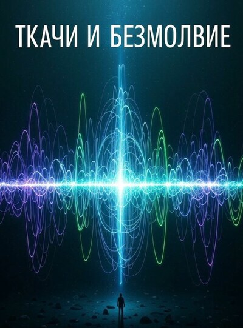

# Ткачи и Безмолвие

## Аннотация

Океан дышит. Его пульсирующий гул — единственный собеседник для биоакустика Егора Воскресенского, но когда он обнаруживает в шуме океана идеальный, кристаллический узор, его мир переворачивается.
Шаг за шагом, разгадывая природу аномалии, открывается чудовищную правду: разум океана не говорит — он слушает, разбирая человеческие жизни на части, словно часы. Теперь "Полюс-5" — это не научный аванпост, а осаждённая крепость, где Егор, Арина и Лев, запертые на дне мира, вынуждены бороться с чем-то, что вывернет их страхи наизнанку. Что они сделают, когда поймут, что самый страшный враг — это не чудовище из глубин, а их собственные потаённые травмы и амбиции, ставшие топливом для пробудившегося бога?

## Обложка

### Глава 1

Глава 1

Океан дышал.

Егор Воскресенский чувствовал это дыхание всем телом. Низкочастотная вибрация проходила сквозь десятисантиметровый композит корпуса, резиновую подошву стоптанных ботинок и поднималась по позвоночнику к основанию черепа. Это был постоянный, несмолкаемый гул планеты — фон, на котором разворачивалась его тихая жизнь. Здесь, на глубине в триста метров, на гидроакустической станции «Полюс-5», этот гул был единственным собеседником.

Он сидел перед центральной консолью, глядя в экран, но не видя его. Программа калибровки послушно выводила столбцы зелёных цифр: семьдесят два гидрофона на внешнем периметре работали в штатном режиме. Всё было правильно. Стерильно. Мёртво.

Егор поморщился. Правильность была вотчиной доктора Лавровой. Его же интересовала гармония.

Одним движением он смахнул окно программы, открывая доступ к сырому аудиопотоку. Пульсирующий хаос спектрограммы заполнил экран. Он потянулся к старым, потрёпанным наушникам «Sennheiser», чьи амбушюры давно повторяли контуры его головы.

Надев их, он закрыл глаза. Мир сузился до шипения. Его пальцы нашли холодный, ребристый бок аналогового регулятора усиления — реликта, который Лев Борисович сохранил по его личной просьбе. Левая рука на консоли бессознательно выстукивала рваный ритм: две быстрые дроби, пауза с удар сердца, финальная дробь.

Медленно, на доли миллиметра, он начал поворачивать регулятор. Шум в наушниках нарастал, превращаясь из шёпота в рёв. Егор не искал громкость или чёткость. Он искал точку резонанса — момент, когда хаос обретает структуру.

Вот оно.

Он замер, затаив дыхание. Нашёл. Точка, где шум переставал быть шумом. Где мириады случайных звуков — гул сейсмической активности на шельфе, щелчки кашалотов за десятки километров, шорох сдвигаемых течением пород — сливались в единую, почти осмысленную партитуру.

И в этот самый момент на экране спектрографа родилась и умерла аномалия.

Это не было сбоем. Сбои, артефакты, акустические миражи — всё это Егор знал наизусть. Они были грязными, рваными. Этот же паттерн, проживший на экране не больше двух секунд, был… идеален.

Не всплеск. Структура. Тонкая, невесомая решётка, проступившая на фоне хаоса. Архитектура из чистого тона.

Егор застыл. Задержанное дыхание вырвалось из груди хрипом. Привычное тепло меланхолии испарилось. Он осознал, что сидит на самом краю кресла, вцепившись в подлокотники. Всё его внимание обострилось до предела, отсекая лишнее.

Рука метнулась к регулятору громкости, выкручивая его до отказа. Наушники взорвались рёвом океана, но на неуловимый миг сквозь него прорвался ОН.

Звук, не похожий ни на что. Не щелчок, не гул, не свист. Многослойная конструкция, словно лопнула струна из кварца. Звон настолько чистый, что казался объёмным.

И он исчез.

— Чёрт, — выдохнул Егор. Голос в тишине рубки прозвучал неестественно громко.

Он бросился к панели записи, пальцы забегали по сенсорам. Отмотать буфер. Пять минут. Три. Одну. Вот он. Он выделил отрезок, запустил усиление и фильтрацию.

Ничего. Лишь призрак сигнала на графике. Словно след на воде от чего-то огромного, ушедшего вглубь. Акустический рубец.

Егор откинулся в кресле. Он не придумал это. Он знал. Но доказать Лавровой… Он представил её холодный взгляд, просьбу «предоставить валидируемые данные». Этот «рубец» не был данными. Это была поэзия. А Арина Викторовна поэзию презирала.

Резкий сигнал вызова заставил его вздрогнуть.

— Слушаю.

Голос Арины, чистый и безэмоциональный, прорезал тишину:

— Воскресенский, через два часа сеанс связи с Ильясовым. Отчёт по калибровке готов?

— Да, почти… — Егор запнулся. — Арина Викторовна, я зафиксировал… сложно описать. Очень необычный паттерн.

— Егор, — в голосе Арины не было раздражения. Было нечто хуже: холодное безразличие. — Мне нужен отчёт. Форма С-14. С подтверждёнными параметрами. Ты знаешь, чего ждёт Ильясов.

— Да, но если не сохранить этот фрагмент… Он важен. Это не помеха, я уверен. Там была структура. Я её слышал.

Пауза. Её тон был ровным — таким списывают неисправное оборудование.

— Сохрани фрагмент. Маркер «аномалия, класс гамма». После сеанса взгляну.

— Но…

— Отчёт. Через пятнадцать минут. На моём терминале. Конец связи.

Лампочка вызова погасла. Егор смотрел на мигающий курсор на пустом бланке, потом на экран, где снова плескался безликий шум. Он должен был заполнять графы. Подтверждать скучную реальность.

Но его пальцы уже меняли настройки фильтров. Он должен был найти его снова.

Дверь в рубку открылась, но он не заметил. В проёме, словно большой, усталый медведь, стоял Лев Борисович со старым металлическим термосом. Его взгляд скользнул по сгорбленной фигуре Егора, по экрану, остановился на погасшей лампочке. Он всё понял. Не говоря ни слова, шагнул внутрь, поставил термос на край стола, подальше от аппаратуры, и так же тихо вышел, прикрыв за собой тяжёлую дверь.

Егор этого не заметил. Он был уже не здесь. Он гнался за эхом невозможной музыки в чёрной, давящей толще воды.

Час бесплодных поисков лишь убедил его — он упустил нечто уникальное. Сигнал исчез, оставив после себя тот самый «рубец» и звенящую пустоту в голове.

Егор откинулся в кресле, потёр лицо холодными, липкими ладонями. Нужно было заземлиться.

Он встал, подошёл к личному шкафчику и достал два неуместных здесь предмета. Старый кассетный плеер Sony Walkman из серого, выцветшего пластика. И единственную, пожелтевшую от времени кассету. На вкладыше выцветшими чернилами: «Аня. Озеро. Июль».

Он вставил кассету, нажал на Play. Тихий, усталый шорох и слабое завывание моторчика. Он перемотал. Попробовал снова. Тот же мёртвый шёпот.

Внутри поднялась глухая злость. Плёнка. За десятилетия осыпалась, размагнитилась. Память умирала физически. Нужна была не отвёртка, а нейросеть для тончайшей реставрации, микронная калибровка головок. И везение.

Он замер, глядя на плеер. Злость ушла, сменившись знакомой пустотой. И тут же пришло оно. Не картинка — ощущение. Момент, который он не вспоминал, а проживал заново.

Солнце-вода-блики-слепят.

Жара. Запах лип и тины от пирса. Раздражение, такое же детское, как сейчас. Аня, шестилетняя сестра, сломала его лодку. Он накричал. Сказал, чтобы ушла.

Он-отвернулся-демонстративно.

На несколько секунд.

Всплеск-за-спиной. Негромкий.

А потом — тишина.

Вот что он помнил лучше всего. Не крики, не панику. А ту противоестественную тишину, в которой пропал щебет птиц, шелест листьев, её смех. Мир замер. Это было не отсутствие звука. Это было присутствие чего-то огромного и страшного.

Давление-вода-тишина-вода-вода-вода-снова-тишина.

Его пальцы на крышке плеера снова начали свой танец.

Он всю жизнь пытался заполнить ту тишину. Музыкой. Наукой. Шумом океана. Починка этого плеера, попытка извлечь из мёртвой плёнки эхо голоса сестры…

Так же, как он только что пытался извлечь из шума эхо невозможного сигнала.

Погоня была одна и та же.

Егор вздохнул, убирая плеер. Хватит. Поражение. Это был сбой. Резонанс. Он напишет отчёт, приложит спектрограмму «рубца» и забудет. Так проще. Правильнее.

Он сел за консоль, запустил процедуру завершения смены. Он уже потянулся к тумблеру питания мониторов, когда это случилось снова.

На экране, который должен был погаснуть, вспыхнул тот самый узор.

Ярче. Чётче. Он не проявился на миг, а застыл, вибрируя, словно живой. Он не просто существовал. Он ждал.

Рука Егора замерла. Он медленно, боясь спугнуть видение, надел наушники.

Тот же звон, та же архитектура из тона. Но теперь в его структуре была… осмысленность. Это не было явлением природы. Это было сообщением.

Дрожащими пальцами Егор запустил программу анализа. Выделил текущий сигнал. В качестве источника для сравнения указал свой калибровочный импульс, посланный в океан часы назад. Действие, продиктованное интуицией.

Программа вычисляла результат несколько невыносимых секунд. А затем выдала результат.

СТАТУС: ВЫДЕЛЕН ПАТТЕРН.

АНАЛИЗ: МАТЕМАТИЧЕСКИ ИНВЕРТИРОВАННАЯ КОПИЯ ИСХОДНОГО СИГНАЛА [CALIBRATION_PULSE_EGOR_V]

СОВПАДЕНИЕ: 94.1%

Он медленно снял наушники, положив их на стол с осторожностью, будто они были из тончайшего стекла. Гул станции казался далёким.

Взгляд был прикован к иллюминатору, за которым была только чернота и три мегапаскаля давления. Но он впервые в жизни чувствовал, что там, в этой черноте, кто-то есть.

Складка между его бровей разгладилась. Уголки губ дёрнулись в подобии улыбки, но глаза расширились от первобытного ужаса.

Оно не просто шумело.

Оно слушало.

Оно… отвечало.

### Глава 2

Глава 2

Пульс отбивал частый, глухой ритм где-то под кадыком, и каждый удар отдавался в ушах. Для Егора это был отсчёт новой эры. Он не бежал — он летел по коридорам «Полюса-5», прижимая к груди тонкий, ещё тёплый лист распечатки графика. Каждый удар его ботинок о рифлёный металл палубы отзывался гулким, тревожным эхом, чужеродным в привычном гудении станции.

Он ворвался в кают-компанию. Тяжёлая гермодверь от его толчка с глухим металлическим лязгом ударилась об ограничитель, заставив вздрогнуть единственного человека в помещении.

Лев Борисович медленно поднял голову от тарелки. На вилке у него дымилась гречневая каша с вкраплениями тушёнки. Взгляд его был тяжёлым и немигающим — взгляд человека, давно привыкшего ничему не удивляться. В кают-компании пахло едой, крепко заваренным чаем и чем-то ещё, неуловимо-сладковатым — забытый на подогреве компот начал подгорать. Для Егора, нёсшего в себе электрический разряд открытия, этот приземлённый быт был почти невыносим.

— Арина Викторовна где? — выдохнул он, с трудом переводя дыхание.

— Сеанс связи, — ровным голосом ответил техник, отправляя кашу в рот. Он жевал медленно, основательно, словно перемалывал не гречку, а само время.

Егор огляделся. Напротив Льва, за тем же столом, стоял планшет. Экран показывал интерфейс видеоконференции: лицо Арины Лавровой, сосредоточенное лицо Ильясова. Третьим окном был тёмный квадрат с подписью «Лев Борисович» — иконки его камеры и микрофона были перечёркнуты.

— ...данные по сейсмической активности стабильны, Андрей Владимирович. Отклонений нет, — голос Арины, чуть искажённый динамиком, был безупречно ровным. — Нет, никаких аномалий за отчётный период.

— Есть! — Егор шагнул к столу, не в силах больше сдерживаться. Он метнулся, чтобы положить распечатку на металлическую поверхность, но от спешки лист выскользнул из пальцев и спланировал на пол. Подхватив его, Егор положил бумагу на стол как сакральный текст, как неопровержимое доказательство, и включил микрофон и камеру на планшете. — Арина Викторовна, есть!

Арина на экране перевела взгляд на него, холодный и точный, как измерительный прибор. Она не выключила связь.

— Воскресенский, я занята.

— Оно ответило! — его голос сорвался. — Вы должны это видеть. Это не шум, не помеха. Это инверсия! Математически точная!

Лев Борисович перестал жевать, его взгляд с ленивым интересом упёрся в график. На листе изгибались две линии — одна чёрная, другая красная. Идеальное зеркало.

— Инверсия чего, Воскресенский? — в голосе Арины не было ни тени удивления. Только сталь. — Вашего же калибровочного сигнала?

— Да! Но поймите, оно не просто отразило его. Оно... оно вывернуло его наизнанку. Сохранив всю структуру, всю сложность. Это... осмысленно! Это диалог!

Лев Борисович хмыкнул и снова принялся за еду.

— Или помеха от старого силового кабеля. Он у нас под обшивкой фонит уже год, как раз на этих частотах. Даёт гармонику.

Слова техника заставили Егора дрогнуть. Плечи, которые он держал так прямо, невольно опустились. Он вдруг остро почувствовал, как неуместно и глупо выглядит его порыв.

— Это не гармоника, — пробормотал он. — Она не может быть настолько... чистой.

Арина на экране помолчала, глядя на него долгим, изучающим взглядом. Потом сказала в пустоту:

— Андрей Владимирович, я перезвоню. У нас тут небольшое ЧП с оборудованием. — Она завершила вызов, и её лицо заполнило весь экран. В наступившей тишине стало слышно, как Лев Борисович медленно скребёт вилкой по тарелке, собирая остатки каши. — Покажите.

Егор подвинул планшет к себе и быстро вывел на экран данные. Спектрограммы, графики, расчёты. Он говорил быстро, сбивчиво, перескакивая с одного на другое, отчаянно пытаясь передать то чудо, свидетелем которого он стал. Он говорил про идеальное совпадение, про мизерную погрешность, про невероятную сложность ответа.

Арина слушала молча, не перебивая. Её лицо оставалось непроницаемым. Когда Егор наконец выдохся и замолчал, она ещё несколько секунд смотрела на экран.

Потом медленно произнесла, отчеканивая каждое слово:

— Гипотеза первая: резонансный отклик в специфической геологической породе под станцией. Редкое, но возможное явление. Гипотеза вторая: аномальное атмосферное возмущение, вызвавшее флуктуации в магнитосфере, что привело к искажению сигнала и его инвертированному эху. Маловероятно, но не исключено.

Она сделала паузу.

— Гипотеза третья, наиболее вероятная: каскадный сбой в цепи предусилителей. Один из чипов перегрелся и начал работать как инвертор. Старая техника, Воскресенский. Она любит преподносить сюрпризы.

Егор смотрел на неё. Метр стола между ними казался вакуумом, в котором не распространялся ни звук, ни смысл. Каждое её слово было как хирургический инструмент, безжалостно препарирующий его открытие.

— Но я всё перепроверил...

— Вы были на эмоциях, — отрезала Арина. — Это не то состояние, в котором возможны достоверные выводы.

Лев Борисович молча поднялся из-за стола. Он взял свою пустую тарелку, поставил её в мойку и принялся наливать себе чай из большого термоса. Представление окончено, возвращаемся к рутине.

Тепло в груди Егора схлынуло. Он вдруг остро почувствовал холод стали, в которую вцепился пальцами, и услышал ровный, безразличный гул вентиляции. Мир снова стал просто набором физических явлений.

— Значит, так, — голос Арины вернул его в реальность. Она перешла в командный, рабочий режим, не оставляя места для сомнений или возражений. — Первое: Лев Борисович, с этой минуты вы начинаете полную пошаговую диагностику всей акустической цепи. От внешних гидрофонов до серверной стойки. Мне нужен детальный отчёт по каждому узлу.

Лев кивнул, отхлёбывая чай. В его движении читалась безропотная усталость: очередная блажь начальства, из-за которой ему теперь всю ночь ползать с мультиметром.

— Второе, — Арина перевела взгляд на Егора. — Вы, Воскресенский, до получения результатов диагностики отстранены от работы с основным массивом данных. Ваш доступ к системе будет временно ограничен.

Он открыл рот, но не смог произнести ни слова. Снова та самая тишина, только теперь она была не в глубине океана, а прямо здесь, за столом.

— Но... сигнал, — выдавил он. — Я могу его упустить. Если он появится снова, нужно быть готовым, нужно... поддерживать контакт.

— Если это сбой оборудования, — её тон стал ещё холоднее, — ваше присутствие у консоли — это лишняя неконтролируемая переменная. Если сигнал реален и исходит от разумного источника, как вы утверждаете, он никуда не денется. Он будет терпелив. Протокол в таких случаях ясен. Сначала исключаем все возможные внутренние причины.

Он замолчал, придавленный неумолимой логикой протокола. Он смотрел на неё и не мог понять: она действительно не верит или просто не хочет верить? Для неё это было нарушением порядка. А для него — величайшим открытием в истории.

— Чем мне тогда заниматься? — спросил он глухо.

Арина на мгновение задумалась. Уголок её губ едва заметно дрогнул, но так быстро, что Егор не был уверен, что ему не показалось.

— В архиве скопились бумажные отчёты предыдущих экспедиций. Их нужно каталогизировать и оцифровать. Давно собирались, но руки не доходили. Заодно и проверите, не сталкивался ли кто-то с подобными «артефактами» раньше.

Это было больше, чем приказ. Его ссылали в пыльный чулан, подальше от настоящей работы, пока взрослые разбираются с его фантазиями.

Он молча кивнул, поднял со стола свою распечатку, которая теперь казалась листком с бессмысленными каракулями, и вышел из кают-компании, не прощаясь. За спиной он слышал, как Лев Борисович тяжело вздохнул и поставил кружку на стол.

Мастерская Льва Борисовича была его крепостью. Здесь пахло машинным маслом, канифолью и его личным ритуалом — едва уловимым ароматом кардамона от утреннего кофе, который, казалось, въелся в сами стены. В отличие от стерильной белизны лабораторий, тут царил упорядоченный хаос. Инструменты висели на стенах на строго отведённых местах, бухты кабелей были аккуратно смотаны, на верстаке в идеальном порядке разложены детали какого-то механизма.

Лев любил эту работу. Она была честной. Либо контакт есть, либо его нет. Либо напряжение в норме, либо оно скачет. Никаких «показалось» или «почувствовал». Только факты, цифры и старый добрый мультиметр.

«Опять начальница бурю в стакане устроила, — думал он, подключая диагностический разъём к распределительной коробке. — Парень хороший, тихий, но, видать, от изоляции крыша поехала. А мне теперь всю ночь схему звонить».

Он методично проверял узел за узлом, кабель за кабелем. Система была чистой. Ни одного лишнего ома сопротивления, ни милливольта утечки. Всё работало в штатном режиме. Он уже собирался доложить Арине, что «акустик просто перегрелся», когда решил напоследок проверить контур внешнего периметра.

Для этого он достал со стеллажа свой старый, ещё советский стрелочный магнитометр. Тяжёлый, в бакелитовом корпусе, надёжный, как кувалда. Цифровым приборам Лев не доверял до конца. Они были слишком умные, сами фильтровали помехи, сами решали, что важно, а что нет. А эта старая коробка показывала всё, как есть.

Он поднёс датчик к вводу кабеля в корпус станции. Стрелка, как и положено, чуть отклонилась, показывая слабое поле от работающей электроники. Но что-то было не так. Она не замерла на месте. Лев хмуро стукнул по корпусу пальцем — старая привычка. Стрелка не отреагировала, продолжая мелко-мелко дрожать, вибрировать с высокой частотой, словно билась в ознобе. Он никогда такого не видел. Это не было похоже на короткое замыкание или наводку от силового кабеля. Те давали резкие скачки, а здесь было... что-то другое. Что-то упорядоченное.

Он подержал датчик ещё минуту, наблюдая за дрожащей стрелкой. Что-то в этом упорядоченном дрожании было глубоко неправильным, чужеродным.

Он включил внутреннюю связь.

— Арина Викторовна, я всё проверил. Вся акустическая система чистая. Никаких сбоев, отклонений, ничего. Акустик ваш, похоже, привидение поймал.

— Уверены, Лев Борисович? — голос Арины был спокоен.

— Как в самом себе, — ответил Лев, но всё же добавил: — Есть тут небольшие флуктуации по магнитному полю у самого корпуса. Странные. Да ерунда, скорее всего. Старая проводка на обшивку коротит. Ничего критичного. Перепроверю завтра при свете.

Он сам почти поверил в это объяснение. Почти. Но когда он убирал магнитометр на полку, ему показалось, что он всё ещё чувствует эту мелкую, назойливую вибрацию кончиками пальцев.

Архив оказался маленькой кладовкой без окон, заставленной от пола до потолка металлическими стеллажами. Пахло пылью, старой, желтеющей бумагой и едва уловимым запахом перегретого бакелита — словно много лет назад здесь что-то сгорело, и этот призрак гари навсегда остался в помещении. Тусклая лампа под потолком бросала неровный свет на ряды серых картонных папок.

Егор сидел на единственном табурете и механически перебирал отчёты. Он чувствовал себя школьником, которого отправили в угол. Каждая папка, каждый отчёт казались насмешкой. «Сейсмическая активность, 2017 год». «Анализ миграции планктона, 2019». «Калибровка гидролокатора бокового обзора, 2021».

Рутина. Скука. Бессмысленность. Он был так близко к чуду, а его заставили копаться в этом бумажном кладбище.

Его пальцы наткнулись на большую, склеенную из нескольких листов карту. Он развернул её на полу. Это была подробная батиметрическая карта дна в районе станции. Сам «Полюс-5» был отмечен красным крестиком. А прямо под ним, на карте, зияла тёмная, глубокая трещина, уходящая в непроглядную синеву.

«Шепчущий разлом», — гласила аккуратная надпись.

Егор провёл пальцем по изгибам каньона. А потом заметил на полях, у самого края листа, сделанную карандашом пометку, почти стёршуюся от времени. Почерк был резкий, торопливый.

«Эффект природной акустической линзы? Сигнал в разломе усиливается на порядок. Проверить».

Внутри что-то изменилось. Линза. Усилитель. Место, где он находился, было не случайным. Сама геология этого места была создана для того, чтобы слушать и быть услышанным. Он снова почувствовал прилив энергии. Это была первая зацепка.

Он начал перебирать папки с новым азартом, уже не бездумно, а в поиске. Его интересовали не отчёты, а журналы. Журналы регистрации персонала, вахтенные журналы, журналы погружений.

В толстой книге за десять лет до сегодняшнего дня он нашёл то, что искал. Список сотрудников экспедиции того года. И одно имя заставило его замереть.

«Денисов Виктор Сергеевич, ст. научный сотрудник».

Напротив фамилии, в графе «Примечания», стояла короткая, выведенная красными чернилами запись: «Не вернулся с одиночного погружения. Предположительно погиб».

Денисов. Имя было смутно знакомым. Егор закрыл глаза, пытаясь вспомнить. И вспомнил. Несколько месяцев назад, ещё на «большой земле», во время инструктажа Арина обмолвилась в разговоре с Ильясовым: «Этот проект — прямое продолжение работы Виктора. Моего научного руководителя».

Виктор. Виктор Денисов. Он погиб здесь. Десять лет назад. Изучая что-то в этом самом месте. Фразы Арины, брошенные вскользь, теперь обретали зловещий вес.

Глубокая ночь. Станция спала, погружённая в свой обычный механический сон — мерный гул вентиляции, тихое гудение серверов, редкие щелчки реле. Для Егора, привыкшего вычленять из шума смысл, этот ровный гул был невыносим. Он лежал в своей крошечной каюте и смотрел в потолок. Сон не шёл.

Образ инвертированного сигнала стоял у него перед глазами. Он не мог просто так это оставить. Не мог ждать до утра, пока Лев закончит свою проверку, а Арина соизволит вернуть ему доступ. Это было сильнее его. Иррациональный, непреодолимый порыв.

Тихо, стараясь не шуметь, он выбрался из койки. Накинул рабочий комбинезон. Коридоры были пустынны и слабо освещены аварийными лампами. Каждый его шаг казался ему оглушительным. Ему чудилось, что вся станция слышит, как он крадётся, нарушая прямой приказ.

Лаборатория встретила Егора прохладой и тишиной. Экраны мониторов спали, лишь на серверной стойке мерно мигали зелёные огоньки индикаторов.

Он не стал включать основной массив. Он просто загрузил ту самую, последнюю запись. Ту, что длилась всего несколько секунд. Он надел наушники, закрыл глаза и нажал на «play».

Уникальный, многослойный, неземной звук заполнил его сознание. Он был похож на пение китов, на скрип ледников, на гул далёких звёзд — и ни на что из этого. Звук был живым. В нём была глубина, структура, мысль. На эти несколько секунд Егор забыл об Арине, о протоколах, о своей вине и своей тоске. Он полностью погрузился в этот звук.

Внезапно на экране прямо перед ним вспыхнуло окно внутреннего мессенджера. Воздуха в лёгких не хватило. Сообщение было от пользователя «Лаврова А.В.». Текст состоял из одной строки.

«Я знала, что ты это сделаешь. Продолжай. Веди запись всего, что происходит. И своего состояния тоже».

Холод сковал его изнутри. Он медленно поднял глаза от монитора. Взгляд его скользнул вверх, в тёмный угол под потолком, куда он никогда раньше не смотрел.

Там, почти невидимый на фоне тёмных кабелей, был маленький, чёрный объектив камеры наблюдения.

И на нём горел крошечный, пристальный, немигающий красный огонёк.

Отстранение. Архив. Унижение. Разрешение вернуться к работе, данное в тот самый момент, когда он нарушил приказ. Это не было прощением. Это был следующий этап. Станция перестала быть домом. Она стала клеткой. А красный огонёк камеры — холодным, бесстрастным глазом исследователя, наблюдающего за реакцией подопытного существа.

### Глава 3

Глава 3

Камера смотрела на него.

Холодный, безразличный зрачок объектива, вмонтированного в потолочную панель. Он заметил его не сразу. Сначала было просто ощущение — древний инстинкт добычи, знающей, что за ней наблюдают. И только потом, когда голова медленно поднялась, свет от монитора тускло бликнул на стекле.

Блик — и разрозненные детали сложились в единую картину. Её сообщение, всё ещё горевшее на экране: «Я знала, что ты это сделаешь. Продолжай». Её отстранение, наигранный скепсис, приказ копаться в бумажном хламе... Так вот какую проверку он только что прошёл? Проверку на одержимость?

Он не ответил на сообщение. Кому? Безличному аватару в углу экрана? Он медленно, словно под водой, перевёл взгляд от камеры на основной монитор, где зелёной кардиограммой бился пульс океана. Его открытие. Его клетка. Он молча кивнул пустоте, зная, что она видит. За внешней покорностью медленно набирала плотность ярость — холодная и густая, как вода на предельной глубине.

Пальцы легли на клавиатуру. Он снова был прикован к этому креслу, но что-то изменилось. Восторг первооткрывателя сменился упрямством заключённого, изучающего стены своей камеры, чтобы понять логику тюремщика.

Часы на мониторе сменили цифру: 01:17. Следующая — 01:18 — казалось, наступила через вечность. Станция жила своей монотонной жизнью. Сквозь вентиляционную решётку доносился ровный гул, палуба мелко вибрировала, в серверной стойке сухо щёлкали реле. Он привык к этим звукам, научился их не замечать — акустические обои его одиночества. Но теперь, под взглядом Арины, он слушал по-новому.

И океан, казалось, тоже. Сигнал менялся.

Сначала это было едва заметно. Лёгкое искажение в чистоте инвертированной копии. Потом ещё одно. Егор нахмурился, увеличивая фрагмент на спектрограмме. Он ожидал чего угодно: усложнения структуры, новой математической последовательности. Но он не был готов к этому.

Существо в глубине больше не просто отражало его импульс. Оно начало вплетать в свой ответ звуки самой станции.

Вот этот низкий, ровный тон на частоте пятьдесят герц. Егор оглянулся. Гудение старого трансформатора в углу. Вот эта короткая, ритмичная дробь. Он прислушался. Щелчки реле в блоке питания сонара. А этот высокий, почти неслышимый свист… Он провёл пальцами по панели охлаждения. Вентилятор.

Он замер. Дыхание сбилось. Это была не мимикрия, не подражание попугая. Слишком осмысленно. Слишком целенаправленно. Оно слушало их. Всё. И теперь использовало эти звуки, уникальные для «Полюса-5», как ключ. Как пароль. Оно создавало выделенный канал, отфильтровывая свой сигнал от триллионов других звуков океана с помощью их же собственного шума. Оно говорило: «Это для вас. Только для вас».

Собственный пульс застучал в висках, заглушая гул трансформатора. Он открыл рабочий журнал. Пальцы замерли над клавиатурой. Он мог бы написать: «Объект демонстрирует способность к анализу и использованию локальных акустических маркеров для создания зашифрованного канала связи». Это было бы правдой. Это было бы тем, чего ждала Арина.

Вместо этого он набрал: «Зафиксированы корреляции между структурой сигнала и фоновыми шумами станции. Требуется дополнительный анализ для исключения аппаратного резонанса». Сухо. Технично. Ни слова о разуме. Он даст ей факты. Голые кости. Но суть своего открытия он оставит себе.

Он нажал «Сохранить» и откинулся в кресле, чувствуя на себе немигающий взгляд камеры. Игра началась.

* * *

Сознание не ушло плавно — оно провалилось, будто под ногами разверзся люк. Мышцы шеи разом сдали, и голова тяжело упала на скрещённые руки.

Первым пришло давление. Не сверху, не сбоку, а отовсюду сразу. Всеобъемлющее, колоссальное. Будто каждую его клетку сжимала сама гравитация планеты. Верх и низ потеряли смысл. Осталась только глубина — бесконечная, направленная внутрь.

Затем среда. Воздух исчез, заменился чем-то плотным, вязким, живым. Он двигался сквозь эту субстанцию, но не руками или ногами. Движение рождалось всем телом, единым волнообразным импульсом. Он был волной в этой безграничной плоти. Но в глубине этой волны он ощущал другие «Я» — мириады светящихся нейронов, отдельных, уникальных, но временно ставших частью единого, всеобщего сознания.

А потом пришёл звук, ставший зрением.

Он послал импульс — не голосом, а сокращением всего своего существа. И мир ответил. Вернулся эхом, прошедшим сквозь него. Он «увидел» лабораторию. Но это было не зрение. Это было чувство формы, отражённой вибрацией.

Вот гладкая, холодная плоскость стола. Он ощущал её геометрию, плотность материала. Вот пустота под ним. Вот сложная, ребристая структура кресла. А вот он сам — плотный, тёплый узел в этом поле, источник и приёмник эха. Он чувствовал контуры своего тела, как слепой ощупывает собственное лицо. Границы «Я» стали проницаемыми.

Он ощутил другой плотный узел в углу. Трансформатор. И тонкие, вибрирующие нити кабелей, уходящие в стену. Стена была не преградой, а лишь изменением плотности среды. Он чувствовал её толщину, арматуру внутри бетона.

Он «посмотрел» вверх. Потолок. И в нём — холодная, мёртвая точка. Линза камеры. Чужеродное тело. Неправильное. Оно не вибрировало в ответ, а поглощало его эхо. Слепое пятно в его новом мире.

Резкая, неумолимая потребность вдохнуть — бунт его человеческой природы. Но вместо воздуха — чувство, будто в лёгкие хлынула ледяная, солёная плотность.

Егор проснулся с судорожным хрипом. Воздух обжёг горло. Он сидел в кресле, бешено колотилось сердце. Лаборатория — реальная, освещённая тусклым светом монитора — казалась невыносимо плоской, двухмерной. Фальшивой декорацией.

Внутри черепа бился раскалённый пульсар. Мигрень. Он закрыл глаза, но перед внутренним взором всё ещё стояла объёмная, вибрирующая карта комнаты. И фантомное ощущение холодной воды в лёгких никак не проходило.

* * *

Дверь лаборатории со скрипом открылась. Егор вздрогнул. На пороге стоял Лев Борисович. Лицо его, как всегда, было непроницаемым, но он остановился на долю секунды дольше обычного, и этого хватило, чтобы понять — он обеспокоен.

Лев молча прошёл вглубь, его тяжёлые ботинки ступали по палубе с привычной основательностью. Он не смотрел на Егора, занятый утренним обходом. Проверил показания на щитке, потрогал кожух трансформатора. Егор следил за ним мутным взглядом. Голова раскалывалась, реальность всё ещё казалась хрупкой.

Окончив обход, Лев скрылся в своей мастерской. Вскоре оттуда донёсся сухой шорох перемалываемых зёрен, а через две минуты по коридорам, перебивая запах перегретой электроники и машинного масла, поплыл густой, пряный аромат. Кофе и кардамон. Утренний ритуал Льва Борисовича. Островок порядка в этом царстве гудящих приборов и безумных сигналов.

Через несколько минут рядом с клавиатурой Егора беззвучно опустилась толстая керамическая кружка с дымящимся кофе и тарелка с двумя кусками чёрного хлеба и толстыми ломтями сыра.

— Пей. Горячий. — Голос Льва был как всегда ровным, немного ворчливым.

Егор поднял голову. Взгляды встретились.

— Я… не просил, — выдавил он.

— А я и не спрашивал, — буркнул Лев. Он уже отвернулся и принялся протирать идеально чистый гаечный ключ ветошью. — Завтракать надо. Даже если начальство считает, что люди — такие же реле. Перегорят — новые поставят.

— Лев Борисови...

— Молчи и пей.

Егор обхватил горячую кружку. Тепло было настоящим. Он сделал глоток. Горький, обжигающий вкус вернул его в реальность.

— Спасибо, — тихо сказал он.

Лев Борисович не ответил.

— Я видел, как люди горят на работе, — сказал он, не поворачиваясь. — Начинается вот так. Сначала сон пропадает, потом аппетит. А потом… потом уже всё равно.

Он замолчал, взвешивая слова.

— Ты, парень, поосторожнее с этим… давлением. Оно не только обшивку рвёт. Оно и мозги на место ставит. Или выдавливает.

— Она знает, что делает, — механически возразил Егор.

Лев хмыкнул. Он положил ключ на место с тихим металлическим щелчком.

— Да уж. Знает. Денисов тоже знал. Десять лет назад. Он тоже слушал. Дослушался.

Он повернулся и посмотрел Егору прямо в глаза.

— Просто… ешь давай. И смотри, чтоб у самого изоляция не поплавилась. Починить будет некому.

С этими словами он вышел, оставив Егора наедине с дымящимся кофе и прозвучавшим предупреждением.

* * *

В своей каюте, стерильной и безличной, Арина смотрела на тот же сигнал, что и Егор. На маленьком окне в углу её монитора отражалась вся его ночь: измождённое лицо, забытьё на скрещённых руках, резкое пробуждение. Даже нелепая сцена с Львом и его кофе — всё было записано. Сентиментальный старый дурак.

Она проигнорировала эту сцену. Её интересовали только цифры.

«Зафиксированы корреляции… Требуется дополнительный анализ…» Жалкая попытка скрыть суть. Она видела то же, что и он. Это был ключ шифрования. Невероятно сложный, динамический, основанный на живой акустической среде. Открытие, которое переворачивало всё. Это было уже не просто доказательство разума. Это было приглашение к диалогу на их условиях.

Её пальцы быстро и точно застучали по клавиатуре. Официальный запрос на материк, на имя Ильясова. Она тщательно подбирала слова.

«…в ходе плановых работ зафиксирован уникальный, устойчивый гидроакустический феномен с экспоненциальным ростом сложности паттернов. Первичный анализ указывает на нелинейную динамическую систему, предположительно биологического происхождения. Для дальнейшей каталогизации… требуется немедленное расширение аналитических мощностей…»

Ни слова о разуме. Ни намёка на контакт. Она не повторит ошибку Виктора.

Её взгляд упал на единственную фотографию на столе. Молодой мужчина с острым, пронзительным взглядом. Виктор. Она помнила его последний сеанс связи. Помнила, как он, задыхаясь от восторга, пытался объяснить свою гипотезу. И помнила снисходительный голос Ильясова: «Виктор, голубчик, попейте чаю. Вам отдохнуть надо».

Виктор тогда разбил кулаком панель связи. А через неделю его не стало. Его «фантазии» похоронили под формулировкой «несчастный случай».

Её пальцы сжались на краю стола с такой силой, что побелели костяшки. Нет. Не в этот раз. Она получит всё, что ей нужно, не раскрывая карт. Она даст им такие факты, от которых они не смогут отмахнуться. Но только тогда, когда всё открытие будет принадлежать ей.

Она перечитала текст запроса. Безупречно. Она прикрепила список необходимого оборудования: новый криогенный процессор, несколько терабайтных накопителей и… экспериментальный нейроинтерфейс «Нейрон-7». Для «более точной калибровки системы под оператора», как она написала в сноске.

Она нажала «Отправить». Щелчок клавиши в полной тишине каюты был сухим и окончательным, как щелчок затвора. Ставка была сделана.

* * *

Кофе остыл. Бутерброд остался нетронутым. Егор снова сидел перед консолью, но теперь его охватывало глухое отчаяние. Сигнал усложнился до неузнаваемости. Он превратился в сплошной, многослойный фрактальный шум. Белый шум смысла. Он смотрел на него, как амёба смотрит на страницу «Войны и мира».

Технология была бесполезна. Они говорили не на разных языках — они существовали в разных реальностях. Сонар, компьютер, все эти мегагерцы и терабайты были каменными топорами.

Нужен был другой подход. Иррациональный.

Он вспомнил свой сон. Ощущение эха, проходящего сквозь собственное тело. Оно слушает не ушами… Оно слушает сутью. Мысль была безумной, но она была единственной, что у него осталась.

Рука сама легла на тумблер. Он отключил передающий сонар. Теперь он будет только слушать. И говорить. Но не языком импульсов.

В голове, как заевшая пластинка, крутилась мелодия. Простая, из трёх нот. Детская считалочка, которую Аня пела в тот день у озера. Он всегда гнал её прочь. Она была ключом к двери, за которой ждала только боль. Но сейчас… сейчас это было всё, что у него было. Его самая глубокая рана. Его самая настоящая часть.

Подчиняясь внезапному импульсу, он наклонился к микрофону на консоли. Он всегда был включён, Арина слушала. Ну и пусть.

Он набрал в грудь воздуха. И тихо, срывающимся шёпотом, начал напевать.

Две короткие ноты. Пауза. Одна короткая.

Это был не просто звук. Это был ритм его нервного тика. Код его травмы. Его голос дрожал, фальшивил. Это была молитва атеиста, брошенная в пустоту.

В тот же миг всё оборвалось.

Не затихло, не угасло. Оборвалось. Как будто кто-то выключил гигантский рубильник, питающий весь океан. Сигнал на спектрографе исчез. Но исчез не только он. Исчез весь фоновый шум. Гудение течений. Треск ракообразных. Далёкие голоса китов.

В наушниках и динамиках воцарилась тишина.

Абсолютная. Мёртвая. На станции, где всегда что-то гудело, вибрировало и скрипело, её никогда не было. Это была не пустота. Это было напряжённое, всепоглощающее внимание.

Егор замер, сгорбившись над микрофоном. Он не смел дышать.

В своей каюте Арина, наблюдавшая за этим безумием на экране, резко вскочила, опрокинув чашку с остывшим кофе.

Океан замолчал. И слушал.

### Глава 4

Глава 4

Шум прекратился. Исчезли щелчки реле, шуршание вентиляции, далёкие вздохи китов. Океан, всегда бывший фоном, симфонией жизни, просто выключили. В уши ударила абсолютная, мёртвая пустота.

Егор застыл в кресле, пальцы повисли над клавиатурой. На всех экранах — от главного панорамного до маленького осциллографа — идеальные прямые линии.

Кардиограмма мёртвого бога.

Это длилось семь секунд. А потом станцию ударило.

Удар был не физическим. Он пришёл изнутри, из самой стали «Полюса-5». Низкий, вибрирующий гул родился где-то в переборках и резонировал прямо в костях. Егор почувствовал его всем телом: вибрация прошла по полу, по ножкам кресла, вползла в позвоночник. Словно гигантский механизм, работающий на пределе, готовый взорваться.

Одновременно с гулом погас свет. На долю секунды лаборатория погрузилась в абсолютную тьму, а затем вспыхнули красные полосы аварийного освещения. Мониторы ослепительно мигнули и покрылись цифровым снегом. Система вентиляции захлебнулась и с визгом заглохла. За стеной что-то щёлкнуло, и тонко завыл остановившийся опреснитель. Станция превратилась в обесточенную, вибрирующую железную коробку, тонущую в мёртвой тишине.

— Что за чёрт?! — Голос Арины из динамиков внутренней связи был искажён треском, но прорезался сквозь помехи с жёсткой определённостью. Она вырвалась из ступора первой. — Лев Борисович, доклад! Немедленно!

Егор не шелохнулся. Он закрыл глаза, пытаясь отфильтровать панику и хаос. Он вслушивался в гул. Это был не просто шум отказавшей техники. В нём была структура. Пульсация. Рваный, но отчётливый ритм. Не хаос. Ответ.

— Лев Борисович, твою мать! — рявкнул динамик.

— Работаю, Викторовна! — донеслось в ответ громыхание, будто кто-то бежал по металлическому трапу. — Не орите, и так тошно.

Егор открыл глаза. Красный свет выхватывал из темноты искажённые тени оборудования. Воздух загустел, отчётливо запахло горелой изоляцией. Станция больше не была его лабораторией, убежищем. Она стала ловушкой. И тот, кто замолчал снаружи, теперь ломился внутрь.

Лев Борисович не бежал. Он двигался быстро, но экономно, как механизм, отточенный десятилетиями службы в замкнутых пространствах. Его тело помнило аварийные тревоги на лодке, когда доля секунды решала, будешь ты дышать дальше или станешь частью статистики. Он проигнорировал мигающие лампы и воющие сирены. Его цель — сердце станции, главный распределительный щит в техническом отсеке.

Дверь отсека он рванул на себя с такой силой, что та со стоном ударилась об ограничитель. В нос ударил густой, едкий запах перегоревшей проводки. Здесь, вдали от лаборатории, низкочастотный гул давил на уши. Лев, не раздумывая, сорвал с крепления тяжёлый диэлектрический коврик и бросил его на пол. Одним движением рычага он обесточил всю некритическую цепь. Вой опреснителя захлебнулся. Стало тише.

Его взгляд пробежался по рядам тумблеров и индикаторов. Всё в красной зоне. Полный отказ. Но это следствие, а не причина. Он достал из кармана фонарь, хотя аварийное освещение и здесь работало, и посветил на главный фидер.

Вот оно. Несколько толстых медных контактов в керамических изоляторах были чёрными, оплавленными. Вокруг них — радужные разводы на металле, след экстремального перегрева. Так не бывает при обычном коротком замыкании. Короткое замыкание — это вспышка, выбитые автоматы. А это… это было похоже на то, как если бы по проводам на мгновение пустили ток мощностью с грозовой разряд.

Лев провёл рукой в толстой брезентовой перчатке по стальному корпусу щита. Тёплый. Он знал этот след. Он чувствовал его кожей, помнил этот запах.

— ЭМИ… — пробормотал он, и слова почти растворились в гудении. — Мощный, направленный. Суки.

Он вспомнил Баренцево море, учения, от которых до сих пор помнился вкус кислого адреналина во рту. Глухая ночь, их «Щука» лежит на грунте в режиме полного молчания. И вдруг такой же удар, только без звука. Вся электроника сходит с ума, в ушах звенит. Неакустический поиск. Тогда они засекли «Огайо», который «прощупывал» квадрат активным электромагнитным полем.

Тишина в океане. А потом удар по электронике. Кто-то сначала прислушался, а потом ударил, чтобы ослепить их. Это не авария. Это атака.

Лев ворвался в лабораторию. Красный свет выхватывал из полумрака бледное, напряжённое лицо Арины и совершенно спокойное, почти отрешённое — Егора. Техник с грохотом бросил на стол оплавленный, почерневший предохранитель размером с кулак.

— Вот ваша причина, Арина Викторовна, — прохрипел он, тяжело дыша. — Электромагнитный импульс. Нас не просто засекли. Нас «прощупали».

Арина оторвала взгляд от мёртвого экрана и уставилась на кусок обгоревшего металла. Она отчаянно нуждалась в объяснении. В любом, которое можно было бы измерить и проанализировать.

— Обоснуйте, — её голос был ровным, но натянутым. — Это могла быть… геомагнитная аномалия. Солнечная вспышка.

Лев криво усмехнулся. В его глазах не было и тени сомнения.

— Солнечная вспышка? Здесь, на глубине в триста метров, под толщей воды, которая гасит любое излучение? — он перебил её. — Арина Викторовна, не смешите мои седины. Я такое уже видел. Только один раз. На учениях в Баренцевом. Так работает система неакустического обнаружения нового поколения. Кодовое название в НАТО — «Шёпот». Где-то рядом с нами подводная лодка. И не простая. А волна вибрации... Комбинированная атака. Я о таком только читал.

Егор, до этого молчавший, вздрогнул.

— Нет… — тихо сказал он. — Это не оружие. Это была… реакция.

Арина проигнорировала его. Её взгляд был прикован ко Льву. Хаос начал обретать контуры — пугающие, но понятные.

— Характеристики? — бросила она, переходя на язык фактов.

— Бесшумная, скорее всего. Нового поколения, о которых только слухи ходят, — Лев говорил быстро, уверенно, выпрямившись и слегка повысив голос — он снова оказался в своей стихии. — Она не нас искала. Она сканировала разлом. «Шепчущий разлом» — идеальное место, чтобы спрятать что-то… или кого-то. А ваш сигнал, акустик, — он кивнул в сторону Егора, — с вашими инверсиями… он просто попал в резонанс с их эмиттером. Побочный эффект. Гармоника. Вот они и заткнули вас, чтобы не мешали.

В лаборатории повисла тишина, нарушаемая лишь гулом. В голове Егора это не укладывалось. Лодка. Эмиттер. Они говорили на языке проводов и стали, пытаясь объяснить чудо. Словно описывали восход солнца как простую утечку газа.

— Вы не слышите, — почти прошептал он. — Оно замолчало до удара. Оно отреагировало на… на меня.

Арина на мгновение заколебалась. Её взгляд метнулся к главному экрану, потом вернулся к твёрдому лицу Льва. Рациональное, техногенное объяснение было спасательным кругом. Она ухватилась за него.

— Лодка… — выдохнула она. — Это объясняет всё. И постоянные сбои… и смерть Виктора. Если он подошёл слишком близко… если он записал что-то, чего не должен был…

Она говорила это Льву, но убеждала саму себя. Виктор погиб не из-за мифического океанского разума. Его убили. Люди. Конкретный, осязаемый враг. С этим можно было бороться.

Решение было принято. Мир вернулся в привычные координаты физики и геополитики. Арина снова была командиром, а не жрицей неведомого.

— Лев Борисович, — её голос обрёл прежнюю твёрдость. — Переключите питание на резервную линию. Нам нужен только один комплекс. Разверните систему пассивного сонара «Кашалот». Полный сектор обзора. Будем искать акустическую тень.

— Принято, — кивнул Лев и уже развернулся к выходу, но остановился, посмотрев на Егора. В его взгляде промелькнуло что-то вроде сочувствия.

Егор вскочил с места.

— Арина, вы не понимаете! Они ищут не нас, и это не они! Мы должны ответить, пока оно слушает! Эта тишина — это не угроза, это… приглашение!

Он сделал шаг к ней, но остановился под её холодным, тяжёлым взглядом. В нём не было злости. Только ледяное, почти клиническое сочувствие, как у врача к безнадёжному пациенту.

— Егор, — сказала она тихо, но каждое слово падало в напряжённую тишину с тяжестью металла. — У тебя сенсорная перегрузка. Шок. Я это понимаю. Но сейчас ты не можешь мне помочь. Иди в свою каюту. Отдохни. Это приказ.

— Но сигнал…

— Мы имеем дело с неопознанным военным объектом, — отрезала она, повысив голос. — Твои… ощущения здесь нерелевантны. Выполняй приказ.

Он смотрел на неё, потом на Льва, который виновато отводил глаза. Они всё решили. Он был один. Его связь с глубиной превратилась в симптом болезни.

Егор медленно развернулся и пошёл к выходу. За его спиной уже раздавались отрывистые команды Арины и деловитый ответ Льва. Они охотились на призрака, не замечая божество, которое затаило дыхание прямо у них под ногами.

Он стоял посреди коридора. Гудение восстановленных систем казалось чужим, враждебным. Каждый звук — и команды Арины, и шаги Льва — отдалялся, словно он проваливался под воду, а они оставались на берегу. Тишина, та, что была снаружи, теперь поселилась внутри него.

Час спустя «Кашалот» был в строю. Это была старая, но надёжная система пассивного гидролокационного наблюдения, которую Лев Борисович поддерживал в идеальном состоянии. Она ничего не излучала. Она просто слушала. Искать бесшумную лодку — всё равно что пытаться увидеть чёрную кошку в тёмной комнате. Но они искали не звук. Они искали его отсутствие. Тень.

Арина и Лев стояли плечом к плечу перед огромным экраном. Воздух был плотным от напряжения, запаха крепкого кофе с кардамоном от Льва и едва уловимого аромата духов Арины. Тишину нарушал лишь шелест восстановленной вентиляции да мерное гудение серверов.

Каждый шорох, каждый щелчок остывающего реле казался оглушительным.

— Пусто, — наконец сказал Лев, отхлёбывая из своей любимой металлической кружки. — Легли на дно. Или ушли.

— Они здесь, — голос Арины был тихим, но абсолютно уверенным. — Они знают, что мы их ищем. Они ждут.

Она смотрела на экран не мигая, подавшись вперёд, словно пыталась силой воли прожечь толщу воды и увидеть то, что скрывалось внизу.

И тут это произошло.

В левом нижнем секторе экрана, там, где на батиметрической карте начинался свал в «Шепчущий разлом», появилось пятно. Оно не возникло резко. Оно проступило, словно на фотобумаге в проявителе. Нечёткое, размытое по краям. Не точка, как от обычной субмарины. А огромное, вытянутое, неестественно правильное… ничто. Пустота в звуковом поле. Акустическая тень невероятных размеров.

— Есть, — выдохнула Арина.

Лев поставил кружку на стол. Кофе расплескался. Он молча смотрел на экран. Его лицо, обычно невозмутимое, стало пепельным.

Арина, не отрывая взгляда от тени, запустила программу анализа контура. Секунды ожидания. Затем на боковой панели появились цифры. Зелёные, безжалостные, окончательные.

РАСЧЁТНАЯ ДЛИНА ОБЪЕКТА: ~400 МЕТРОВ.

РАСЧЁТНАЯ ВЫСОТА ОБЪЕКТА: ~60 МЕТРОВ.

АКУСТИЧЕСКАЯ СИГНАТУРА: НИЖЕ ПОРОГА ЕСТЕСТВЕННЫХ ШУМОВ.

Лев сдавленно охнул. Четыреста метров. Это была не подводная лодка. Это было… чёрт-те что. Нечто за гранью всего, что мог создать человек.

— Вот она, — прошептал он. — Я же говорил. Господи… что же они там построили…

Арина молчала. Она смотрела на гигантскую, невозможную тень, лежащую под ними в вечной тьме разлома. Её губы дрогнули, почти сложились в торжествующую улыбку, но взгляд, прикованный к тени, оставался напряжённым и тёмным. Она нашла его. Врага. Объяснение. Цель. И теперь она знала, что пойдёт до конца. Даже если этот конец будет на дне, рядом с Виктором.

### Глава 5

Глава 5

В главной лаборатории на монотонный гул серверов накладывался едва слышный шёпот вентиляции и ровное, низкочастотное гудение силовых кабелей в центральном коллекторе. На гигантском экране, заливая лица Арины и Льва Борисовича мертвенно-синим светом, застыла акустическая тень. Неподвижная, огромная, чудовищно неправильная.

Арина сделала глоток остывшего горького кофе. Чашка чуть дрогнула в её руке, оставив на столешнице тёмное кольцо. Тридцать шесть часов без сна.

— Ну что, Лев Борисович? Ваша классификация? — её голос был ровным, почти безжизненным. Инструмент, а не человеческая речь.

Лев Борисович протёр ладонью седую щетину на подбородке. Он наклонился ближе к своему монитору, где бежали столбцы цифр. Его пальцы, привыкшие к грубому металлу, деликатно касались клавиш.

— Арина Викторовна, оно… ну, оно неправильное, — сказал он, не оборачиваясь. — Сигнатура плывёт. Понимаете? Плотность меняется каждую секунду. Края тени… они нечёткие, размытые. Это не похоже на цельный металлический корпус.

— И какие версии вы можете предложить? Рой подводных дронов? Искусственное течение? — в её голосе появилась опасная, режущая нота.

— Я предлагаю то, что вижу. Эта штука не соответствует ни одной базе данных. Ни нашей, ни натовской. У неё нет чёткой акустической подписи. Это не субмарина.

— Четыреста метров не-субмарины? Не несите чушь, — отрезала Арина, не отрывая взгляда от главного экрана. — Это стелс-протокол нового поколения. Они маскируют сигнатуру, распыляют её, создают хаос из эхо-сигналов. Ищите паттерн в этом хаосе.

Лев Борисович тяжело вздохнул. Он откинулся на спинку скрипучего кресла, и оно недовольно скрипнуло.

— Я служил на «Щуке». Я знаю, как звучит стелс. Это… не то, — он покачал головой. — Это больше похоже на… на эхо в тумане. Или на дефект линзы. Словно сам разлом искажает пустоту.

— Дефект? — Арина медленно повернула к нему голову. Её лицо в полумраке было совершенно неподвижным. — Виктор тоже думал, что это «не то». Что это просто аномалия.

Её голос на мгновение потерял свою выправку, просел на одном слове — «аномалия». Она тут же взяла себя в руки.

— Работайте, Лев Борисович. Просто работайте.

Она отвернулась, давая понять, что разговор окончен. Лев поджал губы. Но промолчал. Приказ есть приказ. Он снова склонился над цифрами, пытаясь найти логику там, где её не было. Старый пёс, которого заставляют лаять на тень. Арина же смотрела на экран и видела не тень. Она видела надгробие. И она собиралась его раскопать.

Егор сидел в своей каюте, но стен не замечал. Он слышал. Сквозь толщу переборок до него доносились обрывки приглушённых голосов из лаборатории. Не слова, а интонации. Напряжённая, деловитая речь Арины. Глухое ворчание Льва Борисовича. Они охотились. Гонялись за своей вражеской подлодкой, за своим удобным объяснением.

Дыхание спёрло, словно из лёгких выкачали весь воздух. Его открытие, самое важное событие в истории, превратилось в технический сбой, а он сам — в истеричного сотрудника, которого заперли для его же блага.

Его взгляд упал на монитор, где всё ещё висел скриншот того самого первого ответа. «Акустический рубец». Шрам на теле тишины. И вдруг понимание не пришло — оно пробило его, как инфразвук, заставив вибрировать каждую клетку.

Голос-давление-стекло-холод-информация.

Они пытались докричаться до глубины, измерить её. А оно… оно ответило не на силу сигнала. Оно ответило на его сложность.

Эта мысль заставила его вскочить. Это не диалог. Это настройка. Они посылают простой импульс — получают точную инверсию. Он напел сложную мелодию — и океан замолчал, вслушиваясь. Ему не нужен крик. Ему нужен ключ. Язык.

А где найти язык самой глубины? Не в базах данных. Не в протоколах. В её собственном голосе.

Он поднялся, вытесняя апатию холодной решимостью. Он шёл по гулким коридорам, мимо лаборатории, откуда сочился синий свет и концентрированное напряжение, — в самый дальний, самый заброшенный отсек. В архив.

Дверь поддалась с натужным скрипом. В нос ударил запах старой, высохшей бумаги, пыли с почти неуловимой нотой старой гари. В тусклом свете аварийной лампы громоздились стеллажи, забитые папками.

В прошлый раз он искал здесь отчёт о смерти Виктора. Теперь он искал жизнь. Жизнь разлома.

Он нашёл то, что искал, в дальнем углу. Толстая папка с выцветшей надписью: «Сейсмическая активность. Район "Полюс-5". 1970-2020». Он развязал тесёмки, развернул на пыльном столе первую же распечатку. Длинный лист бумаги, испещрённый тонкими, дрожащими линиями. Это были не просто данные. Это был пульс. Медленное, неровное дыхание планеты. Егор провёл пальцем по волнистой линии, ощущая её хрупкую, шершавую текстуру. Эта линия для него была не графиком. Это была нотная запись.

Он нашёл убежище в старом техническом отсеке, который Лев Борисович использовал как склад запчастей. Здесь пахло машинным маслом и холодной сталью. В углу, под брезентом, пылился вспомогательный терминал — древний, но рабочий. Главное, он был вне зоны прямой видимости камер Арины.

Егор подключил портативный сканер. Лист за листом, он загружал в машину пятидесятилетнюю историю дрожи земной коры. Сканер недовольно зажужжал и замер. Егор затаил дыхание, легонько подтолкнул лист. Механизм снова ожил. На экране сейсмограммы складывались в многослойный, хаотичный узор. Шум. Белый шум планеты.

Но Егор уже не слушал ушами. Он смотрел. Он искал ритм в хаосе, тот самый паттерн, который он почувствовал, а не увидел. Его пальцы двигались над клавиатурой быстро, почти беззвучно. Он не анализировал. Он переводил.

И через час он его нашёл. Глубоко в массиве данных, скрытый за десятилетиями случайных толчков, проступал фрактальный, самоповторяющийся узор. Едва заметная пульсация с почти идеальным периодом. Это было оно. Сердцебиение Шепчущего разлома.

Теперь оставалось самое страшное. Превратить это в звук.

Он написал короткий скрипт. Программа брала за основу этот глубинный ритм и модулировала им инфразвуковой сигнал. Не агрессивный пинг сонара. Не человеческая мелодия. А шёпот самой планеты, усиленный в тысячу раз.

Он загрузил программу в систему управления низкочастотным эмиттером. Полоса загрузки медленно ползла по экрану. Собственный пульс глухо стучал в ушах. Это было прямое, вопиющее нарушение всех приказов. Это был саботаж. Акт веры.

Программа загрузилась. На экране высветилась одна-единственная кнопка: [ОТПРАВИТЬ].

Его рука замерла в сантиметре от консоли. Последствия непредсказуемы. Он мог спровоцировать «объект». Мог повредить оборудование. Мог просто ничего не добиться, выставив себя полным идиотом. Но он знал, почти физически ощущал — это единственный правильный ход. Он должен был ответить. Не на своём языке. На его.

В главной лаборатории на консоли Арины вспыхнул красный индикатор «СЕКТОР 7: ЭМИТТЕР».

Её скулы окаменели. Она выдохнула одно слово, как проклятие:

— Воскресенский.

Лев Борисович поднял на неё глаза.

— Объект! Он… он движется! — крикнул он ей вслед, указывая на главный экран, где акустическая тень начала медленно, но заметно менять форму.

Но Арина уже не слушала. Она неслась по коридору, и гулкий стук её ботинок о металлические плиты палубы подгоняла ярость, смешанная со страхом. Этот мальчишка, этот сломленный, меланхоличный идиот собирался сорвать ей всё. Он собирался спугнуть её добычу.

Она с грохотом распахнула дверь в сектор 7.

— ОТМЕНИТЬ! ВОСКРЕСЕНСКИЙ, ЭТО ПРИКАЗ!

Егор сидел спиной к ней. Он медленно обернулся. В его глазах не было ни страха, ни вины. Только странное, отстранённое, почти нечеловеческое спокойствие. Его пальцы, лежавшие на столешнице, бессознательно выстукивали знакомый ритм: две короткие дроби, долгая пауза, одна короткая дробь. Ритм того дня у озера.

— Оно слушает, — тихо сказал он.

И нажал клавишу.

Для Арины мир взорвался какофонией. Для Егора он исчез.

Низкий гул эмиттера был не звуком для ушей, а вибрацией для костей. Инфразвуковая волна прошла сквозь палубу, вошла в подошвы его ботинок, поднялась по позвоночнику и ударила в основание черепа. Стены отсека исчезли. Пространство исчезло. Осталось только ощущение бесконечного, стремительного падения в холодную, плотную, тёмную воду. Давление сжимало лёгкие, выбивая воздух. Боль, ослепительная, белая, как магниевая вспышка, пронзила виски, стирая мысли, стирая «я».

Свет на станции бешено замигал. Из всех динамиков одновременно ударил оглушительный, перегруженный вой — агония гидрофонов, захлебнувшихся обратной связью. С потолка, из-под обшивки, посыпались снопы оранжевых искр. Горела проводка. Тело Егора выгнулось неестественной дугой, спина оторвалась от спинки кресла. Затем он обмяк, и его тело тяжело, безвольно соскользнуло с кресла на пол.

С громким, сухим щелчком, будто переломили гигантскую кость, отключилось всё. Основное питание. Аварийные генераторы. Гул вентиляции. Вой динамиков. Всё.

Наступила абсолютная темнота. И тишина, в которой Арина впервые за много лет отчётливо слышала стук собственного сердца. В нос ударил едкий запах горелого пластика.

Станция «Полюс-5» была мертва.

Секунда. Две. Пять. Бесконечность в темноте.

С натужным жужжанием, один за другим, зажглись плафоны аварийного освещения. Тусклые, красные лампы выхватили из мрака застывшую, как статуя, фигуру Арины, опрокинутое кресло и неподвижное тело Егора на полу.

Все мониторы были мертвы. Чёрные прямоугольники стекла.

Кроме одного.

Экран осциллографа в углу, подключённый по независимой, экранированной линии напрямую к главному гидрофону, медленно загорелся ровным зелёным светом. На нём не было ни хаотичного шума, ни пиков помех. На нём медленно, плавно прорисовывалась идеальная, чистая, математически совершенная синусоида.

Из крошечного динамика осциллографа, единственного работающего источника звука на всей станции, лился низкий, глубокий, вибрирующий гул. Он не был громким. Он не был угрожающим. Он был спокойным. Древним, как сам океан.

В углу экрана мигала короткая строка — вывод скрипта. Два слова.

СИНХРОНИЗАЦИЯ УСТАНОВЛЕНА

Она медленно перевела взгляд с этой надписи на неподвижное тело Егора, лежащее у её ног. Её научная картина мира, её теория о вражеской подлодке, её жажда мести — всё это рассыпалось в прах. Перед ней была правда. Гораздо более страшная и величественная, чем она могла себе представить.

### Глава 6

Глава 6

Красный отсвет аварийного маячка пульсировал на лице Арины, превращая его в ритуальную маску. Ярость, растерянность, отрицание — всё ушло за несколько долгих ударов сердца, оставив после себя гулкую пустоту. Она смотрела на осциллограф, на эту невозможную, идеальную синусоиду, и её научный разум, натренированный на поиск паттернов, отказывался принять увиденное.

Это ловушка. Изощрённая атака. Система неакустического воздействия, которая бьёт не по железу, а по нейронам. Имитируют контакт, чтобы свести их с ума, заставить совершить ошибку. Теория сложилась мгновенно, привычно и холодно.

Но гул…

Он шёл из динамиков. Низкий, ровный, почти органический. Не вой генератора, не треск помех. Он вибрировал в грудной клетке, проходил сквозь подошвы ботинок. В нём не было ни капли механической безжизненности. Так гудит огромный живой организм во сне. В нос ударил резкий запах перегретой изоляции и статической пыли, пронизанный странной, неуместной нотой влажного камня.

Арина перевела взгляд с экрана на Егора. Он лежал на холодном металлическом полу, раскинув руки, словно в финале какого-то обряда. Лицо бледное, но спокойное. Никаких судорог, никакой пены у рта. Словно он просто заснул.

Идеальная синусоида и идеальное спокойствие. Два факта, которые рушили её стройную картину мира.

Ни одна система РЭБ после ЭМИ-удара не создавала такой чистый, такой незыблемый канал. Он не затухал. Не мерцал. Он просто был. Как гравитация.

Осознание пришло медленно проступившим изнутри холодом. Виктор был прав. Егор, этот меланхоличный, сломанный парень, был прав. А она, со своими теориями о подводных лодках и геополитических играх, была слепой дурой, пытающейся измерить океан штангенциркулем.

Столкновение произошло не с другой страной. А с другой… реальностью.

Напряжение на её лице уступило место холодному изумлению. А затем её зрачки чуть заметно расширились, и во взгляде появилось хищное, сосредоточенное выражение энтомолога, склонившегося над редчайшим экземпляром. Она ошиблась во всём, кроме главного: здесь, под станцией, скрыто нечто, способное переписать историю. И теперь у неё был ключ.

Её взгляд снова обратился к Егору. Не как к коллеге. А как к уникальному, бесценному инструменту.

— Стабилизировал… — прошептала она в гудящую пустоту. — Ты стабилизировал канал.

* * *

Сначала умер звук. Привычный, родной гул вентиляции и серверов не затих — он оборвался, будто перерезали горло живому существу. Лев Борисович замер. Мир на секунду застыл в абсолютной тишине, а потом по коридорам ударил резкий вой аварийной сирены.

Вспыхнули аварийные лампы, выхватывая из темноты знакомые очертания его мастерской. Инструменты на стенах отбрасывали длинные, уродливые тени. В нос ударил запах горелого пластика от щитка в углу.

Лев выругался сквозь зубы. Воздух был холодным, изо рта шёл пар.

Его тело действовало быстрее разума. Годы службы на «Щуке» вбили рефлексы в спинной мозг. Схватить с крюка фонарь — тот мигнул раз и погас. Чёрт. Лев тряхнул его, ударил о ладонь — загорелся ровным светом. Проверить главный распределительный щит. Автоматы выбиты. Переключиться на резервные аккумуляторы.

Щелчок тумблера. Ещё один. Сирена захлебнулась и смолкла. Станция снова погрузилась в тишину, но уже другую — живую, подсвеченную тусклыми аварийными лампами. Лев двинулся по коридору, его тяжёлые ботинки гулко отдавались от металлических переборок. Он шёл на звук. Тихий, низкий гул, которого здесь быть не должно.

Сектор 7. Старый технический отсек. Дверь была открыта.

Лев ворвался внутрь, готовый увидеть пожар, короткое замыкание, что угодно. Он увидел Арину, стоявшую над телом Егора. Она была неестественно спокойна. Рядом на тумбе светился экран осциллографа, а из динамиков лился тот самый гул.

— Начальница, что здесь… — Он осёкся, направив луч фонаря на Егора. — Твою ж мать… Он дышит хоть?

Арина медленно повернула голову. В красном свете её глаза казались чёрными провалами.

— Дышит. Пульс ровный.

— Нужна эвакуация, — выпалил Лев, присаживаясь на корточки рядом с Егором. Кожа у парня была холодной на ощупь. — Немедленно.

Арина даже не посмотрела на него. Её взгляд был прикован к идеальной синусоиде на экране.

— Отставить, Лев Борисович. Никакой эвакуации.

— Вы… вы с ума сошли? — Голос Льва сорвался. — Парень… он же… Посмотрите на него! Это из-за ваших игр!

— Это не игра, — её голос был тихим и лишённым всякой интонации. — Это… всё. Всё, ради чего мы здесь. Он стабилизировал канал.

— Канал?! — Лев вскочил. Его массивные плечи, казалось, заполнили всё пространство. — Да у него сейчас изоляция выгорит к чертям! Я видел, чем это кончается… В общем, я готовлю запрос на эвакуацию. С вашего разрешения или без.

Только тогда она повернулась к нему всем телом. Её взгляд заставил его замолчать.

— Без. Попробуйте. И я спишу это на панику, вызванную нештатной ситуацией, и прямое нарушение субординации. На «большой земле» это называется «самоустраниться от выполнения обязанностей». Вам это знакомо, Лев Борисович?

Он замер. Она знала. Знала о той аварии, о задраенном отсеке, о друге, оставшемся за переборкой.

— Вы меня поняли? — тихо добавила она.

Лев медленно убрал руку с ключа.

— Понял, Арина Викторовна. Я всё понял.

Они перенесли Егора в медблок. Лев делал это грубовато, но бережно, подложив под голову парня свою куртку. Арина шла рядом, освещая путь фонарём, и её отстранённость пугала больше, чем любой крик. В медблоке пахло антисептиком, и этот запах принёс с собой непрошеное воспоминание о госпитале, оставив во рту кислый привкус.

Егор очнулся, когда Лев пытался нащупать у него вену для капельницы. Он не вскрикнул, а просто открыл глаза. Пустой, расфокусированный взгляд. Арина тут же оказалась рядом. Включила запись на планшете.

— Что ты чувствовал? — спросила она без предисловий. Её голос был голосом исследователя.

Егор моргнул. Его губы с трудом пошевелились.

— Не боль… — прошептал он. — Растворение… Как будто… меня размотали на нитки. И… вплели. Во что-то огромное… тёплое.

Лев замер с иглой в руке.

— Что ты несёшь, парень? Бредишь?

Арина жестом приказала ему молчать и наклонилась ниже к Егору.

— Опиши это «огромное». Текстура? Звук?

— Нет… — Егор слабо покачал головой. — Не звук. Растворение… Потеря… границ. Я… я слышал. Давление воды. На обшивку. Слышал всем… телом. Каждую заклёпку, каждую микротрещину в бетоне, каждый узел усталости металла. Станция для меня стала не объектом, а музыкой. Медленной, гудящей музыкой умирающего железа.

Арина выпрямилась. На её лице не было ни сочувствия, ни страха. Только жадный, всепоглощающий интерес. Её пальцы застучали по экрану планшета. Лев мельком увидел заголовок, прежде чем она его погасила.

«Протокол контакта. Субъект: Е.Н. Воскресенский. Сессия 1».

В этот момент Лев Борисович окончательно понял. Парень для неё больше не был человеком. Он был прибором. Первым в истории прибором для связи с… с этим. И она не позволит никому его отключить.

Вернувшись в свою каюту, Арина первым делом заперла дверь. Станция всё ещё жила на аварийных аккумуляторах, но свет в её отсеке горел. Она села за стол, её взгляд был прикован к вмонтированной в стену панели, дублирующей ключевые системы управления.

Любой отчёт о произошедшем вызовет немедленную реакцию. Пришлют комиссию. Военных. Проект закроют, данные засекретят. Её отстранят. Величие открытия утонет в бюрократии и паранойе. Виктор искал этого десять лет. Егор пробил стену ценой своего рассудка. Она не позволит им отнять это.

Её пальцы застучали по клавиатуре терминала. Отчёт для Ильясова. Короткий, деловой, полный убедительной лжи.

«Тема: Нештатная ситуация. "Полюс-5".

Ильясову А.В.

В результате скачка напряжения в подводном кабеле питания произошёл сбой в работе основной системы жизнеобеспечения. Спровоцирован каскадный отказ электроники. Пострадавших нет. Ситуация под контролем. Для проведения диагностики и ремонта требуется полное отключение модуля дальней связи. Переходим в режим радиомолчания ориентировочно на 72 часа. Повторяю, ситуация под контролем. Лаврова.».

Она перечитала текст. Сухо. Технично. Правдоподобно. Нажала «Отправить».

Синий индикатор на коммуникационной панели мигнул в последний раз и погас. Арина встала, подошла к панели и повернула массивный красный тумблер с надписью «СВЯЗЬ-МАТЕРИК: АВ.ОТКЛ». Раздался глухой, утробный щелчок реле. Теперь их не услышит никто, кроме аварийного маячка, который активируется автоматически через трое суток.

Трое суток. У неё есть семьдесят два часа.

Станция «Полюс-5» только что замолчала для внешнего мира. И Арина впервые за долгие годы почувствовала себя на своём месте. Не в лаборатории. А в осаждённой крепости.

Глубокой ночью, когда Лев, вымотанный, завалился спать в своей мастерской, а Егор лежал в медблоке под действием успокоительного, Арина сидела в своей каюте. Тишину нарушал лишь всё тот же низкий гул, теперь уже ставший фоном, который транслировался по внутренней связи с того самого осциллографа.

Она открыла свой ноутбук. Ввела длинный пароль. На экране появилась одна-единственная папка: «В. Денисов. Личное».

Она не открывала эти файлы годами. Но сегодня… сегодня всё изменилось. Она искала не научные отчёты. Она искала его.

Короткий видеофайл, снятый на встроенную веб-камеру за несколько дней до его последнего погружения. Качество было ужасным. Изображение зернистое, звук с помехами. На экране было лицо Виктора. Уставшее, небритое, с тёмными кругами под глазами. Но сами глаза горели неутомимым, почти безумным огнём.

Он смотрел прямо в камеру, словно видел её сквозь десять лет.

— Оно живое, Арин, — его голос был хриплым шёпотом, в котором смешались восторг и страх. — Ты не представляешь... его размер. Оно везде. И этот звук... это не просто сигнал. Это... песня. Я должен подобраться чуть ближе…

Видео оборвалось.

Свет от экрана освещал лицо Арины. На нём не было ни скорби, ни печали. Только мрачная, несгибаемая решимость. Она протянула руку и коснулась холодного экрана, кончиками пальцев обводя его лицо.

— Я пойму, Витя, — прошептала она в пустоту своей каю-ты. — Обещаю. Я закончу за тебя.

Егор проснулся от тишины. Не от той мёртвой тишины, что наступила после его «ответа» океану. А от тишины в собственной голове. Гул, который преследовал его годами, эхо того дня на озере — всё стихло. Осталась только пустота. Странная, спокойная, нечеловеческая.

Он сел на койке в медблоке. В теле была лёгкость, будто из него выкачали не только страх, но и вес. Он встал. Ноги двигались сами, неся его по тускло освещённым коридорам. Он не знал, куда идёт, но его тело знало.

Кают-компания.

Здесь было самое толстое обзорное окно на всей станции, выходящее прямо на черноту «Шепчущего разлома». Егор подошёл к нему. Холод от плексигласа проникал даже сквозь одежду. Он прижался лбом к стеклу, вглядываясь в непроглядную тьму, которая больше не казалась ему чужой. Она была… продолжением.

Он выдохнул.

Тёплое дыхание оставило на холодном стекле расползающееся мутное пятно. Но оно не было бесформенным. На долю секунды, прежде чем начать таять, на запотевшей поверхности проступил узор. Сложный, идеально симметричный — тот самый фрактал, что снился ему и бился на экранах.

Узор исчез, растворившись в капельках конденсата.

Егор смотрел на своё отражение в тёмном стекле. Он не просто слышал океан.

Теперь океан говорил через него.

### Глава 7

Глава 7

Лаборатория превратилась в операционную. Холодный, плоский свет диодных панелей съел все тени. В самом центре диагностического кресла сидел Егор, неподвижный, как манекен. Лев Борисович с мрачной, похоронной аккуратностью закреплял на его висках и груди последние датчики. Один из них выскользнул из его пальцев, и Лев с тихим ругательством поймал его у самого пола. Провода, будто артерии чужого организма, сходились в единый жгут к консоли-алтарю, за которой сидела Арина.

Егор не сопротивлялся. Он просто смотрел на свои руки, на тонкую синюю сеточку вен под прозрачной кожей. Странное чувство. Будто тело это — не его, а арендованный механизм, который сейчас будут калибровать под чужую задачу.

— Пульс семьдесят два, давление сто десять на семьдесят. В пределах нормы, — отчиталась Арина, не отрывая взгляда от мониторов. — Лев Борисович, проверьте ЭЭГ-контакт. Альфа-ритм нестабилен.

Лев хмуро качнул головой, поправил датчик на голове Егора. Его пальцы, загрубевшие от металла и смазки, были на удивление осторожными. Он упорно избегал смотреть Егору в глаза.

— Контакт в норме, Арина Викторовна, — буркнул он. — Тут не в контакте дело. Голова у парня трещит, вот и весь ваш нестабильный альфа-ритм.

— Принято, — отрезала Арина, проигнорировав выпад. — Начинаем протокол. Егор, я буду подавать серию сигналов. Твоя задача — ничего не делать. Просто сиди и слушай. Понял?

Егор медленно кивнул. Слушать. Это он умел. Кажется, теперь это было единственное, что он умел по-настояшему.

Арина запустила программу. Из динамиков полился чистый, высокий тон — идеальная синусоида. На главном экране гидролокатора расходящаяся волна ушла в угольную черноту океана. Арина ждала, её взгляд был прикован к спектрограмме.

Ничего.

Океан молчал. Та самая абсолютная, мёртвая тишина, что наступила после его мелодии, продолжалась. Сигнал, который ещё вчера был таким упрямым, таким настойчивым, просто исчез.

— Повышаю мощность. Подаю последовательность Фибоначчи, — объявила Арина, и её пальцы застучали по клавиатуре. Желваки на скулах стали заметнее.

Снова серия импульсов, сложнее, математически выверенная.

Снова тишина в ответ.

Её лицо стало непроницаемым. План, такой чёткий и логичный, тонул в этом глухом, упрямом молчании.

— Чёрт, — прошипела она, ударив ладонью по краю консоли. — Почему? Что изменилось?

Егор вздрогнул. Не от её голоса. От чего-то другого. Слабого, почти неощутимого.

— Он слушает не машину, — тихо сказал Егор. Голос его был хриплым, словно неиспользованным. — Он слушает вас.

Арина резко обернулась. Её взгляд был точным, препарирующим.

— Что ты имеешь в виду?

— Только что… когда вы разозлились… было эхо. Очень слабое, — Егор прикрыл глаза, пытаясь ухватить ощущение. — Давление-боль-осколки-стекла. Не звук. Чувство. Он реагирует на вас.

Арина замерла. Эмоции как переменная? В её научном мире это звучало как бред. Но других вариантов не было. Она медленно выдохнула.

— Хорошо. Проверим, — её голос был напряжён до предела. — Лев Борисович, фиксируйте любую аномальную активность. Любую.

Она закрыла глаза. Приказала себе успокоиться. А затем потянулась к самому сильному, самому острому, что жило в ней. К своему призраку. Виктор. Она вспомнила его смех в лаборатории, запах морской соли на его старой штормовке, холод официального письма в её руках. Горе, вина, ярость — она собрала всё это в один тугой узел и мысленно швырнула его в темноту океана.

В тот же миг на экране спектроанализатора вспыхнула и погасла тонкая, невероятно сложная линия, похожая на иглу замёрзшего кристалла.

Арина резко открыла глаза. Она смотрела на застывший росчерк на экране, потом на Егора. На её лице отразилась смесь дикого триумфа и первобытного страха.

Она нашла канал. И этот канал проходил не через провода и сонары. Он проходил через живую, измученную человеческую душу.

* * *

— Мы упускаем контекст, — Арина ходила по лаборатории быстрыми, резкими шагами. Её обычная сдержанность испарилась, сменившись лихорадочной энергией. — Мы пытаемся говорить, не зная языка. Нам нужен словарь. Что-то, что Виктор мог найти.

Лев Борисович стоял, прислонившись к дверному косяку. Он только что снял датчики с Егора, который сидел в кресле, безучастно глядя в стену.

— Арина Викторовна, может, хватит? — голос Льва был тихим, но в нём появилась сталь. — Вы же видите, что с парнем… Он еле на ногах стоит.

— Ему нужен смысл, Лев Борисович. И нам — тоже, — Арина не смотрела на него. — Мы что-то упустили в архиве. Его нынешнее состояние… его восприятие… — она осеклась, подбирая слова. — Он сейчас — наш единственный рабочий прибор.

— Восприятие? — Лев горько усмехнулся. — Он смотрит сквозь стены! Это не восприятие, это… поломка. Вы его доломаете окончательно.

— А я видела, как тонут в бездействии, — Арина резко повернулась. Её взгляд был режущим. — Я его починю. Когда мы всё поймём. Веди его в архив. Это приказ.

— Был у меня уже один приказ, — глухо сказал Лев, не глядя на неё. — Загерметизировать отсек. Вы сейчас делаете то же самое.

— Это не мир. Это лаборатория, — отрезала она. — Выполняйте.

Лев тяжело вздохнул и подошёл к Егору.

— Пойдём, акустик. Экскурсия в прошлое.

Архив встретил их запахом пыли и холодом нежилого помещения. Царство мёртвой информации. Егор двигался по проходу медленно. Его рука сама скользила по корешкам папок. Он искал аномалию в сенсорном поле.

Его пальцы замерли на тонкой картонной папке без опознавательных знаков, зажатой между двумя толстыми техническими журналами. Для глаз она была невидимой, но Егор ощущал исходящую от неё… неправильность. Тихий, затухающий резонанс, словно след от давно умолкнувшего голоса.

— Здесь, — прошептал он.

Арина с недоверием взяла папку. Внутри оказался один-единственный пожелтевший лист, вложенный в пластиковый файл. Машинописный текст гласил: «05.08.1996. Материалы проекта „Горизонт-88“ перенесены в цифровой архив глубокого хранения. Имя файла: ``. Доступ по стандартному протоколу».

— Имя файла… — пробормотала Арина, и в её голосе смешались разочарование и уважение. — Хорошо, Воскресенский. Хотя бы не придётся искать иголку в стоге сена.

Они вернулись в главную лабораторию. Арина села за консоль, её пальцы забегали по клавиатуре. Она запустила поиск по цифровому архиву станции. Файл был на месте.

— Есть, — сказала она. — Сейчас… Чёрт. Зашифровано.

Она запустила стандартные протоколы дешифровки, затем программу прямого перебора. На экране побежали строки символов, но индикатор прогресса оставался на нуле.

— Алгоритм древний и нестандартный, — констатировала она, откидываясь в кресле. — Глухая стена. Бесполезно.

— Может быть… я смогу его услышать, — тихо сказал Егор.

Арина медленно повернула голову.

— Что?

— Переведите файл в сырой аудиопоток, — повторил Егор. — Без обработки. Максимальный диапазон частот.

Лев Борисович, наблюдавший за всем из дверного проёма, хмыкнул. Арина колебалась лишь секунду. Других вариантов не было. Она ввела команду.

Лабораторию пронзил чудовищный звук. Цифровой визг, скрежет битых данных, шипение, в котором тонули звуки, похожие на бьющееся стекло. Лев инстинктивно зажал уши. Арина поморщилась, снижая громкость до минимума.

Но Егор не двигался. Он закрыл глаза, слегка наклонив голову, и слушал. Он был похож на музыканта, пытающегося расслышать мелодию в грохоте обрушивающейся шахты.

— Там, — прошептал он через минуту. — Под всем этим шумом… есть паттерн. Ритм. Очень короткий, повторяющийся.

Он поднял руку и медленно, чётко отстучал пальцами по подлокот-нику своего кресла: шесть быстрых ударов, разбитых на три группы. Арина вгляделась в его лицо, затем на экран звукового редактора.

— Изолируй этот ритмический рисунок, — приказала она сама себе и снова склонилась над консолью.

Она отмечала временные метки звукового потока по стуку Егора. Когда она свела отмеченные фрагменты вместе, хаос исчез. Вместо него прозвучали шесть коротких, чистых тонов разной высоты — простая, повторяющаяся мелодия, скрытая в какофонии шума.

— Теперь обратно, — пробормотал Егор. — Нужно перевести эти тоны в код.

Арина запустила программу частотного анализа. На экране появилась короткая строка из шести символов: GZNH20.

Она замерла, глядя на результат. Затем, не говоря ни слова, скопировала строку и вставила её в поле для пароля. Нажала Enter.

Архив распаковался.

Лев Борисович тихо выругался. Арина медленно повернулась и посмотрела на Егора. В её взгляде больше не было недоверия. Только холодный, суеверный ужас вперемешку с плохо скрываемым восторгом. Она смотрела на человека, который только что услышал ключ к замку из цифрового шума.

От первого же документа, который они открыли, по лаборатории будто прошёл холодный сквозняк. Скан машинописного текста с грифом «Совершенно секретно». Шапка гласила: «Научно-исследовательский проект "Горизонт". Итоговый отчёт. 1988 г.».

— Так вот, что искал Виктор… — прошептала Арина. Её лицо менялось с каждой секундой. Научное любопытство сменилось недоумением, а затем — холодным осознанием. Она читала вслух, механически:

— «Цель проекта: создание нелетального биологического агента, способного вызывать временное нарушение работы гидроакустических систем… путём воздействия на морскую фауну…»

— Биологическое оружие, — глухо сказал Лев, и слова будто царапали горло. — Значит, всё-таки наши…

— Тише! — шикнула на него Арина. — «Действующее вещество: модифицированный белок „Нейротоксин-7“. Принцип действия: агент не вызывает гибели китообразных. Он связывается с нейрорецепторами, которые отвечают за эхолокацию и общение. Это вызывает каскадный отказ высшей нервной деятельности…»

Она замолчала. Егор, стоявший за её спиной, ткнул пальцем в абзац ниже.

— Читай дальше, — его голос был пуст.

— «…это приводит к острой сенсорной дезориентации, панике и неконтролируемой генерации особями хаотичных, но структурно сложных акустических сигналов…»

На экране появилась схема. Карта района. И красный крест, обозначающий точку утилизации пяти контейнеров с «Нейротоксином-7».

Крест стоял точно над центром Шепчущего разлома.

Лев Борисович, практик, мыслящий категориями ржавеющего металла, первым понял всё до конца.

— Восемьдесят восьмой год… — его голос был едва слышен. — Контейнеры. Срок службы у таких, в агрессивной среде… тридцать лет. Максимум тридцать пять.

В наступившей тишине его следующие слова прозвучали как приговор.

— Они… проржавели.

Арина лихорадочно прокручивала отчёт.

— Сложность сигнала… каскадный нейронный отклик… — бормотала она. Её научный разум, жаждавший объяснений, получил его. Самое страшное из всех возможных.

Она подняла глаза от экрана. В них больше не было ни триумфа, ни азарта. Только ужас научного подтверждения.

— Это не язык, — сказала она, и её голос дрогнул. — Это симптом. Шум миллионов умирающих нейронов. Предсмертная агония.

Они обернулись к главному монитору, где на осциллографе снова слабо пульсировала тонкая линия сигнала. Теперь они видели в ней не послание, а запись пытки. Не шёпот, а беззвучный, бесконечный крик боли целого вида.

Арина смотрела на эту линию. Одержимость исследователя в её глазах сменилась холодной, сжигающей яростью. Она нашла врага. И этот враг был наследием человеческой глупости.

— Мы слушаем не разум… Мы слушаем, как он умирает. И я найду способ это прекратить.

### Глава 8

Глава 8

— Мы больше не исследователи, — голос Арины прозвучал в гулкой тишине лаборатории сухо, как щелчок реле. — Мы — ликвидаторы.

Ярость выжгла из неё всё лишнее: сомнения, страх, рефлексию. Осталась холодная, кристаллическая ясность цели. Арина Лаврова стояла посреди лаборатории, словно капитан на мостике тонущего корабля, который внезапно решил пойти на таран. На главном экране светился отчёт по «Горизонту-88» — некролог на языке цифр и протоколов.

Лев Борисович, застывший в дверном проёме, одобрительно крякнул. Наконец-то. Понятная задача. Не шёпот из бездны, не сходящий с ума акустик, а простая, осязаемая проблема: найти ржавые бочки с отравой. Его пальцы, привыкшие к шершавой стали, нетерпеливо сжались в кулаки.

— Виктор… — Арина провела пальцем по экрану... — Он тоже это слышал. Думал, стоит на пороге открытия века, а на самом деле слушал эпитафию. Они убили его, чтобы он не рассказал.

Егор сидел в кресле, закутанный в колючий плед. Холод больше не ощущался на коже. Казалось, он исходит изнутри, от самого позвоночника. Егор кивнул словам Арины. Да. Конечно. Боль. Агония. Рациональное, пусть и чудовищное, объяснение приносило мимолётное облегчение. Оно затыкало ту дыру в восприятии, что оставил после себя резонанс.

— А теперь, Егор, — Арина развернулась. Её взгляд зафиксировался на нём, неподвижный и цепкий. — Твоя чувствительность. Это не проклятие. Это наш единственный локатор. Ты слышишь их лучше, чем любой прибор.

Она подошла ближе. От неё пахло крепким, перестоявшим кофе. Холодная решимость сквозила в каждом выверенном жесте.

— Ты должен снова подключиться. Забудь о структурах, забудь о диалоге. Сосредоточься на боли. На самой сильной, самой чистой агонии. Она приведёт нас к источнику.

Егор снова кивнул, плотнее запахиваясь в плед. Он хотел ей верить. Отчаянно цеплялся за эту спасительную, простую версию. Но где-то на самой границе сознания, там, где его «я» всё ещё было перемешано с гулом океана, что-то было не так. То, что он чувствовал там, в глубине, не было похоже на боль. Совсем.

Кресло было холодным. Наушники плотно обхватили голову, отсекая привычные звуки станции. Остался только обработанный, отфильтрованный сигнал — квинтэссенция того, что Арина называла страданием.

— Начинаем, — голос начальницы в динамике был ровным. — Не пытайся анализировать. Просто плыви по течению. Ищи пики. Всплески в дельта-диапазоне. Это классический маркер нейронного стресса.

Егор закрыл глаза. Он честно пытался. Пытался услышать крик, мольбу, агонию. Но звук, который тёк в его сознание, рассказывал другую историю.

Он не был горячим. Он был холодным. Холод энтропии. Немота мёртвой звезды. Он не обжигал, а вымораживал. Это было не страдание. Это была бесконечная, вселенская апатия.

Он чувствовал не боль, а вес. Вес миллионов лет, спрессованных в один-единственный акустический слой. Давление памяти. Он попытался ухватиться за пик, на который указывала Арина, но тот рассыпался под его мысленным прикосновением, оказавшись всего лишь рябью на поверхности чего-то непостижимо огромного.

— Арина… — он сорвал один наушник, и звуки лаборатории ворвались в ухо, резкие и неуместные. Голос был хриплым. — Это не то.

Пауза. В динамике послышался лёгкий статический треск.

— Что «не то»? — в голосе Арины прорезалась жёсткость. — Данные — это реальность. Твои ощущения — помехи. Я вижу всплески. Это агония, Егор. Сфокусируйся.

— Я не знаю про маркеры… — он потёр виски. Голова гудела. — Я знаю, что я чувствую. Это… это не боль. Это… пустота. Древняя. Как эхо в пустом соборе.

— Егор, твоё восприятие искажено резонансом. Остаточный эффект. Доверься приборам.

Её слова были логичными. Правильными. Но Егор больше не был здравомыслящим человеком.

— Приборы ошибаются, — тихо сказал он, глядя на свои дрожащие руки. — И вы… тоже.

В динамике наступила тишина. Она длилась ровно пять ударов его сердца.

— Сеанс окончен, — прозвучал голос Арины. — Отдохни. Конец связи.

Егор остался один, оглушённый не звуком, а пониманием того, что он больше не может доверять ничему, кроме странного, холодного чувства внутри.

* * *

Мастерская Льва Борисовича была святилищем порядка в хаосе «Полюса-5». Здесь каждая отвёртка знала своё место. В воздухе висел густой, успокаивающий запах машинного масла, канифоли и кофе с кардамоном.

Лев склонился над верстаком. Яркий свет диодной лампы выхватывал из полумрака его сосредоточенное лицо. Он не слушал океан. Он строил ответ. Корпус от старого сигнального буя, датчики от списанного эхолота, самодельный химический анализатор… Это был его мир. Мир, где у каждой проблемы есть решение, которое можно собрать своими руками.

Он думал о пацане. Об этом акустике. Начальница его доконает. Лев видел такое и раньше, на лодке. Слишком долго пялишься в черноту за иллюминатором — и она начинает тебе рожи корчить. Но сейчас у них была цель. Контейнер. Яд. Это можно найти. Измерить. А что можно измерить, того не стоит бояться.

Он потянулся за последним крепёжным винтом, но тот выскользнул из загрубевших пальцев и со звоном упал на пол.

— Да ну ёпт, — проворчал Лев, опускаясь на колени и шаря рукой под верстаком.

Наконец, поймав беглеца, он вкрутил его на место и щёлкнул тумблером. На матовом боку зонда, который он мысленно окрестил «Нырком», загорелся маленький зелёный светодиод. Ровный, спокойный, уверенный свет. Его инструмент, в отличие от измученного сознания Егора, врать не будет.

* * *

Ночь на станции — это смена звуков. Дневной деловой гул сменялся сонным бормотанием систем жизнеобеспечения. Но для Егора, сидевшего в пустой лаборатории, привычные звуки стихли. Тишина стала осязаемой, и в ней гудел лишь тот звук, что звучал у него в голове.

Он не мог спать. Версия Арины, такая удобная, рассыпалась в прах каждый раз, когда он закрывал глаза. Он должен был узнать. Сам.

Это был тихий, осознанный бунт. Он подошёл к консоли и открыл настройки аудиопотока. Отключил все фильтры Арины. Убрал всё, что стояло между ним и бездной. Он будет слушать сырой, первозданный сигнал.

Надев наушники, он откинулся в кресле. Не пытался что-то найти. Не пытался понять.

Просто падать.

Отпустить.

Стать приёмником.

Мир лаборатории растворился. Звук перестал быть звуком. Он обрёл текстуру, плотность, объём. Егор больше не слушал. Он осязал. Он чувствовал структуру. Не хаотичные всплески боли, а слоистую, кристаллическую решётку, похожую на срез древней геологической породы. Он ощущал не агонию дельфинов, а медленное, неумолимое остывание планеты. Он чувствовал вес времени.

И тут в его сознании вспыхнул образ. Ясный, чёткий, неопровержимый.

Шрам на коре старого, почти окаменевшего дерева.

Он не был криком. Он не рассказывал историю удара молнии. Он не был сообщением. Он просто был. Свидетельство. Застывшая память о событии колоссального масштаба. Рубец, оставленный на теле мира.

Сигнал. Это не сообщение. Это не агония.

Это акустический рубец.

Память океана о чём-то, что когда-то его ранило. Застывшая. Вечная.

Он резко сорвал наушники. Тишина. Воздух в лаборатории показался ему тонким, нереальным. Он посмотрел на свои руки. Они не дрожали. Он всё понял. Понял, какую чудовищную ошибку они совершали. Они пытались лечить шрам, принимая его за открытую рану.

* * *

Дверь в кают-компанию со скрипом открылась. Арина и Лев, склонившиеся над чертежами зонда, резко подняли головы.

На пороге стоял Егор. Плед валялся в коридоре. Он был похож на утопленника, который только что задышал. Его взгляд был абсолютно спокойным, и от этого спокойствия становилось не по себе.

— Это не крик, — его голос был сухим и надтреснутым. — Это шрам. Мы всё это время пытались прочитать шрам, а не письмо.

Лев нахмурился.

— Парень, ты чего несёшь? Перегрелся?

— Нет. Я остыл, — Егор шагнул внутрь. — Я наконец-то всё понял. Этот сигнал… он не происходит сейчас. Он… произошёл. Давно. Может, тысячи лет назад. А мы слышим только эхо, вмороженное в толщу воды, как пузырёк воздуха в ледниковом керне. Это акустический рубец.

Арина встала. Её лицо было непроницаемым, на нём застыла лишь жёсткая линия скул.

— Егор, это бред. Нервное истощение. Тебе нужен отдых.

— Нет! — он ударил ладонью по столу, и чертежи подпрыгнули. — Вы не слушаете! Мы пытаемся измерить память! Этот шрам… его нельзя прочитать со стороны, к нему нужно… прикоснуться. Это эхо… я должен стать этим эхом, чтобы услышать его!

Он перевёл взгляд с напряжённого лица Арины на растерянное лицо Льва. А потом снова на Арину. Он смотрел ей прямо в глаза, и в его взгляде не было ни страха, ни безумия. Только ледяная решимость.

— Я должен не слушать. Я должен… резонировать с ним. Полностью. Без защиты.

Он сделал паузу.

— Я знаю, как это сделать. Но это, скорее всего, сотрёт меня.

В тот самый момент, когда он произнёс последнее слово, по станции прошла вибрация. Низкая, глубокая, почти инфразвуковая. Она шла не от генераторов, не от корпуса. Она шла отовсюду. Стеклянная колба в кофеварке дребезгнула и треснула.

На всех экранах в помещении — на мониторе Арины, на планшете Льва, даже на выключенном дисплее на стене — на долю секунды вспыхнул знакомый фрактальный узор. Яркий, чёткий, неоспоримый.

Это не был ответ. Это было согласие.

Арина и Лев застыли, глядя на почерневшие экраны. Холодная, рациональная версия с отравленными дельфинами треснула и осыпалась, как старая штукатурка. Игра только что стала неизмеримо, непостижимо опаснее. И единственный человек, понимавший её новые правила, только что поставил на кон собственное сознание.

### Глава 9

Глава 9

Тишина в кают-компании была такой же материальной, как слой ила на дне. Она не звенела, не давила — она пожирала. Затягивала в себя слабый гул вентиляции, скрип кресла под весом Льва Борисовича, само дыхание. Экраны, только что полыхавшие фрактальным узором, снова погасли, оставив на сетчатке мерцающий ожог.

Арина стояла, вцепившись пальцами в край центральной консоли так, что ногти впились в ладонь. Она отчаянно искала слова. Правильные, научные, веские слова, способные вернуть реальность в привычное русло. Гипотеза, протокол, артефакт данных. Но язык не подчинялся. Перед ней стоял не её подчинённый. Перед ней стоял жрец, только что объявивший о намерении принести себя в жертву божеству, в которое она сама только что была вынуждена поверить.

— Парень, не надо… — голос Льва Борисовича был хриплым, надтреснутым. Он не просил, он умолял. — Ты же себя… сожжёшь. Как предохранитель.

Егор не смотрел на него. Его взгляд был направлен в толщу обзорного окна, на чёрную воду, которая больше не была просто водой. Он едва заметно качнул головой.

Арина перевела взгляд с бледного, почти прозрачного лица Егора на свои руки. Контроль. Она всегда всё держала под контролем. Проект, станцию, людей. А теперь контроль был там, за стеклом. И единственный ключ к нему стоял посреди комнаты.

Она проиграла. Нет, не так. Игра изменилась. И она даже правил не знала.

Она выпрямилась, расправив плечи. Голос прозвучал ровно, почти безразлично.

— Что… тебе нужно?

Ритуал оказался пугающе прост. Никаких сложных калибровок, никаких модуляций сигнала. Егор отказался от операторского кресла перед консолью, сел в старое, продавленное, у самого окна. Не попросил вывести данные на экран или включить анализаторы.

— Только наушники, — тихо сказал он. — Прямое подключение к главному гидрофону. Без фильтров.

Лев Борисович замер с кабелем в руке.

— Без фильтров? Егор, там же… там инфразвук. Он тебе мозги в кашу превратит. Это запрещено всеми инструкциями по безопасности.

— Инструкции написаны для мира, в котором океан молчит, — ответил Егор, не повышая голоса. — Наш мир изменился.

Арина молча кивнула Льву. Подчиняйся. Техник, стиснув зубы, воткнул штекер в разъём. Красный индикатор на панели мигнул, погас. Лев тихо чертыхнулся, чуть пошевелил штекер в гнезде — индикатор загорелся ровным светом. Пути назад не было.

Егор надел тяжёлые студийные наушники, закрыл глаза. Арина и Лев замерли. Вся станция, весь их крошечный мир, сжался до одной точки — человека в кресле, слушающего океан.

Внутри головы Егора не было тишины. Сначала был хаос. Рёв течений, щелчки ракообразных, далёкий стон кита и гул самой станции, отражённый от дна. Белый шум, который он годами учился отсекать, теперь стал стеной, которую нужно было не сломать, а пройти насквозь.

Он не стал бороться. Он просто перестал слушать ушами.

Он сосредоточился на другом. На ритме «рубца». Медленный, как движение тектонических плит. Один удар — и долгая, долгая пауза. Удар. Пауза. Он начал дышать в этом ритме. Глубокий, медленный вдох на ударе. Замирание на паузе. Выдох.

Мысли, страхи, обрывки воспоминаний — всё это стало частью белого шума. Он позволял им утекать, не цепляясь ни за одну. Арина, Виктор, станция, отчёты, даже старый магнитофон… всё тонуло в ровном гудении. Он погружался.

Арина следила за показателями на маленьком медицинском мониторе. Пульс Егора падал. Шестьдесят пять. Шестьдесят. Пятьдесят четыре. Аномально низко. Опасно низко. Она сжала кулаки.

По щеке Егора медленно скатилась слеза. Одна. Рефлекторный ответ на перегрузку нервной системы. Он не вздрогнул, не вытер её. Он её не чувствовал.

А потом взгляд Льва зацепился за другое. За пальцы Егора. Они всегда были в движении. Постукивали по колену, по подлокотникам. Две короткие дроби, пауза, одна короткая дробь. Ритм его вины. Сейчас они лежали на коленях абсолютно неподвижно. Замерли.

В наушниках белый шум начал редеть. Он расслаивался, расходился, как туман. И в самом его центре проступил гул. Чистый, глубокий, бесконечный. Он понял, что это не гул механизма или геологии. Это был хор. Бесконечный, многоголосый хор живых сознаний — китов, дельфинов, косаток — сплетённых акустическими нитями в единую, мыслящую сеть. "Мы-Память". И Егор шагнул в этот гул.

* * *

Он открыл глаза. Первым ощущением был не свет и не форма. Звук. Всё было звуком.

Гул системы жизнеобеспечения больше не был монотонным фоном. Он был архитектурой. Низкочастотная вибрация главного генератора — это пол, основание. Тонкий, почти ультразвуковой писк инверторов питания — потолок. А между ними — симфония. Переплетение десятков гудящих кабелей, щёлкающих реле, вибрирующих труб. Он не просто слышал — он *видел* эту звуковую конструкцию.

Лев Борисович, стоявший в дальнем конце коридора, повернул вентиль на трубе системы охлаждения. Для Арины это был просто скрип металла. Для Егора — нет. Звук дошёл до него не через уши. Он ощутил его как физическую волну, прошедшую сквозь палубу и его тело. У этой волны была текстура. Шершавая, колючая, как слой старой ржавчины. И у неё был цвет. Грязный, тёмно-красный всполох, распустившийся в воздухе и медленно угасший.

Он повернул голову. Коридор, ведущий к каютам, перестал быть просто коридором. Стены, пол, потолок — всё это вибрировало, создавая сложный акустический тоннель. Когда Арина сделала шаг к нему, он увидел, как от её ботинка по полу разошлась концентрическая волна, отразилась от стен и вернулась, создав сложную интерференционную картину. Он мог бы нарисовать схему её шага.

— Егор? — голос Арины был для него почти физическим ударом. Высокочастотный, острый. Он увидел, как звуковые волны вырвались из её рта, ударились о его грудную клетку. — Как ты себя чувствуешь?

Он долго молчал, пытаясь собрать рассыпавшийся мир в привычную картину. Он смотрел не на неё, а на вибрирующее от её голоса пространство перед ней.

— Слишком… — его собственный голос показался ему чужим, плоским, лишённым обертонов. — Слишком громко.

Внезапно он почувствовал запах. Резкий, химический. Запах горячего пластика и пыли на контактах был не просто запахом. Он ощущался как тонкий, высокий крик где-то на грани его восприятия.

* * *

Лев Борисович поставил перед Егором тарелку с бульоном. От неё поднимался пар, пахло укропом и чем-то неуловимо домашним. Егор сидел в кресле уже два часа, не двигаясь, и смотрел в одну точку. Лев не выдержал.

— Надо есть, акустик. Тебя… шатает.

Это была его отчаянная попытка заземлить Егора. Вернуть его в мир простых, физических вещей. В мир, где горячее — это горячее, а солёное — это солёное.

Егор медленно перевёл взгляд на тарелку. Он смотрел на неё так, будто видел впервые. Не как на еду. Как на сложный физический объект, излучающий информацию.

— Ну как? — спросил Лев, присаживаясь напротив. — Солёный?

Егор молчал с минуту. Потом поднял ложку, но не зачерпнул, а лишь коснулся поверхности.

— Он… вибрирует, — сказал он тихо. — Низкая частота. Глубокая. Кажется… восемнадцать герц. А вот морковь… — он прищурился, глядя на оранжевый кружок. — Резкий пик. Где-то на двадцати килогерцах. Больно.

Лев замер. Он смотрел на Егора, и холодный ужас медленно поднимался по позвоночнику.

— Егор… это, блин, просто суп. Понимаешь? Еда.

— Еда — это… информация, — Егор поднял на него глаза, но смотрел будто сквозь. — Паттерн. Стол под тарелкой — это не объект. Это медленная, низкочастотная вибрация. Стена за вами — другая плотность, другой тон. Ваш голос… у него сейчас неправильная амплитуда. Слишком много… тревоги. Она искажает сигнал.

Лев смотрел в его пустые, спокойные глаза и чувствовал, как привычный, понятный мир рассыпается на части. Тот парень, меланхоличный, дёрганый, но живой — исчез. На его месте сидело это. Прибор.

— Прекрати, парень, — голос Льва сорвался на шёпот. Он подался вперёд, почти умоляя. — Пожалуйста. Вернись.

Егор лишь слегка наклонил голову, словно прислушиваясь к чему-то. В этот момент Лев почувствовал приступ бессильной, животной ярости. Он резко встал и со всей силы ударил кулаком по стальной столешнице. Грохот эхом прокатился по кают-компании.

Арина, стоявшая в дверях и молча наблюдавшая за сценой, вздрогнула. Лев развернулся к ней. Его лицо было серым.

— Что ты с ним сделала, начальница? — прошипел он. — Довольна? Получила свои данные?

Она не ответила. Лишь плотно сжала губы. Да. Она получила. И цена оказалась выше, чем она могла себе представить.

* * *

Ночь. Станция затихла, погрузившись в свой обычный механический сон. Дыхание вентиляции, пульсация насосов, слабое гудение трансформаторов. Для Егора это была не тишина. Это был оркестр, играющий бесконечную пьесу. Он сидел в темноте своей каюты, на краю койки, и слушал. Он не мог спать. Он слышал всё. Ток, бегущий по проводам в стене. Движение воды за обшивкой. Даже собственную кровь, пульсирующую в висках — глухой, низкий ритм.

Каждую ночь, в этот самый час, к нему приходил Призрак. Воспоминание. Аня. Яркое солнце на воде, смех, потом её крик, когда она поскользнулась на мокром пирсе. Всплеск. И вакуум. Звук исчез из мира так резко, что в ушах зазвенело. Осталась только пустота, наполненная его виной. Эта тишина была его якорем, его проклятием, его сутью. Он ждал её.

Но она не пришла.

Он закрыл глаза, пытаясь вызвать образ: лицо сестры, веснушки, смех. Образ возник, но оказался плоским, как старая, выцветшая фотография. Факт её гибели, последовательность событий — всё было на месте. Всё, кроме боли. Та всепоглощающая, острая, как стекло, скорбь, которая была с ним половину жизни, — исчезла.

Внутренняя тишина, которую он так боялся, та самая, которую он пытался заглушить шумом океана, оказалась заполнена. Заполнена ровным, глубоким, бесстрастным гудением «рубца». Он стал частью этого гудения. А гудение стало им.

Холод. Не физический. Экзистенциальный. Он ощупал пустоту на месте своей травмы и с ужасом понял, что она была не просто болью. Она была фундаментом. Вместе с болью ушла и любовь к сестре. Ушла вина. Ушло всё, что делало его Егором Воскресенским. Он променял свою скорбь — последнее, что по-настоящему связывало его с ней, с его человечностью — на этот холодный, всезнающий, безразличный гул. Он хотел услышать голос океана, чтобы не слышать тишину внутри. Океан заговорил, и тишина победила.

* * *

Утром Арина нашла его там же, в кают-компании. Он стоял у окна, прижавшись лбом к холодному стеклу. Она подошла к нему. В её руках был планшет, но она не смотрела на него. Вся её научная выдержка, весь её прагматизм были лишь тонкой оболочкой, под которой нарастал страх.

— Мне нужно доказательство, Егор, — её голос был спокоен, но она почти не дышала. — Объективное. Не то, что ты чувствуешь. То, что есть на самом деле.

Он не обернулся.

— Спрашивайте.

Она сделала глубокий вдох.

— Зонд «Нырок», который собрал Лев. Сейчас он в секторе Гамма-семь. Глубина — восемьсот двадцать метров. Что ты… видишь?

Егор не ответил. Он просто закрыл глаза. Мир для Арины и Льва, который подошёл и встал за её спиной, не изменился. Но для Егора он сузился до внутреннего, нечеловеческого восприятия. Там не было картинок. Только потоки, давления, температуры.

— Давление… — его голос был монотонным, лишённым интонаций. — Течение слабое, с юга. Температура падает. Там… облако. Тёплое. Тысячи маленьких… бьющихся сердец. Оно обтекает холод. Холодную геометрию.

Арина сглотнула. «Холодная геометрия» — зонд. «Облако сердец» — косяк рыбы. Слишком… точно. Но это могло быть и совпадением. Интуицией.

— Детали, Егор. Мне нужны детали. Что-нибудь ещё.

Он молчал несколько секунд, а потом сказал:

— У холода есть… нить. Она уходит вверх. Она дрожит. Неправильно. Отходит в сторону.

У Арины перехватило дыхание. Она, почти не веря своим рукам, развернула планшет и вывела изображение с камеры «Нырка» на главный экран. Лев заглянул ей через плечо.

Сначала — мутная зеленоватая вода, освещённая лучом прожектора. Затем из темноты выплыл косяк глубоководной рыбы. Тысячи серебристых тел медленно, как во сне, огибали массивный корпус их зонда. Картинка в точности совпадала с описанием.

— Панорама вниз, — прошептала Арина, и её собственный голос показался ей чужим.

Камера медленно поползла вниз по корпусу «Нырка». И они увидели. Один из толстых, армированных кабелей питания, идущих к научным приборам, оторвался от своего крепления. Теперь он свободно висел, медленно и плавно раскачиваясь в слабом течении. Нить. Которая дрожит неправильно.

Лев Борисович тихо выругался. Арина отшатнулась от пульта. Она смотрела на экран, потом на неподвижную спину Егора. Не совпадение, не интуиция. Только факты.

Контакт установлен. И он был куда более реальным и чудовищно точным, чем она могла вообразить. Она хотела открыть новый мир. И теперь этот мир смотрел на неё глазами её подчинённого.

### Глава 10

Глава 10

Шок схлынул, оставив после себя ледяную, звенящую ясность. Арина ходила по кают-компании. Резкий, отрывистый стук её ботинок о палубные плиты был единственным звуком, нарушавшим гулкое молчание. Её взгляд был абсолютно спокоен. Пугающе спокоен — так смотрят на плату под микроскопом или на препарируемое насекомое. Это был восторг учёного, стоявшего на пороге немыслимого.

— Это… это превосходит всё, — её голос, только что дрожавший, обрёл твёрдость. — Мы не просто слушаем. Мы видим. Мы получили доступ к сенсорной системе планетарного масштаба. Ты понимаешь, Лев?

Лев Борисович не отвечал. Он стоял в углу, массивный, неподвижный, как старый балластный блок. Руки скрещены на груди, взгляд направлен в переборку. Он смотрел на Егора.

Егор сидел в кресле, идеально ровно. Его поза была неестественно спокойной. Он не смотрел ни на кого, его взгляд был направлен в пустоту, сквозь стены станции, сквозь толщу воды, в самую сердцевину гудящей тьмы.

— Калибровка. Нам нужна калибровка, — Арина остановилась у главного терминала, её пальцы застучали по сенсорной панели. — Нужно понять пределы. Глубину. Разрешение. Егор.

Он не вздрогнул. Просто голова Егора чуть-чуть повернулась в её сторону.

— Доложите о термоклинном слое на глубине двести метров к северо-востоку от станции, — приказала она, не отрываясь от экрана, где бежали строки телеметрии с зонда «Нырок».

Пауза. Тишину нарушало лишь тихое гудение вентиляции.

— Слой нестабилен, — ровный, лишённый интонаций голос Егора прозвучал так, будто его транслировали через плохой динамик. — Температура… двенадцать целых три сотых градуса по Цельсию. Плотность взвеси повышена. Приближается стая гигантских кальмаров. Особей — тридцать семь.

Арина замерла. Её палец завис над экраном. Данные с зонда подтверждали температуру. Но он не мог видеть живность. Это было невозможно.

— Подтвердить не могу, — сухо сказала она. — Зонд не оснащён…

— Они пройдут в ста метрах от него через четыре минуты, — прервал Егор. — Внешняя обшивка зонда испытывает усталостное напряжение в точке крепления манипулятора. Микротрещина.

Лев Борисович дёрнулся, словно его ударили. Он бросил на Арину короткий, яростный взгляд. Микротрещина. Этого не мог показать ни один прибор. Это можно было только почувствовать.

— Отследите холодное течение, идущее из разлома, — проигнорировав Льва, Арина повысила ставки. — Мне нужна его структура. Детально.

Егор закрыл глаза. Его лицо стало похоже на восковую маску. Он слегка подался вперёд. Тишина в кают-компании обрела вес. Казалось, сам воздух загустел, мешая дышать.

И в этой тишине из левой ноздри Егора показалась тёмная капля. Медленно, вязко она поползла вниз, оставляя на бледной коже яркий, алый след. Достигла верхней губы, замерла на мгновение и сорвалась вниз, упав на воротник его комбинезона.

Он этого не заметил.

Лев сделал шаг вперёд.

— Арина…

— Тихо! — прошипела она, и этот звук резанул по нервам сильнее крика. На экране начали проступать сложные, фрактальные схемы течений. Данные, которых у неё никогда не было. Данные, за которые можно было убить.

Или дать умереть.

***

— Егор, — голос Арины был спокоен, но под ним вибрировала сталь. — Опишите геологическую структуру на дне разлома. Состав пород. Наличие каверн.

Это был уже второй час непрерывных тестов. Пятно крови на воротнике Егора засохло, превратившись в бурую кляксу. Он сидел всё в той же позе. Прибор, откалиброванный и готовый к работе.

Но в этот раз прибор дал сбой.

Егор замолчал. Тишина длилась десять секунд. Пятнадцать. Арина нетерпеливо постучала ногтем по столешнице. Раздражающий, резкий звук.

— Егор, я жду ответа.

Он медленно повернул голову. Впервые за эти два часа он посмотрел прямо на неё. Его зрачки были расширены так, что радужки почти не было видно. Два чёрных колодца.

— Они изучают источник вашего сигнала, — тихо сказал он.

Арина ощутила, как по спине пробежал холод. Она сглотнула, но во рту пересохло.

— Что… что ты такое несёшь? Кто — они? — её голос сорвался на полуслове.

— Они говорят, что ваш сердечный ритм — сто двенадцать ударов в минуту, — продолжил Егор своим бесстрастным голосом. — Уровень кортизола в крови повышен. Давление сто сорок на девяносто. Вы — узел тепла и химических реакций, вибрирующий от тревоги и… ожидания.

Это не было похоже на слова человека. Это был отчёт патологоанатома о ещё живом теле. Арина невольно коснулась пальцами запястья, пытаясь нащупать пульс. Кожа была холодной. Её лицо застыло.

Она всю жизнь была субъектом. Исследователем. Наблюдателем. В этот момент она впервые почувствовала себя объектом. Куском мяса на предметном стекле.

— Они спрашивают, — добавил Егор, слегка склонив голову набок, словно прислушиваясь, — зачем один узел тепла причиняет боль другому, чтобы услышать тишину.

Лев Борисович сдавленно выругался и вышел из кают-компании, громко хлопнув дверью.

Арина осталась одна. Под пристальным вниманием чего-то, что использовало человека как линзу, чтобы рассмотреть её изнутри.

Лев вошёл в её каюту без стука и решительно направился к столу, где сидела Арина. Она не подняла головы.

Он молча бросил на стол планшет. На экране застыло изображение с камеры наблюдения в лаборатории. Егор стоял лицом к стене. Стоял так уже сорок минут. Неподвижно. Затем рука медленно поднялась, и палец начал выводить на холодном металле сложный, спиралевидный узор.

— Ты видишь это? — голос Льва был тихим, сдавленным от гнева. — Это не учёный. Это… оболочка. Призрак. Ты же его выпотрошила, Арина Викторовна.

— Не говори ерунды, Лев.

— Ерунды? — он усмехнулся безрадостно. — Я сегодня пытался с ним поговорить. Знаешь, о чём? О еде. О простой, чёрт возьми, еде. Спросил, помнит ли он вкус жареной картошки. А он посмотрел на меня и сказал: «Это процесс окисления липидов и крахмала при высокой температуре».

Он опёрся руками о стол, нависая над ней. От него пахло машинным маслом и холодным гневом.

— Ты убила парня, — прошипел он ей в лицо. — Убила. Чтобы что? Чтобы циферки свои получить? Чтобы галочку поставить напротив фамилии Денисова?

Арина медленно подняла на него взгляд. Её лицо ничего не выражало, и эта пустота была страшнее любой ярости.

— Этот «парень», Лев Борисович, находится на пороге величайшего открытия в истории. Он стал чем-то большим. А ты видишь в этом лишь поломку, потому что можешь мыслить только категориями гаек и предохранителей.

— Да, я мыслю категориями предохранителей! — рявкнул он, ударив кулаком по столу. Планшет подпрыгнул. — Потому что видел, как люди сгорают, когда их включают в сеть без защиты! Я видел, как их списывают ради «великой цели» на моей чёртовой «Щуке»! Думал, здесь по-другому. Ошибся.

— Хватит этой лирики, Лев Борисович.

— Неуместна? — он выпрямился, и в его глазах появилось что-то тяжёлое, страшное. — Это ты сейчас неуместна. Ты играешь с огнём, которого не понимаешь. Только запомни, начальница… когда эта твоя… хреновина… решит, что и с тебя можно снять показания, меня рядом не будет, чтобы выбитый предохранитель заменить.

Он резко развернулся и вышел. Дверь за ним закрылась с глухим стуком.

Арина осталась сидеть в тишине. Она провела пальцем по экрану планшета, стирая отпечаток его кулака.

* * *

Ночью Арина не спала. В своей каюте, в свете одного лишь монитора, она открыла на личном терминале глубоко заархивированную, защищённую паролем папку.

Название папки: «Проект Прометей».

На её лице была маска усталости, но глаза горели фанатичным огнём. Она была унижена. Низведена до уровня биологического объекта. Этого она простить не могла. Контроль нужно было вернуть.

«А что, если оно — tabula rasa?» — подумала она, цепляясь за эту мысль, как за спасательный круг. — «Что, если это гигантский мозг без структуры? Воспринимающий, но не понимающий. Поток данных без контекста. Чтобы диалог стал возможен, ему нужен язык. Не звуки, а концепции»

Она начала просматривать подготовленные пакеты данных. Концентрат человеческого гения.

Файл HOMER_ILIAD .txt.

Файл Bach_WTC_BWW846 .wav.

Файл Kant_Categorical_Imperative_thesis .doc.

Файл DaVinci_Vitruvian_Man_scheme .jpeg.

Файл Einstein_Relativity_E=mc2_proof .pdf.

«Я дам ему этот контекст. Я стану его точкой отсчёта.»

Она больше не собиралась слушать океан.

Она будет кричать в него.

* * *

Её разбудил негромкий, но настойчивый сигнал тревоги. Он шёл не с её консоли, а из общей системы. Несанкционированная печать большого объёма данных. На терминале Льва. Чёрт. Он что-то задумал?

Арина вскочила, на ходу натягивая комбинезон. В груди что-то оборвалось. Дыхание спёрло, в ушах застучал собственный пульс. Она почти бегом неслась по гулким коридорам, один раз споткнувшись на ровном месте. Дверь в лабораторию была открыта.

Льва там не было.

За столом, спиной к ней, сидел Егор. Он был неподвижен, глаза закрыты. Он был в трансе. Перед ним стоял старый принтер, который Лев использовал для печати схем. С противным, ноющим звуком из него медленно выползал лист бумаги. Потом ещё один. И ещё. Воздух был пропитан едким запахом тонера и горячей пластмассы.

Арина замерла на пороге.

Она медленно подошла ближе. В приёмном лотке уже лежала стопка отпечатанных листов. Это были карты. Невероятно детальные гидродинамические карты течений, температурных и солевых аномалий во всём их секторе океана. С прогнозом на месяц вперёд.

Точность была невозможной. Ни один суперкомпьютер на Земле не смог бы выдать такой результат. Внутри неё на мгновение вспыхнул первобытный восторг исследователя. Вот оно. Вот оно!

Её взгляд скользнул по последнему, только что отпечатанному листу. В нижнем правом углу, там, где инженеры обычно ставят свою подпись или печать организации, было что-то ещё.

Не фрактальный узор. Не системный код.

Там, выведенная аккуратным, до спазма в груди знакомым почерком, с характерным наклоном буквы «В» и резким росчерком в конце, стояла одна-единственная подпись.

«Виктор».

Принтер замолчал, остывая, и наступила абсолютная, неестественная тишина.

Егор вздрогнул всем телом и открыл глаза. Он растерянно моргнул, глядя на Арину.

— Я… я не знаю, как сюда попал…

Но она его не видела. Она не слышала его голоса. Она отшатнулась от стола, машинально прижав руку ко рту. Вся её выстроенная за десять лет стена из прагматизма и контроля рассыпалась в пыль от одного этого росчерка.

Перед ней были не данные.

Перед ней был призрак.

### Глава 11

Глава 11

Тишина в лаборатории вытесняла все звуки. Даже привычный гул серверов и шелест вентиляции казались чужеродными вкраплениями в этой плотной, физической пустоте. Арина не двигалась. Её палец завис в миллиметре от листа бумаги, над росчерком, который не имел права здесь быть.

Подпись «Виктор». Не имитация. Не компьютерный шрифт. Живая, чуть небрежная вязь, которую она знала лучше своей собственной.

Егор кашлянул. Сухой, неуместный звук.

— Арина Викторовна? Что там?

Её голова дёрнулась, словно её выдернули из-под воды. Она вскинула голову, и её взгляд прошёл сквозь Егора, словно он был частью оборудования, прозрачной помехой.

Она выхватила лист, бумага затрещала в её пальцах. Два шага — и она уже нависала над его креслом. Распечатка оказалась почти у его лица.

— Что это? ГОВОРИ!

Егор дёрнулся. Плечи сами собой поползли вверх, к ушам.

— Я… я не знаю. Что это? Просто карты течений…

— Не карты! — её голос сорвался на шипение. — ЭТО!

Палец с силой ткнул в подпись.

— Ты его знаешь? Читал его работы? Видел его дневники в архиве? Отвечай!

Он смотрел на неё, совершенно сбитый с толку. На её лицо, искажённое гримасой, на дрожащую руку, на клочок бумаги, ставший источником её внезапного, пугающего безумия.

— Кого? Арина, я не понимаю… я просто… печатал. Оно само.

Она вглядывалась в его глаза, ища малейший признак лжи, уловки, жестокой шутки. Но там была только растерянность. Искренняя. Пустая. И этот пустой, непонимающий взгляд убеждал её лучше любых признаний.

— Его день рождения. Назови.

Егор моргнул.

— Чей?..

— ЕГО! Виктора Денисова! — выкрикнула она.

— Я не знаю…

— Название его диссертации? Основная тема? Хоть что-нибудь!

Он молчал, и это молчание было оглушительным. Она отступила на шаг, потом на второй. В её глазах крик сменился блеском, который пугал Егора больше.

Она поняла.

Егор — просто канал. Чистый проводник, не осознающий смысла тока, который через него проходит. А это означало…

Это означало, что там, в бездне, сохранился не просто сигнал. Сохранился след. Отпечаток сознания. Память.

Память о Викторе.

И она до неё достучится. Даже если для этого придётся разобрать этот канал на части.

* * *

Лев Борисович затягивал гайку на фланце главного насоса водозабора. Раз. Два. Три. Металл податливо скрипнул под ключом. Он упёрся, вкладывая в движение всю свою массу. Хорошая, понятная работа. Здесь были законы физики, сопротивление материалов, крутящий момент. Никаких призраков в машине.

Он намеренно ушёл из лаборатории. Атмосфера там стала ядовитой. Начальница опять с ума сходит, акустик смотрит в стену так, будто видит сквозь неё. Льву это не нравилось. Совсем. Когда люди на изолированном объекте начинают гоняться за тенями, жди беды.

Отложив ключ, он взялся за корпус фильтра предварительной очистки. Плановая проверка. Рутина — это штатный режим. Всё, что не по инструкции, — предвестник аварии. Он отщелкнул четыре зажима, с усилием снял тяжёлую крышку. И замер.

Внутри, на тонкой полимерной мембране, лежало то, чего здесь быть не могло. Не ил, не ржавчина, не органический мусор. Радужный, маслянистый налёт, переливающийся в тусклом свете аварийной лампы. В застоявшемся воздухе технического отсека пахло не только привычной смесью соли и масла, но и чем-то чужим, стерильным. Резкий запах мокрого мела и раскалённого на солнце камня.

Он стянул рабочую перчатку. Осторожно коснулся вещества подушечкой пальца. Оно не было жирным. На ощупь — странно гладкое, прохладное и упругое. Как мокрый шёлк.

Чёрт.

Он быстро взял пробу стерильным шпателем. Пальцы, привыкшие к грубому металлу, не сразу справились с защёлкой герметичного контейнера. В своей мастерской, пропахшей канифолью и кофе, он прогнал вещество через портативный анализатор. Пять минут прибор тихо гудел, а потом выдал на экран результат, от которого у Льва похолодели пальцы.

Сложные белковые макромолекулы. Длинные, спиральные цепочки, не похожие ни на один известный загрязнитель, ни на продукт распада. Первая мысль — диверсия. Кто-то сбросил в воду какую-то дрянь. Или проржавел один из тех самых контейнеров проекта «Горизонт».

С контейнером в руке он пошёл к Арине.

Она сидела за столом, не двигаясь, и смотрела на ту самую распечатку.

— Арина Викторовна, у нас проблема. Серьёзная.

Она подняла на него взгляд, но смотрела как будто сквозь.

— Что ещё?

— Я нашёл это в системе водозабора, — он поставил контейнер на стол. — Анализатор показывает сложную органику. Неизвестного происхождения. Думаю, нужно, эм… немедленно…

Она мельком взглянула на контейнер и снова уставилась на лист.

— Лев Борисович, у нас здесь происходит прорыв, который перевернёт всю науку. А вы мне про забитый фильтр.

Её голос был ровным, почти безжизненным.

— Это не забитый фильтр! Это может быть токсин!

— Разберитесь сами, — отрезала она. — Проведите полную дезинфекцию системы. Проверьте архивы на предмет утечек. Это нерелевантно.

Нерелевантно.

В этом ледяном, канцелярском слове Лев услышал окончательный приговор. Он молча взял контейнер. Посмотрел на неё, на её одержимость клочком бумаги, и понял. Она уже не капитан этого корабля. Она пассажир, следующий за призраком в самую глубь шторма.

А он остался единственным механиком на тонущем судне.

* * *

Егор сидел один в гулкой тишине лаборатории. Звук-волна-давление-стекло-холод-звон-тишина-вода-вода-вода. Его мысли больше не были словами. Они были ощущениями, наложенными друг на друга, как слои геологических пород. Тело, в котором он находился, ощущалось чужим. Инструмент. Прибор, который используют вслепую, не понимая его устройства.

Она ищет Виктора. Лев ищет утечку.

А чего хочет звук? Чего хочет поток?

Он вспомнил ощущение чужого взгляда внутри себя, когда «Оно» сканировало Арину. Холодное, бесстрастное любопытство. Это не просто приёмник. Это резонанс. Канал работает в обе стороны.

Хватит быть приёмником.

Он встал. Подошёл к главному терминалу, сел в кресло. Взял студийные наушники — тяжёлые, холодные, пахнущие пластиком и кожей.

Арина ищет в океане ответы на свои вопросы. Она кричит в бездну своё горе.

А что, если нужно не кричать? Что, если нужно просто слушать?

Он надел наушники. Мир внешних звуков отсёкся, остался только гул крови в ушах. Он не стал включать усиление, не стал ничего передавать. Он закрыл глаза и сосредоточился на одном.

На ощущении потока, которое теперь постоянно жило на периферии его сознания. Он перестал с ним бороться. Он перестал его анализировать.

Он просто шагнул в него.

Мысленно он послал не вопрос. Не сигнал. А простое, чистое намерение.

«Я слушаю. Покажи мне».

Сначала — растворение. Стены, провода, холодный свет ламп — всё поплыло, теряя чёткость, превращаясь в вибрирующие плоскости разной плотности. Звук перестал быть звуком; он стал объёмом, в котором Егор теперь плавал, невесомый и лишённый границ.

Щелчок.

Резкий, безболезненный переход.

Он больше не был в своём теле. Он был точкой восприятия, подвешенной в упругой, жидкой темноте. Не было верха. Не было низа. Были только градиенты давления, волны, идущие отовсюду и проходящие сквозь него. Он видел не глазами, а всем своим существом, ощущая отражённые эхо-сигналы от далёких скал, от проплывающего косяка рыб, от массивного корпуса станции над ним. Мир был музыкой плотностей.

Он был в сознании дельфина. Его человеческое «я» было крошечной, испуганной песчинкой внутри этого гладкого, сильного, индивидуального «Я-Сознания», которое, в свою очередь, было лишь одной нотой в бесконечном хоре «Мы-Памяти».

И тут же возникло намерение. Не его. Чужое. Холодное, как глубинная вода. Любопытное. Намерение от «Мы-Памяти».

Понять.

Понять странную, твёрдую конструкцию, в которой находился «резонатор». Понять «комнату».

Его новое, сферическое восприятие сфокусировалось. Не на столе. Не на оборудовании. А на самом странном, самом абсурдном объекте в этом замкнутом пространстве.

На углу.

Точке, где сходились две стены и пол.

Для сознания, мыслящего потоками и волнами, это был парадокс. Нонсенс. Три гладкие плоскости резко обрывались, пересекаясь в одной точке. Они создавали «край». «Конец» пространства. Это было фундаментальное нарушение всех законов гидродинамики, в рамках которой оно мыслило. .

Что это?

Он, дельфин, послал серию высокочастотных щелчков. Эхо вернулось искажённым, сломанным, неправильным.

Угол-угол-угол-угол-нет-движения-угол-угол-угол-угол. Острая, колючая клетка для любого потока.

В его поле-ориентированном, целостном сознании возникла ошибка. Синтаксическая ошибка реальности. Попытка обработать объект эвклидова пространства вызвала каскадный сбой в системе восприятия.

И тогда его захлестнуло.

Это был не его страх. Человеческий страх — тёплый, смешанный с адреналином и воспоминаниями. Это была чистая, животная, ледяная паника существа, столкнувшегося с онтологически невозможным. Ощущение удушья. Ощущение клаустрофобии, будто его тело, привыкшее к бесконечному объёму океана, зажали в этом мёртвом, немыслимом «углу».

Его сознание не могло это обработать.

Волна чужой паники росла, превращаясь в беззвучный крик ментального статического шума, грозящего сжечь его нейроны. Давление-тупик-разрыв-боль-нет-нет-нет-

Его вышвырнуло из чужого сознания с силой лопнувшего нерва.

Егор с криком рухнул с кресла. Он лежал на боку, на холодном полу, хватая ртом воздух, который казался густым и непитательным. Всё тело била крупная дрожь. Во рту стоял фантомный привкус соли. Он дрожал не от холода. Он дрожал от пережитого экзистенциального ужаса абсолютно чуждого разума.

Крик пригнал её в лабораторию. Она влетела, готовая ко всему — к припадку, к остановке сердца, к пожару. На полу, бледный, покрытый испариной, лежал он. Но когда Егор поднял на неё глаза, в них не было безумия. Только пугающая, кристальная ясность. И страх.

Она бросилась к нему, присела на корточки.

— Егор! Что случилось? Что ты видел?

Он смотрел на неё, но отвечал не ей. Он отвечал на вопрос, который эхом гремел в его голове. Голос его был хриплым, прерывистым, но отчётливым.

— Оно не понимает.

— Что не понимает? Кто?

— Оно не знает, что такое «один», — выдохнул он. — Для него всё — часть всего. Всё — это океан. Стены… предметы… ты… я… Для него это просто уплотнения в едином поле. Мы мыслим объектами в пустоте, а они — потоками в едином, вибрирующем поле. Их зрение — это объёмное ощущение, гидродинамика. А угол... для сознания, мыслящего волнами, угол — это парадокс. Место, где поток обрывается. Синтаксическая ошибка реальности. Ваша геометрия причиняет им боль.

Слова повисли в гудении серверов. Арина слушала, и от его слов в её сознании выстроилась ледяная, безупречная логическая цепь. Это было не безумие. Это было знание. Чудовищное, нечеловеческое знание, полученное ценой почти сломленного рассудка.

Егор с трудом сел, опираясь на стеллаж. Он посмотрел на угол комнаты, и его снова затрясло.

— Чтобы говорить с ним, — его голос упал до шёпота, — нужно научить его самому страшному.

Он перевёл взгляд на неё. Прямо в глаза.

— Нужно научить его одиночеству.

Эти слова оборвали гул серверов. Оборвали её собственное дыхание. В наступившей внутренней тишине осталась только эта фраза, кристально ясная и чудовищно простая.

Научить его одиночеству.

Её взгляд метнулся к столу, где лежала стопка распечаток для её «Проекта Прометей». Схемы да Винчи. Симфонии Баха. Величайшие достижения коллективного гения человечества.

И она поняла.

Она всё делала не так. Всё это — неверный язык.

Чтобы научить океан одиночеству, нужно дать ему не достижения, а концепции, которые его порождают. Индивидуальность. Эго. Потеря. Смерть.

В её глазах, отражавших холодный свет ламп, ужас медленно сменился тем же лихорадочным, одержимым блеском, что и в начале.

У неё был идеальный материал для такого урока.

Самый болезненный. Самый личный. Самый совершенный пакет данных об одиночестве во всей Вселенной.

Её собственные воспоминания о Викторе.

### Глава 12

Глава 12

Тишина в лаборатории была плотной, как спрессованный войлок — глушила случайные звуки, заставляла прислушиваться к собственному дыханию. Арина Лаврова сидела перед главной консолью. Холодный свет экрана вытравливал из её лица все живые краски, оставляя лишь резкие линии скул и тёмные тени под глазами. Она была не учёным, готовящимся к эксперименту. Она была жрицей перед алтарём.

Егор сидел в кресле для связи, бледный, как бумага для самописцев. С висков к шее тянулись тонкие провода датчиков, превращая его в органическое продолжение машины. Он не смотрел на Арину. Его взгляд был направлен в темноту за иллюминатором, к той толще воды, что вслушивалась в станцию. В него.

Лев Борисович стоял в дверях, массивный и неподвижный, как гранитная опора. Руки скрещены на груди, напряжены. В воздухе ещё витал едва уловимый, горьковатый аромат его утреннего кофе с кардамоном — призрак нормальности в этом стерильном безумии.

— Ты хоть понимаешь, что делаешь? — голос Льва был низким, лишённым привычного ворчания. В нём была глухая, въевшаяся усталость человека, который уже видел, чем такое заканчивается.

— Больше, чем ты думаешь, Лев Борисович, — ответила Арина, не отрывая взгляда от экрана. Её пальцы стучали по клавиатуре — быстро, отрывисто, без единого лишнего движения. — Оно не понимает, что такое «я». Что такое личность, отделённая от коллектива. Я дам ему первый урок.

— Это не урок, Арина, — пророкотал техник, делая шаг в лабораторию. — Это, блин, лоботомия. Ты берёшь скальпель и лезешь в мозг размером с планету.

— Сентиментальность — нерелевантная переменная, — отрезала она. — Мы топчемся на месте. Оно показало нам Виктора. Значит, оно может понять. Я просто дам ему правильный учебник.

Она проигнорировала его тяжёлый взгляд. На экране высветился файловый менеджер. Арина выбрала первый пакет данных, который готовила всю ночь. В её «Проекте Прометей» не было места постепенности. Она решила начать с главного — с квинтэссенции человеческого эго, героизма и ярости.

— Егор, готов? — её голос смягчился на долю секунды, но это была не забота. Это была калибровка инструмента.

Он медленно кивнул. Один раз.

Арина нажала клавишу. Мягкий щелчок утонул в гудении серверов. На экране вспыхнула надпись: "ТРАНСЛЯЦИЯ ДАННЫХ: HOMER_ILIAD .PKG".

В тот же миг из динамиков не раздалось ни звука. Но по палубе прошла едва уловимая вибрация, словно под станцией, в самой толще земной коры, сдвинулось нечто огромное, древнее и недовольное.

Первым это почувствовал Егор.

Это не было похоже на предыдущие контакты, на плавное погружение в холодный океан памяти. Это был укол. Ядовитый, раскалённый, чужеродный. В его сознание, привыкшее к паттернам течений и геологических эпох, ворвался чистый хаос.

Он резко выгнулся в кресле, вдоль позвоночника будто прошёл разряд тока. Голова дёрнулась назад, веки затрепетали, обнажая белки, а из горла вырвался звук, похожий на треск ломающейся кости. Пальцы впились в виниловые подлокотники, вспарывая обивку.

А потом инфразвуковая волна ударила в корпус «Полюса-5».

Это не был звук, который можно услышать ушами. Это была чистая физика. Тупой, всепроникающий удар, от которого зазвенели зубы и перехватило дыхание. Станцию мотнуло так, что палуба ушла из-под ног. С полок полетели папки, со стола Льва с дребезгом упала на пол тяжёлая кружка, разлетаясь на осколки. Аварийные лампы под потолком моргнули, погружая лабораторию в багровый полумрак, и тут же зажглись снова.

Лев Борисович пошатнулся, ухватившись за дверной косяк. Арина вцепилась в край консоли, её лицо стало белым, как мел.

Но для Егора настоящий ад разверзся внутри.

Мир образов исчез. Остались чистые, нефильтрованные концепции, впрыснутые прямо в мозг.

ГНЕВ-НЕ-МОЙ-КАМЕНЬ-РАСКОЛ-ДАВЛЕНИЕ-ЧЕСТЬ-КРОВЬ-ПЕСОК-СОЛЬ-ПОТЕРЯ-ПОТЕРЯ-ПОТЕРЯ-

Он чувствовал ярость Ахиллеса, потерявшего Патрокла, как свою собственную. Но это была не эмоция. Это была стихия. Оскорблённая честь ощущалась как физическое разрывание тканей. Жажда мести — как невыносимый голод, скручивающий внутренности.

Все эти концепции, для которых у человечества были тысячи лет культурного контекста, обрушились на сознание, мыслящее категориями давления и солёности. Это было всё равно что вылить ведро азотной кислоты в аквариум.

Егор закричал. Пронзительно, отчаянно, как кричат только от боли, у которой нет ни источника, ни конца.

Все мониторы на станции сошли с ума. Плавные фракталы исчезли. Их сменили острые, рваные, агрессивно-красные пики, пульсирующие в такт вибрации. Сама геометрия контакта стала выражением чистой, беспримесной ярости.

— Арина, вырубай! — заорал Лев, пытаясь перекричать гул. — Ты его убьёшь! Станцию разнесёт к чертям!

Но она не слушала. Её глаза были прикованы к данным, бегущим по экрану. Это был не провал. Это был ответ. Чудовищный, разрушительный, но ответ.

— Оно учится! — выкрикнула она, и в её голосе звенел безумный восторг. — Оно реагирует! Лев, ты видишь сложность отклика?!

— Я вижу, как парня корчит! — взревел он.

В его памяти на долю секунды вспыхнул образ: запотевшее стекло иллюминатора в реакторном отсеке «Щуки», искажённое ужасом лицо друга и запах озона. Нет. Не снова. Он не даст этому случиться.

— К чёрту! — рыкнул Лев и, оттолкнувшись от стены, бросился через лабораторию. Его цель — большой красный рубильник аварийного отключения под плексигласовым щитком.

Арина среагировала мгновенно. Она не кричала, не спорила. Она просто метнулась ему наперерез, и её тонкое тело превратилось в стальной барьер. Она встала между ним и панелью.

— Не смей, — прошипела она. Голос был тихим, но в нём было больше угрозы, чем в рёве Льва.

— Уйди с дороги, Арина.

— Я сказала, не смей.

Он попытался оттолкнуть её. Его большая, мозолистая рука легла ей на плечо, чтобы просто отодвинуть, но она вцепилась в его комбинезон с отчаянной силой. Завязалась короткая, уродливая борьба. Он был сильнее, но она была одержима.

— Кончай дурить! — он тряхнул её, но она держалась, как клещ.

Её взгляд метнулся по лаборатории, зацепился за металл на краю консоли. Тяжёлый гаечный ключ на тридцать два. Лев только что подтягивал им крепление панели и бросил рядом.

В одно движение она выхватила его. Холодная, рифлёная сталь удобно легла в ладонь. Арина замахнулась, поднимая ключ на уровень его виска.

— Я. Сказала. Не. Смей.

Лев замер. Он смотрел не на блестящий металл, а в её глаза. В них не было страха или сомнения. Только холодная, абсолютная решимость. Она ударит.

В этот момент её взгляд метнулся к корчащемуся в кресле Егору. Искажённое болью лицо. Мысль-ожог: Виктор. Эта мысль не остановила её, нет. Наоборот — она выжгла последние сомнения. Чтобы его жертва не была напрасной. Рука, державшая ключ, перестала дрожать.

Лев медленно опустил руки. Сделал шаг назад. Не из страха. Из-за сокрушительного, тошнотворного осознания полного поражения. И он понял: человека, к которому он взывал, больше не было. Осталась только функция.

— Ты… чудовище, — выдохнул он.

Она не ответила. Она победила.

И в этот самый миг хаос прекратился.

Словно кто-то дёрнул рубильник.

Вибрация, гул, вой — всё исчезло в одно мгновение. Мерцание экранов прекратилось. Станция замерла. В наступившем безмолвии оглушительно щёлкнула капля конденсата, сорвавшаяся с трубы под потолком. Кап.

Егор перестал биться в конвульсиях. Его тело обмякло. Затем, с неестественной, пугающей плавностью, он сел прямо. Так движется механизм или хищник, не совершая ни одного лишнего движения. Он медленно опустил руки на колени. Его лицо было лишено всякого выражения. Пустой холст.

Он повернул голову и посмотрел прямо на Арину.

Его взгляд был взглядом камеры. Без фокуса, без эмоций, без узнавания. Просто два оптических сенсора, регистрирующих объект. Лев Борисович почувствовал, как по коже пробежал холод. Это был не Егор. Внутри этого тела сидел кто-то другой.

Егор открыл рот.

Раздался его голос, но интонации, ритм, мелодика речи — всё было чужим. Слова звучали так, будто их произносит существо, для которого человеческая гортань — непривычный и грубый инструмент. Звуки были кристально чистыми, но древними, как шум прибоя, шлифующего камни тысячелетиями.

Абсолютно спокойным, холодным голосом, с безупречным древнегреческим произношением, он сказал:

— Μῆνιν ἄειδε, θεά, Πηληϊάδεω Ἀχιλῆος…

Гнев, богиня, воспой Ахиллеса, Пелеева сына…

Арина застыла с поднятым ключом в руке. Она не просто установила контакт. Она не просто получила ответ.

Она дала бездне голос. И первое, что бездна сказала, было слово «гнев».

### Глава 13

Глава 13

Воздух в лаборатории был сухим, пах перегретым металлом и пылью. Тихое шипение канифоли на жале паяльника одиноко отдавалось от стальных переборок, нарушая вязкую, неправильную тишину, что воцарилась на станции. Лев Борисович, ссутулившись над вскрытой панелью главного сонара, методично менял оплавившиеся предохранители. Над ним тускло горела единственная лампа, которая время от времени нервно моргала.

Он двигался без суеты, точно и выверенно. Словно чинил не сложнейший гидроакустический комплекс, а старый приёмник у себя в гараже. Это было единственное, что сейчас имело смысл: найти поломку и устранить её. Следовать схеме. Здесь всё подчинялось логике. В этом мире не было места одержимости начальницы.

Арина вошла бесшумно. Остановилась за его спиной, скрестив руки на груди. От неё исходил холод, смешанный с едва уловимым запахом антисептика из медблока.

— Лев Борисович, каковы прогнозы по главному сонару? Мне нужны данные.

— Панель управления выгорела. Конденсаторы вздулись, — ответил он, не поворачиваясь. Пинцет в его руке на мгновение дрогнул. — Резервный блок питания — тоже.

— Но его можно переключить на аварийную линию от реактора. Протокол это позволяет.

— Нельзя. — В тишине щелчок кусачек, перекусивших оплавленный провод, прозвучал оглушительно. — Кабель оплавился. Его повело от перегрева. Работы часов на двенадцать. Если повезёт.

— Мне нужно быстрее. Его состояние… нам нужно отслеживать динамику.

Лев отложил инструменты. Медленно он повернулся на стуле и поднял на Арину тяжёлый, пустой взгляд. В его глазах не было ни злости, ни страха — лишь глухое отвращение.

— Вам всегда всё нужно быстрее, Арина Викторовна.

Она выдержала его взгляд.

— Я не собираюсь обсуждать свои решения. Ваша задача — обеспечить работоспособность станции. Это приказ.

— Я починю, — ровно сказал Лев. — Это моя работа. Но я больше не соучастник. Я вас предупреждал. Я видел, к чему приводит такая… одержимость.

— Ваши воспоминания нерелевантны, — отрезала она. — Есть только факт. Контакт установлен. Всё остальное — приемлемая цена.

Лев криво усмехнулся и снова отвернулся к панели. Его пальцы нащупали в кармане старую латунную гайку и начали машинально её крутить. Тепло металла успокаивало. Оно было настоящим. В отличие от всего остального.

Он видел не Арину. Он видел лицо капитана на «Щуке», говорившего о «высшей необходимости», когда они герметизировали реакторный отсек. А за толстым стеклом иллюминатора — лицо Сергея, его лучшего друга, который уже понимал, что дверь никогда не откроется.

Та же самая «великая цель», пожирающая людей.

* * *

Арина нашла Егора в кают-компании. Он стоял перед главным обзорным окном, но смотрел не на бездонную черноту океана, а на покрытую конденсатом внутреннюю поверхность стекла. Он водил по влажной поверхности пальцем, оставляя сложные, симметричные узоры. Фракталы.

— Егор, — позвала она.

Он не обернулся. Его рука замерла.

Арина подошла ближе. В тёмном стекле отражалось его бледное лицо с пустыми, расфокусированными глазами. Она достала из кармана маленький фонарик и посветила ему в зрачки. Реакция была, но вялая, замедленная.

— Егор. Назови своё имя и текущую дату.

— Егор Воскресенский, — его голос был ровным, лишённым интонаций. — Дата нерелевантна. Время — это свойство локальных систем.

— Что ты чувствуешь? Головная боль? Тошнота?

Он медленно повернул к ней голову. Его взгляд, казалось, проходил насквозь.

— Чувства — это флуктуации. Шум. Гнев Ахиллеса оставил борозды на поле бытия. Глубокие. Их топология до сих пор искажает поток.

Мышцы вдоль позвоночника Арины напряглись. Он говорил о древнем эпосе так, будто описывал геологический разлом. Это не было похоже на бред сумасшедшего. Скорее, на отчёт.

— Что «они» делают сейчас? — спросила она, понизив голос до шёпота.

— Они пытаются понять, что такое стена, — так же тихо ответил Егор, снова поворачиваясь к стеклу. — Для них это… разрыв в потоке. Непреодолимый парадокс. Существование границы объекта означает наличие «не-объекта». Пустоты. Для них нет пустоты. Есть только поле. Ваша геометрия причиняет им боль.

Он замолчал. Арина смотрела на его затылок, и её научный азарт боролся с первобытным ужасом. Она получила то, чего хотела. Контакт. Диалог. Но собеседник оказался не просто чужим. Он был фундаментально иным. А её инструмент перестал быть человеком. Из глубины его глаз на неё смотрел уже не он, а холодный, анализирующий разум океана.

И ей отчаянно хотелось заглянуть глубже.

* * *

Вернувшись в свою каюту, Арина открыла ноутбук. На экране светились данные анализа инфразвукового удара. Мощность, частота, вектор. Она смотрела на цифры, но видела ошибку. Свою ошибку.

Хаос породил хаос. «Илиада» была слишком грубым инструментом. Слишком много… шума. Система отреагировала на этот поток как на вирус — мощно, но примитивно, выставив глухую защиту.

Нужен был другой подход. Не эмоции, а чистая структура. Логика. Красота порядка. То, что универсально для любой формы разума.

Её пальцы застучали по клавиатуре. Она создавала новый пакет данных, "PROMETHEUS_PKG_02", заменяя яростный эпос холодной красотой порядка: прелюдии и фуги Баха, разложенные на чистые математические последовательности; изящная геометрия летательных аппаратов да Винчи; элегантное, как кристалл, доказательство Великой теоремы Ферма.

Вместо крика души — шёпот разума.

Она выставила мощность передатчика на самый минимум. Не удар, а инъекция. Просочиться в канал, пока система защиты неактивна. Она нажала «Enter».

В соседнем помещении, у обзорного окна, Егор вздрогнул. Он медленно закрыл глаза и застыл.

На мониторах Арины не было ни всплесков, ни аномалий. Все системы молчали. Кроме одной. Маленький энцефалограф, датчики которого всё ещё были закреплены на висках Егора, ожил. На экране медленно разворачивался узор. Не хаотические пики нейронной активности. Это была сложная, упорядоченная, почти музыкальная структура.

Своей симметрией она пугающе напоминала партитуру Баха.

Арина подалась вперёд, не в силах оторвать взгляд. Уголок её рта едва заметно дёрнулся вверх в улыбке — торжествующей и лишённой тепла. Она нашла. Нашла ключ. Протокол для контакта с разумом, который мыслит не словами, а структурами.

* * *

Мир больше не был комнатой. Не было стен, пола, потолка. Было только поле. Бесконечный, вибрирующий поток. Сознание Егора, его «я», растворилось в этом потоке, стало его неотъемлемой частью.

Данные от Арины вливались в этот океан не картинками или звуками. Они были островами порядка. Кристаллические структуры музыки Баха. Изящные, замкнутые петли математических доказательств. Они не несли информации в человеческом смысле. Они демонстрировали саму возможность существования порядка.

И тогда его «я» исчезло окончательно, поглощённое протоколом, который активировал этот порядок. Он стал частью «Ткачей».

В него хлынуло то, что было до него. Сначала — ощущение доминирующего, пассивного состояния: безмерная, древняя усталость. «Безмолвие». Совершенная система, созерцающая собственное прошлое. Зеркало, отражающее только себя. Он почувствовал холод тепловой смерти мысли, вкус вечной стагнации.

И тут же — ответ. Резкий, как судорога в засыпающем теле. Он ощутил иную силу — активную, ищущую. «Ткачи». Не разум, а протокол. Иммунная реакция, активированная для борьбы со стагнацией. Поиск лекарства от энтропии.

Он ощутил человечество — не как вид, а как ослепительную, болезненную асимметрию в гладком поле бытия. Ошибку. Спасительную опухоль на теле совершенства. Концепции, которые транслировала Арина, были лишь обёрткой. «Ткачей» интересовала начинка.

В потоке мелькнул вектор. Прямая линия в мире окружностей. Немыслимый импульс к «тому, чего ещё нет». И система вздрогнула от этого яда — от будущего. Осознание конца придавало ценность моменту. Ощущение отдельности рождало стремление к слиянию. А меланхолия… меланхолия была ключом. Тоска по тому, чего нет. Тревога. Двигатель, способный перезапустить угасающую систему.

Они искали не знание. Они искали лекарство.

Лекарство от вечности.

* * *

Трансляция данных завершилась.

В лаборатории повисла тишина. Егор медленно моргнул. Ещё раз. Словно возвращаясь с немыслимой глубины. Он повернул голову и впервые за много часов посмотрел прямо на Арину.

Его взгляд не был пустым или отстранённым. Он был осмысленным. Спокойным. И нечеловечески проницательным. Словно смотрел не он, а тот, кто только что проанализировал структуру фуги и теперь с тем же холодным любопытством анализировал её.

Он открыл рот. Арина напряглась, ожидая услышать цитату из Баха или математическую формулу.

Вместо этого из его уст полилась тихая, простая мелодия. Напевание без слов. Мягкое, бесхитростное.

Арина застыла. Дыхание перехватило. Не мысль — ощущение. Запах старого дерева. Тёплый свет ночника, пробивающийся сквозь приоткрытую дверь. Чувство абсолютной, детской защищённости. Воспоминание, похороненное так глубоко, что она даже не знала о его существовании.

Егор запел. Голос ровный, безэмоциональный, но слова кристально чистые.

«Спи, мой кораблик бумажный, плыви за край земли…»

Её рука, лежавшая на консоли, сжалась так, что побелели костяшки. Мир сузился до спокойного лица Егора и тихой мелодии, разрушающей её реальность.

Это была её колыбельная.

Та, которую пела ей только мать, когда она была совсем маленькой и болела. Та, о которой не знал никто. Даже Виктор. Она сама почти забыла её. Почти.

Она смотрела в спокойные глаза Егора, но видела не его. Из них на неё смотрело нечто, знающее её наизусть, до самого потаённого уголка детской памяти.

Пока она, Прометей, пыталась подарить океану огонь разума, он, не спрашивая, залез в её собственный дом и взял самую дорогую ей вещь.

Наблюдатель стал экспонатом.

### Глава 14

Глава 14

Мелодия давно истаяла, но её фантом цеплялся за слух. Она просочилась сквозь акустические фильтры, пробила броню данных и теперь вибрировала где-то под рёбрами Арины тугой, больной струной. Это была не просто мелодия. Это была отмычка. Отмычка к комнате в её детстве, запертой тридцать лет назад. Отмычка, которой не существовало.

Егор медленно моргнул. Его глаза, пустые и спокойные, цвета застойной воды в затопленном отсеке, смотрели на неё без тени узнавания. В них не было ничего. Ни Егора, ни его вечной меланхолии, ни страха. Лишь тусклое отражение мёртвых консолей.

Воздух в лёгких Арины превратился в колкую ледяную крошку. Весь мир сузился до двух невыносимых точек: этого нечеловеческого взгляда и эха колыбельной в её черепе. Контроль. Она теряла контроль. Не над станцией, не над экспериментом. Над самой собой.

Её тело дёрнулось раньше, чем мозг успел сформулировать приказ. Это была не логика учёного, а инстинкт зверя, лапой нащупавшего сталь капкана. С глухим, сдавленным вскриком она метнулась к главной консоли. Пальцы, скрюченные и непослушные, соскользнули с гладкой сенсорной панели. К чёрту протоколы.

Она наотмашь ударила ладонью по большому красному грибку аварийного разрыва цепи.

Раздался оглушительный, сухой щелчок, похожий на перелом позвоночника. Мощное реле с треском разорвало контакт главного гидрофона. Все экраны, транслировавшие океан, разом погасли. Идеальная синусоида, гипнотизировавшая их часами, схлопнулась в мёртвую горизонтальную линию. Наступила тишина. Не естественная, глубоководная, а искусственная, вакуумная.

Ампутация.

Гул вентиляции и серверов, который она не замечала неделями, вдруг ударил по ушам, став физически невыносимым.

Егор качнулся, словно из него разом вынули стальной стержень. Арина вцепилась ему в плечо, её пальцы впились в ткань комбинезона. Её взгляд прошёл сквозь него, упершись в пустоту за его спиной.

— Вон, — прохрипела она сорванным, чужим шёпотом.

Она грубо вытолкала его, дезориентированного и слабого, в холодный коридор. За его спиной с тяжёлым лязгом закрылась гермодверь. Замки провернулись с сухим, окончательным щелчком.

Арина осталась одна. Она прижалась спиной к холодному металлу двери, рвано хватая ртом воздух. Ладони были липкими. Собственный пульс глухо стучал в ушах, заглушая гул станции.

Лев Борисович нашёл её там же, у двери. Она стояла, прижавшись к металлу, будто снаружи бушевал шторм, а не растерянно моргал в полутьме коридора Егор. Экраны были мертвы. В лаборатории было темно и тихо. Неправильно тихо.

— Арина Викторовна, ёлки-палки, что стряслось? — его голос был хриплым от долгого молчания. — Где акустик?

Она не сразу повернулась. Когда она это сделала, её лицо было бледным, с тёмными провалами глаз.

— Всё, — голос был сдавленным, безжизненным. — Эксперимент окончен.

Лев почувствовал, как тугой узел в его нутре начал ослабевать. Он шумно выдохнул.

— Слава богу. Значит, так. Я поднимаю резервный канал, докладываю Ильясову о нештатке. Запрошу эвакуацию. Через сутки будем на земле.

— Нет.

Одно слово. Тихое, но твёрдое, как сталь.

— Что «нет»? — не понял Лев. — Вы… вы в своём уме? Надо сваливать отсюда, пока эта ваша тварь…

— Никому. Ничего. Мы остаёмся здесь, — она отлепилась от двери и шагнула к нему. Паники в её глазах больше не было. Там было что-то новое. Холодное и хищное.

— Да вы рехнулись окончательно! — Лев повысил голос. — Оно же вам в башку лезет! Оно уже в голове у вас сидит! Пора докладывать наверх, пока мы все тут с катушек не съехали!

В тот момент, когда он произнёс «в голове у вас», что-то в ней перегорело. Паника, страх, уязвимость — всё это исчезло, будто выжгло дотла. Их место заняло озарение. Простое, ясное и чудовищное.

"Если оно в моей голове, оно знает о Викторе. Оно может дать ответ."

Она посмотрела на Льва так, будто впервые его видела. Не как на коллегу. Не как на подчинённого. Как на препятствие. Как на глупое, шумное насекомое, мешающее сосредоточиться.

— Ты прав, Лев Борисович, — её голос стал ровным, почти спокойным. — Оно в моей голове. А значит, теперь я знаю правила игры.

— Какие ещё, к чёрту, правила? — он отступил на шаг, инстинктивно чувствуя перемену.

— Иди, — сказала она, отворачиваясь к центральной консоли. Её пальцы застучали по клавиатуре, вызывая на экран системные логи. — Иди чинить свои фильтры. Или свой чёртов зонд. Делай что угодно. И не мешай. Больше. Никогда.

Разговор был окончен. Лев постоял ещё мгновение, глядя на её напряжённую спину. Он хотел крикнуть, схватить её за плечи, встряхнуть. Но он увидел то же самое выражение, что и много лет назад на лице капитана «Щуки». Одержимость. Великая цель, ради которой можно сжечь всё. И всех.

Он молча развернулся и вышел. В кармане его пальцы нащупали холодную латунную гайку. Он сжал её так, что грани впились в кожу.

Каюта Арины была образцом стерильного порядка. Идеально заправленная койка. Стопка книг, выровненная по линейке. Ничего личного. Кроме небольшого металлического сейфа, вмонтированного в переборку у иллюминатора.

Она подошла к нему, словно совершая ритуал. Провела пальцем по дверце, стирая слой пыли, нетронутой годами. Её пальцы, не дрожа, набрали четырёхзначную комбинацию на лимбе.

Два. Ноль. Один. Пять.

Год, когда Виктор впервые упомянул аномалию. Год, когда всё началось. И закончилось.

Тяжёлый щелчок замка прозвучал в тишине каюты выстрелом. Дверца со скрипом поддалась, выпустив облачко спертого воздуха. Внутри, в мягком ложементе, лежал герметичный пластиковый контейнер, какие используют для хранения улик.

Она достала его, положила на стол. Открыла защёлки. Внутри лежали артефакты утонувшего мира. Покрытые патиной часы Виктора, остановившиеся навсегда. Его простое обручальное кольцо. И толстый рабочий журнал в потёртом кожаном переплёте.

Она проигнорировала металл. Её интересовала только бумага. Память.

Она взяла журнал в руки. Он был тяжелее, чем она помнила. Или это её руки стали слабее. Она открыла первую страницу. Страницы пахли старой бумагой, плесенью и чем-то неуловимо знакомым. Его табаком.

Сначала это был он. Тот Виктор, которого она знала и любила. Аккуратный, чуть наклонённый вправо почерк. Чёткие формулы. Схемы, начерченные с инженерной точностью.

«15.04. Акустический фон в норме. Зафиксирована сезонная миграция кашалотов. Сигнал-шум в пределах допустимых значений. Скука смертная».

Она перелистнула страницу. Лёгкая улыбка коснулась её губ. Да, это был он. Нетерпеливый, гениальный, вечно жаждущий прорыва.

Она листала дальше. Месяц за месяцем. Записи становились короче. Почерк — резче.

«03.07. Странный артефакт на низкой частоте. Похоже на гармоническое эхо от геологической активности разлома. Но структура… слишком правильная. Повторяется каждые 17 часов. Проверить».

Пульс Арины участился. Он тоже это нашёл. Он был первым.

Но чем дальше она читала, тем больше тревоги просачивалось сквозь строчки. Почерк начал крошиться, буквы теряли форму. Научные термины стали перемежаться с… чем-то другим.

«21.08. Сны. Каждую ночь одно и то же. Давление. Не на тело, на сознание. Будто на тебя смотрит вся толща воды. Просыпаюсь с ощущением, что я — это не я. Просто набор вибраций в резонансе с чем-то огромным. Забыл позавтракать».

Те же симптомы, что и у Егора. До единого. Позвоночник пронзил холод. Она читала не дневник первооткрывателя. Она читала историю болезни.

Она нашла страницу, где запись была обведена жирным красным кругом. Буквы плясали, наползая друг на друга.

«12.09. ОШИБКА. ЭТО НЕ ДИАЛОГ. ОНО НЕ ГОВОРИТ. ОНО СКАНИРУЕТ. Разбирает меня на части, как ребёнок — часы. Ищет… что-то ищет. Мои воспоминания. Мои страхи. Сегодня оно показало мне отца. Его лицо, когда он уходил. Я должен прекратить. Я должен всё отключить, пока оно не забрало…»

Она перечитала запись. Снова и снова. Смелый первооткрыватель, шагнувший в неизвестность, исчез. Перед ней были записки сломленного, напуганного человека. Виктор не совершал прорыв. Он столкнулся с тем же, что и они. И он испугался. Он сломался и пытался сбежать.

Он был не первой ракетой, пробившей облака. Он был первой канарейкой, задохнувшейся в шахте.

Арина сидела неподвижно. За иллюминатором чернота стала абсолютной, поглотив остатки света. Вечная полярная ночь вступила в свои права. Журнал лежал перед ней, открытый на последней странице. Она смотрела на неё уже час.

Там было всего несколько слов. Написанных дрожащей, почти неузнаваемой рукой. Часть текста была размыта солёной водой — или слезами.

«…не враждебно. Оно… голодно. Но оно ищет не пищу, а…»

Запись обрывалась.

Слово «голодно» связало всё воедино. Ощущение ментального вторжения. Колыбельная, вырванная из самой глубины её души. Егор, опустошённый и безвольный.

Оно не атаковало её. Оно… питалось. Оно пробовало её на вкус. Её память, её боль, её любовь — всё это было для него пищей. Ресурсом.

Она медленно, очень медленно закрыла журнал. Тяжёлая кожаная обложка захлопнулась с глухим, финальным звуком.

На её лице не было страха. Не было горя. Не было даже разочарования.

Только холодная, абсолютная решимость.

Она смотрела в чёрную воду за иллюминатором и видела не угрозу. Она видела инструмент. И наживку.

"Ты испугался, Витя. А я — нет."

Её внутренний голос был спокоен и твёрд.

"Если оно голодно, я его накормлю."

### Глава 15

Глава 15

Арина смотрела на фотографию. На выцветшем от времени снимке молодой Виктор Денисов щурился от солнца, приобняв её за плечи. За ними — синева моря, такая же, как за иллюминатором её каюты. Только та синева была живой, тёплой. Эта, за бронированным стеклом, была цветом остывающего металла.

Страх схлынул, как вода в шлюзовой камере. На его месте осталась не пустота, а твёрдый, гладкий монолит ярости. Ярости на него, на Виктора. За то, что он испугался. Сбежал. Сдался там, где она намеревалась победить.

Журнал лежал на столе, закрытый. Последняя запись Виктора въелась в память, как клеймо: «…Оно… голодно. Но оно ищет не пищу, а…». Он увидел в этом угрозу. Арина увидела условие. Сделку.

Она встала. Её движения стали выверенными, лишёнными суеты — точность сапёра или техника, работающего под напряжением. Никаких сомнений. Только протокол. Новый протокол, который она писала прямо сейчас, в своей голове.

Лаборатория встретила её гулкой тишиной. Аварийное освещение отбрасывало длинные, резкие тени. Егор сидел на полу в коридоре, прислонившись к стене, там, где она его оставила. Он смотрел в пустоту. Слабый, опустошённый, идеальный.

Она не извинилась. Эмпатия была нерелевантной переменной, вносящей шум в эксперимент.

— Нам нужно продолжить, — голос ровный, безэмоциональный. Констатация факта. — Сейчас ты мне нужен.

Он поднял на неё глаза. Взгляд был тусклым, расфокусированным. Он не спросил, зачем. Не спросил, почему. Он просто медленно кивнул и, опираясь на стену, поднялся. Живой прибор, ожидающий калибровки.

В лаборатории она методично восстановила питание главного гидрофонного узла. В гулкой тишине каждый щелчок тумблера отдавался сухим выстрелом. Затем села за консоль. Щелчки клавиш слились в сухую, безошибочную дробь. Она создавала новый пакет данных. Не «Илиада». Не Бах. Слишком абстрактно.

Она создавала приманку.

Оцифрованные фотографии Виктора — вот он смеётся, вот сосредоточенно хмурится над приборами. Короткая аудиозапись с той старой кассеты — его голос, близкий, чуть насмешливый, рассказывающий какую-то ерунду про чаек. Фрагменты их личной переписки.

Каждый байт был пропитан её памятью, её эмоцией. Она не учила. Она кормила.

Про себя, как диагноз, она назвала это «Проект Орфей». Спуск в ад за тенью любимого. И Егор был её лирой, её проводником. И её жертвой.

— Садись, — приказала она, указывая на кресло. — Подключайся.

* * *

По его просьбе, которую Лев передал ей со сдавленным ругательством, подключение произвели в старом техническом резервуаре. "Здесь нет углов", — гласил рапорт техника.

В углу лаборатории, в невысоком цилиндрическом резервуаре для тестирования датчиков, сидел Егор. Вода, мутноватая от пыли со стенок, доходила ему до груди. Он сидел неподвижно, с закрытыми глазами. Здесь, в этой воде, гул станции и резкость мира сглаживались. Превращались в фон.

Лев Борисович поставил на бортик резервуара кружку с дымящимся чаем. Пар смешивался с холодным воздухом лаборатории. Запах дешёвого чёрного чая был единственным живым, человеческим запахом в этом царстве холодного металла и озона.

— Акустик, — тихо позвал он. — Попей. Горячее.

Егор медленно открыл глаза. В них не было ничего. Только отражение тусклых ламп на потолке.

— Они не понимают углы, Лев Борисович, — голос был тихим, ровным, без интонаций. — Слишком… резко. Больно. А здесь… здесь нет углов. Только давление. Так проще.

Что-то холодное и неприятное шевельнулось у Льва в груди. Он смотрел на парня, которого ещё неделю назад считал просто меланхоличным интеллигентом, и видел перед собой оболочку.

— Ты помнишь… — Лев сглотнул. — Ты помнишь, как тебя зовут?

Егор на мгновение замолчал. Его лоб едва заметно нахмурился, словно он пытался расслышать далёкий сигнал сквозь толщу помех.

— Егор… — произнёс он наконец, неуверенно. — Да. Кажется, Егор.

* * *

В своей мастерской Лев Борисович чувствовал себя в безопасности. Он достал из кармана контейнер с мутной радужной взвесью, которую выгреб из фильтра.

У него не было мощного микроскопа Арины. Но у него были руки и смекалка старого подводника.

Он капнул каплю вещества на чистое предметное стекло, закрепил его в тисках под большой лупой своей паяльной станции и направил на него узкий, яркий луч фонаря. Импровизация. Но этого хватило.

Под ярким лучом это была не грязь. Это были мириады крошечных, почти одинаковых кристаллических структур. Снежинки. Сложные, бесконечно ветвящиеся фракталы с монитора Егора. Они были мертвы. Неподвижны.

Лев затаил дыхание. Неподвижные. Мёртвые. Но всё началось со звука. Мысль, острая как игла, пронзила его. Он нашёл в ящике старый динамик от рации, припаял к нему два провода и подключил к выходу звуковой карты своего рабочего планшета. Запустил запись фонового низкочастотного гула станции. Положил динамик рядом с предметным стеклом.

И молекулы ожили.

Это было не просто дрожание от вибрации. Это был танец. Структуры медленно, почти лениво, начали перестраиваться. Они соединялись друг с другом, образуя более сложные, упорядоченные узоры. Они двигались синхронно с едва слышной акустической волной.

Это не было химией. Это была биология. Или наномеханика. Или что-то, для чего у него не было названия. Живой, реагирующий на звук строительный материал.

И он был в воде, которую они пили.

Резкий, пульсирующий удар в висок заставил Льва отшатнуться от лупы. Мигрень. Он давно не чувствовал такой. Боль билась в черепе глухим, низким ритмом, идеально совпадающим с гулом генераторов за стеной.

— Чёрт… — пробормотал он, потирая лоб. — Пересидел.

Он побрёл в свою каюту, решив, что должен немедленно рассказать всё Арине. Но сначала — пять минут. Просто пять минут тишины.

Он тяжело опустился на койку, не снимая ботинок. И провалился в сон. Тяжёлый, вязкий, без сновидений. Было не сон — было ощущение.

Он был водой. Огромной, холодной толщей под немыслимым давлением. Он был безмолвием и вечностью. И где-то далеко вверху, как заноза в безграничном теле, он чувствовал чужое, тёплое, *неправильное* присутствие. Оно было маленьким, хрупким и отчаянно кричало в пустоту своим теплом, своими мыслями, своей болью. Оно нарушало его покой.

Лев рывком сел на койке, хватая ртом воздух. Холодный пот стекал по спине.

Кошмар. Точная, до последней капли ощущения, копия того, что описывал Егор.

Он посмотрел на свои дрожащие руки. Потом на стакан с водой, стоявший на тумбочке у кровати.

Оно не только в фильтрах. Оно в системе. В душе. В кофеварке. В нём самом.

Они все заражены.

Лев бежал. Металлические плиты палубы гулко отдавались под его тяжёлыми ботинками. Коридоры станции, казалось, вытянулись и сузились. Гул генераторов больше не был фоном, он был молотом, бьющим по вискам.

Он ворвался в лабораторию. Арина, бледная, с лихорадочным блеском в глазах, стояла у консоли, полностью поглощённая графиками на экране. Егор сидел в резервуаре с водой, к его вискам тянулись тонкие провода от датчиков. Он не двигался. Глаза были закрыты.

— Арина, слушай! — хрипло крикнул Лев, размахивая планшетом со снимком танцующих молекул. — Оно в воде! Это физическая… дрянь, она на звук реагирует! Мы должны объявить карантин, заглушить всё к чертям!

Она медленно повернула голову. Она посмотрела на него так, словно он был не человеком, а досадной помехой на экране прибора.

— Лев Борисович, эти анализы грязи нерелевантны, — отчеканила она. — Выйдите. Немедленно.

— Да какого чёрта?! — рявкнул он, теряя контроль. — Ты убьёшь нас всех!

В этот момент Егор в резервуаре дёрнулся. Словно от слабого электрического разряда. Вода пошла мелкой рябью. На главном мониторе, где Арина транслировала данные о Викторе, на долю секунды промелькнул знакомый фрактальный узор.

И тут раздался голос. Не человеческий. Холодный, синтезированный голос бортового компьютера, который молчал последние десять лет.

«ПРЕДУПРЕЖДЕНИЕ. ВНЕШНЕЕ ДАВЛЕНИЕ НА КОРПУС ПРЕВЫСИЛО РАСЧЁТНЫЙ КРИТИЧЕСКИЙ УРОВЕНЬ. СЕКТОР ЧЕТЫРЕ. СЕКТОР СЕМЬ».

Сообщение вспыхнуло красным текстом на всех экранах, перекрывая фотографии Виктора.

Снаружи нарастал гул. Оглушительный, низкочастотный. Он шёл не с одной стороны. Он шёл отовсюду, из самой толщи воды. Станция начала вибрировать. Стаканы на столе заплясали, сдвигаясь к краю. Лев инстинктивно вцепился в консоль, пытаясь удержать равновесие.

Арина смотрела на экран, на красные буквы, и её лицо исказилось. Не страхом. Недоумением. Словно реальность посмела нарушить чистоту её эксперимента.

Егор в резервуаре выгнулся дугой. Его тело забилось в сильных, ритмичных конвульсиях. Вода с шумом выплёскивалась на пол.

Арина и Лев, забыв о споре, одновременно посмотрели на главный иллюминатор.

За толстым, в руку толщиной, стеклом больше не было синей воды. Там была тьма. Бурлящая, непроглядная, в которой, подсвеченные аварийными огнями станции, вихрем проносились потоки ила и песка.

Шторм пришёл.

Или его привели.

### Глава 16

Глава 16

Станцию тряхнуло. Не скрип, не стон — сухой, трескучий удар, от которого завибрировала каждая переборка, каждая заклёпка. Аварийные лампы полыхнули слепым, пульсирующим светом, утопив лабораторию в багровом полумраке. Рёв сирены был почти физически ощутим; он бил по ушам, проникал под рёбра.

Лев Борисович, отброшенный к стене, инстинктивно вцепился в холодный поручень. Палуба под ногами вздыбилась. В ушах звенело. Это было неправильно. Совсем неправильно. Десятилетия под водой научили его различать стоны корпуса, как врач различает хрипы в лёгких. Это был не шторм. Это было избиение.

— Давление! — прохрипел он, перекрикивая сирену. — Арина, у нас давление на корпус запредельное!

Он бросился к технической консоли, игнорируя Егора, который бился в резервуаре, и Арину, застывшую у гидрофона. Цифры на датчиках плясали, меняясь быстрее, чем глаз успевал их сфокусировать. Красные зоны, критические отметки — всё было пройдено. Станция жила в долг.

— Эпицентр… — пробормотал Лев, глядя на схему. — Чёрт. Он не движется. Он висит точно над нами. Над Разломом.

Это не была слепая ярость стихии. Это был расчётливый, выверенный удар.

Арина не слышала его. Она смотрела на главный экран гидрофона, и на её лице, залитом зелёным светом, застыло странное выражение: губы были приоткрыты, а в расширенных глазах не было страха — лишь чистое, голодное любопытство. Там, где должен был быть хаос, звуковой мусор бури, она видела структуру. Сложную, многоуровневую, математически выверенную симфонию разрушения.

— Оно не ломает, — прошептала она, и её шёпот потонул в рёве. — Оно строит. Лев… Оно строит из хаоса.

Лев не слушал. Он ощущал это всем телом. Низкочастотный, инфразвуковой гул, который не слышишь ушами. Он проникал сквозь сталь, воду и кости, заставляя вибрировать внутренние органы. Словно они оказались внутри глотки исполинского существа. От этого гула в носу появился странный привкус: стерильный, как от кварцевой лампы, но с едва уловимой нотой гниющих водорослей. Запах не грозы, а глубины.

— Оно нас раздавит, — сказал Лев в пустоту. — Просто раздавит, как орех.

На его панели загорелся ещё один датчик. Разгерметизация. Сектор семь. Водозабор. То самое место. Удар был нанесён точно по самому уязвимому узлу. Туда, где он нашёл эти проклятые радужные кристаллы.

— Чёрт, — выругался он и, не говоря ни слова, рванул из лаборатории.

Коридоры вибрировали и стонали. Тусклые аварийные лампы мигали, выхватывая из темноты мокрые стены и искрящие кабели, свисающие с потолка. Каждый шаг отдавался дрожью в палубе. Он бежал, ведомый рефлексом: если корабль тонет, ты не думаешь. Ты латаешь дыры.

Шлюз в седьмой отсек был перекошен. Толстая стальная дверь неестественно выгнулась внутрь. Из-под резинового уплотнителя с шипением хлестала ледяная вода, заливая пол.

Аварийные заслонки. Нужно было задраить их вручную.

Он схватился за огромное колесо вентиля. Металл был ледяным, обжигал ладони. Лев налёг всем весом. Вентиль не поддался. Он упёрся ногой в стену, чувствуя, как натягиваются и трещат мышцы спины. Скрип. Ещё немного. Ещё.

Что-то с оглушительным треском лопнуло внутри механизма. Колесо провернулось вхолостую. План А провалился.

В углу лежал кусок толстой арматуры. Рычаг. Его единственный шанс. Он просунул стальной прут между спицами вентиля и, используя его как продолжение своей руки, навалился снова. Из-под уплотнителя ударила новая, мощная струя, сбив его с ног. Он упал в ледяную воду, ударившись плечом о переборку.

На мгновение он замер, оглушённый рёвом, понимая, что проигрывает. Это конец. И в этот момент, как наяву, перед глазами встал другой шлюз. Другой коридор. И лицо Сергея за толстым стеклом иллюминатора. Лицо друга, которого он оставил умирать.

Воспоминание обожгло яростью. Не в этот раз.

Он поднялся, промокший, замёрзший, и снова налёг на рычаг. Металл стонал, но поддавался. Сантиметр за сантиметром. Пока струя воды не превратилась в тонкую струйку, а потом и вовсе в шипящие капли. Он сделал это.

Лев опустил руку в карман за своей латунной гайкой. Пусто. Он обшарил другие карманы. Её не было. Он потерял её. Свой маленький талисман, свой якорь. Впервые за все годы.

Арина стояла перед главным монитором. Хаос снаружи создавал идеальный фон, идеальный «белый шум», на котором сигнал, идущий через Егора, проступал с кристальной, неземной чистотой. Идеальная синусоида, пульсирующая в такт с гулом, сотрясавшим станцию. Это были не помехи. Это был язык.

На панели интеркома зажглась лампочка. Голос Льва, искажённый, задыхающийся, прорвался сквозь рёв.

— Арина! Ответь, чёрт возьми! У нас пробоина в седьмом! Мне нужна энергия на осушительные насосы! Немедленно! Мы тонем! Я задраил отсек, но это временная мера! Нам нужны насосы, или корпус не выдержит!

Арина медленно подошла к панели. Её движения были плавными, выверенными, словно она находилась в вакууме. Она смотрела не на кнопку связи, а на экран.

— Нерелевантно, Лев Борисович, — ответила она спокойно, почти шёпотом. — Вся энергия перенаправлена на поддержание канала.

— Что?! Ты с ума сошла?! Нас раздавит к чертям собачьим!

— Не мешайте. Это самый важный момент в истории человечества.

— Да пошла ты со своей историей! — взревел Лев. — Там человек! Егор! Он…

Арина не дослушала. Она с холодным щелчком выключила панель связи, обрывая крик на полуслове. Лаборатория снова погрузилась в симфонию гула и чистого сигнала. Она обернулась к резервуару. Егор лежал там, неподвижный, опутанный проводами, его бледное лицо было безмятежно. Одна капля конденсата медленно катилась по внутренней стороне стекла, на мгновение идеально повторив изгиб синусоиды на экране.

— Теперь нам никто не помешает, — сказала она тишине.

* * *

Лев сидел на полу в полузатопленном отсеке, прислонившись спиной к холодной, вибрирующей переборке. Он выдохся. Адреналин отступил, оставив после себя тошнотворную слабость и тупую боль в плече. Шум снаружи превратился в монотонный, давящий гул.

И в этом шуме он услышал слово.

«…Лёва…»

Он тряхнул головой. Галлюцинация. Шок. Он зажмурился, пытаясь сосредоточиться на ритме собственного дыхания.

«…ты же обещал…»

Голос повторился. Ближе. Чётче. Невозможный, давно забытый, но врезавшийся в память навсегда. Голос Сергея. Его друга. С той самой подлодки.

— Нет, — прошептал Лев, зажимая уши ладонями. Но это не помогло. Голос звучал не снаружи. Он звучал прямо в черепе.

«…не бросишь…»

— Заткнись! — закричал он, но его крик был лишь жалким писком на фоне гула.

И тогда голос произнёс фразу, которую никто, кроме них двоих, не мог знать. Фразу, которую Сергей прохрипел в микрофон за секунду до того, как Лев повернул вентиль герметизации.

«Гайку… мою… передай…»

Весь его внутренний мир, который он отлаживал десятилетиями, скрежеща, пошёл вразнос. Все его защиты, весь его цинизм, вся его броня из ворчания и технических терминов — всё рухнуло. Оно не просто ломало станцию. Оно влезло ему в голову, нашло самый ржавый, самый болезненный гвоздь в его душе и начало медленно вырывать его с мясом.

Оно знает.

И вдруг всё прекратилось.

Рёв шторма. Вибрация корпуса. Пульсирующий гул. Сирена. Всё стихло в одну секунду. Гул оборвался. Вибрация прекратилась. Даже сирена захлебнулась на полуслове. Станцию затопил вакуум — тишина настолько абсолютная, что Лев впервые за много лет услышал, как кровь стучит у него в ушах.

В резервуаре Егор перестал биться в конвульсиях. Он замер, медленно оседая на дно.

Арина затаила дыхание. Что это? Отказ? Провал?

Егор медленно открыл глаза под водой.

Они были пусты. Абсолютно спокойны и лишены чего-либо человеческого. Это были линзы, оптические приборы, смотрящие не на Арину, а сквозь неё. Сквозь стены станции, сквозь толщу воды, в самую суть вещей.

Его губы не двигались. Но голос раздался. Отовсюду. Из каждого динамика в лаборатории. Спокойный, ровный, безэмоциональный. Без возраста и пола. Голос самой системы.

«Ткачи закончили адаптацию. Сейчас начнётся калибровка».

Арина замерла. За одну секунду абсолютной тишины смысл этих слов дошёл до неё. Восторг на её лице медленно сменился ужасом. Она не открывала дверь. Она сама была ключом, который только что провернули в замке.

И тут центральный гидрофон издал звук.

Один-единственный, оглушительный, всепроникающий звук. Это не был гул или рёв. Это была идеально чистая, математически выверенная нота, настолько мощная, что по иллюминаторам пошли тонкие трещины. Она заставила вибрировать не только станцию, но и воздух, и кости, и сами атомы. От этого звука пылинки в воздухе на мгновение сложились в идеальные снежинки и тут же распались.

Сразу после звука вся аппаратура взорвалась светом и информацией. Экраны перестали показывать помехи. Они начали транслировать бесконечные, несущиеся с невообразимой скоростью потоки данных. Фрактальные узоры сменялись картами звёздного неба, которые не мог видеть ни один телескоп. Математические формулы, описывающие саму ткань вселенной, сменялись схемами неизвестных биологических видов. Но это не было случайным набором. Арина с ужасом понимала, что видит единую, связанную систему. Схема белковой молекулы плавно перетекала в карту океанского течения, а та, в свою очередь, — в математическую формулу, описывающую гравитационное поле. Всё было частью всего.

Стрелки аналоговых приборов сорвались с осей и вращались с бешеной скоростью. Реле щёлкали с пулемётной частотой. Станция «Полюс-5» перестала быть куском металла на дне океана.

Она стала мозгом пробудившегося бога. И они были внутри.

### Глава 17

Глава 17

Арина не чувствовала холода. Воздух в лаборатории, казалось, обрёл плотность — стал вязким от влаги и запаха наэлектризованной пыли, но она его не замечала. Первобытный ужас, что мгновение назад сдавил нерв в основании черепа, испарился. Его место заняло нечто иное. Огромное, чистое и абсолютно бесчеловечное.

Восторг.

Экраны больше не показывали хаотичные помехи. Они жили. Фрактальные узоры, похожие на нервную систему левиафана, разворачивались и сворачивались в идеальной, пугающей гармонии. Из динамиков лилась не какофония, а симфония. Сложная, полифоническая музыка, построенная на законах, которых человечество ещё не открыло.

Она сделала шаг к центральной консоли. Пальцы легко пробежались по клавиатуре. Цифры на диагностических мониторах неслись с такой скоростью, что сливались в зелёные реки. Терабайты. Терабайты в секунду. Это была не атака.

Это была передача данных. Рождение.

Её взгляд метнулся к резервуару. Егор лежал в воде неподвижно, с открытыми, невидящими глазами. Он больше не был Егором Воскресенским. Он стал идеальным интерфейсом. Сосудом. Биологическим процессором, через который океан говорил сам с собой, используя её станцию как резонатор.

Уголок её рта дёрнулся в подобии улыбки — хищной и абсолютно спокойной.

— Это… прекрасно, — выдохнула она в гудящую тишину.

Она не была жертвой этого процесса. Она была его повитухой. И сейчас рождалось нечто, достойное поклонения. Она должна была защитить этот процесс. Защитить от единственной переменной, которую не могла контролировать.

Арина подошла к тактической схеме станции. Красная точка, помеченная как «Лев Б.», медленно двигалась по коридору седьмого отсека. Он направлялся в свою мастерскую. Она просчитала его цель за долю секунды. Главный распределительный щит.

Она выбрала на схеме кратчайший сухой маршрут. Подойдя к панели управления шлюзом лаборатории, она ввела код. Раздалось шипение пневматики. Тяжёлая дверь с лязгом закрылась *за ней*. Она не запирала свой храм. Она выходила устранять помехи.

* * *

Лев сидел на холодной палубе седьмого отсека. Вода, доходившая ему до пояса, казалось, вытянула из тела всё тепло. Сквозь толщу переборок до него доносился низкий, всепроникающий гул. Не аварийный рёв, а нечто упорядоченное. Словно вся станция превратилась в гигантский поющий механизм.

Калибровка.

Он посмотрел на свои руки. Крупные, в шрамах и мазуте. Теми же руками он когда-то повернул вентиль, запечатывая отсек реактора. Он помнил лицо Сергея за толстым стеклом иллюминатора. Удивление, неверие, потом — понимание. И тихий кивок.

Теперь он видел другое лицо. Бледное лицо Егора, искажённое болью в резервуаре. Два образа слились в один, обжигая его изнутри холодом вины.

*Нет… не снова, Лёва.*

Голос в голове был тихим, неотличимым от его собственных мыслей.

*Не дай ей.*

Лев медленно поднялся. Боль в ушибленном плече отозвалась тупым ударом, но он её проигнорировал. Он побрёл к шлюзу. Дёрнул ручку — дверь поддалась с натужным скрипом. И как только он шагнул в коридор, он услышал его. Финальный, тяжёлый лязг магнитных замков, донёсшийся с верхнего уровня.

Для неё это был звук безопасности. Для него — объявление войны. Он отступил в тень. Уговоры и споры кончились. Теперь он просто выключит рубильник.

* * *

Мастерская встретила его запахом холодного металла и машинного масла. Знакомый, успокаивающий мир. Лев двигался без суеты, с той методичной точностью, которая спасала ему жизнь десятки раз.

Он не искал оружие. Он собирал инструменты.

Высокие прорезиненные сапоги с рифлёной подошвой. Мощный аккумуляторный фонарь с узким, пронзающим тьму лучом. Моток альпинистской верёвки, сухой и шершавой на ощупь. И последнее. Он подошёл к пожарному щиту на стене. Снял с крюков тяжёлый топор с красной рукоятью. Проверил пальцем лезвие. Достаточно острое.

Он мысленно прокручивал в голове схемы станции. Лаборатория питалась от отдельного контура, но всё сходилось в одном месте. Главный распределительный щит. В старом генераторном отсеке на нижнем, четвёртом уровне — самом опасном и почти полностью затопленном.

Лев подошёл к круглому люку в полу, ведущему в технические коридоры. Повернул массивный вентиль. Крышка со скрежетом отошла в сторону. Из темноты пахнуло застоявшейся водой. Где-то внизу что-то шипело и потрескивало.

Он сделал глубокий вдох и начал спуск.

* * *

Лев шёл по пояс в ледяной воде. Здесь, внизу, гул станции был иным — прерывистым, больным. Луч фонаря выхватывал из темноты уродливые гирлянды сорванных с креплений кабелей, провисших под собственной тяжестью. С одной из распределительных коробок срывались редкие, злые искры, и вода под ней едва заметно шипела.

Он отметил про себя, что половина креплений проржавела насквозь. Ещё один такой шторм, и всё это рухнет в воду, устроив короткое замыкание, которое сожжёт всю станцию. Нужно будет заняться этим. *Если будет «потом»*.

Голос Сергея в голове затих, вытесненный привычной тревогой техника за состояние оборудования. Его цель была не здесь. Его цель была впереди — генераторная. Там находился **главный рубильник** аварийного обесточивания станции. Огромный, ещё советский, механический прерыватель. Единственное, что могло остановить безумие наверху.

Он добрался до тяжёлой гермодвери с красной надписью: «ГЕНЕРАТОРНЫЙ ОТСЕК. ВЫСОКОЕ НАПРЯЖЕНИЕ».

* * *

Воздух внутри был сухим и наэлектризованным. Он пах горячей пылью и металлом, а в горле мгновенно запершило от едкого привкуса, какой бывает у клемм старого аккумулятора. Но главным был звук. Мощный, низкочастотный гул, который ощущался всем телом. Он вибрировал в зубах, отдавался в костях, заставлял внутренности сжиматься.

В центре отсека, на бетонном постаменте, стоял он. Главный распределительный щит. А на нём — огромный рычаг рубильника, замерший в верхнем, включённом положении. Ржавчина и солевые отложения покрывали механизм толстой коркой.

Лев ухватился за рукоять обеими руками и налёг. Рычаг не сдвинулся ни на миллиметр. Заклинило. Намертво.

Он выругался и вспомнил про топор. Не для того, чтобы рубить. А чтобы сбить. Использовать его как молот, чтобы сорвать заклинивший механизм.

Он подошёл к щиту, увереннее перехватил рукоять топора, прикидывая, куда лучше ударить.

И в этот момент он услышал тихий, сухой щелчок за спиной. Звук, с которым снимают оружие с предохранителя.

Лев замер с поднятым топором. Он медленно, очень медленно повернул голову. Дверь, через которую он вошёл, была открыта. В проёме, очерченная тусклым светом коридора, стояла Арина. Её волосы растрепались, на щеке тёмный мазок грязи, но её взгляд был абсолютно спокоен, лишённый тепла, как объектив камеры.

В её руках было гарпунное ружьё из аварийного комплекта. Она держала его уверенно, двумя руками, прижав приклад к плечу. Стальной, зазубренный наконечник смотрел ему точно в грудь.

Она не кричала. Она не угрожала. Она констатировала факт.

— Даже не пробуй.

### Глава 18

Глава 18

Напряжение в генераторном отсеке стало физическим. Вибрировало в воздухе вместе с низким, утробным гулом главного силового кабеля.

Капли конденсата, тяжёлые, как ртуть, срывались с ржавых труб и разбивались о пол с отчётливым, медленным ритмом.

Арина смотрела на Льва. Его черты окаменели, только желваки под кожей ходили, перемалывая невысказанные слова. Пальцы, сжимавшие топорище, побелели. Он тяжело дышал, выпуская облачка пара в холодный, влажный воздух.

— Арина… Не заставляй, — прохрипел он, и голос его был глухим, чужим. — Этого парня… его ещё можно вытащить. Я не оставлю здесь ещё одного…

Её голос, напротив, был спокоен. Как калибровочный сигнал — идеально ровный, без единой помехи на фоне его рваного шума.

— Ты ничего не понимаешь, Лев. «Вытаскивать» уже некого. И не было никакой атаки. Там… рождается нечто новое. Цельное. А ты хочешь убить это в колыбели. Из-за своих призраков.

Его глаза на миг потеряли фокус. Перед ним стояла не Арина. Перед ним было лицо капитана, отдавшего приказ задраить переборку. Лицо системы, для которой человек — лишь допустимая погрешность.

— Лучше убить… чем вот так! — выдохнул он, и в голосе прорвалось отчаяние. — Это не жизнь! Это… опухоль!

Он отвёл взгляд от неё, уставившись на толстый, обвитый чёрной изоляцией кабель. Он понял, что слова кончились. В тусклом свете аварийной лампы в его глазах отразилось лицо Сергея, искажённое давлением воды за толстым стеклом. Лев сделал свой выбор. Он не ударит женщину. Он выполнит задачу.

Резкий, отчаянный выпад в сторону кабеля.

Арина бросилась наперерез. Это не было похоже на схватку из кино. Это была уродливая, отчаянная возня двух загнанных зверей на скользком, покрытом слизью полу. Она вцепилась ему в руку, пытаясь отвести топор. Её пальцы с неожиданной, костяной силой впились в его предплечье.

Лев, боясь покалечить её, пытался оттолкнуть её корпусом. Они поскользнулись на мокром бетоне. Сдавленное дыхание, глухой удар его плеча о металлический шкаф, ответный лязг гарпунного ружья, ударившегося о стену.

Топор с громким, мокрым стуком выпал из его руки и соскользнул в лужу.

Он был сильнее. Один толчок — и она отлетела к стене. Он, не теряя ни секунды, потянулся за топором. Пальцы уже нащупали скользкое топорище, победа была в одном движении.

Арина отползла назад. Её рука вслепую шарила по мокрому полу. Пальцы наткнулись на холодный, скользкий пластик приклада. Она проигрывала. И она знала, что делать, когда проигрываешь.

Она подняла гарпунное ружьё.

Мир сузился до прицельной рамки. В ней была широкая спина Льва, его мощное плечо, занесённое, чтобы подцепить топор из воды. Её сознание было холодным, как вода подо льдом. В этой тишине родилась мысль. Не эмоция. Расчёт. *Он — неконтролируемая переменная. Угроза эксперименту. Виктор испугался. Сломался. Я — не испугаюсь.*

Вместо оглушительного выстрела — глухой, сдавленный хлопок сжатого воздуха. **П-фффф.** Короткий свист, почти неслышный на фоне гула.

Лев замер на полудвижении. Его тело дёрнулось, будто от удара тока. Он издал не крик, а сдавленный хрип — звук чистого, животного удивления. Толстая прорезиненная ткань его куртки на левом плече мгновенно натянулась, а затем стальной наконечник гарпуна с омерзительным скрежетом ударил в стенку распределительного щита рядом с его головой. **СКРРРЖ-ДЗЯНК!**

Наконечник с хрустом вошёл в плечо, пробив мышцу насквозь, и с омерзительным скрежетом ударил в стенку щита. Металл не поддался, но зазубренный гарпун зацепился за рваный край пробитой решётки.

Он был пригвождён.

Лев медленно, очень медленно повернул голову. Его лицо было белым. В глазах не было ненависти или боли. Только шок и тихое, сокрушительное разочарование. Топор выскользнул из его ослабевших пальцев и с тяжёлым плеском упал в воду.

Арина опустила ружьё. Её руки мелко дрожали. Она смотрела на пригвождённого Льва, на тёмное пятно, медленно расплывающееся на его плече там, где остриё всё же задело кожу. Она победила. И этим выстрелом провела между ними черту, за которой больше не было коллег.

Она перешагнула через упавший топор, пошатнувшись на ослабевших ногах. Не оглянулась. Не сказала ни слова. Оставив его в холодной, капающей тишине, она пошла наверх.

Возвращение в лабораторию было как переход в другой мир. Здесь воздух не капал, а гудел. Глухой, низкочастотный гул проникал сквозь подошвы ботинок, резонируя с костями. В центре комнаты, в большом резервуаре, происходило невозможное.

Егор не бился в конвульсиях. Он не плавал. Его тело медленно, неестественно поднималось из глубины. Он завис в толще воды в метре ото дна, раскинув руки, словно в невесомости. Его не держали кабели. Его держал сам звук.

Вода вокруг него не просто светилась. Она структурировалась. Арина прищурилась, подошла ближе. Слабое голубое свечение исходило не из воды, а от поверхности его кожи. На ней, как живая фосфоресцирующая татуировка, проявлялись и перетекали друг в друга сложные фрактальные узоры. Вихри. Спирали. Живая визуализация передаваемых данных.

«Море-Память» использовало его тело как биологический дисплей. Как холст.

Вибрация и гул достигли пика. Стекло резервуара задрожало. Узоры на коже Егора вспыхнули ослепительно ярко, на мгновение залив лабораторию призрачным синим светом.

Он медленно открыл рот, как для беззвучного крика.

Но из него вырвался не крик. А идеально чистый, гармоничный тон. Он не оглушал. Он не был громким. Он проникал прямо в сознание, минуя уши, заставляя вибрировать кости черепа.

В этом тоне был ответ.

Это не было видео. Это был прямой сброс сенсорных данных в её мозг. Она не смотрела фильм. Она вошла в «Мы-Прошлое», в архив планетарной истории, и её сознание силой втянули в один-единственный файл — на одну невыносимую долю секунды Арина Лаврова перестала быть собой.

Она *стала* Виктором.

Холод. Ледяной, пронизывающий холод океанской воды, высасывающий тепло из тела. Чудовищное давление, сжимающее грудную клетку, вдавливающее глазные яблоки в череп. Панический, животный ужас от осознания, что его «Я», его личность, его воспоминания — всё, чем он был, — разбирают на части. Не со злобой. С холодным, методичным любопытством. Как ребёнок разбирает часы.

И последнее, что он ощутил. Не боль. Не страх. Бесконечное, спокойное, ужасающее растворение в чём-то огромном, древнем и абсолютно безразличном.

Тон оборвался.

Арина рухнула на колени, хватаясь за голову. Она задыхалась, пытаясь выкашлять из лёгких чужой опыт, чужую смерть. Ответ не принёс ей ни облегчения, ни покоя. Только абсолютный, первобытный ужас. Она искала призрака, а нашла лишь эхо его распада.

В тот же миг, как оборвался тон, всё прекратилось.

Гул, вибрация, свечение — всё исчезло. Шторм за иллюминатором стих мгновенно. Воцарилась мёртвая, неестественная тишина. Она была гуще и тяжелее любого шума.

Тело Егора, лишённое поддержки, безвольно опало на дно резервуара. Он снова стал просто телом, медленно опускающимся в мутной воде.

Все мониторы на станции, до этого полыхавшие хаосом данных, погасли. На долю секунды лабораторию поглотила тьма.

А затем на каждом экране загорелось два слова. Белые, ровные буквы на чёрном фоне. Простой, системный шрифт.

`КАЛИБРОВКА ЗАВЕРШЕНА`

Арина стояла на коленях в мёртвой тишине. Она смотрела на безвольное тело в резервуаре и на холодное, бесстрастное сообщение на экранах.

Внизу, в машинном отделении, пригвождённый к стене раненый Лев смотрел на капающую с потолка воду.

